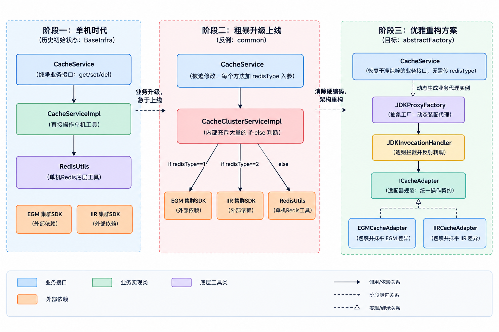
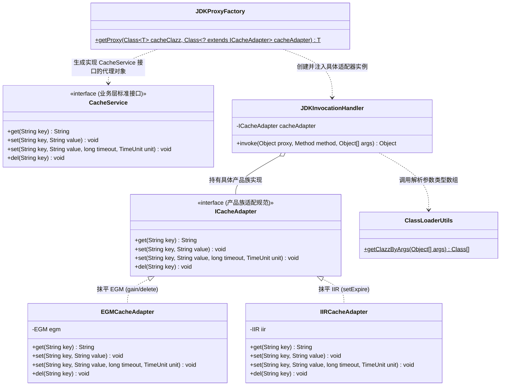
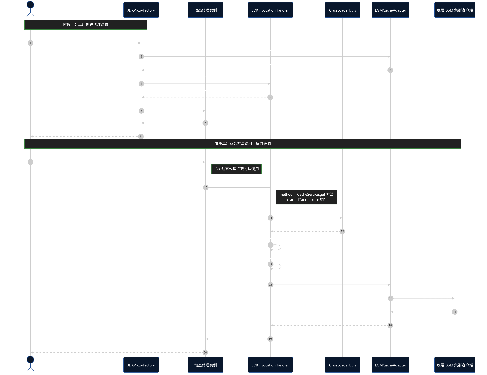
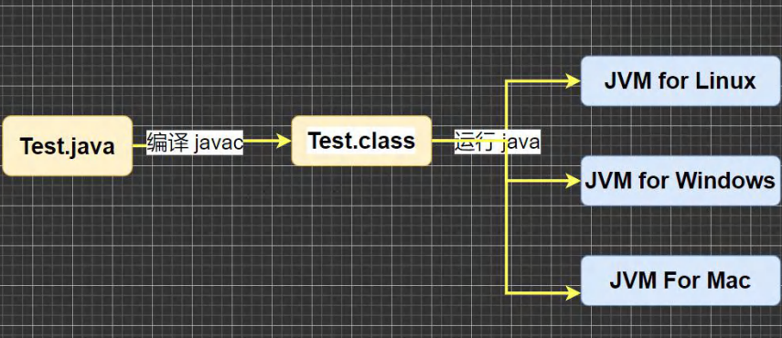
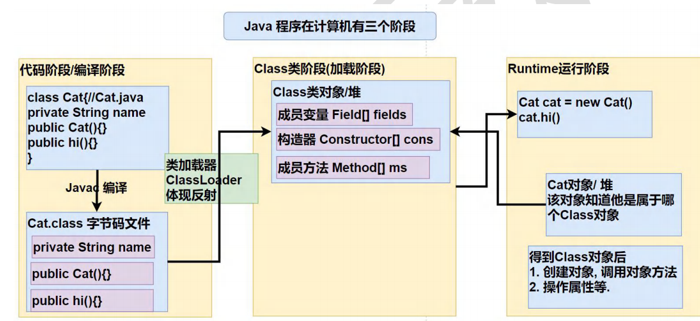

# 抽象工厂模式：Redis集群升级案例深度解析与题干剖析

本文档旨在帮助你彻底理清当前工程 `a2-AbstractFactorPattern` 中已有代码的业务背景、设计意图、存在的致命缺陷，以及**重构代码区（`com.ivanzhao.IDesign.abstractFactory` 与 `com.ivanzhao.test.abstractFactory`）**的详细设计原理、数据流转路径与动态代理/反射/泛型等核心技术细节。

---

## 目录
1. [业务场景背景：真实系统的架构升级痛点](#一业务场景背景真实系统的架构升级痛点)
2. [为什么案例分为三个部分？三阶段演进全景图](#二为什么案例分为三个部分三阶段演进全景图)
3. [题干代码逐类拆解（它们在干嘛？）](#三题干代码逐类拆解它们在干嘛)
   - 3.1 BaseInfra 基础设施层（单机旧实现与两套异构集群 SDK）
   - 3.2 common 粗暴升级方案（反面教材：if-else 堆砌与接口污染）
   - 3.3 test/common 单元测试中的调用方式与缺陷暴露
4. [为什么 common 是严重的设计反例？（四大致命痛点）](#四为什么-common-是严重的设计反例四大致命痛点)
5. [重构整体设计：抽象工厂在此处的角色与架构演进](#五重构整体设计抽象工厂在此处的角色与架构演进)
   - 5.1 什么是抽象工厂模式的本质？
   - 5.2 为什么结合了适配器模式与 JDK 动态代理？
   - 5.3 整体重构核心类图结构
6. [全链路数据流转追踪：一条缓存读写请求的完整旅程](#六全链路数据流转追踪一条缓存读写请求的完整旅程)
   - 6.1 运行时时序流转图
   - 6.2 步骤拆解：从业务端到底层 Redis 集群
7. [重构核心源码逐类深度精析（硬核技术点揭秘）](#七重构核心源码逐类深度精析硬核技术点揭秘)
   - 7.1 workshop 适配层：ICacheAdapter 与具体适配器
   - 7.2 factory 动态代理工厂：JDKProxyFactory（泛型全方位解密）
   - 7.3 factory 调用处理器：JDKInvocationHandler（核心跨接口反射调用）
   - 7.4 util 工具类：ClassLoaderUtils（基本类型装箱与接口对齐机制）
   - 7.5 test 单元测试：ApiTest（优雅的业务端零感知调用体验）
8. [核心认知盲区与易混淆点问答](#八核心认知盲区与易混淆点问答)
9. [重构前后终极效果对比总结](#九重构前后终极效果对比总结)

---

## 一、业务场景背景：真实系统的架构升级痛点

在互联网业务早期，数据量和并发量不高，系统通常直接使用**单机版 Redis**缓存服务即可满足需求。

随着公司业务爆发式增长，单机缓存逐渐遇到瓶颈：
- **容量上限**：内存受单台物理机限制；
- **容灾薄弱**：存在单点故障风险（SPOF）；
- **并发受限**：单机 CPU 与网卡 I/O 无法承载海量请求。

因此，技术架构委员会决定：**将单机 Redis 升级为 Redis 分布式集群架构**。

但是在大型企业落地架构升级时，往往面临极其复杂的现实约束：
1. **多套集群并存**：由于历史遗留、多机房异地容灾，或者采购了不同厂商/不同版本的 Redis 集群服务（本案例中模拟了 **EGM** 和 **IIR** 两套不同的集群）。
2. **API 规范不统一（异构接口）**：各集群客户端由不同团队或三方提供，方法命名各行其是：
   - 获取数据：EGM 叫 `gain(key)`，IIR 叫 `get(key)`；
   - 过期时间写入：EGM 叫 `setEx(...)`，IIR 叫 `setExpire(...)`；
   - 删除数据：EGM 叫 `delete(key)`，IIR 叫 `del(key)`。
3. **老单机 Redis 仍需平滑兼容**：一些旧业务可能还在单机上跑，不能一次性全部停机切断。

**核心矛盾与挑战**：  
上层有成百上千处业务代码依赖缓存服务。**如何在底层引入多套不同集群、抹平 API 命名差异的同时，让上层业务代码尽量不需要做任何改动（透明平滑切换）？**

---

## 二、为什么案例分为三个部分？三阶段演进全景图

工程中的目录划分完美再现了一个系统从粗暴应急到优雅重构的 **3 个演进阶段**：



- **阶段一（`BaseInfra`）**：基础设施层。提供单机 Redis 工具类和两套异构集群客户端 SDK 模拟类。
- **阶段二（`common`）**：赶工期写出的硬编码反例。在业务接口中强塞参数，在实现类中堆砌 `if-else`。
- **阶段三（`abstractFactory`）**：本工程的核心重构答题区。使用抽象工厂、适配器及动态代理模式，实现透明无感的架构解耦。

---

## 三、题干代码逐类拆解（它们在干嘛？）

### 3.1 BaseInfra 基础设施层（底层的原材料）

#### 1. `BaseInfra/redis/RedisUtils.java` —— 旧单机 Redis 模拟类
- **作用**：模拟最早期的**单机单体 Redis**工具。
- **实现原理**：内部维护了一个 `ConcurrentHashMap<String, String>` 模拟内存缓存。
- **提供的方法**：
  - `get(String key)`
  - `set(String key, String value)`
  - `set(String key, String value, long timeout, TimeUnit timeUnit)`
  - `del(String key)`
- **特点**：最符合标准直觉的规范命名。

#### 2. `BaseInfra/redis/cluster/EGM.java` —— 外部引入的 EGM 集群客户端
- **作用**：模拟某第三方厂商或第一套分布式缓存集群客户端。
- **提供的方法**（重点注意命名差异）：
  - `gain(String key)` ➡️ **查询叫 `gain`，而不是 `get`！**
  - `set(String key, String value)`
  - `setEx(String key, String value, long timeout, TimeUnit timeUnit)` ➡️ **设置超时写入叫 `setEx`！**
  - `delete(String key)` ➡️ **删除叫 `delete`，而不是 `del`！**

#### 3. `BaseInfra/redis/cluster/IIR.java` —— 外部引入的 IIR 集群客户端
- **作用**：模拟另一厂商或第二套分布式缓存集群客户端。
- **提供的方法**（重点注意命名差异）：
  - `get(String key)`
  - `set(String key, String value)`
  - `setExpire(String key, String value, long timeout, TimeUnit timeUnit)` ➡️ **设置超时写入叫 `setExpire`！**
  - `del(String key)`

#### 4. `BaseInfra/application/CacheService.java` 与 `CacheServiceImpl.java`
- **作用**：单机时代的业务服务层。
- **接口设计**：
  ```java
  public interface CacheService {
      String get(final String key);
      void set(String key, String value);
      void set(String key, String value, long timeout, TimeUnit timeUnit);
      void del(String key);
  }
  ```
- **实现方式**：`CacheServiceImpl` 内部直接 `new RedisUtils()`。上层业务代码只面向干净的 `CacheService` 接口编程。

---

### 3.2 common 粗暴升级方案（反面教材）

为了对接两套集群并兼容老单机 Redis，一些开发人员写出了 `common` 包的代码：

#### 1. 被破坏的接口：`common/CacheService.java`
```java
public interface CacheService {
    // 每一个业务方法都被迫增加了一个 int redisType 参数
    String get(final String key, int redisType);
    void set(String key, String value, int redisType);
    void set(String key, String value, long timeout, TimeUnit timeUnit, int redisType);
    void del(String key, int redisType);
}
```

#### 2. 充斥 if-else 的实现：`common/CacheClusterServiceImpl.java`
```java
public class CacheClusterServiceImpl implements CacheService {

    private RedisUtils redisUtils = new RedisUtils();
    private EGM egm = new EGM();
    private IIR iir = new IIR();

    public String get(String key, int redisType) {
        if (1 == redisType) {
            return egm.gain(key);   // 适配 EGM 的 gain
        }
        if (2 == redisType) {
            return iir.get(key);    // 适配 IIR 的 get
        }
        return redisUtils.get(key); // 降级单机
    }

    public void set(String key, String value, int redisType) {
        if (1 == redisType) {
            egm.set(key, value);
            return;
        }
        if (2 == redisType) {
            iir.set(key, value);
            return;
        }
        redisUtils.set(key, value);
    }
    // ... setEx/setExpire 和 del 同样全是重复的分支逻辑
}
```

### 3.3 test/common 单元测试中的调用方式与缺陷暴露

```java
@Test
public void test_CacheServiceAfterImpl() {
    CacheService cacheService = new CacheClusterServiceImpl();

    // 业务上层在读写时，必须明确知道 "1 代表 EGM 集群"，硬编码传参
    cacheService.set("user_name_01", "小傅哥", 1);
    String val01 = cacheService.get("user_name_01", 1);
    logger.info("缓存集群升级，测试结果：{}", val01);
}
```

---

## 四、为什么 common 是严重的设计反例？（四大致命痛点）

| 痛点维度 | 核心表现 | 严重后果 |
| :--- | :--- | :--- |
| **1. 接口污染与实现细节泄露** | 接口增加 `int redisType` | 违反**接口隔离原则**与**迪米特法则**。上层业务只想读写缓存，根本不需要也不应该知道底层到底是用 1 号集群还是 2 号集群。底层选型细节泄露给了业务层。 |
| **2. 上层改造成本呈雪崩式扩散** | 所有读写方法的入参签名全部被改动 | 系统中原本依赖老接口的上千处业务调用点全部编译报错，必须逐一修改并补传 `redisType`，极易漏改，改造成本不可承受。 |
| **3. 严重违反开闭原则（OCP）** | 分支判断全部硬编码在实现类中 | 若后续引入第 3 套集群（如阿里云 Redis），必须修改 `CacheClusterServiceImpl` 的每个方法，逐个追加 `else if (3 == redisType)`。代码越改越重，极易引发回归故障。 |
| **4. 异构 API 逻辑分散且无法独立测试** | EGM 的 `gain`、IIR 的 `setExpire` 散落在各个 if 分支内 | 缺少统一抽象契约，无法针对某个集群单独进行单元测试与 Mock。 |

---

## 五、重构整体设计：抽象工厂在此处的角色与架构演进

### 5.1 什么是抽象工厂模式的本质？
> **GoF 定义**：提供一个创建**一系列相关或相互依赖对象**的接口，而无需指定它们具体的类。

在当前 Redis 集群升级的实战场景中：
- **什么是“产品族”（Product Family）？**  
  某一个特定集群环境（EGM、IIR 或单机 Redis）所提供的**整套缓存操作能力（get / set / setEx / del）**，它们构成了一个完整的产品族。
- **什么是“抽象工厂”（Abstract Factory）？**  
  系统需要一个统一的生产入口，只要告诉它：“我要对接哪一套集群产品族”，它就能组装并交付出一个完全符合上层业务标准的缓存服务实例。

### 5.2 为什么结合了适配器模式与 JDK 动态代理？
单纯的传统 GoF 抽象工厂通常需要为每个产品定义一套具体接口实现。但在大型企业级重构中，往往需要做到**“上层零修改”**：
1. **适配器模式（`workshop` 包）**：用于**抹平异构 API 的差异**。将 EGM 的 `gain`、`delete` 和 IIR 的 `setExpire` 统一封装为标准的 `ICacheAdapter` 规范。
2. **JDK 动态代理（`factory` 包）**：用于**实现跨接口的无感粘合**。上层业务依赖的是老接口 `BaseInfra.application.CacheService`，底层适配器实现的是 `ICacheAdapter`。通过动态代理，在运行时动态拦截对 `CacheService` 的调用，并自动桥接到具体的 `ICacheAdapter` 实现上。
3. **抽象工厂（`JDKProxyFactory`）**：统一的工厂门面，负责将“目标业务接口”与“具体产品族适配器”组装，生产出代理实例。

### 5.3 整体重构核心类图结构



---

## 六、全链路数据流转追踪：一条缓存读写请求的完整旅程

为了彻底弄清楚重构代码在运行时是如何工作的，我们以测试用例中的一次查询调用为例，追踪其完整的数据流转路径：

### 6.1 运行时时序流转图



### 6.2 步骤拆解：从业务端到底层 Redis 集群

1. **代理生产**：`JDKProxyFactory.getProxy(...)` 接收期望实现的业务接口（`CacheService.class`）以及具体集群适配器类型（`EGMCacheAdapter.class`）。通过反射实例化适配器，组装进 `JDKInvocationHandler`，最终生成一个实现了 `CacheService` 接口的代理对象。
2. **业务调用**：业务端透明调用 `proxy_EGM.get("user_name_01")`。对业务端而言，它以为自己调用的就是一个普通的 `CacheService` 实现类。
3. **拦截分发**：JDK 动态代理机制拦截该调用，进入 `JDKInvocationHandler.invoke(proxy, method, args)`。此时的 `method` 对象代表 `CacheService` 接口中的 `get` 方法。
4. **参数对齐**：调用 `ClassLoaderUtils.getClazzByArgs(args)`，将实参对象转换为对应的 `Class<?>[]` 类型数组（处理自动装箱还原与接口对齐）。
5. **反射重定向**：在 `ICacheAdapter.class` 规范中查找到同名的 `get(String.class)` 方法对象，并在真实适配器 `EGMCacheAdapter` 上触发执行。
6. **抹平与落地**：`EGMCacheAdapter` 将标准的 `get` 调用转换为底层异构客户端原生的 `egm.gain("user_name_01")`，从底层存储获取数据并原路层层返回。

---

## 七、重构核心源码逐类深度精析（硬核技术点揭秘）

### 7.1 workshop 适配层：统一操作规范

#### 1. `workshop/ICacheAdapter.java`
定义了所有集群产品族必须共同遵守的**标准 CRUD 契约**：
```java
public interface ICacheAdapter {
    String get(String key);
    void set(String key, String value);
    void set(String key, String value, long timeout, TimeUnit timeUnit);
    void del(String key);
}
```
> **设计意图**：不管底层厂商是叫 `gain` 还是 `delete`，在适配层必须统一成标准的 `get`、`set`、`del`。

#### 2. `workshop/impl/EGMCacheAdapter.java` 与 `IIRCacheAdapter.java`
具体的适配器实现类。以 `EGMCacheAdapter` 为例：
```java
public class EGMCacheAdapter implements ICacheAdapter {
    private EGM egm = new EGM();

    @Override
    public String get(String key) {
        return egm.gain(key); // 将 gain 包装对齐为 get
    }

    @Override
    public void set(String key, String value, long timeout, TimeUnit timeUnit) {
        egm.setEx(key, value, timeout, timeUnit); // 将 setEx 包装对齐为 set
    }

    @Override
    public void del(String key) {
        egm.delete(key); // 将 delete 包装对齐为 del
    }
}
```
> ⚠️ **澄清一个关键误区**：  
> 底层的 `EGM` 类并没有实现 `ICacheAdapter`。真正实现 `ICacheAdapter` 的是 `EGMCacheAdapter`！它充当适配器（Adapter），把底层的怪异 API 抹平成标准形式。

---

### 7.2 factory 动态代理工厂：`JDKProxyFactory.java`

这个类是整个抽象工厂模式的核心工厂实现，包含多项 Java 高级技术：

```java
public static <T> T getProxy(Class<T> cacheClazz, Class<? extends ICacheAdapter> cacheAdapter) throws Exception {
    InvocationHandler handler = new JDKInvocationHandler(cacheAdapter.newInstance());
    //线程本身不是因为并发而拥有独立 ClassLoader；线程只是可以携带一个 ContextClassLoader。不同线程可以携带不同的 ContextClassLoader，也完全可以共用同一个。
    //框架代码的 ClassLoader ≠ 当前应用代码的 ClassLoader 时，如果框架需要动态加载“调用方提供的类”，ContextClassLoader 可以让它根据当前运行上下文选择合适的 ClassLoader。这也是为什么你在动态代理、SPI、JDBC、Tomcat/Spring 这些地方会反复看到它。
    ClassLoader classLoader = Thread.currentThread().getContextClassLoader();
    return (T) Proxy.newProxyInstance(classLoader, new Class[]{cacheClazz}, handler);
}
```

#### 深入剖析泛型签名：`<T> T getProxy(...)`
1. **`<T>`（方法级泛型声明）**：表示这是一个泛型方法，`T` 是一个类型占位符，由调用方传入的参数动态推导决定。
2. **`Class<T> cacheClazz`**：
   - 限制传入的 Class 必须与泛型 `T` 一致。
   - 例如传入 `CacheService.class`，那么 `T` 就被推导为 `CacheService`。
   - **巨大好处**：返回值直接就是 `T` 类型，调用方写 `CacheService proxy = JDKProxyFactory.getProxy(...)` 时**完全不需要强制类型转换**，兼顾了优雅与编译期类型安全！
3. **`Class<? extends ICacheAdapter> cacheAdapter`（上限通配符）**：
   - `? extends ICacheAdapter` 表示：传入的 Class 必须是 `ICacheAdapter` 本身或其子类/实现类（如 `EGMCacheAdapter.class`）。
   - 如果传一个毫不相干的 `String.class`，在**代码编译阶段就会报错**，将错误扼杀在编译期。
4. **`cacheAdapter.newInstance()`**：
   - 使用反射调用具体适配器类的无参构造方法，动态创建具体的适配器实例对象并交给 Handler 持有。
5. **`Proxy.newProxyInstance(...)` 的三大核心参数**：
   - `classLoader`：负责将内存中动态生成的代理类字节码加载进 JVM；
   - `new Class[]{cacheClazz}`：让动态生成的代理类在语法上实现业务接口（如 `CacheService`）；
   - `handler`：指定代理对象收到方法调用时委派给谁处理。
6. `Proxy.newProxyInstance`的第二个参数是数组的原因

```java
Proxy.newProxyInstance(
    ClassLoader loader, // 用哪个类加载器
    Class<?>[] interfaces,  // 代理对象要实现哪些接口
    InvocationHandler h   // 这些接口的方法被调用后交给谁处理
)
```

**一个代理对象可以同时实现多个接口**，所以它接收的第二个参数不是一个 `Class`，而是一个 **`Class<?>[]` 数组**。

`Class` 表示一个类型；`Class[]` 表示一组类型。JDK 动态代理允许一个代理对象实现多个接口，所以 `newProxyInstance()` 要求传入 `Class<?>[]`。

7. 类加载器这个参数的作用是啥？为啥要传入一个类加载器来实现proxy？

告诉 JVM：这个动态生成出来的代理类，要由谁来加载、放到哪个类加载器的命名空间里。

Java 程序运行时，`.class` 文件不是直接就能使用的。

```
.class 文件
    ↓
ClassLoader（类加载器）
    ↓
JVM 中的 Class 对象
    ↓
可以创建对象、调用方法
```

8.类加载器详解

`ClassLoader` 是 JVM 中负责把类的二进制数据加载进 JVM，并生成对应 `Class` 对象的机制。

> 比如你有：
>
> ##### public class UserService {

    public void hello() {

        System.out.println("hello");

    }

}
>
> 编译以后：
>
> 
>
> ```
> UserService.java
>       ↓ javac
> UserService.class
> ```
>
> 运行的时候：
>
> ```
> UserService.class
>       ↓
> ClassLoader
>       ↓
> JVM 中的 Class<UserService>
>       ↓
> new UserService()
> ```
>
> 所以：
>
> ```
> UserService.class
> ```
>
> 不是 `.class` 文件本身。
>
> 它是：
>
> > **JVM 中描述 `UserService` 这个类型的 `Class` 对象。**
>
> #### 二、一个非常重要的问题：为什么需要 ClassLoader？
>
> JVM 直接把所有 `.class` 文件加载进来不就行了吗？
>
> 问题是：
>
> **Java 程序运行的时候，并不知道你到底会用到哪些类。**
>
> 比如：
>
> ```
> public class Main {
>     public static void main(String[] args) {
>         UserService service = new UserService();
>     }
> }
> ```
>
> JVM 运行到这里，需要 `UserService`。
>
> 但是一个大型 Java 项目可能有：
>
> ```
> 几十万个 .class
> ```
>
> JVM 不可能一启动就把所有类全部加载。
>
> 所以 Java 采用：
>
> > **按需加载（Lazy Loading）**
>
> 也就是：
>
> ```
> 程序启动
>    ↓
> 先加载需要的类
>    ↓
> 运行过程中发现需要其他类
>    ↓
> ClassLoader 加载它
>    ↓
> 继续运行
> ```
>
> 例如：
>
> ```
> UserService service = new UserService();
> ```
>
> JVM 发现需要：
>
> ```
> UserService
> ```
>
> 于是：
>
> ```
> ClassLoader
>     ↓
> 找到 UserService.class
>     ↓
> 加载
>     ↓
> 得到 Class<UserService>
>     ↓
> JVM 后续才能使用这个类
> ```
>
> ------
>
> ##### 三、这里有一个面试特别喜欢问的问题
>
> ##### “类加载”和“对象创建”是一回事吗？
>
> **不是。**
>
> 这是非常重要的区别。
>
> 例如：
>
> ```
> UserService userService = new UserService();
> ```
>
> 不要把它理解成：
>
> ```
> new UserService()
>     ↓
> 加载 UserService
>     ↓
> 创建对象
> ```
>
> 更准确地说：
>
> ```
> UserService.class
>        ↓
>    类加载
>        ↓
> Class<UserService>
>        ↓
>    类初始化
>        ↓
>    new UserService()
>        ↓
> UserService 对象
> ```
>
> 也就是说：
>
> > **ClassLoader 负责的是“类”，不是“对象”。**
>
> ------
>
> ##### 四、那一个 ClassLoader 到底加载了什么？
>
> 你可以简单理解成：
>
> ```
> .class 文件
>     ↓
> ClassLoader
>     ↓
> Class 对象
> ```
>
> 例如：
>
> ```
> Class<?> clazz = Class.forName("com.xxx.UserService");
> ```
>
> 最终：
>
> ```
> clazz
> ```
>
> 就是一个：
>
> ```
> Class<UserService>
> ```
>
> 对象。
>
> 所以你之前学到的：
>
> ```
> CacheService.class
> ```
>
> 本质上就是：
>
> ```
> JVM 中 CacheService 这个类对应的 Class 对象
> ```
>
> 而：
>
> ```
> CacheService.class.getClassLoader()
> ```
>
> 可以获得：
>
> > **加载 `CacheService` 这个类的 ClassLoader。**
>
> 这句话非常重要。
>
> ------
>
> ##### 五、Java 为什么需要多个 ClassLoader？
>
> 这就是面试真正开始深入的地方。
>
> JVM 不是只有一个 ClassLoader。
>
> 常见的可以理解成：
>
> ```
>                 JVM
>                  │
>        ┌─────────┴─────────┐
>        ↓                   ↓
> Bootstrap ClassLoader   其他 ClassLoader
>                            │
>                   Platform ClassLoader
>                            │
>                   Application ClassLoader
>                            │
>                      自定义 ClassLoader
> ```
>
> 不同版本的 Java 对名称有变化，但面试时你现在重点掌握这三个：
>
> ### 1. Bootstrap ClassLoader
>
> 负责加载 Java 核心类。
>
> 例如：
>
> ```
> String
> Object
> Integer
> Class
> ```
>
> 这些属于 Java 核心类库。
>
> ------
>
> ### 2. Platform ClassLoader
>
> 负责平台相关类。
>
> 以前 Java 8 叫：
>
> ```
> Extension ClassLoader
> ```
>
> Java 9 以后改成了：
>
> ```
> Platform ClassLoader
> ```
>
> 主要负责加载：
>
> > **JDK 平台模块中的非核心平台类。**
>
> 例如一些：
>
> ```
> java.sql
> java.xml
> java.desktop
> jdk.*
> ```
>
> 等平台相关模块。
>
> ------
>
> ### 3. Application ClassLoader
>
> 也叫：
>
> ```
> AppClassLoader
> ```
>
> 通常负责加载我们自己应用程序 Classpath 下的类。
>
> 比如你的：
>
> ```
> CacheService
> EGMCacheAdapter
> JDKProxyFactory
> ```
>
> 通常就是它加载的。
>
> 所以你现在写：
>
> ```
> Thread.currentThread().getContextClassLoader()
> ```
>
> 拿到的很多时候就是应用程序相关的 ClassLoader。
>
> ##### 在一个普通 Java 应用里
>
> 通常你可以理解为：
>
> > **一个 JVM 中通常有一个默认的 Application ClassLoader。**
>
> 例如你的普通 Maven Java 项目：
>
> ```
> JVM
>  │
>  └── Application ClassLoader
>         │
>         ├── Main
>         ├── CacheService
>         ├── EGMCacheAdapter
>         └── JDKProxyFactory
> ```
>
> 你可以通过：
>
> ```
> ClassLoader loader =
>         ClassLoader.getSystemClassLoader();
> ```
>
> 获得系统默认的 Application ClassLoader。
>
> ------
>
> ##### 但是：JVM 并不是规定“只能有一个 Application ClassLoader”
>
> 这是非常重要的。
>
> Java **允许创建多个自定义 ClassLoader**。
>
> 例如：
>
> ```
> JVM
> │
> ├── Application ClassLoader
> │
> ├── MyClassLoader1
> │
> ├── MyClassLoader2
> │
> └── MyClassLoader3
> ```
>
> 所以：
>
> > **Application ClassLoader 通常指一个特定的系统类加载器，而不是“所有应用类加载器的统称”。**
>
> 而整个 JVM 中可以存在很多 ClassLoader。
>
> 例如 Tomcat 就会创建自己的 WebApp ClassLoader。
>
> ------
>
> ##### 三、Tomcat 为什么需要多个 ClassLoader？
>
> 这正好对应你刚才的疑问。
>
> 假设 Tomcat：
>
> ```
> Tomcat
> │
> ├── WebApp1
> │    └── com.xxx.User
> │
> └── WebApp2
>      └── com.xxx.User
> ```
>
> 两个 WebApp 都有：
>
> ```
> com.xxx.User
> ```
>
> Tomcat 可以让：
>
> ```
> WebApp1ClassLoader
>         ↓
> WebApp1 的 User
> 
> WebApp2ClassLoader
>         ↓
> WebApp2 的 User
> ```
>
> 这样两个应用互相隔离。
>
> 这就是：
>
> > **ClassLoader 提供的命名空间隔离。**
>
> 所以 ClassLoader 不只是：
>
> > “帮我把 `.class` 文件读进来。”
>
> 还承担：
>
> > **“这个类属于哪个类加载命名空间？”**
>
> ------
>
> ##### 六、为什么要搞这么多个？
>
> 这里涉及一个非常重要的思想：
>
> > **类的来源不同、权限不同、隔离要求不同。**
>
> 例如 Java 核心类：
>
> ```
> java.lang.String
> ```
>
> 肯定不能让你随便写一个：
>
> ```
> java.lang.String
> ```
>
> 然后把 JVM 原来的 String 替换掉。
>
> 所以 Java 核心类由更高层的 ClassLoader 负责。
>
> 而你的：
>
> ```
> com.xxx.CacheService
> ```
>
> 由应用程序自己的 ClassLoader 加载。
>
> 这样就形成了一种层次和隔离。
>
> ------
>
> ##### 七、然后就到了面试必问：双亲委派
>
> ClassLoader 最经典的问题之一：
>
> > **什么是双亲委派模型？**
>
> 先不要急着背定义。
>
> 看这个问题：
>
> 假设你写了一个：
>
> ```
> java.lang.String
> ```
>
> 然后你调用：
>
> ```
> Class.forName("java.lang.String");
> ```
>
> JVM 到底加载你写的 String，还是 JDK 自己的 String？
>
> 答案：
>
> > **JDK 自己的。**
>
> 为什么？
>
> 因为 ClassLoader 加载一个类的时候，通常不是自己直接加载。
>
> 而是：
>
> ```
> 当前 ClassLoader
>        ↓
> 先问父 ClassLoader
>        ↓
> 父再问自己的父
>        ↓
> 一直向上
>        ↓
> Bootstrap
>        ↓
> 父加载不了
>        ↓
> 子 ClassLoader 再尝试自己加载
> ```
>
> 这就是：
>
> > **双亲委派模型（Parent Delegation Model）**
>
> 核心就是：
>
> > **子加载器收到加载请求以后，优先把请求委派给父加载器。**
>
> ClassLoader 收到“加载某个类”的请求，然后向自己的 parent 委派。
>
> Bootstrap、Platform、Application 之间主要体现的是 ClassLoader 的父子委派关系，而不是简单的 Java 类继承关系。Bootstrap 本身还是 JVM 内部实现的特殊类加载器。
>
> | 加载器      | Java代码能否直接获得 | 主要职责                         |
> | ----------- | -------------------- | -------------------------------- |
> | Bootstrap   | ❌ 没有普通 Java 对象 | 加载核心 Java 运行时类           |
> | Platform    | ✅                    | 加载 JDK 平台类                  |
> | Application | ✅                    | 加载应用程序类、classpath 上的类 |
>
> ------
>
> ##### 八、为什么要这么设计？
>
> 最重要的原因之一：
>
> ## 防止核心类被篡改
>
> 例如：
>
> ```
> 你自己写：
> java.lang.String
> ```
>
> 如果 Application ClassLoader 上来就：
>
> ```
> “发现 String.class，我加载！”
> ```
>
> 那你岂不是可以替换 Java 核心 String？
>
> 显然不行。
>
> 双亲委派：
>
> ```
> Application ClassLoader
>         ↓
> Platform
>         ↓
> Bootstrap
>         ↓
> Bootstrap 找到了 java.lang.String
>         ↓
> 直接使用 JDK 的 String
> ```
>
> 于是你自己写的：
>
> ```
> java.lang.String
> ```
>
> 没有机会成为 JVM 使用的那个 String。
>
> 所以面试可以回答：
>
> > **双亲委派的主要作用之一是保证类加载的层次性和安全性，避免应用程序自定义的类冒充 Java 核心类。**
>
> ------
>
> ##### 九、但这里有一个非常重要的概念：类的唯一性
>
> 这是 ClassLoader 最容易被问深的地方。
>
> 很多人会背：
>
> > “类的全限定名唯一。”
>
> 这句话**不严谨**。
>
> 真正重要的是：
>
> > **一个类在 JVM 中的唯一身份，不仅由类的全限定名决定，还与定义它的 ClassLoader 有关。**
>
> 也就是：
>
> ```
> 类身份 ≈ 全限定类名 + 定义该类的 ClassLoader
> ```
>
> 例如：
>
> ```
> com.xxx.User
> ```
>
> 由：
>
> ```
> ClassLoader A
> ```
>
> 加载。
>
> 和：
>
> ```
> com.xxx.User
> ```
>
> 由：
>
> ```
> ClassLoader B
> ```
>
> 加载。
>
> 虽然名字完全一样：
>
> ```
> com.xxx.User
> ```
>
> 但是 JVM 可以认为：
>
> > **这是两个不同的类。**
>
> ------
>
> ##### 十、这件事情为什么重要？
>
> 假设：
>
> ```
> ClassLoader A
>     ↓
> User.class
> 
> ClassLoader B
>     ↓
> User.class
> ```
>
> 那么：
>
> ```
> A加载的User
> ```
>
> 和：
>
> ```
> B加载的User
> ```
>
> 不能简单认为是同一个类型。
>
> 甚至可能出现：
>
> ```
> ClassCastException
> ```
>
> 这种情况。
>
> 这也是为什么大型 Java 容器需要 ClassLoader 隔离。
>
> 例如：
>
> ```
> Tomcat
> ├── WebApp1 ClassLoader
> │     └── User.class
> │
> └── WebApp2 ClassLoader
>       └── User.class
> ```
>
> 两个 Web 应用完全可以存在同名类：
>
> ```
> com.xxx.User
> ```
>
> 但它们可以互相隔离。
>
> ------
>
> ##### 十一、现在回到你最开始的问题
>
> 终于可以解释：
>
> ```
> Proxy.newProxyInstance(
>     classLoader,
>     new Class[]{cacheClazz},
>     handler
> );
> ```
>
> 为什么第一个参数必须是：
>
> ```
> classLoader
> ```
>
> 因为：
>
> > **JDK 动态代理不是返回一个你已经写好的代理类，而是运行时动态生成一个新的代理类。**
>
> 比如：
>
> ```
> CacheService
>     ↓
> JDK 动态代理
>     ↓
> 生成类似 $Proxy0 的代理类
> ```
>
> 这个：
>
> ```
> $Proxy0
> ```
>
> 不是你提前写好的。
>
> JDK 运行时生成它。
>
> 那么问题来了：
>
> > **这个新生成的 `$Proxy0` 属于哪个类加载器？**
>
> 所以 API 要你告诉它：
>
> ```
> ClassLoader
> ```
>
> ------
>
> ##### 十二、这时候第二个参数就更好理解了
>
> 你的代码：
>
> ```
> Proxy.newProxyInstance(
>     classLoader,
>     new Class[]{cacheClazz},
>     handler
> );
> ```
>
> 实际上是在告诉 JDK 三件事：
>
> ### ① `classLoader`
>
> ```
> classLoader
> ```
>
> > **这个动态生成的代理类由谁加载？**
>
> ------
>
> ### ② `interfaces`
>
> ```
> new Class[]{cacheClazz}
> ```
>
> > **这个代理类需要实现哪些接口？**
>
> 例如：
>
> ```
> new Class[]{
>     CacheService.class
> }
> ```
>
> 就是：
>
> ```
> 生成一个代理类
>         ↓
> 实现 CacheService
> ```
>
> ------
>
> ### ③ `handler`
>
> ```
> handler
> ```
>
> > **代理对象的方法调用最终交给谁处理？**
>
> 所以你可以把整个 API 理解成：
>
> ```
> 我要创建一个动态代理：
> 
> ① 由谁加载？
>    ↓
> ClassLoader
> 
> ② 代理要实现什么？
>    ↓
> Class<?>[]
> 
> ③ 方法调用交给谁？
>    ↓
> InvocationHandler
> ```
>
> ------
>
> ##### 十三、那为什么这里使用 `Thread.currentThread().getContextClassLoader()`？
>
> 你代码：
>
> ```
> ClassLoader classLoader =
>     Thread.currentThread().getContextClassLoader();
> ```
>
> 这里实际上有两个知识点。
>
> ### 第一层
>
> ```
> Thread.currentThread()
> ```
>
> 得到当前线程。
>
> ### 第二层
>
> ```
> .getContextClassLoader()
> ```
>
> 得到当前线程的**上下文类加载器**。
>
> 然后：
>
> ```
> Proxy.newProxyInstance(
>     classLoader,
>     ...
> );
> ```
>
> 把它作为动态代理类的加载器。
>
> ------
>
> ##### 十四、为什么不直接这样？
>
> 其实你可能会看到另外一种写法：
>
> ```
> CacheService.class.getClassLoader()
> ```
>
> 例如：
>
> ```
> Proxy.newProxyInstance(
>     CacheService.class.getClassLoader(),
>     new Class[]{CacheService.class},
>     handler
> );
> ```
>
> 这也很有道理。
>
> 因为：
>
> ```
> CacheService.class.getClassLoader()
> ```
>
> 表示：
>
> > **加载 CacheService 的那个 ClassLoader。**
>
> 而动态代理要实现：
>
> ```
> CacheService
> ```
>
> 那么使用能够看到 `CacheService` 的 ClassLoader 通常是合理的。
>
> ------
>
> ##### 十五、那为什么很多代码喜欢用 Thread Context ClassLoader？
>
> 这是 Java 生态里面一个比较重要的设计。
>
> 尤其是：
>
> ```
> Tomcat
> Spring
> SPI
> 插件系统
> JDBC
> 各种框架
> ```
>
> 经常会涉及上下文 ClassLoader。
>
> 因为：
>
> > **调用方的 ClassLoader 和当前执行框架的 ClassLoader 有时候不是同一个。**
>
> `Thread Context ClassLoader` 给了框架一种方式：
>
> > “不要死板地使用我自己的 ClassLoader，使用当前线程上下文指定的 ClassLoader。”
>
> 这个机制对于复杂容器环境尤其重要。
>
> ------
>
> ##### 十六、你现在可以把 ClassLoader 理解成“四层”
>
> 如果准备面试，我建议你不要只背一句定义，而是形成下面这个体系：
>
> ```
>                     ClassLoader
>                         │
>        ┌────────────────┼────────────────┐
>        ↓                ↓                ↓
>    1. 做什么？       2. 怎么做？       3. 为什么？
>        │                │                │
>    加载类             双亲委派          安全/隔离
>        │
>        ↓
>   .class → Class
> ```
>
> 再往下：
>
> ```
> ClassLoader
>     │
>     ├── Bootstrap
>     ├── Platform
>     ├── Application
>     └── 自定义 ClassLoader
> ```
>
> 再往下：
>
> ```
> 类的身份
>     =
> 全限定类名
>     +
> 定义该类的 ClassLoader
> ```
>
> 再往下：
>
> ```
> 动态代理
>     ↓
> 运行时生成代理类
>     ↓
> 必须指定 ClassLoader
>     ↓
> 决定这个代理类进入哪个类加载体系
> ```
>
> 这样就串起来了。
>
> ------
>
> ##### 十七、面试官如果一路追问，你可以这样回答
>
> ### Q1：什么是 ClassLoader？
>
> > ClassLoader 是 JVM 中负责加载类的机制，它将类的二进制数据加载到 JVM，并生成对应的 `Class` 对象，使 JVM 能够使用这个类型。
>
> ------
>
> ### Q2：为什么 Java 要使用 ClassLoader？
>
> > 主要是为了实现类的动态加载和按需加载，同时通过不同 ClassLoader 实现类的隔离和命名空间管理。
>
> ------
>
> ### Q3：Java 有哪些常见的 ClassLoader？
>
> > Java 9 以后主要可以从 Bootstrap ClassLoader、Platform ClassLoader 和 Application ClassLoader 来理解，此外还可以存在自定义 ClassLoader。
>
> ------
>
> ### Q4：什么是双亲委派？
>
> > 一个 ClassLoader 收到类加载请求后，通常会先委托父 ClassLoader 尝试加载，父加载失败后，子 ClassLoader 才尝试自己加载。
>
> ------
>
> ### Q5：为什么需要双亲委派？
>
> > 一方面保证类加载的层次性，另一方面避免应用程序自定义类覆盖 Java 核心类，从而提高安全性和稳定性。
>
> ------
>
> ### Q6：`Class` 相同是不是说明是同一个类？
>
> 这里就要开始体现水平了：
>
> > 不一定。JVM 判断类身份时不仅考虑全限定类名，还考虑定义这个类的 ClassLoader。相同类名如果由不同的 ClassLoader 定义，可以被 JVM 视为不同的类。
>
> ------
>
> ### Q7：动态代理为什么需要 ClassLoader？
>
> > 因为 JDK 动态代理会在运行时生成代理类，而不是使用一个提前编写好的代理类，因此需要指定由哪个 ClassLoader 加载这个动态生成的代理类，同时保证代理类能够访问并实现指定的接口。
>
> ------
>
> ##### 十八、最后把你这个 `Proxy.newProxyInstance()` 真正吃透
>
> 你现在再看：
>
> ```
> return (T) Proxy.newProxyInstance(
>     classLoader,
>     new Class[]{cacheClazz},
>     handler
> );
> ```
>
> 应该能够翻译成：
>
> ```
>                  JDK 动态代理
>                        │
>           “给我运行时生成一个代理类”
>                        │
>         ┌──────────────┼──────────────┐
>         ↓              ↓              ↓
>     ClassLoader     Interface       Handler
>         ↓              ↓              ↓
>    谁加载代理类？   实现什么接口？    调用怎么处理？
>         ↓              ↓              ↓
>    classLoader    CacheService.class   handler
> ```
>
> 然后：
>
> ```
>                 生成 $Proxy0
>                     │
>                     │ implements
>                     ↓
>               CacheService
>                     │
>                     │ 方法调用
>                     ↓
>              InvocationHandler
>                     │
>                     ↓
>                 反射调用
>                     │
>                     ↓
>             EGMCacheAdapter
> ```
>
> **这时候你就会发现：ClassLoader 并不是动态代理“业务逻辑”的一部分。**
>
> 它解决的是一个更底层的问题：
>
> > **“JVM 里这个运行时生成的新类，属于哪个类加载命名空间，由谁把它加载进来？”**
>
> 这也是为什么它看起来和 `CacheService`、`InvocationHandler` 没什么关系，却必须作为 `Proxy.newProxyInstance()` 的参数存在。

---

### 7.3 factory 调用处理器：`JDKInvocationHandler.java`

这是连接业务层与底层适配层的“核心路由器”：

```java
public class JDKInvocationHandler implements InvocationHandler {

    private ICacheAdapter cacheAdapter;

    public JDKInvocationHandler(ICacheAdapter cacheAdapter) {
        this.cacheAdapter = cacheAdapter;
    }

    @Override
    public Object invoke(Object proxy, Method method, Object[] args) throws Throwable {
        return ICacheAdapter.class
                .getMethod(method.getName(), ClassLoaderUtils.getClazzByArgs(args))
                .invoke(cacheAdapter, args);
    }
}
```

#### 深度揭秘：为什么不能直接写 `method.invoke(cacheAdapter, args)`？
很多初学者在这里会产生巨大困惑：
> “`method` 不是已经代表正在调用的方法了吗？为什么不能直接 `method.invoke(cacheAdapter, args)`，非要绕一圈通过 `ICacheAdapter.class.getMethod(...)` 再查一遍？”

**这是 Java 反射体系中极其关键的一个硬核知识点：**
1. 传入的 `method` 对象来自于业务接口：`BaseInfra.application.CacheService`。
2. 此时 `method.getDeclaringClass()` 是 `CacheService.class`。
3. 但是我们持有的 `cacheAdapter` 对象实现的是 `workshop.ICacheAdapter`，它**根本没有实现 `CacheService` 接口**！
4. 如果你直接执行 `method.invoke(cacheAdapter, args)`，JVM 会在运行时立即抛出致命异常：  
   `java.lang.IllegalArgumentException: object is not an instance of declaring class`  
   （即：传入的目标对象并不是声明该方法的类的实例）。
5. **解决方案**：  
   必须以 `method.getName()`（方法名）为纽带，拿着方法名和参数类型列表，在 `ICacheAdapter.class` 中重新查找属于 `ICacheAdapter` 规范的同名 Method 对象，然后再在 `cacheAdapter` 上执行！  
   这行代码堪称全篇设计的点睛之笔，巧妙地实现了**跨接口的无感反射桥接**！
6. 反射示意图



---

### 7.4 util 工具类：`ClassLoaderUtils.java`

在通过反射执行 `ICacheAdapter.class.getMethod(name, parameterTypes)` 时，必须准确提供参数类型数组 `parameterTypes`。`ClassLoaderUtils` 的精妙之处在于解决了反射中的两大隐蔽深坑：

```java
public static Class<?>[] getClazzByArgs(Object[] args) {
    Class<?>[] parameterTypes = new Class[args.length];
    for (int i = 0; i < args.length; i++) {
        if (args[i] instanceof ArrayList) {
            parameterTypes[i] = List.class;
            continue;
        }
        if (args[i] instanceof LinkedList) {
            parameterTypes[i] = List.class;
            continue;
        }
        if (args[i] instanceof HashMap) {
            parameterTypes[i] = Map.class;
            continue;
        }
        if (args[i] instanceof Long){
            parameterTypes[i] = long.class; // 关键处理！
            continue;
        }
        if (args[i] instanceof Double){
            parameterTypes[i] = double.class;
            continue;
        }
        if (args[i] instanceof TimeUnit){
            parameterTypes[i] = TimeUnit.class;
            continue;
        }
        parameterTypes[i] = args[i].getClass();
    }
    return parameterTypes;
}
```

#### 深坑一：基本数据类型的“自动装箱”陷阱
- 接口中声明的方法参数是基本类型：`long timeout`；
- 但是在动态代理执行时，所有实参都被装入 `Object[] args`。在放入数组时，Java 编译器会自动进行**自动装箱（Autoboxing）**，基本类型 `long` 变成了包装类 `java.lang.Long` 对象；
- 如果直接写 `args[i].getClass()`，拿到的将是 `Long.class`；
- 当拿 `Long.class` 去找 `getMethod("set", String.class, String.class, Long.class, TimeUnit.class)` 时，JVM 会直接抛出 `NoSuchMethodException`！因为接口方法声明的是 `long.class`，基本类型与包装类在反射中是**两个截然不同的 Class 对象**；
- **解决方式**：判断 `if (args[i] instanceof Long)`，如果是，则手动校准为基本类型的 `long.class`！

#### 深坑二：面向接口编程与集合多态性
- 业务方法参数通常声明为抽象接口（如 `List` 或 `Map`）；
- 但实际传入的实参对象往往是具体的实现类（如 `ArrayList` 或 `HashMap`）；
- 如果直接用实参的 `getClass()`，反射查找时会拿着 `ArrayList.class` 去接口里找匹配的方法，同样会因为签名不匹配导致反射失败；
- **解决方式**：将 `ArrayList` / `LinkedList` 显式对齐为接口类型 `List.class`。

---

### 7.5 test 单元测试：`ApiTest.java`（业务端的无感体验）

```java
@Test
public void test_CacheService() throws Exception {
    // 1. 使用 EGM 集群产品族
    CacheService proxy_EGM = JDKProxyFactory.getProxy(CacheService.class, EGMCacheAdapter.class);
    proxy_EGM.set("user_name_01", "小傅哥");
    String val01 = proxy_EGM.get("user_name_01");
    logger.info("缓存服务 EGM 测试，proxy_EGM.get 测试结果：{}", val01);

    // 2. 切换为 IIR 集群产品族
    CacheService proxy_IIR = JDKProxyFactory.getProxy(CacheService.class, IIRCacheAdapter.class);
    proxy_IIR.set("user_name_01", "小傅哥");
    String val02 = proxy_IIR.get("user_name_01");
    logger.info("缓存服务 IIR 测试，proxy_IIR.get 测试结果：{}", val02);
}
```

观察测试代码，体会设计的极致优雅：
1. **纯净无侵入**：调用的全部是原生的 `get(key)`、`set(key, val)`，**完全没有 `int redisType` 这个恶心参数**；
2. **解耦透明**：业务代码只和 `CacheService` 接口打交道。未来要切换底层集群，业务代码一行不用动，只需在 Spring 配置或工厂处将 `EGMCacheAdapter.class` 改为 `IIRCacheAdapter.class`。

---

## 八、核心认知盲区与易混淆点问答

### Q1：为什么这里使用了 JDK 动态代理，它到底代替了什么？
> **答**：在没有动态代理的情况下，如果你想让 `EGMCacheAdapter` 能被当作 `CacheService` 使用，你必须让 `EGMCacheAdapter implements CacheService`。  
> 但如果系统有 10 套三方客户端、5 种业务缓存接口，你就要手工写几十个包装类！  
> **动态代理的价值在于“批量自动化”**：通过反射机制，一行代理工厂代码即可为任意适配器动态生成目标业务接口的实现，极大地解放了生产力。

### Q2：为什么我的注释里写 `new EGM()`，但实际传给工厂的是 `EGMCacheAdapter.class`？
> **答**：这是容易概念混淆的地方。`EGM` 是第三方提供的不可修改的 SDK，它的方法叫 `gain`，根本没有 `get`。  
> 如果直接把 `EGM` 传给反射，反射去查 `getMethod("get")` 会直接报错。  
> 必须由 `EGMCacheAdapter` 先实现 `ICacheAdapter` 标准，在内部完成 `gain -> get` 的翻译，再交给工厂。

---

## 九、重构前后终极效果对比总结

| 对比维度 | common 包（粗暴硬编码反例） | abstractFactory 包（抽象工厂优雅重构） |
| :--- | :--- | :--- |
| **设计模式** | 无模式（面向过程的条件堆砌） | **抽象工厂 + 适配器模式 + JDK 动态代理** |
| **业务接口纯净度** | 被污染：强制多传 `int redisType` | **极致纯净**：保持标准的 `get(key)` / `set(key, val)` |
| **上层业务侵入性** | **巨大**：所有业务调用点全部必须修改代码 | **零侵入**：上层业务代码无需做任何修改 |
| **底层细节可见性** | 泄露：业务人员必须记住 1=EGM、2=IIR | **透明隐藏**：业务人员完全不感知底层是何种集群 |
| **扩展新集群成本** | **高风险修改**：修改原有所有方法的 `if-else` 分支 | **符合开闭原则**：只需新建一个 `XXXCacheAdapter` 类，已有代码零改动 |
| **代码可维护性与测试性**| 业务与适配逻辑深度耦合，单测分支繁琐 | 各适配器独立可测，工厂与代理通用复用，架构高度清晰 |

---
> 🎯 **结语**：通过这套抽象工厂改造方案，你不仅掌握了经典设计模式在多数据源升级场景下的实战应用，更将**动态代理、反射机制、泛型安全、参数类型对齐**等 Java 核心进阶知识融会贯通，完成了从“写出能跑的代码”到“设计高质量系统架构”的思维跃迁！

## 十.内部类的复习

> ### 一、什么是内部类？
>
> 最简单：
>
> ```
> public class Outer {
> 
>     class Inner {
>         
>     }
> }
> ```
>
> 这里：
>
> ```
> Outer
> └── Inner
> ```
>
> `Inner` 就是 `Outer` 的**内部类（Inner Class）**。
>
> 也就是说：
>
> > **一个类定义在另一个类的内部，这个内部定义的类就是内部类。**
>
> 注意，内部类和继承没有关系：
>
> ```
> class Inner extends Outer
> ```
>
> 这是继承；
>
> 而：
>
> ```
> class Outer {
>     class Inner {
>     }
> }
> ```
>
> 这是内部类。
>
> **“内部”指的是代码定义位置，不是继承关系。**
>
> ------
>
> ### 二、内部类为什么要存在？
>
> 最核心的价值是：
>
> > **让一个类与另一个类紧密绑定，同时内部类可以直接访问外部类的成员。**
>
> 例如：
>
> ```
> public class Car {
> 
>     private String name = "BMW";
> 
>     class Engine {
> 
>         public void start() {
>             System.out.println(name);
>         }
>     }
> }
> ```
>
> 这里 `Engine` 是 `Car` 的内部类。
>
> 它可以直接访问外部类的：
>
> ```
> name
> ```
>
> 甚至：
>
> ```
> private String name
> ```
>
> 不需要：
>
> ```
> Car.this.name
> ```
>
> 当然如果存在同名变量：
>
> ```
> public class Car {
> 
>     private String name = "BMW";
> 
>     class Engine {
> 
>         private String name = "Engine";
> 
>         public void test() {
>             System.out.println(name);          // Engine
>             System.out.println(Car.this.name); // BMW
>         }
>     }
> }
> ```
>
> 这里 `Car.this` 就表示**外部类当前对象**。
>
> ------
>
> ### 三、你列出的四种内部类
>
> 你可以按照一个非常简单的维度来记：
>
> > **先看：类定义在哪里？**
>
> ```
> 内部类
> │
> ├── 定义在成员位置
> │   ├── 成员内部类
> │   └── 静态内部类
> │
> └── 定义在局部位置
>     ├── 局部内部类
>     └── 匿名内部类
> ```
>
> 这个分类非常重要。
>
> ------
>
> ### 四、成员内部类
>
> #### 1. 什么叫“成员位置”？
>
> 比如：
>
> ```
> public class Outer {
> 
>     // 成员变量
>     private int age;
> 
>     // 成员方法
>     public void test() {
>     }
> 
>     // 成员内部类
>     class Inner {
>     }
> }
> ```
>
> `Inner` 和 `age`、`test()` 一样，直接定义在 `Outer` 的类体里面。
>
> 所以它叫：
>
> > **成员内部类**
>
> ------
>
> #### 2. 怎么创建？
>
> 因为它是**非 static** 的，所以它属于外部类对象。
>
> ```
> Outer outer = new Outer();
> 
> Outer.Inner inner = outer.new Inner();
> ```
>
> 这个写法比较特殊：
>
> ```
> outer.new Inner()
> ```
>
> 为什么？
>
> 因为：
>
> ```
> Outer对象
>    │
>    └── 对应的 Inner对象
> ```
>
> 一个成员内部类对象通常和一个外部类对象绑定。
>
> ------
>
> #### 3. 它最大的特点
>
> 可以直接访问外部类实例成员：
>
> ```
> public class Outer {
> 
>     private int age = 20;
> 
>     class Inner {
> 
>         public void show() {
>             System.out.println(age);
>         }
>     }
> }
> ```
>
> 因为 `Inner` 对应着一个 `Outer` 实例。
>
> ------
>
> ### 五、静态内部类
>
> 它也是定义在**成员位置**：
>
> ```
> public class Outer {
> 
>     static class Inner {
> 
>     }
> }
> ```
>
> 只不过加了：
>
> ```
> static
> ```
>
> 所以叫：
>
> > **静态内部类**
>
> 创建的时候不需要 `Outer` 对象：
>
> ```
> Outer.Inner inner = new Outer.Inner();
> ```
>
> 对比一下：
>
> ```
> // 成员内部类
> Outer outer = new Outer();
> Outer.Inner inner = outer.new Inner();
> ```
>
> 和：
>
> ```
> // 静态内部类
> Outer.StaticInner inner = new Outer.StaticInner();
> ```
>
> ------
>
> ### 六、为什么静态内部类不需要外部类对象？
>
> 因为：
>
> ```
> static class Inner
> ```
>
> 属于：
>
> ```
> Outer这个类
> ```
>
> 而不是某一个：
>
> ```
> Outer对象
> ```
>
> 类似于：
>
> ```
> class Outer {
> 
>     static int count;
> 
>     static class Inner {
>     }
> }
> ```
>
> 所以：
>
> ```
> Outer
> │
> ├── static count
> │
> └── static Inner
> ```
>
> 它们都属于 `Outer` 这个类。
>
> 而：
>
> ```
> class Outer {
> 
>     int age;
> 
>     class Inner {
>     }
> }
> ```
>
> 则更像：
>
> ```
> Outer对象A
> ├── age
> └── Inner对象A
> 
> Outer对象B
> ├── age
> └── Inner对象B
> ```
>
> 这就是成员内部类和静态内部类最核心的区别。
>
> ------
>
> #### 七、局部内部类
>
> 现在进入你分类的第二大类：
>
> > **定义在局部位置**
>
> 所谓局部位置，就是：
>
> - 方法里面
> - 代码块里面
>
> 例如：
>
> ```
> public class Outer {
> 
>     public void test() {
> 
>         class Inner {
>             public void say() {
>                 System.out.println("hello");
>             }
>         }
> 
>         Inner inner = new Inner();
>         inner.say();
>     }
> }
> ```
>
> 这里：
>
> ```
> class Inner
> ```
>
> 定义在：
>
> ```
> test()
> ```
>
> 方法里面。
>
> 所以它叫：
>
> > **局部内部类**
>
> ------
>
> ## 它有什么特点？
>
> 它的作用域非常小。
>
> ```
> public void test() {
> 
>     class Inner {
>     }
> 
>     Inner inner = new Inner();
> }
> ```
>
> 出了 `test()`：
>
> ```
> public void other() {
> 
>     Inner inner; // ❌ 找不到
> }
> ```
>
> 因为 `Inner` 只是 `test()` 方法内部的局部类型。
>
> 所以可以理解成：
>
> ```
> Outer
> │
> └── test()
>      │
>      └── Inner
> ```
>
> 它只服务于这个局部代码。
>
> ------
>
> ### 八、匿名内部类
>
> 这个是面试中最重要的一个。
>
> 匿名内部类本质上仍然属于：
>
> > **局部内部类的一种特殊形式**
>
> 它最大的特点：
>
> > **没有名字，而且通常创建对象的同时定义类。**
>
> 比如：
>
> ```
> new Runnable() {
> 
>     @Override
>     public void run() {
>         System.out.println("hello");
>     }
> };
> ```
>
> 你可能会觉得：
>
> > “这里没有写 class 啊？”
>
> 实际上它背后相当于：
>
> ```
> class MyRunnable implements Runnable {
> 
>     @Override
>     public void run() {
>         System.out.println("hello");
>     }
> }
> 
> new MyRunnable();
> ```
>
> 只是 Java 允许你直接写成：
>
> ```
> new Runnable() {
> 
>     @Override
>     public void run() {
>         System.out.println("hello");
>     }
> };
> ```
>
> 所以叫：
>
> > **匿名内部类**
>
> ------
>
> ### 九、匿名内部类最重要的理解
>
> 比如：
>
> ```
> interface Animal {
>     void eat();
> }
> ```
>
> 以前：
>
> ```
> class Dog implements Animal {
> 
>     @Override
>     public void eat() {
>         System.out.println("dog eat");
>     }
> }
> 
> Animal animal = new Dog();
> ```
>
> 如果这个 `Dog` 只使用一次，其实没必要专门起一个类名。
>
> 可以：
>
> ```
> Animal animal = new Animal() {
> 
>     @Override
>     public void eat() {
>         System.out.println("dog eat");
>     }
> };
> ```
>
> 这里：
>
> ```
> Animal
>    ↑
> 匿名内部类
>    │
>    └── 创建出来的对象
> ```
>
> **它是“定义类 + 创建对象”一起完成。**
>
> ------
>
> ### 十、为什么叫“匿名”？
>
> 因为你没有给这个类取名字：
>
> ```
> class Dog implements Animal
> ```
>
> 这里：
>
> ```
> Dog
> ```
>
> 是类名。
>
> 而：
>
> ```
> new Animal() {
> 
>     @Override
>     public void eat() {
>     }
> }
> ```
>
> 没有：
>
> ```
> class Dog
> ```
>
> 这样的名字。
>
> 所以叫：
>
> > **匿名内部类**
>
> ------
>
> ### 十一、四种内部类放在一起
>
> 你可以这样整理你的笔记：
>
> ```
> 内部类
> │
> ├── 成员内部类
> │   │
> │   └── 定义在外部类的成员位置
> │       class Inner {}
> │
> ├── 静态内部类
> │   │
> │   └── 定义在外部类的成员位置
> │       static class Inner {}
> │
> ├── 局部内部类
> │   │
> │   └── 定义在方法/代码块内部
> │       void test() {
> │           class Inner {}
> │       }
> │
> └── 匿名内部类
>     │
>     └── 没有名字，定义和创建对象通常一起完成
>         new Runnable() {
>             ...
>         };
> ```
>
> ------
>
> ### 十二、最容易混淆的：局部内部类 vs 匿名内部类
>
> 这个你一定要区分。
>
> ### 局部内部类
>
> **有名字：**
>
> ```
> void test() {
> 
>     class MyRunnable implements Runnable {
> 
>         @Override
>         public void run() {
>         }
>     }
> 
>     Runnable r = new MyRunnable();
> }
> ```
>
> 有：
>
> ```
> MyRunnable
> ```
>
> ------
>
> ### 匿名内部类
>
> **没有名字：**
>
> ```
> void test() {
> 
>     Runnable r = new Runnable() {
> 
>         @Override
>         public void run() {
>         }
>     };
> }
> ```
>
> 所以：
>
> ```
> 局部内部类
> = 方法/代码块里面定义 + 有类名
> 
> 匿名内部类
> = 方法/代码块里面使用 + 没有类名
> ```
>
> ------
>
> ### 十三、一个非常实用的判断方法
>
> 以后看到代码，不需要先背概念，直接问两个问题。
>
> ### 第一问：它定义在哪里？
>
> ```
> class Outer {
> 
>     class A {}           // 成员位置
> 
>     static class B {}   // 成员位置
> 
>     void test() {
>         class C {}      // 局部位置
>     }
> }
> ```
>
> 所以：
>
> ```
> A → 成员内部类
> B → 静态内部类
> C → 局部内部类
> ```
>
> ### 第二问：有没有类名？
>
> 如果看到：
>
> ```
> new Runnable() {
>     ...
> }
> ```
>
> 这种没有单独定义类名的形式，就是：
>
> ```
> 匿名内部类
> ```
>
> ------
>
> ### 十四、再补一个你面试很容易被问的点：匿名内部类 ≠ Lambda
>
> 例如：
>
> ```
> Runnable r = new Runnable() {
>     @Override
>     public void run() {
>         System.out.println("hello");
>     }
> };
> ```
>
> Java 8 可以写：
>
> ```
> Runnable r = () -> {
>     System.out.println("hello");
> };
> ```
>
> 两者经常用于类似场景，但**Lambda 不是匿名内部类的另一种写法**。
>
> 更准确地说：
>
> > Lambda 是函数式接口的另一种实现方式，底层机制与匿名内部类不同。
>
> 这个后面复习 Lambda、函数式接口的时候再展开。
>
> ------
>
> ## 最后给你一个面试版总结
>
> 如果面试官问：
>
> > **什么是内部类？内部类有哪些？**
>
> 可以回答：
>
> > 内部类是定义在另一个类内部的类。根据定义位置和形式，可以分为成员内部类、静态内部类、局部内部类和匿名内部类。成员内部类定义在外部类的成员位置，并且通常与外部类对象关联；静态内部类虽然也定义在成员位置，但属于外部类本身，不依赖外部类对象；局部内部类定义在方法或代码块内部，作用域局限于该局部范围；匿名内部类没有显式的类名，通常在创建对象时同时定义类，适合一次性实现接口或继承某个类。
>
> 你可以把整个知识点压缩成一句：
>
> > **“看定义位置：成员还是局部；再看有没有 `static` 和有没有名字。”**
