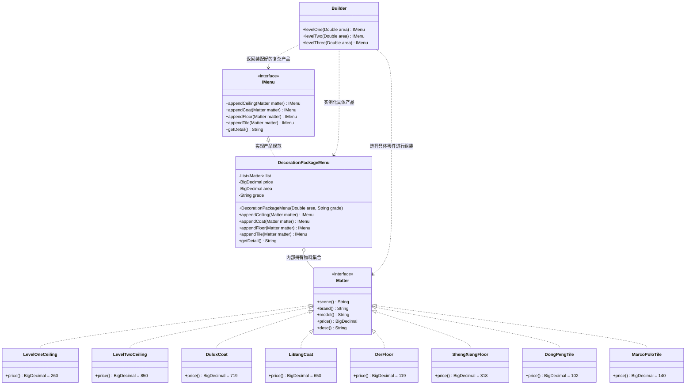
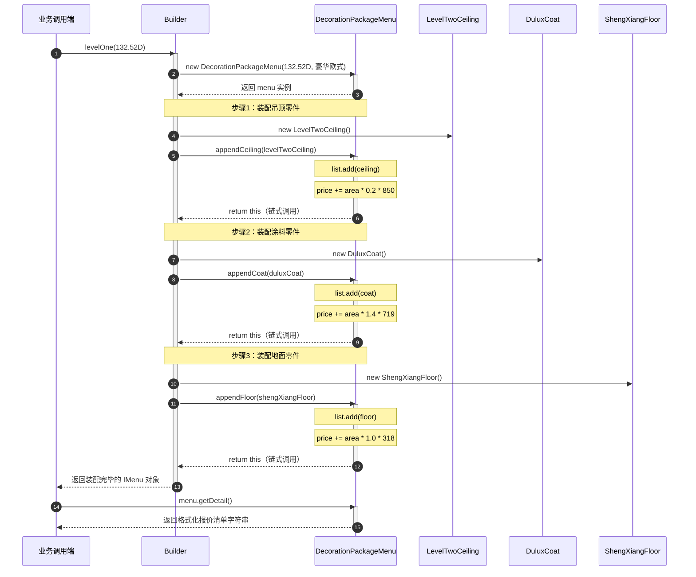
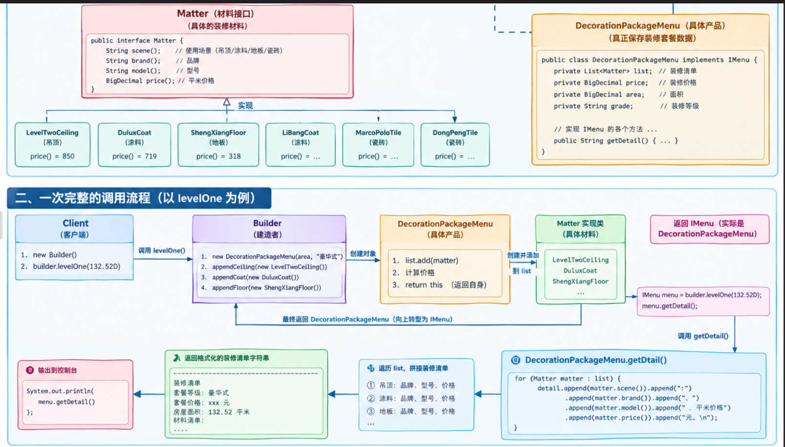
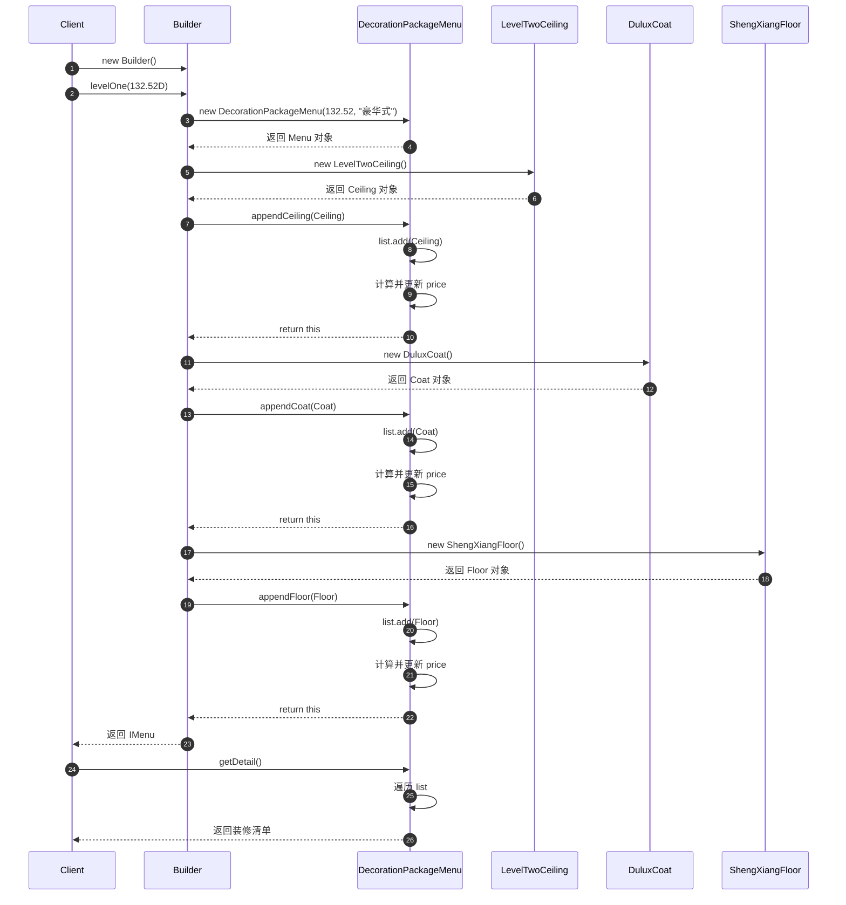

# 建造者模式装修套餐搭配升级案例深度解析与题干剖析

本文档旨在帮助你彻底理清当前工程 `a3-BuilderPattern` 中已有代码的业务背景、题干设计、普通实现的致命缺陷，以及**重构代码区（`com.ivanzhao.IDesign.builderpattern` 与 `test/builderPattern`）**的完整架构设计、类关系、计算公式与待补全代码的升级指南。

---

## 目录
1. [业务场景背景：个性化装修套餐定制痛点](#一业务场景背景个性化装修套餐定制痛点)
2. [为什么案例分为三个部分？三阶段演进全景图](#二为什么案例分为三个部分三阶段演进全景图)
3. [题干代码逐类拆解（原材料在干嘛？）](#三题干代码逐类拆解原材料在干嘛)
   - 3.1 BaseInfra 基础设施层（统一物料契约与零件家族）
   - 3.2 common 普通代码实现（反面教材：大单体 Controller 与多重 if-else）
   - 3.3 test/common 单元测试中的调用方式与测试输出
4. [为什么 common 是严重的设计反例？（四大致命痛点）](#四为什么-common-是严重的设计反例四大致命痛点)
5. [重构整体设计：建造者模式（Builder Pattern）的架构精髓](#五重构整体设计建造者模式builder-pattern的架构精髓)
   - 5.1 什么是建造者模式的本质？与工厂模式的核心区别
   - 5.2 核心角色映射与职责划分
   - 5.3 整体重构核心类图结构（Mermaid 结构图）
   - 5.4 运行时构建时序流转图
6. [重构完成源码逐类拆解（你写出的代码全景解析）](#六重构完成源码逐类拆解你写出的代码全景解析)
   - 6.1 `IMenu` 接口规范契约
   - 6.2 `DecorationPackageMenu` 具体产品与装配实现
   - 6.3 `Builder` 标准套餐装配指挥者
   - 6.4 `test/builderPattern/ApiTest` 单元测试调用
7. [深度揭秘：你写的代码到底什么地方体现了建造者模式？（破解核心迷茫一）](#七深度揭秘你写的代码到底什么地方体现了建造者模式破解核心迷茫一)
   - 7.1 角色对号入座：谁是指挥者？谁是建造者？谁是产品？
   - 7.2 为什么你会觉得“不像建造者”？（Lombok 造成的认知局限）
   - 7.3 灵魂质问：什么是“构建与表示分离”？在这个案例中是如何落地的？
8. [灵魂拷问：为什么 DecorationPackageMenu 要这样设计？（破解核心迷茫二）](#八灵魂拷问为什么-decorationpackagemenu-要这样设计破解核心迷茫二)
   - 8.1 为什么内部要定义 list、price、area、grade 4 个字段？
   - 8.2 为什么算价公式写在 append* 内部，而不是在 getDetail 时统算？（高内聚 vs 散弹退化）
   - 8.3 为什么每个 append* 方法都要 return this？（Fluent API 的力量）
   - 8.4 为什么不直接用一个包含所有物料的构造函数？（伸缩构造器反模式）
   - 8.5 为什么让 DecorationPackageMenu 实现 IMenu 接口？（依赖倒置与防腐设计）
9. [测试比对实战：common vs builderPattern 运行时表现与架构反思](#九测试比对实战common-vs-builderpattern-运行时表现与架构反思)
   - 9.1 common 方案测试调用与控制台输出解析
   - 9.2 builderPattern 方案测试调用与控制台输出解析
   - 9.3 终极实战：如何轻松定制一个“前所未有”的自选套餐？（展示建造者模式的真正杀伤力）
10. [经典 GoF 建造者模式 vs 现代变体建造者模式（心智模型升华）](#十经典-gof-建造者模式-vs-现代变体建造者模式心智模型升华)
11. [重构前后终极效果对比总结](#十一重构前后终极效果对比总结)

---

## 一、业务场景背景：个性化装修套餐定制痛点

在互联网家装业务场景中，装修公司为业主提供全屋整装套餐服务。

装修是一个高度复杂的**组合型工程**，涉及多种不同维度的物料部件：
- **吊顶（Ceiling）**：一级顶、二级顶等；
- **涂料（Coat）**：多乐士、立邦等不同品牌及环保级别；
- **地面铺装**：可以选择**地板（Floor）**（如圣象、德尔），也可以选择**地砖（Tile）**（如东鹏、马可波罗）。

同时，装修行业有一套通用的**物料面积折算公式**（根据房屋建筑面积 `area` 计算实际用料与价格）：
1. **吊顶面积折算**：造型吊顶通常占据房屋天花板投影的部分比例，本案例中折算比例为：  
   $$\text{吊顶工程总价} = \text{房屋面积} \times 0.2 \times \text{吊顶平米单价}$$
2. **涂料面积折算**：室内墙面与顶部展开施工面积通常是地面面积的 1.4 倍左右，折算比例为：  
   $$\text{涂料工程总价} = \text{房屋面积} \times 1.4 \times \text{涂料平米单价}$$
3. **地板 / 地砖面积折算**：地面铺装面积按 1:1 计入：  
   $$\text{地面工程总价} = \text{房屋面积} \times 1.0 \times \text{地面物料平米单价}$$

业务痛点在于：
- **套餐等级多样**：公司预设了多种不同档次的标准套餐（如：**豪华欧式（Level 1）**、**轻奢田园（Level 2）**、**现代简约（Level 3）**）；
- **组合灵活多变**：不同客户有强烈的个性化定制需求（例如“我想要现代简约的吊顶涂料，但地板我想用圣象高端木地板”）；
- **物料种类频繁更迭**：随着供应链合作深入，新的瓷砖、涂料品牌会不断加入系统。

**核心矛盾与挑战**：  
**如何设计一套高内聚、低耦合、易扩展的对象创建与组装架构，既能快速提供预置的标准套餐，又能支持用户自由选配与灵活组合，同时将复杂的计价与报表逻辑清晰隔离？**

---

## 二、为什么案例分为三个部分？三阶段演进全景图

工程 `a3-BuilderPattern` 的代码结构遵循经典的三阶段演进模式：

```
a3-BuilderPattern/src/
├── main/java/com/ivanzhao/IDesign/
│   ├── BaseInfra/               # 【阶段一：题干/基础设施层】零件原料库（各种物料的定义与具体实现）
│   │   ├── Matter.java          # 物料顶层统一接口
│   │   ├── ceiling/             # 吊顶零件（一级顶、二级顶）
│   │   ├── coat/                # 涂料零件（多乐士、立邦）
│   │   ├── floor/               # 地板零件（德尔、圣象）
│   │   └── tile/                # 地砖零件（东鹏、马可波罗）
│   │
│   ├── common/                  # 【阶段二：反面教材】赶工期写出的硬编码单体实现
│   │   └── DecorationPackageController.java # 大坨 if-else，死板捆绑，公式重复
│   │
│   └── builderpattern/          # 【阶段三：重构目标区】建造者模式的答题区
│       ├── IMenu.java           # 复杂产品（套餐）的装配与展示标准契约
│       ├── DecorationPackageMenu.java # 具体产品：封装内部物料清单、计算公式与打印排版
│       └── Builder.java         # 建造者/指挥者：封装标准套餐流水线组装过程
│
└── test/java/com/ivanzhao/IDesign/test/
    ├── common/                  # common 方案的测试调用验证
    │   └── ApiTest.java
    └── builderPattern/          # 重构后的单元测试区（待编写）
```

- **阶段一（`BaseInfra`）**：定义装修原子零件。提供了顶层 `Matter` 接口及 4 大类（吊顶、涂料、地板、地砖）、共 8 种具体物料实现。
- **阶段二（`common`）**：传统的单体式硬编码方案。在一个 Controller 的方法里用 `if (1 == level)`、`if (2 == level)` 堆砌物料实例化与公式计算。
- **阶段三（`builderpattern`）**：本题的**重构升级答题区**。利用建造者模式，将产品部件的组合组装过程与内部表示剥离，支持链式流式配置。

---

## 三、题干代码逐类拆解（原材料在干嘛？）

### 3.1 BaseInfra 基础设施层（底层的零件原料库）

所有的物料都实现自统一的标准物料接口 `Matter`：

#### 1. 顶层契约：`BaseInfra/Matter.java`
```java
public interface Matter {
    String scene();     // 场景分类：吊顶、涂料、地板、地砖
    String brand();     // 品牌名称：如多乐士、圣象、东鹏等
    String model();     // 规格型号：如一级顶、二级顶、第二代等
    BigDecimal price(); // 平米报价（单价）
    String desc();      // 物料详细描述信息
}
```

#### 2. 四大分类、八款具体零件物料一览表

| 分类（包名） | 具体类名 | 场景 `scene` | 品牌 `brand` | 型号 `model` | 单价 `price` (元) | 特性描述摘要 |
| :--- | :--- | :--- | :--- | :--- | :--- | :--- |
| **ceiling (吊顶)** | `LevelOneCeiling` | 吊顶 | 装修公司自带 | 一级顶 | **260** | 造型只做低一级，离顶120-150mm |
| **ceiling (吊顶)** | `LevelTwoCeiling` | 吊顶 | 装修公司自带 | 二级顶 | **850** | 两个层次的吊顶，高度一般下吊20cm |
| **coat (涂料)** | `DuluxCoat` | 涂料 | 多乐士(Dulux) | 第二代 | **719** | 阿克苏诺贝尔旗下著名建筑涂料品牌 |
| **coat (涂料)** | `LiBangCoat` | 涂料 | 立邦 | 默认级别 | **650** | 世界著名涂料制造商，绿色环保 |
| **floor (地板)** | `DerFloor` | 地板 | 德尔(Der) | A+ | **119** | 奥运会家装和公装地板供应商 |
| **floor (地板)** | `ShengXiangFloor` | 地板 | 圣象 | 一级 | **318** | 中国地板行业著名品牌，中国名牌 |
| **tile (地砖)** | `DongPengTile` | 地砖 | 东鹏瓷砖 | 10001 | **102** | 行业榜首，科技推动品牌 |
| **tile (地砖)** | `MarcoPoloTile` | 地砖 | 马可波罗(MARCO POLO) | 缺省 | **140** | 仿古砖至尊，文化陶瓷 |

---

### 3.2 common 普通代码实现（反面教材）

在 `common/DecorationPackageController.java` 中，业务需求被非常粗暴地塞入了一个方法中：

```java
public class DecorationPackageController {

    public String getMatterList(BigDecimal area, Integer level) {
        List<Matter> list = new ArrayList<Matter>(); // 装修清单
        BigDecimal price = BigDecimal.ZERO;          // 装修价格

        // 豪华欧式：二级顶(850) + 多乐士涂料(719) + 圣象地板(318)
        if (1 == level) {
            LevelTwoCeiling levelTwoCeiling = new LevelTwoCeiling();
            DuluxCoat duluxCoat = new DuluxCoat();
            ShengXiangFloor shengXiangFloor = new ShengXiangFloor();

            list.add(levelTwoCeiling);
            list.add(duluxCoat);
            list.add(shengXiangFloor);

            price = price.add(area.multiply(new BigDecimal("0.2")).multiply(levelTwoCeiling.price()));
            price = price.add(area.multiply(new BigDecimal("1.4")).multiply(duluxCoat.price()));
            price = price.add(area.multiply(shengXiangFloor.price()));
        }

        // 轻奢田园：二级顶(850) + 立邦涂料(650) + 马可波罗地砖(140)
        if (2 == level) {
            LevelTwoCeiling levelTwoCeiling = new LevelTwoCeiling();
            LiBangCoat liBangCoat = new LiBangCoat();
            MarcoPoloTile marcoPoloTile = new MarcoPoloTile();

            list.add(levelTwoCeiling);
            list.add(liBangCoat);
            list.add(marcoPoloTile);

            price = price.add(area.multiply(new BigDecimal("0.2")).multiply(levelTwoCeiling.price()));
            price = price.add(area.multiply(new BigDecimal("1.4")).multiply(liBangCoat.price()));
            price = price.add(area.multiply(marcoPoloTile.price()));
        }

        // 现代简约：一级顶(260) + 立邦涂料(650) + 东鹏地砖(102)
        if (3 == level) {
            LevelOneCeiling levelOneCeiling = new LevelOneCeiling();
            LiBangCoat liBangCoat = new LiBangCoat();
            DongPengTile dongPengTile = new DongPengTile();

            list.add(levelOneCeiling);
            list.add(liBangCoat);
            list.add(dongPengTile);

            price = price.add(area.multiply(new BigDecimal("0.2")).multiply(levelOneCeiling.price()));
            price = price.add(area.multiply(new BigDecimal("1.4")).multiply(liBangCoat.price()));
            price = price.add(area.multiply(dongPengTile.price()));
        }

        StringBuilder detail = new StringBuilder("\r\n-------------------------------------------------------\r\n" +
                "装修清单" + "\r\n" +
                "套餐等级：" + level + "\r\n" +
                "套餐价格：" + price.setScale(2, BigDecimal.ROUND_HALF_UP) + " 元\r\n" +
                "房屋面积：" + area.doubleValue() + " 平米\r\n" +
                "材料清单：\r\n");

        for (Matter matter: list) {
            detail.append(matter.scene()).append("：").append(matter.brand()).append("、").append(matter.model()).append("、平米价格：").append(matter.price()).append(" 元。\n");
        }

        return detail.toString();
    }
}
```

### 3.3 test/common 单元测试中的调用方式

在 `src/test/java/com/ivanzhao/IDesign/test/common/ApiTest.java` 中：
```java
@Test
public void test_DecorationPackageController(){
    DecorationPackageController decoration = new DecorationPackageController();

    // 豪华欧式 (132.52平米)
    System.out.println(decoration.getMatterList(new BigDecimal("132.52"), 1));

    // 轻奢田园 (98.25平米)
    System.out.println(decoration.getMatterList(new BigDecimal("98.25"), 2));

    // 现代简约 (85.43平米)
    System.out.println(decoration.getMatterList(new BigDecimal("85.43"), 3));
}
```

运行输出格式如下：
```
-------------------------------------------------------
装修清单
套餐等级：1
套餐价格：198064.32 元
房屋面积：132.52 平米
材料清单：
吊顶：装修公司自带、二级顶、平米价格：850 元。
涂料：多乐士(Dulux)、第二代、平米价格：719 元。
地板：圣象、一级、平米价格：318 元。
```

---

## 四、为什么 common 是严重的设计反例？（四大致命痛点）

虽然 `common` 跑通了测试，但在软件工程角度属于非常典型的**反模式（Anti-Pattern）**：

| 痛点维度 | 核心表现 | 严重后果 |
| :--- | :--- | :--- |
| **1. 严重违反单一职责原则 (SRP)** | 一个 `getMatterList` 方法承担了四重职责：<br>① 套餐分类路由；<br>② 具体零件实例化；<br>③ 复杂的工程面积折算乘积计算；<br>④ 字符串报表拼接与排版。 | 职责混乱。报表样式改了要动它，计算公式改了要动它，套餐替换物料也要动它，极难维护。 |
| **2. 严重违反开闭原则 (OCP)** | 套餐配置逻辑完全写死在方法体内。 | 如果需要新增一个“中式古典（Level 4）”套餐，必须直接修改原类，继续往下追加 `if (4 == level)`，改动老逻辑极易引发回归 Bug。 |
| **3. 组合爆炸与缺乏定制灵活性** | 物料被死死焊死在特定的 `level` 分支里。 | 现实中客户常常需要个性化替换（例如：想要欧式的二级吊顶，但地板换成东鹏地砖）。如果按照分支硬编码，4 种物料组合会产生指数级分支（$2 \times 2 \times 2 \times 2 = 16$ 个 if 分支），代码不可控。 |
| **4. 业务计算公式散落且高度重复** | `0.2`（吊顶系数）和 `1.4`（涂料系数）在每个 if 块中重复手写一次。 | 出现典型的“散弹式修改”。一旦工艺规范变更（如涂料改为刷三遍导致系数由 1.4 变为 1.8），必须逐个分支手动查找并修改，漏改就会导致报价重大事故。 |

---

## 五、重构整体设计：建造者模式（Builder Pattern）的架构精髓

### 5.1 什么是建造者模式的本质？与工厂模式的核心区别

> **GoF 定义**：将一个复杂对象的**构建与它的表示分离**，使得同样的构建过程可以创建不同的表示。

很多人容易混淆**工厂模式**与**建造者模式**：
- **工厂模式（Factory Pattern / Abstract Factory）**：
  - **关注点**：“生产什么”。关注的是**整体对象**的创建产出，如同去超市买一辆已经组装好的整车。
  - **特点**：一步到位，直接返回一个完整对象。
- **建造者模式（Builder Pattern）**：
  - **关注点**：“怎么一步一步组装出来”。关注的是**复杂对象的零件装配过程**，如同去 4S 店选配汽车（选发动机、选真皮座椅、选全景天窗、选车漆颜色）。
  - **特点**：通过连续装配步骤（或链式调用 Fluent API），支持自由组合零件，最终交付一个高度定制化的复杂对象。

### 5.2 核心角色映射与职责划分

在本案例中，建造者模式的标准角色映射如下：

```
+-------------------------------------------------------------+
|                     Builder Pattern 角色映射                 |
+-------------------------------------------------------------+
| 1. 部件（Part）            -> BaseInfra 中的各类具体 Matter     |
| 2. 复杂产品契约（Product）   -> IMenu 接口                        |
| 3. 具体复杂产品（Concrete） -> DecorationPackageMenu         |
| 4. 建造者/指挥者（Director）-> Builder                             |
+-------------------------------------------------------------+
```

1. **零件部件（`Matter` 族）**：
   - 吊顶、涂料、地板、地砖等基本原子物料。
2. **产品接口（`IMenu`）**：
   - 定义了一个装修套餐应当具备的装配行为（如添加吊顶、涂料、地板、地砖）以及最终结果展示契约（`getDetail`）。
3. **具体产品实现（`DecorationPackageMenu`）**：
   - 负责持有所有已组装的物料清单 `List<Matter>`；
   - 负责**统一内聚计算规则**：无论谁调用 `appendCeiling`，都统一按 `area * 0.2 * price` 计价；调用 `appendCoat` 统一按 `area * 1.4 * price` 计价；彻底消除公式重复！
   - 负责格式化输出自身的报价清单报表。
4. **建造者/指挥者（`Builder`）**：
   - 提供快捷的流水线组装方法（如 `levelOne`、`levelTwo`、`levelThree`）；
   - 将各个零件按特定配方装配到 `DecorationPackageMenu` 中，并返回给调用方。

---

### 5.3 整体重构核心类图结构



---

### 5.4 运行时构建时序流转图



---

## 六、重构完成源码逐类拆解（你写出的代码全景解析）



经过你的升级重构，`builderpattern` 目录下形成了一套高内聚、职责清晰的建造者体系。我们先完整复盘你所编写的每一处核心代码：




### 6.1 `IMenu.java`：复杂产品的装配与展示标准契约

```java
package com.ivanzhao.IDesign.builderpattern;

import com.ivanzhao.IDesign.BaseInfra.Matter;

public interface IMenu {

    IMenu appendCeiling(Matter matter); // 装配吊顶零件
    IMenu appendCoat(Matter matter);    // 装配涂料零件
    IMenu appendFloor(Matter matter);   // 装配地板零件
    IMenu appendTile(Matter matter);    // 装配地砖零件

    String getDetail();                 // 获取最终组装好的清单报表
}
```
- **方法签名设计**：每一个 `append*` 方法都返回 `IMenu` 接口自身，为链式调用（Fluent API）奠定了契约规范。
- **职责边界**：只定义“一个装修套餐应该具备哪些装配能力”，不绑定任何具体实现。

---

### 6.2 `DecorationPackageMenu.java`：具体复杂产品（兼具体建造实现）

```java
package com.ivanzhao.IDesign.builderpattern;

import com.ivanzhao.IDesign.BaseInfra.Matter;
import java.math.BigDecimal;
import java.util.ArrayList;
import java.util.List;

public class DecorationPackageMenu implements IMenu {

    private List<Matter> list = new ArrayList<>(); // 装修物料清单容器
    private BigDecimal price = BigDecimal.ZERO;    // 套餐总价（随装配实时累加）
    private BigDecimal area;                       // 房屋建筑面积（基准参数）
    private String grade;                          // 套餐等级风格名称

    private DecorationPackageMenu() {}
    public DecorationPackageMenu(Double area, String grade) {
        this.area = new BigDecimal(area);
        this.grade = grade;
    }

    @Override
    public IMenu appendCeiling(Matter matter) {
        list.add(matter);
        price = price.add(
                area.multiply(new BigDecimal("0.2")).multiply(matter.price())
        );
        return this;
    }

    @Override
    public IMenu appendCoat(Matter matter) {
        list.add(matter);
        price = price.add(
                area.multiply(new BigDecimal("1.4")).multiply(matter.price())
        );
        return this;
    }

    @Override
    public IMenu appendFloor(Matter matter) {
        list.add(matter);
        price = price.add(area.multiply(matter.price()));
        return this;
    }

    @Override
    public IMenu appendTile(Matter matter) {
        list.add(matter);
        price = price.add(area.multiply(matter.price()));
        return this;
    }

    @Override
    public String getDetail() {
        StringBuilder detail = new StringBuilder("\r\n-------------------------------------------------------\r\n" +
                "装修清单" + "\r\n" +
                "套餐等级：" + grade + "\r\n" +
                "套餐价格：" + price.setScale(2, BigDecimal.ROUND_HALF_UP) + " 元\r\n" +
                "房屋⾯积：" + area.doubleValue() + " 平⽶\r\n" +
                "材料清单：\r\n");

        for (Matter matter : list) {
            detail.append(matter.scene())
                    .append(":")
                    .append(matter.brand())
                    .append("、")
                    .append(matter.model())
                    .append("、平米价格")
                    .append(matter.price())
                    .append("元。\n");
        }

        return detail.toString();
    }
}
```

---

### 6.3 `Builder.java`：标准套餐组装的“指挥者”（Director）

```java
package com.ivanzhao.IDesign.builderpattern;

import com.ivanzhao.IDesign.BaseInfra.ceiling.LevelOneCeiling;
import com.ivanzhao.IDesign.BaseInfra.ceiling.LevelTwoCeiling;
import com.ivanzhao.IDesign.BaseInfra.coat.DuluxCoat;
import com.ivanzhao.IDesign.BaseInfra.coat.LiBangCoat;
import com.ivanzhao.IDesign.BaseInfra.floor.ShengXiangFloor;
import com.ivanzhao.IDesign.BaseInfra.tile.DongPengTile;
import com.ivanzhao.IDesign.BaseInfra.tile.MarcoPoloTile;

public class Builder {

    // 豪华欧式套餐：二级顶 + 多乐士涂料 + 圣象地板
    public IMenu levelOne(Double area) {
        return new DecorationPackageMenu(area, "豪华式")
                .appendCeiling(new LevelTwoCeiling())
                .appendCoat(new DuluxCoat())
                .appendFloor(new ShengXiangFloor());
    }

    // 轻奢田园套餐：二级顶 + 立邦涂料 + 马可波罗地砖
    public IMenu levelTwo(Double area) {
        return new DecorationPackageMenu(area, "轻奢式")
                .appendCeiling(new LevelTwoCeiling())
                .appendCoat(new LiBangCoat())
                .appendTile(new MarcoPoloTile());
    }

    // 现代简约套餐：一级顶 + 立邦涂料 + 东鹏地砖
    public IMenu levelThree(Double area) {
        return new DecorationPackageMenu(area, "现代式")
                .appendCeiling(new LevelOneCeiling())
                .appendCoat(new LiBangCoat())
                .appendTile(new DongPengTile());
    }
}
```

---

### 6.4 `test/builderPattern/ApiTest.java`：单元测试调用

```java
package com.ivanzhao.IDesign.test.builderPattern;

import com.ivanzhao.IDesign.builderpattern.Builder;
import org.junit.Test;

public class ApiTest {

    @Test
    public void test_BuilderPattern() {
        Builder builder = new Builder();
        System.out.println(builder.levelOne(132.52D).getDetail());
        System.out.println(builder.levelTwo(98.52D).getDetail());
        System.out.println(builder.levelThree(85.52D).getDetail());
    }
}
```

---

## 七、深度揭秘：你写的代码到底什么地方体现了建造者模式？（破解核心迷茫一）

很多同学写完这段代码后都会产生强烈的困惑：
> *“我写的这几个类到底谁是建造者？这不就是 new 了一个对象然后调了几个 set 类似的方法吗？它到底在哪体现了建造者模式？”*

要解开这个心结，我们必须把代码放回 **GoF《设计模式：可复用面向对象软件的基础》** 的经典定义中逐一排查对号入座。

### 7.1 角色对号入座：谁是指挥者？谁是建造者？谁是产品？

经典的 GoF 建造者模式包含 **4 个核心要素**，在你的代码中一一对应得天衣无缝：

| GoF 经典要素 | 经典职责 | 对应你工程中的具体类/接口 | 在你的代码中具体干了什么？ |
| :--- | :--- | :--- | :--- |
| **Product（最终产品）** | 一个包含多个组件的复杂业务对象 | `DecorationPackageMenu` | 内部持有物料集合 `list`、总价 `price`、面积与等级名称，最终被交付给客户。 |
| **Builder（抽象建造者规范）** | 规定产品各个部件的装配步骤方法 | `IMenu` | 定义了 `appendCeiling`、`appendCoat`、`appendFloor`、`appendTile` 等装配工序。 |
| **ConcreteBuilder（具体建造者）** | 负责具体部件的组装与状态计算 | `DecorationPackageMenu` 自身 | 实现了 `IMenu` 的每个 `append` 动作，不仅把零件放进去，还触发对应系数（0.2、1.4）的计价。 |
| **Director（指挥者/导演者）** | **控制装配流程，按固定工序生产特定产品** | **`Builder` 类** | **决定了装配顺序与零件组合**！它定义了“豪华欧式”、“轻奢田园”、“现代简约”各自使用哪款零件，按什么顺序组装。 |
| **Part（零件原料）** | 构成复杂产品的原子部件 | 各类 `Matter`（吊顶、涂料、地板、地砖） | 最底层的原料零件，被建造者一件件安装进复杂产品中。 |

> 🌟 **核心醍醐灌顶**：  
> **你的 `Builder.java` 类，在经典设计模式术语里其实是「Director（指挥者）」！**  
> 它的职责不是造零件，而是拿着零件配方，控制组装顺序，指挥完成一整套流水线装配。

---

### 7.2 为什么你会觉得“不像建造者”？（Lombok 造成的认知局限）

很多人对“建造者模式”的第一印象来自于现代 Java 工具（如 Lombok 的 `@Builder`，或者 Guava、HttpClient 中的 `User.builder().name("张三").age(18).build()`）。

当你习惯了那种形式时，回头看本案例就会感觉迷茫。其实这是因为建造者模式在工业界有两种形态：

```
                    ┌── 经典 GoF 建造者模式（本案例采用的形态）
                    │    特点：有明确的 Director（Builder.java）把控标准生产工序，
                    │         产品内部有复杂的计算规则与部件约束。
建造者模式演化形态 ──┤
                    └── 变体：链式属性建造者（Lombok / Effective Java 形态）
                         特点：没有 Director，纯粹把 Builder 当作避免构造参数爆炸的工具，
                              最后以 .build() 结尾生成贫血 POJO。
```

在很多企业级复杂业务（如本案例的家装报价系统、报表引擎、SQL 构造器、游戏场景加载）中，**绝对不能把所有零件组合的工作直接扔给前端或业务调用方**。企业需要标准预设套餐，这就是为什么必须有 `Builder` 类（指挥者）的存在！

---

### 7.3 灵魂质问：什么是“构建与表示分离”？在这个案例中是如何落地的？

GoF 对建造者模式最核心的定义是：
> **“将一个复杂对象的构建与它的表示分离，使得同样的构建过程可以创建不同的表示。”**

请看你代码中是如何落地这句设计圣经的：

#### 1. 什么是“构建过程（Construction）”？
无论生产什么档次的套餐，在工序逻辑上都遵循统一的**“四步构建流程”**：
1. 第一步：确定房屋面积与档次；
2. 第二步：选配并安装吊顶（`appendCeiling`）；
3. 第三步：选配并涂刷涂料（`appendCoat`）；
4. 第四步：选配并铺装地面（`appendFloor` 或 `appendTile`）。

#### 2. 什么是“不同的表示（Representation）”？
虽然工序完全相同，但只要给这一构建过程灌入不同的物料零件，产出的最终复杂对象就完全不同：
- 灌入 `二级顶 + 多乐士 + 圣象地板` ➡️ 产生**豪华欧式套餐**的表示；
- 灌入 `二级顶 + 立邦涂料 + 马可波罗地砖` ➡️ 产生**轻奢田园套餐**的表示；
- 灌入 `一级顶 + 立邦涂料 + 东鹏地砖` ➡️ 产生**现代简约套餐**的表示；
- 甚至客户自己选入 `一级顶 + 多乐士 + 德尔地板` ➡️ 产生**个性化混搭套餐**的表示！

**构建工序（算法结构）是稳定复用的，而具体展现（物料组合与报价结果）是高度灵活多变的！这就是建造者模式的灵魂所在！**

---

## 八、灵魂拷问：为什么 DecorationPackageMenu 要这样设计？（破解核心迷茫二）

很多初学者看到 `DecorationPackageMenu` 会产生一系列疑惑：为什么字段要这么定义？为什么计价公式要写在 `append` 里？为什么每个方法都要返回 `this`？下面我们从软件工程的设计哲学逐一剖析。

### 8.1 为什么内部要定义 `list`、`price`、`area`、`grade` 4 个字段？

```java
private List<Matter> list = new ArrayList<>(); // 装修清单
private BigDecimal price = BigDecimal.ZERO;    // 装修价格
private BigDecimal area;                       // 面积
private String grade;                          // 装修等级
```

这 4 个字段代表了一个复杂产品在生命周期中的不同属性维度：
1. **`area` 与 `grade`（基准环境属性）**：
   - 属于**初始不可变上下文**。一套房子在量房完毕后，其建筑面积就是确定的；客户进店咨询时所选的基础档次也是已知的。因此它们通过构造函数一次性传入。
2. **`list`（部件聚合容器）**：
   - 建造者模式构建的绝不是一个简单的基本类型，而是一个**复合对象（Composite Object）**。`list` 专门负责按装配次序持久持有已经选配好的所有 `Matter` 部件。
3. **`price`（实时派生状态）**：
   - 套餐总价不是外部传入的，也不是写死的固定值，而是**随着物料一件一件被装配进系统，动态累加计算出来的衍生状态**。

---

### 8.2 核心设计考量：为什么算价公式写在 `append*` 内部，而不是在 `getDetail()` 时统一计算？

这是一个极其深刻的架构设计问题。我们对比两种设计方案：

#### 方案 A（当前设计：增量实时算价，写在 `append` 内）
```java
@Override
public IMenu appendCeiling(Matter matter) {
    list.add(matter);
    price = price.add(
            area.multiply(new BigDecimal("0.2")).multiply(matter.price())
    );
    return this;
}
```

#### 方案 B（反思方案：延迟计算，在 `getDetail()` 里循环列表统一计算）
假设我们不在 `append` 时算价，只把物料存进 `list`，等到 `getDetail()` 时统一计算，代码会变成什么样？

```java
// 方案 B 的噩梦代码：
public String getDetail() {
    BigDecimal totalPrice = BigDecimal.ZERO;
    for (Matter matter : list) {
        // 🚨 致命缺陷：你必须在此处重新通过 if-else 去判断物料类型！
        if ("吊顶".equals(matter.scene())) {
            totalPrice = totalPrice.add(area.multiply(new BigDecimal("0.2")).multiply(matter.price()));
        } else if ("涂料".equals(matter.scene())) {
            totalPrice = totalPrice.add(area.multiply(new BigDecimal("1.4")).multiply(matter.price()));
        } else {
            totalPrice = totalPrice.add(area.multiply(matter.price()));
        }
    }
    // ...
}
```

#### 为什么方案 A（当前设计）完胜方案 B？
1. **彻底杜绝了 if-else 的回潮**：
   在方案 B 中，为了知道该乘 `0.2` 还是 `1.4`，你又被迫在 `getDetail()` 里写了一大堆字符串匹配或 `instanceof` 判断，直接让代码退化回了 `common` 阶段的面条代码！
2. **符合面向对象的“高内聚（High Cohesion）”与“充血模型”**：
   调用 `appendCeiling` 本身就是一个**强语义动作**——“我现在要添加一个吊顶零件”。既然语义明确，那么“吊顶在这个系统里的计价折算规则（面积 * 0.2 * 单价）”就应该且必须内聚在这个动作内部。
3. **满足实时算价的交互需求**：
   在真实商用系统中，用户在选配过程中往往需要实时查看当前加购件后的总价波动（如前端购物车实时算价），方案 A 天然支持随时调用 `getPrice()` 读取当前金额，而不需要每次都全量重算。

---

### 8.3 为什么每个 `append*` 方法都要 `return this`？（Fluent API 的力量）

```java
return this; // 返回当前对象自身的引用
```

这利用了**方法链（Method Chaining / 连缀语法）**设计模式，在面向对象设计中也被称为 **流式接口（Fluent Interface）**。

- **不加 `return this` 的调用方式（传统写法）**：
  ```java
  DecorationPackageMenu menu = new DecorationPackageMenu(132.52D, "豪华欧式");
  menu.appendCeiling(new LevelTwoCeiling());
  menu.appendCoat(new DuluxCoat());
  menu.appendFloor(new ShengXiangFloor());
  return menu;
  ```
  反复敲击变量名 `menu.`，代码充斥着机械式的声明语句。

- **加上 `return this` 后的调用方式（你的写法）**：
  ```java
  return new DecorationPackageMenu(area, "豪华式")
          .appendCeiling(new LevelTwoCeiling())
          .appendCoat(new DuluxCoat())
          .appendFloor(new ShengXiangFloor());
  ```
  像装配流水线传送带一样顺畅流转，极大地增强了代码的**表达力（Expressiveness）**与**沉浸感**。

---

### 8.4 为什么不直接用一个包含所有物料的构造函数？（伸缩构造器反模式）

很多新手会问：既然都是传参数，为什么不直接写一个全参构造方法？
```java
// 反例：伸缩构造器（Telescoping Constructor）
public DecorationPackageMenu(Double area, String grade, Matter ceiling, Matter coat, Matter floor, Matter tile) { ... }
```

如果采用全参构造：
1. **参数爆炸与位置混淆**：多个类型相同的 `Matter` 排在一起，调用时极其容易把 `DuluxCoat` 和 `ShengXiangFloor` 传颠倒，编译期还不报错！
2. **无法处理可选部件**：
   - 豪华欧式选了地板，没选地砖，调用时必须被迫传 `null`：
     `new DecorationPackageMenu(area, "欧式", ceiling, coat, floor, null);`
   - 轻奢田园选了地砖，没选地板，又必须传：
     `new DecorationPackageMenu(area, "田园", ceiling, coat, null, tile);`
     大量传入 `null` 是极度丑陋且危险的坏味道。
3. **建造者模式的解法**：
   将一个臃肿的大构造方法，拆解为一系列小巧、专一、可选的装配动作。需要什么就装配什么，不需要就不调，优雅至极。

---

### 8.5 为什么让 `DecorationPackageMenu` 实现 `IMenu` 接口？（依赖倒置与防腐设计）

在 `Builder.java` 中，所有方法的返回值都是 **`IMenu`** 而不是 `DecorationPackageMenu`：
```java
public IMenu levelOne(Double area) { ... }
```

这是面向对象六大原则中**依赖倒置原则（DIP）**的经典应用：
- **上层业务客户端只依赖抽象接口 `IMenu`**；
- 未来即使底层升级了，改用由数据库驱动的 `DynamicPackageMenu` 或是远程 RPC 驱动的 `CloudPackageMenu`，只要它们实现了 `IMenu` 接口，外部的 `Builder` 和测试用例一行代码都不需要改动！

---

## 九、测试比对实战：common vs builderPattern 运行时表现与架构反思

我们来详细对比在两个包下的测试类执行行为：

### 9.1 `common` 方案测试调用与控制台输出解析

测试代码：[`test/common/ApiTest.java`](file:///C:/Users/free/Desktop/codeDesign/代码/IDesign/a3-BuilderPattern/src/test/java/com/ivanzhao/IDesign/test/common/ApiTest.java)
```java
@Test
public void test_DecorationPackageController(){
    DecorationPackageController decoration = new DecorationPackageController();

    // 必须硬编码传递魔法值 1, 2, 3
    System.out.println(decoration.getMatterList(new BigDecimal("132.52"), 1));
    System.out.println(decoration.getMatterList(new BigDecimal("98.25"), 2));
    System.out.println(decoration.getMatterList(new BigDecimal("85.43"), 3));
}
```

**控制台输出**：
```
-------------------------------------------------------
装修清单
套餐等级：1
套餐价格：198064.32 元
房屋面积：132.52 平米
材料清单：
吊顶：装修公司自带、二级顶、平米价格：850 元。
涂料：多乐士(Dulux)、第二代、平米价格：719 元。
地板：圣象、一级、平米价格：318 元。
```

**架构反思**：
- 调用方必须清楚“1 代表欧式，2 代表田园，3 代表简约”。
- 如果开发人员不小心传了个 `4`，由于没有分支匹配，程序会打印一个空清单、价格为 0 元的虚假报表，产生静默逻辑 Bug。

---

### 9.2 `builderPattern` 方案测试调用与控制台输出解析

测试代码：[`test/builderPattern/ApiTest.java`](file:///C:/Users/free/Desktop/codeDesign/代码/IDesign/a3-BuilderPattern/src/test/java/com/ivanzhao/IDesign/test/builderPattern/ApiTest.java)
```java
@Test
public void test_BuilderPattern() {
    Builder builder = new Builder();
    System.out.println(builder.levelOne(132.52D).getDetail());
    System.out.println(builder.levelTwo(98.52D).getDetail());
    System.out.println(builder.levelThree(85.52D).getDetail());
}
```

**控制台输出**：
```
-------------------------------------------------------
装修清单
套餐等级：豪华式
套餐价格：198064.32 元
房屋⾯积：132.52 平⽶
材料清单：
吊顶:装修公司自带、二级顶、平米价格850元。
涂料:多乐士(Dulux)、第二代、平米价格719元。
地板:圣象、一级、平米价格318元。
```

**架构反思**：
- 彻底消除了不可读的魔法值 `1, 2, 3`，方法名 `levelOne`、`levelTwo` 具备极强的**业务自解释性**。
- 返回的直接是一个完整的复合对象 `IMenu`，上层可以继续持有该对象做其他业务流转（如提交数据库订单、计算优惠券折扣），而不是像 `common` 那样只能拿到一段死板的纯文本 String。

---

### 9.3 终极实战：如何轻松定制一个“前所未有”的自选套餐？（展示建造者模式的真正杀伤力）

现在模拟一个新业务诉求：  
> *有一位追求极简的年轻业主，房屋面积 100 平米，提出需求：“我家层高低，**不要任何吊顶**；墙面要用最好的**多乐士涂料**；地面要用经济实惠的**德尔木地板**”。*

- **如果在 `common` 方案下**：
  你必须打开 `DecorationPackageController.java`，心惊胆战地在原有代码后追加 `if (4 == level)`，改动了老代码，违反了开闭原则。

- **但在建造者模式下**：
  你甚至**完全不需要修改任何已有的类**！调用端可以直接随心所欲地自由组装：

```java
@Test
public void test_CustomPackage() {
    // 无需改动原工程已有代码，完全满足个性化选配！
    IMenu customMenu = new DecorationPackageMenu(100.0D, "客户自定义极简风")
            .appendCoat(new DuluxCoat())     // 只要涂料
            .appendFloor(new DerFloor());    // 只要地板，不调 appendCeiling

    System.out.println(customMenu.getDetail());
}
```

**运行结果**：
```
-------------------------------------------------------
装修清单
套餐等级：客户自定义极简风
套餐价格：112560.00 元
房屋⾯积：100.0 平⽶
材料清单：
涂料:多乐士(Dulux)、第二代、平米价格719元。
地板:德尔(Der)、A+、平米价格119元。
```
> 💡 涂料：$100 \times 1.4 \times 719 = 100,660$ 元；地板：$100 \times 1.0 \times 119 = 11,900$ 元；总计：$100,660 + 11,900 = 112,560$ 元。金额分厘不差！  
> **这就是建造者模式所赋予系统的极致灵活性与强大扩展力！**

---

## 十、经典 GoF 建造者模式 vs 现代变体建造者模式（心智模型升华）

为了帮助你在以后的面试和实际大厂开发中不再被“建造者模式”绕晕，我们梳理出业内最常用的 **三种建造者形态**：

```
                               ┌── 经典 GoF 模式（本案例形态）
                               │   - 核心组成：Director + Builder + ConcreteBuilder + Product
                               │   - 适用场景：复杂对象的内部装配工序有固定的预置套路（标准流水线）
                               │
                               ├── 链式自建造者模式（Fluent Self-Builder）
建造者模式的三种常见落地形态 ──┤   - 核心组成：Product 自身兼具装配方法并 return this
                               │   - 适用场景：各部件装配具有特定计算逻辑，且希望被流式构建
                               │
                               └── 静态内部类建造者（Static Inner Builder，Lombok @Builder）
                                   - 核心组成：TargetClass.Builder 内部类 + .build()
                                   - 适用场景：纯粹为了替代超过 4 个以上属性的臃肿构造方法，生成不可变（Immutable）对象
```

---

## 十一、重构前后终极效果对比总结

| 核心维度 | 重构前（`common` 包单体实现） | 重构后（`builderpattern` 建造者模式） |
| :--- | :--- | :--- |
| **设计原则** | 严重违反单一职责（SRP）与开闭原则（OCP） | 完美遵守 SRP、OCP 与依赖倒置原则（DIP） |
| **角色划分** | 只有一个大单体 Controller，负责所有事情 | 零件（`Matter`）、产品（`IMenu`）、装配器（`Menu`）、指挥者（`Builder`）各司其职 |
| **业务计价逻辑** | 散落在各个 if-else 分支中，重复计算系数 | 收敛内聚在各个 `append*` 领域方法内部，单点维护 |
| **预置标准套餐** | 强绑定整型魔法值（1, 2, 3），极易传错 | 通过 `Builder.levelOne/Two/Three` 语义化装配与交付 |
| **个性化定制能力** | **完全不支持**。增加一种组合就必须硬编码增加一个分支 | **完全自由选配**。调用方可按需链式调用任意部件，无需改动现有类 |
| **交付对象类型** | 只能返回拼接完成的死字符串 `String` | 返回面向接口的充血领域模型 `IMenu`，便于后续业务流转 |
| **代码可测性** | 无法对各个物料装配环节单独进行白盒测试 | 每一个部件装配方法均可独立测试，健壮性极高 |

## 十二、链式引用分析

> 你说的两种情况：
>
> ```
> builder.levelOne(100D).getDetail();
> ```
>
> 和：
>
> ```
> new DecorationPackageMenu(area, "豪华式")
>     .appendCeiling(...)
>     .appendCoat(...)
>     .appendFloor(...);
> ```
>
> **本质上都是链式调用，原理都是：前一个方法返回了一个对象，后面的 `.` 就可以继续调用这个返回对象的方法。**
>
> 区别在于：
>
> > **Builder 的 `levelOne()` 不需要返回 `this`，只需要返回一个“可以继续调用 `getDetail()` 的对象”。**
> >
> > **`appendXXX()` 返回 `this`，是因为它希望继续在“当前这个装修套餐对象”上操作。**
>
> ------
>
> ## 1. Builder 这里
>
> ```
> Builder builder = new Builder();
> 
> builder.levelOne(100D).getDetail();
> ```
>
> 执行过程：
>
> ```
> builder
>    │
>    │ levelOne(100D)
>    ↓
> DecorationPackageMenu 对象
>    │
>    │ getDetail()
>    ↓
> String
> ```
>
> 关键是：
>
> ```
> public IMenu levelOne(Double area) {
>     return new DecorationPackageMenu(...);
> }
> ```
>
> `levelOne()` **返回的是一个新的 `DecorationPackageMenu` 对象**。
>
> 因为 `DecorationPackageMenu` 实现了 `IMenu`：
>
> ```
> public class DecorationPackageMenu implements IMenu
> ```
>
> 所以它可以按照 `IMenu` 类型调用：
>
> ```
> .getDetail()
> ```
>
> 因此：
>
> ```
> builder.levelOne(100D).getDetail();
> ```
>
> 可以。
>
> ### 注意
>
> 这里完全没有：
>
> ```
> return this;
> ```
>
> 而是：
>
> ```
> return new DecorationPackageMenu(...);
> ```
>
> 所以你可以理解成：
>
> > **Builder 把“构造好的对象”返回出来，然后调用这个对象的方法。**
>
> ------
>
> ### 2. `DecorationPackageMenu` 这里
>
> 再看：
>
> ```
> new DecorationPackageMenu(area, "豪华式")
>     .appendCeiling(new LevelTwoCeiling())
>     .appendCoat(new DuluxCoat())
>     .appendFloor(new ShengXiangFloor());
> ```
>
> 这里第一次：
>
> ```
> new DecorationPackageMenu(area, "豪华式")
> ```
>
> 得到：
>
> ```
> DecorationPackageMenu 对象 A
> ```
>
> 然后：
>
> ```
> 对象A.appendCeiling(...)
> ```
>
> 而 `appendCeiling()`：
>
> ```
> @Override
> public IMenu appendCeiling(Matter matter) {
>     list.add(matter);
>     price = price.add(...);
> 
>     return this;
> }
> ```
>
> 这里：
>
> ```
> return this;
> ```
>
> 意思是：
>
> > **把当前这个 DecorationPackageMenu 对象 A 自己返回出去。**
>
> 所以：
>
> ```
> 对象A.appendCeiling(...)
> ```
>
> 返回的仍然是：
>
> ```
> 对象A
> ```
>
> 于是就可以继续：
>
> ```
> 对象A.appendCeiling(...)
>      ↓
> 对象A.appendCoat(...)
>      ↓
> 对象A.appendFloor(...)
> ```
>
> 实际上是：
>
> ```
> DecorationPackageMenu menu =
>         new DecorationPackageMenu(area, "豪华式");
> 
> menu.appendCeiling(...);
> menu.appendCoat(...);
> menu.appendFloor(...);
> ```
>
> 只是写成：
>
> ```
> new DecorationPackageMenu(area, "豪华式")
>     .appendCeiling(...)
>     .appendCoat(...)
>     .appendFloor(...);
> ```
>
> ------
>
> ### 3. 所以你刚才的理解，可以修正成这句话
>
> 你原来的理解：
>
> > 一个是因为返回对象可以调用，一个是因为返回对象是 `this`
>
> 稍微改一下会更准确：
>
> > **两者都是因为“前一个方法返回了对象，所以可以继续调用这个返回对象的方法”。区别是 `appendXXX()` 返回的是 `this`，也就是当前对象本身；而 `Builder.levelOne()` 返回的是一个新创建并组装好的 `DecorationPackageMenu` 对象。**
>
> 这是最准确的。
>
> ------
>
> ### 4. 你可以把两种情况直接对照起来
>
> | 代码                                  | 方法返回什么                         | 为什么能继续 `.`           |
> | ------------------------------------- | ------------------------------------ | -------------------------- |
> | `builder.levelOne(100D).getDetail()`  | 新的 `DecorationPackageMenu`         | 返回对象有 `getDetail()`   |
> | `.appendCeiling(...).appendCoat(...)` | `this`，当前 `DecorationPackageMenu` | 当前对象有 `appendCoat()`  |
> | `.appendCoat(...).appendFloor(...)`   | `this`，当前 `DecorationPackageMenu` | 当前对象有 `appendFloor()` |
>
> 所以：
>
> ### Builder
>
> ```
> public IMenu levelOne(Double area) {
>     return new DecorationPackageMenu(...);
> }
> ```
>
> 是：
>
> ```
> Builder
>   ↓ 返回一个新的 Menu
> Menu
>   ↓
> getDetail()
> ```
>
> ### DecorationPackageMenu
>
> ```
> public IMenu appendCeiling(Matter matter) {
>     ...
>     return this;
> }
> ```
>
> 是：
>
> ```
> Menu A
>   ↓ appendCeiling()
> Menu A
>   ↓ appendCoat()
> Menu A
>   ↓ appendFloor()
> Menu A
> ```
>
> **始终是同一个 Menu 对象。**
>
> ------
>
> ### 5. 这也是 Builder 示例里最容易混淆的地方
>
> 这个例子其实同时出现了两种不同层面的“链”。
>
> ### 第一层：Builder → Product
>
> ```
> new Builder()
>     .levelOne(132.52D)
>     .getDetail();
> ```
>
> 这里：
>
> ```
> Builder
>   ──levelOne()──> Menu
>                     │
>                     └──getDetail()
> ```
>
> `levelOne()` **不是返回 `this`**。
>
> ------
>
> ### 第二层：Product 自身的连续组装
>
> Builder 内部：
>
> ```
> return new DecorationPackageMenu(area, "豪华式")
>         .appendCeiling(...)
>         .appendCoat(...)
>         .appendFloor(...);
> ```
>
> 这里：
>
> ```
> Menu
>  ↓ appendCeiling()
> Menu
>  ↓ appendCoat()
> Menu
>  ↓ appendFloor()
> Menu
> ```
>
> 这里才是典型的：
>
> ```
> return this;
> ```
>
> 实现的**流式/链式 API**。
>
> ------
>
> ### 最后记一个非常重要的判断方法
>
> 以后看到：
>
> ```
> A.xxx().yyy().zzz();
> ```
>
> 不要先想“这是 Builder，所以能链式调用”。
>
> 直接看：
>
> > **`xxx()` 返回什么？**
>
> 如果：
>
> ```
> xxx() → B对象
> ```
>
> 那么就看：
>
> > **B 有没有 `yyy()`？**
>
> 如果有，就能继续。
>
> 至于这个 B 是：
>
> ```
> return this;
> ```
>
> 还是：
>
> ```
> return new B();
> ```
>
> 甚至：
>
> ```
> return someOtherObject;
> ```
>
> **都不影响“能不能链式调用”这个基本原理。**
>
> `return this` 只是其中一种非常常见的实现方式，它的特殊之处在于：**返回的就是当前对象自己。**
