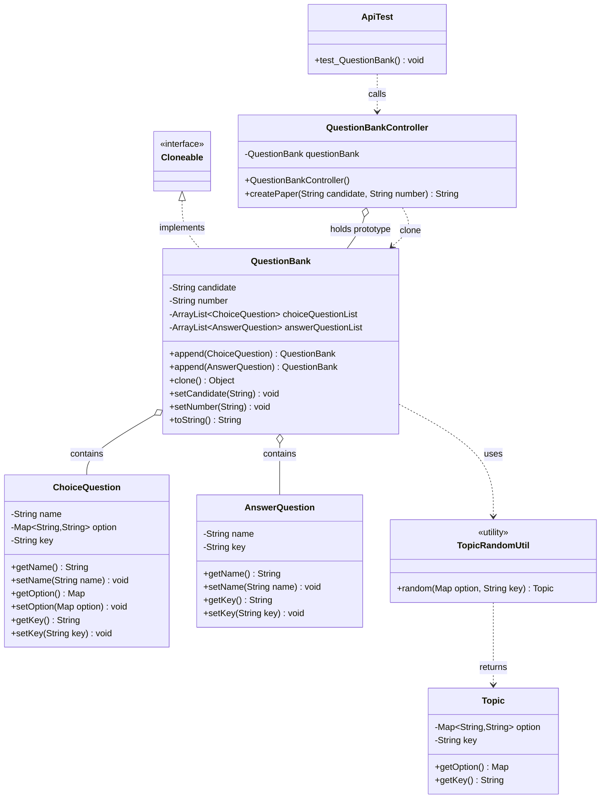
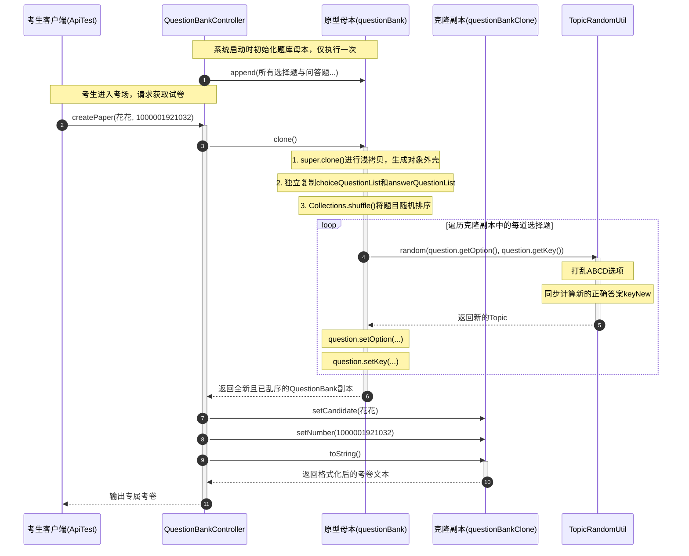

# 原型模式：试卷随机化出卷案例深度解析与题干剖析

本文档旨在帮助你彻底理清当前工程 `a4-PrototypePattern` 中已有代码的业务背景、设计意图、普通实现的致命缺陷，以及原型模式（`prototype` 包）的核心设计原理、类图结构、克隆机制与深浅拷贝等重难点细节。

---

## 目录
1. [业务场景背景：在线考试出卷与防作弊痛点](#一业务场景背景在线考试出卷与防作弊痛点)
2. [为什么案例分为三个部分？三阶段演进全景图](#二为什么案例分为三个部分三阶段演进全景图)
3. [题干代码逐类拆解（原材料在干嘛？）](#三题干代码逐类拆解原材料在干嘛)
   - 3.1 Infra 基础设施层（题目基础实体）
   - 3.2 common 普通代码实现（反面教材：高开销与千人一卷）
   - 3.3 test/common 单元测试中的调用与问题暴露
4. [原型模式核心解密与代码体现](#四原型模式核心解密与代码体现)
   - 4.1 什么是原型模式的本质？
   - 4.2 prototype 包下原型模式的完整编码体现
5. [整体工程架构与关联全景图（Mermaid 结构图）](#五整体工程架构与关联全景图mermaid-结构图)
   - 5.1 模块类关系图（Class Diagram）
   - 5.2 运行时克隆与出卷时序图（Sequence Diagram）
6. [prototype 核心重难点逐行深度剖析与注解](#六prototype-核心重难点逐行深度剖析与注解)
   - 6.1 核心机制：Java `Cloneable` 标记接口与 `native super.clone()`
   - 6.2 深度解密：浅拷贝（Shallow Copy）与深拷贝（Deep Copy）的陷阱
   - 6.3 算法精粹：`TopicRandomUtil` 选项打乱与答案自适应同步映射机制
   - 6.4 架构升华：原型模式在大厂实际开发中的演进与替代方案
7. [重构前后终极效果对比总结](#七重构前后终极效果对比总结)

---

## 一、业务场景背景：在线考试出卷与防作弊痛点

在线考试系统在互联网教育、企业内训、校招机考中是极其核心的基础服务。

一次标准的线上考试包含以下业务流程与现实约束：
1. **题库体量与装配开销巨大**：一套试卷包含大量的单选题、多选题、判断题与主观问答题，每道题都包含题干文本、选项字典（`Map<String, String>`）、参考答案与解析。在内存中初始化装配一套完整试卷的代价非常高。
2. **高并发交卷与出卷峰值**：数万名考生往往在同一时间准点登录系统调取试卷（例如 9:00 整开考）。如果每一次出卷都要重新完整走一遍“从零构建、组装试卷”的流程，数据库与应用服务器 CPU/内存将面临剧烈的瞬间峰值冲击。
3. **最严峻的防作弊需求（千人千面）**：如果所有考生的题目排版一模一样、选项 ABCD 排列一模一样，坐在相邻考位的考生只需偷看一眼对方填涂的选项（如“第1题选B”）即可轻松作弊。

**核心业务诉求**：  

**如何在系统启动时只装配一次母本题库，而在考生调取试卷时能够超高性能地复制出一份独立试卷，并在保证试卷题目内容不变的前提下，实现“题目乱序 + 选项混淆 + 正确答案自适应同步”，达成千人千卷防作弊？**

---

## 二、为什么案例分为三个部分？三阶段演进全景图

工程 `a4-PrototypePattern` 的代码结构严谨地展示了从硬编码反模式到优雅原型模式的演进过程：

```
a4-PrototypePattern/src/
├── main/java/com/ivanzhao/IDesign/
│   ├── Infra/                       # 【阶段一：题干/基础设施层】原子零件原料
│   │   ├── ChoiceQuestion.java      # 单选题实体（题干、选项 Map、标准答案）
│   │   └── AnswerQuestion.java      # 问答题实体（题干、标准答案）
│   │
│   ├── common/                      # 【阶段二：反面教材】常规单体硬编码实现
│   │   └── QuestionBankController.java # 每次调用都重复 new 全量题库，千人一卷无防作弊
│   │
│   └── prototype/                   # 【阶段三：重构目标区】原型模式标准实战
│       ├── QuestionBank.java        # 核心原型类：实现 Cloneable，内嵌题目与选项乱序克隆
│       ├── QuestionBankController.java # 控制器：常驻母本原型，按需克隆并填充考生信息
│       └── util/
│           ├── Topic.java           # 打乱选项后的数据传输载体（新选项Map + 新Key）
│           └── TopicRandomUtil.java # 核心洗牌算法：乱序 Map 并同步映射正确答案
│
└── test/java/com/ivanzhao/test/
    ├── common/                      # common 方案测试调用
    │   └── ApiTest.java
    └── prototype/                   # prototype 原型模式测试调用（验证千人千面）
        └── ApiTest.java
```

- **阶段一（`Infra`）**：定义考试题目的原子模型实体，为业务提供基础数据载体。
- **阶段二（`common`）**：每次出卷都使用 `new` 重新组装整套试卷，代码充斥着机械重复，且每张试卷完全雷同。
- **阶段三（`prototype`）**：母本常驻内存，通过克隆机制实现微秒级复制与个性化随机乱序。

---

## 三、题干代码逐类拆解（原材料在干嘛？）

### 3.1 Infra 基础设施层（题目基础实体）

基础设施层提供了最基础的题目数据结构：

#### 1. 单选题实体：[`Infra/ChoiceQuestion.java`](src/main/java/com/ivanzhao/IDesign/Infra/ChoiceQuestion.java)
```java
public class ChoiceQuestion {
    private String name;                 // 题干内容
    private Map<String, String> option;  // 选项键值对：{A: "...", B: "...", C: "...", D: "..."}
    private String key;                  // 正确答案键：如 "B"

    public ChoiceQuestion() {}
    public ChoiceQuestion(String name, Map<String, String> option, String key) {
        this.name = name;
        this.option = option;
        this.key = key;
    }
    // getter/setter ...
}
```

#### 2. 解答题实体：[`Infra/AnswerQuestion.java`](src/main/java/com/ivanzhao/IDesign/Infra/AnswerQuestion.java)
```java
public class AnswerQuestion {
    private String name;  // 问题题干
    private String key;   // 参考答案

    public AnswerQuestion() {}
    public AnswerQuestion(String name, String key) {
        this.name = name;
        this.key = key;
    }
    // getter/setter ...
}
```

---

### 3.2 common 普通代码实现（反面教材）

在 [`common/QuestionBankController.java`](src/main/java/com/ivanzhao/IDesign/common/QuestionBankController.java) 中：
```java
public class QuestionBankController {

    public String createPaper(String candidate, String number) {
        List<ChoiceQuestion> choiceQuestionList = new ArrayList<ChoiceQuestion>();

        // 每次出卷，都在堆内存中疯狂 new ChoiceQuestion 并初始化内部的 HashMap
        choiceQuestionList.add(new ChoiceQuestion("JAVA所定义的版本中不包括", new HashMap<String, String>() {
            {
            put("A", "JAVA2 EE");
            put("B", "JAVA2 Card");
            put("C", "JAVA2 ME");
            put("D", "JAVA2 HE");
            put("E", "JAVA2 SE");
        	}
        }, "D"));

        choiceQuestionList.add(new ChoiceQuestion("下列说法正确的是", ...));
        choiceQuestionList.add(new ChoiceQuestion("变量命名规范说法正确的是", ...));
        // ... 继续重复添加选择题与解答题

        // 拼接字符串并返回
        StringBuilder detail = new StringBuilder("考生：" + candidate + "\r\n考号：" + number + "...\r\n");
        // 遍历输出 ...
        return detail.toString();
    }
}
```

关于匿名内部类和为啥可以之间调用`put`的原因

> **① `new HashMap<>() {}` 是匿名内部类吗？**
>
> 是。
>
> **② 为什么里面可以直接 `put()`？**
>
> 因为匿名内部类继承了 `HashMap`，而实例初始化块中的 `put()` 本质上就是：
>
> ```
> this.put()
> ```
>
> **③ 这个内部是不是 static？**
>
> 不是。这里的：
>
> ```
> {
>     ...
> }
> ```
>
> 是**实例初始化块**，不是 `static {}`。

### 3.3 test/common 单元测试中的调用与问题暴露

在 [`test/common/ApiTest.java`](src/test/java/com/ivanzhao/test/common/ApiTest.java) 中测试 3 位考生出卷：
```java
@Test
public void test_QuestionBankController() {
    QuestionBankController questionBankController = new QuestionBankController();
    System.out.println(questionBankController.createPaper("花花", "1000001921032"));
    System.out.println(questionBankController.createPaper("豆豆", "1000001921051"));
    System.out.println(questionBankController.createPaper("大宝", "1000001921987"));
}
```

**暴露出的严重问题**：
1. **千人一卷，无法防作弊**：花花、豆豆、大宝的试卷，第 1 题完全一样，选项 ABCD 顺序完全一样，正确答案全都是 "D"。
2. **CPU 与内存极大浪费**：若有 10 万名考生，方法被调用 10 万次，就会执行 50 万次 `new ChoiceQuestion` 和 `new HashMap`，垃圾回收（GC）压力极大。

---

## 四、原型模式核心解密与代码体现

### 4.1 什么是原型模式的本质？
> **GoF 定义**：用原型实例指定创建对象的种类，并且通过**拷贝这些原型**创建新的对象。

- **本质核心**：**以某个现成的对象为“母本”，通过内存克隆快速制造出具备独立属性的新实例，绕过昂贵的构造装配过程。**
- **适用场景**：
  - 对象的创建过程极其耗时、耗费资源（如从数据库加载大量配置、解析复杂 XML/JSON）；
  - 需要以一个基础对象为底板，派生出多个具有细微差异的独立副本；
  - 保护原始母本不被修改的同时，允许外部随意修改克隆出的副本。

---

### 4.2 prototype 包下原型模式的完整编码体现

在 `prototype` 目录下，原型模式由以下几个核心类协同落地：

#### 1. 核心原型类：[`QuestionBank.java`](src/main/java/com/ivanzhao/IDesign/prototype/QuestionBank.java)
```java
// 核心标识：实现 Cloneable 标记接口，告知 JVM 本类支持克隆
public class QuestionBank implements Cloneable {

    private String candidate; // 考生
    private String number;    // 考号

    private ArrayList<ChoiceQuestion> choiceQuestionList = new ArrayList<>();
    private ArrayList<AnswerQuestion> answerQuestionList = new ArrayList<>();

    // 链式组装题目
    public QuestionBank append(ChoiceQuestion choiceQuestion) {
        choiceQuestionList.add(choiceQuestion);
        return this;
    }

    public QuestionBank append(AnswerQuestion answerQuestion) {
        answerQuestionList.add(answerQuestion);
        return this;
    }

    // 核心覆写 clone() 方法
    @Override
    public Object clone() throws CloneNotSupportedException {
        // 1. 调用本地底层方法进行二进制内存快照复制
        QuestionBank questionBank = (QuestionBank) super.clone();

        // 2. 将容器列表进行二次克隆，隔离不同考生的列表引用
        questionBank.choiceQuestionList = (ArrayList<ChoiceQuestion>) choiceQuestionList.clone();
        questionBank.answerQuestionList = (ArrayList<AnswerQuestion>) answerQuestionList.clone();

        // 3. 题目乱序：打乱试题出现顺序
        Collections.shuffle(questionBank.choiceQuestionList);
        Collections.shuffle(questionBank.answerQuestionList);

        // 4. 选项乱序：打乱选择题 ABCD 选项，并同步更新正确答案
        ArrayList<ChoiceQuestion> choiceQuestionList = questionBank.choiceQuestionList;
        for (ChoiceQuestion question : choiceQuestionList) {
            Topic random = TopicRandomUtil.random(question.getOption(), question.getKey());
            question.setOption(random.getOption());
            question.setKey(random.getKey());
        }
        return questionBank;
    }

    // setter 与 toString 略
}
```

对重写的`clone`方法的详解

```java
@Override
public Object clone() throws CloneNotSupportedException {

    /*
     * ============================================================
     * 第 1 步：调用 Object.clone()，创建一个当前对象的“副本”
     * ============================================================
     * 这里最容易产生一个误解：
     *     super.clone()
     * 并不是：
     *     “去克隆父类 Object”
     * 而是：
     *     “调用父类 Object 提供的 clone() 方法，
     *      让 JVM 按照当前这个 QuestionBank 对象的字段值，
     *      创建一个新的 QuestionBank 对象。”
     * 为什么是 super？
     * 因为 QuestionBank 继承自 Object：
     *     QuestionBank
     *          ↑
     *        Object
     * Java 中所有类最终都继承 Object。
     * Object 中本身就有一个 clone() 方法：
     *     protected native Object clone()
     * QuestionBank 自己重写了 clone()，
     * 所以如果这里直接写：
     *     clone();
     * 就会再次调用 QuestionBank 自己的 clone()，
     * 从而递归调用自己，最终 StackOverflowError。
     * 所以这里必须通过：
     *     super.clone()
     * 明确表示：
     *     “不要调用我 QuestionBank 自己的 clone()，
     *      去调用父类 Object 的 clone()。”
     * Object.clone() 的工作：
     *     原来的 QuestionBank(this)
     *              ↓
     *        Object.clone(this)
     *              ↓
     *       创建一个新的对象
     *              ↓
     *       把原对象的字段值复制过去
     * 注意：
     * Object.clone() 默认进行的是“浅拷贝”。
     * 对基本类型：
     *     int、double、boolean...
     * 直接复制值。
     * 对引用类型：
     *     ArrayList、String、ChoiceQuestion...
     * 复制的是“引用”，不是引用指向的对象本身。
     * ============================================================
     */

    QuestionBank questionBank = (QuestionBank) super.clone();


    /*
     * ============================================================
     * 第 2 步：为什么这里还要 clone 两个 ArrayList？
     * ============================================================
     * super.clone() 刚刚虽然创建了一个新的 QuestionBank，
     * 但是它只是浅拷贝。
     * 假设原来的对象是：
     *     questionBank
     *          |
     *          | choiceQuestionList
     *          ↓
     *       ArrayList A
     * super.clone() 后：
     *
     *     原对象                     克隆对象
     *
     *     questionBank                questionBank
     *          |                          |
     *          |                          |
     *          └──────→ ArrayList A ←─────┘
     * 两个 QuestionBank 中的 choiceQuestionList
     * 实际上指向的是同一个 ArrayList。
     * 这就有问题了。
     * 因为后面我们需要：
     *     Collections.shuffle(...)
     * 对试卷中的题目进行乱序。
     * 如果两个对象共享同一个 ArrayList，
     * 那么我们修改克隆对象的 List，
     * 原来的“题库模板”也会受到影响。
     * 所以这里重新 clone 一个 ArrayList：
     *     choiceQuestionList.clone()
     * 创建一个新的 ArrayList。
     * 于是变成：
     *     原题库                      新试卷
     *     choiceQuestionList          choiceQuestionList
     *           |                           |
     *           ↓                           ↓
     *       ArrayList A                ArrayList B
     *     A != B
     * 这样：
     *     shuffle(B)
     * 就不会改变：
     *     A
     * ============================================================
     */

    questionBank.choiceQuestionList =
            (ArrayList<ChoiceQuestion>) choiceQuestionList.clone();


    /*
     * 对简答题列表做同样的事情。
     * 原来的 answerQuestionList 和克隆后的
     * answerQuestionList 不再指向同一个 ArrayList。
     * 这样后面对克隆对象的题目顺序进行修改时，
     * 不会直接修改原题库的 List 容器。
     */
    questionBank.answerQuestionList =
            (ArrayList<AnswerQuestion>) answerQuestionList.clone();


    /*
     * ============================================================
     * 第 3 步：题目乱序
     * ============================================================
     * Collections.shuffle() 会随机打乱 List 中元素的顺序。
     * 注意这里操作的是：
     *     questionBank.choiceQuestionList
     * 而不是原来的：
     *     this.choiceQuestionList
     * questionBank 是刚才通过 super.clone()
     * 创建出来的“新试卷对象”。
     * 所以这里的业务含义就是：
     *     原始题库
     *          ↓
     *       clone()
     *          ↓
     *      新试卷
     *          ↓
     *       打乱题目
     * 例如原题库：
     *     1. Java版本
     *     2. 变量命名
     *     3. 标识符
     *     4. 表达式
     *     5. main方法
     * clone 后可能变成：
     *     4. 表达式
     *     1. Java版本
     *     5. main方法
     *     3. 标识符
     *     2. 变量命名
     * 每次 clone 都可以得到不同的顺序。
     * ============================================================
     */

    Collections.shuffle(questionBank.choiceQuestionList);

    Collections.shuffle(questionBank.answerQuestionList);


    /*
     * ============================================================
     * 第 4 步：准备对选择题的“选项”进行随机排序
     * ============================================================
     *
     * 这里：
     *     ArrayList<ChoiceQuestion> choiceQuestionList
     *             =
     *     questionBank.choiceQuestionList;
     
     * 是把克隆对象中的选择题列表，
     * 赋值给一个局部变量。
     *
     * 注意：
     *
     * 这一步没有创建新的 ArrayList。
     *
     * 只是让两个引用指向同一个 List：
     *
     *     questionBank.choiceQuestionList
     *                    |
     *                    ↓
     *                 List B
     *                    ↑
     *                    |
     *             choiceQuestionList
     *
     * 所以通过 choiceQuestionList 操作，
     * 实际上就是在操作：
     *
     *     questionBank.choiceQuestionList
     *
     * ============================================================
     */

    ArrayList<ChoiceQuestion> choiceQuestionList =
            questionBank.choiceQuestionList;


    /*
     * ============================================================
     * 第 5 步：遍历克隆试卷中的每一道选择题
     * ============================================================
     *
     * for-each 语法：
     *
     *     for (ChoiceQuestion question : choiceQuestionList)
     *
     * 意思是：
     *
     *     从 choiceQuestionList 中依次取出每一个
     *     ChoiceQuestion 对象，
     *     每次放到 question 变量中。
     *
     * 假设：
     *
     *     choiceQuestionList
     *          ↓
     *     [题目1, 题目2, 题目3, 题目4]
     *
     * 那么循环过程就是：
     *
     *     第一次：
     *         question = 题目1
     *
     *     第二次：
     *         question = 题目2
     *
     *     第三次：
     *         question = 题目3
     *
     *     第四次：
     *         question = 题目4
     *
     * ============================================================
     */

    for (ChoiceQuestion question : choiceQuestionList) {


        /*
         * ========================================================
         * 第 6 步：随机生成一套新的选项顺序
         * ========================================================
         *
         * question.getOption()
         *
         * 获取当前选择题的选项，例如：
         *
         *     A -> Java
         *     B -> C++
         *     C -> Python
         *     D -> Go
         *
         *
         * question.getKey()
         *
         * 获取当前正确答案，例如：
         *
         *     A
         *
         *
         * 然后交给：
         *
         *     TopicRandomUtil.random(...)
         *
         * 这个工具负责：
         *
         *     1. 随机打乱 A/B/C/D 对应的内容
         *     2. 根据选项内容的变化，
         *        同步计算新的正确答案
         *
         *
         * 例如原来：
         *
         *     A -> Java
         *     B -> C++
         *     C -> Python
         *     D -> Go
         *
         *     正确答案：A
         *
         * 随机之后可能变成：
         *
         *     A -> Python
         *     B -> Go
         *     C -> Java
         *     D -> C++
         *
         * 那么原来的正确答案 A 就不能继续使用了。
         *
         * 因为 Java 现在跑到了 C。
         *
         * 所以 random() 同时返回：
         *
         *     新选项
         *     新答案
         *
         * ========================================================
         */

        Topic random =
                TopicRandomUtil.random(
                        question.getOption(),
                        question.getKey()
                );


        /*
         * ========================================================
         * 第 7 步：把随机后的选项写回当前题目
         * ========================================================
         *
         * random.getOption()
         *
         * 获取随机生成的新选项。
         *
         * 然后：
         *
         *     question.setOption(...)
         *
         * 把当前题目的选项替换成新的随机顺序。
         *
         * ========================================================
         */

        question.setOption(random.getOption());


        /*
         * ========================================================
         * 第 8 步：把新的正确答案写回当前题目
         * ========================================================
         *
         * 因为选项已经重新排列，
         * 所以正确答案对应的字母也必须一起修改。
         *
         * 例如：
         *
         *     原来：
         *         A = Java
         *         正确答案 = A
         *
         *     随机后：
         *         C = Java
         *
         *     那么：
         *         正确答案 = C
         *
         * 所以这里必须：
         *
         *     question.setKey(random.getKey());
         *
         * ========================================================
         */

        question.setKey(random.getKey());
    }


    /*
     * ============================================================
     * 第 9 步：返回最终生成好的“新试卷对象”
     * ============================================================
     *
     * 到这里：
     *
     *     questionBank
     *
     * 已经不是原来的题库模板了。
     *
     * 它是一个新的 QuestionBank 对象，并且已经：
     *
     *     ① 复制了原题库
     *     ② 创建了独立的题目 List 容器
     *     ③ 随机打乱了题目顺序
     *     ④ 随机打乱了选择题选项
     *     ⑤ 同步修改了正确答案
     *
     * 所以最终返回这个新对象。
     *
     * Controller 拿到这个对象以后，
     * 还会继续执行：
     *
     *     questionBankClone.setCandidate(candidate);
     *     questionBankClone.setNumber(number);
     *
     * 最后：
     *
     *     questionBankClone.toString();
     *
     * 得到这一位考生的最终试卷。
     *
     * ============================================================
     */

    return questionBank;
}
```


#### 2. 原型母本管理器：[`QuestionBankController.java`](src/main/java/com/ivanzhao/IDesign/prototype/QuestionBankController.java)

```java
public class QuestionBankController {

    // 【关键点】在控制器持有唯一的题库母本（Prototype 原型对象）
    private QuestionBank questionBank = new QuestionBank();

    public QuestionBankController() {
        // 只在系统启动/实例化时初始化装配一次！
        questionBank.append(new ChoiceQuestion("JAVA所定义的版本中不包括", ...))
                    .append(new ChoiceQuestion("下列说法正确的是", ...))
                    .append(new AnswerQuestion("小红马和小黑马生的小马几条腿", "4条腿"));
        // ...
    }

    public String createPaper(String candidate, String number) throws CloneNotSupportedException {
        // 【核心操作】直接从母本克隆出一份全新的试卷副本，耗时仅几微秒！
        // 先准备一个已经初始化好的 QuestionBank 母本，然后通过 clone() 快速复制出新的试卷。
        QuestionBank questionBankClone = (QuestionBank) questionBank.clone();

        // 为克隆出来的独立副本填充考生的专属个性化信息
        questionBankClone.setCandidate(candidate);
        questionBankClone.setNumber(number);

        return questionBankClone.toString();
    }
}
```

---

## 五、整体工程架构与关联全景图（Mermaid 结构图）

### 5.1 模块类关系图（Class Diagram）



---

### 5.2 运行时克隆与出卷时序图（Sequence Diagram）



---

## 六、prototype 核心重难点逐行深度剖析与注解

### 6.1 核心机制：Java `Cloneable` 标记接口与 `native super.clone()`

在 Java 中，原型模式是依托语言底层的特化机制实现的，有 2 个极其核心的底层细节：

#### 1. 为什么 `Cloneable` 接口没有任何抽象方法？
查看 JDK 源码：
```java
package java.lang;
public interface Cloneable {
}
```
- 它是一个典型的**标记接口（Marker Interface）**。它不包含任何行为契约，它的唯一作用是向 JVM 打上一个标识：“**此类的实例允许被内存级克隆**”。
- **🚨 经典易错考点**：如果你没有显式声明 `implements Cloneable`，但在类中调用了 `super.clone()`，JVM 会在运行时直接抛出：  `java.lang.CloneNotSupportedException`！

> 它存在的意义主要是告诉 Java：
>
> > “这个类允许使用 `Object.clone()` 机制。”
>
> ------
>
> #### 真正的 `clone()` 在哪里？
>
> 在所有 Java 类的祖先：
>
> ```
> Object
> ```
>
> 里面。
>
> 也就是说，你的：
>
> ```
> QuestionBank
> ```
>
> 实际上：
>
> ```
> QuestionBank
>     ↓ extends
> Object
> ```
>
> 而 `Object` 中本身就存在：
>
> ```
> protected native Object clone()
>         throws CloneNotSupportedException
> ```
>
> 所以真正的关系是：
>
> ```
> Object
>  │
>  │ 自带 clone()
>  ↓
> QuestionBank
>  │
>  │ implements Cloneable
>  ↓
> 允许使用 Object.clone() 机制
> ```

#### 2. `super.clone()` 是如何工作的？
- `Object.clone()` 声明为 `protected native Object clone() throws CloneNotSupportedException;`；
- 它是一个由 C/C++ 实现的底层本地方法，**不会去执行类的任何构造函数**；
- 它的执行原理是：**直接在 JVM 堆内存中开辟一段与母本相同大小的空间，将母本对象头与各属性变量的二进制位逐字节（bit-by-bit）拷贝过去**。因此，它的执行效率比通过 `new` 反复走构造器、变量初始化赋值高出数倍！

> 这里：
>
> ```
> super.clone()
> ```
>
> 调用的是：
>
> ```
> Object.clone()
> ```
>
> 它的核心作用是：
>
> > **创建一个新的对象，并把当前对象的字段值复制过去。**
>
> 例如现在：
>
> ```
> QuestionBank questionBank = new QuestionBank();
> ```
>
> 假设内存中：
>
> ```
> questionBank
>      │
>      ▼
> ┌────────────────────────────┐
> │ QuestionBank对象            │
> │                            │
> │ candidate = null           │
> │ number = null              │
> │ choiceQuestionList = 0x100 │
> │ answerQuestionList = 0x200 │
> └────────────────────────────┘
> ```
>
> 执行：
>
> ```
> QuestionBank questionBankClone = (QuestionBank) super.clone();
> ```
>
> 会产生一个**新的 QuestionBank 对象**：
>
> ```
> 原对象                         新对象
> 
> questionBank                  questionBankClone
>      │                              │
>      ▼                              ▼
> ┌───────────────┐             ┌───────────────┐
> │ QuestionBank  │             │ QuestionBank  │
> │               │             │               │
> │ candidate null│             │ candidate null│
> │ number null   │             │ number null   │
> │ list = 0x100 ─┼─────────────┼─→ list = 0x100
> │ list = 0x200 ─┼─────────────┼─→ list = 0x200
> └───────────────┘             └───────────────┘
> ```
>
> 注意：**这里默认只是浅拷贝。**
>
> 也就是说：
>
> ```
> questionBankClone != questionBank
> ```
>
> 但是：
>
> ```
> questionBankClone.choiceQuestionList == questionBank.choiceQuestionList
> ```
>
> 默认情况下是 `true`。
>
> 所以你看到 `super.clone()` 后面还有两句非常重要：
>
> ```java
> questionBank.choiceQuestionList =
>         (ArrayList<ChoiceQuestion>) choiceQuestionList.clone();
> 
> questionBank.answerQuestionList =
>         (ArrayList<AnswerQuestion>) answerQuestionList.clone();
> ```

---

### 6.2 深度解密：浅拷贝（Shallow Copy）与深拷贝（Deep Copy）的陷阱

这是原型模式在实际面试与生产环境中最容易踩雷的核心考点！

请看 `QuestionBank.java` 中的核心实现：
```java
QuestionBank questionBank = (QuestionBank) super.clone();
questionBank.choiceQuestionList = (ArrayList<ChoiceQuestion>) choiceQuestionList.clone();
questionBank.answerQuestionList = (ArrayList<AnswerQuestion>) answerQuestionList.clone();
```

#### 深度拷问：这段代码到底是浅拷贝还是深拷贝？
- **第一层：`super.clone()`（浅拷贝）**：  

  如果只写这一行，新生成的 `questionBank` 中的 `choiceQuestionList` 引用，与母本的 `choiceQuestionList` **指向的是堆中同一个 ArrayList 对象**！如果这时调用 `Collections.shuffle`，母本的题目顺序直接被破坏，后续所有考生的题目顺序全部互相串扰！

- **第二层：`(ArrayList) choiceQuestionList.clone()`（集合浅拷贝）**：  
  
  作者特意追加了这一步，把 `ArrayList` 本身克隆了一份。此时，考生 A 与考生 B 分别拥有了独立的 `ArrayList` 实例。因此，对 A 的列表做 `Collections.shuffle`，绝不会影响 B 的列表！
  
- **第三层：隐患仍然存在！`ChoiceQuestion` 实体依然是浅引用！**  
  
  `ArrayList.clone()` 只复制了集合自身数组，**集合里面的每个元素对象（`ChoiceQuestion`）并没有被深度复制**！这意味着：考生 A 列表里的题目 1，与母本里的题目 1，在内存中依然是**同一个对象指针**！

#### 为什么本案例运行起来看似没有出现数据冲突？
请看后续的选项打乱逻辑：
```java
Topic random = TopicRandomUtil.random(question.getOption(), question.getKey());
question.setOption(random.getOption()); // 赋入的是一个全新的 HashMap
question.setKey(random.getKey());
```
- **关键细节**：`TopicRandomUtil.random` 每次内部都 `new HashMap<String, String>()` 返回了一个全新的选项 Map。
- **🚨 生产级并发预警**：在单线程测试下看似一切正常，但若在**高并发多线程**环境下，多个考生并发调取 `createPaper` 时，会同时修改共享的 `ChoiceQuestion` 实体中的 `option` 和 `key`，**必定引发严重的数据竞态条件（Race Condition）与答案错乱 Bug！**
- **企业级彻底深拷贝的最佳实践**：
  若要实现真正的多线程安全深拷贝，在对集合 clone 时，必须把每个元素也深拷贝一份：
  ```java
  questionBank.choiceQuestionList = new ArrayList<>();
  for (ChoiceQuestion q : this.choiceQuestionList) {
      questionBank.choiceQuestionList.add(new ChoiceQuestion(q.getName(), new HashMap<>(q.getOption()), q.getKey()));
  }
  ```

---

### 6.3 算法精粹：`TopicRandomUtil` 选项打乱与答案自适应同步映射机制

[`TopicRandomUtil.java`](src/main/java/com/ivanzhao/IDesign/prototype/util/TopicRandomUtil.java) 是整个防作弊体系的算法灵魂：

```java
public class TopicRandomUtil {

    public static Topic random(Map<String, String> option, String key) {
        Set<String> keySet = option.keySet();               // 提取原始题目的选项键集合 [A, B, C, D]
        ArrayList<String> keyList = new ArrayList<>(keySet);
        Collections.shuffle(keyList);                       // 核心随机洗牌：被打乱，如变成 [C, A, D, B]

        HashMap<String, String> optionNew = new HashMap<>();
        int idx = 0;
        String keyNew = "";

        // 核心映射：重新将原选项内容填入打乱后的新键中
        for (String next : keySet) {
            String randomKey = keyList.get(idx++);          // 获取洗牌后的新标签（例如 C）
            if (key.equals(next)) {                         // 如果当前是原始的正确答案（例如 B）
                keyNew = randomKey;                         // 则把当前分配给它的新标签记录为新正确答案！
            }
            optionNew.put(randomKey, option.get(next));     // 把原来 "B" 的内容放进 "C"
        }
        return new Topic(optionNew, keyNew);
    }
}
```

#### 算法执行轨迹追踪推导：
- **初始输入**：
  - 选项：`{A: "JAVA2 EE", B: "JAVA2 Card", C: "JAVA2 ME", D: "JAVA2 HE"}`
  - 正确答案：`key = "D"`（内容是 `"JAVA2 HE"`）
- **乱序过程**：
  - `keyList` 被洗牌随机重排为：`["B", "D", "A", "C"]`；
  - 当遍历到 `"D"`（原始正确答案）时，对应取出的 `randomKey` 为 `"A"`；
  - 因此代码触发 `keyNew = "A"`，并将内容放进新选项：`optionNew.put("A", "JAVA2 HE")`；
- **输出结果**：
  - 选项被完全重打为：`{A: "JAVA2 HE", B: "JAVA2 EE", C: "JAVA2 ME", D: "JAVA2 Card"}`；
  - 正确答案自动联动更新为：`"A"`；
- **效果**：不仅选项换了位置，考生的答案校验系统也自动适配了新答案，真正做到“神不知鬼不觉”的防作弊！

---

### 6.4 架构升华：原型模式在大厂实际开发中的演进与替代方案

在现代大型企业级开发中，直接使用 Java 原生 `Cloneable` 接口的场景在逐渐减少（因为浅拷贝陷阱多、且存在强制类型转换与受检异常）。现代工程通常采用以下 **3 种替代方案落地原型模式**：

| 技术手段 | 实现原理 | 优势 | 劣势 | 典型工业应用场景 |
| :--- | :--- | :--- | :--- | :--- |
| **1. 原生 `Cloneable`（本案例）** | 覆写 `clone()` 调底层 `super.clone()` | JVM 二进制物理复制，速度极快，开销极低 | 无法自动深度克隆，多层引用时易引发并发污染 | 游戏粒子系统、高频低开销对象池复用 |
| **2. JSON/字节流序列化** | `JSON.parseObject(JSON.toJSONString(obj))` | **彻底的深拷贝**，完全解绑所有引用关系 | 经过字符串/字节流编解码，性能有一定损耗 | 复杂审批流流程模板下发、微服务配置快照派生 |
| **3. 拷贝构造函数 (Copy Constructor)** | `public QuestionBank(QuestionBank other)` | 语义直观明确，编译期类型安全，可控性最高 | 字段数量极多时代码编写繁重 | DDD 领域驱动设计实体派生、Spring/Netty 内部组件 |

---

## 七、复习：浅拷贝与深拷贝

> ### 一、先用最简单的例子理解浅拷贝
>
> 假设有：
>
> ```
> class Person {
>     String name;
>     Address address;
> }
> ```
>
> 然后：
>
> ```
> Person p1 = new Person();
> p1.name = "张三";
> p1.address = new Address();
> ```
>
> 内存可以想象成：
>
> ```
> p1
>  │
>  ▼
> ┌─────────────────┐
> │ Person 对象      │
> │ name = "张三"   │
> │ address ────────┼──────┐
> └─────────────────┘      │
>                          ▼
>                    ┌─────────────┐
>                    │ Address对象 │
>                    └─────────────┘
> ```
>
> 现在：
>
> ```
> Person p2 = p1.clone();
> ```
>
> 如果是**浅拷贝**：
>
> ```
> p1                          p2
> │                           │
> ▼                           ▼
> ┌─────────────┐          ┌─────────────┐
> │ Person      │          │ Person      │
> │ name=张三   │          │ name=张三   │
> │ address ────┼────┐ ┌───┼─ address    │
> └─────────────┘    │ │   └─────────────┘
>                    ▼ ▼
>                 同一个 Address
> ```
>
> 所以：
>
> ```
> p1 != p2
> ```
>
> 但是：
>
> ```
> p1.address == p2.address
> ```
>
> 是：
>
> ```
> true
> ```
>
> **这就是浅拷贝。**
>
> ------
>
> ### 二、深拷贝是什么？
>
> 深拷贝则是：
>
> ```
> p1                          p2
> │                           │
> ▼                           ▼
> ┌─────────────┐          ┌─────────────┐
> │ Person      │          │ Person      │
> │ name=张三   │          │ name=张三   │
> │ address ────┼──→ A     │ address ────┼──→ B
> └─────────────┘          └─────────────┘
> ```
>
> A 和 B 是两个不同的 `Address`：
>
> ```
> p1 != p2
> p1.address != p2.address
> ```
>
> 这就是深拷贝。
>
> ------
>
> ### 三、记住一句最简单的话
>
> > **浅拷贝：外壳复制了，里面引用的对象还共用。**
> >
> > **深拷贝：外壳复制了，里面引用的对象也继续复制。**
>
> 尤其注意：
>
> **“引用类型字段被复制” ≠ “引用指向的对象被复制”。**
>
> 这是 Java 浅拷贝最核心的地方。
>
> ------
>
> ### 四、现在把这个概念套回你的 `QuestionBank`
>
> 你的：
>
> ```
> QuestionBank
> ```
>
> 里面有：
>
> ```
> private String candidate;
> private String number;
> 
> private ArrayList<ChoiceQuestion> choiceQuestionList;
> private ArrayList<AnswerQuestion> answerQuestionList;
> ```
>
> 所以它的对象结构大概是：
>
> ```
> QuestionBank
> │
> ├── candidate
> ├── number
> │
> ├── choiceQuestionList ──────→ ArrayList
> │                                │
> │                                ├── ChoiceQuestion
> │                                ├── ChoiceQuestion
> │                                └── ChoiceQuestion
> │
> └── answerQuestionList ──────→ ArrayList
>                                  │
>                                  ├── AnswerQuestion
>                                  ├── AnswerQuestion
>                                  └── AnswerQuestion
> ```
>
> 这个图非常重要。
>
> ------
>
> ### 五、现在执行 `super.clone()`
>
> 代码：
>
> ```
> QuestionBank questionBank =
>         (QuestionBank) super.clone();
> ```
>
> `super.clone()` 做的是**浅拷贝**。
>
> 于是：
>
> ```
> 原来的 QuestionBank                 克隆出来的 QuestionBank
> 
>        │                                      │
>        ▼                                      ▼
> ┌──────────────┐                       ┌──────────────┐
> │ QuestionBank │                       │ QuestionBank │
> │              │                       │              │
> │ candidate    │                       │ candidate    │
> │ number       │                       │ number       │
> │              │                       │              │
> │ choiceList ──┼──────────────┐ ┌──────┼─ choiceList │
> │              │              │ │      │              │
> │ answerList ──┼──────────┐   │ │  ┌───┼─ answerList │
> └──────────────┘          │   │ │  │   └──────────────┘
>                           ▼   ▼ ▼  ▼
>                        原来的 List
> ```
>
> 也就是说：
>
> ```
> questionBank.choiceQuestionList
> ```
>
> 和原来的：
>
> ```
> this.choiceQuestionList
> ```
>
> 指向的是**同一个 ArrayList**。
>
> ------
>
> ### 六、这就产生问题了
>
> 你的原型模式后面要做：
>
> ```
> Collections.shuffle(questionBank.choiceQuestionList);
> ```
>
> 什么意思？
>
> > 把克隆试卷里的题目顺序打乱。
>
> 假如没有额外处理：
>
> ```
> 原题库                    克隆试卷
> 
> QuestionBank              QuestionBank
>      │                         │
>      │                         │
>      └────────┬────────────────┘
>               ↓
>           同一个 List
>               │
>          题目1
>          题目2
>          题目3
> ```
>
> 然后：
>
> ```
> Collections.shuffle(questionBank.choiceQuestionList);
> ```
>
> 你以为是在：
>
> ```
> 打乱克隆试卷
> ```
>
> 实际上：
>
> ```
> 原题库和克隆试卷共用这个 List
> ```
>
> 所以：
>
> > **原型母本也被你打乱了。**
>
> 这显然不行。
>
> ------
>
> ### 七、所以代码又做了一次 clone
>
> 这就是你代码中这句的真正原因：
>
> ```
> questionBank.choiceQuestionList =
>         (ArrayList<ChoiceQuestion>) choiceQuestionList.clone();
> ```
>
> 注意这里的 `choiceQuestionList.clone()`。
>
> 它创建了一个**新的 ArrayList 容器**。
>
> 于是：
>
> ```
> 原题库                         克隆试卷
> 
> List A                         List B
>  │                              │
>  ├──题目1                       ├──题目1
>  ├──题目2                       ├──题目2
>  └──题目3                       └──题目3
> ```
>
> 现在：
>
> ```
> List A != List B
> ```
>
> 所以：
>
> ```
> Collections.shuffle(List B);
> ```
>
> 只会改变 B 的顺序。
>
> **原题库 A 不会被 shuffle。**
>
> ------
>
> ### 八、但是！这里还没有彻底解决
>
> 这是你这个案例最值得搞懂的地方。
>
> 虽然：
>
> ```
> List A ≠ List B
> ```
>
> 但是：
>
> ```
> List A里面的题目
>        ↓
> ChoiceQuestion 1
> 
> List B里面的题目
>        ↓
> 还是 ChoiceQuestion 1
> ```
>
> 也就是说：
>
> ```
> 原题库                     克隆试卷
> 
> List A                     List B
>  │                           │
>  ├───────→ ChoiceQ1 ←───────┤
>  │                           │
>  ├───────→ ChoiceQ2 ←───────┤
>  │                           │
>  └───────→ ChoiceQ3 ←───────┘
> ```
>
> **两个 List 不一样，但 List 里的 ChoiceQuestion 还是同一个对象。**
>
> 因此这是：
>
> > **List 容器复制了，但 List 元素没有复制。**
>
> ------
>
> ### 九、这时候你就能看懂后面的代码了
>
> 代码：
>
> ```
> for (ChoiceQuestion question : choiceQuestionList) {
> 
>     Topic random =
>         TopicRandomUtil.random(
>             question.getOption(),
>             question.getKey()
>         );
> 
>     question.setOption(random.getOption());
>     question.setKey(random.getKey());
> }
> ```
>
> 这里实际上在做：
>
> > **把每一道选择题的选项重新随机排列，并同步修改正确答案。**
>
> 比如原来：
>
> ```
> A → Java EE
> B → Java Card
> C → Java ME
> D → Java HE
> E → Java SE
> 
> 正确答案：D
> ```
>
> 随机之后可能变成：
>
> ```
> A → Java ME
> B → Java SE
> C → Java HE
> D → Java EE
> E → Java Card
> 
> 正确答案：C
> ```
>
> 所以它修改了：
>
> ```
> question.setOption(...)
> question.setKey(...)
> ```
>
> ------
>
> ### 十、这时候就暴露出一个更深的问题
>
> 如果：
>
> ```
> 原题库
>      │
>      └──── ChoiceQuestion ←──── 克隆试卷
> ```
>
> 两个地方指向的是同一个 `ChoiceQuestion`，
>
> 那么：
>
> ```
> question.setOption(...)
> ```
>
> 实际上会把**原题库里的 ChoiceQuestion 也修改掉**。
>
> 于是下一次：
>
> ```
> questionBank.clone()
> ```
>
> 你复制的已经不是最初的题库了。
>
> 这就是为什么严格意义上：
>
> > **你这份代码不是一个完全彻底的深拷贝实现。**
>
> 它至少做了：
>
> ```
> QuestionBank
>     ↓
> 复制
>     ↓
> 新的 QuestionBank
> 
> List
>     ↓
> 复制
>     ↓
> 新的 List
> ```
>
> 但是：
>
> ```
> ChoiceQuestion
>     ↓
> 没有继续复制
>     ↓
> 仍然共享
> ```
>
> 而且 `ChoiceQuestion` 里面还有：
>
> ```
> Map<String, String> option
> ```
>
> 又是一层引用。
>
> ------
>
> ### 十一、所以这个案例的“复制链”应该这样理解
>
> 原型母本：
>
> ```
> QuestionBank A
> │
> ├── List A
> │    ├── ChoiceQuestion 1
> │    │      └── Map
> │    ├── ChoiceQuestion 2
> │    │      └── Map
> │    └── ChoiceQuestion 3
> │
> └── List B
>      ├── AnswerQuestion 1
>      └── AnswerQuestion 2
> ```
>
> 如果真正做深拷贝：
>
> ```
> QuestionBank A                     QuestionBank B
> │                                  │
> ├── List A                         ├── List B
> │    ├── ChoiceQ1                  │    ├── ChoiceQ1'
> │    │      └── Map                │    │      └── Map'
> │    ├── ChoiceQ2                  │    ├── ChoiceQ2'
> │    │      └── Map                │    │      └── Map'
> │    └── ChoiceQ3                  │    └── ChoiceQ3'
> │                                  │
> └── AnswerList                     └── AnswerList
> ```
>
> **任何可变对象都互相独立。**
>
> 这才是比较完整的深拷贝。
>
> ------
>
> ### 十二、但是你现在不要把重点放在“怎么写深拷贝”
>
> 你现在学习原型模式，真正应该先理解这个业务流程：
>
> ### 没有原型模式
>
> 每次：
>
> ```
> 考生A来了
>  ↓
> 重新 new QuestionBank
>  ↓
> 重新 new 9道题
>  ↓
> 重新初始化所有Map
>  ↓
> 打乱
>  ↓
> 生成试卷
> 
> 考生B来了
>  ↓
> 重新 new QuestionBank
>  ↓
> 重新 new 9道题
>  ↓
> 重新初始化所有Map
>  ↓
> 打乱
>  ↓
> 生成试卷
> ```
>
> 非常重复。
>
> ------
>
> ### 十三、有原型模式
>
> 系统启动：
>
> ```
> QuestionBankController
>         │
>         ↓
>    new QuestionBank
>         │
>         ↓
>   把所有题目装进去
>         │
>         ↓
>    【原型母本】
> ```
>
> 这个过程只需要一次。
>
> 之后：
>
> ```
> 考生A
>  │
>  ↓
> questionBank.clone()
>  │
>  ↓
> 得到副本
>  │
>  ↓
> 打乱题目
>  │
>  ↓
> 打乱选项
>  │
>  ↓
> 设置考生A
>  │
>  ↓
> 生成试卷
> ```
>
> 考生B：
>
> ```
> 考生B
>  │
>  ↓
> questionBank.clone()
>  │
>  ↓
> 得到另一个副本
>  │
>  ↓
> 打乱
>  │
>  ↓
> 设置考生B
>  │
>  ↓
> 生成试卷
> ```
>
> 考生C：
>
> ```
> 考生C
>  │
>  ↓
> questionBank.clone()
>  │
>  ↓
> 得到另一个副本
>  │
>  ↓
> 打乱
>  │
>  ↓
> 设置考生C
>  │
>  ↓
> 生成试卷
> ```
>
> 所以你真正需要建立的核心画面是：
>
> ```
>                     QuestionBank
>                     【原型母本】
>                          │
>               已经装好了所有题目
>                          │
>              ┌───────────┼───────────┐
>              │           │           │
>            clone       clone       clone
>              ↓           ↓           ↓
>           试卷A         试卷B        试卷C
>              │           │           │
>            乱序         乱序          乱序
>              │           │           │
>            花花         小明          小王
> ```

## 八、复习`super`关键字和`this`

### 8.1 super关键字辨析

> ### 一、先记住一句最重要的话
>
> > **`super` 不是一个“父类对象”。**
> >
> > **`super` 是一个特殊关键字，用来明确告诉 Java：去当前类的父类中找成员。**
>
> 所以：
>
> ```
> super.xxx
> ```
>
> 意思是：
>
> > 去父类找 `xxx`
>
> ```
> super.xxx()
> ```
>
> 意思是：
>
> > 去父类找 `xxx()` 方法并调用
>
> ```
> super(...)
> ```
>
> 意思是：
>
> > 调用父类的构造方法
>
> 这三个是你目前最应该建立起来的认知。
>
> ------
>
> ### 二、先不要管 clone，看最简单的例子
>
> ```
> class Animal {
> 
>     public void eat() {
>         System.out.println("动物吃东西");
>     }
> }
> 
> class Dog extends Animal {
> 
>     public void eat() {
>         System.out.println("狗吃狗粮");
>     }
> 
>     public void test() {
>         eat();
>         super.eat();
>     }
> }
> ```
>
> 然后：
>
> ```
> Dog dog = new Dog();
> dog.test();
> ```
>
> 结果：
>
> ```
> 狗吃狗粮
> 动物吃东西
> ```
>
> 为什么？
>
> ------
>
> ## `eat()`
>
> 在 `Dog` 里面：
>
> ```
> eat();
> ```
>
> Java 默认优先找：
>
> ```
> Dog.eat()
> ```
>
> 所以调用的是：
>
> ```
> Dog.eat()
> ```
>
> ------
>
> ## `super.eat()`
>
> 但是：
>
> ```
> super.eat();
> ```
>
> 你是在明确告诉 Java：
>
> > **不要使用当前 Dog 的 eat()，去它的父类 Animal 里面找 eat()。**
>
> 所以调用：
>
> ```
> Animal.eat()
> ```
>
> ------
>
> ### 三、所以 `super` 的核心作用其实是“指定查找范围”
>
> 你可以把它理解成：
>
> ```
> 当前类
>   ↓
> super
>   ↓
> 父类
> ```
>
> 例如：
>
> ```
> class Animal {
>     int age = 10;
> }
> 
> class Dog extends Animal {
>     int age = 5;
> 
>     void test() {
>         System.out.println(age);
>         System.out.println(super.age);
>     }
> }
> ```
>
> 输出：
>
> ```
> 5
> 10
> ```
>
> 因为：
>
> ```
> age
> ```
>
> 相当于：
>
> ```
> 找当前 Dog 中的 age
> ```
>
> 而：
>
> ```
> super.age
> ```
>
> 相当于：
>
> ```
> 去父类 Animal 中找 age
> ```
>
> 所以：
>
> ```
> Dog
> ├── age = 5
> │
> └── super
>       ↓
>    Animal
>       └── age = 10
> ```
>
> ------
>
> ### 四、然后你就能理解 `super()` 了
>
> 这个更加常见。
>
> ```
> class Animal {
> 
>     public Animal(String name) {
>         System.out.println("Animal构造");
>     }
> }
> 
> class Dog extends Animal {
> 
>     public Dog(String name) {
>         super(name);
>         System.out.println("Dog构造");
>     }
> }
> ```
>
> 这里：
>
> ```
> super(name);
> ```
>
> 不是创建一个 Animal。
>
> 而是：
>
> > **调用父类 Animal 的构造方法。**
>
> 执行：
>
> ```
> new Dog("旺财");
> ```
>
> 大致过程：
>
> ```
> new Dog()
>     ↓
> Dog构造方法
>     ↓
> super(name)
>     ↓
> Animal构造方法
>     ↓
> 返回Dog构造方法
>     ↓
> Dog自己的初始化
> ```
>
> 所以 `super()` 的重点也是：
>
> > **调用父类的构造方法。**
>
> 不是：
>
> > 创建一个父类对象。
>
> ------
>
> ### 五、现在回到你刚才最困惑的 `super.clone()`
>
> 你之前看到：
>
> ```
> @Override
> public Object clone() throws CloneNotSupportedException {
> 
>     QuestionBank questionBank =
>             (QuestionBank) super.clone();
> 
>     ...
> }
> ```
>
> 你脑子里可能产生了这样的理解：
>
> ```
> QuestionBank
>     ↓
> super.clone()
>     ↓
> Object.clone()
>     ↓
> 克隆一个 Object
> ```
>
> **这个理解是不对的。**
>
> 正确理解应该是：
>
> ```
> QuestionBank
>     ↓
> super.clone()
>     ↓
> 去父类 Object 中找 clone() 方法
>     ↓
> 调用 Object.clone()
>     ↓
> 复制“当前这个 QuestionBank 对象”
> ```
>
> 关键就在于：
>
> > **`super` 决定的是“去哪里找方法”，而不是“操作什么类型的对象”。**
>
> ------
>
> ### 六、这个区别非常重要
>
> 我们看：
>
> ```
> class Dog extends Animal {
> 
>     public void test() {
>         super.eat();
>     }
> }
> ```
>
> 这里：
>
> ```
> super.eat();
> ```
>
> 表示：
>
> > 去 `Animal` 中找 `eat()`。
>
> 但是**被操作的对象仍然是当前这个 Dog 对象**。
>
> 假设：
>
> ```
> Dog dog = new Dog();
> dog.test();
> ```
>
> 进入：
>
> ```
> test()
> ```
>
> 此时：
>
> ```
> this
> ```
>
> 仍然是：
>
> ```
> dog
> ```
>
> 而不是一个 Animal。
>
> 所以可以形成一个非常重要的区分：
>
> ```
> this
> ↓
> 当前对象是谁？
> 
> super
> ↓
> 去父类哪里找成员？
> ```
>
> ------
>
> ### 七、把 `this` 和 `super` 放在一起，你就很容易理解了
>
> 例如：
>
> ```
> class Animal {
> 
>     int age = 10;
> 
>     public void eat() {
>         System.out.println("Animal eat");
>     }
> }
> 
> class Dog extends Animal {
> 
>     int age = 5;
> 
>     @Override
>     public void eat() {
>         System.out.println("Dog eat");
>     }
> 
>     public void test() {
> 
>         System.out.println(this.age);
>         System.out.println(super.age);
> 
>         this.eat();
>         super.eat();
>     }
> }
> ```
>
> 执行：
>
> ```
> Dog dog = new Dog();
> dog.test();
> ```
>
> 结果：
>
> ```
> 5
> 10
> Dog eat
> Animal eat
> ```
>
> 你可以把它理解成：
>
> ```
>                  当前对象
>                     │
>                     ▼
>               ┌───────────┐
>               │    Dog    │
>               │ age = 5   │
>               │ eat()     │
>               └─────┬─────┘
>                     │
>                   super
>                     │
>                     ▼
>               ┌───────────┐
>               │  Animal   │
>               │ age = 10  │
>               │ eat()     │
>               └───────────┘
> ```
>
> 所以：
>
> ```
> this.age
> ```
>
> → 当前类 Dog 的 `age`
>
> ```
> super.age
> ```
>
> → 父类 Animal 的 `age`
>
> ```
> this.eat()
> ```
>
> → 当前类 Dog 的 `eat()`
>
> ```
> super.eat()
> ```
>
> → 父类 Animal 的 `eat()`
>
> ------
>
> ### 八、这时候再看 `super.clone()` 就完全不一样了
>
> 你的继承关系实际上是：
>
> ```
> Object
>    ↑
> QuestionBank
> ```
>
> `QuestionBank`：
>
> ```
> public class QuestionBank implements Cloneable {
> 
>     @Override
>     public Object clone() throws CloneNotSupportedException {
> 
>         QuestionBank questionBank =
>                 (QuestionBank) super.clone();
> 
>         ...
>     }
> }
> ```
>
> 因为：
>
> ```
> QuestionBank extends Object
> ```
>
> 实际上每个 Java 类都继承自 `Object`。
>
> 所以：
>
> ```
> super.clone()
> ```
>
> 就是：
>
> > **去 QuestionBank 的父类 Object 里面找 clone() 方法。**
>
> 找到：
>
> ```
> Object.clone()
> ```
>
> 然后调用它。
>
> 但是！
>
> **Object.clone() 操作的不是一个“Object对象”。**
>
> 它操作的是当前对象：
>
> ```
> this
> ```
>
> 而此时 `this` 是：
>
> ```
> QuestionBank对象
> ```
>
> 所以：
>
> ```
> QuestionBank.clone()
>         │
>         │ super.clone()
>         ↓
> Object.clone()
>         │
>         │ 复制当前 this
>         ↓
> QuestionBank 的副本
> ```
>
> 这就是你之前觉得奇怪的地方。
>
> 其中
>
> ```
> QuestionBank
>     │
>     │ extends Object
>     ↓
> QuestionBank.clone()
>     │
>     │ super.clone()
>     │
>     │ super = 去父类找方法
>     ↓
> Object.clone()
>     │
>     │ native
>     ↓
> JVM底层实现
>     │
>     │ 当前对象 this 是 QuestionBank
>     ↓
> 复制当前 QuestionBank 对象
>     ↓
> 得到新的 QuestionBank
> ```
>
> ------
>
> ### 九、你可以把 `super` 想成一个“父类方法入口”
>
> 我觉得对于你现在的阶段，这个理解非常好用：
>
> ```
> this
>  ↓
> “当前对象”
> 
> super
>  ↓
> “父类成员的访问入口”
> ```
>
> 例如：
>
> ```
> this.eat()
> ```
>
> 相当于：
>
> > 我要调用当前类版本的 eat。
>
> 而：
>
> ```
> super.eat()
> ```
>
> 相当于：
>
> > 我要绕过当前类，明确调用父类版本的 eat。
>
> 但是：
>
> **这两个调用发生的时候，当前对象始终还是同一个对象。**
>
> ------
>
> ### 十、还有一个非常容易混淆的地方：`super` ≠ 父类对象
>
> 这是你现在最值得纠正的一个概念。
>
> 很多初学者会在脑子里想象：
>
> ```
> super.eat();
> ```
>
> 是不是相当于：
>
> ```
> Animal animal = new Animal();
> animal.eat();
> ```
>
> **完全不是。**
>
> 它不是：
>
> ```
> 创建 Animal
>     ↓
> 调用 Animal.eat()
> ```
>
> 而是：
>
> ```
> 当前 Dog 对象
>     ↓
> 告诉 Java：
> 去 Animal 中找 eat()
>     ↓
> 调用 Animal.eat()
> ```
>
> **没有额外 new 一个 Animal。**
>
> ------
>
> ### 十一、这也解释了为什么 `super.clone()` 能复制 QuestionBank
>
> 因为：
>
> ```
> super.clone()
> ```
>
> 的逻辑不是：
>
> ```
> 创建 Object
> ```
>
> 而是：
>
> ```
> 调用 Object 中定义的 clone 方法
>                     ↓
>             操作当前 this
>                     ↓
>           当前 this 是 QuestionBank
>                     ↓
>         所以得到 QuestionBank 的副本
> ```
>
> 这其实和：
>
> ```
> super.eat()
> ```
>
> 完全是同一个逻辑。
>
> ------
>
> ### 十二、你现在可以把 `super` 总结成这张表
>
> | 写法          | 含义                        |
> | ------------- | --------------------------- |
> | `super.xxx`   | 去父类找 `xxx` 成员         |
> | `super.xxx()` | 去父类找 `xxx()` 方法并调用 |
> | `super(...)`  | 调用父类构造方法            |
> | `this.xxx`    | 当前对象的 `xxx`            |
> | `this.xxx()`  | 调用当前对象的 `xxx()`      |
> | `this(...)`   | 调用当前类其他构造方法      |
>
> 尤其记住这一句：
>
> > **`super` 管的是“父类成员的访问”，不是“父类对象”。**
>
> ------
>
> ### 最后再回到你的原问题
>
> 你之前的疑惑：
>
> > “我以为 `super.clone()` 就是克隆一下 Object 类，然后和 QuestionBank 没关系，为什么却克隆到了 QuestionBank？”
>
> 现在应该改成：
>
> > `super.clone()` 的确是**调用父类 Object 中的 `clone()` 方法**，但这个方法被调用时，当前对象 `this` 仍然是 `QuestionBank`。所以 `Object.clone()` 复制的是当前的 `QuestionBank` 对象，而不是创建或复制一个 `Object` 对象。

### 8.2 对super.clone和this的针对理解

> **不能写成 `this.super.clone()`**。而且这里恰好能帮助你把 `this` 和 `super` 的关系彻底分开。
>
> 你可以先记住：
>
> > **`this` 和 `super` 都是在“当前对象”的语境下使用的，但它们解决的问题不同。**
> >
> > `this`：当前对象
> >  `super`：当前类的父类成员访问入口
>
> ------
>
> ### 1. 你的这句代码
>
> ```
> QuestionBank questionBank = (QuestionBank) super.clone();
> ```
>
> 可以理解成：
>
> ```
>              当前对象
>                 ↓
>           this = QuestionBank实例
>                 │
>                 │
>          super.clone()
>                 │
>                 ↓
>        去 Object 中找 clone()
>                 │
>                 ↓
>        Object.clone(this)
>                 │
>                 ↓
>        复制当前 QuestionBank
> ```
>
> 这里实际上同时存在两个概念：
>
> ```
> this
> ```
>
> 表示：
>
> > **我要操作的当前对象是谁？**
>
> 而：
>
> ```
> super
> ```
>
> 表示：
>
> > **我要从父类那里找哪个成员？**
>
> ------
>
> ### 2. 为什么没有 `this.super`？
>
> 因为 Java 语法根本不允许：
>
> ```
> this.super.clone(); // ❌
> ```
>
> `super` 本身就是一个特殊关键字，不能作为 `this` 的属性。
>
> 你可以有：
>
> ```
> this.name
> this.clone()
> ```
>
> 也可以有：
>
> ```
> super.name
> super.clone()
> ```
>
> 但不能：
>
> ```
> this.super
> ```
>
> 因为它们不是这种“对象.对象”的关系。
>
> ------
>
> ### 3. 但是你的想法有一个地方其实非常接近真相
>
> 如果你脑子里想的是：
>
> ```
> super.clone()
> ```
>
> 是不是相当于：
>
> ```
> “对 this 调用父类版本的 clone()”
> ```
>
> **这个理解是非常接近的。**
>
> 甚至为了帮助你理解，可以暂时在脑子里把它展开成：
>
> ```
> 调用 this 对象的父类版本 clone()
> ```
>
> 对于：
>
> ```
> QuestionBank
> ```
>
> 就是：
>
> ```
> 调用当前 QuestionBank 对象的 Object.clone()
> ```
>
> 但是注意：
>
> **这只是帮助理解的“概念展开”，不是合法 Java 语法。**
>
> ------
>
> ### 4. 最关键的对比
>
> 比如：
>
> ```
> class Animal {
>     void eat() {
>         System.out.println("Animal");
>     }
> }
> 
> class Dog extends Animal {
> 
>     @Override
>     void eat() {
>         System.out.println("Dog");
>     }
> 
>     void test() {
>         this.eat();
>         super.eat();
>     }
> }
> ```
>
> 这里：
>
> ```
> this.eat();
> ```
>
> 可以理解：
>
> > 当前这个 Dog 对象，调用自己的 `eat()`。
>
> 而：
>
> ```
> super.eat();
> ```
>
> 可以理解：
>
> > **当前这个 Dog 对象，调用父类 Animal 中的 `eat()`。**
>
> 所以：
>
> ```
> this.eat()
> │
> ├── 对象：当前 Dog
> └── 方法：Dog.eat()
> 
> super.eat()
> │
> ├── 对象：当前 Dog
> └── 方法：Animal.eat()
> ```
>
> 这个表非常重要。
>
> ------
>
> ### 5. 所以回到 `super.clone()`
>
> ```
> QuestionBank questionBank =
>         (QuestionBank) super.clone();
> ```
>
> 可以理解为：
>
> ```
> 对象是谁？
> ↓
> this
> ↓
> 当前 QuestionBank
> 
> 方法去哪里找？
> ↓
> super
> ↓
> 父类 Object
> 
> 最终：
> ↓
> 当前 QuestionBank 对象
> 调用
> Object.clone()
> ```
>
> 所以我建议你现在不要把：
>
> ```
> super.clone()
> ```
>
> 理解成：
>
> > “克隆父类 Object”
>
> 而应该理解成：
>
> > **“让当前对象调用父类版本的 clone 方法。”**
>
> 这句话比“`super` 调用父类”准确得多。
