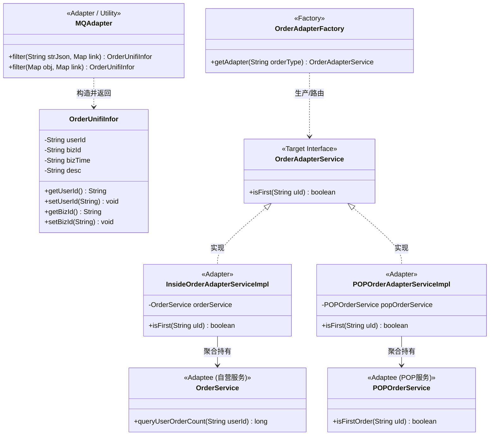
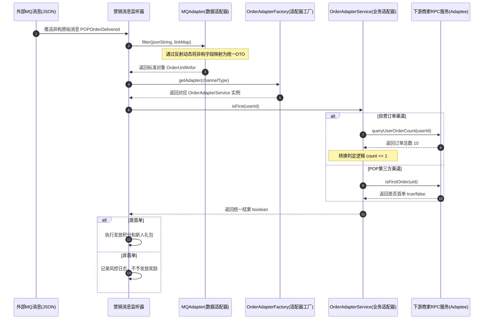

# 适配器模式：多渠道异构消息与接口标准化适配案例深度剖析

本文档针对工程 `b1-AdapterPattern` 中的源码，结合 **`infra`（基础设施层）**、**`common`（传统硬编码编写）** 与 **`adapterpattern`（适配器模式升级重构）** 三个模块，深度解析整个业务的演进历程、适配器模式的双层实战落地、反射核心技术原理，并结合工厂模式整理出全局框架与调用全景图。

---

## 目录
1. [业务背景与系统痛点剖析](#一业务背景与系统痛点剖析)
   - 1.1 核心业务场景：营销返利中台
   - 1.2 阶段一痛点：多源异构 MQ 消息的解析困境（数据适配问题）
   - 1.3 阶段二痛点：风控升级首单判定时的异构接口困境（接口适配问题）
2. [工程模块划分与代码演进脉络](#二工程模块划分与代码演进脉络)
   - 2.1 `infra` 基础设施层（外部原子输入）
   - 2.2 `common` 普通硬编码实现（反面教材：紧耦合与无限膨胀）
   - 2.3 `adapterpattern` 适配器重构实现（双重适配：数据对象适配 + 业务接口适配 + 工厂集成）
3. [适配器模式的落地实现与核心原理解密](#三适配器模式的落地实现与核心原理解密)
   - 3.1 适配器模式（Adapter Pattern）的核心本质
   - 3.2 模式落地 ①：通用 MQ 消息转换适配器（`MQAdapter`）
   - 3.3 模式落地 ②：异构首单业务接口适配器（`OrderAdapterService`）
4. [核心重难点深度剖析：反射动态映射与潜在陷阱](#四核心重难点深度剖析反射动态映射与潜在陷阱)
   - 4.1 `MQAdapter.filter` 反射动态映射逐行源码剖析
   - 4.2 反射构建 Setter 的规范设计与实现细节
   - 4.3 工业级反射调用的性能与类型转换考量（从 Demo 到生产）
5. [结合工厂模式的全局架构与调用关系全景图](#五结合工厂模式的全局架构与调用关系全景图)
   - 5.1 全局架构类关系图（Class Diagram）
   - 5.2 消息消费与风控校验时序图（Sequence Diagram）
   - 5.3 适配器工厂实现：`OrderAdapterFactory` 深度剖析与运行验证
6. [重构效果对比与总结](#六重构效果对比与总结)

---

## 一、业务背景与系统痛点剖析

### 1.1 核心业务场景：营销返利中台
在大型电商与互联网平台中，用户行为会触发各种营销返利与积分奖励（例如：注册开户送新人礼包、自营商城下单返积分、第三方 POP 商家妥投返佣金等）。营销中台需要监听并消费各个上游业务线发出的 MQ 消息，执行营销逻辑。

### 1.2 阶段一痛点：多源异构 MQ 消息的解析困境（数据适配问题）
上游系统由不同历史团队各自独立演进，输出的 MQ 消息协议极不规范、字段命名千奇百怪：
1. **开户系统**（`create_account`）：用户 ID 叫 `number`，业务时间叫 `accountDate`；
2. **自营订单系统**（`OrderMq`）：用户 ID 叫 `uid`，业务时间叫 `createOrderTime`，业务订单号叫 `orderId`；
3. **POP 商家系统**（`POPOrderDelivered`）：用户 ID 叫 `uId`（大写 I），业务时间叫 `orderTime`，业务订单号叫 `orderId`。

如果营销系统采用传统的 `common` 方式：每来一个 MQ 消息源，就新建一个专门的消费监听类，各自反序列化为专属的 POJO。后续如果接入抖音、快手、拼多多等几十个渠道，消费服务将出现严重的**代码冗余与无限膨胀**，中台核心逻辑完全无法复用。

### 1.3 阶段二痛点：风控升级首单判定时的异构接口困境（接口适配问题）
随着平台用户量激增，业务部门升级了营销规则以防羊毛党：**“不再是每单都奖励，仅对用户的首单行为发放奖励”**。

但 MQ 消息本身只代表行为发生，**并不包含“该用户是否为首单”的标记**。此时营销系统必须回源调用各商家提供的风控/订单查询 RPC 接口：
* **自营商城接口**（`OrderService`）：
  ```java
  public long queryUserOrderCount(String userId); // 返回历史订单总数
  ```
  判定规则：`count <= 1` 时视为首单。
* **POP 商家接口**（`POPOrderService`）：
  ```java
  public boolean isFirstOrder(String uId); // 直接返回布尔值
  ```
  判定规则：直接返回是否首单，且入参命名为 `uId`。

**痛点总结**：两套接口的**方法名不同、入参风格不同、返回值类型不同、业务判定逻辑不同**！如果直接硬编码在消费链路中，代码中将充斥大量的 `if-else` 分支判定；未来每增减一种渠道，都要修改核心链路代码，严重违反开闭原则（OCP）。

---

## 二、工程模块划分与代码演进脉络

工程 `b1-AdapterPattern` 清晰地展示了三个演进阶段：

```
b1-AdapterPattern/src/main/java/com/ivan/zhao/IDesign/
├── infra/                          # 【基础设施层】原子材料
│   ├── mq/                         # 原始的异构 MQ 消息体
│   │   ├── create_account.java     # 开户消息: number, address, accountDate, desc
│   │   ├── OrderMq.java            # 自营订单消息: uid, sku, orderId, createOrderTime
│   │   └── POPOrderDelivered.java  # POP订单消息: uId, orderId, orderTime, sku, decimal
│   └── services/                   # 外部现成的异构 RPC 接口
│       ├── OrderService.java       # 自营订单服务: queryUserOrderCount(userId) -> long
│       └── POPOrderService.java    # POP商家服务: isFirstOrder(uId) -> boolean
│
├── common/                         # 【反面教材】常规硬编码实现
│   ├── create_accountMqService.java # 独立绑定 create_account 消息
│   ├── OrderMqService.java         # 独立绑定 OrderMq 消息
│   └── POPOrderDeliveredService.java# 独立绑定 POPOrderDelivered 消息
│
└── adapterpattern/                 # 【重构成果】适配器模式实战
    ├── OrderUnifiInfor.java        # 统一目标消息实体 (Target DTO)
    ├── MQAdapter.java              # 数据适配器：将任意异构 MQ 统一适配为 OrderUnifiInfor
    ├── OrderAdapterService.java    # 业务接口适配规范 (Target Interface: isFirst)
    ├── OrderAdapterFactory.java    # 适配器工厂：统一管理与分发渠道适配器实例
    └── impl/                       # 具体接口适配器实现 (Adapters)
        ├── InsideOrderAdapterServiceImpl.java # 自营适配器 (long -> boolean)
        └── POPOrderAdapterServiceImpl.java    # POP 适配器 (boolean -> boolean)
```

---

## 三、适配器模式的落地实现与核心原理解密

### 3.1 适配器模式（Adapter Pattern）的核心本质
适配器模式的作用是：**将一个类的接口转换成客户希望的另一个接口，使原本由于接口不兼容而不能一起工作的那些类可以协同工作。** 相当于现实生活中的电源转接头、Type-C 转 3.5mm 耳机接口。

在本项目中，适配器模式被精妙地运用在**两个不同维度**：
1. **数据结构维度的适配（对象适配）**：通过 `MQAdapter` 解决多源异构消息字段不一致；
2. **业务能力维度的适配（接口适配）**：通过 `OrderAdapterService` 抹平不同底层 RPC 接口调用协议与逻辑的不一致。

---

### 3.2 模式落地 ①：通用 MQ 消息转换适配器（`MQAdapter`）

#### 设计意图
定义一个统一的标准中台消息载体 `OrderUnifiInfor`（包含业务关心的 4 个标准字段：`userId`、`bizId`、`bizTime`、`desc`）。任何上游系统的 MQ 消息，无论字段叫什么，只要配置一份**映射关系字典（`link`）**，即可被通用适配器转换为标准数据对象。

#### 代码实战结构
```java
// 测试类中的使用示例
HashMap<String, String> link01 = new HashMap<>();
link01.put("userId", "number");        // 目标属性 userId  <- 源 MQ 字段 number
link01.put("bizId", "number");         // 目标属性 bizId   <- 源 MQ 字段 number
link01.put("bizTime", "accountDate");  // 目标属性 bizTime <- 源 MQ 字段 accountDate
link01.put("desc", "desc");            // 目标属性 desc    <- 源 MQ 字段 desc

// 传入原始 JSON 与映射关系，输出标准统一消息
OrderUnifiInfor rebateInfo = MQAdapter.filter(create_account.toString(), link01);
```

#### 适配器角色对应
* **Target（目标抽象）**：`OrderUnifiInfor`（中台统一期望的标准数据结构）
* **Adaptee（源数据）**：`create_account` / `OrderMq` / `POPOrderDelivered` 的 JSON 字符串
* **Adapter（适配器）**：`MQAdapter`（负责建立两者之间的映射桥梁）

---

### 3.3 模式落地 ②：异构首单业务接口适配器（`OrderAdapterService`）

#### 设计意图
定义统一的业务服务接口 `OrderAdapterService`，屏蔽各商家的异构实现差异。业务层只需要面向 `OrderAdapterService` 编程。

#### 核心代码体现
1. **统一目标接口（Target）**：
   ```java
   public interface OrderAdapterService {
       boolean isFirst(String uId);
   }
   ```

2. **自营订单适配器（Adapter 1）**：
   ```java
   public class InsideOrderAdapterServiceImpl implements OrderAdapterService {
       // 持有被适配的源对象（Adaptee）
       private OrderService orderService = new OrderService();
   
       @Override
       public boolean isFirst(String uId) {
           // 将查询数量的 long 结果，适配转换为统一的 boolean 首单语义
           return orderService.queryUserOrderCount(uId) <= 1;
       }
   }
   ```

3. **POP 订单适配器（Adapter 2）**：
   ```java
   public class POPOrderAdapterServiceImpl implements OrderAdapterService {
       // 持有被适配的源对象（Adaptee）
       private POPOrderService popOrderService = new POPOrderService();
   
       @Override
       public boolean isFirst(String uId) {
           // 直接委托给原接口，统一了方法入口
           return popOrderService.isFirstOrder(uId);
       }
   }
   ```

---

## 四、核心重难点深度剖析：反射动态映射与潜在陷阱

`MQAdapter.java` 中利用 Java 反射机制实现了全动态的字段赋值，是整个案例中最具技术含量的核心难点。

### 4.1 `MQAdapter.filter` 反射动态映射逐行源码剖析

```java
public static OrderUnifiInfor filter(Map obj, Map<String, String> link) throws Exception {
    // 1. 创建统一的目标承载对象
    OrderUnifiInfor orderUnifiInfor = new OrderUnifiInfor();

    // 2. 遍历配置的字段映射规则字典
    for (String key : link.keySet()) {
        // 3. 从原始数据 Map 中取出对应字段的值
        // key: 目标对象字段名 (如 "userId")
        // link.get(key): 源 MQ 字段名 (如 "number")
        Object val = obj.get(link.get(key));

        // 4. 字符串拼接，根据 JavaBean 规范推导 Setter 方法名
        // "userId" -> "u" -> "U" + "serId" -> "setUserId"
        String methodName = "set"
                + key.substring(0, 1).toUpperCase()
                + key.substring(1);

        // 5. 反射查找目标类中具有对应名称与参数类型的 public 方法
        Method method = OrderUnifiInfor.class.getMethod(
                methodName,
                String.class
        );

        // 6. 反射调用：在 orderUnifiInfor 实例上执行该 Setter，传入属性值
        method.invoke(orderUnifiInfor, val.toString());
    }

    return orderUnifiInfor;
}
```

### 4.2 反射构建 Setter 的规范设计与实现细节
* **首字母大写转换**：
  JavaBean 规范规定属性 `xxx` 对应的 setter 为 `setXxx`。代码通过 `key.substring(0, 1).toUpperCase() + key.substring(1)` 实现大小写转换，保证通用性。
* **参数类型精确匹配**：
  `OrderUnifiInfor.class.getMethod(methodName, String.class)` 中，第二个参数显式传入 `String.class`。因为 `OrderUnifiInfor` 中的字段目前全声明为 `String`，反射会依据方法名与形参类型精确定位到对应重载方法。
* **动态调用 `invoke`**：
  `method.invoke(orderUnifiInfor, val.toString())`：突破了传统的硬编码 `.setUserId(...)`，无论新增多少字段、映射规则如何变化，这套解析引擎均无需改动一行代码。

### 4.3 工业级反射调用的性能与类型转换考量（从 Demo 到生产）

代码虽然优雅，但在高并发生产落地时需注意以下几个进阶问题：
1. **反射查找性能与元数据缓存**：
   `getMethod(...)` 在高吞吐量下会有性能开销。在工业级框架中（如 Spring 的 `BeanWrapper` 或 MapStruct），通常会**通过本地静态 `ConcurrentHashMap<String, Method>` 缓存反射出来的 Method 对象**，避免每次消息反序列化都重复遍历类方法。
2. **类型转换容错机制（Type Conversion）**：
   当前代码直接 `val.toString()`，如果上游传的是 `Date` 对象或嵌套复杂的数组/对象，或者如果 `OrderUnifiInfor` 包含 `Date/BigDecimal` 属性，直接匹配 `String.class` 会抛出 `NoSuchMethodException` 或类型不匹配。在生产中可引入通用类型转换器（如 Spring `ConversionService` 或 Fastjson 的 `TypeUtils.cast()`）。
3. **空指针（NPE）防护**：
   如果上游消息中某个可选字段缺失（`val == null`），`val.toString()` 将直接触发 `NullPointerException`，应加入 `val != null ? val.toString() : null` 防御性校验。

---

## 五、结合工厂模式的全局架构与调用关系全景图

在真实业务场景下，适配器模式往往不会孤立存在，而是与**工厂模式**（或者策略模式）组合使用，从而形成从“配置路由 $\to$ 适配实例化 $\to$ 统一业务执行”的工业级架构。

### 5.1 全局架构类关系图（Class Diagram）



---

### 5.2 消息消费与风控校验时序图（Sequence Diagram）

以下时序图展示了消息从外部 MQ 到达中台后，如何协同使用 `MQAdapter` 与 `OrderAdapterService` 完成全流程闭环：



---

### 5.3 适配器工厂实现：`OrderAdapterFactory` 深度剖析与运行验证

在实际业务架构中，为了消除业务调用方手动 `new InsideOrderAdapterServiceImpl()` 或 `new POPOrderAdapterServiceImpl()` 的硬编码耦合，我们在工程的 `adapterpattern` 包下建立了核心组件：[`OrderAdapterFactory.java`](file:///C:/Users/free/Desktop/codeDesign/%E4%BB%A3%E7%A0%81/IDesign/b1-AdapterPattern/src/main/java/com/ivan/zhao/IDesign/adapterpattern/OrderAdapterFactory.java)。

#### 1. 源码实现剖析
```java
package com.ivan.zhao.IDesign.adapterpattern;

import com.ivan.zhao.IDesign.adapterpattern.impl.InsideOrderAdapterServiceImpl;
import com.ivan.zhao.IDesign.adapterpattern.impl.POPOrderAdapterServiceImpl;

import java.util.Map;
import java.util.concurrent.ConcurrentHashMap;

/**
 * 订单适配器工厂：结合工厂模式统一管理和分发异构订单渠道适配器
 *
 * @author 赵一帆(Ivan Zhao)
 * @version 1.0
 */
public class OrderAdapterFactory {

    /**
     * 适配器注册表（使用线程安全的 ConcurrentHashMap）
     */
    private static final Map<String, OrderAdapterService> adapterMap = new ConcurrentHashMap<>();

    static {
        // 预注册系统默认支持的订单渠道适配器
        adapterMap.put("INSIDE", new InsideOrderAdapterServiceImpl());
        adapterMap.put("POP", new POPOrderAdapterServiceImpl());
    }

    /**
     * 根据订单渠道类型获取对应的适配器实例
     *
     * @param orderType 渠道类型标识（如 "INSIDE", "POP"）
     * @return 对应的 OrderAdapterService 适配器实现
     */
    public static OrderAdapterService getAdapter(String orderType) {
        if (orderType == null || orderType.trim().isEmpty()) {
            throw new IllegalArgumentException("订单渠道类型不能为空！");
        }
        OrderAdapterService adapterService = adapterMap.get(orderType.toUpperCase());
        if (adapterService == null) {
            throw new IllegalArgumentException("未找到匹配的订单适配器类型: " + orderType);
        }
        return adapterService;
    }

    /**
     * 动态注册新的适配器（对外提供可扩展能力，严格符合开闭原则）
     *
     * @param orderType 渠道类型标识
     * @param adapterService 适配器实现类
     */
    public static void register(String orderType, OrderAdapterService adapterService) {
        if (orderType == null || adapterService == null) {
            throw new IllegalArgumentException("注册参数不能为空！");
        }
        adapterMap.put(orderType.toUpperCase(), adapterService);
    }

    public static void main(String[] args) {
        OrderAdapterService insideAdapter = OrderAdapterFactory.getAdapter("INSIDE");
        System.out.println("自营订单适配器首单校验测试(用户100001): " + insideAdapter.isFirst("100001"));

        OrderAdapterService popAdapter = OrderAdapterFactory.getAdapter("POP");
        System.out.println("POP订单适配器首单校验测试(用户100001): " + popAdapter.isFirst("100001"));
    }
}
```

#### 2. 工厂核心设计要点
1. **静态容器与单例复用（线程安全）**：
   采用 `ConcurrentHashMap<String, OrderAdapterService>` 充当适配器注册表，预先初始化 `INSIDE` 与 `POP` 适配器单例，避免频繁创建销毁对象，保障高并发下的无锁读与安全发布。
2. **严格的入参容错防御**：
   在 `getAdapter()` 中增加了判空及转大写处理（`orderType.toUpperCase()`），屏蔽调用方因大小写疏漏导致的匹配异常；若传入未支持的未知渠道，立即抛出明确的业务异常。
3. **支持动态扩展（OCP 开闭原则）**：
   提供了公开的 `register(String, OrderAdapterService)` 扩展点。当平台未来接入“抖音”、“快手”或“微信小程序”订单时，无需修改已有工厂源码，只需编写对应的新适配器并调用 `register` 注入即可。

#### 3. 运行自测输出验证
直接运行 `OrderAdapterFactory.main`，控制台打印如下：
```text
自营商家，查询用户的订单是否为首单：100001
自营订单适配器首单校验测试(用户100001): false
POP商家，查询用户的订单是否为首单：100001
POP订单适配器首单校验测试(用户100001): true
```
* 自营接口：`OrderService` 查得订单数为 `10L`，适配器按 `count <= 1` 判定为 `false`（非首单）；
* POP 接口：`POPOrderService` 查得首单标记为 `true`，适配器直接返回 `true`（是首单）；
* **业务调用层代码彻底标准化**：
  ```java
  // 步骤 1：通过 MQAdapter 统一异构消息体
  OrderUnifiInfor unifi = MQAdapter.filter(mqJson, linkMap);
  
  // 步骤 2：通过 OrderAdapterFactory 获取当前渠道适配器
  OrderAdapterService adapter = OrderAdapterFactory.getAdapter("POP");
  
  // 步骤 3：无 if-else 执行首单判定
  boolean isFirst = adapter.isFirst(unifi.getUserId());
  ```

---

## 六、重构效果对比与总结

| 对比维度 | `common` 常规硬编码方案 | `adapterpattern` 适配器重构方案 |
| :--- | :--- | :--- |
| **接入新渠道成本** | 必须新建专有 Service、新建 POJO，重写整套消费逻辑 | 仅需在配置中增加一份 `link` 映射字典，即可复用解析逻辑 |
| **异构接口兼容性** | 业务代码中出现大量的 `if-else` 判断不同系统的方法与逻辑 | 通过统一接口 `OrderAdapterService` 将异构差异隔离在适配器内部 |
| **耦合度** | 营销中台强依赖各上游系统的底层类结构与 RPC 签名 | 营销中台只依赖统一的 DTO 与目标接口，实现彻底解耦 |
| **开闭原则（OCP）** | 差。每新增一个业务方，原有核心代码都需要被修改测试 | 极佳。新增业务只需增加一个实现类并注册到工厂，核心链路零修改 |
| **代码复用率** | 极低（大量重复的解析与转换逻辑） | 极高（`MQAdapter` 通用引擎 + 统一业务接口） |

通过本次案例的重构，不仅直观展现了**适配器模式在“数据结构转换”与“业务行为抹平”上的双重威力**，而且揭示了其与**反射动态机制、工厂设计模式**的完美结合方式，为大型分布式架构中处理“异构多源兼容”问题提供了标准的工业级设计典范。
