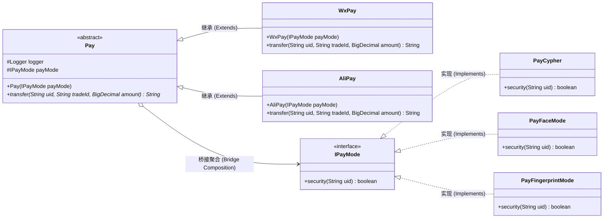
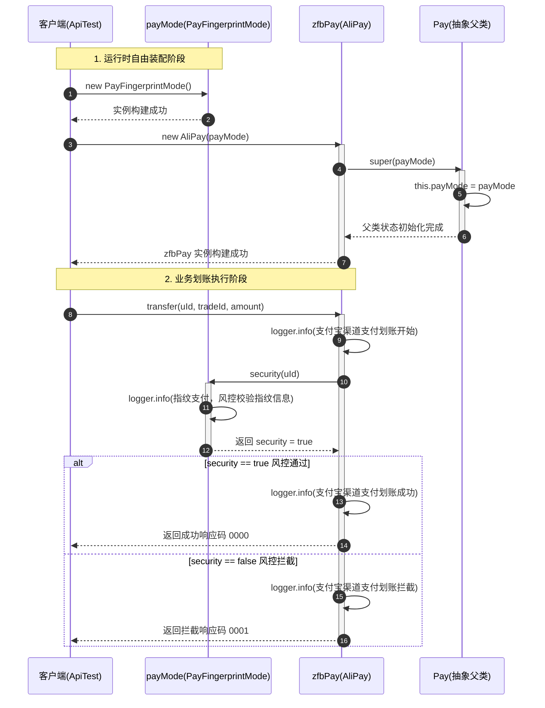

# 桥接模式：多支付渠道与多风控验证模式解耦案例深度剖析

本文档针对工程 `b2-BridgePattern` 中的源码，结合 **`common`（传统硬编码编写）** 与 **`bridgepattern`（桥接模式重构）** 两个模块，深度解析整个支付风控业务的演进历程、桥接模式的解耦落地、Java 面向对象核心技术（`super` 构造传递、抽象类与抽象方法、protected 访问控制），并整理出全局框架与调用关系全景图。

---

## 目录
1. [业务背景与系统痛点剖析](#一业务背景与系统痛点剖析)
   - 1.1 核心业务场景：支付渠道与支付模式的交叉组合
   - 1.2 传统硬编码（`common`）的致命缺陷：笛卡尔积分支与类爆炸
2. [工程模块划分与代码架构脉络](#二工程模块划分与代码架构脉络)
   - 2.1 `common` 包：多重 `if-else` 的紧耦合反面教材
   - 2.2 `bridgepattern` 包：双维度独立演进的优雅设计
3. [桥接模式的核心本质与业务落地](#三桥接模式的核心本质与业务落地)
   - 3.1 什么是桥接模式（Bridge Pattern）？
   - 3.2 角色映射：Abstraction 与 Implementor 的精准拆分
   - 3.3 组合优于继承（从 $M \times N$ 到 $M + N$）
4. [核心重难点与 Java 底层机制深度剖析](#四核心重难点与-java-底层机制深度剖析)
   - 4.1 `super(payMode)` 构造链调用过程与内存赋值追踪
   - 4.2 抽象类 `Pay` vs 接口：为什么必须设计为抽象类？
   - 4.3 抽象方法 `transfer(...)` 的多态设计哲学
   - 4.4 访问修饰符 `protected` 在桥接骨架中的关键作用
5. [全局架构类图与调用关系全景图](#五全局架构类图与调用关系全景图)
   - 5.1 桥接模式核心类图（Class Diagram）
   - 5.2 支付划账业务执行时序图（Sequence Diagram）
6. [重构前后终极效果对比与总结](#六重构前后终极效果对比与总结)

---

## 一、业务背景与系统痛点剖析

### 1.1 核心业务场景：支付渠道与支付模式的交叉组合
在金融支付与电商结算业务中，用户的支付行为通常由两个独立的业务维度共同决定：
1. **维度一：支付渠道（Pay Channel）**
   * 如微信支付（`WxPay`）、支付宝支付（`AliPay`）、银联支付（`UnionPay`）等；
2. **维度二：支付验证模式（Pay Mode）**
   * 如传统的密码验证（`PayCypher`）、人脸识别验证（`PayFaceMode`）、指纹生物识别验证（`PayFingerprintMode`）等。

在用户下单划账时，系统既要根据渠道调用对应的第三方支付网关，又要根据用户选择的模式执行相应的风控安全拦截（如人脸活体检测、指纹硬件校验、密码安全等级环境检测）。

---

### 1.2 传统硬编码（`common`）的致命缺陷：笛卡尔积分支与类爆炸

#### 1. 源码反面教材：[`PayController.java`](file:///C:/Users/free/Desktop/codeDesign/%E4%BB%A3%E7%A0%81/IDesign/b2-BridgePattern/src/main/java/com/ivanzhao/IDesign/common/PayController.java)
在 `common` 模块中，开发者直接采用多层嵌套的 `if-else` 堆砌业务逻辑：

```java
public class PayController {
    public boolean doPay(String uId, String tradeId, BigDecimal amount, int channelType, int modeType) {
        // 1. 微信支付渠道分支
        if (1 == channelType) {
            logger.info("模拟微信渠道支付划账开始...");
            if (1 == modeType) {
                logger.info("密码支付，风控校验环境安全");
            } else if (2 == modeType) {
                logger.info("人脸支付，风控校验脸部识别");
            } else if (3 == modeType) {
                logger.info("指纹支付，风控校验指纹信息");
            }
        }
        // 2. 支付宝支付渠道分支
        else if (2 == channelType) {
            logger.info("模拟支付宝渠道支付划账开始...");
            if (1 == modeType) {
                logger.info("密码支付，风控校验环境安全");
            } else if (2 == modeType) {
                logger.info("人脸支付，风控校验脸部识别");
            } else if (3 == modeType) {
                logger.info("指纹支付，风控校验指纹信息");
            }
        }
        return true;
    }
}
```

#### 2. 传统写法暴显的三大弊端
* **代码严重重复与笛卡尔积分支爆炸**：
  若系统有 $M$ 个渠道、$N$ 种验证模式，分支数量就是 $M \times N$。每种验证模式的风控逻辑被硬编码在每一个渠道的 `if` 块中，出现了大量一模一样的复制粘贴代码。
* **灾难性的可维护性（违反单一职责原则 SRP）**：
  `PayController` 既负责管理支付渠道流程，又负责协调具体的风控验证逻辑。一个类的变动原因有多种（渠道规则改动、风控校验改动），极易引起牵一发而动全身的 Regression Bug。
* **难以扩展（严重违反开闭原则 OCP）**：
  * **新增渠道**（如接入“银联支付”）：必须在外层增加一个 `else if (3 == channelType)`，并把所有密码、人脸、指纹的代码再复制一遍；
  * **新增模式**（如接入“声纹识别”）：必须打开所有已有渠道的 `if` 内部，挨个增加 `else if (4 == modeType)`。代码越改越乱，后期维护成本呈指数级上升。

---

## 二、工程模块划分与代码架构脉络

在 `b2-BridgePattern` 工程中，代码结构清晰地展现了重构的边界与划分：

```
b2-BridgePattern/src/
├── main/java/com/ivanzhao/IDesign/
│   ├── common/                          # 【传统反面教材】
│   │   └── PayController.java           # 嵌套 if-else 硬编码处理渠道与模式
│   │
│   └── bridgepattern/                   # 【桥接模式标准重构】
│       ├── channel/                     # 【抽象化维度：支付渠道】
│       │   ├── Pay.java                 # 抽象类：定义渠道骨架，持有 IPayMode 引用（桥梁）
│       │   ├── WxPay.java               # 扩充抽象类：微信支付渠道实现
│       │   └── AliPay.java              # 扩充抽象类：支付宝支付渠道实现
│       │
│       └── mode/                        # 【实现化维度：风控验证模式】
│           ├── IPayMode.java            # 接口：定义风控验证标准方法 security()
│           └── impl/                    # 具体实现化角色
│               ├── PayCypher.java       # 密码验证方式
│               ├── PayFaceMode.java     # 人脸验证方式
│               └── PayFingerprintMode.java # 指纹验证方式
│
└── test/java/test/
    ├── common/
    │   └── ApiTest.java                 # common 硬编码调用测试
    └── BridgePattern/
        └── ApiTest.java                 # 桥接模式多维度自由组合测试
```

---

## 三、桥接模式的核心本质与业务落地

### 3.1 什么是桥接模式（Bridge Pattern）？
GoF 对桥接模式的权威定义是：
> **“将抽象部分与它的实现部分分离，使它们都可以独立地变化。”（Decouple an abstraction from its implementation so that the two can vary independently.）**

桥接模式的核心思维是**优先使用对象组合（Composition/Aggregation）而不是类继承（Inheritance）**。当一个类存在两个（或多个）独立变化的维度时，不要采用多层继承体系，而是把这两个维度分别抽象出来，在其中一个维度中持有另一个维度的引用，这根引用就是连接两个维度的**“桥（Bridge）”**。

---

### 3.2 角色映射：Abstraction 与 Implementor 的精准拆分

在本项目中，桥接模式的标准角色与代码类的映射关系如下：

| 桥接模式标准角色 | 对应工程类/接口 | 业务职责 |
| :--- | :--- | :--- |
| **Abstraction（抽象化角色）** | [`Pay.java`](file:///C:/Users/free/Desktop/codeDesign/%E4%BB%A3%E7%A0%81/IDesign/b2-BridgePattern/src/main/java/com/ivanzhao/IDesign/bridgepattern/channel/Pay.java) | 定义支付渠道的抽象骨架，持有一根通往风控模式的桥梁引用（`IPayMode payMode`）。 |
| **RefinedAbstraction（扩充抽象化角色）** | [`WxPay.java`](file:///C:/Users/free/Desktop/codeDesign/%E4%BB%A3%E7%A0%81/IDesign/b2-BridgePattern/src/main/java/com/ivanzhao/IDesign/bridgepattern/channel/WxPay.java)<br>[`AliPay.java`](file:///C:/Users/free/Desktop/codeDesign/%E4%BB%A3%E7%A0%81/IDesign/b2-BridgePattern/src/main/java/com/ivanzhao/IDesign/bridgepattern/channel/AliPay.java) | 具体的支付渠道，实现渠道专属的转账与日志行为，并在转账前通过桥梁调用风控安全校验。 |
| **Implementor（实现化角色）** | [`IPayMode.java`](file:///C:/Users/free/Desktop/codeDesign/%E4%BB%A3%E7%A0%81/IDesign/b2-BridgePattern/src/main/java/com/ivanzhao/IDesign/bridgepattern/mode/IPayMode.java) | 定义风控验证的接口规范，暴露基础行为 `security(String uid)`。 |
| **ConcreteImplementor（具体实现化角色）** | [`PayCypher.java`](file:///C:/Users/free/Desktop/codeDesign/%E4%BB%A3%E7%A0%81/IDesign/b2-BridgePattern/src/main/java/com/ivanzhao/IDesign/bridgepattern/mode/impl/PayCypher.java)<br>[`PayFaceMode.java`](file:///C:/Users/free/Desktop/codeDesign/%E4%BB%A3%E7%A0%81/IDesign/b2-BridgePattern/src/main/java/com/ivanzhao/IDesign/bridgepattern/mode/impl/PayFaceMode.java)<br>[`PayFingerprintMode.java`](file:///C:/Users/free/Desktop/codeDesign/%E4%BB%A3%E7%A0%81/IDesign/b2-BridgePattern/src/main/java/com/ivanzhao/IDesign/bridgepattern/mode/impl/PayFingerprintMode.java) | 具体的风控验证逻辑实现，完成密码、人脸活体或指纹硬件的识别判断。 |

---

### 3.3 组合优于继承（从 $M \times N$ 到 $M + N$）

#### 继承体系下的灾难
如果使用传统多层继承来表达所有可能组合，类层次结构将迅速演化为：
```
Pay
├── WxPayCypher
├── WxPayFace
├── WxPayFingerprint
├── AliPayCypher
├── AliPayFace
└── AliPayFingerprint
```
总共需要写 **$2 \times 3 = 6$ 个具体子类**！一旦未来增加一个渠道（3个渠道）和一种模式（4种模式），子类数量暴增至 **$3 \times 4 = 12$ 个**。

#### 桥接组合体系下的优雅解耦
采用桥接模式后：
* 渠道维度只需 $M$ 个类；
* 模式维度只需 $N$ 个类；
* **总类数仅为 $M + N$ 个**！

测试端自由装配示例（[`test/BridgePattern/ApiTest.java`](file:///C:/Users/free/Desktop/codeDesign/%E4%BB%A3%E7%A0%81/IDesign/b2-BridgePattern/src/test/java/test/BridgePattern/ApiTest.java)）：
```java
// 场景 1：微信支付 + 人脸模式
Pay wxPay = new WxPay(new PayFaceMode());
wxPay.transfer("weixin_1092033111", "100000109893", new BigDecimal(100));

// 场景 2：支付宝支付 + 指纹模式
Pay zfbPay = new AliPay(new PayFingerprintMode());
zfbPay.transfer("jlu19dlxo111", "100000109894", new BigDecimal(100));

// 未来想搞“支付宝 + 密码支付”？完全无需写新类，直接运行时组装：
// Pay zfbCypherPay = new AliPay(new PayCypher());
```

---

## 四、核心重难点与 Java 底层机制深度剖析

在 `bridgepattern` 代码中，充分运用了 Java 语言的面向对象特性与继承多态机制。以下针对重点语法与设计决策进行逐一深度拆解：

### 4.1 `super(payMode)` 构造链调用过程与内存赋值追踪

在子类 [`AliPay.java`](file:///C:/Users/free/Desktop/codeDesign/%E4%BB%A3%E7%A0%81/IDesign/b2-BridgePattern/src/main/java/com/ivanzhao/IDesign/bridgepattern/channel/AliPay.java) 中，有如下核心构造代码与执行流程注释：

```java
public class AliPay extends Pay {

    // new AliPay(xxx)
    //      ↓
    // 进入 AliPay 构造方法: public AliPay(IPayMode payMode)
    //      ↓
    // super(payMode)
    //      ↓
    // 调用父类构造 Pay(IPayMode payMode)
    //      ↓
    // this.payMode = payMode
    //      ↓
    // Pay 中的 payMode 成员被赋值
    //      ↓
    // AliPay 对象实例化创建完成

    public AliPay(IPayMode payMode) {
        super(payMode);
    }
    ...
}
```

#### 深度解析
1. **强制依赖注入**：
   父类 `Pay` 没有提供无参构造函数，只有带参构造 `public Pay(IPayMode payMode)`。在 Java 语法中，如果父类没有无参构造，**子类的构造方法第一行必须显式使用 `super(...)` 调用父类的带参构造**，否则编译器将直接报错。这在架构层面上实现了一种**强约束机制**——杜绝了客户端创建出未配置任何风控模式的“空壳”支付对象！
2. **堆内存模型状态**：
   在 JVM 堆内存中，`new AliPay(...)` 分配了一块对象内存，这块内存不仅包含 `AliPay` 本身的方法表引用，也完整包含了父类 `Pay` 中声明的实例字段（`logger` 和 `payMode`）。通过 `super(payMode)`，参数引用被安全赋值给堆中属于父类作用域的 `payMode` 引用。

---

### 4.2 抽象类 `Pay` vs 接口：为什么必须设计为抽象类？

在很多初学者的疑问中：“既然 `Pay` 规定了支付的规范，为什么不直接定义为 `public interface Pay`，而是写成 `public abstract class Pay`？”

这是由于桥接模式的本质所决定的：
1. **状态与属性的持有**：
   `Pay` 是桥接模式中的“桥梁拥有者”，它必须持有一个通往实现化维度的引用（`protected IPayMode payMode;`）。在 Java 中，**接口（Interface）只能包含静态常量（`public static final`），不能拥有实例属性（Instance Field）**。如果改成接口，每个渠道实现类（`WxPay`, `AliPay`）都得重复声明一遍 `private IPayMode payMode` 并各自写一遍赋值代码，丧失了代码复用性。
2. **构造方法的强制约定**：
   接口无法拥有构造方法，不能在实例化时强制子类传入 `payMode`；而抽象类能通过构造函数实施严格的依赖注入约定。
3. **公共组件的向下共享**：
   抽象类中统一初始化了 `protected Logger logger = LoggerFactory.getLogger(Pay.class);`，子类继承后即可直接使用，无需每个类各自初始化日志对象。

---

### 4.3 抽象方法 `transfer(...)` 的多态设计哲学

在 [`Pay.java`](file:///C:/Users/free/Desktop/codeDesign/%E4%BB%A3%E7%A0%81/IDesign/b2-BridgePattern/src/main/java/com/ivanzhao/IDesign/bridgepattern/channel/Pay.java) 中声明了抽象方法：
```java
public abstract String transfer(String uid, String tradeId, BigDecimal amount);
```

#### 设计意图
* **模板与职责分离**：
  `Pay` 作为抽象基类，并不关心具体底层网关是微信还是支付宝。它把具体的调用流程（打印渠道专属日志、组织渠道报文、解析网关返回码）延期到子类 `WxPay` 和 `AliPay` 中去各自多态实现；
* **统一的外部调用协议**：
  面向调用端（Client），所有支付渠道对外暴露的标准 API 都是 `transfer(...)`。外部调用方只需统一持有 `Pay` 类型的引用，即可调用任意渠道的转账能力（面向抽象编程，满足里氏替换原则 LSP）。

---

### 4.4 访问修饰符 `protected` 在桥接骨架中的关键作用

在 `Pay.java` 中，成员变量均使用了 `protected` 修饰符：
```java
public abstract class Pay {
    protected Logger logger = LoggerFactory.getLogger(Pay.class);
    protected IPayMode payMode;
    ...
}
```

#### 为什么不用 `private` 或 `public`？
* **如果声明为 `private`**：
  子类 `AliPay` 在执行 `transfer()` 时，无法直接访问 `payMode.security(uId)`，必须在父类增加 `public IPayMode getPayMode()`。这不仅增加了冗余方法调用，而且增加了外界破坏内部引用的风险；
* **如果声明为 `public`**：
  破坏了类的封装性，包外部的任何类都可以随时修改 `pay.payMode`，导致状态被意外污染；
* **声明为 `protected` 的精妙之处**：
  对外部包完全隐藏实现细节，但**对同一个包以及所有继承于它的子类（无论是同一个包还是跨包的 `AliPay` / `WxPay`）完全开放直接访问权**，是设计框架抽象父类时最为经典而优雅的标准实践。

---

## 五、全局架构类图与调用关系全景图

### 5.1 桥接模式核心类图（Class Diagram）

以下 Mermaid 类图完整勾勒了系统中的角色划分、继承体系与桥接关联：



> **类图解读**：  
> `Pay` 类内部持有了 `IPayMode` 接口的引用（`Pay o--> IPayMode`），正是这根聚合关系构成了“桥”，将左侧的**渠道继承树**与右侧的**风控实现树**松耦合地连接在一起。

---

### 5.2 支付划账业务执行时序图（Sequence Diagram）

以下时序图展示了客户端执行 `Pay zfbPay = new AliPay(new PayFingerprintMode()); zfbPay.transfer(...);` 时的完整运行时生命周期：



---

## 六、重构前后终极效果对比与总结

| 对比维度 | `common` 硬编码方案 | `bridgepattern` 桥接模式重构方案 |
| :--- | :--- | :--- |
| **类的总数** | 只有 1 个大类（`PayController`），但方法内逻辑无限膨胀 | 共有 $M + N$ 个轻量类（当前案例为 2渠道 + 3模式 = 5个类） |
| **新增渠道（如银联）** | 修改已有类，复制增加一个庞大的 `else if` 分支及所有模式逻辑 | 仅需新建一个 `UnionPay extends Pay`，实现 `transfer`，零修改旧代码 |
| **新增模式（如声纹）** | 修改已有类，在每个渠道的 `if` 代码块内部逐一增加分支 | 仅需新建一个 `PayVoiceMode implements IPayMode`，零修改旧代码 |
| **代码复用性** | 极差，同一种风控日志与验证逻辑在不同渠道中反复 CV | 极佳，风控逻辑完全内聚在 `IPayMode` 实现类中，各渠道均可复用 |
| **耦合程度** | 强耦合。渠道逻辑与风控逻辑死死绑定在同一个类的方法中 | **强解耦**。渠道与模式各自独立演进，双方仅通过抽象“桥”相互协作 |
| **设计原则遵循** | 严重违背单一职责原则（SRP）与开闭原则（OCP） | **完美遵循单一职责原则、开闭原则以及里氏替换原则（LSP）** |

### 架构设计总结
桥接模式是面对**“多维度交叉变化”**时的杀手锏设计模式。通过将“继承关系”重构为“抽象关联桥梁”，成功避免了类爆炸和硬编码分支蔓延。在大型企业级架构中，类似**“消息发送渠道（邮件/短信/站内信）与消息紧急等级（普通/加急/特急）”**、**“数据导出格式（Excel/PDF/Word）与数据存储源（MySQL/ES/Redis）”**等场景，均是桥接模式落地的绝佳实战范例。
