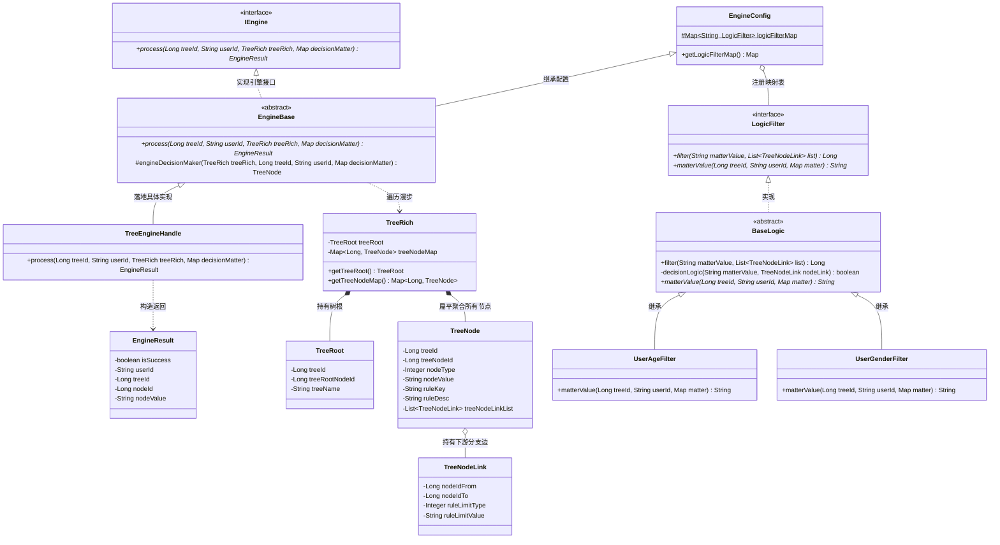
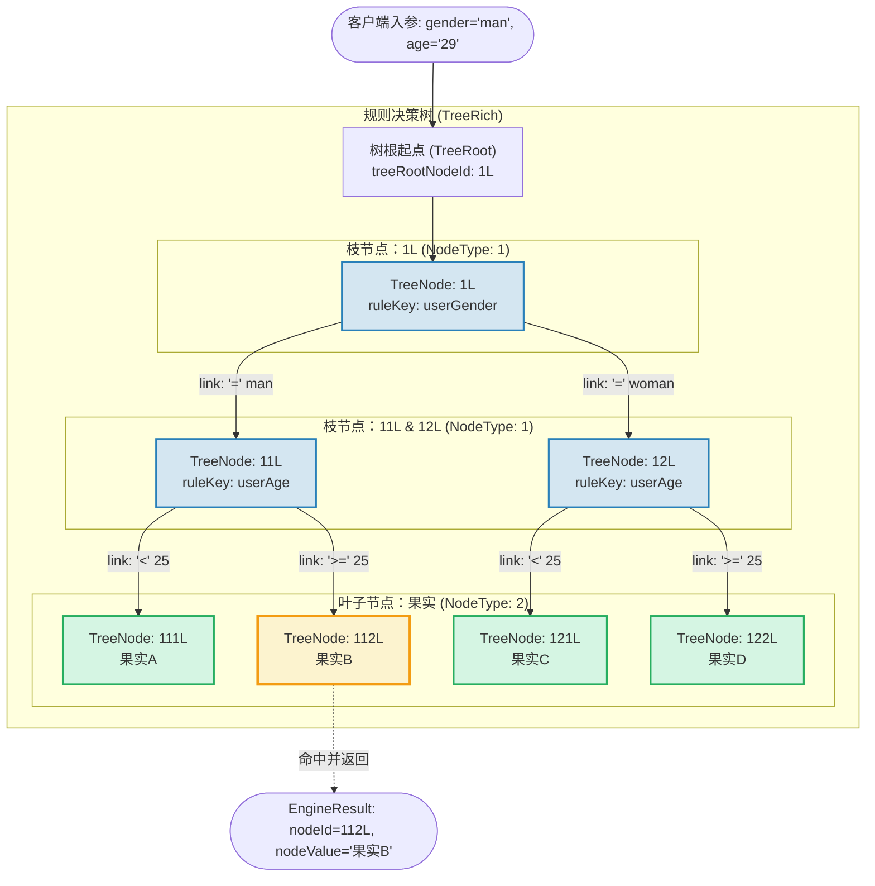
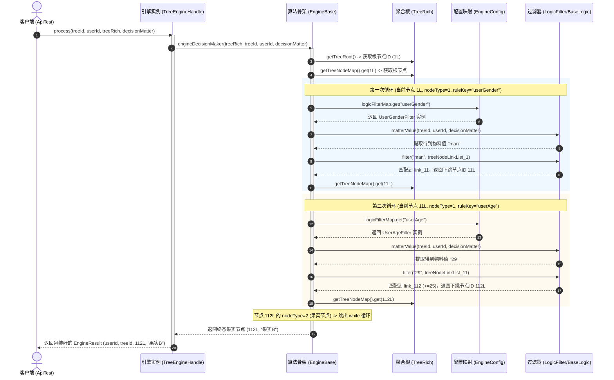

# 组合模式：规则决策树引擎案例深度剖析与架构设计

本文档针对工程 `b3-CompositePattern` 中的源码，结合 **`common`（传统嵌套分支编写）** 与 **`compositepattern`（组合模式规则树重构）** 两个模块，深度解析用户分群与营销发奖规则决策引擎的架构演进，全方位阐述组合模式是如何将发散的 `if-else` 改造为可动态编排的树形结构，并结合源码详细剖析各个类的职责、协作关系与调用流转。

---

## 目录
1. [业务背景与系统痛点剖析](#一业务背景与系统痛点剖析)
   - 1.1 核心业务场景：多维特征的用户分群与营销发奖
   - 1.2 传统硬编码（`common`）的致命缺陷：嵌套地狱与无法动态配置
2. [工程架构脉络与核心类角色深度剖析](#二工程架构脉络与核心类角色深度剖析)
   - 2.1 整体工程包结构划分
   - 2.2 核心领域模型（`model` 包）
   - 2.3 逻辑决策过滤器（`service.logic` 包）
   - 2.4 决策执行引擎（`service.engine` 包）
3. [组合模式在业务中的精妙落地与运行原理](#三组合模式在业务中的精妙落地与运行原理)
   - 3.1 什么是组合模式（Composite Pattern）？
   - 3.2 组合模式在规则树中的具象化映射（枝节点 vs 叶子节点）
   - 3.3 决策树的构建与扁平化索引设计（`Map<Long, TreeNode>`）
   - 3.4 树漫步决策机制：状态转移与果实命中全流程
4. [全局架构与调用关系全景图](#四全局架构与调用关系全景图)
   - 4.1 组合模式类层级结构图（Class Diagram）
   - 4.2 规则树数据拓扑图（Decision Tree Topology）
   - 4.3 决策执行时序图（Sequence Diagram）
5. [组合模式与其他设计模式的协同运用](#五组合模式与其他设计模式的协同运用)
   - 5.1 组合模式 + 模板方法模式（Template Method）
   - 5.2 组合模式 + 策略模式（Strategy）
6. [重构前后对比与工程化总结](#六重构前后对比与工程化总结)

---

## 一、业务背景与系统痛点剖析

### 1.1 核心业务场景：多维特征的用户分群与营销发奖
在互联网电商、金融风控与营销中台场景中，平台常常需要根据用户的多维度画像标签（如性别、年龄、地域、消费习惯等），实时判定用户命中的营销策略或风控规则，最终下发匹配的权益（如优惠券、实物礼品、活动文案等，在业务模型中通常统称为“**果实（Fruit）**”）。

本案例的具体规则示例：
* **男性（`man`）** 且 **年龄 < 25** $\rightarrow$ 命中 **果实 A**
* **男性（`man`）** 且 **年龄 $\ge$ 25** $\rightarrow$ 命中 **果实 B**
* **女性（`woman`）** 且 **年龄 < 25** $\rightarrow$ 命中 **果实 C**
* **女性（`woman`）** 且 **年龄 $\ge$ 25** $\rightarrow$ 命中 **果实 D**

---

### 1.2 传统硬编码（`common`）的致命缺陷：嵌套地狱与无法动态配置

#### 1. 源码反面教材：[`EngineController.java`](file:///C:/Users/free/Desktop/codeDesign/代码/IDesign/b3-CompositePattern/src/main/java/com/ivanzhao/IDesign/common/EngineController.java)
```java
public class EngineController {
    private Logger logger = LoggerFactory.getLogger(EngineController.class);

    public String process(final String userId, final String userSex, final int userAge) {
        logger.info("ifelse实现方式判断用户结果。userId：{} userSex：{} userAge：{}", userId, userSex, userAge);

        if ("man".equals(userSex)) {
            if (userAge < 25) {
                return "果实A";
            }
            if (userAge >= 25) {
                return "果实B";
            }
        }

        if ("woman".equals(userSex)) {
            if (userAge < 25) {
                return "果实C";
            }
            if (userAge >= 25) {
                return "果实D";
            }
        }
        return null;
    }
}
```

#### 2. 传统写法暴显的核心缺陷
1. **硬编码强耦合（紧耦合）**：
   规则逻辑被死死绑定在 Java 代码中。每次产品经理或运营人员调整规则（例如把分水岭年龄从 25 岁调整到 30 岁，或者增加“果实 E”），研发人员都必须改动代码、重新编译打包发版，效率低下且容易引入 Regression Bug。
2. **规则无法动态热插拔与可视化配置**：
   现代中台要求规则能够持久化在数据库中，由前端低代码拖拽式生成。硬编码的嵌套 `if-else` 根本无法接收外部配置驱动。
3. **扩展性极差（违反开闭原则 OCP 与单一职责原则 SRP）**：
   随着决策维度的增加（如加入城市、会员等级、消费频次等），嵌套的 `if-else` 将急剧膨胀，形成**“箭头型反模式（Arrow Anti-Pattern）”**与**“面条代码”**，认知复杂度急剧上升，后期维护几近失控。
4. **决策单元无法复用**：
   对“年龄”、“性别”的判定逻辑散落在各个深层代码分支中，无法抽象为独立的规则单元供其他业务线共用。

---

## 二、工程架构脉络与核心类角色深度剖析

为了彻底解决上述痛点，工程在 `compositepattern` 包下引入了**基于组合模式的动态规则树决策引擎**。

### 2.1 整体工程包结构划分

```
b3-CompositePattern/src/main/java/com/ivanzhao/IDesign/
├── common/                                      # 【传统硬编码反面教材】
│   └── EngineController.java                    # 嵌套 if-else 硬编码决策
│
└── compositepattern/                            # 【组合模式规则树重构】
    ├── model/                                   # 领域模型层
    │   ├── aggregates/
    │   │   └── TreeRich.java                    # 聚合根：规则树全量信息（树根 + 节点字典）
    │   └── vo/
    │       ├── TreeRoot.java                    # 值对象：树元数据与根节点ID
    │       ├── TreeNode.java                    # 值对象：规则树节点（决策节点 / 果实节点）
    │       ├── TreeNodeLink.java                # 值对象：节点间的定向流转链路（边）
    │       └── EngineResult.java                # 值对象：引擎执行最终返回结果
    │
    └── service/                                 # 业务逻辑与执行层
        ├── engine/                              # 决策引擎服务
        │   ├── IEngine.java                     # 引擎统一顶层接口
        │   ├── EngineConfig.java                # 引擎配置类：管理/注册 LogicFilter 策略映射
        │   ├── EngineBase.java                  # 引擎抽象基类：封装树漫步核心算法骨架
        │   └── impl/
        │       └── TreeEngineHandle.java        # 引擎实现类：执行具体决策并装配结果
        │
        └── logic/                               # 规则逻辑过滤层
            ├── LogicFilter.java                 # 规则逻辑过滤器顶层契约接口
            ├── BaseLogic.java                   # 逻辑抽象基类：实现通用阈值比对算法
            └── impl/
                ├── UserAgeFilter.java           # 年龄维度物料提取决策器
                └── UserGenderFilter.java        # 性别维度物料提取决策器
```

---

### 2.2 核心领域模型（`model` 包）

模型层是组合模式的**“数据载体”**，通过精巧的 VO 与聚合根对象，将复杂的树形结构清晰地抽象出来：

#### 1. [`TreeRoot.java`](file:///C:/Users/free/Desktop/codeDesign/代码/IDesign/b3-CompositePattern/src/main/java/com/ivanzhao/IDesign/compositepattern/model/vo/TreeRoot.java)（树根元信息）
* **定位**：树形拓扑的入口起点元数据。
* **核心属性**：
  * `treeId`（规则树唯一标识，如 `10001L`）；
  * `treeRootNodeId`（**决策树的第一步起始节点 ID**，如 `1L`）；
  * `treeName`（规则树名称，如 `"规则决策树"`）。
* **作用**：决策引擎首先读取 `treeRootNodeId`，从而明确决策的源头。

#### 2. [`TreeNodeLink.java`](file:///C:/Users/free/Desktop/codeDesign/代码/IDesign/b3-CompositePattern/src/main/java/com/ivanzhao/IDesign/compositepattern/model/vo/TreeNodeLink.java)（节点流转链路）
* **定位**：有向树中连接父子节点的**“边（Edge）”**，定义了跳转规则与条件限定。
* **核心属性**：
  * `nodeIdFrom`：来源节点 ID；
  * `nodeIdTo`：目标指向节点 ID；
  * `ruleLimitType`：限定比对类型：
    * `1`：等于（`=`）
    * `2`：大于（`>`）
    * `3`：小于（`<`）
    * `4`：小于等于（`<=`）
    * `5`：大于等于（`>=`）
    * `6`：枚举包含（`enum`）
  * `ruleLimitValue`：阈值设定值（如 `"man"`、`"25"`）。
* **作用**：通过配置不同的限定类型与限定值，动态决定满足何种条件转移到哪个后续节点。

#### 3. [`TreeNode.java`](file:///C:/Users/free/Desktop/codeDesign/代码/IDesign/b3-CompositePattern/src/main/java/com/ivanzhao/IDesign/compositepattern/model/vo/TreeNode.java)（组合节点核心）
* **定位**：组合模式中的统一节点对象，承担**“枝节点（Branch）”**与**“叶节点（Leaf）”**的双重角色。
* **核心属性**：
  * `treeNodeId`：节点唯一 ID；
  * `nodeType`：节点类型标识：
    * **`1`（子叶/决策节点）**：充当枝节点，负责决策路由。此时该节点包含 `ruleKey`（如 `"userGender"`）以及流转边列表 `treeNodeLinkList`，`nodeValue` 为空；
    * **`2`（果实节点）**：充当叶子节点，代表决策终点。此时 `treeNodeLinkList` 为空，`nodeValue` 存储具体奖励果实（如 `"果实A"`）。
  * `ruleKey`：路由规则标识符，用于到引擎中查找对应的 `LogicFilter`；
  * `treeNodeLinkList`：当前节点拥有的所有分支链路集合 `List<TreeNodeLink>`。

#### 4. [`TreeRich.java`](file:///C:/Users/free/Desktop/codeDesign/代码/IDesign/b3-CompositePattern/src/main/java/com/ivanzhao/IDesign/compositepattern/model/aggregates/TreeRich.java)（规则树聚合根）
* **定位**：整棵规则决策树在内存中的完整聚合映射。
* **核心属性**：
  * `TreeRoot treeRoot`：规则树根信息；
  * `Map<Long, TreeNode> treeNodeMap`：整棵树所有节点的字典映射集合（`Key: treeNodeId -> Value: TreeNode`）。
* **架构精髓**：
  传统的树遍历往往通过递归引用子对象（`node.getChildren()`），而 `TreeRich` 采用 **`Map<Long, TreeNode>` 扁平化字典结构**存储所有树节点。通过节点 ID 进行 $O(1)$ 寻址跳转，既极大提升了路由效率，又天然支持从数据库持久化存储与 JSON 反序列化解析。

---

### 2.3 逻辑决策过滤器（`service.logic` 包）

该层负责根据用户的实际特征数据进行条件比对，完成单节点的路由判断。

#### 1. [`LogicFilter.java`](file:///C:/Users/free/Desktop/codeDesign/代码/IDesign/b3-CompositePattern/src/main/java/com/ivanzhao/IDesign/compositepattern/service/logic/LogicFilter.java)（策略接口）
* 定义了节点逻辑过滤的标准契约：
  ```java
  public interface LogicFilter {
      // 1. 根据当前用户的物料值 matterValue，在边链路列表中匹配满足条件的那条边，并返回下一跳节点 ID
      Long filter(String matterValue, List<TreeNodeLink> treeNodeLineInfoList);

      // 2. 从用户的决策物料上下文 decisionMatter 中提取该规则关心的特定业务值
      String matterValue(Long treeId, String userId, Map<String, String> decisionMatter);
  }
  ```

#### 2. [`BaseLogic.java`](file:///C:/Users/free/Desktop/codeDesign/代码/IDesign/b3-CompositePattern/src/main/java/com/ivanzhao/IDesign/compositepattern/service/logic/BaseLogic.java)（抽象基类）
* **职责**：实现了 `filter` 方法，抽取并封装通用的运算比较算法（模板方法模式）。
  ```java
  public abstract class BaseLogic implements LogicFilter {
      @Override
      public Long filter(String matterValue, List<TreeNodeLink> treeNodeLinkList) {
          for (TreeNodeLink nodeLine : treeNodeLinkList) {
              if (decisionLogic(matterValue, nodeLine)) return nodeLine.getNodeIdTo();
          }
          return 0L; // 没匹配到任何边
      }

      // 抽象方法：留给具体子类实现物料提取
      @Override
      public abstract String matterValue(Long treeId, String userId, Map<String, String> decisionMatter);

      // 通用条件比较判断：支持 =、>、<、<=、>=
      private boolean decisionLogic(String matterValue, TreeNodeLink nodeLink) {
          switch (nodeLink.getRuleLimitType()) {
              case 1: return matterValue.equals(nodeLink.getRuleLimitValue());
              case 2: return Double.parseDouble(matterValue) > Double.parseDouble(nodeLink.getRuleLimitValue());
              case 3: return Double.parseDouble(matterValue) < Double.parseDouble(nodeLink.getRuleLimitValue());
              case 4: return Double.parseDouble(matterValue) <= Double.parseDouble(nodeLink.getRuleLimitValue());
              case 5: return Double.parseDouble(matterValue) >= Double.parseDouble(nodeLink.getRuleLimitValue());
              default: return false;
          }
      }
  }
  ```

#### 3. [`UserAgeFilter.java`](file:///C:/Users/free/Desktop/codeDesign/代码/IDesign/b3-CompositePattern/src/main/java/com/ivanzhao/IDesign/compositepattern/service/logic/impl/UserAgeFilter.java) 与 [`UserGenderFilter.java`](file:///C:/Users/free/Desktop/codeDesign/代码/IDesign/b3-CompositePattern/src/main/java/com/ivanzhao/IDesign/compositepattern/service/logic/impl/UserGenderFilter.java)
* **职责**：各自专注单一职责，仅负责从上下文提取自身关注的属性：
  * `UserAgeFilter`：`return decisionMatter.get("age");`
  * `UserGenderFilter`：`return decisionMatter.get("gender");`

---

### 2.4 决策执行引擎（`service.engine` 包）

该层串联起“树拓扑数据”与“逻辑计算器”，驱动决策流程在组合树上步进。

#### 1. [`EngineConfig.java`](file:///C:/Users/free/Desktop/codeDesign/代码/IDesign/b3-CompositePattern/src/main/java/com/ivanzhao/IDesign/compositepattern/service/engine/EngineConfig.java)（策略注册表）
* **职责**：规则过滤器的注册中心（轻量级工厂/配置容器）。
* **实现**：
  ```java
  public class EngineConfig {
      static Map<String, LogicFilter> logicFilterMap;
      static {
          logicFilterMap = new ConcurrentHashMap<>();
          logicFilterMap.put("userAge", new UserAgeFilter());
          logicFilterMap.put("userGender", new UserGenderFilter());
      }
      // getters and setters...
  }
  ```
  根据节点配置的 `ruleKey`（如 `"userAge"`），快速分发到对应的 `LogicFilter` 实例。

#### 2. [`EngineBase.java`](file:///C:/Users/free/Desktop/codeDesign/代码/IDesign/b3-CompositePattern/src/main/java/com/ivanzhao/IDesign/compositepattern/service/engine/EngineBase.java)（漫步引擎算法核心）
* **定位**：继承 `EngineConfig` 并实现 `IEngine`，核心在于方法 `engineDecisionMaker(...)`。
* **执行机制**：
  ```java
  protected TreeNode engineDecisionMaker(TreeRich treeRich, Long treeId, String userId, Map<String, String> decisionMatter) {
      TreeRoot treeRoot = treeRich.getTreeRoot();
      Map<Long, TreeNode> treeNodeMap = treeRich.getTreeNodeMap();
      
      // 1. 获取树根节点
      Long rootNodeId = treeRoot.getTreeRootNodeId();
      TreeNode treeNodeInfo = treeNodeMap.get(rootNodeId);
      
      // 2. 循环向下决策：当节点类型是“1”（决策节点）时继续走
      while (treeNodeInfo.getNodeType().equals(1)) {
          String ruleKey = treeNodeInfo.getRuleKey();
          LogicFilter logicFilter = logicFilterMap.get(ruleKey);
          
          // 2.1 提取物料值
          String matterValue = logicFilter.matterValue(treeId, userId, decisionMatter);
          // 2.2 比对分支链路，获取下一跳节点 ID
          Long nextNode = logicFilter.filter(matterValue, treeNodeInfo.getTreeNodeLinkList());
          // 2.3 推进到下一节点
          treeNodeInfo = treeNodeMap.get(nextNode);
          logger.info("决策树引擎=>{} userId：{} treeId：{} treeNode：{} ruleKey：{} matterValue：{}", 
                      treeRoot.getTreeName(), userId, treeId, treeNodeInfo.getTreeNodeId(), ruleKey, matterValue);
      }
      
      // 3. 当跳出循环，说明节点类型为“2”（果实节点），返回该节点
      return treeNodeInfo;
  }
  ```

#### 3. [`TreeEngineHandle.java`](file:///C:/Users/free/Desktop/codeDesign/代码/IDesign/b3-CompositePattern/src/main/java/com/ivanzhao/IDesign/compositepattern/service/engine/impl/TreeEngineHandle.java)
* **职责**：作为对外的最终引擎实现，继承基类并调用漫步算法，封装组装出标准响应结果 `EngineResult`。
  ```java
  public class TreeEngineHandle extends EngineBase {
      @Override
      public EngineResult process(Long treeId, String userId, TreeRich treeRich, Map<String, String> decisionMatter) {
          // 决策流程：获得最终命中的果实节点
          TreeNode treeNode = engineDecisionMaker(treeRich, treeId, userId, decisionMatter);
          // 封装返回结果
          return new EngineResult(userId, treeId, treeNode.getTreeNodeId(), treeNode.getNodeValue());
      }
  }
  ```

---

## 三、组合模式在业务中的精妙落地与运行原理

### 3.1 什么是组合模式（Composite Pattern）？
* **GoF 定义**：将对象组合成树形结构以表示**“部分-整体”**的层次结构。组合模式使得客户端对**单个对象（叶子节点）**和**组合对象（枝节点）**的使用具有一致性。
* **经典结构**：
  * `Component`（抽象构件）：为组合中的所有对象声明接口；
  * `Composite`（复合构件/枝节点）：持有子构件集合，实现与子构件相关的操作；
  * `Leaf`（叶子构件）：没有子节点，定义行为的基础实现。

---

### 3.2 组合模式在规则树中的具象化映射

在本工程的动态规则树体系中，组合模式被巧妙地做了**工程化变体升级**：

| 组合模式角色 | 工程对应实现 | 业务对应含义 | 行为特征 |
| :--- | :--- | :--- | :--- |
| **Component（构件）** | `TreeNode` | 规则树节点 | 统一的节点标识 `treeNodeId`，持有数据或链路信息 |
| **Composite（枝节点）** | `TreeNode (nodeType=1)` | **决策判断节点** | 持有向下分叉的子节点连接集合（`treeNodeLinkList`），负责根据用户的物料值路由到下一个子节点 |
| **Leaf（叶子节点）** | `TreeNode (nodeType=2)` | **终态果实节点** | 不再拥有子节点链路（`treeNodeLinkList` 为空），承载具体的决策输出（如“果实A”等业务奖励） |
| **Aggregate（聚合整棵树）** | `TreeRich` | **全量规则决策树** | 包含树根起点信息 `TreeRoot` 与全节点扁平索引池 `Map<Long, TreeNode>` |

这种设计让决策树无论嵌套多少层、逻辑多复杂，在引擎眼里都只是统一的 `TreeNode` 的跳转与遍历！

---

### 3.3 决策树的构建与扁平化索引设计

我们看一下测试用例 [`ApiTest.java`](file:///C:/Users/free/Desktop/codeDesign/代码/IDesign/b3-CompositePattern/src/test/java/compositepattern/ApiTest.java) 是如何组合这棵树的：

```
                    【根节点：1L】
                   (ruleKey: userGender)
                   /                    \
     link: gender="man"                 link: gender="woman"
                /                          \
       【节点：11L】                       【节点：12L】
    (ruleKey: userAge)                  (ruleKey: userAge)
       /          \                        /          \
  link: <25     link: >=25            link: <25     link: >=25
     /              \                    /              \
【节点：111L】   【节点：112L】        【节点：121L】   【节点：122L】
 (果实A)          (果实B)              (果实C)          (果实D)
```

1. **节点 1L**：类型为 1，配置两条链接：
   * `link_11`：限定类型为 1（`=`），值 `"man"` $\rightarrow$ 目标指向 `11L`
   * `link_12`：限定类型为 1（`=`），值 `"woman"` $\rightarrow$ 目标指向 `12L`
2. **节点 11L 与 12L**：类型为 1，分别配置两条年龄限定链接：
   * `link_111` / `link_121`：限定类型为 3（`<`），值 `"25"` $\rightarrow$ 目标指向 `111L` / `121L`
   * `link_112` / `link_122`：限定类型为 5（`>=`），值 `"25"` $\rightarrow$ 目标指向 `112L` / `122L`
3. **节点 111L, 112L, 121L, 122L**：类型为 2（果实），分别承载 `"果实A"`、`"果实B"`、`"果实C"`、`"果实D"`。
4. **组装成 TreeRich**：
   通过 `Map<Long, TreeNode>` 将这 7 个节点统一管理，树根指向 `1L`。

---

### 3.4 树漫步决策机制：状态转移与果实命中全流程

当调用 `treeEngineHandle.process(10001L, "Oli09pLkdjh", treeRich, decisionMatter)`，入参物料为 `{gender: "man", age: "29"}` 时：

1. **第一步（进入根节点）**：
   * 引擎读取 `treeRich.getTreeRoot().getTreeRootNodeId()`，定位到节点 **`1L`**；
   * 发现节点 `1L` 的 `nodeType = 1`（决策节点），进入 `while` 循环。
2. **第二步（执行性别决策）**：
   * 节点 `1L` 的 `ruleKey = "userGender"`；
   * 从 `logicFilterMap` 获取 `UserGenderFilter` 实例；
   * `UserGenderFilter` 从入参提取到 `gender = "man"`；
   * `filter` 遍历节点 `1L` 的边集合：
     * 发现 `link_11` 规则为 `ruleLimitValue = "man"` 且类型是 `=`，匹配成功！
     * 返回目标节点 ID：**`11L`**。
3. **第三步（推进到节点 11L）**：
   * `treeNodeMap.get(11L)` 得到节点 `11L`；
   * 节点 `11L` 的 `nodeType = 1`，继续循环；
   * 节点 `11L` 的 `ruleKey = "userAge"`；
   * 从 `logicFilterMap` 获取 `UserAgeFilter` 实例；
   * `UserAgeFilter` 从入参提取到 `age = "29"`；
   * `filter` 遍历节点 `11L` 的边集合：
     * `link_111`（`< 25`）：`29 < 25` 不成立；
     * `link_112`（`>= 25`）：`29 >= 25` 成立！匹配成功；
     * 返回目标节点 ID：**`112L`**。
4. **第四步（推进到节点 112L）**：
   * `treeNodeMap.get(112L)` 得到节点 `112L`；
   * 发现节点 `112L` 的 `nodeType = 2`（**果实节点**），跳出 `while` 循环！
5. **第五步（产出最终业务结果）**：
   * 引擎返回节点 `112L`；
   * 组装 `EngineResult`：`nodeId = 112L`，`nodeValue = "果实B"`，`isSuccess = true`。决策完成！

---

## 四、全局架构与调用关系全景图

### 4.1 组合模式类层级结构图（Class Diagram）



---

### 4.2 规则树数据拓扑图（Decision Tree Topology）



---

### 4.3 决策执行时序图（Sequence Diagram）



---

## 五、组合模式与其他设计模式的协同运用

本案例并不是孤立地使用组合模式，而是巧妙地融合了多个设计模式，共同构建出生产级的架构设计：

### 5.1 组合模式 + 模板方法模式（Template Method）
* **痛点**：对于数值或者字符串的比对逻辑（如判断 `>`, `<`, `=`, `>=`, `<=`），所有规则过滤器都是完全一致的，如果每个过滤器都写一套比对代码，会造成严重的代码冗余。
* **解决**：
  * 在 [`BaseLogic`](file:///C:/Users/free/Desktop/codeDesign/代码/IDesign/b3-CompositePattern/src/main/java/com/ivanzhao/IDesign/compositepattern/service/logic/BaseLogic.java) 中定义并实现了 `filter(...)` 和 `decisionLogic(...)`，把**通用的遍历比对骨架**固定在父类中。
  * 将**个性化的物料获取逻辑**抽象为 `abstract matterValue(...)`，延迟由子类（`UserAgeFilter`、`UserGenderFilter`）去实现。
  * 完美体现了面向对象的多态性与代码复用。

### 5.2 组合模式 + 策略模式（Strategy）
* **痛点**：系统未来可能需要引入新的判断维度，比如“用户标签（`userTag`）”、“用户所在省份（`userRegion`）”、“近30天消费频次（`consumeCount`）”等。
* **解决**：
  * 定义统一策略接口 [`LogicFilter`](file:///C:/Users/free/Desktop/codeDesign/代码/IDesign/b3-CompositePattern/src/main/java/com/ivanzhao/IDesign/compositepattern/service/logic/LogicFilter.java)；
  * 新增规则维度时，只需新增一个策略实现类（如 `UserRegionFilter`），并在 [`EngineConfig`](file:///C:/Users/free/Desktop/codeDesign/代码/IDesign/b3-CompositePattern/src/main/java/com/ivanzhao/IDesign/compositepattern/service/engine/EngineConfig.java) 中注册一行即可；
  * 规则判断的增加完全不需要改动原有引擎遍历逻辑，完美符合**开闭原则（OCP）**。

---

## 六、重构前后对比与工程化总结

| 评估维度 | 传统实现（`common` 包） | 组合模式升级重构（`compositepattern` 包） |
| :--- | :--- | :--- |
| **代码结构** | 嵌套多层 `if-else`，面条式代码 | 树形拓扑解耦，单一职责，结构高度模块化 |
| **规则动态性** | 规则硬编码死在代码中，改动需改代码并重新发版 | **规则与引擎彻底解耦**。树结构与边条件可持久化于数据库或配置中心，支持热生效与前端可视化拖拽编排 |
| **扩展新规则能力** | 每次加维度都需要改动核心业务代码，分支指数级递增 | **开闭原则**：新增过滤器只需增加一个子类并注册；树结构只需配置新节点和链接 |
| **维护性与测试性** | 测试覆盖困难，分支容易遗漏，极易产生 Regression 缺陷 | 决策节点（枝节点）与结果节点（叶节点）职责分明；每个 `Filter` 单元测试极其简单清晰 |
| **寻址性能** | 依靠 CPU 指令逐层跳转 | 采用 `Map<Long, TreeNode>` 扁平索引结构，实现 $O(1)$ 常数时间复杂度的极速状态寻址 |

### 总结
本案例展示了**从“面向过程式的分支控制”到“面向对象式的模型抽象”**的经典跃迁。通过组合模式将业务决策抽象为规则树构件（`TreeNode`）、流转链路（`TreeNodeLink`）以及聚合实体（`TreeRich`），配合引擎的漫步算法与策略过滤器的协同工作，最终实现了一个**高度灵活、易于扩展、支持动态配置的规则树决策引擎**，为后续大型中台化业务系统的设计提供了极其优秀的架构参考范式。
