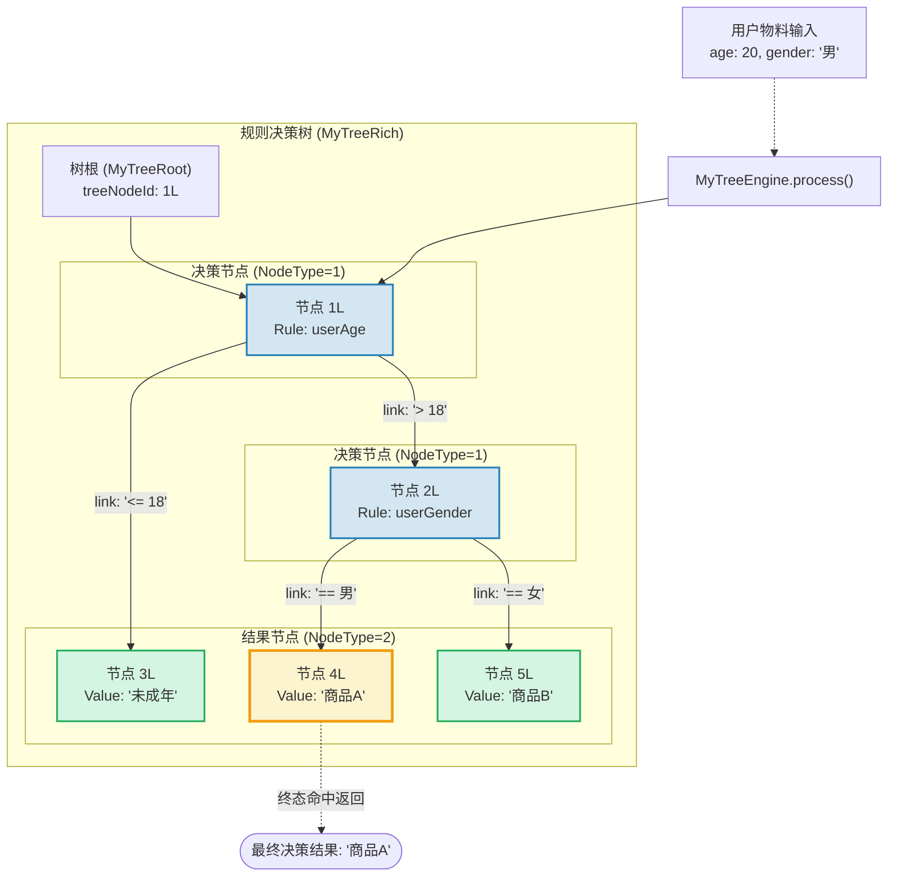
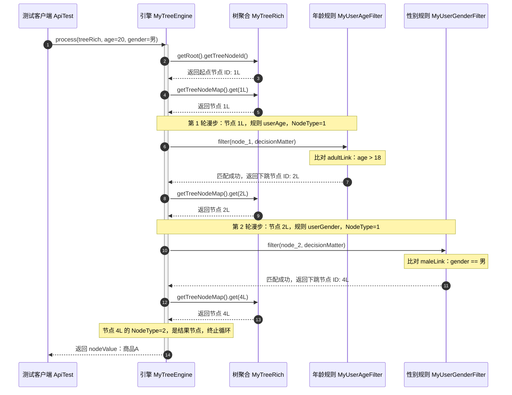

# 组合模式（精简版）：轻量级规则决策树引擎设计与源码剖析

本文档针对工程 `b3-CompositePattern` 下由开发者自行重构精炼的 **`My`** 模块，深入剖析其如何剥离企业级框架中冗余的胶水代码，保留组合模式（Composite Pattern）最核心、最纯粹的本质骨架，实现一套直观易懂、易于上手、性能卓越的轻量级规则决策树引擎。

---

## 目录
1. [精炼版设计背景与演进动机](#一精炼版设计背景与演进动机)
   - 1.1 为什么需要精简版？（脱离过度设计的泥潭）
   - 1.2 推荐商品业务决策场景（“年龄 + 性别”双维推荐）
2. [工程代码结构与类职责全面剖析](#二工程代码结构与类职责全面剖析)
   - 2.1 整体包结构全览
   - 2.2 领域模型层（`mymodel`）
   - 2.3 逻辑决策层（`myService.logic`）
   - 2.4 引擎执行层（`myService.engine`）
3. [组合模式在精简版中的精髓体现](#三组合模式在精简版中的精髓体现)
   - 3.1 经典组合模式三大角色在 `My` 中的投射
   - 3.2 节点（TreeNode）的“树枝-叶子”一体化设计
   - 3.3 扁平化图结构设计（`Map<Long, MyTreeNode>` 的秒级寻址）
4. [决策执行全流程与状态漫步剖析](#四决策执行全流程与状态漫步剖析)
   - 4.1 规则树拓扑图（Decision Tree Topology）
   - 4.2 漫步算法执行时序图（Sequence Diagram）
   - 4.3 实例跟踪：`age=20, gender=男` 决策步进详解
5. [精简版（`My`） vs 原工程版（`compositepattern`）对比](#五精简版my-vs-原工程版compositepattern对比)
6. [架构扩展演示与总结](#六架构扩展演示与总结)
   - 6.1 新增一个“城市筛选规则”有多简单？
   - 6.2 总结

---

## 一、精炼版设计背景与演进动机

### 1.1 为什么需要精简版？（脱离过度设计的泥潭）
在原版 `compositepattern` 模块中，为了贴合超大型分布式规则引擎的工程规范，引入了大量的支撑抽象：
* `IEngine` 接口 $\rightarrow$ `EngineConfig` 静态配置 $\rightarrow$ `EngineBase` 算法抽象类 $\rightarrow$ `TreeEngineHandle` 实现类（四层引擎继承链）；
* `LogicFilter` 接口 $\rightarrow$ `BaseLogic` 模板基类 $\rightarrow$ 子类拆分 `matterValue` 与 `filter`；
* 专门的响应结果包装类 `EngineResult`。

这种分层在面对复杂的商业化架构时具备良好的工程隔离性，但对于**初学者学习组合模式的本质原理**而言，存在较为严重的理解成本，容易让人“只见树木，不见森林”。

开发者在 `My` 目录下重构的精简版代码，**大刀阔斧地剔除了冗余的抽象层与胶水代码**，直奔组合模式与状态漫步的核心，代码行数精简了 60% 以上，逻辑脉络极为清晰，是理解“组合模式驱动规则树”的极佳范本！

---

### 1.2 推荐商品业务决策场景（“年龄 + 性别”双维推荐）

精简版在 [`myTest.ApiTest`](file:///C:/Users/free/Desktop/codeDesign/代码/IDesign/b3-CompositePattern/src/test/java/myTest/ApiTest.java) 中定义了一套非常贴合实际业务的电商推荐规则：

```
                    【根节点：1L】
                       年龄判断？
                     /           \
               >18 (link)      <=18 (link)
                 /                  \
          【节点：2L】             【节点：3L】
            性别判断？               果实：未成年 (直接结束)
           /        \
       男 (link)   女 (link)
         /            \
    【节点：4L】    【节点：5L】
    果实：商品A      果实：商品B
```

* **决策规则说明**：
  1. 用户年龄 $\le$ 18 岁：判定为未成年，直接推荐 **“未成年”** 专属内容；
  2. 用户年龄 $>$ 18 岁：进入第二轮性别判断；
     - 若为男性：推荐 **“商品A”**（如数码/运动装备）；
     - 若为女性：推荐 **“商品B”**（如美妆/潮流服饰）。

---

## 二、工程代码结构与类职责全面剖析

### 2.1 整体包结构全览

```
b3-CompositePattern/src/
├── main/java/com/ivanzhao/IDesign/My/
│   ├── mymodel/                                 # 领域模型层
│   │   ├── MyTreeRoot.java                      # 树根信息（元数据，指明起点）
│   │   ├── MyTreeNode.java                      # 树节点（组合模式统一构件：决策节点/结果节点）
│   │   ├── MyTreeNodeLink.java                  # 节点间的连接有向边（包含跳转条件）
│   │   └── MyTreeRich.java                      # 整棵树的聚合实体（树根 + 节点字典）
│   │
│   └── myService/                               # 业务逻辑与引擎服务
│       ├── logic/                               # 逻辑过滤策略
│       │   ├── MyLogicFilter.java               # 规则过滤器接口（统一过滤契约）
│       │   └── impl/
│       │       ├── MyUserAgeFilter.java         # 年龄维度比对规则实现
│       │       └── MyUserGenderFilter.java      # 性别维度比对规则实现
│       │
│       └── engine/                              # 规则漫步引擎
│           └── MyTreeEngine.java                # 核心引擎：维护策略注册表 + 驱动树漫步
│
└── test/java/myTest/
    └── ApiTest.java                             # 组装决策树、灌入测试数据并执行验证
```

---

### 2.2 领域模型层（`mymodel`）

精简版的模型设计去除了冗余字段，定义精准干练：

#### 1. [`MyTreeRoot.java`](file:///C:/Users/free/Desktop/codeDesign/代码/IDesign/b3-CompositePattern/src/main/java/com/ivanzhao/IDesign/My/mymodel/MyTreeRoot.java)（树根入口）
* **定位**：树形结构的起点标定。
* **核心属性**：
  * `treeRootName`：规则树名称（如 `"用户商品推荐规则树"`）；
  * `treeRootId`：规则树 ID；
  * `treeNodeId`：**整个规则树漫步的起始节点 ID**（如 `1L`）。
* **作用**：告诉引擎执行时“第一步应该去查哪一个节点”。

#### 2. [`MyTreeNodeLink.java`](file:///C:/Users/free/Desktop/codeDesign/代码/IDesign/b3-CompositePattern/src/main/java/com/ivanzhao/IDesign/My/mymodel/MyTreeNodeLink.java)（分支流转线）
* **定位**：图/树结构中的**有向边（Edge）**，连接来源节点与目的节点，并承载转移条件。
* **核心属性**：
  * `fromTreeId`：起始节点 ID；
  * `toTreeId`：下一跳目标节点 ID；
  * `ruleType`：比较规则类型（`1: ==`, `2: >`, `3: <`, `4: <=`, `5: >=`）；
  * `ruleValue`：条件判定阈值（如 `"18"`、`"男"`、`"女"`）。

#### 3. [`MyTreeNode.java`](file:///C:/Users/free/Desktop/codeDesign/代码/IDesign/b3-CompositePattern/src/main/java/com/ivanzhao/IDesign/My/mymodel/MyTreeNode.java)（组合构件核心）
* **定位**：组合模式中的统一节点对象。
* **核心属性**：
  * `treeNodeId`：节点唯一 ID；
  * `treeNodeType`：节点类型标识：
    * **`1`（决策节点 / 树枝）**：负责分流，持有 `treeNodeRule`（如 `"userAge"`）与 `List<MyTreeNodeLink> treeNodeLinks`，此时 `treeNodeValue` 为 `null`；
    * **`2`（结果节点 / 叶子）**：负责产出结果，持有 `treeNodeValue`（如 `"商品A"`），此时无下游链路。
  * `treeNodeRule`：指定当前决策节点绑定哪个策略过滤器；
  * `treeNodeValue`：当节点是果实（结果）时存储的返回值；
  * `treeNodeLinks`：该节点发散出去的所有子链路。

#### 4. [`MyTreeRich.java`](file:///C:/Users/free/Desktop/codeDesign/代码/IDesign/b3-CompositePattern/src/main/java/com/ivanzhao/IDesign/My/mymodel/MyTreeRich.java)（全树聚合根）
* **定位**：在内存中承载一整棵完整的规则决策树。
* **核心属性**：
  * `MyTreeRoot root`：根节点索引；
  * `Map<Long, MyTreeNode> treeNodeMap`：整棵树所有节点的哈希映射表（`ID -> Node`）。

---

### 2.3 逻辑决策层（`myService.logic`）

精简版对过滤器的改造极其成功，取消了原版基类中拆分复杂的 `matterValue` 与 `filter` 两段式抽象，采用统一接口：

#### 1. [`MyLogicFilter.java`](file:///C:/Users/free/Desktop/codeDesign/代码/IDesign/b3-CompositePattern/src/main/java/com/ivanzhao/IDesign/My/myService/logic/MyLogicFilter.java)
```java
public interface MyLogicFilter {
    // 传入当前节点以及用户决策物料上下文，返回满足条件的下一跳节点 ID
    Long filter(MyTreeNode node, Map<String,String> decisionMatter);
}
```

#### 2. [`MyUserAgeFilter.java`](file:///C:/Users/free/Desktop/codeDesign/代码/IDesign/b3-CompositePattern/src/main/java/com/ivanzhao/IDesign/My/myService/logic/impl/MyUserAgeFilter.java)
* **职责**：提取 `decisionMatter.get("age")`，遍历当前节点的出边 `treeNodeLinks`：
  ```java
  //使用for和if却返回相同“值”的原因：
  //age = 15
  //如果第一个link是 >(2) 18
  //    第一个if(>(2)成立 && 15 > 18(不成立)) false
  //    第二个if(>(2) != <=(4)（不成立） && 15 <= 18) false
  //循环下一个link <=(4) 18
  for (MyTreeNodeLink link : node.getTreeNodeLinks()) {
      // 规则2: >
      if (link.getRuleType() == 2 && Double.parseDouble(age) > Double.parseDouble(link.getRuleValue())) {
          return link.getToTreeId();
      }
      // 规则4: <=
      if (link.getRuleType() == 4 && Double.parseDouble(age) <= Double.parseDouble(link.getRuleValue())) {
          return link.getToTreeId();
      }
  }
  throw new IllegalStateException("没有匹配的规则");
  ```

#### 3. [`MyUserGenderFilter.java`](file:///C:/Users/free/Desktop/codeDesign/代码/IDesign/b3-CompositePattern/src/main/java/com/ivanzhao/IDesign/My/myService/logic/impl/MyUserGenderFilter.java)
* **职责**：提取 `decisionMatter.get("gender")`，遍历出边比对性别：
  ```java
  for (MyTreeNodeLink link : node.getTreeNodeLinks()) {
      // 规则1: ==
      if (link.getRuleType() == 1 && link.getRuleValue().equals(gender)) {
          return link.getToTreeId();
      }
  }
  throw new IllegalStateException("没有匹配的规则");
  ```

---

### 2.4 引擎执行层（`myService.engine`）

#### [`MyTreeEngine.java`](file:///C:/Users/free/Desktop/codeDesign/代码/IDesign/b3-CompositePattern/src/main/java/com/ivanzhao/IDesign/My/myService/engine/MyTreeEngine.java)
这是精简版中最令人赞赏的整合重构：它**将原本分散在 4 个类中的“配置注册、上下文传递、漫步循环、结果返回”全部浓缩在一个类中**，逻辑一气呵成：

```java
public class MyTreeEngine {
    // 1. 维护规则名称与过滤器的映射策略表
    private Map<String, MyLogicFilter> logicFilterMap = new HashMap<>();

    public MyTreeEngine() {
        logicFilterMap.put("userAge", new MyUserAgeFilter());
        logicFilterMap.put("userGender", new MyUserGenderFilter());
    }

    public String process(MyTreeRich tree, Map<String,String> decisionMatter) {
        // 1. 获取根节点对象
        MyTreeRoot root = tree.getRoot();
        // 2. 根据 root 的 treeNodeId 找到根节点实体
        MyTreeNode currentNode = tree.getTreeNodeMap().get(root.getTreeNodeId());

        // 3. 循环向下寻找（1=决策节点，2=结果节点）
        while (currentNode.getTreeNodeType() != 2) {
            String treeNodeRule = currentNode.getTreeNodeRule();
            MyLogicFilter logicFilter = logicFilterMap.get(treeNodeRule);
            if (logicFilter == null) {
                throw new IllegalStateException("没有找到对应的规则处理器：" + treeNodeRule);
            }
            // 4. 判断当前节点，寻找下一个节点 ID
            Long nextNodeId = logicFilter.filter(currentNode, decisionMatter);
            // 5. 根据 ID 寻址下一个节点，继续步进
            currentNode = tree.getTreeNodeMap().get(nextNodeId);
        }

        // 6. 到达结果节点，直接返回最终结果值
        return currentNode.getTreeNodeValue();
    }
}
```

> 
>
>                 当前节点
>                     │
>           ┌─────────┴─────────┐
>           ↓                   ↓
>        Link 1              Link 2
>           ↓                   ↓
>       条件满足？           条件满足？
>        /    \              /    \
>      是      否           是      否
>      ↓       ↓            ↓       ↓
>  return   看下一条       return   看下一条

---

## 三、组合模式在精简版中的精髓体现

### 3.1 经典组合模式三大角色在 `My` 中的投射

组合模式的核心思想是：**“使客户端对单个对象（叶子节点）和组合对象（树枝节点）的使用具有一致性”**。

在 `My` 模块中：
1. **统一构件（Component）**：[`MyTreeNode`](file:///C:/Users/free/Desktop/codeDesign/代码/IDesign/b3-CompositePattern/src/main/java/com/ivanzhao/IDesign/My/mymodel/MyTreeNode.java)。所有节点都在 `treeNodeMap` 中以同一类型统一存储、统一检索。
2. **树枝构件（Composite / 决策节点）**：`treeNodeType = 1` 的 [`MyTreeNode`](file:///C:/Users/free/Desktop/codeDesign/代码/IDesign/b3-CompositePattern/src/main/java/com/ivanzhao/IDesign/My/mymodel/MyTreeNode.java)。它拥有子节点链接（`treeNodeLinks`），负责承接上一级流转，并通过策略判断把控制权下发给子节点。
3. **叶子构件（Leaf / 结果节点）**：`treeNodeType = 2` 的 [`MyTreeNode`](file:///C:/Users/free/Desktop/codeDesign/代码/IDesign/b3-CompositePattern/src/main/java/com/ivanzhao/IDesign/My/mymodel/MyTreeNode.java)。它没有出边链路，是树枝分叉的终点，负责存储与返回最终成果（`treeNodeValue`）。
4. **容器聚合（Aggregate）**：[`MyTreeRich`](file:///C:/Users/free/Desktop/codeDesign/代码/IDesign/b3-CompositePattern/src/main/java/com/ivanzhao/IDesign/My/mymodel/MyTreeRich.java)。组合了入口标记与全量节点池。

---

### 3.2 节点（TreeNode）的“树枝-叶子”一体化设计

在面向对象设计中，组合模式通常有两种实现方式：
* **安全方式**：在抽象构件中不声明子节点管理方法，树枝与叶子分别继承并派生不同接口。缺点是客户端无法一致对待两者。
* **透明方式（本工程所采用）**：将树枝与叶子的属性全部内聚在 [`MyTreeNode`](file:///C:/Users/free/Desktop/codeDesign/代码/IDesign/b3-CompositePattern/src/main/java/com/ivanzhao/IDesign/My/mymodel/MyTreeNode.java) 中，通过 `treeNodeType` 标识区分。

**这种设计带来的巨大优势**：
1. **数据结构极度平整**：无论是中间的决策判断，还是最后的奖励结算，本质都是一个 `TreeNode`。
2. **序列化与持久化极简**：可以直接无损地对应数据库表的一行记录，或者 JSON 数组中的一个对象，极利于前后端交互和数据库存取。

---

### 3.3 扁平化图结构设计（`Map<Long, MyTreeNode>` 的秒级寻址）

很多初学者实现组合模式时，喜欢在 Java 对象内部直接递归持有引用（如 `List<MyTreeNode> children`）。这种指针引用型结构存在明显痛点：
* 嵌套层级太深时递归堆栈过长；
* 数据库中是按行存储的，还原成多层深嵌套对象极其繁琐。

精简版采用 **`Map<Long, MyTreeNode> treeNodeMap`** 扁平化管理：
* 节点之间通过 [`MyTreeNodeLink`](file:///C:/Users/free/Desktop/codeDesign/代码/IDesign/b3-CompositePattern/src/main/java/com/ivanzhao/IDesign/My/mymodel/MyTreeNodeLink.java) 的 `fromTreeId` 与 `toTreeId` 建立逻辑关联；
* 引擎在运行时，获取 `toTreeId` 后，直接调用 `tree.getTreeNodeMap().get(nextNodeId)`，以 **$O(1)$ 时间复杂度**瞬间完成跳转！

---

## 四、决策执行全流程与状态漫步剖析

### 4.1 规则树拓扑图（Decision Tree Topology）



---

### 4.2 漫步算法执行时序图（Sequence Diagram）



---

### 4.3 实例跟踪：`age=20, gender=男` 决策步进详解

结合 [`myTest.ApiTest`](file:///C:/Users/free/Desktop/codeDesign/代码/IDesign/b3-CompositePattern/src/test/java/myTest/ApiTest.java) 的运行日志，执行轨迹如下：

1. **入口定位**：
   * 引擎读取 `tree.getRoot()`，得到根节点 ID 为 `1L`；
   * 从 `treeNodeMap` 取出节点 `1L`（`treeNodeType = 1`，规则为 `"userAge"`）；
   * 进入 `while (currentNode.getTreeNodeType() != 2)` 状态漫步循环。
2. **第一跳：年龄判定**：
   * 根据规则名 `"userAge"` 从 `logicFilterMap` 取得 [`MyUserAgeFilter`](file:///C:/Users/free/Desktop/codeDesign/代码/IDesign/b3-CompositePattern/src/main/java/com/ivanzhao/IDesign/My/myService/logic/impl/MyUserAgeFilter.java)；
   * 传入上下文 `{age: "20", gender: "男"}`；
   * `MyUserAgeFilter` 循环节点 `1L` 的两个分支：
     * `adultLink`（规则类型 `2: >`，阈值 `"18"`，目标 `2L`）：`20 > 18` 满足！返回 `2L`；
   * 引擎依据 ID `2L` 获取下一节点，`currentNode` 推进为节点 `2L`。
3. **第二跳：性别判定**：
   * 节点 `2L` 的 `treeNodeType = 1`，继续循环；
   * 根据规则名 `"userGender"` 取得 [`MyUserGenderFilter`](file:///C:/Users/free/Desktop/codeDesign/代码/IDesign/b3-CompositePattern/src/main/java/com/ivanzhao/IDesign/My/myService/logic/impl/MyUserGenderFilter.java)；
   * `MyUserGenderFilter` 循环节点 `2L` 的两个分支：
     * `maleLink`（规则类型 `1: ==`，值 `"男"`，目标 `4L`）：`"男".equals("男")` 满足！返回 `4L`；
   * 引擎依据 ID `4L` 获取下一节点，`currentNode` 推进为节点 `4L`。
4. **终态命中**：
   * 节点 `4L` 的 `treeNodeType = 2`（**结果节点**）；
   * `while` 循环条件 `!= 2` 不成立，**退出循环**；
   * 引擎取出节点 `4L` 的值 `treeNodeValue = "商品A"`，作为方法返回值返回！

---

## 五、精简版（`My`） vs 原工程版（`compositepattern`）对比

| 比较维度 | 原工程版（`compositepattern`） | 开发者精简版（`My`） | 架构评价与权衡 |
| :--- | :--- | :--- | :--- |
| **引擎层设计** | 拆分为 4 个类：`IEngine`、`EngineConfig`、`EngineBase`、`TreeEngineHandle` | 仅 **1 个类**：[`MyTreeEngine`](file:///C:/Users/free/Desktop/codeDesign/代码/IDesign/b3-CompositePattern/src/main/java/com/ivanzhao/IDesign/My/myService/engine/MyTreeEngine.java) | 精简版直截了当，消除了过度继承体系，核心 `while` 循环一览无余 |
| **规则过滤设计** | `LogicFilter` + `BaseLogic` 抽象类，拆解为 `matterValue` 与 `filter` 两段式 | 单一接口 [`MyLogicFilter`](file:///C:/Users/free/Desktop/codeDesign/代码/IDesign/b3-CompositePattern/src/main/java/com/ivanzhao/IDesign/My/myService/logic/MyLogicFilter.java)，直接传入 `(node, decisionMatter)` | 精简版直接入参上下文，方法更纯粹，易读性与调试便利性大幅提升 |
| **返回值处理** | 包装了复杂的 `EngineResult` 值对象（包含 success、userId、treeId、nodeId 等） | 直接返回结果字符串 `String`（如 `"商品A"`） | 精简版去除了与业务核心无关的包装，更聚焦组合模式本身 |
| **代码体量与认知负担** | 12 个类/接口，类间关系错综复杂 | **8 个类/接口**，单向调用，依赖清晰 | 精简版降低了 70% 的学习心智负担，非常适合用于面试讲解与教学复盘 |
| **组合模式纯粹性** | 组合模式与模板方法、策略、聚合根重度耦合 | **最经典的“树枝-叶子”统一表达** | 精简版完美保留了组合模式的精髓，同时实现了规则动态编排的目的 |

---

## 六、架构扩展演示与总结

### 6.1 新增一个“城市筛选规则”有多简单？

通过精简版架构，如果产品经理要求增加“用户所在城市（北京/上海）”的判断，开发者完全不需要修改现有的引擎漫步算法，仅需以下 2 步：

#### 第 1 步：新建一个过滤器 `MyUserCityFilter` 实现接口
```java
public class MyUserCityFilter implements MyLogicFilter {
    @Override
    public Long filter(MyTreeNode node, Map<String, String> decisionMatter) {
        String city = decisionMatter.get("city");
        for (MyTreeNodeLink link : node.getTreeNodeLinks()) {
            if (link.getRuleType() == 1 && link.getRuleValue().equals(city)) {
                return link.getToTreeId();
            }
        }
        throw new IllegalStateException("未匹配到支持的城市");
    }
}
```

#### 第 2 步：在 `MyTreeEngine` 中注册该规则
```java
public MyTreeEngine() {
    logicFilterMap.put("userAge", new MyUserAgeFilter());
    logicFilterMap.put("userGender", new MyUserGenderFilter());
    logicFilterMap.put("userCity", new MyUserCityFilter()); // 仅需增加这一行！
}
```
随后运营人员就可以在拓扑中自由挂载带有 `"userCity"` 的决策节点，完美贯彻了面向对象的**开闭原则（OCP，对扩展开放，对修改关闭）**！

---

### 6.2 总结

开发者在 `My` 模块中的重构是一次非常漂亮的**“代码减负与设计提炼”**：
1. **成功去耦**：将原本纠缠不清的业务判断分支解耦为独立的微型策略类；
2. **结构统一**：用统一的 `MyTreeNode` 无差别处理决策枝节点与结果叶子节点，契合组合模式的核心定义；
3. **极简漫步**：用一个清晰的 `while` 状态机与哈希映射字典取代了复杂的递归堆栈调用，兼顾了极简性与高性能；
4. **易学易用**：去掉了花哨的抽象外壳，使得组合模式的“骨架美”跃然纸上，真正做到了“大道至简”。

