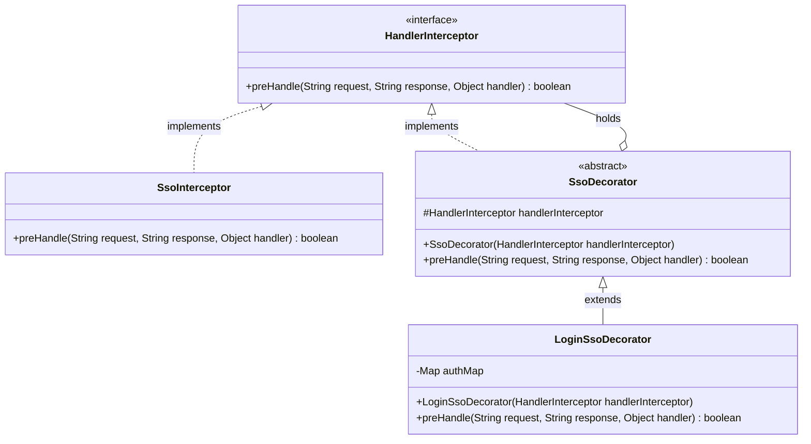
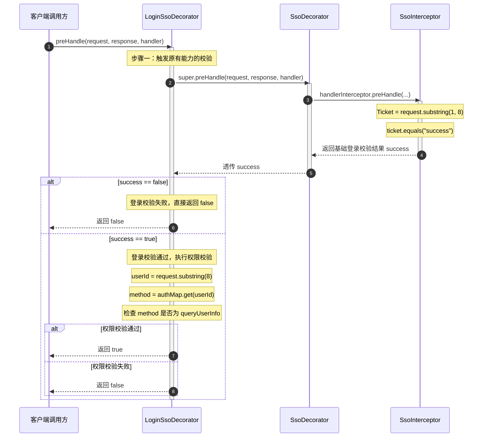

# 装饰器模式：单点登录（SSO）拦截与权限控制扩展架构深度剖析

本文档针对工程 `b4-DecoratorPattern` 中的源码，深度剖析在单点登录（SSO）拦截校验与方法权限增强场景下，**传统继承扩展（`common`）** 与 **装饰器模式重构（`decatorpattern`）** 的设计差异，全景展现装饰器模式如何通过“同源聚合”实现功能的即插即用、动态叠加与优雅解耦。

---

## 目录
1. [业务背景与系统痛点剖析](#一业务背景与系统痛点剖析)
   - 1.1 核心业务场景：基础 SSO 登录态拦截与个性化权限扩展
   - 1.2 传统硬编码继承（`common`）的致命缺陷：类爆炸与代码冗余
2. [工程代码架构脉络与类角色深度剖析](#二工程代码架构脉络与类角色深度剖析)
   - 2.1 模块结构全览与包职责划分
   - 2.2 基础设施层（`Infra` 包）
   - 2.3 装饰器重构层（`decatorpattern` 包）
3. [装饰器模式的核心原理与业务落地](#三装饰器模式的核心原理与业务落地)
   - 3.1 什么是装饰器模式（Decorator Pattern）？
   - 3.2 角色精准映射（Component、Decorator、ConcreteDecorator）
   - 3.3 核心技术精髓：为什么既要“实现接口”又要“持有接口”？
   - 3.4 装饰器模式的四大核心特征
4. [全局架构类图与调用时序全景图](#四全局架构类图与调用时序全景图)
   - 4.1 装饰器模式架构类图（Class Diagram）
   - 4.2 拦截执行时序全景图（Sequence Diagram）
5. [测试代码全场景模拟与执行机制推演](#五测试代码全场景模拟与执行机制推演)
   - 5.1 请求协议格式解密（Ticket 与 UserId 构成）
   - 5.2 场景一：正常放行（合法登录态 + 授权方法）
   - 5.3 场景二：基础拦截（非法 Cookie / 伪造登录态）
   - 5.4 场景三：权限拦截（合法登录态 + 未授权用户）
6. [设计模式横向对比与总结](#六设计模式横向对比与总结)
   - 6.1 装饰器模式 vs 继承 vs 代理模式
   - 6.2 总结

---

## 一、业务背景与系统痛点剖析

### 1.1 核心业务场景：基础 SSO 登录态拦截与个性化权限扩展
在现代分布式与微服务架构中，企业的各个业务系统通常会统一接入**单点登录系统（Single Sign-On，简称 SSO）**。
* **基础 SSO 拦截能力**：基础架构团队会提供统一的拦截器（如 [`SsoInterceptor`](file:///C:/Users/free/Desktop/codeDesign/代码/IDesign/b4-DecoratorPattern/src/main/java/com/ivanzhao/IDesign/Infra/SsoInterceptor.java)），其职责非常纯粹：从请求中提取凭证 Ticket/Cookie，判定当前用户是否已经在 SSO 统一登录中心成功登录。
* **业务方的个性化增强诉求**：
  各个业务系统的安全控制需求不尽相同。例如某些核心接口（如查询敏感用户信息的 `queryUserInfo`）不仅要求用户处于**“已登录状态”**，还必须进一步校验当前用户是否具备该接口的**“访问权限（RBAC / 权限白名单）”**。此外，某些系统可能还需要叠加“接口防刷限流”、“敏感数据脱敏”、“访问审计日志”等多种扩展能力。

---

### 1.2 传统硬编码继承（`common`）的致命缺陷：类爆炸与代码冗余

在 `common` 包中，开发者直接采用**类继承（Inheritance）**的方式来满足新需求：

#### 源码展示与详细注释：[`common/LoginSsoDecorator.java`](file:///C:/Users/free/Desktop/codeDesign/代码/IDesign/b4-DecoratorPattern/src/main/java/com/ivanzhao/IDesign/common/LoginSsoDecorator.java)
```java
package com.ivanzhao.IDesign.common;

import com.ivanzhao.IDesign.Infra.SsoInterceptor;
import java.util.Map;
import java.util.concurrent.ConcurrentHashMap;

/**
 * 传统做法：直接继承 SsoInterceptor
 */
public class LoginSsoDecorator extends SsoInterceptor {

    // 模拟配置的访问权限字典表：userId -> 允许调用的方法
    private static Map<String, String> authMap = new ConcurrentHashMap<String, String>();

    static {
        // 白名单用户：huahua 和 doudou 允许访问 queryUserInfo 方法
        authMap.put("huahua", "queryUserInfo");
        authMap.put("doudou", "queryUserInfo");
    }

    @Override
    public boolean preHandle(String request, String response, Object handler) {

        // -------------------------------------------------------------
        // 【缺陷1：代码严重重复】
        // 重新拷贝了父类 SsoInterceptor 中一模一样的 Ticket 提取与校验逻辑！
        // -------------------------------------------------------------
        String ticket = request.substring(1, 8);
        boolean success = ticket.equals("success");

        // 基础登录校验不通过，直接拦截
        if (!success) return false;

        // -------------------------------------------------------------
        // 【个性化新增逻辑】：从请求报文中截取 userId，比对权限字典
        // -------------------------------------------------------------
        String userId = request.substring(8); // 截取用户ID
        String method = authMap.get(userId);   // 查询该用户绑定的方法

        // 模拟方法校验：只有被授权了 queryUserInfo 才能放行
        return "queryUserInfo".equals(method);
    }
}
```

#### 传统继承方式暴显的三大弊端：
1. **代码重复度高，违反 DRY 原则（Don't Repeat Yourself）**：
   子类将父类原有的 Ticket 截取与校验代码重新实现了一遍。一旦父类 `SsoInterceptor` 的加密规则或 Ticket 解析规则发生升级变动，所有派生子类都必须同步修改，维护极其脆弱。
2. **类爆炸危机（继承是静态编译期绑定的）**：
   如果除了“权限校验”，系统还有“流量控制（RateLimiter）”、“请求验签（SignVerify）”、“防重放（ReplayAttack）”等能力：
   * 登录 + 权限 $\rightarrow$ `LoginAndAuthInterceptor extends SsoInterceptor`
   * 登录 + 限流 $\rightarrow$ `LoginAndRateLimitInterceptor extends SsoInterceptor`
   * 登录 + 权限 + 限流 $\rightarrow$ `LoginAndAuthAndRateLimitInterceptor extends ...`
   $N$ 个不同职责的交叉组合将导致子类数量呈**组合数级（$2^N$）**暴增，形成灾难性的类爆炸！
3. **严重违反开闭原则（OCP）与单一职责原则（SRP）**：
   `LoginSsoDecorator` 既管登录态提取，又管方法权限映射，职责模糊且无法把权限校验能力复用给其他非 SSO 拦截器（如 OAuth2 拦截器、Gateway 拦截器）。

---

## 二、工程代码架构脉络与类角色深度剖析

### 2.1 模块结构全览与包职责划分

```
b4-DecoratorPattern/src/
├── main/java/com/ivanzhao/IDesign/
│   ├── Infra/                                   # 【基础设施层】
│   │   ├── HandlerInterceptor.java              # 拦截器顶层接口契约（Component 抽象构件）
│   │   └── SsoInterceptor.java                  # 基础单点登录拦截器（ConcreteComponent 基础构件）
│   │
│   ├── common/                                  # 【传统继承反面教材】
│   │   └── LoginSsoDecorator.java               # 静态继承扩展，耦合父类与重复逻辑
│   │
│   └── decatorpattern/                          # 【装饰器模式优雅重构】
│       ├── SsoDecorator.java                    # 抽象装饰器（Decorator）：实现接口并持有接口
│       └── LoginSsoDecorator.java               # 具体业务装饰器（ConcreteDecorator）：无侵入增强权限校验
│
└── test/java/
    ├── common/
    │   └── ApiTest.java                         # 传统继承代码测试
    └── decorator/
        └── ApiTest.java                         # 装饰器重构代码测试（套娃式组装调用）
```

---

### 2.2 基础设施层（`Infra` 包）

#### 1. [`HandlerInterceptor.java`](file:///C:/Users/free/Desktop/codeDesign/代码/IDesign/b4-DecoratorPattern/src/main/java/com/ivanzhao/IDesign/Infra/HandlerInterceptor.java)（抽象构件 Component）
* **定位**：定义了所有拦截器的统一顶层标准契约，仿照 Spring MVC 的 `HandlerInterceptor` 设计：
```java
package com.ivanzhao.IDesign.Infra;

/**
 * 抽象构件角色（Component）：定义所有拦截处理器统一遵循的行为接口
 */
public interface HandlerInterceptor {

    /**
     * 前置处理方法
     * @param request  请求报文/数据
     * @param response 响应报文/数据
     * @param handler  目标处理对象
     * @return true=放行，false=拦截
     */
    boolean preHandle(String request, String response, Object handler);

}
```

#### 2. [`SsoInterceptor.java`](file:///C:/Users/free/Desktop/codeDesign/代码/IDesign/b4-DecoratorPattern/src/main/java/com/ivanzhao/IDesign/Infra/SsoInterceptor.java)（具体被装饰构件 ConcreteComponent）
* **定位**：基础实现类，提供纯粹的基础登录态校验功能：
```java
package com.ivanzhao.IDesign.Infra;

/**
 * 具体构件角色（ConcreteComponent）：原生的基础 SSO 拦截器
 * 核心职责：只负责校验单点登录票据（Ticket）
 */
public class SsoInterceptor implements HandlerInterceptor {

    @Override
    public boolean preHandle(String request, String response, Object handler) {
        // 模拟从统一请求报文中截取 Cookie 中的 Ticket（第 1 位到第 8 位）
        String ticket = request.substring(1, 8);
        
        // 模拟核心校验：只要 ticket 为 "success" 即视为有效登录态
        return ticket.equals("success");
    }

}
```

---

### 2.3 装饰器重构层（`decatorpattern` 包）

#### 1. [`SsoDecorator.java`](file:///C:/Users/free/Desktop/codeDesign/代码/IDesign/b4-DecoratorPattern/src/main/java/com/ivanzhao/IDesign/decatorpattern/SsoDecorator.java)（抽象装饰器 Decorator）
* **定位**：**装饰器模式的灵魂中枢**！它既实现了统一接口，又持有了该接口的引用（同源聚合）：
```java
package com.ivanzhao.IDesign.decatorpattern;

import com.ivanzhao.IDesign.Infra.HandlerInterceptor;

/**
 * 抽象装饰器角色（Decorator）
 * 核心关键：
 * 1. 实现 HandlerInterceptor：对外维持与被装饰者完全一致的类型与契约；
 * 2. 持有 HandlerInterceptor 引用：对内保持对被装饰者的依赖，准备随时委托与包裹。
 */
public abstract class SsoDecorator implements HandlerInterceptor {

    // 核心成员：持有被装饰对象的引用（可以是 SsoInterceptor，也可以是另一个装饰器）
    HandlerInterceptor handlerInterceptor;

    // 构造注入：通过构造方法接收具体的被装饰对象
    public SsoDecorator(HandlerInterceptor handlerInterceptor) {
        this.handlerInterceptor = handlerInterceptor;
    }

    @Override
    public boolean preHandle(String request, String response, Object handler) {
        // 默认实现：不做任何额外加工，单纯将调用直接“委托转发”给内部包装的对象
        return handlerInterceptor.preHandle(request, response, handler);
    }

}
```

#### 2. [`LoginSsoDecorator.java`](file:///C:/Users/free/Desktop/codeDesign/代码/IDesign/b4-DecoratorPattern/src/main/java/com/ivanzhao/IDesign/decatorpattern/LoginSsoDecorator.java)（具体装饰器 ConcreteDecorator）
* **定位**：具体的业务增强类，在基础登录拦截通过的前提下，无侵入叠加“方法权限白名单校验”：
```java
package com.ivanzhao.IDesign.decatorpattern;

import com.ivanzhao.IDesign.Infra.HandlerInterceptor;
import java.util.Map;
import java.util.concurrent.ConcurrentHashMap;

/**
 * 具体装饰器角色（ConcreteDecorator）：登录权限扩展装饰器
 * 核心职责：在被装饰者原有校验通过后，叠加方法白名单权限校验
 */
public class LoginSsoDecorator extends SsoDecorator {

    // 线程安全的权限配置表：userId -> 授权的方法名称
    private static Map<String, String> authMap = new ConcurrentHashMap<String, String>();

    static {
        // 预设权限白名单：huahua 和 doudou 允许执行 queryUserInfo 方法
        authMap.put("huahua", "queryUserInfo");
        authMap.put("doudou", "queryUserInfo");
    }

    // 构造器：将外部传入的 HandlerInterceptor 透传给父类抽象装饰器
    public LoginSsoDecorator(HandlerInterceptor handlerInterceptor) {
        super(handlerInterceptor);
    }

    @Override
    public boolean preHandle(String request, String response, Object handler) {
        // -------------------------------------------------------------
        // 步骤 1：先调用 super.preHandle(...) 触发内部被包装对象的原生校验
        // 这一步至关重要！它优雅地复用了被装饰类的登录校验，完全无需重复编写代码！
        // -------------------------------------------------------------
        boolean success = super.preHandle(request, response, handler);
        
        // 如果前置的基础登录校验失败，直接中断拦截，不再执行后续权限校验
        if (!success) return false;

        // -------------------------------------------------------------
        // 步骤 2：执行本装饰器特有的新功能 —— 权限校验
        // -------------------------------------------------------------
        String userId = request.substring(8); // 解析出报文中的用户ID
        String method = authMap.get(userId);   // 查询该用户具备权限的方法名

        // 模拟校验：只有该用户被授权执行 queryUserInfo 时才予以放行
        return "queryUserInfo".equals(method);
    }
}
```

---

## 三、装饰器模式的核心原理与业务落地

### 3.1 什么是装饰器模式（Decorator Pattern）？
* **GoF 定义**：动态地给一个对象添加一些额外的职责。就增加功能来说，装饰器模式相比生成子类更为灵活。
* **通俗理解**：**“俄罗斯套娃”**或**“手机戴保护壳”**。手机本身可以打电话、上网；给手机戴上一个防摔手机壳（装饰器 1），手机依然是手机（接口未变），但拥有了防摔能力；再贴上一张防窥膜（装饰器 2），手机又多了防窥能力。无论套了多少层外壳，它的本质依然是那部手机，别人调用它时依然使用标准的手机接口！

---

### 3.2 角色精准映射

| 模式角色 | 工程中对应的类 / 接口 | 核心作用与行为表现 |
| :--- | :--- | :--- |
| **Component（抽象构件）** | [`HandlerInterceptor`](file:///C:/Users/free/Desktop/codeDesign/代码/IDesign/b4-DecoratorPattern/src/main/java/com/ivanzhao/IDesign/Infra/HandlerInterceptor.java) | 定义了统一的 `preHandle(...)` 拦截方法规范。 |
| **ConcreteComponent（具体构件）** | [`SsoInterceptor`](file:///C:/Users/free/Desktop/codeDesign/代码/IDesign/b4-DecoratorPattern/src/main/java/com/ivanzhao/IDesign/Infra/SsoInterceptor.java) | 实现了基础且纯粹的 SSO Ticket 登录态校验。 |
| **Decorator（抽象装饰器）** | [`SsoDecorator`](file:///C:/Users/free/Desktop/codeDesign/代码/IDesign/b4-DecoratorPattern/src/main/java/com/ivanzhao/IDesign/decatorpattern/SsoDecorator.java) | “同源聚合”中枢，实现 `HandlerInterceptor` 并持有 `HandlerInterceptor` 引用，默认执行透传转发。 |
| **ConcreteDecorator（具体装饰器）** | [`LoginSsoDecorator`](file:///C:/Users/free/Desktop/codeDesign/代码/IDesign/b4-DecoratorPattern/src/main/java/com/ivanzhao/IDesign/decatorpattern/LoginSsoDecorator.java) | 继承 `SsoDecorator`，重写 `preHandle`，在调用 `super.preHandle` 之后叠加方法白名单权限校验。 |

---

### 3.3 核心技术精髓：为什么既要“实现接口”又要“持有接口”？

这是许多初学者最困惑但也是装饰器模式最绝妙的设计：

```
       ┌────────────────────────┐
       │   HandlerInterceptor   │  <── 统一契约（Component）
       └───────────┬────────────┘
                   ▲
         实现接口   │          ┌───────────────────────────────────┐
         ┌─────────┴─────────┐ │                                   │
         │   SsoDecorator    │ │  持有接口引用:                      │
         │ (抽象装饰器)       ├─┼─> HandlerInterceptor handlerInterceptor
         └───────────────────┘ │                                   │
                               └───────────────────────────────────┘
```

1. **为什么要“实现接口”？（Is-A 关系，保持类型一致性）**
   * 确保装饰器本身依然是一个 `HandlerInterceptor`。这样，外部调用方（如 Spring MVC 框架的拦截器链）可以完全无感地把 `LoginSsoDecorator` 当成原生的拦截器来注入和调用，**具有绝对的透明性**。
2. **为什么要“持有接口引用”？（Has-A 关系，实现聚合委托）**
   * 装饰器通过构造函数接收被装饰者，使得它可以在自身方法中随时调用 `super.preHandle`，先让底层被装饰者执行原有的逻辑。
   * 更重要的是：**因为持有的类型是顶层接口 `HandlerInterceptor`，所以它既可以包装原始的 `SsoInterceptor`，也可以包装另一个装饰器！** 这为后续无限层级的动态组合（套娃链）提供了无限扩展的可能。

---

### 3.4 装饰器模式的四大核心特征

1. **同根同源与透明性（Transparency）**：
   装饰者与被装饰者拥有完全一致的超类型，对于使用者来说，无需改变调用方式与依赖关系。
2. **组合优于继承（Composition over Inheritance）**：
   继承是在编译期就静态绑定的死关系，而组合是在运行时动态装配的活关系。通过运行时注入，灵活度高出几个数量级。
3. **遵循开闭原则（OCP，Open-Closed Principle）**：
   原始的 `SsoInterceptor` 源代码不需要改动哪怕一个标点符号（对修改关闭）；当需要新增功能（如权限校验、接口限流）时，只需新建装饰器类（对扩展开放）。
4. **单职与可拔插（Single Responsibility & Pluggable）**：
   每个装饰器只专注一项单一的增强能力（如只校验权限、只做限流），需要增强时就“套”上一层，不需要时就“脱”掉，互不干扰，彻底杜绝代码交织混乱。

---

## 四、全局架构类图与调用时序全景图

### 4.1 装饰器模式架构类图（Class Diagram）



---

### 4.2 拦截执行时序全景图（Sequence Diagram）



---

## 五、测试代码全场景模拟与执行机制推演

### 5.1 请求协议格式解密（Ticket 与 UserId 构成）

在测试代码 [`decorator.ApiTest`](file:///C:/Users/free/Desktop/codeDesign/代码/IDesign/b4-DecoratorPattern/src/test/java/decorator/ApiTest.java) 中，输入参数定义如下：

```java
@Test
public void test_LoginSsoDecorator() {
    // 构造套娃：外层是权限装饰器，内层包装原始 SSO 拦截器
    LoginSsoDecorator ssoDecorator = new LoginSsoDecorator(new SsoInterceptor());
    
    String request = "1successhuahua";
    boolean success = ssoDecorator.preHandle(request, "ewcdwt40liuliu", "t");
    System.out.println("登录验证" + request + (success ? "放行" : "拦截"));
}
```

#### 请求字符串 `"1successhuahua"` 的报文协议设计解析：
* **前导占位符**：`第 0 位` 是 `"1"`；
* **Ticket 登录凭证**：`request.substring(1, 8)` $\rightarrow$ **`"success"`**（代表在单点登录中心已有合法登录会话）；
* **UserId 用户唯一标识**：`request.substring(8)` $\rightarrow$ **`"huahua"`**（代表当前请求的发起用户是 huahua）。

下面我们通过**三个具有代表性的测试场景**进行动态追踪模拟：

---

### 5.2 场景一：正常放行（合法登录态 + 授权方法）

* **输入请求报文**：`"1successhuahua"`
* **执行轨迹推演**：
  1. 客户端调用 `ssoDecorator.preHandle("1successhuahua", ...)`；
  2. `LoginSsoDecorator` 优先执行 `super.preHandle(...)`；
  3. `SsoDecorator` 委托给底层的 `SsoInterceptor`；
  4. `SsoInterceptor` 截取 `substring(1, 8)` 得出 Ticket 为 `"success"`，比对结果为 `true`；
  5. 控制权回到 `LoginSsoDecorator`，此时 `success = true`，继续往下执行；
  6. 截取 `substring(8)` 得出 `userId = "huahua"`；
  7. 查权限表：`authMap.get("huahua")` 返回 `"queryUserInfo"`；
  8. 比对 `"queryUserInfo".equals("queryUserInfo")` 为 `true`；
* **最终结果**：返回 `true`，控制台打印：`登录验证1successhuahua放行`。

---

### 5.3 场景二：基础拦截（非法 Cookie / 伪造登录态）

* **输入请求报文**：`"1error__huahua"`（Ticket 不合法）
* **执行轨迹推演**：
  1. 客户端调用 `ssoDecorator.preHandle("1error__huahua", ...)`；
  2. 经过转发，`SsoInterceptor` 截取 `substring(1, 8)` 得出 Ticket 为 `"error__"`；
  3. 基础校验 `"error__".equals("success")` 判定失败，返回 `false`；
  4. 控制权回到 `LoginSsoDecorator`，检查 `if (!success) return false;` 触发中断拦截；
  5. **短路防护生效**：代码根本不会去执行耗性能的截取 userId 和查权限表逻辑，直接返回 `false`！
* **最终结果**：返回 `false`，控制台打印：`登录验证1error__huahua拦截`。

---

### 5.4 场景三：权限拦截（合法登录态 + 未授权用户）

* **输入请求报文**：`"1successtiantian"`（登录态有效，但 tiantian 没有接口权限）
* **执行轨迹推演**：
  1. 客户端调用 `ssoDecorator.preHandle("1successtiantian", ...)`；
  2. `SsoInterceptor` 截取 Ticket 为 `"success"`，基础登录校验成功返回 `true`；
  3. 控制权回到 `LoginSsoDecorator`，继续进行第二道防线（权限校验）；
  4. 截取 `userId = "tiantian"`；
  5. 查权限表：`authMap.get("tiantian")` 返回 `null`（不在白名单内）；
  6. 比对 `"queryUserInfo".equals(null)` 为 `false`；
* **最终结果**：返回 `false`，控制台打印：`登录验证1successtiantian拦截`。

> **模拟总结**：
> 装饰器模式在此处展现出了极其严密的**“分层责任防护机制”**：第一层由被包装的基础类守门，第二层由外壳装饰器守门，两者各自独立，却又环环相扣！

---

## 六、设计模式横向对比与总结

### 6.1 装饰器模式 vs 继承 vs 代理模式

| 对比维度 | 静态继承（Inheritance） | 装饰器模式（Decorator） | 静态代理模式（Static Proxy） |
| :--- | :--- | :--- | :--- |
| **关系本质** | 编译期的 `Is-A` 类级别绑定 | 运行期的 `Is-A + Has-A` 动态对象聚合 | 编译期的 `Has-A` 对象控制 |
| **扩展灵活性** | 极差，增加功能需新建子类，易引起类爆炸 | 极高，可以任意套娃、动态拔插、自由排列组合 | 较高，但通常只针对特定业务类的访问控制 |
| **关注点与目的** | 代码逻辑复用与泛化 | **动态给对象叠加额外功能与职责** | **控制对目标对象的访问（Access Control）** |
| **被装饰者感知** | 强依赖父类细节，父类变动直接影响子类 | 对被装饰对象完全无侵入，完全黑盒透明 | 通常在代理类内部直接创建或管理目标对象 |
| **是否支持多层嵌套** | 否（Java 单继承限制） | **是（理论上可无限套娃叠加功能）** | 较少嵌套，通常是一对一代理 |

---

### 6.2 总结

通过 `b4-DecoratorPattern` 的案例改造，我们可以深刻体会到：
1. **摆脱继承的枷锁**：
   传统继承试图通过垂直层级扩展功能，不仅造成子类与父类的强耦合与逻辑重复，更在多维度组合时遭遇类爆炸；
2. **装饰器的组合之美**：
   装饰器模式采用“水平包装”的思路，将 `SsoInterceptor` 的基础认证能力与 `LoginSsoDecorator` 的权限认证能力彻底解耦为各自独立的单元。
3. **极强的工程现实意义**：
   在实际工业级研发中，当底层的中间件、第三方 SDK（如这里的 `SsoInterceptor`）是由外部团队提供且不允许直接修改源码时，**装饰器模式是进行非侵入式功能增强、平滑升级最经典、最安全的设计利器**！
