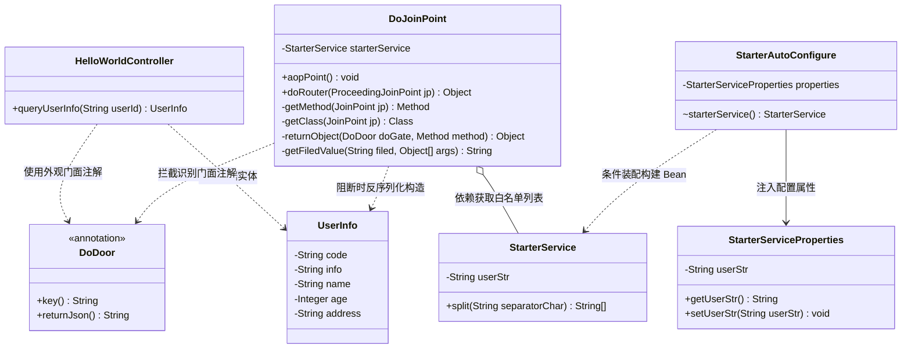
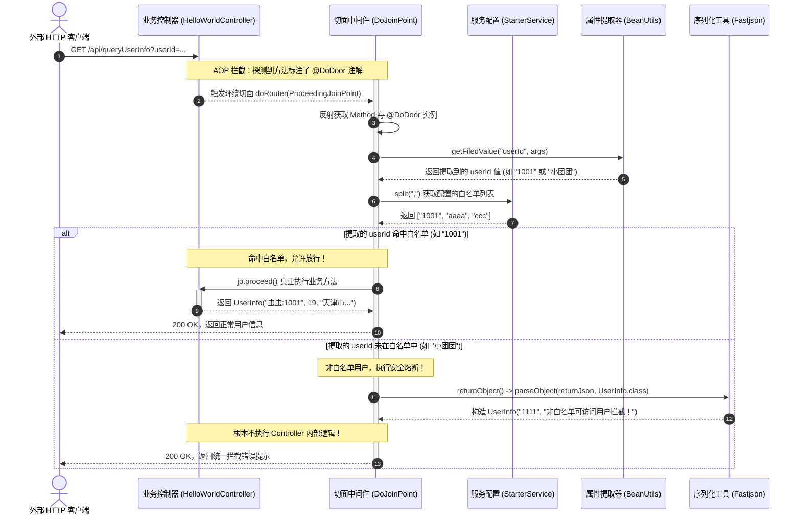

# 外观模式：基于 Spring Boot Starter 与 AOP 的服务白名单门面中间件深度剖析

本文档针对工程 `b5-FacadePattern` 中的源码，结合 **`Infra`（基础设施与业务载体）**、**`common`（传统硬编码编写）** 与 **`facade`（外观模式中间件升级）** 三个模块，深度解析企业级通用“白名单拦截”中间件的架构演进，全景展现外观模式（Facade Pattern）如何将底层的 Spring Boot 自动装配、AOP 环绕切面、反射调用、动态属性提取及 JSON 反序列化等复杂子系统，统一封装为一个极简的高层门面注解 `@DoDoor`，实现零侵入、即插即用、动态可控的接口治理。

---

## 目录
1. [业务背景与系统痛点剖析](#一业务背景与系统痛点剖析)
   - 1.1 核心业务场景：服务接口白名单管控与访问熔断
   - 1.2 传统硬编码开发（`common`）的致命缺陷：代码侵入与复制粘贴地狱
2. [工程所有文件扫描与模块功能矩阵](#二工程所有文件扫描与模块功能矩阵)
   - 2.1 全局文件目录树
   - 2.2 核心模块功能定位与设计目的矩阵
3. [外观模式在工程中的设计思路与具体体现](#三外观模式在工程中的设计思路与具体体现)
   - 3.1 什么是外观模式（Facade Pattern）？
   - 3.2 角色映射：复杂子系统 vs 高层门面（Facade）
   - 3.3 框架级外观模式的工业级体现：注解门面（`@DoDoor`）
4. [核心重难点技术深度逐行剖析](#四核心重难点技术深度逐行剖析)
   - 4.1 重难点 1：Spring Boot 自动装配与条件注解机制
   - 4.2 重难点 2：AOP 环绕通知切面（`@Around` 与动态阻断）
   - 4.3 重难点 3：多层反射动态获取方法、类与注解元数据
   - 4.4 重难点 4：动态参数属性提取（支持基础类型与复杂 POJO）
   - 4.5 重难点 5：阻断返回对象的泛型自适应与 JSON 动态反射构造
5. [全局架构类图与调用时序全景图](#五全局架构类图与调用时序全景图)
   - 5.1 外观模式核心架构类图（Class Diagram）
   - 5.2 请求拦截与放行执行时序图（Sequence Diagram）
6. [测试验证与全场景模拟推演](#六测试验证与全场景模拟推演)
   - 6.1 场景一：白名单用户放行推演
   - 6.2 场景二：非白名单用户拦截与预设 JSON 阻断推演
7. [重构前后终极对比与总结](#七重构前后终极对比与总结)

---

## 一、业务背景与系统痛点剖析

### 1.1 核心业务场景：服务接口白名单管控与访问熔断
在互联网应用、金融核心或中台服务中，许多关键接口在特定阶段（如新功能灰度发布、内部系统试运行、大促压测、核心接口防刷等）需要做严格的**访问白名单管控**：
* 只有配置在白名单内的特定测试用户或 VIP 用户（如用户 ID：`1001`, `aaaa`, `ccc`）才允许调用接口并获取真实的业务数据；
* 非白名单用户（如普通用户、未授权爬虫等）调用时，系统必须立即将其**熔断阻断**，返回统一的拦截提示信息（如 `{"code":"1111", "info":"非白名单可访问用户拦截！"}`），且**绝不能执行底层耗费性能的核心业务逻辑**。

---

### 1.2 传统硬编码开发（`common`）的致命缺陷：代码侵入与复制粘贴地狱

在 `common` 模块中，开发者直接在 Controller 业务接口内部硬编码白名单校验：

#### 源码展示与详细注释：[`common/HelloWorldController.java`](file:///C:/Users/free/Desktop/codeDesign/代码/IDesign/b5-FacadePattern/src/main/java/com/ivanzhao/Idesign/common/HelloWorldController.java)
```java
package com.ivanzhao.Idesign.common;

import com.ivanzhao.Idesign.Infra.domain.UserInfo;
import org.springframework.web.bind.annotation.RequestParam;

import java.util.ArrayList;
import java.util.List;

/**
 * 传统开发方式：在业务接口内部硬编码白名单校验
 */
public class HelloWorldController {

    public UserInfo queryUserInfo(@RequestParam String userId) {

        // -------------------------------------------------------------
        // 【痛点 1：业务逻辑与治理逻辑严重耦合】
        // 在核心业务查询方法内部，强行插入白名单校验集合
        // -------------------------------------------------------------
        List<String> userList = new ArrayList<String>();
        userList.add("1001");
        userList.add("aaaa");
        userList.add("ccc");

        // -------------------------------------------------------------
        // 【痛点 2：硬编码名单，不可配置，缺乏灵活性】
        // 一旦需要新增白名单用户（如加上 "1002"），必须改动 Java 代码重新发版
        // -------------------------------------------------------------
        if (!userList.contains(userId)) {
            // -------------------------------------------------------------
            // 【痛点 3：阻断返回对象与 Controller 返回类型强耦合】
            // -------------------------------------------------------------
            return new UserInfo("1111", "非白名单可访问用户拦截！");
        }

        // 真正的业务核心逻辑：查询并返回用户信息
        return new UserInfo("虫虫:" + userId, 19, "天津市南开区旮旯胡同100号");
    }

}
```

#### 传统方式暴显的四大致命缺陷：
1. **严重的业务代码侵入与复制粘贴地狱**：
   如果一个系统有 50 个 Controller 接口需要加白名单，研发人员就必须在 50 个方法里面挨个复制粘贴相同的白名单逻辑。一旦白名单规则发生变动，需要修改 50 处代码！
2. **白名单硬编码，无法动态配置**：
   白名单列表死死写在代码内存中，无法通过外部配置文件（如 `application.yml`）或分布式配置中心（如 Nacos、Apollo）进行动态下发与开关控制。
3. **严重违反单一职责原则（SRP）**：
   Controller 的核心职责是“接收 HTTP 请求、调度 Service 并返回视图/数据”，但硬编码使它不得不兼职“安全风控与黑白名单拦截器”的角色。
4. **可复用性极差，无法组件化沉淀**：
   这段白名单逻辑无法直接沉淀为一个通用的 Jar 包给其他微服务使用，每个团队只能各自重复造轮子。

---

## 二、工程所有文件扫描与模块功能矩阵

### 2.1 全局文件目录树

```
b5-FacadePattern/
├── pom.xml                                      # Maven 依赖管理（Spring Boot、AOP、Fastjson、BeanUtils）
└── src/
    ├── main/
    │   ├── java/com/ivanzhao/Idesign/
    │   │   ├── Infra/                           # 【基础设施与业务载体层】
    │   │   │   ├── HelloWorldApplication.java   # Spring Boot 启动入口类
    │   │   │   ├── domain/
    │   │   │   │   └── UserInfo.java            # 业务领域实体对象（包含 code, info, name, age, address）
    │   │   │   └── web/
    │   │   │       └── HelloWorldController.java # 业务 REST 接口，贴有 @DoDoor 注解门面
    │   │   │
    │   │   ├── common/                          # 【传统硬编码反面教材】
    │   │   │   └── HelloWorldController.java    # 内部硬编码 List 白名单判断
    │   │   │
    │   │   └── facade/                          # 【外观模式中间件升级核心】
    │   │       ├── annotation/
    │   │       │   └── DoDoor.java              # 自定义注解：外观模式的对外高层统一“门面”
    │   │       ├── config/
    │   │       │   ├── StarterServiceProperties.java # 映射 application.yml 配置参数属性
    │   │       │   ├── StarterService.java           # 内部业务服务：处理白名单字符串切割
    │   │       │   └── StarterAutoConfigure.java     # Spring Boot 自动装配配置类
    │   │       └── DoJoinPoint.java             # AOP 环绕切面：外观模式的“底层复杂子系统调度器”
    │   │
    │   └── resources/
    │       └── application.yml                  # 配置文件（定义端口、白名单字符串、功能开关）
    │
    └── test/java/
        ├── common/
        │   └── ApiTest.java                     # 传统硬编码方式单元测试
        └── facade/
            └── ApiTest.java                     # 外观模式中间件单元测试（验证白名单放行与非白名单拦截）
```

---

### 2.2 核心模块功能定位与设计目的矩阵

| 模块名称 | 包含文件 | 功能定位 | 设计目的 |
| :--- | :--- | :--- | :--- |
| **`Infra`**<br/>(基础设施与业务应用) | [`HelloWorldApplication.java`](file:///C:/Users/free/Desktop/codeDesign/代码/IDesign/b5-FacadePattern/src/main/java/com/ivanzhao/Idesign/Infra/HelloWorldApplication.java)<br/>[`UserInfo.java`](file:///C:/Users/free/Desktop/codeDesign/代码/IDesign/b5-FacadePattern/src/main/java/com/ivanzhao/Idesign/Infra/domain/UserInfo.java)<br/>[`Infra/web/HelloWorldController.java`](file:///C:/Users/free/Desktop/codeDesign/代码/IDesign/b5-FacadePattern/src/main/java/com/ivanzhao/Idesign/Infra/web/HelloWorldController.java) | 模拟真实的业务系统容器。提供用户数据模型与对外暴露的 HTTP 接口。 | 充当**外观模式的客户端（Client）**。展示在应用中如何**仅仅通过一行注解**即可完成复杂的白名单管控。 |
| **`common`**<br/>(普通开发反面教材) | [`common/HelloWorldController.java`](file:///C:/Users/free/Desktop/codeDesign/代码/IDesign/b5-FacadePattern/src/main/java/com/ivanzhao/Idesign/common/HelloWorldController.java) | 在业务方法中硬编码 ArrayList 白名单并进行 `if(!contains)` 判断。 | 作为对比基准，暴露出传统写法在逻辑侵入、无法配置、类膨胀上的严重问题。 |
| **`facade.annotation`**<br/>(外观注解门面) | [`DoDoor.java`](file:///C:/Users/free/Desktop/codeDesign/代码/IDesign/b5-FacadePattern/src/main/java/com/ivanzhao/Idesign/facade/annotation/DoDoor.java) | 定义运行时注解 `@DoDoor`，包含 `key`（提取入参字段名）和 `returnJson`（阻断返回 JSON）。 | **外观模式的高层核心门面（Facade Interface）**。屏蔽底层所有机制，给业务端提供极简的使用入口。 |
| **`facade.config`**<br/>(自动装配子系统) | [`StarterServiceProperties.java`](file:///C:/Users/free/Desktop/codeDesign/代码/IDesign/b5-FacadePattern/src/main/java/com/ivanzhao/Idesign/facade/config/StarterServiceProperties.java)<br/>[`StarterService.java`](file:///C:/Users/free/Desktop/codeDesign/代码/IDesign/b5-FacadePattern/src/main/java/com/ivanzhao/Idesign/facade/config/StarterService.java)<br/>[`StarterAutoConfigure.java`](file:///C:/Users/free/Desktop/codeDesign/代码/IDesign/b5-FacadePattern/src/main/java/com/ivanzhao/Idesign/facade/config/StarterAutoConfigure.java) | Spring Boot Starter 规范子系统：读取 `application.yml` 配置并条件化注册 `StarterService` Bean。 | 子系统构件之一。负责配置的外部化解耦、属性映射以及生命周期管理。 |
| **`facade`**<br/>(切面治理子系统) | [`DoJoinPoint.java`](file:///C:/Users/free/Desktop/codeDesign/代码/IDesign/b5-FacadePattern/src/main/java/com/ivanzhao/Idesign/facade/DoJoinPoint.java) | AOP 环绕通知切面。综合运用反射、BeanUtils、Fastjson 执行方法拦截、白名单匹配与动态阻断对象反序列化。 | 复杂子系统的内部核心实现（Subsystem Implementation）。统一处理拦截调度逻辑。 |

---

## 三、外观模式在工程中的设计思路与具体体现

### 3.1 什么是外观模式（Facade Pattern）？
* **GoF 经典定义**：外部与一个子系统的通信必须通过一个统一的外观对象进行，外观模式提供一个高层次的接口，使得子系统更易于使用。
* **核心哲学**：**“封装复杂性，提供统一入口；迪米特法则（最少知识原则）的极致体现”**。客户端不需要了解子系统内部是如何千头万绪地相互调用的，只需要跟外观接口打交道即可。

---

### 3.2 角色映射：复杂子系统 vs 高层门面（Facade）

在本工程中，外观模式的设计已经超越了单纯的“定义一个 Facade 类”这种入门级写法，而是**升华为一套现代微服务中间件级（Starter）的外观模式架构**：

```
                              【外观模式客户端 (Client)】
                              HelloWorldController (业务端)
                                           │
                    使用极简门面注解         │
                    只声明 key 和 returnJson│
                                           ▼
                ┌──────────────────────────────────────────────────┐
                │             【外观门面 (Facade)】                 │
                │                 @DoDoor 注解                     │
                └─────────────────────────┬────────────────────────┘
                                          │
                    底层透明驱动，业务无感  │
                                          ▼
  ┌────────────────────────────────────────────────────────────────────────┐
  │                           【复杂子系统 (Subsystems)】                   │
  │                                                                        │
  │  ┌──────────────────────┐  ┌─────────────────────┐  ┌───────────────┐  │
  │  │ 自动装配子系统        │  │ AOP 拦截子系统      │  │ 反射分析子系统 │  │
  │  │ StarterAutoConfigure │  │ @Around 环绕切面     │  │ MethodSignature│  │
  │  │ Properties 属性映射  │  │ Pointcut 切点匹配    │  │ getMethod      │  │
  │  └──────────────────────┘  └─────────────────────┘  └───────────────┘  │
  │                                                                        │
  │  ┌──────────────────────┐  ┌─────────────────────┐  ┌───────────────┐  │
  │  │ 动态属性提取子系统    │  │ 白名单比对过滤子系统│  │ 动态构造子系统 │  │
  │  │ BeanUtils.getProperty│  │ StarterService.split│  │ JSON.parse    │  │
  │  │ 对象/单值兼容提取      │  │ 遍历白名单比对       │  │ 反序列化阻断对象│  │
  │  └──────────────────────┘  └─────────────────────┘  └───────────────┘  │
  └────────────────────────────────────────────────────────────────────────┘
```

#### 映射关系表格分析：
* **外观门面（Facade）**：[`@DoDoor`](file:///C:/Users/free/Desktop/codeDesign/代码/IDesign/b5-FacadePattern/src/main/java/com/ivanzhao/Idesign/facade/annotation/DoDoor.java)
  * 对外只暴露了两个直观的参数：`key`（需要鉴别的属性名称）和 `returnJson`（被拦截时希望返回的错误 JSON）。
* **被隐藏的庞大子系统（Subsystems）**：
  1. `StarterAutoConfigure` 与 `StarterServiceProperties`：自动加载并解析配置参数；
  2. `StarterService`：白名单名单的管理与切分；
  3. `DoJoinPoint`：AOP 环绕拦截点；
  4. 反射工具集：动态获取目标方法签名、入参列表与返回值类型；
  5. `BeanUtils`：从入参（无论单值 String 还是复杂 DTO 对象）中动态提取特定字段；
  6. `Fastjson`：将阻断 JSON 转换为目标 Controller 所需的强类型实体对象。
* **客户端（Client）**：[`Infra/web/HelloWorldController.java`](file:///C:/Users/free/Desktop/codeDesign/代码/IDesign/b5-FacadePattern/src/main/java/com/ivanzhao/Idesign/Infra/web/HelloWorldController.java)
  * 业务开发人员只要在接口上敲上一行 `@DoDoor(...)`，根本不用关心底层用了什么 AOP、用了什么反射、如何反序列化。

---

### 3.3 框架级外观模式的工业级体现：注解门面（`@DoDoor`）

看一下客户端在改造后的体验：

```java
@RestController
public class HelloWorldController {

    /**
     * 一键接入白名单防护：
     * key: 从请求中提取入参字段名 "userId"
     * returnJson: 拦截时的预设 JSON 阻断对象
     */
    @DoDoor(key = "userId", returnJson = "{\"code\":\"1111\",\"info\":\"非白名单可访问用户拦截！\"}")
    @RequestMapping(path = "/api/queryUserInfo", method = RequestMethod.GET)
    public UserInfo queryUserInfo(@RequestParam String userId) {
        // 核心业务代码：极其干净！完全没有任何 if-else 白名单判断！
        return new UserInfo("虫虫:" + userId, 19, "天津市南开区旮旯胡同100号");
    }
}
```

这就是外观模式的终极魅力：**将原本需要几十行代码、跨越多个技术栈的非业务治理功能，收敛为一个优雅的注解门面。**

---

## 四、核心重难点技术深度逐行剖析

本工程能够成功运行，核心在于 `facade` 包下各个类所展现的几大 Java 与 Spring 底层高级技术。

### 4.1 重难点 1：Spring Boot 自动装配与条件注解机制

源码详见：[`StarterAutoConfigure.java`](file:///C:/Users/free/Desktop/codeDesign/代码/IDesign/b5-FacadePattern/src/main/java/com/ivanzhao/Idesign/facade/config/StarterAutoConfigure.java)

```java
package com.ivanzhao.Idesign.facade.config;

import org.springframework.beans.factory.annotation.Autowired;
import org.springframework.boot.autoconfigure.condition.ConditionalOnClass;
import org.springframework.boot.autoconfigure.condition.ConditionalOnMissingBean;
import org.springframework.boot.autoconfigure.condition.ConditionalOnProperty;
import org.springframework.boot.context.properties.EnableConfigurationProperties;
import org.springframework.context.annotation.Bean;
import org.springframework.context.annotation.Configuration;

/**
 * 自动配置类：Spring Boot Starter 的核心装配机制
 */
@Configuration
// 1. 当且仅当类路径下存在 StarterService 类时，本配置类才生效
@ConditionalOnClass(StarterService.class)
// 2. 激活并开启配置属性绑定：将 application.yml 中的 itstack.door 映射到 StarterServiceProperties 对象
@EnableConfigurationProperties(StarterServiceProperties.class)
public class StarterAutoConfigure {
    @Autowired
    private StarterServiceProperties properties;
    /**
     * 将 StarterService 注入到 Spring 容器中
     */
    @Bean
    // 3. 当容器中没有名为 StarterService 的 Bean 时才创建（方便用户自定义覆盖）
    @ConditionalOnMissingBean
    // 4. 核心开关控制：只有配置文件中 itstack.door.enabled 的值为 true 时，才创建该 Bean！
    // 这样运维人员在 yml 中把 enabled 改为 false，即可一键关闭白名单拦截！
    @ConditionalOnProperty(prefix = "itstack.door", value = "enabled", havingValue = "true")
    StarterService starterService() {
        return new StarterService(properties.getUserStr());
    }
}
```

#### 关键技术点解析：
* **外部化属性绑定**：[`StarterServiceProperties`](file:///C:/Users/free/Desktop/codeDesign/代码/IDesign/b5-FacadePattern/src/main/java/com/ivanzhao/Idesign/facade/config/StarterServiceProperties.java) 使用 `@ConfigurationProperties("itstack.door")` 实现了与 `application.yml` 的强类型安全绑定。
* **条件装配（Conditional Configuration）**：`@ConditionalOnProperty` 是企业级中间件的标准写法，实现了**“配置即开关”**的治理理念。

---

### 4.2 重难点 2：AOP 环绕通知切面（`@Around` 与动态阻断）

源码详见：[`DoJoinPoint.java`](file:///C:/Users/free/Desktop/codeDesign/代码/IDesign/b5-FacadePattern/src/main/java/com/ivanzhao/Idesign/facade/DoJoinPoint.java)

```java
@Aspect
@Component
public class DoJoinPoint {

    private Logger logger = LoggerFactory.getLogger(DoJoinPoint.class);

    @Autowired
    private StarterService starterService; // 注入白名单配置服务

    // 1. 定义切点：精准匹配所有标有 @DoDoor 自定义注解的方法
    @Pointcut("@annotation(com.ivanzhao.Idesign.facade.annotation.DoDoor)")
    public void aopPoint() {
    }

    // 2. 环绕通知：能够完全掌控目标方法的执行（放行或阻断拦截）
    @Around("aopPoint()")
    public Object doRouter(ProceedingJoinPoint jp) throws Throwable {
        // 步骤 1：通过反射获取目标方法和注解对象
        Method method = getMethod(jp);
        DoDoor door = method.getAnnotation(DoDoor.class);
        // 步骤 2：从入参中提取 key 对应的字段值（例如获取传入的 userId: "1001"）
        String keyValue = getFiledValue(door.key(), jp.getArgs());
        logger.info("itstack door handler method：{} value：{}", method.getName(), keyValue);     
        // 如果提取不到属性值，为了不破坏正常流程，选择放行
        if (null == keyValue || "".equals(keyValue)) return jp.proceed();
        // 步骤 3：获取并切分 yml 中配置的白名单数组（["1001", "aaaa", "ccc"]）
        String[] split = starterService.split(",");
        // 步骤 4：白名单比对
        for (String str : split) {
            if (keyValue.equals(str)) {
                // 命中白名单：调用 jp.proceed() 放行，执行真正的业务 Controller 方法
                return jp.proceed();
            }
        }        
        // 步骤 5：未命中白名单：绝不调用 jp.proceed()！直接构造预设错误对象返回（熔断阻断）
        return returnObject(door, method);
    }
```

#### 关键技术点解析：
* **`ProceedingJoinPoint.proceed()` 的控制权**：环绕通知不仅能在方法前后打印日志，最关键的是它拥有**是否执行目标方法的决定权**。通过拦截并不调用 `jp.proceed()`，非白名单请求连 Controller 的门都进不去，保护了底层核心业务！

---

### 4.3 重难点 3：多层反射动态获取方法、类与注解元数据

在 Spring AOP 中，获取代理对象背后的真正目标类与方法是常见难点：

```java
    // 从连接点反查真实的 Method 对象
    private Method getMethod(JoinPoint jp) throws NoSuchMethodException {
        Signature sig = jp.getSignature();
        MethodSignature methodSignature = (MethodSignature) sig;
        // 注意：必须获取 targetClass 的真实声明方法，而不能直接取接口的声明方法
        return getClass(jp).getMethod(methodSignature.getName(), methodSignature.getParameterTypes());
    }

    // 获取目标对象的真实 Class 类型
    private Class<? extends Object> getClass(JoinPoint jp) throws NoSuchMethodException {
        return jp.getTarget().getClass();
    }
```

#### 关键技术点解析：
* `jp.getSignature()` 在环绕通知中实际运行时是 `MethodSignature`；
* 通过 `jp.getTarget().getClass()` 穿透 Spring 生成的 CGLIB/JDK 动态代理外壳，精准定位到开发人员编写的具体类和具体方法上，从而能安全读取到 `@DoDoor` 注解上的元数据。

---

### 4.4 重难点 4：动态参数属性提取（支持基础类型与复杂 POJO）

很多初学者只能拦截基本数据类型。而本工程通过 Apache Commons `BeanUtils` 实现了对**复杂 Java 实体对象入参**的高级提取：

```java
    // 动态提取参数属性值
    private String getFiledValue(String filed, Object[] args) {
        String filedValue = null;
        for (Object arg : args) {
            try {
                if (null == filedValue || "".equals(filedValue)) {
                    // 场景 A：如果入参是一个复合对象（如 UserDTO、QueryParam），
                    // 利用 BeanUtils 反射读取对象中指定属性名为 filed 的属性值（如 userDTO.getUserId()）
                    filedValue = BeanUtils.getProperty(arg, filed);
                } else {
                    break;
                }
            } catch (Exception e) {
                // 场景 B：如果入参不是 JavaBean（例如直接传入基本类型、字符串参数 String userId）
                // 此时 BeanUtils 会抛出异常，进入 catch 块
                if (args.length == 1) {
                    // 若只有一个入参，则直接将其当做我们要比对的属性值！
                    return args[0].toString();
                }
            }
        }
        return filedValue;
    }
```

#### 关键技术点解析：
* 既兼容了简单的 `@RequestParam String userId` 传参方式，又完美支持了复杂的 `@RequestBody UserReq req` 对象传参方式，具备极高的框架通用性。

---

### 4.5 重难点 5：阻断返回对象的泛型自适应与 JSON 动态反射构造

当请求被拦截时，各个 Controller 接口声明的返回值类型是不同的（有的返回 `UserInfo`，有的返回 `Result<String>`）。如何保证拦截返回时类型一致、不报错？

```java
    // 动态构造阻断返回对象
    private Object returnObject(DoDoor doGate, Method method) throws IllegalAccessException, InstantiationException {
        // 1. 获取目标接口声明的返回值类型（如 UserInfo.class）
        Class<?> returnType = method.getReturnType();        
        // 2. 获取注解中配置的预设 JSON 阻断报文（如 "{\"code\":\"1111\",\"info\":\"非白名单...\"}"）
        String returnJson = doGate.returnJson();        
        // 3. 如果注解未设置 returnJson，则直接反射调用无参构造函数返回空对象
        if ("".equals(returnJson)) {
            return returnType.newInstance();
        }        
        // 4. 核心魔法：使用 Fastjson 将 JSON 字符串反序列化为目标方法的真实返回类型！
        return JSON.parseObject(returnJson, returnType);
    }
```

#### 关键技术点解析：
* **动态自适应返回类型**：利用 `method.getReturnType()` 探测返回值类型，结合 Fastjson 的动态多态反序列化，生成与目标接口完全匹配的阻断对象。调用方无需任何强转，客户端前端也能接收到结构统一的 JSON 数据！

---

## 五、全局架构类图与调用时序全景图

### 5.1 外观模式核心架构类图（Class Diagram）



---

### 5.2 请求拦截与放行执行时序图（Sequence Diagram）



---

## 六、测试验证与全场景模拟推演

测试代码详见：[`src/test/java/facade/ApiTest.java`](file:///C:/Users/free/Desktop/codeDesign/代码/IDesign/b5-FacadePattern/src/test/java/facade/ApiTest.java)

### 6.1 场景一：白名单用户放行推演
* **测试方法**：`test_queryUserInfo_whiteList()`
* **输入参数**：`userId = "1001"`（配置在 `application.yml` 的 `itstack.door.userStr` 中）
* **执行轨迹追踪**：
  1. 调用 `helloWorldController.queryUserInfo("1001")`；
  2. 进入 `DoJoinPoint.doRouter` 切面；
  3. 解析注解 `@DoDoor`，从入参提取 `keyValue = "1001"`；
  4. 比对白名单集合 `["1001", "aaaa", "ccc"]`，在索引 `0` 处匹配成功；
  5. 触发 `jp.proceed()` 放行，Controller 内部代码被执行；
  6. 返回构造好的实际用户数据。
* **日志输出结果**：
  ```json
  {"address":"天津市南开区旮旯胡同100号","age":19,"code":"0000","info":"success","name":"虫虫:1001"}
  ```

---

### 6.2 场景二：非白名单用户拦截与预设 JSON 阻断推演
* **测试方法**：`test_queryUserInfo_intercept()`
* **输入参数**：`userId = "小团团"`
* **执行轨迹追踪**：
  1. 调用 `helloWorldController.queryUserInfo("小团团")`；
  2. 进入 `DoJoinPoint.doRouter` 切面；
  3. 解析注解，提取 `keyValue = "小团团"`；
  4. 遍历白名单集合 `["1001", "aaaa", "ccc"]`，未找到匹配项；
  5. **跳过 `jp.proceed()`**，执行 `returnObject(door, method)`；
  6. 获取方法返回类型 `UserInfo.class`，读取注解中的预设 JSON：
     `"{\"code\":\"1111\",\"info\":\"非白名单可访问用户拦截！\"}"`；
  7. Fastjson 将其转化为 `UserInfo` 实例返回。
* **日志输出结果**：
  ```json
  {"code":"1111","info":"非白名单可访问用户拦截！"}
  ```

---

## 七、重构前后终极对比与总结

| 对比维度 | 传统普通开发（`common` 包） | 外观模式中间件重构（`facade` 包） |
| :--- | :--- | :--- |
| **接入成本** | 每个方法写十几行代码，到处复制粘贴 | **仅需一行注解 `@DoDoor(...)`**，0 侵入接入 |
| **业务代码纯洁度** | 核心业务与风控逻辑强耦合，代码杂乱 | 业务 Controller 只写核心业务逻辑，极致纯粹 |
| **名单维护性** | 白名单写死在 Java 代码中，变更需改代码并重新发版 | 配置外置于 `application.yml` 或配置中心，支持热变更 |
| **功能开关** | 无法做到一键开关 | 支持配置 `@ConditionalOnProperty` 开关，可一键启停 |
| **可复用性与沉淀** | 零复用，其他项目只能重新写一套 | **可直接打包为通用 Spring Boot Starter Jar**，全公司跨服务复用 |
| **面向对象原则** | 严重违反单一职责原则（SRP）与开闭原则（OCP） | **完美贯彻开闭原则、迪米特法则（最少知识原则）** |

### 架构升华总结
外观模式在现代微服务与组件化研发中，早已从传统的“封装几个类的接口”升级为**“组件化与中间件门面”**。通过 `@DoDoor` 注解与背后的自动装配切面子系统，不仅彻底解放了业务开发人员的双手，更将非功能性技术能力（风控、鉴权、限流、日志）沉淀为标准的中台基础设施，展现了极其优秀的软件架构设计思想！

```java
// ============================================================
// 1. 声明：这是一个 AOP 切面
// ============================================================
@Aspect
// ============================================================
// 2. 声明：把这个类交给 Spring 容器管理
// ============================================================
@Component
public class DoMyJoinPoint {

    private Logger logger = LoggerFactory.getLogger(this.getClass());


    // ========================================================
    // 3. 注入 StarterService
    // ========================================================
    @Autowired
    private StarterService starterService;


    // ========================================================
    // 4. 定义切点 Pointcut
    // ========================================================

    // @Pointcut 的作用：
    // “告诉 Spring：哪些方法需要被我的 AOP 拦截？”
    // 这里写的是：
    //     @annotation(...)
    // 意思是：
    // “只要某个方法上存在指定的注解，
    //  就把这个方法当成我的拦截目标。”
    // 指定的注解就是：
    //     MyDoDoor
    // 所以：
    //     @MyDoDoor
    //     public UserInfo queryUserInfo(...) {
    //     }
    // 这个方法就会成为 AOP 的拦截目标。
    // 注意：
    // aopPoint() 本身没有执行任何业务。
    // 它只是一个“切点名字/规则”。
    // 后面的 @Around("aopPoint()")
    // 会引用这个规则。
    @Pointcut("@annotation(com.ivanzhao.Idesign.My.annotation.MyDoDoor)")
    public void aopPoint() {

        // 这里通常是空的。
        //
        // 因为 aopPoint() 不是用来执行代码的，
        // 它只是给这个 Pointcut 规则起一个名字。
    }


    // ========================================================
    // 5. Around 环绕通知
    // ========================================================

    // @Around 表示：
    // “当 aopPoint() 定义的目标方法被调用时，
    // 先进入我这个方法，由我决定接下来怎么办。”
    // 所以整个调用过程原本是：
    //     Controller.queryUserInfo()
    // 现在变成：
    //     doRouter()
    //          ↓
    //     检查白名单
    //          ↓
    //     决定：
    //       ├── jp.proceed()  → 原方法继续执行
    //       └── returnObject() → 原方法不执行，直接返回拦截结果
    // 这就是“环绕”的意思：
    //     AOP
    //      ↓
    //     目标方法
    //      ↑
    //     AOP
    // 目标方法的执行被这个方法“包”住了。
    @Around("aopPoint()")
    public Object doRouter(ProceedingJoinPoint jp) throws Throwable {

        // ====================================================
        // 6. 获取当前被拦截的方法
        // ====================================================
        // jp 是 ProceedingJoinPoint。        
        // 可以把它理解成：        
        // “当前这一次方法调用的完整上下文”        
        // 它里面可以拿到很多东西，例如：        
        //     谁在调用？
        //     调用的是哪个方法？
        //     参数是什么？
        //     目标对象是谁？
        //     是否继续执行原方法？        
        // getMethod(jp)
        // 是你下面已经写好的辅助方法，
        // 最终得到真正的 java.lang.reflect.Method 对象。        
        // 例如最终得到的可能就是：        
        //     HelloWorldController.queryUserInfo(String)        
        Method method = getMethod(jp);


        // ====================================================
        // 7. 从 Method 上读取 @MyDoDoor 注解
        // ====================================================
        // method 表示刚才找到的目标方法。        
        // getAnnotation(MyDoDoor.class)
        // 表示：        
        // “从这个方法上，把 MyDoDoor 注解取出来。”        
        // 例如 Controller 中：        
        // @MyDoDoor(
        //     key = "userId",
        //     returnJson = "{\"code\":\"1111\"...}"
        // )
        // public UserInfo queryUserInfo(String userId)        
        // 那么这里拿到的 myDoDoor，
        // 就相当于拿到了这两个配置：        
        //     myDoDoor.key()
        //     → "userId"        
        //     myDoDoor.returnJson()
        //     → "{\"code\":\"1111\"...}"        
        // 所以：        
        // 注解负责“声明配置”，
        // AOP 在这里负责“读取配置并执行逻辑”。
        MyDoDoor myDoDoor = method.getAnnotation(MyDoDoor.class);

        // ====================================================
        // 8. 获取用户传入的 userId
        // ====================================================
        // myDoDoor.key()        
        // 得到的是注解里面写的：        
        //     key = "userId"        
        // 相当于告诉程序：        
        // “我要检查调用这个方法时传进来的 userId。”                
        // jp.getArgs()        
        // 得到当前方法调用时传入的所有参数。        
        // 比如：        
        //     queryUserInfo("1001")        
        // 那么：        
        //     jp.getArgs()        
        // 得到的就是：        
        //     ["1001"]                
        // getFiledValue(...)        
        // 是你提供的辅助方法，
        // 用来从这些参数中找到指定字段的值。        
        // 最终：        
        //     keyValue = "1001"        
        // 或者：
        /
        //     keyValue = "小团团"
        //
        String keyValue = getFiledValue(
                myDoDoor.key(),
                jp.getArgs()
        );


        // ====================================================
        // 9. 打印日志
        // ====================================================

        // 输出：
        //
        //     method:queryUserInfo value:1001
        //
        // 方便我们观察：
        // 当前拦截了哪个方法，
        // 当前拿到了什么参数。
        logger.info(
                "method:{} value:{}",
                method.getName(),
                keyValue
        );


        // ====================================================
        // 10. 参数为空：直接放行
        // ====================================================

        // 如果 keyValue 是 null：
        //
        //     keyValue == null
        //
        // 或者是空字符串：
        //
        //     "".equals(keyValue)
        //
        // 就不进行白名单检查，
        // 直接执行原来的业务方法。
        //
        // jp.proceed() 是这里非常关键的方法。
        //
        // 它表示：
        //
        //     “继续执行原本被 AOP 拦截的那个方法。”
        //
        // 比如原本：
        //
        //     queryUserInfo("1001")
        //
        // 被拦截后进入：
        //
        //     doRouter()
        //
        // 当执行：
        //
        //     jp.proceed()
        //
        // 就相当于：
        //
        //     “好了，检查结束，现在回到
        //      queryUserInfo("1001") 继续执行。”
        //
        // 注意：
        //
        // @Around 中如果不调用 jp.proceed()，
        // 原方法就不会继续执行。
        if (null == keyValue || "".equals(keyValue)) {
            return jp.proceed();
        }


        // ====================================================
        // 11. 获取白名单
        // ====================================================

        // starterService 中保存的是：
        //
        //     1001,aaaa,ccc
        //
        // split(",")
        // 按照逗号进行分割。
        //
        // 最终：
        //
        //     split[0] = "1001"
        //     split[1] = "aaaa"
        //     split[2] = "ccc"
        //
        String[] split = starterService.split(",");


        // ====================================================
        // 12. 遍历白名单
        // ====================================================

        // 一个一个检查白名单中的用户 ID。
        //
        // 假设：
        //
        //     keyValue = "1001"
        //
        // 那么第一次：
        //
        //     s = "1001"
        //
        //     "1001".equals("1001")
        //
        // 成立。
        //
        // 说明：
        //
        //     当前用户在白名单中。
        for (String s : split) {


            // ==================================================
            // 13. 判断当前用户是否在白名单
            // ==================================================

            // keyValue：
            //     当前请求传进来的用户 ID
            //
            // s：
            //     当前遍历到的白名单用户 ID
            //
            // 如果两者相等：
            //
            //     用户在白名单中
            if (keyValue.equals(s)) {


                // ==============================================
                // 14. 白名单用户：放行
                // ==============================================

                // 继续执行原来的 Controller 方法。
                //
                // 例如：
                //
                //     queryUserInfo("1001")
                //
                // 原方法开始真正执行：
                //
                //     return new UserInfo(
                //         "虫虫:" + userId,
                //         19,
                //         "天津市南开区..."
                //     );
                //
                // 最终把原方法的返回值交给调用者。
                return jp.proceed();
            }
        }


        // ====================================================
        // 15. 不在白名单：拦截
        // ====================================================

        // 如果 for 循环完整执行完了，
        // 仍然没有找到：
        //
        //     keyValue.equals(s)
        //
        // 说明用户不在白名单。
        //
        // 这时候：
        //
        //     不调用 jp.proceed()
        //
        // 所以：
        //
        //     原来的 queryUserInfo()
        //
        // 根本不会执行。
        //
        //
        // 改为调用 returnObject(...)：
        //
        // 根据 @MyDoDoor 中配置的 returnJson，
        // 创建一个和原方法返回类型一致的对象。
        //
        // 例如：
        //
        //     @MyDoDoor(
        //         key = "userId",
        //         returnJson = "{\"code\":\"1111\",\"info\":\"非白名单可访问用户拦截！\"}"
        //     )
        //
        // 最终可能得到：
        //
        //     new UserInfo(
        //         "1111",
        //         "非白名单可访问用户拦截！"
        //     )
        //
        // 然后直接返回。
        //
        // 所以整个 AOP 的核心实际上就是：
        //
        //     白名单
        //        ↓
        //     jp.proceed()
        //        ↓
        //     原方法执行
        //
        //     非白名单
        //        ↓
        //     不调用 jp.proceed()
        //        ↓
        //     returnObject()
        //        ↓
        //     直接返回拦截结果
        return returnObject(myDoDoor, method);
    }
}
```

