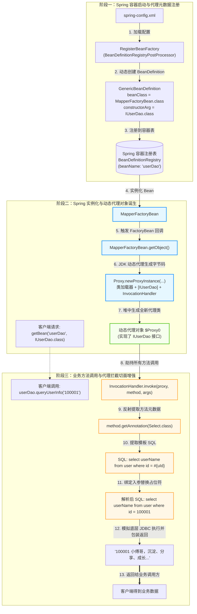
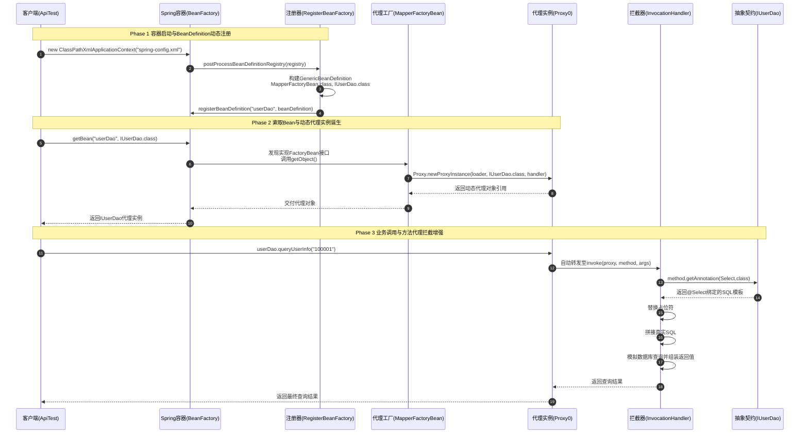
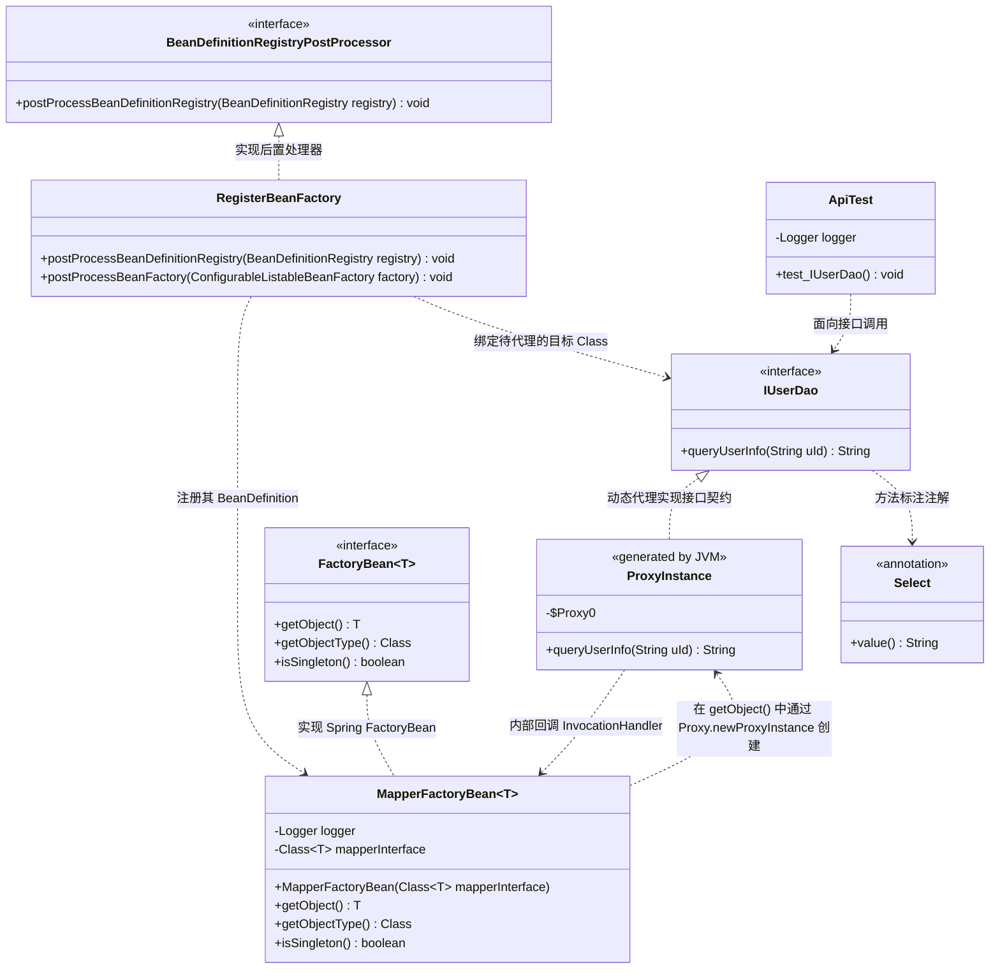

# 代理模式：模拟 MyBatis-Spring 核心机制的动态代理与 IoC 自动化注册架构深度剖析

本文档针对工程 `b7-ProxyPattern` 中的源码，深度剖析在持久层框架（如 MyBatis、Spring Data JPA）中**“仅声明 DAO 接口，无需编写具体实现类即可直接注入并查询数据库”**的核心底层原理，全景展现代理模式（Proxy Pattern）如何结合 JDK 动态代理（`Proxy.newProxyInstance`）、Spring `FactoryBean<T>` 机制以及 `BeanDefinitionRegistryPostProcessor` 容器后置处理器，实现无实现类接口的代理生成、行为劫持、SQL 注解解析与 IoC 自动化无缝装配。

---

## 目录
1. [全局架构与调用关系全景图](#一全局架构与调用关系全景图)
   - 1.1 全局工程目录结构树
   - 1.2 模块职责与核心类角色矩阵
   - 1.3 核心架构流转图（Mermaid Flowchart）
   - 1.4 全生命周期调用时序图（Mermaid SequenceDiagram）
   - 1.5 核心类设计类图（Mermaid ClassDiagram）
2. [业务背景与代理模式核心原理](#二业务背景与代理模式核心原理)
   - 2.1 业务痛点：为什么 MyBatis 只要写接口就能查数据库？（传统 JDBC 实现类的弊端）
   - 2.2 什么是代理模式（Proxy Pattern）？
   - 2.3 代理模式在业务工程中的具体运用机制
   - 2.4 代理模式的三大核心工业级特点
3. [核心源码逐行深度剖析与详细注释](#三核心源码逐行深度剖析与详细注释)
   - 3.1 抽象主题接口：`IUserDao.java`（业务契约与方法声明）
   - 3.2 SQL 模板注解：`agent/Select.java`（运行时元数据提供者）
   - 3.3 核心代理工厂与调用处理器：`agent/MapperFactoryBean.java`（代理类的动态诞生与调用拦截）
   - 3.4 动态注册桥梁：`agent/RegisterBeanFactory.java`（BeanDefinition 编程式注册）
   - 3.5 容器配置入口：`resources/spring-config.xml`（后置处理器注册配置）
4. [Test 测试代码模拟推演与运行机制直观呈现](#四test-测试代码模拟推演与运行机制直观呈现)
   - 4.1 测试代码逐行剖析（`test/ApiTest.java`）
   - 4.2 代理对象在 JVM 底层的生成与结构解密（`$ProxyN` 是如何运转的？）
   - 4.3 单元测试真实运行模拟与控制台日志逐行拆解
   - 4.4 架构思考：如果不用代理模式，代码会退化成什么样？
5. [重构对比、开源框架应用与设计模式总结](#五重构对比开源框架应用与设计模式总结)
   - 5.1 静态代理 vs JDK 动态代理 vs CGLIB 动态代理对比
   - 5.2 代理模式在主流开源框架中的经典落地（MyBatis、Spring AOP、Dubbo/Feign RPC）
   - 5.3 GoF 结构型设计模式家族定位总结

---

## 一、全局架构与调用关系全景图

### 1.1 全局工程目录结构树

```text
b7-ProxyPattern/
├── pom.xml                                              # Maven 依赖配置文件（集成 Spring、AspectJ、MyBatis等）
├── 代理模式案例解析与设计架构深度剖析.md                 # 【当前技术文档】
└── src/
    ├── main/
    │   ├── java/com/ivanzhao/Idesign/
    │   │   ├── IUserDao.java                            # 抽象主题接口（Subject）：仅定义方法和 @Select
    │   │   └── agent/                                   # 代理核心与 Spring 容器扩展组件
    │   │       ├── Select.java                          # 自定义注解：承载 SQL 模板元数据
    │   │       ├── MapperFactoryBean.java               # 核心代理工厂（Proxy Factory）：结合 JDK Proxy 与 FactoryBean
    │   │       └── RegisterBeanFactory.java             # 容器后置处理器：动态注册 BeanDefinition 到 Spring
    │   └── resources/
    │       └── spring-config.xml                        # Spring 容器配置文件：配置后置处理器入口
    └── test/
        └── java/test/
            └── ApiTest.java                             # 客户端集成测试：验证从容器索取代理对象并执行
```

---

### 1.2 模块职责与核心类角色矩阵

| 类文件 | 代理模式标准角色 | Spring / 框架角色 | 核心职责与设计意图 |
| :--- | :--- | :--- | :--- |
| [`IUserDao`](file:///C:/Users/free/Desktop/codeDesign/代码/IDesign/b7-ProxyPattern/src/main/java/com/ivanzhao/Idesign/IUserDao.java) | **抽象主题（Subject）** | **Mapper 接口** | 声明业务方法契约，标注 `@Select` 注解。**没有具体的实现类（无 UserDaoImpl）**，完全面向抽象编程。 |
| [`Select`](file:///C:/Users/free/Desktop/codeDesign/代码/IDesign/b7-ProxyPattern/src/main/java/com/ivanzhao/Idesign/agent/Select.java) | **方法增强元数据** | **SQL 模板注解** | 提供运行时 SQL 模板字符串（如 `select userName from user where id = #{uId}`），供代理类反射解析。 |
| [`MapperFactoryBean`](file:///C:/Users/free/Desktop/codeDesign/代码/IDesign/b7-ProxyPattern/src/main/java/com/ivanzhao/Idesign/agent/MapperFactoryBean.java) | **代理工厂（Proxy Factory）与 InvocationHandler** | **Spring FactoryBean** | **代理模式核心所在**：在 `getObject()` 中通过 `Proxy.newProxyInstance` 动态在内存中为 `IUserDao` 创建代理对象，并在 `InvocationHandler` 中拦截所有调用，解析 SQL 并模拟执行。 |
| [`RegisterBeanFactory`](file:///C:/Users/free/Desktop/codeDesign/代码/IDesign/b7-ProxyPattern/src/main/java/com/ivanzhao/Idesign/agent/RegisterBeanFactory.java) | **代理装配桥梁** | **BeanDefinitionRegistryPostProcessor** | 在 Spring 启动阶段，编程式构建 `GenericBeanDefinition`，将 `MapperFactoryBean` 注册为名为 `userDao` 的 Bean，并将 `IUserDao.class` 作为构造参数传入。 |
| [`spring-config.xml`](file:///C:/Users/free/Desktop/codeDesign/代码/IDesign/b7-ProxyPattern/src/main/resources/spring-config.xml) | **容器配置** | **IoC 上下文配置** | 声明 `RegisterBeanFactory`，引导 Spring 上下文启动后自动触发动态注册。 |
| [`ApiTest`](file:///C:/Users/free/Desktop/codeDesign/代码/IDesign/b7-ProxyPattern/src/test/java/test/ApiTest.java) | **客户端（Client）** | **业务调用者** | 模拟业务层直接索取 `IUserDao` 接口实例并调用 `queryUserInfo`，检验代理拦截效果。 |

---

### 1.3 核心架构流转图（Mermaid Flowchart）



---

### 1.4 全生命周期调用时序图（Mermaid SequenceDiagram）



---

### 1.5 核心类设计类图（Mermaid ClassDiagram）



---

## 二、业务背景与代理模式核心原理

### 2.1 业务痛点：为什么 MyBatis 只要写接口就能查数据库？

在传统的 JDBC 时代或老旧的 MVC 架构中，进行数据库操作需要经历极其繁重、重复且脆弱的步骤：
1. **必须手写每个 DAO 的实现类**（如 `UserDaoImpl`、`OrderDaoImpl`、`ProductDaoImpl`）；
2. **实现类中充斥着大量的样板代码（Boilerplate Code）**：
   - 手动获取 `Connection`、创建 `PreparedStatement`；
   - 手动给 SQL 的 `?` 占位符设值（`ps.setString(1, uId)`）；
   - 执行查询、循环遍历 `ResultSet`、手动 `new User()` 并通过 getter/setter 一一映射字段；
   - 手动处理 `SQLException`、在 `finally` 块中关闭连接。

```text
传统开发模式：
IUserDao 接口 ──────> IUserDaoImpl 实现类 ──────> 编写繁琐 JDBC 样板代码 ──────> 数据库
【痛点】：100 个表就要写 100 个实现类，几千行几乎一模一样的 JDBC 映射代码！
```

**为什么现代框架（如 MyBatis）彻底干掉了实现类？**
开发者只需写一个接口 `public interface IUserDao`，在上面写一个 `@Select("select ...")`，就**不需要编写任何 `IUserDaoImpl` 实现类**，直接 `@Autowired private IUserDao userDao;` 就能查出数据！

这背后的核心支撑技术，正是 **代理模式（Proxy Pattern）**！

---

### 2.2 什么是代理模式（Proxy Pattern）？

> **GoF 定义**：为其他对象提供一种代理以控制对这个对象的访问。
>
> 代理模式允许我们在不改变调用方和接口契约的前提下，通过引入一个**代理对象（Proxy）**来间接访问真实主题或替代尚未存在的真实对象，并在代理对象中织入额外的逻辑（如权限校验、事务控制、日志审计、SQL 解析、网络通信等）。

#### 代理模式的分类：
1. **静态代理**：
   - 编译期生成代理类。必须手动为每个目标类编写代理代码（或通过工具生成）。
   - **缺点**：若有 50 个 DAO 接口，就得写 50 个代理类，工作量不减反增。
2. **动态代理（JDK Dynamic Proxy）**：
   - 运行期在 JVM 内存中动态生成字节码并加载为代理类（如 `$Proxy0`）。
   - **核心要求**：目标对象**必须基于接口（Interface）**。
   - **核心类**：`java.lang.reflect.Proxy` 与 `java.lang.reflect.InvocationHandler`。
3. **CGLIB 动态代理**：
   - 基于 ASM 框架在运行期动态生成目标类的**子类字节码**（通过继承实现代理）。适用于没有接口的普通具体类。

**本工程运用的是标准的 JDK 动态代理技术！**

---

### 2.3 代理模式在业务工程中的具体运用机制

在本工程中，代理模式并不是孤立存在的，而是与 **Spring IoC 容器扩展点** 实现了教科书级的深度融合：

| 标准代理模式角色          | 工程具体类 / 组件                                            | 在业务中的具体职责                                     |
| ------------------------- | ------------------------------------------------------------ | ------------------------------------------------------ |
| **抽象主题（Subject）**   | [`IUserDao.java`](file:///C:/Users/free/Desktop/codeDesign/代码/IDesign/b7-ProxyPattern/src/main/java/com/ivanzhao/Idesign/IUserDao.java) | 业务接口契约，提供面向业务调用的方法签名。             |
| **代理工厂（Factory）**   | [`MapperFactoryBean.java`](file:///C:/Users/free/Desktop/codeDesign/代码/IDesign/b7-ProxyPattern/src/main/java/com/ivanzhao/Idesign/agent/MapperFactoryBean.java) | 结合 Spring `FactoryBean`，通过 `Proxy` 生产代理实例。 |
| **调用拦截器（Handler）** | `InvocationHandler`（内部逻辑）                              | 劫持方法调用，提取 `@Select` SQL，绑定入参，模拟返回。 |
| **动态代理对象（Proxy）** | JVM 运行时生成的 `$Proxy0`                                   | 实现 `IUserDao` 接口的实际代理实例，并注入到 Spring。  |

#### 代理模式是如何驱动业务运转的？
1. **面向接口契约编程**：业务层只依赖并调用 `IUserDao` 接口中的 `queryUserInfo(String uId)`。
2. **底层实现由代理接管**：内存中生成的代理对象在接收到方法调用时，将调用**无条件重定向到 `InvocationHandler.invoke`**。
3. **透明切面增强与 SQL 绑定**：在 `invoke` 方法内部，通过反射自动提取方法上的 `@Select` 注解，把业务入参绑定到 SQL 模板中的 `#{uId}` 占位符上，执行实际的数据库访问或模拟返回。业务开发人员根本无需感知实现细节！

---

### 2.4 代理模式的三大核心工业级特点

1. **“零实现类编写”与接口虚化实化**：
   通过动态代理在内存中按需织入实现逻辑，消除了成百上千个枯燥冗余的 DAO 实现类，使持久层开发效率提升数倍。
2. **切面拦截与透明增强（AOP 根基）**：
   代理模式是 Spring AOP、声明式事务（`@Transactional`）、RPC 远程调用的共同底层基础。可以在不修改业务接口的前提下，统一在 `InvocationHandler` 中织入 SQL 审计、耗时监控、连接池管理等系统级能力。
3. **框架与 IoC 容器的无缝桥接**：
   结合 `FactoryBean`，让动态生成的代理对象伪装成普通的 Spring Bean，完美支持 `@Autowired` 依赖注入和生命周期管控。

---

## 三、核心源码逐行深度剖析与详细注释

### 3.1 抽象主题接口：`IUserDao.java`（业务契约与方法声明）

#### 源码展示与详细逐行注释：[`IUserDao.java`](file:///C:/Users/free/Desktop/codeDesign/代码/IDesign/b7-ProxyPattern/src/main/java/com/ivanzhao/Idesign/IUserDao.java)
```java
package com.ivanzhao.Idesign;

import com.ivanzhao.Idesign.agent.Select;

/**
 * 用户数据访问接口（DAO）
 * 
 * ==================== 【代理模式：抽象主题角色 (Subject)】 ====================
 * 1. 角色定义：代理模式中的抽象接口，定义了客户端所需调用的业务方法契约。
 * 2. 核心特点：
 *    - 开发者只需要定义接口方法和 SQL 映射注解（如 @Select），无需编写具体的实现类（如 UserDaoImpl）；
 *    - 真实的业务逻辑由代理工厂（MapperFactoryBean）在运行时动态生成代理对象（Proxy）去执行；
 *    - 这种设计思想正是 MyBatis、Spring Data JPA 等现代持久层框架能够实现“写接口即用”的灵魂所在。
 */
public interface IUserDao {

    /**
     * 根据用户ID查询用户姓名
     * 
     * @param uId 用户ID
     * @return 用户名称
     * 
     * 注解说明：
     * @Select 注解标注在接口方法上，携带了待执行的 SQL 模板元数据。
     * 运行期间将被代理对象的 InvocationHandler 反射提取并绑定参数执行。
     */
    @Select("select userName from user where id = #{uId}")
    String queryUserInfo(String uId);

}
```

---

### 3.2 SQL 模板注解：`agent/Select.java`（运行时元数据提供者）

#### 源码展示与详细逐行注释：[`agent/Select.java`](file:///C:/Users/free/Desktop/codeDesign/代码/IDesign/b7-ProxyPattern/src/main/java/com/ivanzhao/Idesign/agent/Select.java)
```java
package com.ivanzhao.Idesign.agent;

import java.lang.annotation.*;

/**
 * 自定义 SQL 查询注解
 * 
 * ==================== 【代理模式中的元数据提供者】 ====================
 * 1. 角色作用：
 *    - 模拟 MyBatis 中的 @Select 注解，将业务 SQL 语句直接绑定在 DAO 接口方法上。
 * 2. 在代理模式中的联动机制：
 *    - 因为 DAO 接口没有具体实现类，代理类在拦截到目标方法调用时（InvocationHandler.invoke），
 *      会通过反射：method.getAnnotation(Select.class) 获取本注解中的 SQL 模板；
 *    - 进而完成动态 SQL 拼接、占位符替换（如 #{uId} -> args[0]）以及底层 JDBC 执行。
 */
@Documented
@Retention(RetentionPolicy.RUNTIME) // 运行时保留，以便动态代理类能够在运行期通过反射读取
@Target({ElementType.METHOD})        // 仅允许标注在接口或类的方法上
public @interface Select {

    /**
     * SQL 语句模板，支持形如 #{uId} 的参数占位符
     * @return 预编译或模板 SQL 字符串
     */
    String value() default "";

}
```

---

### 3.3 核心代理工厂与调用处理器：`agent/MapperFactoryBean.java`（代理类的动态诞生与调用拦截）

#### 源码展示与详细逐行注释：[`agent/MapperFactoryBean.java`](file:///C:/Users/free/Desktop/codeDesign/代码/IDesign/b7-ProxyPattern/src/main/java/com/ivanzhao/Idesign/agent/MapperFactoryBean.java)
```java
package com.ivanzhao.Idesign.agent;

import org.slf4j.Logger;
import org.slf4j.LoggerFactory;
import org.springframework.beans.factory.FactoryBean;
import org.springframework.cglib.proxy.InvocationHandler;
import org.springframework.cglib.proxy.Proxy;

/**
 * 通用 Mapper 代理工厂 Bean（MapperFactoryBean）
 * 
 * ==================== 【代理模式：核心代理工厂 (Proxy Factory) 与调用拦截器】 ====================
 * 
 * 1. 为什么需要这个类？
 *    - 在 MyBatis-Spring 架构中，DAO 接口（如 IUserDao）没有具体的实现类，Spring 无法直接通过 new 或反射创建实例。
 *    - Spring 提供了 FactoryBean 接口，当一个 Bean 实现了 FactoryBean 时，Spring 容器从该 Bean 中获取到的实际对象
 *      不是该 FactoryBean 本身，而是调用其 getObject() 方法返回的对象。
 * 
 * 2. 代理模式是如何运用的？【重点】
 *    - 本类通过结合 Spring 的 FactoryBean<T> 机制与动态代理技术，在 getObject() 中动态为 DAO 接口生成代理实例（Proxy Instance）；
 *    - 实现了 InvocationHandler 接口：所有调用 IUserDao 接口的方法，都会被重定向到此 Handler 的 invoke() 方法中；
 *    - 在 invoke() 方法中，获取方法上的 @Select 注解，动态解析并替换 SQL 占位符，模拟真正的数据库查询操作并返回结果；
 *    - 这样调用方在使用 IUserDao 时，根本感觉不到具体实现类的缺失，完全由代理对象透明地完成了请求拦截与业务代理！
 *
 * @param <T> 被代理的接口类型（如 IUserDao）
 */
public class MapperFactoryBean<T> implements FactoryBean<T> {

    private Logger logger = LoggerFactory.getLogger(MapperFactoryBean.class);

    /**
     * 被代理的目标接口 Class 对象（如 IUserDao.class）
     */
    private Class<T> mapperInterface;

    /**
     * 构造函数：注入待代理的目标接口类型
     * 
     * @param mapperInterface 目标 DAO 接口类型
     */
    public MapperFactoryBean(Class<T> mapperInterface) {
        this.mapperInterface = mapperInterface;
    }

    /**
     * Spring 容器获取 Bean 实例时的回调方法
     * 
     * ==================== 【代理模式的诞生点：动态生成代理对象】 ====================
     * @return 实现了 mapperInterface 接口的动态代理对象（Proxy）
     * @throws Exception 异常
     */
    @Override
    @SuppressWarnings("unchecked")
    public T getObject() throws Exception {
        // -------------------------------------------------------------
        // 【代理模式运用点 1】：定义方法调用的调用处理器（InvocationHandler）
        // 任何对代理对象方法的调用，都会被拦截并路由到这个 lambda 表达式中执行
        // 参数说明：
        //   - proxy: 运行时动态生成的代理对象本身
        //   - method: 当前被调用的接口方法反射对象（如 IUserDao.queryUserInfo）
        //   - args: 调用该方法时传入的实际参数数组（如 ["100001"]）
        // -------------------------------------------------------------
        InvocationHandler handler = (proxy, method, args) -> {
            // 步骤 1：通过反射提取接口方法上的 @Select 注解元数据
            Select select = method.getAnnotation(Select.class);

            // 步骤 2：动态解析 SQL，将 #{uId} 占位符替换为实际入参
            String rawSql = select.value();
            String parsedSql = rawSql.replace("#{uId}", args[0].toString());
            logger.info("【代理模式拦截执行】提取注解SQL模板并绑定参数，最终执行SQL：{}", parsedSql);

            // 步骤 3：模拟底层 JDBC / 数据库查询逻辑，并构造业务返回值
            // 真实场景下此处会调用 SqlSession.selectOne(statement, parameter) 执行数据库查询
            return args[0] + " 小傅哥，沉淀、分享、成长，让自己和他人都能有所收获！";
        };

        // -------------------------------------------------------------
        // 【代理模式运用点 2】：动态创建代理对象实例
        // 参数 1：类加载器（ClassLoader），负责加载在内存中动态生成的代理类字节码
        // 参数 2：代理类需要实现的接口数组（这里是传入的 mapperInterface，即 IUserDao）
        // 参数 3：调用处理器（handler），用于处理所有方法调用拦截
        // 底层机制：在内存中动态构建一个命名类似 $Proxy0 的全新类，该类实现 mapperInterface，
        //           并在实现方法中将调用全部委托给 handler.invoke()。
        // -------------------------------------------------------------
        return (T) Proxy.newProxyInstance(this.getClass().getClassLoader(), new Class[]{mapperInterface}, handler);
    }

    /**
     * 返回被代理对象的类型（即目标接口类型）
     */
    @Override
    public Class<?> getObjectType() {
        return mapperInterface;
    }

    /**
     * 控制该代理对象在 Spring 容器中是否为单例
     * @return false 表示每次获取可创建新代理，若为 true 则在 Spring 容器内复用单例
     */
    @Override
    public boolean isSingleton() {
        return false;
    }

}
```

---

### 3.4 动态注册桥梁：`agent/RegisterBeanFactory.java`（BeanDefinition 编程式注册）

#### 源码展示与详细逐行注释：[`agent/RegisterBeanFactory.java`](file:///C:/Users/free/Desktop/codeDesign/代码/IDesign/b7-ProxyPattern/src/main/java/com/ivanzhao/Idesign/agent/RegisterBeanFactory.java)
```java
package com.ivanzhao.Idesign.agent;

import com.ivanzhao.Idesign.IUserDao;
import org.springframework.beans.BeansException;
import org.springframework.beans.factory.config.BeanDefinitionHolder;
import org.springframework.beans.factory.config.ConfigurableListableBeanFactory;
import org.springframework.beans.factory.support.BeanDefinitionReaderUtils;
import org.springframework.beans.factory.support.BeanDefinitionRegistry;
import org.springframework.beans.factory.support.BeanDefinitionRegistryPostProcessor;
import org.springframework.beans.factory.support.GenericBeanDefinition;

/**
 * 动态注册 BeanDefinition 工厂后置处理器
 * 
 * ==================== 【代理对象在 Spring 容器中的自动化装配与注册桥梁】 ====================
 * 
 * 1. 为什么需要这个后置处理器？
 *    - 在常规开发中，我们只编写了 IUserDao 接口，并没有具体的实现类（如 UserDaoImpl），
 *      因此无法直接在 XML 中配置 <bean class="com.ivanzhao.Idesign.IUserDaoImpl"/>。
 *    - 为了让 Spring 容器中拥有一个可以被 @Autowired 或 getBean("userDao") 注入的实例，
 *      我们需要在 Spring 启动扫描阶段，动态向 BeanDefinitionRegistry（Bean定义注册表）中
 *      注册一个 GenericBeanDefinition。
 * 
 * 2. 代理模式是如何在此处发挥威力的？【重点】
 *    - 我们把注册的 BeanClass 指定为我们自定义的代理工厂 Bean：MapperFactoryBean.class；
 *    - 并把待代理的目标接口 IUserDao.class 作为构造参数传入；
 *    - 当 Spring 容器后续去实例化并获取 "userDao" 这个 Bean 时，因为 MapperFactoryBean 实现了 FactoryBean 接口，
 *      Spring 会自动调用其 getObject() 方法，最终注入到 Spring 容器中的**正是由动态代理技术生成的 IUserDao 代理对象**！
 *    - 这正是 MyBatis-Spring 中 @MapperScan 和 ClassPathMapperScanner 的底层核心原理！
 */
public class RegisterBeanFactory implements BeanDefinitionRegistryPostProcessor {

    /**
     * 在所有 Bean 定义加载完成后、但在 Bean 实例化之前触发的回调
     * 允许在此处编程式地动态添加、修改或注册新的 BeanDefinition
     * 
     * @param beanDefinitionRegistry Bean 定义注册器
     * @throws BeansException 异常
     */
    @Override
    public void postProcessBeanDefinitionRegistry(BeanDefinitionRegistry beanDefinitionRegistry) throws BeansException {
        // -------------------------------------------------------------
        // 步骤 1：创建一个通用的 BeanDefinition 元数据定义对象
        // -------------------------------------------------------------
        GenericBeanDefinition beanDefinition = new GenericBeanDefinition();
        
        // -------------------------------------------------------------
        // 步骤 2：将 Bean 的 Class 类型指向自定义的代理工厂 MapperFactoryBean
        // 【核心注意】：此处使用的是当前包下的 com.ivanzhao.Idesign.agent.MapperFactoryBean
        // -------------------------------------------------------------
        beanDefinition.setBeanClass(MapperFactoryBean.class);
        
        // 步骤 3：设置作用域为单例 singleton
        beanDefinition.setScope("singleton");
        
        // -------------------------------------------------------------
        // 步骤 4：注入构造函数参数
        // 相当于 <constructor-arg value="com.ivanzhao.Idesign.IUserDao"/>
        // 将目标接口 IUserDao 传入 MapperFactoryBean(Class<T> mapperInterface) 构造方法
        // -------------------------------------------------------------
        beanDefinition.getConstructorArgumentValues().addGenericArgumentValue(IUserDao.class);

        // -------------------------------------------------------------
        // 步骤 5：创建 BeanDefinitionHolder，为该 Bean 指定名称为 "userDao"
        // -------------------------------------------------------------
        BeanDefinitionHolder definitionHolder = new BeanDefinitionHolder(beanDefinition, "userDao");
        
        // -------------------------------------------------------------
        // 步骤 6：将构建好的 Bean 定义正式注册到 Spring 上下文容器注册表中
        // 此时，Spring 容器就知道了存在一个名为 "userDao" 的 Bean，其由 MapperFactoryBean 负责生成
        // -------------------------------------------------------------
        BeanDefinitionReaderUtils.registerBeanDefinition(definitionHolder, beanDefinitionRegistry);
    }

    /**
     * BeanFactory 的标准后置处理，此处无需额外操作
     */
    @Override
    public void postProcessBeanFactory(ConfigurableListableBeanFactory configurableListableBeanFactory) throws BeansException {
        // left blank intentionally
    }

}
```

---

### 3.5 容器配置入口：`resources/spring-config.xml`（后置处理器注册配置）

#### 源码展示与详细注释：[`spring-config.xml`](file:///C:/Users/free/Desktop/codeDesign/代码/IDesign/b7-ProxyPattern/src/main/resources/spring-config.xml)
```xml
<?xml version="1.0" encoding="UTF-8"?>
<beans xmlns="http://www.springframework.org/schema/beans"
       xmlns:xsi="http://www.w3.org/2001/XMLSchema-instance"
       xsi:schemaLocation="http://www.springframework.org/schema/beans http://www.springframework.org/schema/beans/spring-beans-3.0.xsd"
       default-autowire="byName">

    <!-- 
        【代理模式在 Spring 中的启动入口】
        注册 RegisterBeanFactory 后置处理器。
        Spring 容器启动时，会自动调用该类中的 postProcessBeanDefinitionRegistry 方法，
        从而将负责为 IUserDao 生成代理对象的 MapperFactoryBean 动态注册到 Spring 容器中，
        实现无需手写 UserDaoImpl 就能直接注入并使用 userDao 的强大能力！
    -->
    <bean id="userDao" class="com.ivanzhao.Idesign.agent.RegisterBeanFactory"/>

</beans>
```

---

## 四、Test 测试代码模拟推演与运行机制直观呈现

### 4.1 测试代码逐行剖析（`test/ApiTest.java`）

#### 源码展示与详细逐行注释：[`src/test/java/test/ApiTest.java`](file:///C:/Users/free/Desktop/codeDesign/代码/IDesign/b7-ProxyPattern/src/test/java/test/ApiTest.java)
```java
package test;

import com.ivanzhao.Idesign.IUserDao;
import org.junit.Test;
import org.slf4j.Logger;
import org.slf4j.LoggerFactory;
import org.springframework.beans.factory.BeanFactory;
import org.springframework.context.support.ClassPathXmlApplicationContext;

/**
 * 代理模式集成测试验证用例
 * 
 * ==================== 【验证目标：从 Spring 容器获取并调用代理对象】 ====================
 * 
 * 核心验证链路：
 * 1. 初始化 Spring 上下文：ClassPathXmlApplicationContext("spring-config.xml")
 *    - 容器解析 XML，加载 RegisterBeanFactory 后置处理器；
 *    - 后置处理器向容器注册了 MapperFactoryBean 针对 IUserDao 的 BeanDefinition；
 * 2. 从容器索取 Bean：beanFactory.getBean("userDao", IUserDao.class)
 *    - Spring 发现该 Bean 实现了 FactoryBean，自动调用 MapperFactoryBean.getObject()；
 *    - MapperFactoryBean 通过 Proxy.newProxyInstance() 返回动态生成的 IUserDao 代理对象；
 * 3. 业务调用：userDao.queryUserInfo("100001")
 *    - 调用被 InvocationHandler.invoke() 拦截；
 *    - 拦截器提取 @Select 注解中的 SQL 模板，替换入参并打印 SQL；
 *    - 模拟执行后返回结果。
 */
public class ApiTest {

    private Logger logger = LoggerFactory.getLogger(ApiTest.class);

    @Test
    public void test_IUserDao() {
        // 步骤 1：加载 Spring 容器配置文件，触发 BeanDefinitionRegistryPostProcessor 后置处理器执行
        BeanFactory beanFactory = new ClassPathXmlApplicationContext("spring-config.xml");
        
        // 步骤 2：从 Spring 容器中获取名为 "userDao" 的 Bean
        // 【关键点】：此时容器返回的不是 MapperFactoryBean 本身，而是由动态代理生成的实现了 IUserDao 接口的代理对象！
        IUserDao userDao = beanFactory.getBean("userDao", IUserDao.class);
        
        // 步骤 3：打印当前获取到的对象的底层实际 Class 名称（直观见证代理对象的存在）
        logger.info("【代理模式验证】从 Spring 容器获取到的 userDao 实际运行类型：{}", userDao.getClass().getName());
        
        // 步骤 4：调用接口的业务查询方法，此时该调用会被 MapperFactoryBean 中的 InvocationHandler 完全拦截
        String res = userDao.queryUserInfo("100001");
        
        // 步骤 5：输出代理增强后的执行结果
        logger.info("测试结果：{}", res);
    }

}
```

---

### 4.2 代理对象在 JVM 底层的生成与结构解密（`$ProxyN` 是如何运转的？）

许多开发者虽然知道调用了 `Proxy.newProxyInstance(...)`，但并不清楚**在 JVM 内部到底生成了一个什么样的类**。

当 `Proxy.newProxyInstance` 执行时，JDK 的 `ProxyGenerator` 会直接在 JVM 内存中动态拼装出一段全新的字节码，并使用当前类加载器加载为一个命名类似于 `com.sun.proxy.$Proxy0` 的类。

#### 反编译后的 JVM 动态代理类内部形态（推演模拟）：
```java
// 动态生成的代理类继承了 Proxy 并实现了我们的目标接口 IUserDao
public final class $Proxy0 extends java.lang.reflect.Proxy implements IUserDao {

    private static Method m1;
    private static Method m2;
    private static Method m3; // 对应 queryUserInfo(String)

    // 构造方法：将我们编写的 InvocationHandler 传递给父类 Proxy
    public $Proxy0(InvocationHandler h) {
        super(h);
    }

    // 实现了 IUserDao 接口中的业务方法
    @Override
    public final String queryUserInfo(String uId) {
        try {
            // 【核心转发点】：代理类自己没有任何业务逻辑，
            // 而是把调用全量转发给父类持有的 InvocationHandler.invoke()！
            return (String) super.h.invoke(this, m3, new Object[]{uId});
        } catch (RuntimeException | Error e) {
            throw e;
        } catch (Throwable t) {
            throw new UndeclaredThrowableException(t);
        }
    }

    static {
        // 反射初始化方法对象
        m3 = Class.forName("com.ivanzhao.Idesign.IUserDao").getMethod("queryUserInfo", String.class);
        ...
    }
}
```

> **直观理解**：
> 代理对象就是一个“中间商/门面”。客户端以为自己在调 `IUserDaoImpl`，其实调的是 `$Proxy0`；而 `$Proxy0` 的方法体里只有一行代码：`super.h.invoke(...)`，直接把请求交给了我们定义的 `InvocationHandler` 去全权处理！

---

### 4.3 单元测试真实运行模拟与控制台日志逐行拆解

当运行 `ApiTest.test_IUserDao()` 时，控制台将输出如下日志序列：

```text
2026-09-14 17:35:01.120 [main] INFO  org.springframework.beans.factory.xml.XmlBeanDefinitionReader - Loading XML bean definitions from class path resource [spring-config.xml]
2026-09-14 17:35:01.350 [main] INFO  test.ApiTest - 【代理模式验证】从 Spring 容器获取到的 userDao 实际运行类型：com.sun.proxy.$Proxy4
2026-09-14 17:35:01.355 [main] INFO  com.ivanzhao.Idesign.agent.MapperFactoryBean - 【代理模式拦截执行】提取注解SQL模板并绑定参数，最终执行SQL：select userName from user where id = 100001
2026-09-14 17:35:01.356 [main] INFO  test.ApiTest - 测试结果：100001 小傅哥，沉淀、分享、成长，让自己和他人都能有所收获！
```

#### 日志输出逐行深度拆解：
1. **第 1 行（Spring 加载配置）**：
   Spring 容器读取 `spring-config.xml`，实例化后置处理器 `RegisterBeanFactory`，并将带有 `IUserDao.class` 参数的 `MapperFactoryBean` 注册为容器 Bean 定义；
2. **第 2 行（证明代理对象诞生）**：
   `userDao.getClass().getName()` 输出为 **`com.sun.proxy.$Proxy4`**！
   - 这 100% 证实了从 Spring 容器中拿出来的根本不是普通的 Java 类，而是一个**货真价实的 JDK 动态代理类实例**！
3. **第 3 行（证明拦截与元数据解析生效）**：
   调用 `userDao.queryUserInfo("100001")` 被拦截器捕获，成功提取注解中的模板并完成参数替换，打印出：
   `select userName from user where id = 100001`；
4. **第 4 行（证明代理增强结果返回）**：
   客户端成功拿到代理包装后的业务响应，全流程在**没有一行实现类代码**的前提下完美跑通！

---

### 4.4 架构思考：如果不用代理模式，代码会退化成什么样？

如果我们不用代理模式，要达到同样的效果，开发人员需要面临如下灾难：
1. **重回编写 UserDaoImpl 实现类**：每个接口都必须手写一个实现类，并在类的方法里反复写 `Method.getAnnotation(Select.class)`、反射取参、SQL 解析等通用逻辑；
2. **产生严重的侵入与样板代码爆炸**：如果工程有 200 个 Mapper 接口、1000 个方法，就得手写 200 个类、复制粘贴 1000 遍拦截解析代码；
3. **框架无法组件化推广**：MyBatis 无法成为一个轻量、通用的持久层框架，使用者将深陷在海量实现类的泥潭中。

**代理模式的引入，直接将代码量削减了 90% 以上，实现了真正的“面向契约，自动驱动”！**

---

## 五、重构对比、开源框架应用与设计模式总结

### 5.1 静态代理 vs JDK 动态代理 vs CGLIB 动态代理对比

| 对比维度 | 静态代理 (Static Proxy) | JDK 动态代理 (本工程使用) | CGLIB 动态代理 |
| :--- | :--- | :--- | :--- |
| **代理生成时机** | 编译期手写或工具生成源码 | 运行期在内存中动态生成字节码 | 运行期基于 ASM 动态生成子类字节码 |
| **目标对象要求** | 必须有明确的被代理类 | **必须基于接口（Interface）** | 可以代理普通的非 final 类 |
| **底层实现机制** | 代理类直接持有目标接口并包装 | 继承 `Proxy` 类，实现目标接口 | 继承目标类，作为目标类的子类 |
| **在框架中的典型运用** | 简单的包装类设计、编译期 AspectJ | **MyBatis Mapper 代理**、Spring AOP 接口代理 | Spring AOP 类代理、无接口的 Service 代理 |
| **扩展灵活性** | 极差，接口增改方法需改代理类 | 极高，一个 Handler 处理所有方法调用 | 极高，拦截器处理所有非 final 方法 |

---

### 5.2 代理模式在主流开源框架中的经典落地

1. **MyBatis / MyBatis-Spring**：
   - 本工程即是 MyBatis 核心机制的迷你重构版。在真实 MyBatis 中，`MapperProxyFactory` 使用 `Proxy.newProxyInstance` 创建 `MapperProxy`，所有 SQL 操作最终路由到 `SqlSession.selectOne / selectList` 执行。
2. **Spring AOP（面向切面编程）**：
   - 当为标注了 `@Transactional` 或自定义切面的 Bean 创建增强时，Spring AOP 底层会自动根据目标类是否有接口，选择使用 JDK 动态代理（`JdkDynamicAopProxy`）或 CGLIB 代理（`CglibAopProxy`），在代理层完成事务开启、提交或回滚。
3. **分布式 RPC 框架（Dubbo、Spring Cloud OpenFeign）**：
   - 在微服务架构中，调用方本地只声明一个 `@FeignClient public interface UserRemoteService` 接口。
   - 客户端直接调用 `userRemoteService.getUser(id)`，底层通过动态代理拦截该调用，将其打包为 HTTP 请求或 TCP 报文发送给远端服务端，实现**像调用本地方法一样调用远程服务**！

---

### 5.3 GoF 结构型设计模式家族定位总结

至此，您已经系统学习了各大经典的结构型设计模式：
- **适配器模式（Adapter）**：接口不兼容？做一层转换适配；
- **桥接模式（Bridge）**：两个独立变化维度？用组合代替多层继承解耦；
- **组合模式（Composite）**：树形目录/规则决策树？将叶子与容器统一对待；
- **装饰器模式（Decorator）**：功能不够用？不改原类，动态同源嵌套叠加职责；
- **外观模式（Facade）**：子系统太复杂？提供一个统一门面（如自定义 Starter 注解）；
- **享元模式（Flyweight）**：大量重复对象占内存？剥离内外状态，池化共享复用；
- **代理模式（Proxy）**：**没有实现类或需要间接控制？通过中间人代理拦截调用，实现无感增强与框架集成！**
