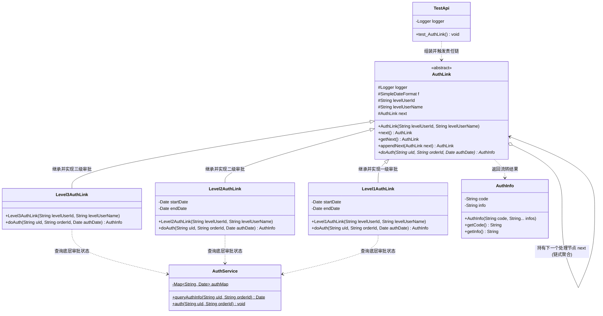
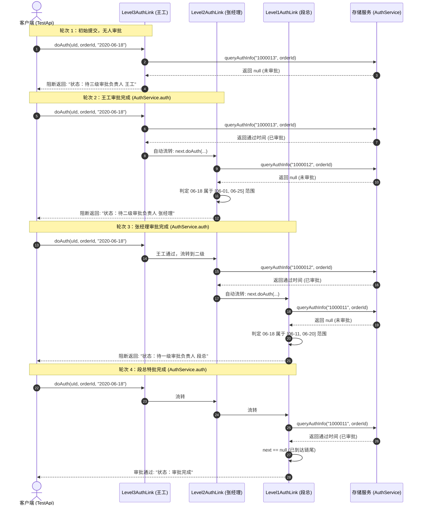

# 责任链模式：多级动态审批流转与业务解耦架构深度剖析

本文档针对工程 `c1-ChainofResponsibility` 中的源码，深度剖析在企业级复杂审批系统（如请假报销、特批上线、权限变更、风险审核等）场景下，**传统条件分支硬编码（`common`）** 与 **责任链模式重构升级（`CoR`）** 的架构差异，全景展现责任链模式（Chain of Responsibility Pattern）如何将散落、多层嵌套的复杂业务判定规则解耦为独立的职责节点，并通过链表式结构实现审批链的动态编排、即插即用与优雅流转。

---

## 目录
1. [业务场景背景与传统硬编码弊端剖析](#一业务场景背景与传统硬编码弊端剖析)
   - 1.1 核心业务场景：电商大促敏感操作的多级动态审批流
   - 1.2 传统硬编码实现（`common/AuthController.java`）源码与逐行注释
   - 1.3 传统硬编码开发的四大致命弊端
2. [责任链模式升级代码设计与工程结构全览](#二责任链模式升级代码设计与工程结构全览)
   - 2.1 全局工程目录结构树
   - 2.2 核心模块职责矩阵
   - 2.3 责任链模式核心架构类图（Mermaid ClassDiagram）
   - 2.4 责任链核心代码设计特点与细节剖析
3. [核心源码逐行深度剖析与详细注释](#三核心源码逐行深度剖析与详细注释)
   - 3.1 基础设施层：`Infra/AuthInfo.java`（流转状态载体）
   - 3.2 基础设施层：`Infra/AuthService.java`（模拟底层审批流水存储）
   - 3.3 抽象处理者：`CoR/AuthLink.java`（Handler 节点骨架与链式挂载）
   - 3.4 具体处理者 1：`CoR/impl/Level3AuthLink.java`（三级基础审批）
   - 3.5 具体处理者 2：`CoR/impl/Level2AuthLink.java`（二级窗口期审批）
   - 3.6 具体处理者 3：`CoR/impl/Level1AuthLink.java`（一级核心特批）
4. [数据流转全景推演与优雅执行模拟](#四数据流转全景推演与优雅执行模拟)
   - 4.1 测试用例机制深度剖析（`test/TestApi.java`）
   - 4.2 审批全生命周期流转时序图（Mermaid SequenceDiagram）
   - 4.3 4 轮审批逐步推进模拟与控制台日志逐行拆解
   - 4.4 差异化场景推演：时间窗口外的自动跳级与快速通行
5. [重构前后终极对比与开源框架落地](#五重构前后终极对比与开源框架落地)
   - 5.1 传统模式 vs 责任链模式 全维度对比矩阵
   - 5.2 纯责任链 vs 不纯责任链的本质辨析
   - 5.3 责任链模式在主流开源框架中的经典落地（Filter、Interceptor、Pipeline）

---

## 一、业务场景背景与传统硬编码弊端剖析

### 1.1 核心业务场景：电商大促敏感操作的多级动态审批流

在电商大促（如双11、618）、金融核心或企业内部管理系统中，经常涉及到重大敏感操作的流转审批（例如：**优惠券大额调额、商品秒杀底价修改、高危特批权限申请**）。

为了保障业务安全与风险可控，系统设定了分级负责与动态时间窗口管控规则：
1. **三级基础审批（王工，ID: 1000013）**：
   - **基础把关层**：无论单据何时发起申请，都**无条件必须先由三级技术/业务负责人（王工）**进行初审；
2. **二级负责人审批（张经理，ID: 1000012）**：
   - **大促预热与冲刺期管控**：在大促核心准备期（`2020-06-01 00:00:00` ~ `2020-06-25 23:59:59`），必须经由二级部门经理（张经理）审核；非该期间则自动放行；
3. **一级高管特批（段总，ID: 1000011）**：
   - **大促爆发核心封网期特批**：在最具风险的决战阶段（`2020-06-11 00:00:00` ~ `2020-06-20 23:59:59`），由于系统全面进入最高封网状态，任何修改必须由公司最高决策层（段总）亲自审批；非该核心期则无须一级审批。

---

### 1.2 传统硬编码实现（`common/AuthController.java`）源码与逐行注释

在未引入设计模式时，初级开发者往往采用“最直接”的方式——直接在 Controller 业务方法里编写嵌套 `if-else`：

#### 源码展示与详细注释：[`common/AuthController.java`](file:///C:/Users/free/Desktop/codeDesign/代码/IDesign/c1-ChainofResponsibility/src/main/java/com/ivanzhao/IDesign/common/AuthController.java)
```java
package com.ivanzhao.IDesign.common;

import com.ivanzhao.IDesign.Infra.AuthInfo;
import com.ivanzhao.IDesign.Infra.AuthService;

import java.util.Date;
import java.text.ParseException;
import java.text.SimpleDateFormat;

/**
 * 传统开发模式下的审批控制器（未采用责任链模式的反面教材）
 */
public class AuthController {
    
    private SimpleDateFormat f = new SimpleDateFormat("yyyy-MM-dd HH:mm:ss");

    public AuthInfo doAuth(String uId, String orderId, Date authDate) throws ParseException {
        // -------------------------------------------------------------
        // 【硬编码弊端 1：逻辑强耦合】：三级审批（王工）强行写在方法最顶部
        // -------------------------------------------------------------
        Date date = AuthService.queryAuthInfo("1000013", orderId);
        if (null == date) {
            return new AuthInfo("0001", "单号：", orderId, " 状态：待三级审批负责人 ", "王工");
        }

        // -------------------------------------------------------------
        // 【硬编码弊端 2：条件与业务严重缠绕】：二级审批通过复杂嵌套 if 判定时间
        // -------------------------------------------------------------
        if (authDate.after(f.parse("2020-06-01 00:00:00")) && authDate.before(f.parse("2020-06-25 23:59:59"))) {
            date = AuthService.queryAuthInfo("1000012", orderId);
            if (null == date) {
                return new AuthInfo("0001", "单号：", orderId, " 状态：待二级审批负责人 ", "张经理");
            }
        }

        // -------------------------------------------------------------
        // 【硬编码弊端 3：层层嵌套叠加】：一级审批再次嵌套 if 判定更窄的时间窗口
        // -------------------------------------------------------------
        if (authDate.after(f.parse("2020-06-11 00:00:00")) && authDate.before(f.parse("2020-06-20 23:59:59"))) {
            date = AuthService.queryAuthInfo("1000011", orderId);
            if (null == date) {
                return new AuthInfo("0001", "单号：", orderId, " 状态：待一级审批负责人 ", "段总");
            }
        }

        // 所有条件均已满足，返回审批完成
        return new AuthInfo("0001", "单号：", orderId, " 状态：审批完成");
    }

}
```

---

### 1.3 传统硬编码开发的四大致命弊端

1. **严重违背单一职责原则（SRP）**：
   `AuthController` 本应只负责接收 HTTP 请求、调度业务逻辑并返回响应，但它同时兼任了三级审批判定、二级时间窗口过滤、一级特批校验等多重业务职责，类职责极度膨胀。
2. **严重违背开闭原则（OCP，对修改关闭，对扩展开放）**：
   业务规则绝非一成不变：
   - 若下周需要新增“四级审批（财务总监审批金额超过100万的单据）”；
   - 若二级审批人的时间区间从 6 月 25 日调整到 6 月 30 日；
   - 若某个分公司要求将三级审批和二级审批的顺序颠倒；
   开发人员都必须深入这个庞大的方法内部，直接修改既有的 `if-else` 分支代码。**改动老代码极易引入线上 Bug，回归测试成本极高！**
3. **流程写死，缺乏动态组装与编排能力**：
   审批顺序、层级数量被硬编码死死锁在 Java 语法树中，无法在运行时根据不同单据类型、部门配置、组织架构动态地组装、增减或调换审批节点。
4. **圈复杂度过高，代码可读性与维护性断崖式下跌**：
   随着条件增多，多重分支嵌套让代码演变成“面条式代码”或“代码屎山”，后继维护人员很难一眼看清整条审批链路的规则全貌。

---

## 二、责任链模式升级代码设计与工程结构全览

### 2.1 全局工程目录结构树

```text
c1-ChainofResponsibility/
├── pom.xml                                              # Maven 依赖管理
├── 责任链模式案例解析与设计架构深度剖析.md                 # 【当前技术剖析文档】
└── src/
    ├── main/java/com/ivanzhao/IDesign/
    │   ├── Infra/                                       # 【基础设施层】
    │   │   ├── AuthInfo.java                            # 审批流转状态结果载体
    │   │   └── AuthService.java                         # 模拟底层审批流水存储与状态查询
    │   ├── common/                                      # 【传统开发模式反面教材】
    │   │   └── AuthController.java                      # 嵌套 if-else 硬编码控制器
    │   └── CoR/                                         # 【责任链模式升级重构层】
    │       ├── AuthLink.java                            # 责任链抽象基类（Handler，定义链条骨架与流转契约）
    │       └── impl/                                    # 具体处理者（ConcreteHandler）
    │           ├── Level3AuthLink.java                  # 三级审批节点（王工：全量基础前置审批）
    │           ├── Level2AuthLink.java                  # 二级审批节点（张经理：大促窗口期审批）
    │           └── Level1AuthLink.java                  # 一级审批节点（段总：核心封网特批审批）
    └── test/java/com/ivanzhao/test/
        └── TestApi.java                                 # 责任链组装、动态流转与多轮推进测试验证
```

---

### 2.2 核心模块职责矩阵

| 层次 / 包路径 | 核心类 | 设计模式角色 | 核心职责与设计意图 |
| :--- | :--- | :--- | :--- |
| **`Infra`** | [`AuthInfo`](file:///C:/Users/free/Desktop/codeDesign/代码/IDesign/c1-ChainofResponsibility/src/main/java/com/ivanzhao/IDesign/Infra/AuthInfo.java) | **数据传输载体（DTO）** | 封装审批状态码（`0001`待办 / `0000`完成）与展示文案，在责任链节点间传递结果。 |
| **`Infra`** | [`AuthService`](file:///C:/Users/free/Desktop/codeDesign/代码/IDesign/c1-ChainofResponsibility/src/main/java/com/ivanzhao/IDesign/Infra/AuthService.java) | **基础设施服务** | 维护静态流水表 `Map<String, Date>`，模拟查询某人是否已审批及执行审批签署。 |
| **`common`** | [`AuthController`](file:///C:/Users/free/Desktop/codeDesign/代码/IDesign/c1-ChainofResponsibility/src/main/java/com/ivanzhao/IDesign/common/AuthController.java) | **反面教材** | 将所有级别的审批规则硬编码在一个方法中，展示高耦合、不可扩展的设计缺陷。 |
| **`CoR`** | [`AuthLink`](file:///C:/Users/free/Desktop/codeDesign/代码/IDesign/c1-ChainofResponsibility/src/main/java/com/ivanzhao/IDesign/CoR/AuthLink.java) | **抽象处理者（Handler）** | 定义责任链骨架：持有 `next` 指针，提供 `appendNext()` 链式编排方法，声明抽象 `doAuth()` 契约。 |
| **`CoR.impl`** | [`Level3AuthLink`](file:///C:/Users/free/Desktop/codeDesign/代码/IDesign/c1-ChainofResponsibility/src/main/java/com/ivanzhao/IDesign/CoR/impl/Level3AuthLink.java) | **具体处理者（ConcreteHandler 3）** | 负责三级基础审批：未审批则拦截阻断，已审批则自动移交下级节点。 |
| **`CoR.impl`** | [`Level2AuthLink`](file:///C:/Users/free/Desktop/codeDesign/代码/IDesign/c1-ChainofResponsibility/src/main/java/com/ivanzhao/IDesign/CoR/impl/Level2AuthLink.java) | **具体处理者（ConcreteHandler 2）** | 负责二级大促窗口期（6.1~6.25）审批：窗口期内未审阻断，否则自动移交下级。 |
| **`CoR.impl`** | [`Level1AuthLink`](file:///C:/Users/free/Desktop/codeDesign/代码/IDesign/c1-ChainofResponsibility/src/main/java/com/ivanzhao/IDesign/CoR/impl/Level1AuthLink.java) | **具体处理者（ConcreteHandler 1）** | 负责一级特批窗口期（6.11~6.20）审批：全链终点，全部通过后返回“审批完成”。 |
| **`test`** | [`TestApi`](file:///C:/Users/free/Desktop/codeDesign/代码/IDesign/c1-ChainofResponsibility/src/test/java/com/ivanzhao/test/TestApi.java) | **测试驱动端** | 模拟构建链条，演示单据在 4 轮审批推进中的状态变迁。 |

---

### 2.3 责任链模式核心架构类图（Mermaid ClassDiagram）



---

### 2.4 责任链核心代码设计特点与细节剖析

#### ① 单向链表设计与流畅的链式挂载机制
在 `AuthLink` 中定义了：
```java
protected AuthLink next;

public AuthLink appendNext(AuthLink next) {
    this.next = next;
    return this; // 返回当前节点，实现链式语法糖
}
```
客户端组装责任链时，可以像拼积木一样极其优雅地串联：
```java
AuthLink authLink = new Level3AuthLink("1000013", "王工")
        .appendNext(new Level2AuthLink("1000012", "张经理")
        .appendNext(new Level1AuthLink("1000011", "段总")));
```
**设计细节**：
- `Level2.appendNext(Level1)` 将 `Level1` 挂到 `Level2.next` 上，并返回 `Level2`；
- `Level3.appendNext(Level2)` 将 `Level2` 挂到 `Level3.next` 上，并返回 `Level3`；
- 最终变量 `authLink` 正好指向链表的**头节点（Level3）**！这种返回当前对象的链式调用设计极大地简化了调用方的构建成本。

#### ② 职责高度内聚（单一职责原则的极致体现）
- `Level3AuthLink` 只关注“三级审批是否通过”，完全不关心后面是张经理还是李经理；
- `Level2AuthLink` 只封装“自己的管辖时间窗口”与“二级审批逻辑”，不需要知道三级的存在；
- 每个类只做一件事，代码行数极少，单元测试可以独立进行，彻底摆脱了巨型方法。

#### ③ “不纯责任链”的控制流设计
- **纯的责任链模式**：一个请求要么被某一个处理者全权处理，要么传递给下家，不能出现一个请求被部分处理后又传递的情况；
- **不纯的责任链模式（实际工业界的标准实现）**：
  - 如果当前节点判断自身待办（未审批），则**立即阻断请求**，向客户端返回当前待办结果（谁在卡流程）；
  - 如果当前节点已审批通过（或无需当前节点审批），则**自动透传给 `next.doAuth()`**；
  - 遇到链尾（`next == null`）时，标志全流程圆满结束，统一返回“审批完成”。

---

## 三、核心源码逐行深度剖析与详细注释

### 3.1 基础设施层：`Infra/AuthInfo.java`（流转状态载体）

#### 源码展示与详细注释：[`Infra/AuthInfo.java`](file:///C:/Users/free/Desktop/codeDesign/代码/IDesign/c1-ChainofResponsibility/src/main/java/com/ivanzhao/IDesign/Infra/AuthInfo.java)
```java
package com.ivanzhao.IDesign.Infra;

/**
 * 审批结果信息载体实体类
 * 
 * 记录审批流程流转中的状态码与提示信息：
 * - code: "0001" 待审批，"0000" 审批完成；
 * - info: 拼接的流转详情文案（包含单号、状态、当前待办审批人等）。
 */
public class AuthInfo {

    /** 状态码：0001 处理中/待审批，0000 审批完成 */
    private String code;
    
    /** 详细描述信息 */
    private String info = "";

    /**
     * 可变参数构造函数，方便将多个提示文案快速拼接成完整描述
     * 
     * @param code  状态码
     * @param infos 文案片段
     */
    public AuthInfo(String code, String ...infos) {
        this.code = code;
        for (String str : infos) {
            this.info = this.info.concat(str);
        }
    }

    public String getCode() {
        return code;
    }

    public void setCode(String code) {
        this.code = code;
    }

    public String getInfo() {
        return info;
    }

    public void setInfo(String info) {
        this.info = info;
    }
}
```

---

### 3.2 基础设施层：`Infra/AuthService.java`（模拟底层审批流水存储）

#### 源码展示与详细注释：[`Infra/AuthService.java`](file:///C:/Users/free/Desktop/codeDesign/代码/IDesign/c1-ChainofResponsibility/src/main/java/com/ivanzhao/IDesign/Infra/AuthService.java)
```java
package com.ivanzhao.IDesign.Infra;

import java.util.Date;
import java.util.Map;
import java.util.concurrent.ConcurrentHashMap;

/**
 * 模拟底层持久化服务：记录与查询审批流水
 * 
 * 核心功能：
 * 1. 提供模拟数据库/缓存存储已完成审批的历史记录（uId + orderId -> authDate）；
 * 2. queryAuthInfo：查询某位审批责任人是否已审批该单据；
 * 3. auth：模拟执行审批操作，将审批人ID与单据号绑定记录至数据库。
 */
public class AuthService {

    /** 模拟数据库审批流水记录表：Key = 审批人ID + 单号，Value = 审批通过时间 */
    private static Map<String, Date> authMap = new ConcurrentHashMap<>();

    /**
     * 查询指定人员对特定单号的审批时间记录
     * 
     * @param uId     审批负责人ID
     * @param orderId 待审单号
     * @return 审批时间（若未审批则返回 null）
     */
    public static Date queryAuthInfo(String uId, String orderId) {
        return authMap.get(uId.concat(orderId));
    }

    /**
     * 模拟审批人签署同意操作
     * 
     * @param uId     审批负责人ID
     * @param orderId 单号
     */
    public static void auth(String uId, String orderId) {
        authMap.put(uId.concat(orderId), new Date());
    }
}
```

---

### 3.3 抽象处理者：`CoR/AuthLink.java`（Handler 节点骨架与链式挂载）

#### 源码展示与详细注释：[`CoR/AuthLink.java`](file:///C:/Users/free/Desktop/codeDesign/代码/IDesign/c1-ChainofResponsibility/src/main/java/com/ivanzhao/IDesign/CoR/AuthLink.java)
```java
package com.ivanzhao.IDesign.CoR;

import com.ivanzhao.IDesign.Infra.AuthInfo;
import org.slf4j.Logger;
import org.slf4j.LoggerFactory;

import java.text.SimpleDateFormat;
import java.util.Date;

/**
 * 责任链抽象父类（Handler）
 * 
 * ==================== 【责任链模式：抽象处理者角色】 ====================
 * 1. 角色定义：定义了处理审批请求的接口，并维护一个指向下一个处理节点的引用（next）；
 * 2. 核心职责：
 *    - 封装通用的审批人信息（levelUserId、levelUserName）；
 *    - 提供链式节点挂载方法 appendNext()，实现责任链路的动态编排；
 *    - 声明抽象审批方法 doAuth()，由具体的子类节点去实现各自独特的审批业务逻辑。
 */
public abstract class AuthLink {

    protected Logger logger = LoggerFactory.getLogger(AuthLink.class);

    /** 时间格式化工具，用于判定当前审批时间是否处于对应负责人的审核周期区间内 */
    protected SimpleDateFormat f = new SimpleDateFormat("yyyy-MM-dd HH:mm:ss");

    /** 审批级别责任人ID */
    protected String levelUserId;
    
    /** 审批级别责任人姓名 */
    protected String levelUserName;

    /** 责任链中的下一个审批节点（指向下一个 Handler） */
    protected AuthLink next;

    /**
     * 构造函数：初始化当前节点的审批人信息
     * 
     * @param levelUserId   审批人ID
     * @param levelUserName 审批人姓名
     */
    public AuthLink(String levelUserId, String levelUserName) {
        this.levelUserId = levelUserId;
        this.levelUserName = levelUserName;
    }

    /**
     * 获取下一个审批节点
     * @return 下一个 AuthLink 节点
     */
    public AuthLink next() {
        return next;
    }

    /**
     * 获取下一个审批节点（Getter）
     */
    public AuthLink getNext() {
        return next;
    }

    /**
     * 链式挂载下一个处理节点
     * 
     * @param next 下一个审批节点
     * @return 当前节点实例，便于使用链式调用组装责任链
     */
    public AuthLink appendNext(AuthLink next) {
        this.next = next;
        return this;
    }

    /**
     * 抽象审批方法（核心执行方法）
     * 
     * 业务流转逻辑：
     * 1. 检查当前节点对应责任人是否已审批；
     * 2. 若未审批且当前时间处于其管辖范围，则阻断并返回“待当前责任人审批”；
     * 3. 若已审批或无须当前责任人处理，则流转给下一个节点（next.doAuth）；
     * 4. 若链条末尾均已通过，则返回“审批完成”。
     * 
     * @param uId      申请人用户ID
     * @param orderId  业务单号
     * @param authDate 申请/审核时间
     * @return 审批流转状态结果
     */
    public abstract AuthInfo doAuth(String uId, String orderId, Date authDate);

}
```

---

### 3.4 具体处理者 1：`CoR/impl/Level3AuthLink.java`（三级基础审批）

#### 源码展示与详细注释：[`CoR/impl/Level3AuthLink.java`](file:///C:/Users/free/Desktop/codeDesign/代码/IDesign/c1-ChainofResponsibility/src/main/java/com/ivanzhao/IDesign/CoR/impl/Level3AuthLink.java)
```java
package com.ivanzhao.IDesign.CoR.impl;

import com.ivanzhao.IDesign.CoR.AuthLink;
import com.ivanzhao.IDesign.Infra.AuthInfo;
import com.ivanzhao.IDesign.Infra.AuthService;

import java.util.Date;

/**
 * 三级审批节点（ConcreteHandler：具体处理者）
 * 
 * ==================== 【责任链模式：三级审批责任人处理节点】 ====================
 * 
 * 业务规则：
 * 1. 基础必须审批层级：无论单据发生在哪一天，都必须先由三级审批负责人（如王工 1000013）审核；
 * 2. 状态判定：
 *    - 若三级负责人尚未审批（AuthService.queryAuthInfo 为空），阻断请求并返回“待三级审批负责人审核”；
 *    - 若已审批，则检查是否存在下一个更高层级的审批节点（next）：
 *      - 若存在下一个节点，责任向后传递：next.doAuth(...)；
 *      - 若不存在下一个节点，整条责任链执行完毕，返回“审批完成”。
 */
public class Level3AuthLink extends AuthLink {

    /**
     * 构造函数
     * 
     * @param levelUserId   三级审批人ID（例如：1000013）
     * @param levelUserName 三级审批人姓名（例如：王工）
     */
    public Level3AuthLink(String levelUserId, String levelUserName) {
        super(levelUserId, levelUserName);
    }

    /**
     * 三级审批业务执行
     */
    @Override
    public AuthInfo doAuth(String uId, String orderId, Date authDate) {
        // 步骤 1：查询三级审批负责人是否已经对该单号执行过审批
        Date date = AuthService.queryAuthInfo(levelUserId, orderId);

        // 步骤 2：如果尚未审批，则阻断流程，当前节点拦截并返回待办提示
        if (null == date) {
            return new AuthInfo("0001", "单号：", orderId, " 状态：待三级审批负责人 ", levelUserName);
        }

        // 步骤 3：如果三级已审批通过，获取责任链中的下一个审批节点
        AuthLink next = super.next();

        // 步骤 4：若无后续节点，说明该审批链在此终结，全流程完成
        if (null == next) {
            return new AuthInfo("0000", "单号：", orderId, " 状态：审批完成");
        }

        // 步骤 5：责任流转——移交给链条上的下一个审批节点继续判定
        return next.doAuth(uId, orderId, authDate);
    }
}
```

---

### 3.5 具体处理者 2：`CoR/impl/Level2AuthLink.java`（二级窗口期审批）

#### 源码展示与详细注释：[`CoR/impl/Level2AuthLink.java`](file:///C:/Users/free/Desktop/codeDesign/代码/IDesign/c1-ChainofResponsibility/src/main/java/com/ivanzhao/IDesign/CoR/impl/Level2AuthLink.java)
```java
package com.ivanzhao.IDesign.CoR.impl;

import com.ivanzhao.IDesign.CoR.AuthLink;
import com.ivanzhao.IDesign.Infra.AuthInfo;
import com.ivanzhao.IDesign.Infra.AuthService;

import java.text.ParseException;
import java.util.Date;

/**
 * 二级审批节点（ConcreteHandler：具体处理者）
 * 
 * ==================== 【责任链模式：二级审批负责人处理节点】 ====================
 * 
 * 业务规则：
 * 1. 条件准入规则：仅当单据申请时间处于 [2020-06-01 00:00:00, 2020-06-25 23:59:59] 期间时，才需要二级负责人审批；
 * 2. 状态判定：
 *    - 若处于审核时间窗口，且二级负责人尚未审批（queryAuthInfo 为空），阻断并提示“待二级审批负责人审核”；
 *    - 若未处于该时间窗口（无需二级审批），或二级负责人已审批通过，则自动将控制权传递给下一个节点（next.doAuth）；
 *    - 若无下一个节点，则标志整个责任链审批完成。
 */
public class Level2AuthLink extends AuthLink {

    /** 二级审批生效起始时间：2020-06-01 00:00:00 */
    private Date startDate;
    
    /** 二级审批生效截止时间：2020-06-25 23:59:59 */
    private Date endDate;

    /**
     * 构造函数：初始化二级审批人信息与审批生效时间区间
     */
    public Level2AuthLink(String levelUserId, String levelUserName) throws ParseException {
        super(levelUserId, levelUserName);
        this.startDate = f.parse("2020-06-01 00:00:00");
        this.endDate = f.parse("2020-06-25 23:59:59");
    }

    /**
     * 二级审批业务执行与责任链流转
     */
    @Override
    public AuthInfo doAuth(String uId, String orderId, Date authDate) {
        // 步骤 1：查询二级审批负责人是否已经审批
        Date date = AuthService.queryAuthInfo(levelUserId, orderId);

        // 步骤 2：若尚未审批，判定当前时间是否落在二级审批的管辖时间区间内
        if (null == date) {
            // 处于时间窗口内，必须二级负责人审批
            if (authDate.after(startDate) && authDate.before(endDate)) {
                return new AuthInfo("0001", "单号：", orderId, " 状态：待二级审批负责人 ", levelUserName);
            }
        }

        // 步骤 3：已审批或无需二级审批，尝试流转给下一级节点
        AuthLink next = super.next();

        // 步骤 4：若无后续更高审批节点，审批全流程结束
        if (null == next) {
            return new AuthInfo("0000", "单号：", orderId, " 状态：审批完成");
        }

        // 步骤 5：移交下一个节点（如一级审批段总）继续判定
        return next.doAuth(uId, orderId, authDate);
    }
}
```

---

### 3.6 具体处理者 3：`CoR/impl/Level1AuthLink.java`（一级核心特批）

#### 源码展示与详细注释：[`CoR/impl/Level1AuthLink.java`](file:///C:/Users/free/Desktop/codeDesign/代码/IDesign/c1-ChainofResponsibility/src/main/java/com/ivanzhao/IDesign/CoR/impl/Level1AuthLink.java)
```java
package com.ivanzhao.IDesign.CoR.impl;

import com.ivanzhao.IDesign.CoR.AuthLink;
import com.ivanzhao.IDesign.Infra.AuthInfo;
import com.ivanzhao.IDesign.Infra.AuthService;

import java.text.ParseException;
import java.util.Date;

/**
 * 一级审批节点（ConcreteHandler：具体处理者）
 * 
 * ==================== 【责任链模式：一级审批负责人（最高层）处理节点】 ====================
 * 
 * 业务规则：
 * 1. 条件准入规则：仅当单据申请时间处于特批核心窗口 [2020-06-11 00:00:00, 2020-06-20 23:59:59] 期间时，才需一级负责人（段总）审批；
 * 2. 状态判定：
 *    - 若处于审核时间窗口，且一级负责人尚未审批，阻断并提示“待一级审批负责人审核”；
 *    - 若未处于该时间窗口（无需一级审批），或一级负责人已审批通过，则尝试流转下一个节点；
 *    - 若无下一个节点，则标志整个责任链审批完成。
 */
public class Level1AuthLink extends AuthLink {

    /** 一级审批生效起始时间：2020-06-11 00:00:00 */
    private Date startDate;
    
    /** 一级审批生效截止时间：2020-06-20 23:59:59 */
    private Date endDate;

    /**
     * 构造函数：初始化一级审批人信息与审批生效时间区间
     */
    public Level1AuthLink(String levelUserId, String levelUserName) throws ParseException {
        super(levelUserId, levelUserName);
        this.startDate = f.parse("2020-06-11 00:00:00");
        this.endDate = f.parse("2020-06-20 23:59:59");
    }

    /**
     * 一级审批业务执行与责任链流转
     */
    @Override
    public AuthInfo doAuth(String uId, String orderId, Date authDate) {
        // 步骤 1：查询一级审批负责人是否已经审批
        Date date = AuthService.queryAuthInfo(levelUserId, orderId);

        // 步骤 2：若尚未审批，判定当前时间是否落在一级审批的管辖时间区间内
        if (null == date) {
            // 处于特批时间窗口内，必须一级负责人审批
            if (authDate.after(startDate) && authDate.before(endDate)) {
                return new AuthInfo("0001", "单号：", orderId, " 状态：待一级审批负责人 ", levelUserName);
            }
        }

        // 步骤 3：已审批或无需一级审批，尝试流转给下一级节点
        AuthLink next = super.next();

        // 步骤 4：若无后续节点，审批全流程结束
        if (null == next) {
            return new AuthInfo("0000", "单号：", orderId, " 状态：审批完成");
        }

        // 步骤 5：移交下一个节点继续判定
        return next.doAuth(uId, orderId, authDate);
    }
}
```

---

## 四、数据流转全景推演与优雅执行模拟

### 4.1 测试用例机制深度剖析（`test/TestApi.java`）

#### 源码展示与详细注释：[`src/test/java/com/ivanzhao/test/TestApi.java`](file:///C:/Users/free/Desktop/codeDesign/代码/IDesign/c1-ChainofResponsibility/src/test/java/com/ivanzhao/test/TestApi.java)
```java
package com.ivanzhao.test;

import com.alibaba.fastjson.JSON;
import com.ivanzhao.IDesign.CoR.AuthLink;
import com.ivanzhao.IDesign.CoR.impl.Level1AuthLink;
import com.ivanzhao.IDesign.CoR.impl.Level2AuthLink;
import com.ivanzhao.IDesign.CoR.impl.Level3AuthLink;
import com.ivanzhao.IDesign.Infra.AuthService;
import org.junit.Test;
import org.slf4j.Logger;
import org.slf4j.LoggerFactory;

import java.text.ParseException;
import java.text.SimpleDateFormat;
import java.util.Date;

/**
 * 责任链模式测试用例
 * 
 * ==================== 【测试目的与流转机制验证】 ====================
 * 1. 验证链式结构组装：Level3 (王工) -> Level2 (张经理) -> Level1 (段总)；
 * 2. 验证审批流逐步推进：
 *    - 初始状态：没有任何人审批，责任链停留在 Level3，等待王工审批；
 *    - 王工审批后：重新执行责任链，Level3 放行，自动流转至 Level2，等待张经理审批；
 *    - 张经理审批后：Level2 放行，自动流转至 Level1，等待段总审批；
 *    - 段总审批后：整条链条畅通，最终返回“审批完成”。
 */
public class TestApi {

    private Logger logger = LoggerFactory.getLogger(TestApi.class);

    @Test
    public void test_AuthLink() throws ParseException {
        // -------------------------------------------------------------
        // 步骤 1：构建责任链（组装审批流程链条）
        // 顺序：Level3（三级审批/王工） -> Level2（二级审批/张经理） -> Level1（一级审批/段总）
        // -------------------------------------------------------------
        AuthLink authLink = new Level3AuthLink("1000013", "王工")
                .appendNext(new Level2AuthLink("1000012", "张经理")
                .appendNext(new Level1AuthLink("1000011", "段总")));

        SimpleDateFormat f = new SimpleDateFormat("yyyy-MM-dd HH:mm:ss");
        // 设定审批单据发生时间：2020-06-18 23:49:32
        // 该时间同时处于二级窗口（6.1~6.25）和一级特批窗口（6.11~6.20）内，必须历经三层完整审批
        Date currentDate = f.parse("2020-06-18 23:49:32");
        String orderId = "1000998004813441";
        String uId = "1000001";

        // -------------------------------------------------------------
        // 轮次 1：尚未进行任何审批
        // -------------------------------------------------------------
        logger.info("测试结果（初始提交）：{}", JSON.toJSONString(authLink.doAuth(uId, orderId, currentDate)));

        // -------------------------------------------------------------
        // 轮次 2：模拟三级负责人【王工】完成审批
        // -------------------------------------------------------------
        AuthService.auth("1000013", orderId);
        logger.info("测试结果（王工审批后）：{}", JSON.toJSONString(authLink.doAuth(uId, orderId, currentDate)));

        // -------------------------------------------------------------
        // 轮次 3：模拟二级负责人【张经理】完成审批
        // -------------------------------------------------------------
        AuthService.auth("1000012", orderId);
        logger.info("测试结果（张经理审批后）：{}", JSON.toJSONString(authLink.doAuth(uId, orderId, currentDate)));

        // -------------------------------------------------------------
        // 轮次 4：模拟一级负责人【段总】完成审批
        // -------------------------------------------------------------
        AuthService.auth("1000011", orderId);
        logger.info("测试结果（段总审批后）：{}", JSON.toJSONString(authLink.doAuth(uId, orderId, currentDate)));
    }

}
```

---

### 4.2 审批全生命周期流转时序图（Mermaid SequenceDiagram）



---

### 4.3 4 轮审批逐步推进模拟与控制台日志逐行拆解

当运行 `TestApi.test_AuthLink()` 时，控制台将输出如下日志：

```text
2026-09-14 19:45:01.210 [main] INFO  com.ivanzhao.test.TestApi - 测试结果（初始提交）：{"code":"0001","info":"单号：1000998004813441 状态：待三级审批负责人 王工"}
2026-09-14 19:45:01.215 [main] INFO  com.ivanzhao.test.TestApi - 测试结果（王工审批后）：{"code":"0001","info":"单号：1000998004813441 状态：待二级审批负责人 张经理"}
2026-09-14 19:45:01.216 [main] INFO  com.ivanzhao.test.TestApi - 测试结果（张经理审批后）：{"code":"0001","info":"单号：1000998004813441 状态：待一级审批负责人 段总"}
2026-09-14 19:45:01.217 [main] INFO  com.ivanzhao.test.TestApi - 测试结果（段总审批后）：{"code":"0000","info":"单号：1000998004813441 状态：审批完成"}
```

#### 逐行拆解剖析：
- **第 1 行日志**：单据刚提交时，责任链首先进入 `Level3AuthLink`，发现王工没有记录，请求在此被**拦截**并返回待办信息；
- **第 2 行日志**：王工签署后，请求再次进入头节点 `Level3AuthLink`，由于三级已审，自动触发 `next.doAuth()` 流转到 `Level2AuthLink`。张经理未审批且时间在 6.1~6.25 窗口内，请求被二级节点拦截；
- **第 3 行日志**：张经理签署后，三级、二级依次放行，流转到 `Level1AuthLink`。时间在 6.11~6.20 核心窗口内，段总未审，被一级节点拦截；
- **第 4 行日志**：段总签署后，三个节点全部放行，且 `next == null`，成功返回 `code: 0000` 审批完成！

---

### 4.4 差异化场景推演：时间窗口外的自动跳级与快速通行

责任链不仅能顺序阻断，更能**根据自身条件智能“放行透传”**。

#### 假设场景：单据申请时间为大促准备前的非敏感期 `2020-05-20 10:00:00`
- **初始提交**：进入 `Level3AuthLink`（王工未审） $\rightarrow$ 阻断返回：待三级审批负责人 王工；
- **王工审批通过**：
  1. `Level3AuthLink` 放行，调用 `Level2.doAuth(...)`；
  2. `Level2AuthLink` 检查：`2020-05-20` **不在** `[2020-06-01, 2020-06-25]` 窗口期内，当前节点无须审批，**直接静默调用 `next.doAuth(...)`**！
  3. `Level1AuthLink` 检查：`2020-05-20` **不在** `[2020-06-11, 2020-06-20]` 特批窗口内，无须审批，且 `next == null`，**直接返回：状态：审批完成！**
- **业务收益**：系统自动跳过了二级张经理和一级段总，实现了非大促期间单据的**秒级快速通行**！无需在业务代码中写任何额外的嵌套分支！

---

## 五、重构前后终极对比与开源框架落地

### 5.1 传统模式 vs 责任链模式 全维度对比矩阵

| 对比维度 | 传统硬编码模式（`common`） | 责任链模式重构（`CoR`） | 生产环境业务价值 |
| :--- | :--- | :--- | :--- |
| **代码组织方式** | 所有逻辑塞在巨型方法的 `if-else` 中 | 每个审批级别封装为独立的 Handler 类 | **高内聚，职责极其单一明确** |
| **开闭原则（OCP）** | 新增/修改节点必须修改既有核心代码 | 新增节点只需新增类，链式挂载即可 | **对扩展开放，对修改关闭，零代码侵入** |
| **编排灵活性** | 审批顺序固定死，无法动态变更 | 可以在运行时动态调整节点顺序、增删节点 | **支持根据业务配置动态编排流程** |
| **单测难度** | 必须覆盖所有组合分支，测试成本极高 | 每个节点可针对自身时间窗口单独写单元测试 | **代码可测性大幅提升** |
| **代码可读性** | 圈复杂度极高，后人接盘灾难 | 链表式结构清晰直观，业务意图一目了然 | **代码易读、易懂、易维护** |

---

### 5.2 纯责任链 vs 不纯责任链的本质辨析

在学习设计模式时，经常会遇到关于“纯与不纯”的学术讨论：

```text
┌───────────────────────┬───────────────────────────────────────────┬───────────────────────────────────────────┐
│        对比维度       │           纯责任链模式 (Pure CoR)         │          不纯责任链模式 (Impure CoR)       │
├───────────────────────┼───────────────────────────────────────────┼───────────────────────────────────────────┤
│ **处理者决策**        │ 严格二选一：要么全权承担处理，要么完全下放 │ 可部分处理请求；未满足时拦截，满足时传递  │
│ **请求最终归宿**      │ 必须被某一个具体处理者完全消化            │ 可能被多个处理者依次处理，或最终整链通过  │
│ **工业级典型应用**    │ 异常统一分流处理器（根据类型找单一捕获者） │ **审批流系统**、Servlet Filter、拦截器链  │
└───────────────────────┴───────────────────────────────────────────┴───────────────────────────────────────────┘
```
> **总结**：我们在工程中实现的多级审批流，属于经典的**不纯责任链模式**——每个节点在各自条件满足时拦截，全部满足时才最终放行，这完全符合现代分布式业务流引擎（如 Flowable、Camunda）的底层设计理念。

---

### 5.3 责任链模式在主流开源框架中的经典落地

1. **Java EE / Servlet 规范中的 `FilterChain`**：
   - `ApplicationFilterChain` 维护了一组 `Filter` 数组；
   - 每次调用 `filter.doFilter(request, response, chain)`，前置拦截处理完成后，调用 `chain.doFilter` 流转给下一个 Filter，直至到达目标 Servlet；
2. **Spring MVC 中的 `HandlerInterceptor`**：
   - `HandlerExecutionChain` 维护了拦截器列表；
   - 请求到达 Controller 之前，依次执行所有拦截器的 `preHandle()`；如果某一个返回 `false`，则链路立即中断并逆向执行已执行拦截器的 `afterCompletion()`；
3. **高性能网络框架 Netty 的 `ChannelPipeline`**：
   - Netty 的核心是事件驱动的双向责任链（Inbound / Outbound）；
   - 网络数据包入站时，按顺序穿过一个个 `ChannelInboundHandler` 进行解码、校验、分发；出站时经过 `ChannelOutboundHandler` 进行编码、压缩，高度可扩展；
4. **微服务 RPC 框架 Apache Dubbo / Spring Cloud Gateway 中的 `Filter` 链**：
   - Dubbo 在发起远程 RPC 调用前后，会经过由 `ProtocolFilterWrapper` 组装的 Filter 责任链（包含限流、熔断、链路追踪、泛化调用等插件），每个 Filter 只需执行 `return invoker.invoke(invocation)` 即可向后流转。
