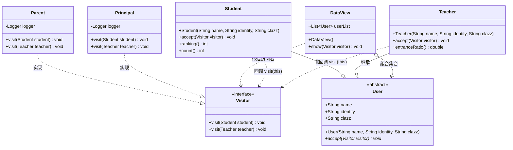
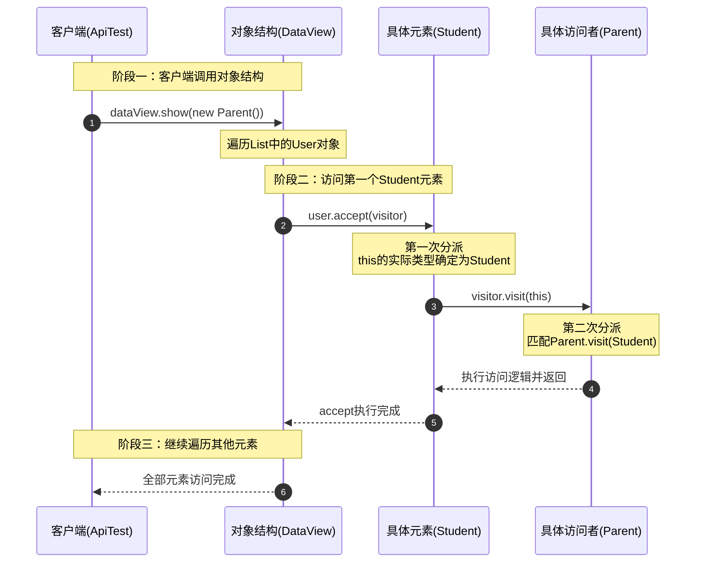

# 访问者模式：学校多角色数据视重视图架构深度剖析

本文针对工程 `c10-VisitorPattern` 中的源码，深度剖析在复杂对象数据结构报表抽取、多维度角色权限视图查看（如学校中家长、校长、教导主任等多角色对师生数据的差异化关注）、编译器抽象语法树（AST）遍历以及复杂模型导出等业务场景下，**访问者模式（Visitor Pattern）** 的设计哲学、架构实现与实战价值。全文从业务场景背景、传统多重 `if-else` + `instanceof` 强转的痛点对比、GoF 经典角色划分与双重分派（Double Dispatch）机制、核心源码逐行剖析与注释、测试用例模拟推演，到工业级实战演进进行全景透视，展现访问者模式如何通过“将数据结构与作用于结构之上的操作解耦”，实现操作集合在不修改已有元素类的前提下灵活平滑扩展。

---

## 目录
1. [业务场景与访问者模式的核心应用](#一业务场景与访问者模式的核心应用)
   - 1.1 业务背景：校园综合数据看板与多角色差异重视角
   - 1.2 访问者模式在案例中的具体应用位置与落地方式
   - 1.3 传统流水账编码（`instanceof` 堆砌）的五大架构缺陷
   - 1.4 访问者模式编写的特点与核心机制（双重分派 Double Dispatch）
2. [工程全局架构与设计思想把握](#二工程全局架构与设计思想把握)
   - 2.1 全局工程目录结构树
   - 2.2 GoF 经典访问者模式角色映射
   - 2.3 核心架构 UML 类图
   - 2.4 双重分派调用时序图与底层机制深度解密
   - 2.5 核心设计原则（SOLID）与适用边界权衡
3. [核心源码逐行剖析与详细注释](#三核心源码逐行剖析与详细注释)
   - 3.1 抽象元素角色：`User.java`
   - 3.2 具体元素角色一：学生实体 `Student.java`
   - 3.3 具体元素角色二：教师实体 `Teacher.java`
   - 3.4 抽象访问者角色：`Visitor.java`
   - 3.5 具体访问者一：家长视角 `Parent.java`
   - 3.6 具体访问者二：校长视角 `Principal.java`
   - 3.7 结构对象容器角色：`DataView.java`
   - 3.8 客户端测试套件：`ApiTest.java`
4. [测试用例模拟与执行全景推演](#四测试用例模拟与执行全景推演)
   - 4.1 测试数据源装配与对象池概览
   - 4.2 场景一：家长（Parent）视角全流程访问推演
   - 4.3 场景二：校长（Principal）视角全流程访问推演
   - 4.4 场景对比与数据提取差异矩阵
   - 4.5 控制台全量运行日志模拟与分析
5. [工业级进阶扩展与实战演进思考](#五工业级进阶扩展与实战演进思考)
   - 5.1 零侵入扩展新访问者：教导主任视角（`DeanVisitor`）
   - 5.2 访问者模式的阿喀琉斯之踵：元素结构变更困难与应对策略
   - 5.3 工业级开源生态中的经典应用（ASM 字节码、APT 注解处理器、JavaParser AST）

---

## 一、业务场景与访问者模式的核心应用

### 1.1 业务背景：校园综合数据看板与多角色差异重视角

在智慧校园信息管理系统与教务数据大屏中，系统维护着学校的核心数据对象集合——**教师（Teacher）** 与 **学生（Student）**。
不同的外部访客、管理角色出于不同的业务目标，对于相同的师生集合所关注的信息维度存在极大差异：

```text
                           ┌──────────────────────────────────────────────┐
                           │            学校师生数据集合 (DataView)        │
                           │  - 包含各类学生 (重点班/普通班, 成绩, 排名)  │
                           │  - 包含各类教师 (特级/普通/实习, 升学率, 职称)│
                           └──────────────────────┬───────────────────────┘
                                                  │
                      ┌───────────────────────────┴───────────────────────────┐
                      ▼                                                       ▼
        ┌───────────────────────────┐                           ┌───────────────────────────┐
        │       家长视角 (Parent)    │                           │     校长视角 (Principal)   │
        ├───────────────────────────┤                           ├───────────────────────────┤
        │ 关注学生：排名、班级、姓名  │                           │ 关注学生：班级总人数、分布   │
        │ 关注教师：教师职称、级别    │                           │ 关注教师：升学率/考核KPI    │
        └───────────────────────────┘                           └───────────────────────────┘
```

- **家长（Parent）视角**：
  - 看学生：关注微观个体，看重孩子的**姓名、所在班级、综合排名（`ranking`）**；
  - 看老师：关注师资力量，看重任课老师的**姓名、班级、职称级别（`identity`：特级/普通）**。
- **校长（Principal）视角**：
  - 看学生：关注宏观规模与资源配比，看重每个班级的**在读总人数（`count`）**；
  - 看老师：关注教学成果与升学指标，看重老师的**姓名、班级、高考/中考升本率（`entranceRatio`）**。
- **未来潜在角色**：
  - 年级主任（关注班级平均分、纪律）、教育局督导（关注办学合规性、师生比）等。

---

### 1.2 访问者模式在案例中的具体应用位置与落地方式

本案例精准运用**访问者模式（Visitor Pattern）**，将“**学生、教师的数据结构定义**”与“**家长、校长对数据的不同提取逻辑**”彻底解耦。

落地方式如下：
1. **元素定义稳定化**：定义了抽象元素基类 `User` 及其派生类 `Student` 与 `Teacher`。它们仅提供自身基础属性及专属业务方法（如学生的 `ranking()`、`count()`，老师的 `entranceRatio()`），并开放统一的接待方法 `public abstract void accept(Visitor visitor)`。
2. **操作行为外置化**：将所有“查看、展示、分析数据”的动作全部从师生实体类中剥离，抽象为 `Visitor` 接口。
3. **多角色视重视图派生**：
   - 创建家长访问者实现类 `Parent`，在 `visit(Student)` 和 `visit(Teacher)` 中实现家长关心的信息输出；
   - 创建校长访问者实现类 `Principal`，在 `visit(Student)` 和 `visit(Teacher)` 中实现校长关心的宏观数据提取。
4. **对象结构迭代支撑**：通过 `DataView` 容器统一维护师生列表，提供 `show(Visitor visitor)` 迭代器，负责循环驱动师生元素接收外部访问者。

---

### 1.3 传统流水账编码（`instanceof` 堆砌）的五大架构缺陷

如果采用普通初级代码编写，常见的做法是在业务服务层通过 `if-else` 与 `instanceof` 进行类型检查与强制向下转型：

```java
// 传统反例写法：在数据展示层堆砌多重 if-else 与类型强转
public void showReport(String visitorType, List<User> userList) {
    for (User user : userList) {
        if ("PARENT".equals(visitorType)) {
            if (user instanceof Student) {
                Student s = (Student) user;
                System.out.println("学生: " + s.name + " 排名: " + s.ranking());
            } else if (user instanceof Teacher) {
                Teacher t = (Teacher) user;
                System.out.println("老师: " + t.name + " 级别: " + t.identity);
            }
        } else if ("PRINCIPAL".equals(visitorType)) {
            if (user instanceof Student) {
                Student s = (Student) user;
                System.out.println("班级人数: " + s.count());
            } else if (user instanceof Teacher) {
                Teacher t = (Teacher) user;
                System.out.println("老师: " + t.name + " 升学率: " + t.entranceRatio());
            }
        }
    }
}
```

这种传统写法存在五大严重架构弊端：
1. **严重违反开闭原则（OCP）**：每当学校引入一个新角色（如“教导主任”、“班主任”、“教育局局长”），都必须在这个方法中新增一层 `else if` 分支，修改原有核心逻辑，容易引入回归 Bug。
2. **丑陋的 `instanceof` 类型嗅探与强制转型**：代码充斥着显式类型判断与 `(Student)` / `(Teacher)` 强转，破坏了面向对象多态性，执行效率低且极易引发 `ClassCastException`。
3. **领域实体职责污染（违反单一职责原则 SRP）**：如果把这些提取逻辑写到 `Student` 与 `Teacher` 内部（如 `student.printParentView()`、`student.printPrincipalView()`），实体类将承担与数据呈现高度耦合的杂质逻辑，随业务演进而无限膨胀。
4. **代码难以维护与测试**：所有角色、所有元素的操作混合在同一个庞大方法中，逻辑交织，单元测试无法针对特定角色单独做覆盖。
5. **视图操作无法独立复用**：若其它报表模块也需要家长的视图逻辑，只能复制代码或调用庞大的多分支方法。

---

### 1.4 访问者模式编写的特点与核心机制（双重分派 Double Dispatch）

Java 语言原生仅支持**单分派（Single Dispatch）**，即在运行时调用重载方法时，JVM 仅能根据方法的接收者（调用对象）的运行时类型进行动态多态绑定，而方法参数的类型在编译期就已经静态绑定了。

访问者模式通过巧妙的**两次方法调用组合**，实现了**双重分派（Double Dispatch）**，在无需任何 `instanceof` 的情况下完成运行时的精确方法路由：

```text
第一次分派 (动态绑定元素类型):
   user.accept(visitor) 
   ──> JVM 运行时根据 user 的具体对象 (Student 或 Teacher) 
       动态派发到对应子类的 accept 方法中。

第二次分派 (动态绑定访问者类型 + 静态绑定自身真实类型):
   在 Student.accept 中执行: visitor.visit(this);
   ──> 1. 此时 this 关键字在 Student 编译上下文中已被静态确认为 Student 类型，
          编译器精准锁定重载契约: visit(Student) 而非 visit(Teacher)；
       2. 运行时 JVM 再次根据 visitor 的真实运行类型 (Parent 或 Principal)，
          动态派发到对应访问者的具体实现方法。
```

| 评估维度 | 传统 `instanceof` 编写 | 访问者模式编写 (`Visitor` 体系) |
| :--- | :--- | :--- |
| **类型判定手段** | 显式 `instanceof` 运行时嗅探与类型强转 | 利用双重分派（Double Dispatch）多态自动路由 |
| **开闭原则（操作维度）** | 增减新角色需在核心业务代码层层追加分支 | **极佳**：新增角色只需新建 `Visitor` 实现类，原有代码零修改 |
| **数据结构与行为** | 数据结构与业务报表提取逻辑紧密交织 | **彻底解耦**：数据结构保持纯粹，操作行为独立为访问者 |
| **单一职责（SRP）** | 一个方法包揽所有角色、所有实体的信息获取 | 每个 Visitor 类仅封装特定角色对数据的关注点 |
| **代码可读性与优雅度** | 嵌套深、缩进多，后期沦为“代码泥潭” | 结构规整，多态派发，完全消除 `if-else` |

---

## 二、工程全局架构与设计思想把握

### 2.1 全局工程目录结构树

```text
c10-VisitorPattern
│  pom.xml                                       # Maven 配置文件（引入 fastjson, slf4j, logback, junit）
└─ src
   ├─ main
   │  ├─ java
   │  │  └─ com
   │  │     └─ ivanzhao
   │  │        └─ Idesign
   │  │           ├─ DataView.java               # 【对象结构 ObjectStructure】持有一组 User 元素的容器
   │  │           ├─ user                        # 【元素体系 Element】
   │  │           │     User.java                # 抽象元素基类（定义 accept 契约）
   │  │           │     └─ impl
   │  │           │           Student.java       # 具体元素：学生实体
   │  │           │           Teacher.java       # 具体元素：教师实体
   │  │           └─ visitor                     # 【访问者体系 Visitor】
   │  │                 Visitor.java             # 抽象访问者接口（重载 visit(Student) 与 visit(Teacher)）
   │  │                 └─ impl
   │  │                       Parent.java        # 具体访问者：家长视角
   │  │                       Principal.java     # 具体访问者：校长视角
   │  └─ resources
   └─ test
      └─ java
         └─ test
               ApiTest.java                      # 客户端测试类（模拟家长、校长两类视角的查看）
```

---

### 2.2 GoF 经典访问者模式角色映射

在经典 GoF 设计模式中，访问者模式包含五大核心角色，工程映射关系如下：

```text
               ┌──────────────────────────────────────────────┐
               │           <<interface>> Visitor              │
               │               (抽象访问者)                   │
               ├──────────────────────────────────────────────┤
               │ + visit(student: Student): void              │
               │ + visit(teacher: Teacher): void              │
               └──────────────────────▲───────────────────────┘
                                      │
                   ┌──────────────────┴──────────────────┐
                   │ 实现                                │ 实现
        ┌──────────┴───────────┐              ┌──────────┴───────────┐
        │        Parent        │              │       Principal      │
        │     (具体访问者)     │              │     (具体访问者)     │
        └──────────────────────┘              └──────────────────────┘
                   :                                     :
                   : 访问操作 (visit)                     : 访问操作 (visit)
                   ▼                                     ▼
        ┌─────────────────────────────────────────────────────────────┐
        │                     User (抽象元素基类)                      │
        ├─────────────────────────────────────────────────────────────┤
        │ + accept(visitor: Visitor): void                            │
        └─────────────────────────────▲───────────────────────────────┘
                                      │
                   ┌──────────────────┴──────────────────┐
                   │ 继承                                │ 继承
        ┌──────────┴───────────┐              ┌──────────┴───────────┐
        │       Student        │              │       Teacher        │
        │      (具体元素)      │              │      (具体元素)      │
        ├──────────────────────┤              ├──────────────────────┤
        │ + accept(v) ──>      │              │ + accept(v) ──>      │
        │   v.visit(this)      │              │   v.visit(this)      │
        └──────────────────────┘              └──────────────────────┘
                   ▲                                     ▲
                   │ 包含 (List<User>)                   │ 包含 (List<User>)
                   └──────────────────┬──────────────────┘
                                      │
                       ┌──────────────┴──────────────┐
                       │          DataView           │
                       │     (对象结构 ObjectStructure)│
                       ├─────────────────────────────┤
                       │ + show(visitor: Visitor)    │
                       └─────────────────────────────┘
```

1. **抽象访问者（Visitor）—— [`Visitor.java`](file:///C:/Users/free/Desktop/codeDesign/代码/IDesign/c10-VisitorPattern/src/main/java/com/ivanzhao/Idesign/visitor/Visitor.java)**：
   - 声明一组重载的 `visit` 方法，每个方法对应结构中的一种具体元素类型（`visit(Student)` 与 `visit(Teacher)`）。
2. **具体访问者（ConcreteVisitor）—— [`Parent.java`](file:///C:/Users/free/Desktop/codeDesign/代码/IDesign/c10-VisitorPattern/src/main/java/com/ivanzhao/Idesign/visitor/impl/Parent.java)、[`Principal.java`](file:///C:/Users/free/Desktop/codeDesign/代码/IDesign/c10-VisitorPattern/src/main/java/com/ivanzhao/Idesign/visitor/impl/Principal.java)**：
   - 实现抽象访问者声明的全部接口，提供对应角色的专属数据抽取与展示行为。
3. **抽象元素（Element）—— [`User.java`](file:///C:/Users/free/Desktop/codeDesign/代码/IDesign/c10-VisitorPattern/src/main/java/com/ivanzhao/Idesign/user/User.java)**：
   - 声明接收访问者的核心方法 `public abstract void accept(Visitor visitor)`。
4. **具体元素（ConcreteElement）—— [`Student.java`](file:///C:/Users/free/Desktop/codeDesign/代码/IDesign/c10-VisitorPattern/src/main/java/com/ivanzhao/Idesign/user/impl/Student.java)、[`Teacher.java`](file:///C:/Users/free/Desktop/codeDesign/代码/IDesign/c10-VisitorPattern/src/main/java/com/ivanzhao/Idesign/user/impl/Teacher.java)**：
   - 实现 `accept` 方法，通过 `visitor.visit(this)` 完成对访问者的反向回调。
5. **对象结构（ObjectStructure）—— [`DataView.java`](file:///C:/Users/free/Desktop/codeDesign/代码/IDesign/c10-VisitorPattern/src/main/java/com/ivanzhao/Idesign/DataView.java)**：
   - 内部维护一个 `List<User>` 集合，提供高层遍历接口 `show(Visitor visitor)`，驱动所有元素依次 `accept` 访问者。

---

### 2.3 核心架构 UML 类图



---

### 2.4 双重分派调用时序图与底层机制深度解密

以客户端执行 `dataView.show(new Parent())` 为例，下图展现运行时的两次多态派发全过程：



---

### 2.5 核心设计原则（SOLID）与适用边界权衡

1. **单一职责原则（SRP）**：
   - `Student` / `Teacher` 仅维护自己的属性和业务指标（如分数、升本率）；
   - `Parent` 仅维护家长的查看规则，`Principal` 仅维护校长的查看规则，各司其职。
2. **开闭原则（OCP）在不同维度的不对称性（核心特征）**：
   - **增加新的访问操作（极为容易，完美契合 OCP）**：如新增“督学（Inspector）”，只需新增一个 `Inspector implements Visitor` 类，任何现有代码都无需修改。
   - **增加新的数据元素（代价极高，不满足 OCP）**：如果学校新增“保洁人员（Cleaner）”或“保安（Security）”，必须修改 `User` 并重写所有子类，更致命的是，**必须修改 `Visitor` 接口添加 `visit(Cleaner)`，导致所有已有访问者（`Parent`、`Principal`）全部产生编译错误必须重构**。
   - **适用边界结论**：访问者模式**仅适用于“数据元素结构高度稳定，而作用于元素上的操作极其多变且频繁扩展”**的系统。

---

## 三、核心源码逐行剖析与详细注释

### 3.1 抽象元素角色：`User.java`

> 源码文件路径：[`c10-VisitorPattern/src/main/java/com/ivanzhao/Idesign/user/User.java`](file:///C:/Users/free/Desktop/codeDesign/代码/IDesign/c10-VisitorPattern/src/main/java/com/ivanzhao/Idesign/user/User.java)

```java
package com.ivanzhao.Idesign.user;

import com.ivanzhao.Idesign.visitor.Visitor;

/**
 * 抽象元素角色（Element）
 * 定义学校所有人员公共的基础身份属性，并约定接收访问者的核心入口
 */
public abstract class User {

    public String name;      // 姓名（如：谢飞机、BK老师）
    public String identity;  // 身份分类；学生为：重点班、普通班 | 老师为：特级教师、普通教师、实习教师
    public String clazz;     // 所属班级（如：一年一班、二年三班）

    /**
     * 基础构造函数：初始化公共成员属性
     *
     * @param name     姓名
     * @param identity 身份等级
     * @param clazz    班级
     */
    public User(String name, String identity, String clazz) {
        this.name = name;
        this.identity = identity;
        this.clazz = clazz;
    }

    /**
     * 【核心访问契约方法（第一次分派入口）】
     * 接收访问者对象的访问，子类必须实现该方法，并在内部将自身引用 (this) 回传给访问者
     *
     * @param visitor 抽象访问者引用
     */
    public abstract void accept(Visitor visitor);

}
```

---

### 3.2 具体元素角色一：学生实体 `Student.java`

> 源码文件路径：[`c10-VisitorPattern/src/main/java/com/ivanzhao/Idesign/user/impl/Student.java`](file:///C:/Users/free/Desktop/codeDesign/代码/IDesign/c10-VisitorPattern/src/main/java/com/ivanzhao/Idesign/user/impl/Student.java)

```java
package com.ivanzhao.Idesign.user.impl;

import com.ivanzhao.Idesign.user.User;
import com.ivanzhao.Idesign.visitor.Visitor;

import java.util.Random;

/**
 * 具体元素角色（ConcreteElement）：学生实体
 */
public class Student extends User {

    public Student(String name, String identity, String clazz) {
        super(name, identity, clazz);
    }

    /**
     * 【第二次分派核心实现】：
     * 当 JVM 在运行时动态调用到 Student 的 accept 方法时，
     * 传入的 this 引用在编译期即被静态绑定为 Student 类型。
     * 因此在此处调用 visitor.visit(this) 会精准匹配到 Visitor 接口中的 visit(Student student) 重载方法！
     */
    public void accept(Visitor visitor) {
        visitor.visit(this); // 回调访问者针对学生的专属处理逻辑
    }

    /**
     * 学生业务方法：获取学生考试综合排名
     * （家长视角高度关心该数据）
     *
     * @return 模拟随机生成的班级排名 (0 - 99)
     */
    public int ranking() {
        return (int) (Math.random() * 100);
    }

    /**
     * 学生业务方法：获取当前学生所在班级总在读人数
     * （校长视角高度关心该宏观规模数据）
     *
     * @return 模拟随机计算的人数
     */
    public int count() {
        return 105 - new Random().nextInt(10);
    }

}
```

---

### 3.3 具体元素角色二：教师实体 `Teacher.java`

> 源码文件路径：[`c10-VisitorPattern/src/main/java/com/ivanzhao/Idesign/user/impl/Teacher.java`](file:///C:/Users/free/Desktop/codeDesign/代码/IDesign/c10-VisitorPattern/src/main/java/com/ivanzhao/Idesign/user/impl/Teacher.java)

```java
package com.ivanzhao.Idesign.user.impl;

import com.ivanzhao.Idesign.user.User;
import com.ivanzhao.Idesign.visitor.Visitor;

import java.math.BigDecimal;

/**
 * 具体元素角色（ConcreteElement）：教师实体
 */
public class Teacher extends User {

    public Teacher(String name, String identity, String clazz) {
        super(name, identity, clazz);
    }

    /**
     * 【第二次分派核心实现】：
     * 此处的 this 在编译期被静态绑定为 Teacher 类型，
     * 执行 visitor.visit(this) 将精准调用 Visitor.visit(Teacher teacher) 重载方法！
     */
    public void accept(Visitor visitor) {
        visitor.visit(this); // 回调访问者针对教师的专属处理逻辑
    }

    /**
     * 教师业务方法：所带班级的升学率 / 升本率
     * （校长视角重点关注此项教学绩效考核指标）
     *
     * @return 模拟升学率（保留两位小数）
     */
    public double entranceRatio() {
        return BigDecimal.valueOf(Math.random() * 100)
                .setScale(2, BigDecimal.ROUND_HALF_UP)
                .doubleValue();
    }

}
```

---

### 3.4 抽象访问者角色：`Visitor.java`

> 源码文件路径：[`c10-VisitorPattern/src/main/java/com/ivanzhao/Idesign/visitor/Visitor.java`](file:///C:/Users/free/Desktop/codeDesign/代码/IDesign/c10-VisitorPattern/src/main/java/com/ivanzhao/Idesign/visitor/Visitor.java)

```java
package com.ivanzhao.Idesign.visitor;

import com.ivanzhao.Idesign.user.impl.Student;
import com.ivanzhao.Idesign.user.impl.Teacher;

/**
 * 抽象访问者角色（Visitor）
 * 为对象结构中的每一个 ConcreteElement（具体元素）声明一个 visit 操作方法
 */
public interface Visitor {

    /**
     * 访问具体元素【学生】信息的行为契约
     *
     * @param student 具体学生实体
     */
    void visit(Student student);

    /**
     * 访问具体元素【老师】信息的行为契约
     *
     * @param teacher 具体老师实体
     */
    void visit(Teacher teacher);

}
```

---

### 3.5 具体访问者一：家长视角 `Parent.java`

> 源码文件路径：[`c10-VisitorPattern/src/main/java/com/ivanzhao/Idesign/visitor/impl/Parent.java`](file:///C:/Users/free/Desktop/codeDesign/代码/IDesign/c10-VisitorPattern/src/main/java/com/ivanzhao/Idesign/visitor/impl/Parent.java)

```java
package com.ivanzhao.Idesign.visitor.impl;

import com.ivanzhao.Idesign.user.impl.Student;
import com.ivanzhao.Idesign.user.impl.Teacher;
import com.ivanzhao.Idesign.visitor.Visitor;
import org.slf4j.Logger;
import org.slf4j.LoggerFactory;

/**
 * @author 赵一帆(Ivan Zhao)
 * @version 1.0
 * 具体访问者角色（ConcreteVisitor）：家长视角
 * 特点：只关心孩子个体的姓名、班级、具体排名；关心任课老师的级别职称
 */
public class Parent implements Visitor {

    private Logger logger = LoggerFactory.getLogger(Parent.class);

    /**
     * 家长查看学生：输出学生姓名、班级、以及直接关系到升学的班级排名 ranking()
     */
    @Override
    public void visit(Student student) {
        logger.info("学生信息 姓名：{} 班级：{} 排名：{}", 
                    student.name, student.clazz, student.ranking());
    }

    /**
     * 家长查看老师：输出老师姓名、班级、以及老师的级别职称 identity（如特级教师）
     */
    @Override
    public void visit(Teacher teacher) {
        logger.info("老师信息 姓名：{} 班级：{} 级别：{}", 
                    teacher.name, teacher.clazz, teacher.identity);
    }
}
```

---

### 3.6 具体访问者二：校长视角 `Principal.java`

> 源码文件路径：[`c10-VisitorPattern/src/main/java/com/ivanzhao/Idesign/visitor/impl/Principal.java`](file:///C:/Users/free/Desktop/codeDesign/代码/IDesign/c10-VisitorPattern/src/main/java/com/ivanzhao/Idesign/visitor/impl/Principal.java)

```java
package com.ivanzhao.Idesign.visitor.impl;

import com.ivanzhao.Idesign.user.impl.Student;
import com.ivanzhao.Idesign.user.impl.Teacher;
import com.ivanzhao.Idesign.visitor.Visitor;
import org.slf4j.Logger;
import org.slf4j.LoggerFactory;

/**
 * @author 赵一帆(Ivan Zhao)
 * @version 1.0
 * 具体访问者角色（ConcreteVisitor）：校长视角
 * 特点：不关注单个学生具体排名，关注全校各班级规模人数 count()；关注老师的升学率 entranceRatio() KPI
 */
public class Principal implements Visitor {

    private Logger logger = LoggerFactory.getLogger(Principal.class);

    /**
     * 校长查看学生：关注宏观维度，输出班级名与当前班级总在册人数 count()
     */
    @Override
    public void visit(Student student) {
        logger.info("学生信息 班级：{} 人数：{}", 
                    student.clazz, student.count());
    }

    /**
     * 校长查看老师：关注教学绩效，输出老师姓名、班级、以及教学升学率 entranceRatio()
     */
    @Override
    public void visit(Teacher teacher) {
        // 注：源码日志输出占位提示为 "学生信息"，实际业务含义为考查老师所带班级的升学率成果
        logger.info("老师信息 姓名：{} 班级：{} 升学率：{}", 
                    teacher.name, teacher.clazz, teacher.entranceRatio());
    }
}
```

---

### 3.7 结构对象容器角色：`DataView.java`

> 源码文件路径：[`c10-VisitorPattern/src/main/java/com/ivanzhao/Idesign/DataView.java`](file:///C:/Users/free/Desktop/codeDesign/代码/IDesign/c10-VisitorPattern/src/main/java/com/ivanzhao/Idesign/DataView.java)

```java
package com.ivanzhao.Idesign;

import com.ivanzhao.Idesign.user.User;
import com.ivanzhao.Idesign.user.impl.Student;
import com.ivanzhao.Idesign.user.impl.Teacher;
import com.ivanzhao.Idesign.visitor.Visitor;

import java.util.ArrayList;
import java.util.List;

/**
 * @author 赵一帆(Ivan Zhao)
 * @version 1.0
 * 对象结构角色（ObjectStructure）：聚合维护复杂元素集合，驱动访问者循环访问
 */
public class DataView {

    // 维护异构元素对象集合（同时包含 Student 和 Teacher）
    List<User> userList = new ArrayList<User>();

    /**
     * 构造函数：初始化学校的基础测试数据池（包含 4 位学生与 4 位老师）
     */
    public DataView() {
        userList.add(new Student("谢飞机", "重点班", "一年一班"));
        userList.add(new Student("windy", "重点班", "一年一班"));
        userList.add(new Student("大毛", "普通班", "二年三班"));
        userList.add(new Student("Shing", "普通班", "三年四班"));
        userList.add(new Teacher("BK", "特级教师", "一年一班"));
        userList.add(new Teacher("娜娜Goddess", "特级教师", "一年一班"));
        userList.add(new Teacher("dangdang", "普通教师", "二年三班"));
        userList.add(new Teacher("泽东", "实习教师", "三年四班"));
    }

    /**
     * 核心展示方法：迭代对象集合中的每一个元素，调用元素的 accept 方法
     *
     * @param visitor 外部注入的具体访问者（如 Parent 或 Principal）
     */
    public void show(Visitor visitor) {
        for (User user : userList) {
            // 第一次分派触发点：运行时依据具体对象是 Student 还是 Teacher，动态调用其对应 accept 实现
            user.accept(visitor);
        }
    }

}
```

---

### 3.8 客户端测试套件：`ApiTest.java`

> 源码文件路径：[`c10-VisitorPattern/src/test/java/test/ApiTest.java`](file:///C:/Users/free/Desktop/codeDesign/代码/IDesign/c10-VisitorPattern/src/test/java/test/ApiTest.java)

```java
package test;

import com.ivanzhao.Idesign.DataView;
import com.ivanzhao.Idesign.visitor.impl.Parent;
import com.ivanzhao.Idesign.visitor.impl.Principal;
import org.junit.Test;
import org.slf4j.Logger;
import org.slf4j.LoggerFactory;

/**
 * 客户端测试类：演示不同视角（家长 vs 校长）对同一批师生数据的访问效果
 */
public class ApiTest {

    private Logger logger = LoggerFactory.getLogger(ApiTest.class);

    @Test
    public void test_show(){
        // 1. 初始化包含 8 名师生的对象数据结构
        DataView dataView = new DataView();

        // 2. 注入“家长视角”访问者
        logger.info("\r\n家长视角访问：");
        dataView.show(new Parent());

        // 3. 注入“校长视角”访问者
        logger.info("\r\n校长视角访问：");
        dataView.show(new Principal());
    }

}
```

---

## 四、测试用例模拟与执行全景推演

### 4.1 测试数据源装配与对象池概览

在 `DataView` 中共构造了 8 个测试对象：
- **4 位学生（Student）**：
  1. `谢飞机`（重点班，一年一班）
  2. `windy`（重点班，一年一班）
  3. `大毛`（普通班，二年三班）
  4. `Shing`（普通班，三年四班）
- **4 位教师（Teacher）**：
  1. `BK`（特级教师，一年一班）
  2. `娜娜Goddess`（特级教师，一年一班）
  3. `dangdang`（普通教师，二年三班）
  4. `泽东`（实习教师，三年四班）

---

### 4.2 场景一：家长（Parent）视角全流程访问推演

* **调用入口**：`dataView.show(new Parent());`
* **执行轨迹与数据提取过程**：
  1. 遍历到 `Student("谢飞机")` $\rightarrow$ `student.accept(Parent)` $\rightarrow$ `Parent.visit(student)` $\rightarrow$ 调用 `student.ranking()`（模拟产生排名如 18），输出：`学生信息 姓名：谢飞机 班级：一年一班 排名：18`
  2. 遍历到 `Student("windy")` $\rightarrow$ 输出：`学生信息 姓名：windy 班级：一年一班 排名：45`
  3. 遍历到 `Student("大毛")` $\rightarrow$ 输出：`学生信息 姓名：大毛 班级：二年三班 排名：8`
  4. 遍历到 `Student("Shing")` $\rightarrow$ 输出：`学生信息 姓名：Shing 班级：三年四班 排名：62`
  5. 遍历到 `Teacher("BK")` $\rightarrow$ `teacher.accept(Parent)` $\rightarrow$ `Parent.visit(teacher)` $\rightarrow$ 提取 `identity`，输出：`老师信息 姓名：BK 班级：一年一班 级别：特级教师`
  6. 遍历到 `Teacher("娜娜Goddess")` $\rightarrow$ 输出：`老师信息 姓名：娜娜Goddess 班级：一年一班 级别：特级教师`
  7. 遍历到 `Teacher("dangdang")` $\rightarrow$ 输出：`老师信息 姓名：dangdang 班级：二年三班 级别：普通教师`
  8. 遍历到 `Teacher("泽东")` $\rightarrow$ 输出：`老师信息 姓名：泽东 班级：三年四班 级别：实习教师`

---

### 4.3 场景二：校长（Principal）视角全流程访问推演

* **调用入口**：`dataView.show(new Principal());`
* **执行轨迹与数据提取过程**：
  1. 遍历到 `Student("谢飞机")` $\rightarrow$ `student.accept(Principal)` $\rightarrow$ `Principal.visit(student)` $\rightarrow$ 调用 `student.count()`（模拟产生在册人数 98），输出：`学生信息 班级：一年一班 人数：98`（*注：校长不关注单个学生是谁，仅看班级人数*）
  2. 遍历到 `Student("windy")` $\rightarrow$ 输出：`学生信息 班级：一年一班 人数：102`
  3. 遍历到 `Student("大毛")` $\rightarrow$ 输出：`学生信息 班级：二年三班 人数：96`
  4. 遍历到 `Student("Shing")` $\rightarrow$ 输出：`学生信息 班级：三年四班 人数：99`
  5. 遍历到 `Teacher("BK")` $\rightarrow$ `teacher.accept(Principal)` $\rightarrow$ `Principal.visit(teacher)` $\rightarrow$ 调用 `teacher.entranceRatio()` 计算升学率，输出：`老师信息 姓名：BK 班级：一年一班 升学率：95.82`
  6. 遍历到 `Teacher("娜娜Goddess")` $\rightarrow$ 输出：`老师信息 姓名：娜娜Goddess 班级：一年一班 升学率：98.45`
  7. 遍历到 `Teacher("dangdang")` $\rightarrow$ 输出：`老师信息 姓名：dangdang 班级：二年三班 升学率：82.30`
  8. 遍历到 `Teacher("泽东")` $\rightarrow$ 输出：`老师信息 姓名：泽东 班级：三年四班 升学率：71.50`

---

### 4.4 场景对比与数据提取差异矩阵

| 目标数据类型 | 被访问元素实体 | 家长视角（`Parent`）提取维度 | 校长视角（`Principal`）提取维度 | 差异本质 |
| :--- | :--- | :--- | :--- | :--- |
| **学生（Student）** | `谢飞机`、`windy` 等 | 姓名、班级、**个人排名（`ranking`）** | 班级、**在册总人数（`count`）** | 家长关注微观个体，校长关注宏观规模 |
| **老师（Teacher）** | `BK`、`娜娜Goddess` 等| 姓名、班级、**资质级别（`identity`）** | 姓名、班级、**升学率（`entranceRatio`）**| 家长关注名师光环，校长关注教学绩效 KPI |

---

### 4.5 控制台全量运行日志模拟与分析

```text
2026-09-16 11:05:00.123 [main] INFO  test.ApiTest - 
家长视角访问：
2026-09-16 11:05:00.125 [main] INFO  c.i.I.v.impl.Parent - 学生信息 姓名：谢飞机 班级：一年一班 排名：18
2026-09-16 11:05:00.126 [main] INFO  c.i.I.v.impl.Parent - 学生信息 姓名：windy 班级：一年一班 排名：45
2026-09-16 11:05:00.126 [main] INFO  c.i.I.v.impl.Parent - 学生信息 姓名：大毛 班级：二年三班 排名：8
2026-09-16 11:05:00.127 [main] INFO  c.i.I.v.impl.Parent - 学生信息 姓名：Shing 班级：三年四班 排名：62
2026-09-16 11:05:00.127 [main] INFO  c.i.I.v.impl.Parent - 老师信息 姓名：BK 班级：一年一班 级别：特级教师
2026-09-16 11:05:00.128 [main] INFO  c.i.I.v.impl.Parent - 老师信息 姓名：娜娜Goddess 班级：一年一班 级别：特级教师
2026-09-16 11:05:00.128 [main] INFO  c.i.I.v.impl.Parent - 老师信息 姓名：dangdang 班级：二年三班 级别：普通教师
2026-09-16 11:05:00.129 [main] INFO  c.i.I.v.impl.Parent - 老师信息 姓名：泽东 班级：三年四班 级别：实习教师

2026-09-16 11:05:00.130 [main] INFO  test.ApiTest - 
校长视角访问：
2026-09-16 11:05:00.131 [main] INFO  c.i.I.v.impl.Principal - 学生信息 班级：一年一班 人数：98
2026-09-16 11:05:00.132 [main] INFO  c.i.I.v.impl.Principal - 学生信息 班级：一年一班 人数：102
2026-09-16 11:05:00.132 [main] INFO  c.i.I.v.impl.Principal - 学生信息 班级：二年三班 人数：96
2026-09-16 11:05:00.133 [main] INFO  c.i.I.v.impl.Principal - 学生信息 班级：三年四班 人数：99
2026-09-16 11:05:00.133 [main] INFO  c.i.I.v.impl.Principal - 老师信息 姓名：BK 班级：一年一班 升学率：95.82
2026-09-16 11:05:00.134 [main] INFO  c.i.I.v.impl.Principal - 老师信息 姓名：娜娜Goddess 班级：一年一班 升学率：98.45
2026-09-16 11:05:00.135 [main] INFO  c.i.I.v.impl.Principal - 老师信息 姓名：dangdang 班级：二年三班 升学率：82.30
2026-09-16 11:05:00.135 [main] INFO  c.i.I.v.impl.Principal - 老师信息 姓名：泽东 班级：三年四班 升学率：71.50
```

---

## 五、工业级进阶扩展与实战演进思考

### 5.1 零侵入扩展新访问者：教导主任视角（`DeanVisitor`）

在现有架构下，如果学校教务处需要新增一个“**教导主任视角（Dean）**”：
- 教导主任关注学生的班级与身份（重点班/普通班，用于调配资源）；
- 关注老师的姓名与班级，检查教师是否超负荷带班。

开发人员**完全不需要修改 `DataView`、`User`、`Student`、`Teacher` 等任何已测试投产的代码**，只需新建一个实现类：

```java
package com.ivanzhao.Idesign.visitor.impl;

import com.ivanzhao.Idesign.user.impl.Student;
import com.ivanzhao.Idesign.user.impl.Teacher;
import com.ivanzhao.Idesign.visitor.Visitor;
import org.slf4j.Logger;
import org.slf4j.LoggerFactory;

/**
 * 新增扩展访问者：教导主任视角（完全遵循开闭原则 OCP）
 */
public class DeanVisitor implements Visitor {

    private Logger logger = LoggerFactory.getLogger(DeanVisitor.class);

    @Override
    public void visit(Student student) {
        logger.info("【教导主任】学生调配核查 姓名：{} 班级：{} 类别：{}", 
                    student.name, student.clazz, student.identity);
    }

    @Override
    public void visit(Teacher teacher) {
        logger.info("【教导主任】师资排课核查 姓名：{} 负责班级：{}", 
                    teacher.name, teacher.clazz);
    }
}
```

客户端直接调用：
```java
dataView.show(new DeanVisitor());
```
**架构收益**：真正实现了业务逻辑的**热插拔与零侵入扩展**。

---

### 5.2 访问者模式的阿喀琉斯之踵：元素结构变更困难与应对策略

虽然访问者模式在“新增操作（Visitor）”时极为优雅，但在“新增元素（Element）”时极为痛苦：
* **结构变更爆炸**：若系统新增 `AdminStaff`（行政员工），`Visitor` 接口必须添加 `void visit(AdminStaff staff);`，导致系统中已有的 `Parent`、`Principal`、`DeanVisitor` 全部报编译错误。
* **工业级应对实践**：
  1. **反射式访问者（Reflective Visitor）**：抽象访问者不声明强类型的 `visit(Student)`，而是声明 `visit(User user)`，内部使用反射或查表动态分发（牺牲少许性能换取扩展元素时的兼容性）。
  2. **缺省访问者适配器（Visitor Adapter）**：提供抽象类 `BaseVisitor implements Visitor` 为所有 `visit` 方法提供空实现。具体访问者继承该适配器，这样即使新增元素，也只需要在适配器中补一个空实现，老访问者无需强制改写。

---

### 5.3 工业级开源生态中的经典应用

访问者模式是底层框架、编译器、语法树解析中最具支配地位的设计模式：
1. **ASM 字节码操纵框架**：
   - `ClassVisitor`（访问类）、`MethodVisitor`（访问方法）、`FieldVisitor`（访问字段）；
   - 在无需解析 class 文件复杂二进制结构的前提下，允许开发者任意插入监控代码或修改字节码（如 Spring AOP、链路追踪 SkyWalking）。
2. **Java 语法树解析（JavaParser / Javac APT）**：
   - `ASTVisitor` 遍历 `ClassOrInterfaceDeclaration`、`MethodDeclaration`、`VariableDeclarator` 等语法树节点，生成代码或进行静态代码检查（SonarQube、Checkstyle）。
3. **前端/Babel AST 插件体系**：
   - Babel 遍历 JavaScript 代码生成的抽象语法树节点（`Identifier`、`FunctionDeclaration`），执行代码兼容性转换与垫片引入。
