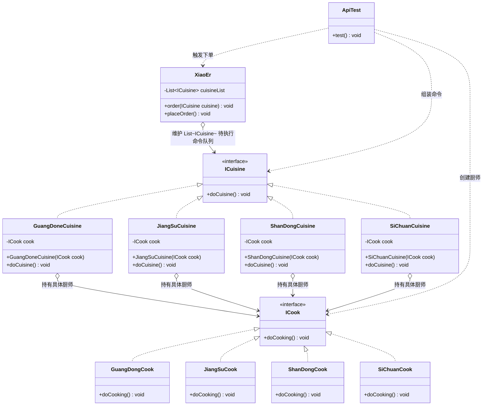
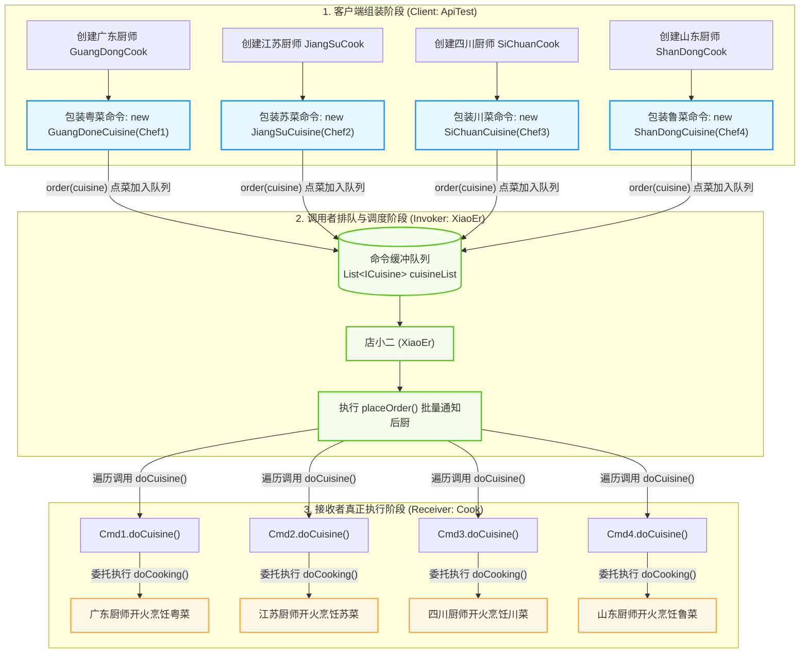
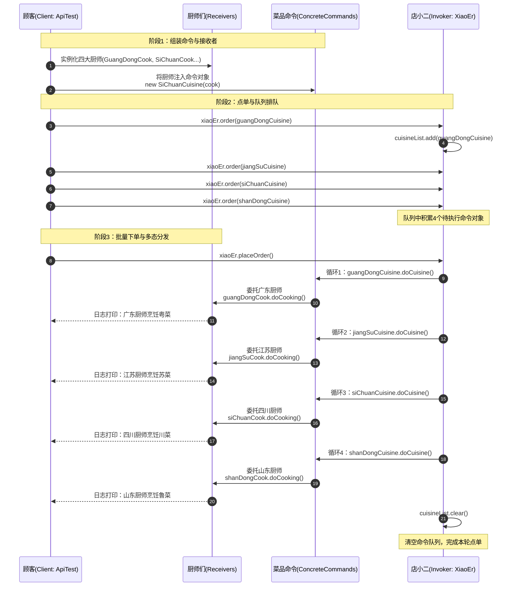

# 命令模式：点餐多菜系协同制作与请求对象化解耦架构深度剖析

本文档针对工程 `c2-CommandPattern` 中的源码，深度剖析在餐饮点餐及后厨多菜系协同烹饪业务场景下，**传统条件分支硬编码（`common`）** 与 **命令模式重构升级（`command`）** 的架构差异，全景展现命令模式（Command Pattern）如何将一个“操作请求”封装为独立的对象，从而实现调用者（店小二）与具体执行者（各大菜系厨师）的彻底解耦，并原生赋予系统请求排队、批量批处理、日志记录与无侵入水平扩展的能力。

---

## 目录
1. [业务场景背景与传统硬编码弊端剖析](#一业务场景背景与传统硬编码弊端剖析)
   - 1.1 核心业务场景：餐厅多菜系点单与后厨协同烹饪
   - 1.2 传统硬编码实现（`common/XiaoEr.java`）源码与逐行注释
   - 1.3 传统硬编码开发的四大致命弊端
2. [命令模式升级代码设计与工程结构全览](#二命令模式升级代码设计与工程结构全览)
   - 2.1 全局工程目录结构树
   - 2.2 核心模块职责矩阵
   - 2.3 命令模式核心架构类图（Mermaid ClassDiagram）
   - 2.4 命令模式架构流转图（Mermaid Flowchart）
   - 2.5 核心代码设计特点与实现细节剖析
3. [核心源码逐行深度剖析与详细注释](#三核心源码逐行深度剖析与详细注释)
   - 3.1 接收者接口与实现：`cook/ICook.java` 与四大名厨（Receiver）
   - 3.2 抽象命令契约：`cuisine/ICuisine.java`（Command）
   - 3.3 具体命令实现：四大名菜命令类（ConcreteCommand）
   - 3.4 调用者/服务员：`command/XiaoEr.java`（Invoker）
4. [数据流转全景推演与优雅执行模拟](#四数据流转全景推演与优雅执行模拟)
   - 4.1 测试用例机制深度剖析（`test/command/ApiTest.java`）
   - 4.2 业务流转时序全景图（Mermaid SequenceDiagram）
   - 4.3 4 阶段执行模拟与控制台日志逐行拆解
   - 4.4 扩展性演练：如何零侵入新增“湘菜”？
5. [重构对比、开源框架应用与设计模式总结](#五重构对比开源框架应用与设计模式总结)
   - 5.1 传统模式 vs 命令模式 全维度对比矩阵
   - 5.2 命令模式在开源框架中的经典落地（Runnable、JdbcTemplate、Saga分布式事务）
   - 5.3 行为型设计模式定位一览

---

## 一、业务场景背景与传统硬编码弊端剖析

### 1.1 核心业务场景：餐厅多菜系点单与后厨协同烹饪

在传统中餐酒楼或综合美食城中，为了满足不同地域客人的口味诉求，通常会汇集中国各大知名菜系的专业大厨：
- **广东厨师（粤菜）**：擅长选料广博、文火炖煨，讲究清鲜嫩滑；
- **江苏厨师（苏菜）**：擅长炖焖蒸炒，以浓郁醇厚、古今国宴风味见长；
- **山东厨师（鲁菜）**：以宫廷孔府菜系为龙头，擅长爆炒、原汤原汁；
- **四川厨师（川菜）**：中国最有特色与民间普及度的菜系，讲究麻辣鲜香、百菜百味。

#### 业务协作链路：
顾客（Client）进入餐厅后，面向前厅的**店小二（Invoker / 服务员）**翻阅菜单点菜。小二将顾客点的所有菜品记录在点菜单上（命令排队与聚合），确认无误后统一发往后厨（命令下发），最后由后厨各个专职厨师（Receiver）根据分工各自开火烹饪。

---

### 1.2 传统硬编码实现（`common/XiaoEr.java`）源码与逐行注释

在传统开发模式下，开发者往往将“点菜逻辑”、“后厨执行”与“菜单维护”全部揉杂在同一个店小二类中：

#### 源码展示与详细逐行注释：[`common/XiaoEr.java`](file:///C:/Users/free/Desktop/codeDesign/代码/IDesign/c2-CommandPattern/src/main/java/com/ivanzhao/Idesign/common/XiaoEr.java)
```java
package com.ivanzhao.Idesign.common;

import com.alibaba.fastjson.JSON;
import org.slf4j.Logger;
import org.slf4j.LoggerFactory;

import java.util.Map;
import java.util.concurrent.ConcurrentHashMap;

/**
 * 传统模式下的店小二（普通代码编写 - 反面教材）
 */
public class XiaoEr {

    private Logger logger = LoggerFactory.getLogger(XiaoEr.class);

    // 存放点菜单的映射表（Key: 菜品编号, Value: 描述信息）
    private Map<Integer, String> cuisineMap = new ConcurrentHashMap<Integer, String>();

    /**
     * 点单方法（传统硬编码 if-else 方式）
     * 
     * @param cuisine 菜品分类编号：1-粤菜, 2-苏菜, 3-鲁菜, 4-川菜
     */
    public void order(int cuisine) {
        // -------------------------------------------------------------
        // 【痛点 1：使用魔法数字与分支强绑定】：
        // 调用者直接感知具体的业务分支数字，缺乏类型安全
        // -------------------------------------------------------------
        // 1: 广东（粤菜）
        if (1 == cuisine) {
            // 【痛点 2：后厨烹饪文案与小二强耦合】：
            // 小二直接把后厨该干的事情以硬编码字符串写死在自己体内
            cuisineMap.put(1, "广东厨师，烹饪粤菜，中国八大菜系之一，选料广博，注重清鲜脆嫩。");
        }

        // 2: 江苏（苏菜）
        if (2 == cuisine) {
            cuisineMap.put(2, "江苏厨师，烹饪苏菜，宫廷第二大菜系，古今国宴上最受人欢迎的菜系。");
        }

        // 3: 山东（鲁菜）
        if (3 == cuisine) {
            cuisineMap.put(3, "山东厨师，烹饪鲁菜，宫廷最大菜系，以孔府风味为龙头。");
        }

        // 4: 四川（川菜）
        if (4 == cuisine) {
            cuisineMap.put(4, "四川厨师，烹饪川菜，中国最有特色的菜系，也是民间最大菜系。");
        }
    }

    /**
     * 下单出单：批量打印当前点菜单
     */
    public void placeOrder() {
        logger.info("菜单：{}", JSON.toJSONString(cuisineMap));
    }

}
```

---

### 1.3 传统硬编码开发的四大致命弊端

1. **紧耦合（Tight Coupling）——小二管得太宽**：
   店小二本应只是一个前台接单的跑腿角色，但在此代码中，他不仅要知道所有菜系的编号，还必须把每道菜是哪位厨师做、怎么做的具体文案写死在自己体内。**小二与后厨深度绑定，后厨变动直接影响前台**。
2. **严重违反开闭原则（OCP）——修改老代码风险极高**：
   如果餐馆生意红火，想要新增“湖南湘菜”或“浙江浙菜”，或者某位大厨请假需要换人做菜，开发人员必须进入 `XiaoEr.java` 内部修改 `order()` 方法，增加 `if (5 == cuisine)`。**不断给核心方法追加分支，极易破坏既有逻辑，引入线上 Bug**。
3. **请求无法被“对象化”，丧失行为治理能力**：
   在传统模式中，点单请求仅仅是一个没有任何行为的数字（`int cuisine`）。因为缺乏命令对象的封装，系统**无法实现“退菜（撤销 Undo）”、“加菜/重做（Redo）”、“按优先级调度烹饪”、“做菜超时重试”或“订单异步持久化与恢复”**等工业级高级需求。
4. **无法多态协同与自由装配**：
   菜品与厨师在代码里是死绑定的，无法做到“今天由特级厨师 A 做川菜，明天由大师 B 做川菜”的灵活组装。

---

## 二、命令模式升级代码设计与工程结构全览

### 2.1 全局工程目录结构树

```text
c2-CommandPattern/
├── pom.xml                                              # Maven 依赖配置文件
├── 命令模式案例解析与设计架构深度剖析.md                 # 【当前技术剖析文档】
└── src/
    ├── main/java/com/ivanzhao/Idesign/
    │   ├── common/                                      # 【传统硬编码反面教材】
    │   │   └── XiaoEr.java                              # if-else 硬编码的小二
    │   └── command/                                     # 【命令模式重构升级层】
    │       ├── XiaoEr.java                              # 调用者（Invoker）：维护命令队列并批量触发
    │       ├── cook/                                    # 接收者层（Receiver）：真正的业务执行者
    │       │   ├── ICook.java                           # 抽象厨师接口
    │       │   └── impl/                                # 具体厨师实现类
    │       │       ├── GuangDongCook.java               # 广东大厨（做粤菜）
    │       │       ├── JiangSuCook.java                 # 江苏大厨（做苏菜）
    │       │       ├── ShanDongCook.java                # 山东大厨（做鲁菜）
    │       │       └── SiChuanCook.java                 # 四川大厨（做川菜）
    │       └── cuisine/                                 # 命令层（Command）：将做菜动作对象化封装
    │           ├── ICuisine.java                        # 抽象菜品命令接口
    │           └── impl/                                # 具体菜品命令实现类（ConcreteCommand）
    │               ├── GuangDoneCuisine.java            # 粤菜命令（持有广东厨师）
    │               ├── JiangSuCuisine.java              # 苏菜命令（持有江苏厨师）
    │               ├── ShanDongCuisine.java             # 鲁菜命令（持有山东厨师）
    │               └── SiChuanCuisine.java              # 川菜命令（持有四川厨师）
    └── test/java/test/                                  # 【测试验证层】
        ├── common/
        │   └── ApiTest.java                             # 传统模式测试对照组
        └── command/
            └── ApiTest.java                             # 命令模式多菜系组装与批量下单测试
```

---

### 2.2 核心模块职责矩阵

| 包路径 | 核心类 | 命令模式角色 | 核心职责与设计意图 |
| :--- | :--- | :--- | :--- |
| **`command.cuisine`** | [`ICuisine`](file:///C:/Users/free/Desktop/codeDesign/代码/IDesign/c2-CommandPattern/src/main/java/com/ivanzhao/Idesign/command/cuisine/ICuisine.java) | **抽象命令（Command）** | 声明所有菜品命令必须遵循的执行规范方法 `void doCuisine();`。将行为对象化抽象。 |
| **`command.cuisine.impl`** | `GuangDoneCuisine`<br/>`JiangSuCuisine`<br/>`ShanDongCuisine`<br/>`SiChuanCuisine` | **具体命令（ConcreteCommand）** | 封装一道道具体的菜品请求。每个类内部**持有具体的做菜师傅（`ICook`）**，在 `doCuisine()` 中调用 `cook.doCooking()`。 |
| **`command.cook`** | [`ICook`](file:///C:/Users/free/Desktop/codeDesign/代码/IDesign/c2-CommandPattern/src/main/java/com/ivanzhao/Idesign/command/cook/ICook.java)<br/>`GuangDongCook` 等 4 位厨师 | **接收者（Receiver）** | 真正的业务动作实施者。包含各菜系的实际炒菜烹饪逻辑，**完全不与小二直接耦合**。 |
| **`command`** | [`XiaoEr`](file:///C:/Users/free/Desktop/codeDesign/代码/IDesign/c2-CommandPattern/src/main/java/com/ivanzhao/Idesign/command/XiaoEr.java) | **调用者 / 请求者（Invoker）** | 前厅服务员：内部维护 `List<ICuisine>` 待执行命令队列，只负责点单收集（`order`）与统一下单（`placeOrder`），**完全不知道具体厨师是谁**。 |
| **`test.command`** | [`ApiTest`](file:///C:/Users/free/Desktop/codeDesign/代码/IDesign/c2-CommandPattern/src/test/java/test/command/ApiTest.java) | **客户端（Client）** | 组装中心：负责创建具体的厨师（Receiver），注入到菜品命令中（ConcreteCommand），交给小二（Invoker）排队执行。 |

---

### 2.3 命令模式核心架构类图（Mermaid ClassDiagram）



---

### 2.4 命令模式架构流转图（Mermaid Flowchart）



---

### 2.5 核心代码设计特点与实现细节剖析

#### ① “行为对象化”——命令模式的灵魂核心
在面向对象设计中，数据通常很容易被封装成实体对象（如 User、Order），但**“动作/行为”往往只是方法调用**。
命令模式做出了革命性的转变：**把“做粤菜”、“做川菜”这个动作本身，封装为了一个活生生的 Java 对象（`ICuisine`）！**
- 一旦动作变成了对象，它就可以被传递、被存入 `List`、被持久化、被计数、被延迟执行，甚至被传递到网络另一端的机器上！

#### ② 双向解耦：小二完全不知道厨师的存在
请看 [`XiaoEr.java`](file:///C:/Users/free/Desktop/codeDesign/代码/IDesign/c2-CommandPattern/src/main/java/com/ivanzhao/Idesign/command/XiaoEr.java)：
```java
public class XiaoEr {
    private List<ICuisine> cuisineList = new ArrayList<>();
    public void order(ICuisine cuisine) { cuisineList.add(cuisine); }
    public synchronized void placeOrder() {
        for (ICuisine cuisine : cuisineList) {
            cuisine.doCuisine();
        }
        cuisineList.clear();
    }
}
```
**震撼细节**：
小二类中**没有出现任何一个厨师类（`ICook`、`GuangDongCook` 等）的名字**！
小二只知道自己手里拿着一张张菜品单据（`ICuisine`）。当客人说下单时，小二只需把单据往后厨一交（调用 `doCuisine()`），具体是张师傅还是李师傅来炒，小二完全不需要关心。这实现了极其纯粹的解耦！

#### ③ 批处理与命令队列机制
小二通过 `List<ICuisine> cuisineList` 实现了天然的“命令缓冲区”：
- 客人可以一道一道慢慢点（多次调用 `xiaoEr.order(...)`）；
- 小二先暂存命令，直到客人说“点齐了”，才调用一次 `xiaoEr.placeOrder()` 批量交付后厨；
- 执行完毕后执行 `cuisineList.clear()`，重置状态。这为进一步支持“退菜（移除某条命令）”提供了完美的底层基础。

---

## 三、核心源码逐行深度剖析与详细注释

### 3.1 接收者接口与实现：`cook/ICook.java` 与四大名厨（Receiver）

#### ① 接收者接口：[`cook/ICook.java`](file:///C:/Users/free/Desktop/codeDesign/代码/IDesign/c2-CommandPattern/src/main/java/com/ivanzhao/Idesign/command/cook/ICook.java)
```java
package com.ivanzhao.Idesign.command.cook;

/**
 * 厨师统一接口
 * 
 * ==================== 【命令模式角色：接收者接口 (Receiver)】 ====================
 * 1. 角色定义：接收者是真正知晓如何实施与执行业务操作的对象。
 * 2. 核心特点：
 *    - 无论川鲁粤苏哪个菜系的厨师，都具备烹饪技能（doCooking）；
 *    - 接收者不直接与调用者（小二 XiaoEr）打交道，而是被具体命令对象（ICuisine）所持有；
 *    - 实现了真正执行业务逻辑的实体与发出请求的调用者之间的彻底解耦。
 */
public interface ICook {

    /**
     * 烹饪做菜动作（真正执行业务请求的方法）
     */
    void doCooking();
}
```

#### ② 具体接收者实现（以广东厨师和四川厨师为例）：
* [`cook/impl/GuangDongCook.java`](file:///C:/Users/free/Desktop/codeDesign/代码/IDesign/c2-CommandPattern/src/main/java/com/ivanzhao/Idesign/command/cook/impl/GuangDongCook.java)
```java
package com.ivanzhao.Idesign.command.cook.impl;

import com.ivanzhao.Idesign.command.cook.ICook;
import org.slf4j.Logger;
import org.slf4j.LoggerFactory;

/**
 * 广东厨师（粤菜师傅）
 * 
 * ==================== 【命令模式角色：具体接收者 (Concrete Receiver)】 ====================
 */
public class GuangDongCook implements ICook {

    private Logger logger = LoggerFactory.getLogger(GuangDongCook.class);

    @Override
    public void doCooking() {
        logger.info("广东厨师，烹饪粤菜，中国八大菜系之一，以选料广博、文火炖煨、清鲜嫩滑为特色。");
    }
}
```

* [`cook/impl/SiChuanCook.java`](file:///C:/Users/free/Desktop/codeDesign/代码/IDesign/c2-CommandPattern/src/main/java/com/ivanzhao/Idesign/command/cook/impl/SiChuanCook.java)
```java
package com.ivanzhao.Idesign.command.cook.impl;

import com.ivanzhao.Idesign.command.cook.ICook;
import org.slf4j.Logger;
import org.slf4j.LoggerFactory;

/**
 * 四川厨师（川菜师傅）
 * 
 * ==================== 【命令模式角色：具体接收者 (Concrete Receiver)】 ====================
 */
public class SiChuanCook implements ICook {

    private Logger logger = LoggerFactory.getLogger(SiChuanCook.class);

    @Override
    public void doCooking() {
        logger.info("四川厨师，烹饪川菜，中国最有特色的菜系，也是民间最大菜系。");
    }
}
```

---

### 3.2 抽象命令契约：`cuisine/ICuisine.java`（Command）

#### 源码展示与详细注释：[`cuisine/ICuisine.java`](file:///C:/Users/free/Desktop/codeDesign/代码/IDesign/c2-CommandPattern/src/main/java/com/ivanzhao/Idesign/command/cuisine/ICuisine.java)
```java
package com.ivanzhao.Idesign.command.cuisine;

/**
 * 菜品抽象命令接口（Command）
 * 
 * ==================== 【命令模式核心角色：抽象命令接口 (Command)】 ====================
 * 1. 角色定义：声明执行命令的统一抽象接口或方法。
 * 2. 核心精髓：
 *    - 将一个“做某道菜”的业务请求抽象为一个对象（菜品实例）；
 *    - 使得调用者（店小二 XiaoEr）无需知道具体是哪位厨师做菜，只需面向 ICuisine 接口统一触发 doCuisine()；
 *    - 将传统的“小二直接呼叫厨师”的耦合关系，转变为“小二收集菜品命令列表，统一通知执行”。
 */
public interface ICuisine {

    /**
     * 执行菜品烹饪命令（Command 模式核心执行方法）
     */
    void doCuisine();

}
```

---

### 3.3 具体命令实现：四大名菜命令类（ConcreteCommand）

每一个具体命令类，都在构造方法中依赖注入对应的厨师接收者：

#### 源码展示：[`cuisine/impl/SiChuanCuisine.java`](file:///C:/Users/free/Desktop/codeDesign/代码/IDesign/c2-CommandPattern/src/main/java/com/ivanzhao/Idesign/command/cuisine/impl/SiChuanCuisine.java)
```java
package com.ivanzhao.Idesign.command.cuisine.impl;

import com.ivanzhao.Idesign.command.cook.ICook;
import com.ivanzhao.Idesign.command.cuisine.ICuisine;

/**
 * 川菜菜品命令（四川菜）
 * 
 * ==================== 【命令模式角色：具体命令 (ConcreteCommand)】 ====================
 * 1. 角色职责：
 *    - 封装点川菜的具体请求；
 *    - 持有做川菜的厨师（接收者）；
 * 2. 命令模式精髓体现：
 *    - 在 doCuisine() 中调用 cook.doCooking()。
 */
public class SiChuanCuisine implements ICuisine {

    /**
     * 持有接收者（Receiver）引用：负责烹饪川菜的厨师
     */
    private ICook cook;

    /**
     * 构造函数：强制依赖注入具体的做菜厨师（接收者）
     * 
     * @param cook 负责做川菜的厨师
     */
    public SiChuanCuisine(ICook cook) {
        this.cook = cook;
    }

    /**
     * 触发命令执行：委托给厨师进行烹饪
     */
    @Override
    public void doCuisine() {
        if (cook != null) {
            // 【关键点】：命令本身不炒菜，而是指挥绑定的厨师炒菜！
            cook.doCooking();
        }
    }
}
```

---

### 3.4 调用者/服务员：`command/XiaoEr.java`（Invoker）

#### 源码展示与详细注释：[`command/XiaoEr.java`](file:///C:/Users/free/Desktop/codeDesign/代码/IDesign/c2-CommandPattern/src/main/java/com/ivanzhao/Idesign/command/XiaoEr.java)
```java
package com.ivanzhao.Idesign.command;

import com.ivanzhao.Idesign.command.cuisine.ICuisine;
import org.slf4j.Logger;
import org.slf4j.LoggerFactory;

import java.util.ArrayList;
import java.util.List;

/**
 * 命令模式下的店小二（服务员）
 * 
 * ==================== 【命令模式核心角色：调用者/请求者 (Invoker)】 ====================
 * 1. 角色职责：
 *    - 负责接收客户端发来的各种命令（ICuisine）；
 *    - 维护一个待执行的命令清单（cuisineList）；
 *    - 在合适的时机统一发出指令，批量触发所有命令的执行（placeOrder）。
 * 
 * 2. 核心架构优势与命令模式体现：
 *    - 完全与具体厨师解耦：小二只面向抽象命令 ICuisine 编程；
 *    - 具备命令的排队与批处理能力：小二可以把顾客点的多道菜先收集在 cuisineList 中，待点单完毕后统一通知后厨；
 *    - 具备极高扩展性：若新增菜系（如湘菜），小二类无需改动一行代码，完全符合开闭原则（OCP）。
 */
public class XiaoEr {

    private Logger logger = LoggerFactory.getLogger(XiaoEr.class);

    /**
     * 命令池/待执行命令队列：收集客户点的菜品命令对象
     */
    private List<ICuisine> cuisineList = new ArrayList<>();

    /**
     * 点单接收命令：将客户端发出的业务请求转化为 Command 对象加入队列
     * 
     * @param cuisine 抽象菜品命令实例（例如：粤菜、苏菜、鲁菜、川菜）
     */
    public void order(ICuisine cuisine) {
        cuisineList.add(cuisine);
    }

    /**
     * 正式下单并批处理执行所有排队的命令
     */
    public synchronized void placeOrder() {
        for (ICuisine cuisine : cuisineList) {
            // 【命令模式体现】：统一调用抽象方法，多态自动分发给各具体厨师执行
            cuisine.doCuisine();
        }
        // 执行完毕后清空当前菜单命令列表
        cuisineList.clear();
    }

}
```

---

## 四、数据流转全景推演与优雅执行模拟

### 4.1 测试用例机制深度剖析（`test/command/ApiTest.java`）

#### 源码展示与详细注释：[`src/test/java/test/command/ApiTest.java`](file:///C:/Users/free/Desktop/codeDesign/代码/IDesign/c2-CommandPattern/src/test/java/test/command/ApiTest.java)
```java
package test.command;

import com.ivanzhao.Idesign.command.XiaoEr;
import com.ivanzhao.Idesign.command.cook.impl.GuangDongCook;
import com.ivanzhao.Idesign.command.cook.impl.JiangSuCook;
import com.ivanzhao.Idesign.command.cook.impl.ShanDongCook;
import com.ivanzhao.Idesign.command.cook.impl.SiChuanCook;
import com.ivanzhao.Idesign.command.cuisine.ICuisine;
import com.ivanzhao.Idesign.command.cuisine.impl.GuangDoneCuisine;
import com.ivanzhao.Idesign.command.cuisine.impl.JiangSuCuisine;
import com.ivanzhao.Idesign.command.cuisine.impl.ShanDongCuisine;
import com.ivanzhao.Idesign.command.cuisine.impl.SiChuanCuisine;
import org.junit.Test;

/**
 * 命令模式测试用例
 * 
 * ==================== 【命令模式角色：客户端 (Client)】 ====================
 * 负责装配 Receiver、ConcreteCommand 与 Invoker。
 */
public class ApiTest {

    @Test
    public void test() {
        // -------------------------------------------------------------
        // 步骤 1：创建具体命令，并将对应的接收者（厨师）绑定到命令中
        // -------------------------------------------------------------
        // 粤菜命令 -> 绑定广东厨师
        ICuisine guangDoneCuisine = new GuangDoneCuisine(new GuangDongCook());
        // 苏菜命令 -> 绑定江苏厨师
        ICuisine jiangSuCuisine = new JiangSuCuisine(new JiangSuCook());
        // 鲁菜命令 -> 绑定山东厨师
        ICuisine shanDongCuisine = new ShanDongCuisine(new ShanDongCook());
        // 川菜命令 -> 绑定四川厨师
        ICuisine siChuanCuisine = new SiChuanCuisine(new SiChuanCook());

        // -------------------------------------------------------------
        // 步骤 2：创建调用者（店小二）
        // -------------------------------------------------------------
        XiaoEr xiaoEr = new XiaoEr();

        // -------------------------------------------------------------
        // 步骤 3：点单（小二收集命令，加入待执行队列排队）
        // -------------------------------------------------------------
        xiaoEr.order(guangDoneCuisine);
        xiaoEr.order(jiangSuCuisine);
        xiaoEr.order(siChuanCuisine);
        xiaoEr.order(shanDongCuisine);

        // -------------------------------------------------------------
        // 步骤 4：下单并批量执行（小二统一通知后厨各个厨师执行烹饪）
        // -------------------------------------------------------------
        xiaoEr.placeOrder();
    }
}
```

---

### 4.2 业务流转时序全景图（Mermaid SequenceDiagram）



---

### 4.3 4 阶段执行模拟与控制台日志逐行拆解

当运行 `test/command/ApiTest.java` 时，控制台将输出如下日志：

```text
2026-09-14 22:38:01.100 [main] INFO  com.ivanzhao.Idesign.command.cook.impl.GuangDongCook - 广东厨师，烹饪粤菜，中国八大菜系之一，以选料广博、文火炖煨、清鲜嫩滑为特色。
2026-09-14 22:38:01.105 [main] INFO  com.ivanzhao.Idesign.command.cook.impl.JiangSuCook - 江苏厨师，烹饪苏菜，宫廷第二大菜系，古今国宴上最受人欢迎的菜系。
2026-09-14 22:38:01.106 [main] INFO  com.ivanzhao.Idesign.command.cook.impl.SiChuanCook - 四川厨师，烹饪川菜，中国最有特色的菜系，也是民间最大菜系。
2026-09-14 22:38:01.107 [main] INFO  com.ivanzhao.Idesign.command.cook.impl.ShanDongCook - 山东厨师，烹饪鲁菜，宫廷最大菜系，以孔府风味为龙头。
```

#### 日志背后的执行逻辑拆解：
1. **第 1 行日志（粤菜执行）**：
   小二遍历第一个命令 `GuangDoneCuisine`，调用其 `doCuisine()`，命令内部持有的 `GuangDongCook` 执行炒菜，输出粤菜日志；
2. **第 2 行日志（苏菜执行）**：
   小二遍历第二个命令 `JiangSuCuisine`，无缝分发给 `JiangSuCook` 执行烹饪；
3. **第 3 行日志（川菜执行）**：
   小二遍历第三个命令 `SiChuanCuisine`，由 `SiChuanCook` 完成麻辣烹调；
4. **第 4 行日志（鲁菜执行）**：
   小二遍历第四个命令 `ShanDongCuisine`，由 `ShanDongCook` 压轴烹制孔府鲁菜。
5. **执行完毕清空**：
   所有菜品烹制完成，小二清空了手中的点菜单（`cuisineList.clear()`），单据流转全流程圆满结束！

---

### 4.4 扩展性演练：如何零侵入新增“湘菜”？

命令模式最强大的地方在于其**对扩展的极致包容性（OCP）**：
假设酒楼现在需要新增大热的“湖南湘菜”：
- **步骤 1**：编写具体的厨师类 `HunanCook implements ICook`（负责剁椒鱼头等炒菜逻辑）；
- **步骤 2**：编写具体的菜品命令类 `HuNanCuisine implements ICuisine`，持有 `HunanCook`；
- **步骤 3**：客户端点单 `xiaoEr.order(new HuNanCuisine(new HunanCook()))`；
- **核心结论**：
  **店小二（`XiaoEr.java`）的代码完全不需要做任何修改！现有其他四个菜系的代码也完全不需要修改！**
  新功能的增加变成了完全纯粹的“积木式新增”，彻底终结了在主业务流程中反复修改 `if-else` 的技术风险！

---

## 五、重构对比、开源框架应用与设计模式总结

### 5.1 传统模式 vs 命令模式 全维度对比矩阵

| 对比维度 | 传统模式（`common`） | 命令模式升级（`command`） | 生产环境收益 |
| :--- | :--- | :--- | :--- |
| **调用方与接收方耦合度** | **强耦合**：小二类直接写死所有菜系分支与做菜文案 | **零耦合**：小二只认识抽象命令 `ICuisine`，不知道厨师是谁 | **前台与后厨独立演进，互不干扰** |
| **系统可扩展性（OCP）** | 极差：每增减菜系都必须修改小二核心类中的 `if-else` | 极佳：只需新增命令类和接收者类，无需修改既有代码 | **实现零侵入插件化扩展** |
| **请求的生命周期控制** | 请求只是临时数字参数，用完即丢，无法追踪 | 请求被固化为内存对象，可存入队列、可延迟批处理 | **支持请求排队、异步执行、批处理** |
| **撤销与重做（Undo/Redo）** | 无法支持：已下的单无法记录历史命令轨迹 | 极易支持：命令接口增加 `undo()`，栈记录命令历史即可 | **天然支持回滚、补偿操作** |
| **代码可维护性与测试** | 随着分支增多演变为巨型方法，测试困难 | 每个命令和厨师独立单测，职责高度内聚 | **代码清晰，可测性与可读性大幅提升** |

---

### 5.2 命令模式在开源框架中的经典落地

1. **Java 原生并发包中的 `Runnable` 与 `Callable`**：
   ```java
   // Runnable 就是最典型的无参命令接口 Command！
   Runnable task = () -> System.out.println("真正的接收者在干活");
   // ThreadPoolExecutor 线程池就是调用者 Invoker！
   executor.submit(task); // 将命令加入 BlockingQueue 命令队列并异步调度
   ```
2. **Spring 框架中的 `JdbcTemplate` 与 `StatementCallback`**：
   - Spring 将具体的 SQL 执行行为封装为 `StatementCallback` 命令对象，传递给 `JdbcTemplate.execute()` 统一打开/关闭连接并执行；
3. **分布式事务 Saga 模式（补偿事务）**：
   - 在微服务长事务中，每个正向操作（如扣减库存）被封装为一个 Command，对应的反向回滚操作（如增加库存）被封装为一个 CompensateCommand；
   - 事务协调器（Invoker）按顺序执行命令列表，一旦某步失败，逆序触发各命令的补偿操作，实现最终一致性；
4. **Redis 内部命令处理队列**：
   - Redis 将客户端发送的每个指令（如 `SET`, `GET`, `HGET`）解析为内部的 `redisCommand` 对象，压入执行队列后由单线程事件循环统一分发处理。

---

### 5.3 行为型设计模式定位一览

至此，您已经深入掌握了经典的行为型设计模式：
- **责任链模式（Chain of Responsibility）**：多个节点链式传递，自动寻找合适的处理者（拦截/放行/特批）；
- **命令模式（Command）**：**把“要做的一件事”打包成对象，实现调用者与执行者的解耦，支持排队、延时、批处理与撤销！**
