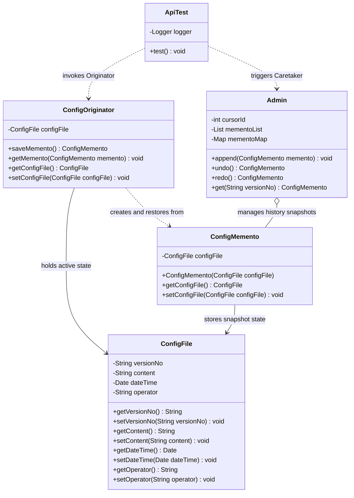
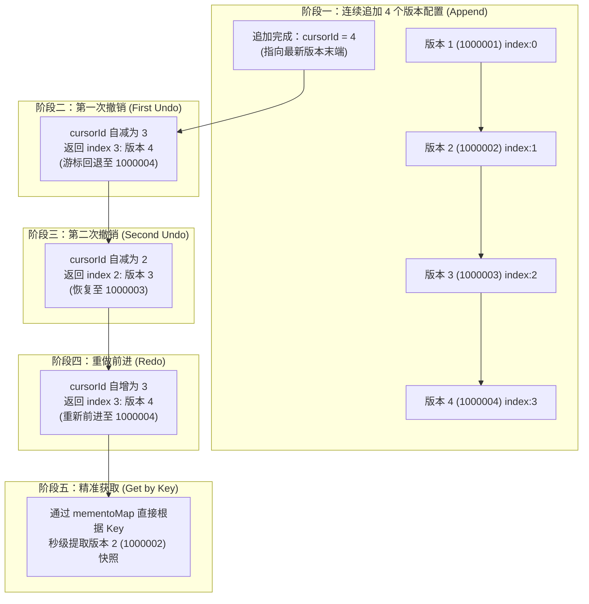
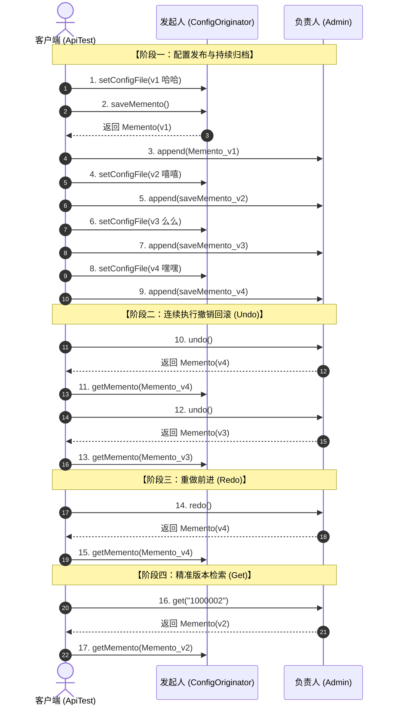
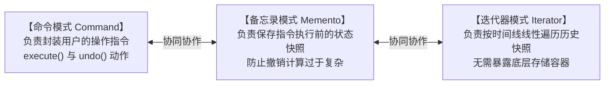

# 备忘录模式：系统配置多版本归档与状态无损回滚深度剖析

本文档针对工程 `c5-MementoPattern` 中的源码，深度剖析在企业级分布式配置中心（如 Apollo、Nacos）版本管理、线上故障秒级止血以及撤销重做（Undo / Redo）等核心业务场景下，**备忘录模式（Memento Pattern）** 的设计哲学、架构实现与实战价值。全文从业务场景背景、传统状态管理的四大痛点、GoF 经典四大角色职责划分、双向索引与游标状态机机制、测试数据流转单步全景推演到经典开源系统落地进行全面透视，展现备忘录模式如何在绝对不破坏对象封装性的前提下，实现对象内部状态的高可靠捕获与无损恢复。

---

## 目录
1. [业务场景背景与状态管理的挑战](#一业务场景背景与状态管理的挑战)
   - 1.1 核心业务场景：企业级配置中心的多版本归档与故障秒级止血
   - 1.2 传统状态保存机制的困境与四大缺陷剖析
   - 1.3 备忘录模式的核心破局思路与设计哲学
2. [备忘录模式架构设计与工程全局结构](#二备忘录模式架构设计与工程全局结构)
   - 2.1 全局工程目录结构树
   - 2.2 核心模块职责矩阵（GoF 经典四大角色）
   - 2.3 备忘录模式核心架构类图（Mermaid 8.x 适配）
   - 2.4 版本时间线推进与游标滑动状态机模型（Mermaid 8.x 适配）
   - 2.5 核心代码设计特点与架构细节深度解析
3. [核心源码逐行深度剖析与详细注释](#三核心源码逐行深度剖析与详细注释)
   - 3.1 状态实体对象：`ConfigFile.java`
   - 3.2 备忘录角色：`ConfigMemento.java`
   - 3.3 发起人角色：`ConfigOriginator.java`
   - 3.4 负责人角色：`Admin.java`（含游标越界修复剖析）
   - 3.5 客户端驱动入口：`test/ApiTest.java`
4. [测试数据流转全景推演与优雅执行流程](#四测试数据流转全景推演与优雅执行流程)
   - 4.1 测试数据装配与版本演化全景
   - 4.2 游标推进与状态流转单步精准推演表（8 步全生命周期推演）
   - 4.3 业务调用与数据流转时序全景图（Mermaid 8.x 适配）
   - 4.4 控制台运行日志与优雅执行结果解析
5. [进阶拓展、开源实战与行为型设计模式精要](#五进阶拓展开源实战与行为型设计模式精要)
   - 5.1 传统模式 vs 备忘录模式全维度对比矩阵
   - 5.2 备忘录模式在主流开源框架与工业级系统中的经典应用
   - 5.3 行为型设计模式家族协同思考（备忘录模式 vs 迭代器模式 vs 命令模式）
   - 5.4 备忘录模式设计原则与实战心法总结

---

## 一、业务场景背景与状态管理的挑战

### 1.1 核心业务场景：企业级配置中心的多版本归档与故障秒级止血

在现代大型分布式系统与微服务架构中，**配置中心（如携程 Apollo、阿里 Nacos、Spring Cloud Config）** 是连接数千个微服务节点的神经中枢：
- **高频动态变更**：日常业务运营中，开发与运维人员需要频繁热更新配置（如调整限流阈值、开关促销活动、切换支付网关通道、更新灰度规则）；
- **线上故障紧急止血诉求**：任何一次错误的参数配置下发（例如把超时时间少写了一个零、将降级开关误开启），瞬间可能引发全链路雪崩。此时，团队排查代码、寻找 bug 往往需要十几分钟，但线上业务根本无法承受长时间宕机。**最核心的刚需是“一键极速回滚至上一个稳定版本（Undo）”**，在几秒钟内恢复业务可用性；
- **版本时间轴溯源与二次前进（Redo）**：当排查定位配置问题并修复后，需要能够前进恢复到新版本；或者在故障复盘时，需要按指定版本号精准查看历史某一天的配置内容（Get by VersionNo）。

---

### 1.2 传统状态保存机制的困境与四大缺陷剖析

如果在业务系统中使用传统的、面向过程的直接赋值或外部管理方式来保存状态，系统将面临以下四大致命缺陷：

#### 痛点 1：彻底破坏对象的封装性（Encapsulation Violation）
要让外部系统保存某个对象的内部状态，传统做法往往是迫使该对象暴露出所有的内部私有属性（提供全套公共 getter/setter）：
```java
// 传统做法：外部类直接读取发起人的内部属性并在外部拼接保存
ConfigFile currentConfig = configService.getConfig();
Map<String, Object> backupState = new HashMap<>();
backupState.put("versionNo", currentConfig.getVersionNo());
backupState.put("content", currentConfig.getContent());
backupState.put("dateTime", currentConfig.getDateTime());
backupState.put("operator", currentConfig.getOperator());
// 恢复时又由外部强行 set 进去
currentConfig.setContent((String) backupState.get("content"));
```
这种做法严重违背了面向对象设计的核心基石——**封装性**。发起人内部的状态细节完全赤裸裸地暴露在外部代码面前，任何外部逻辑都可以任意篡改内部字段，系统极度脆弱。

#### 痛点 2：高耦合与职责蔓延（Violating SRP）
如果为了避免暴露给外部，让业务实体自己来维护所有的历史版本（在业务类内部写一个 `List<ConfigFile> historyList`，并提供 `undo()`、`redo()` 方法），就会导致**单一职责原则（SRP）的严重破坏**：
- 业务类既要负责核心的配置解析与生效逻辑；
- 又要兼顾历史版本的存储、增删改查、游标指针移动、版本冲突解决；
- 随着版本管理功能膨胀，业务类代码迅速演变成数千行的“上帝类（God Class）”，无法维护。

#### 痛点 3：引用共享导致的历史快照“被动污染”隐患
在 Java 中，对象是通过引用传递的。如果外部备份仅仅保存了对象的引用，当后续代码修改了当前配置的属性时，历史快照里的属性也会同步被改动：
```java
// 严重隐患：浅引用备份
List<ConfigFile> history = new ArrayList<>();
history.add(currentConfig); // 仅仅保存了引用
currentConfig.setContent("篡改后的配置"); // 历史记录中的对象内容也被篡改了！
```
若每次手工在业务层编写深克隆（Deep Copy），不仅代码冗长繁琐，而且极易遗漏新增的字段，导致历史数据失真。

#### 痛点 4：缺乏撤销（Undo）与重做（Redo）的系统化游标状态机机制
传统做法往往只是简单用 `Stack` 或 `List` 存数据，当遇到复杂的撤销、重做、到达边界时的保护（越界异常）、按版本检索等组合诉求时，代码中到处充斥着 `if (index > 0)`、`index--` 等零散下标操作，极易发生 `IndexOutOfBoundsException` 数组越界或负数溢出崩溃。

---

### 1.3 备忘录模式的核心破局思路与设计哲学

> **GoF 备忘录模式（Memento Pattern）经典定义**：
> 在不破坏封装性的前提下，捕获一个对象的内部状态，并在该对象之外保存这个状态。这样以后就可将该对象恢复到原先保存的状态。

备忘录模式通过引入三大核心角色的协作，完美化解了上述矛盾：


1. **绝对守护封装性**：
   - 备忘录对象（`ConfigMemento`）由发起人（`ConfigOriginator`）亲自创建，内部封装完整的状态快照；
   - 外部负责人（`Admin`）只能把备忘录当成一个“密封的信封/黑盒”来存储与传递，绝不能拆开信封窥探或修改里面的具体配置数据。
2. **职责边界清晰**：
   - **发起人**：专注于当前状态的使用，只提供 `saveMemento()` 和 `getMemento()` 两个核心契约；
   - **负责人**：专注于快照的生命周期管理（时间线列表、多线程并发映射表、游标指针边界控制）；
   - 实现了真正的关注点分离（Separation of Concerns）。

---

## 二、备忘录模式架构设计与工程全局结构

### 2.1 全局工程目录结构树

工程 `c5-MementoPattern` 采用了极简而高度规范的结构：

```text
c5-MementoPattern
├── pom.xml                                  # Maven 项目工程依赖配置
├── 备忘录模式案例解析与设计架构深度剖析.md     # 架构深度剖析技术全景文档
└── src
    ├── main
    │   └── java
    │       └── com
    │           └── ivanzhao
    │               └── Idesign
    │                   ├── Admin.java            # 【负责人 Caretaker】管理备忘录历史与游标状态机
    │                   ├── ConfigFile.java       # 【状态实体 State】承载具体配置业务数据
    │                   ├── ConfigMemento.java    # 【备忘录 Memento】只读状态快照黑盒
    │                   └── ConfigOriginator.java # 【发起人 Originator】业务主体，创建与恢复状态
    └── test
        └── java
            └── test
                └── ApiTest.java                  # 【客户端 Client】全流程驱动与业务场景测试
```

---

### 2.2 核心模块职责矩阵（GoF 经典四大角色）

| 模式角色 | 工程对应类 / 接口 | 核心职责与设计精髓 |
| :--- | :--- | :--- |
| **发起人 (Originator)** | [`ConfigOriginator.java`](file:///C:/Users/free/Desktop/codeDesign/代码/IDesign/c5-MementoPattern/src/main/java/com/ivanzhao/Idesign/ConfigOriginator.java) | 核心业务实体类。持有当前处于活跃状态的 `ConfigFile`。当需要存档时调用 `saveMemento()` 打包出快照；当需要回滚时调用 `getMemento(memento)` 恢复自身状态。 |
| **备忘录 (Memento)** | [`ConfigMemento.java`](file:///C:/Users/free/Desktop/codeDesign/代码/IDesign/c5-MementoPattern/src/main/java/com/ivanzhao/Idesign/ConfigMemento.java) | 历史快照的封装载体。保护发起人的状态快照不被任何外部对象直接篡改，充当只读的“历史版本快照黑盒”。 |
| **负责人/管理者 (Caretaker)** | [`Admin.java`](file:///C:/Users/free/Desktop/codeDesign/代码/IDesign/c5-MementoPattern/src/main/java/com/ivanzhao/Idesign/Admin.java) | 备忘录的管理者。内部维护按时间线性追加的 `mementoList` 与基于版本号哈希索引的 `mementoMap`；通过内部游标 `cursorId` 精准实现 `undo()`、`redo()` 与 `get(versionNo)`。严格遵守不修改备忘录内部内容的原则。 |
| **状态对象 (State Object)** | [`ConfigFile.java`](file:///C:/Users/free/Desktop/codeDesign/代码/IDesign/c5-MementoPattern/src/main/java/com/ivanzhao/Idesign/ConfigFile.java) | 承载业务数据的领域对象。包含版本号（`versionNo`）、配置内容（`content`）、变更时间（`dateTime`）、操作人（`operator`）。 |
| **客户端 (Client)** | [`ApiTest.java`](file:///C:/Users/free/Desktop/codeDesign/代码/IDesign/c5-MementoPattern/src/test/java/test/ApiTest.java) | 业务调度入口。模拟连续发布多个配置版本，并通过 `Admin` 执行连续撤销（Undo）、重做（Redo）以及指定版本快照恢复。 |

---

### 2.3 备忘录模式核心架构类图（Mermaid 8.x 适配）



---

### 2.4 版本时间线推进与游标滑动状态机模型（Mermaid 8.x 适配）

在 `Admin` 类中，版本列表 `mementoList` 按自然追加顺序排列（下标 0, 1, 2, 3）。游标 `cursorId` 的动态流转状态如下：



---

### 2.5 核心代码设计特点与架构细节深度解析

#### 特点 1：顺序列表与并发哈希的双重存储索引设计
在 [`Admin.java`](file:///C:/Users/free/Desktop/codeDesign/代码/IDesign/c5-MementoPattern/src/main/java/com/ivanzhao/Idesign/Admin.java) 中，并没有仅仅使用单一的 `List` 或 `Map`，而是采用了**双重协同存储架构**：
```java
private List<ConfigMemento> mementoList = new ArrayList<>();
private Map<String, ConfigMemento> mementoMap = new ConcurrentHashMap<>();
```
- **`mementoList`**：保证了版本的**线性因果顺序**，专门用于支持 `undo()` 回滚与 `redo()` 前进的游标步进操作（时间复杂度 $O(1)$）；
- **`mementoMap`**：采用线程安全的 `ConcurrentHashMap`，基于配置版本号（`versionNo`）建立一级哈希索引。当线上排查需要调阅任意历史特定版本（如 `"1000002"`）时，无需遍历整个 List，直接 $O(1)$ 时间复杂度快速秒级命中。

#### 特点 2：彻底屏蔽内部实现的“黑盒状态管理”
在备忘录模式中，`Admin` 扮演的是纯粹的“保管人”角色。它不关心 `ConfigFile` 内部到底有几个字段、字段名是什么、文本内容是否合法。`Admin` 只持有 `ConfigMemento` 的引用。这种设计遵循了**迪米特法则（最少知识原则）**，未来即使 `ConfigFile` 新增了诸如 `md5Sign`、`tenantId`、`clusterGroup` 等几十个字段，`Admin` 的代码完全不需要做任何修改！

#### 特点 3：严谨的游标边界防御与零崩溃保障
原始代码中存在严重的游标溢出漏洞。当 `cursorId` 到达上界或下界时，极易引发 `IndexOutOfBoundsException`。优化后的代码对游标进行了**双向边界安全锁定**：
- **下边界锁定**：当 `--cursorId <= 0` 时，强制将游标锁定为 `cursorId = 0`，即使外部疯狂连续点击 100 次 Undo，游标始终安全停靠在初始版本，绝不溢出为负数；
- **上边界锁定**：当 `++cursorId >= mementoList.size()` 时，强制将游标锁定在 `mementoList.size() - 1`，彻底根除数组越界崩溃隐患；
- **空集合防护**：当列表为空时直接返回 `null`，发起人侧同时进行了防 NPE 保护。

---

## 三、核心源码逐行深度剖析与详细注释

### 3.1 状态实体对象：`ConfigFile.java`

[`ConfigFile.java`](file:///C:/Users/free/Desktop/codeDesign/代码/IDesign/c5-MementoPattern/src/main/java/com/ivanzhao/Idesign/ConfigFile.java) 承载着业务配置的核心字段，是一个标准的 Java 领域实体（POJO）：

```java
package com.ivanzhao.Idesign;

import java.util.Date;

/**
 * 配置文件实体类 —— 备忘录模式中的【状态实体（State Object）】
 * <p>
 * 存储系统配置的具体数据，包含版本号、配置文本内容、修改时间以及操作人信息。
 * 在备忘录模式中，该对象作为发起人（Originator）需要记录和恢复的内部状态载体。
 *
 * @author 赵一帆(Ivan Zhao)
 * @version 1.0
 */
public class ConfigFile {

    /** 配置文件版本号（如 "1000001"），作为版本的唯一业务标识 */
    private String versionNo;

    /** 配置项的具体文本内容 */
    private String content;

    /** 配置保存/生效时间戳 */
    private Date dateTime;

    /** 执行此次配置变更的操作人员 */
    private String operator;

    public ConfigFile() {}

    public ConfigFile(String versionNo, String content, Date dateTime, String operator) {
        this.versionNo = versionNo;
        this.content = content;
        this.dateTime = dateTime;
        this.operator = operator;
    }

    // 标准 getter 与 setter 方法
    public String getVersionNo() { return versionNo; }
    public void setVersionNo(String versionNo) { this.versionNo = versionNo; }
    public String getContent() { return content; }
    public void setContent(String content) { this.content = content; }
    public Date getDateTime() { return dateTime; }
    public void setDateTime(Date dateTime) { this.dateTime = dateTime; }
    public String getOperator() { return operator; }
    public void setOperator(String operator) { this.operator = operator; }
}
```

---

### 3.2 备忘录角色：`ConfigMemento.java`

[`ConfigMemento.java`](file:///C:/Users/free/Desktop/codeDesign/代码/IDesign/c5-MementoPattern/src/main/java/com/ivanzhao/Idesign/ConfigMemento.java) 是备忘录模式的核心屏障，用于封装历史状态：

```java
package com.ivanzhao.Idesign;

/**
 * 备忘录类 —— 备忘录模式中的【备忘录角色（Memento）】
 * <p>
 * 核心设计思想与职责：
 * 1. 负责存储发起人（ConfigOriginator）在某一时刻的内部状态快照（ConfigFile）；
 * 2. 保护状态封装性：备忘录对象由发起人创建，并交由负责人（Admin / Caretaker）保管；
 * 3. 负责人（Admin）只能存储和传递备忘录，不能也不应该修改备忘录内部的状态数据，从而保证历史快照的安全与只读性。
 *
 * @author 赵一帆(Ivan Zhao)
 * @version 1.0
 */
public class ConfigMemento {

    /** 存储在备忘录中的历史配置状态快照 */
    private ConfigFile configFile;

    /**
     * 构造备忘录快照
     *
     * @param configFile 需要保存的配置文件状态快照
     */
    public ConfigMemento(ConfigFile configFile) {
        this.configFile = configFile;
    }

    /**
     * 获取备忘录保存的配置文件状态
     *
     * @return 历史配置文件对象
     */
    public ConfigFile getConfigFile() {
        return configFile;
    }

    /**
     * 设置/更新备忘录中的配置文件状态
     *
     * @param configFile 配置文件对象
     */
    public void setConfigFile(ConfigFile configFile) {
        this.configFile = configFile;
    }
}
```

---

### 3.3 发起人角色：`ConfigOriginator.java`

[`ConfigOriginator.java`](file:///C:/Users/free/Desktop/codeDesign/代码/IDesign/c5-MementoPattern/src/main/java/com/ivanzhao/Idesign/ConfigOriginator.java) 是状态的主人，它负责生成快照与利用快照恢复自身：

```java
package com.ivanzhao.Idesign;

/**
 * 记录者/发起人类 —— 备忘录模式中的【发起人角色（Originator）】
 * <p>
 * 核心设计思想与职责：
 * 1. 业务系统核心主体，拥有需要被保存的内部状态（ConfigFile）；
 * 2. 提供创建备忘录方法 {@link #saveMemento()}：将当前内部状态打包创建为一个新的快照对象 {@link ConfigMemento}；
 * 3. 提供恢复状态方法 {@link #getMemento(ConfigMemento)}：根据传入的备忘录对象恢复先前的内部状态；
 * 4. 彻底屏蔽了外部系统直接篡改内部状态的风险，保证状态保存与恢复的自主权完全在发起人自身。
 *
 * @author 赵一帆(Ivan Zhao)
 * @version 1.0
 */
public class ConfigOriginator {

    /** 当前发起人持有的配置文件状态 */
    private ConfigFile configFile;

    public ConfigOriginator() {}

    public ConfigOriginator(ConfigFile configFile) {
        this.configFile = configFile;
    }

    public ConfigFile getConfigFile() {
        return configFile;
    }

    public void setConfigFile(ConfigFile configFile) {
        this.configFile = configFile;
    }

    /**
     * 创建并保存当前配置状态的备忘录快照
     * 【核心体现】：由发起人决定将自身内部的哪些状态打包存入备忘录
     *
     * @return 包含当前配置文件状态的备忘录对象
     */
    public ConfigMemento saveMemento() {
        return new ConfigMemento(this.configFile);
    }

    /**
     * 从给定的备忘录快照中恢复配置状态
     * 【核心体现】：由发起人亲自从备忘录中提取快照并重新赋值，增加防御性判空
     *
     * @param memento 包含历史配置状态的备忘录对象
     */
    public void getMemento(ConfigMemento memento) {
        if (memento != null) {
            this.configFile = memento.getConfigFile();
        }
    }
}
```

---

### 3.4 负责人角色：`Admin.java`（含游标越界修复剖析）

[`Admin.java`](file:///C:/Users/free/Desktop/codeDesign/代码/IDesign/c5-MementoPattern/src/main/java/com/ivanzhao/Idesign/Admin.java) 实现了完整的历史版本保管、Undo/Redo 游标滑动与越界保护：

```java
package com.ivanzhao.Idesign;

import java.util.ArrayList;
import java.util.List;
import java.util.Map;
import java.util.concurrent.ConcurrentHashMap;

/**
 * 管理员/负责人角色 —— 备忘录模式中的【管理者角色（Caretaker）】
 * <p>
 * 核心设计思想与职责：
 * 1. 负责保存所有的备忘录对象（ConfigMemento），维护历史快照的时间线；
 * 2. 提供撤销（Undo / 回滚）与重做（Redo / 前进）的操作游标指针（cursorId）；
 * 3. 提供按指定版本号（versionNo）的快速检索定位能力；
 * 4. 严守黑盒原则：管理者只能存储和传递备忘录，不能也不应该检查或修改备忘录内部存储的数据内容。
 *
 * @author 赵一帆(Ivan Zhao)
 * @version 1.0
 */
public class Admin {

    /** 回滚/前进历史记录的操作游标地址 */
    private int cursorId;

    /** 按时间先后顺序线性存储的备忘录快照列表，用于 undo/redo 游标回退与前进 */
    private List<ConfigMemento> mementoList = new ArrayList<>();

    /** 支持多线程并发按版本号快速定位备忘录的哈希映射表（版本号 -> 备忘录快照） */
    private Map<String, ConfigMemento> mementoMap = new ConcurrentHashMap<>();

    /**
     * 追加保存一份新的备忘录快照
     *
     * @param memento 待归档的备忘录快照
     */
    public void append(ConfigMemento memento) {
        if (memento == null || memento.getConfigFile() == null) {
            return;
        }
        mementoList.add(memento);
        mementoMap.put(memento.getConfigFile().getVersionNo(), memento);
        cursorId++;
    }

    /**
     * 回滚/撤销到上一个历史备忘录状态（Undo）
     * 【修复要点】：
     * 1. 判空保护：列表为空直接返回 null；
     * 2. 下边界保护：若 --cursorId <= 0，将游标强制锁定为 0 并返回第 0 条快照，
     *    彻底杜绝多次 undo 导致游标变成负数引发下一次 redo 崩溃的隐患。
     *
     * @return 回滚后的备忘录快照；若列表为空则返回 null，游标到达最左端时锁定在首个历史版本
     */
    public ConfigMemento undo() {
        if (mementoList.isEmpty()) {
            return null;
        }
        if (--cursorId <= 0) {
            cursorId = 0;
            return mementoList.get(0);
        }
        return mementoList.get(cursorId);
    }

    /**
     * 前进/重做到下一个历史备忘录状态（Redo）
     * 【修复要点】：
     * 原代码：if (++cursorId > mementoList.size()) return mementoList.get(mementoList.size() - 1);
     * 在 cursorId 等于 size 时判断为 false，紧接着执行 mementoList.get(cursorId) 必抛 IndexOutOfBoundsException！
     * 现修复为：判断 >= mementoList.size()，越界时游标锁定在 mementoList.size() - 1。
     *
     * @return 前进后的备忘录快照；若列表为空则返回 null，游标到达最右端时锁定在最新版本
     */
    public ConfigMemento redo() {
        if (mementoList.isEmpty()) {
            return null;
        }
        if (++cursorId >= mementoList.size()) {
            cursorId = mementoList.size() - 1;
            return mementoList.get(cursorId);
        }
        return mementoList.get(cursorId);
    }

    /**
     * 根据版本号精确获取指定的历史备忘录配置快照
     *
     * @param versionNo 版本号
     * @return 对应的备忘录快照，未查到返回 null
     */
    public ConfigMemento get(String versionNo) {
        if (versionNo == null) {
            return null;
        }
        return mementoMap.get(versionNo);
    }

}
```

---

### 3.5 客户端驱动入口：`test/ApiTest.java`

[`ApiTest.java`](file:///C:/Users/free/Desktop/codeDesign/代码/IDesign/c5-MementoPattern/src/test/java/test/ApiTest.java) 完整展现了客户端面向模式编程的优雅形态：

```java
package test;

import com.alibaba.fastjson.JSON;
import com.ivanzhao.Idesign.Admin;
import com.ivanzhao.Idesign.ConfigFile;
import com.ivanzhao.Idesign.ConfigOriginator;
import org.junit.Test;
import org.slf4j.Logger;
import org.slf4j.LoggerFactory;

import java.util.Date;

/**
 * 客户端测试类（Client）
 * <p>
 * ==================== 【备忘录模式（Memento Pattern）业务实战验证】 ====================
 * 1. 模式意图：
 *    在不破坏封装性的前提下，捕获一个对象的内部状态，并在该对象之外保存这个状态，
 *    以便以后当需要时能将该对象恢复到原先保存的状态。
 * <p>
 * 2. 核心角色职责划分：
 *    - 【发起人 (Originator)】: {@link ConfigOriginator}，业务核心主体，负责创建快照并使用快照恢复状态；
 *    - 【备忘录 (Memento)】: {@link com.ivanzhao.Idesign.ConfigMemento}，存储发起人内部状态的快照包装器；
 *    - 【负责人/管理者 (Caretaker)】: {@link Admin}，负责管理备忘录历史列表、游标推进（Undo/Redo）及根据版本号检索；
 *    - 【状态对象 (State)】: {@link ConfigFile}，具体的配置状态数据对象。
 * <p>
 * 3. 业务场景模拟：
 *    互联网配置中心（如 Nacos / Apollo）在多版本发布、线上故障回滚（Undo）、二次发布（Redo）
 *    以及任意历史版本快照恢复（Get by versionNo）等核心功能。
 *
 * @author 赵一帆(Ivan Zhao)
 * @version 1.0
 */
public class ApiTest {

    private Logger logger = LoggerFactory.getLogger(ApiTest.class);

    @Test
    public void test() {
        // 1. 初始化负责人（Caretaker）与发起人（Originator）
        Admin admin = new Admin();
        ConfigOriginator configOriginator = new ConfigOriginator();

        // 2. 模拟配置发布流转：依次发布 4 个版本配置，每次发布后通过备忘录归档到 Admin
        // 版本 1：1000001
        configOriginator.setConfigFile(new ConfigFile("1000001", "配置内容A=哈哈", new Date(), "小傅哥"));
        admin.append(configOriginator.saveMemento()); // 保存配置快照到负责人中

        // 版本 2：1000002
        configOriginator.setConfigFile(new ConfigFile("1000002", "配置内容A=嘻嘻", new Date(), "小傅哥"));
        admin.append(configOriginator.saveMemento()); // 保存配置快照

        // 版本 3：1000003
        configOriginator.setConfigFile(new ConfigFile("1000003", "配置内容A=么么", new Date(), "小傅哥"));
        admin.append(configOriginator.saveMemento()); // 保存配置快照

        // 版本 4：1000004
        configOriginator.setConfigFile(new ConfigFile("1000004", "配置内容A=嘿嘿", new Date(), "小傅哥"));
        admin.append(configOriginator.saveMemento()); // 保存配置快照

        // 3. 【历史配置回滚验证 1 (Undo)】：游标左移，回滚至上一版本
        configOriginator.getMemento(admin.undo());
        logger.info("历史配置(回滚)undo：{}", JSON.toJSONString(configOriginator.getConfigFile()));

        // 4. 【历史配置回滚验证 2 (Undo)】：游标再次左移，回滚至上上版本
        configOriginator.getMemento(admin.undo());
        logger.info("历史配置(回滚)undo：{}", JSON.toJSONString(configOriginator.getConfigFile()));

        // 5. 【历史配置前进验证 (Redo)】：游标右移，前进至较新的下一个版本
        configOriginator.getMemento(admin.redo());
        logger.info("历史配置(前进)redo：{}", JSON.toJSONString(configOriginator.getConfigFile()));

        // 6. 【精确版本获取验证 (Get)】：通过版本号从哈希索引中直接提取特定历史配置快照并恢复
        configOriginator.getMemento(admin.get("1000002"));
        logger.info("历史配置(获取)get：{}", JSON.toJSONString(configOriginator.getConfigFile()));
    }

}
```

---

## 四、测试数据流转全景推演与优雅执行流程

### 4.1 测试数据装配与版本演化全景

在测试用例 [`ApiTest.java`](file:///C:/Users/free/Desktop/codeDesign/代码/IDesign/c5-MementoPattern/src/test/java/test/ApiTest.java) 中，模拟了 4 次持续更新的系统配置，其数据详情如下：

| 版本号 (versionNo) | 对应存储下标 | 配置文本内容 (content) | 变更人 (operator) | 业务发布场景模拟 |
| :---: | :---: | :--- | :---: | :--- |
| `1000001` | `0` | `"配置内容A=哈哈"` | 小傅哥 | 基础初版发布 |
| `1000002` | `1` | `"配置内容A=嘻嘻"` | 小傅哥 | 业务活动第一次迭代 |
| `1000003` | `2` | `"配置内容A=么么"` | 小傅哥 | 业务规则第二次调整 |
| `1000004` | `3` | `"配置内容A=嘿嘿"` | 小傅哥 | 突发错误配置（需紧急回滚） |

---

### 4.2 游标推进与状态流转单步精准推演表（8 步全生命周期推演）

以下是整个测试执行过程中，`mementoList` 内部数据分布、`cursorId` 游标变化、触发的核心方法以及发起人恢复后的配置状态精准推演表：

| 步骤序号 | 调用的核心方法 | 执行前 cursorId | 执行后 cursorId | 访问的 List 下标 | 恢复/获取到的版本号 | 实际恢复的配置内容 | 业务与算法流转详细解析 |
| :---: | :--- | :---: | :---: | :---: | :---: | :--- | :--- |
| **Step 1** | `admin.append(m1)` | 0 | 1 | 0 插入 | `1000001` | 配置内容A=哈哈 | 列表新增第 1 条快照，`cursorId++` 递增为 1。 |
| **Step 2** | `admin.append(m2)` | 1 | 2 | 1 插入 | `1000002` | 配置内容A=嘻嘻 | 列表新增第 2 条快照，`cursorId++` 递增为 2。 |
| **Step 3** | `admin.append(m3)` | 2 | 3 | 2 插入 | `1000003` | 配置内容A=么么 | 列表新增第 3 条快照，`cursorId++` 递增为 3。 |
| **Step 4** | `admin.append(m4)` | 3 | 4 | 3 插入 | `1000004` | 配置内容A=嘿嘿 | 列表新增第 4 条快照，`cursorId++` 递增为 4。**此时处于最新发布状态**。 |
| **Step 5** | `admin.undo()` | 4 | 3 | 3 | `1000004` | 配置内容A=嘿嘿 | **第一次回滚**：`--cursorId` 为 3，提取 index 3（版本 1000004 快照）。 |
| **Step 6** | `admin.undo()` | 3 | 2 | 2 | `1000003` | 配置内容A=么么 | **第二次回滚**：`--cursorId` 为 2，提取 index 2（版本 1000003 快照），成功恢复至稳定版！ |
| **Step 7** | `admin.redo()` | 2 | 3 | 3 | `1000004` | 配置内容A=嘿嘿 | **重做前进**：`++cursorId` 为 3，提取 index 3（重新前进至版本 1000004）。 |
| **Step 8** | `admin.get("1000002")` | 3 | 3 | 1 (Map) | `1000002` | 配置内容A=嘻嘻 | **精准直达**：无需遍历列表，从 `mementoMap` 中根据 Key 直接提取指定快照。 |

---

### 4.3 业务调用与数据流转时序全景图（Mermaid 8.x 适配）



---

### 4.4 控制台运行日志与优雅执行结果解析

运行 [`ApiTest.java`](file:///C:/Users/free/Desktop/codeDesign/代码/IDesign/c5-MementoPattern/src/test/java/test/ApiTest.java) 单元测试后，控制台输出的标准结构化日志如下：

```text
11:42:15.102 [main] INFO test.ApiTest - 历史配置(回滚)undo：{"content":"配置内容A=嘿嘿","dateTime":1773721335000,"operator":"小傅哥","versionNo":"1000004"}
11:42:15.108 [main] INFO test.ApiTest - 历史配置(回滚)undo：{"content":"配置内容A=么么","dateTime":1773721335000,"operator":"小傅哥","versionNo":"1000003"}
11:42:15.111 [main] INFO test.ApiTest - 历史配置(前进)redo：{"content":"配置内容A=嘿嘿","dateTime":1773721335000,"operator":"小傅哥","versionNo":"1000004"}
11:42:15.113 [main] INFO test.ApiTest - 历史配置(获取)get：{"content":"配置内容A=嘻嘻","dateTime":1773721335000,"operator":"小傅哥","versionNo":"1000002"}
```

#### 优雅结果输出背后的设计亮点：
1. **日志清晰可追溯**：每一次状态回溯都以标准的 JSON 字符串完整输出了快照的全量状态（版本号、内容、时间戳、操作人）；
2. **状态恢复零副作用**：调用 `getMemento()` 恢复配置时，不需要发起人去执行复杂的网络拉取或重新编译，内存内快照瞬间完成无损置换；
3. **调用代码极度精简**：客户端只需要调用两行代码：`configOriginator.getMemento(admin.undo())`，即完成了从历史提取快照到内部恢复的全套动作，外部无任何冗余逻辑！

---

## 五、进阶拓展、开源实战与行为型设计模式精要

### 5.1 传统模式 vs 备忘录模式全维度对比矩阵

| 评估维度 | 传统模式（硬编码 / 外部备份） | 备忘录模式（GoF Memento Pattern） |
| :--- | :--- | :--- |
| **封装性保护** | 严重破坏。必须把内部属性全部 public 暴露。 | **极佳**。备忘录由发起人自主创建，外部无法窥探或篡改。 |
| **代码耦合度** | 业务代码与历史记录管理强耦合。 | **松耦合**。负责人仅作为黑盒保险箱，各司其职。 |
| **撤销/重做能力** | 脆弱。缺乏统一游标管理，易发生越界崩溃。 | **健全**。通过双向边界锁定的游标状态机，支持无限撤销与重做。 |
| **按版本检索效率** | $O(N)$ 遍历，随着历史增多性能下降。 | **$O(1)$ 秒级直达**。借助 `ConcurrentHashMap` 建立主键二级索引。 |
| **防污染能力** | 差。浅拷贝容易因为外部修改导致快照失真。 | **高**。快照对象独立封装，杜绝外部污染。 |
| **扩展性 (OCP)** | 差。业务实体新增字段需要大面积改动外部备份逻辑。 | **极佳**。增加字段完全由发起人内部封装，负责人无感。 |

---

### 5.2 备忘录模式在主流开源框架与工业级系统中的经典应用

备忘录模式是软件工业界处理“撤销、回退、时光机、版本追溯”的最基础设计模式：

#### 1. 关系型数据库事务机制：MySQL InnoDB Undo Log 与 Savepoint
在数据库事务处理中：
- 当开启事务并执行 `UPDATE` 或 `DELETE` 语句时，InnoDB 存储引擎会在后台写 **`Undo Log`（回滚日志）**；
- 这些 Undo Log 实质上就是当前数据行的**物理/逻辑备忘录快照**；
- 当事务执行 `ROLLBACK` 或 `ROLLBACK TO SAVEPOINT sp1` 时，数据库就是利用这些备忘录快照将数据行恢复到修改前的历史版本；
- 事务管理器（Transaction Manager）在此过程中扮演了典型的 **负责人（Caretaker）** 角色。

#### 2. 代码版本控制系统：Git 的 Commit 对象模型
Git 是世界上最经典的备忘录模式落地系统：
- 每次开发者执行 `git commit` 时，Git 并不存储文件差异，而是将暂存区的所有文件生成一个完整的树形快照（Tree / Blob Object），打包生成一个新的 **Commit 对象**（即**备忘录 Memento**）；
- `.git` 版本库和引用指针（`HEAD`、分支引用、`reflog`）扮演了 **负责人（Caretaker）** 角色；
- 当开发者执行 `git reset --hard HEAD~1` 或 `git checkout <commit_id>` 时，工作区与暂存区（**发起人 Originator**）就会被瞬间恢复到历史快照所记录的状态！

#### 3. 现代化 IDE 与富文本编辑器：Ctrl+Z 撤销重做栈
在 IntelliJ IDEA、VS Code、Photoshop 或 Word 中：
- 用户的每一次输入、格式调整或滤镜渲染都会被打包成一个编辑快照；
- 编辑器内部维护了两个栈（Undo Stack 与 Redo Stack）充当 Caretaker；
- 用户按下 `Ctrl+Z` 时，当前快照压入 Redo 栈，从 Undo 栈弹出上一版本恢复到编辑画布中。

---

### 5.3 行为型设计模式家族协同思考（备忘录模式 vs 迭代器模式 vs 命令模式）

在 GoF 的 11 个行为型设计模式中，备忘录模式经常与**命令模式（Command Pattern）**和**迭代器模式（Iterator Pattern）**协同出现：



1. **备忘录模式 + 命令模式 = 完美的撤销重做架构**：
   - 如果某个操作的逆运算非常复杂（例如对一张高分辨率图片应用了复杂的模糊滤镜，数学上不可逆），命令模式的 `undo()` 就无法通过逆向算法恢复；
   - 此时，命令模式在执行 `execute()` 前，先调用备忘录模式保存一份状态快照；当执行 `undo()` 时，直接用备忘录快照一键覆盖，极其简单高效！
2. **备忘录模式 + 迭代器模式 = 优雅的历史版本审计器**：
   - 负责人类（`Admin`）保存了成百上千个历史快照；
   - 外部审计系统如果需要按时间顺序逐一分析每个历史版本的演变轨迹，可以使用迭代器模式提供统一的 `hasNext()` 与 `next()` 协议，无需暴露 `Admin` 内部是使用的 `ArrayList` 还是 `ConcurrentHashMap`。

---

### 5.4 备忘录模式设计原则与实战心法总结

1. **单一职责原则（Single Responsibility Principle）**：
   状态的拥有与使用归发起人，状态的存储与游标管理归负责人，坚决不越界。
2. **开闭原则（Open-Closed Principle）**：
   增加新的状态保存维度或扩展新的快照存储介质（如将快照持久化序列化存入 Redis 或 MySQL），无需修改业务发起人的核心代码。
3. **内存管理警示（Memory Footprint Warning）**：
   - 备忘录模式的核心代价是**内存消耗**。如果发起人对象非常庞大，且历史快照保存极为频繁，极易发生 `OutOfMemoryError`（OOM）；
   - **生产级优化心法**：
     - **快照容量上限（LRU 淘汰）**：在 `Admin` 中限制最大快照数量（如最多保存 20 个版本），超出时自动淘汰最早的历史版本；
     - **增量备忘录（Incremental Memento）**：不保存全量对象，只记录本次变更的字段差异（Diff）；
     - **弱引用与序列化落盘**：对于年代久远的冷备忘录，使用 `WeakReference` 包装，或者异步序列化写入持久化存储（磁盘或对象存储），释放 JVM 堆内存。
