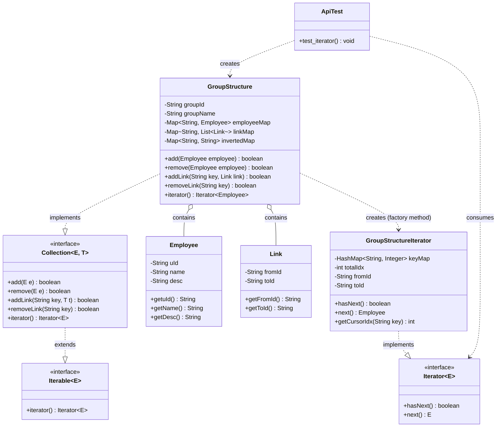
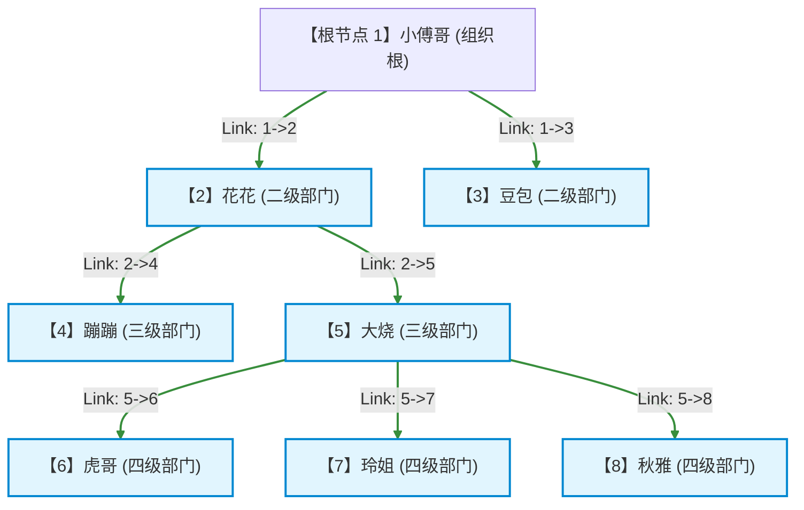
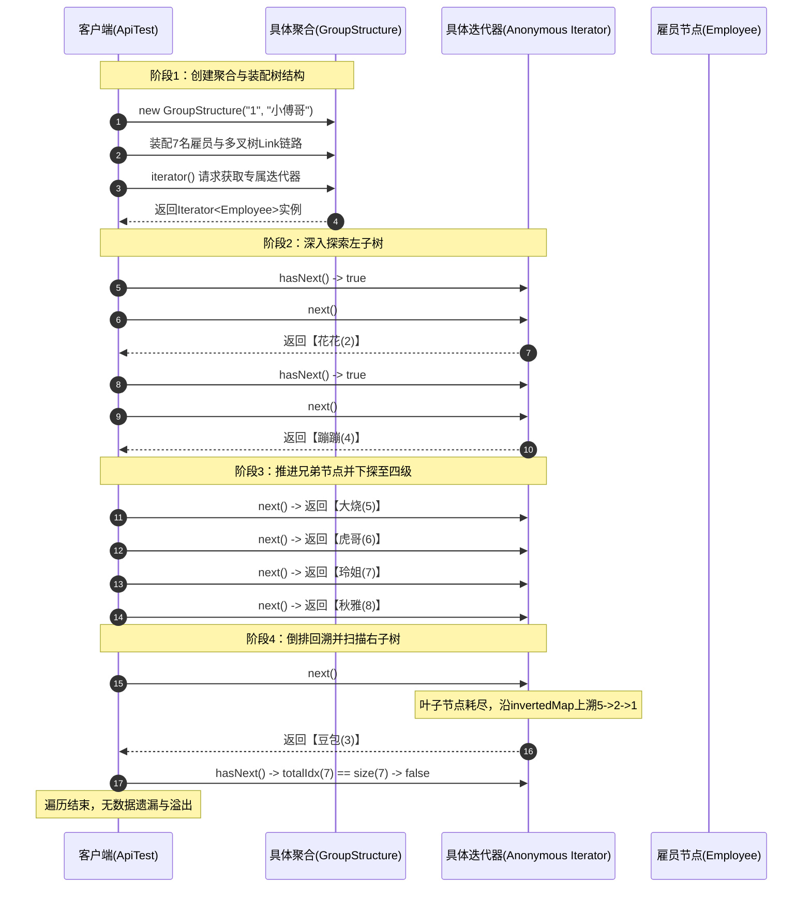

# 迭代器模式：复杂多叉树组织架构遍历与图状态机解耦深度剖析

本文档针对工程 `c3-IteratorPattern` 中的源码，深度剖析在企业复杂多层级组织架构（多叉树/拓扑图）数据管理业务场景下，**迭代器模式（Iterator Pattern）** 的设计哲学、架构实现与实战价值。全文从业务场景、工程结构、算法状态机机制、测试数据流转模拟到开源框架落地进行全景透视，展现迭代器模式如何将复杂的树形分支与回溯逻辑彻底封装，为外部调用者提供极简、安全、解耦的线性顺序遍历体验。

---

## 目录
1. [业务场景背景与非线性复杂数据遍历的挑战](#一业务场景背景与非线性复杂数据遍历的挑战)
   - 1.1 核心业务场景：企业多层级组织架构（多叉树/拓扑图）
   - 1.2 传统遍历模式的困境与痛点剖析
   - 1.3 迭代器模式的核心破局思路
2. [迭代器模式架构设计与工程全局结构](#二迭代器模式架构设计与工程全局结构)
   - 2.1 全局工程目录结构树
   - 2.2 核心模块职责矩阵（GoF 经典 4+3 角色划分）
   - 2.3 迭代器模式核心架构类图（Mermaid ClassDiagram）
   - 2.4 树形拓扑关系与深度优先遍历轨迹图（Mermaid Flowchart）
   - 2.5 核心代码设计特点与架构细节深度解析
3. [核心源码逐行深度剖析与详细注释](#三核心源码逐行深度剖析与详细注释)
   - 3.1 抽象迭代器与可迭代契约：`lang/Iterator.java` & `lang/Iterable.java`
   - 3.2 抽象聚合接口：`lang/Collection.java`
   - 3.3 领域实体与拓扑关系：`group/Employee.java` & `group/Link.java`
   - 3.4 具体聚合与具体迭代器：`group/GroupStructure.java`（带状态机核心算法解析）
   - 3.5 客户端调用：`test/ApiTest.java`
4. [数据流转全景推演与优雅执行模拟](#四数据流转全景推演与优雅执行模拟)
   - 4.1 测试数据与组织架构拓扑装配
   - 4.2 迭代器状态机单步流转推演（7 个节点精准推演表）
   - 4.3 业务流转时序全景图（Mermaid SequenceDiagram）
   - 4.4 控制台运行日志与优雅结果输出
5. [进阶拓展、开源实战与设计模式精要](#五进阶拓展开源实战与设计模式精要)
   - 5.1 传统模式 vs 迭代器模式全维度对比矩阵
   - 5.2 迭代器模式在 JDK（Collection/Fail-Fast机制）与各大框架中的经典应用
   - 5.3 迭代器模式（GoF）设计原则与实战心法总结

---

## 一、业务场景背景与非线性复杂数据遍历的挑战

### 1.1 核心业务场景：企业多层级组织架构（多叉树/拓扑图）

在现代中大型互联网企业或集团型组织中，企业的人事架构往往呈现**多层级、非对称、树状乃至有向网状结构**：
- **顶级组织**：集团总部 / 业务群（如项目中的根组织 `"1"` 对应 `"小傅哥"`）；
- **二级部门**：核心业务部、技术部、运营部（如 `"2"` 花花、`"3"` 豆包）；
- **三级部门**：二级部门下挂的垂直业务组（如 `"2"` 花花名下分管 `"4"` 蹦蹦、`"5"` 大烧）；
- **四级部门**：最基层的项目组或前线战斗单元（如 `"5"` 大烧名下分管 `"6"` 虎哥、`"7"` 玲姐、`"8"` 秋雅）。

在该业务体系中：
1. **元素本身（Employee）** 是业务实体（包含工号、姓名、层级备注）；
2. **关系（Link）** 是节点间的有向边（`fromId -> toId`），构成了一棵具有不定子节点数量的多叉树；
3. **上层业务诉求**：财务核算工资、HR系统发送全员通知、审批流扫描、全员风控审计等业务场景，都需要**将整个组织架构中的所有员工完整、有序、不重不漏地扫描一遍**。

---

### 1.2 传统遍历模式的困境与痛点剖析

如果采用传统的编程思想来完成该组织架构的遍历，往往存在以下四大核心痛点：

#### 痛点 1：将复杂的非线性数据结构暴露给业务调用方
若不使用迭代器，调用方必须直接接触底层存储细节：
```java
// 传统做法：业务调用方必须亲自理解容器内部的复杂 Map 和 Link 列表
Map<String, List<Link>> linkMap = groupStructure.getLinkMap();
Map<String, String> invertedMap = groupStructure.getInvertedMap();
Map<String, Employee> employeeMap = groupStructure.getEmployeeMap();
// 业务方需要自己编写复杂的图查找逻辑
```
调用者被迫与聚合对象的内部实现产生**严重强耦合**。一旦内部改用图数据库、邻接表、二叉树或网络远程 RPC，所有的业务调用方代码全部瘫痪。

#### 痛点 2：业务代码中充斥着脆弱的递归或显式栈操作
遍历多叉树通常依赖递归（DFS）或手动维护 `Stack`。在业务代码中散落递归函数极易导致：
- **递归深度过大引发 `StackOverflowError`**；
- **状态难以中断与恢复**：业务如果只想遍历前 3 个人（分页获取或条件过滤），递归机制很难随时暂停并保存游标状态；
- **难以多线程或多实例并发遍历**：同一个容器若被两个业务同时遍历，递归和共享状态极易引发并发混乱。

#### 痛点 3：违反单一职责原则（SRP）
聚合对象（如 `GroupStructure`）的核心职责是**存储与管理员工及组织关系**（增删改查）。如果再让它承担具体的遍历逻辑（如提供 `traverse()`、`dfs()`、`bfs()` 等方法），容器类的职责就会变得无比臃肿。

#### 痛点 4：无法提供多态的一致性遍历体验
在企业系统中，除了多叉树组织架构外，还有列表（List）、哈希表（Map）、集合（Set）、优先队列等各类容器。如果每种容器的遍历 API 都不一样（有的用 `get(i)`，有的用递归，有的用遍历 Key），调用方的开发与心智成本将呈指数级上升。

---

### 1.3 迭代器模式的核心破局思路

> **GoF 迭代器模式定义**：提供一种方法顺序访问一个聚合对象中各个元素，而又不需要暴露该对象的内部表示。

迭代器模式通过**关注点分离（Separation of Concerns）**，将“**数据存储管理**”与“**数据遍历访问**”彻底解耦：
1. **聚合类（Aggregate）专注存储**：只负责构建多叉树网络并维护好索引映射；
2. **迭代器（Iterator）专注状态机推演**：将游标索引、多叉深入、叶子节点判断、倒排回溯等复杂算法全部封装在迭代器内部；
3. **调用者（Client）面向极简接口**：仅通过标准的 `hasNext()` 判断与 `next()` 取值，像遍历普通数组一样轻松遍历庞大多叉树！

---

## 二、迭代器模式架构设计与工程全局结构

### 2.1 全局工程目录结构树

工程 `c3-IteratorPattern` 遵循高内聚、低耦合的标准模块化架构设计：

```
c3-IteratorPattern
├── pom.xml                                               # Maven 工程依赖配置文件
├── src
│   ├── main
│   │   ├── java
│   │   │   └── com
│   │   │       └── ivanzhao
│   │   │           └── Idesign
│   │   │               ├── group                         # 组织架构业务核心域（聚合与实体）
│   │   │               │   ├── Employee.java             # 【Element】雇员业务实体类
│   │   │               │   ├── Link.java                 # 【Relation】组织多叉树拓扑连线类
│   │   │               │   └── GroupStructure.java       # 【ConcreteAggregate】具体聚合类 & 内部迭代器
│   │   │               └── lang                          # 迭代器基础设施通用框架域
│   │   │                   ├── Collection.java           # 【Aggregate】抽象聚合接口
│   │   │                   ├── Iterable.java             # 【Iterable】可迭代契约接口
│   │   │                   └── Iterator.java             # 【Iterator】抽象迭代器接口
│   │   └── resources                                     # 资源与配置文件目录
│   └── test
│       └── java
│           └── test
│               └── ApiTest.java                          # 【Client】客户端测试与遍历驱动入口
```

---

### 2.2 核心模块职责矩阵（GoF 经典 4+3 角色划分）

在经典的 GoF 迭代器模式基础上，结合本工程的复杂树形业务，系统划分了清晰的职责边界：

| 模式角色 | 工程对应文件 | 职责定位与设计精髓 |
| :--- | :--- | :--- |
| **抽象迭代器 (Iterator)** | [`Iterator.java`](file:///C:/Users/free/Desktop/codeDesign/%E4%BB%A3%E7%A0%81/IDesign/c3-IteratorPattern/src/main/java/com/ivanzhao/Idesign/lang/Iterator.java) | 定义了迭代器的统一协议，包含 `hasNext()` 探测和 `next()` 移动返回。 |
| **可迭代契约 (Iterable)** | [`Iterable.java`](file:///C:/Users/free/Desktop/codeDesign/%E4%BB%A3%E7%A0%81/IDesign/c3-IteratorPattern/src/main/java/com/ivanzhao/Idesign/lang/Iterable.java) | 声明聚合对象具备可迭代能力，声明工厂方法 `Iterator<E> iterator()`。 |
| **抽象聚合角色 (Aggregate)** | [`Collection.java`](file:///C:/Users/free/Desktop/codeDesign/%E4%BB%A3%E7%A0%81/IDesign/c3-IteratorPattern/src/main/java/com/ivanzhao/Idesign/lang/Collection.java) | 继承 `Iterable<E>`，定义元素与拓扑关系的统一维护协议（`add`, `remove`, `addLink`, `removeLink`）。 |
| **具体聚合角色 (ConcreteAggregate)** | [`GroupStructure.java`](file:///C:/Users/free/Desktop/codeDesign/%E4%BB%A3%E7%A0%81/IDesign/c3-IteratorPattern/src/main/java/com/ivanzhao/Idesign/group/GroupStructure.java) | 实现聚合接口，内部封装 `employeeMap`（人员）、`linkMap`（正向拓扑）与 `invertedMap`（倒排索引）。 |
| **具体迭代器角色 (ConcreteIterator)** | [`GroupStructure.java#iterator()`](file:///C:/Users/free/Desktop/codeDesign/%E4%BB%A3%E7%A0%81/IDesign/c3-IteratorPattern/src/main/java/com/ivanzhao/Idesign/group/GroupStructure.java#L137-L220) | 以匿名内部类方式实现抽象迭代器，内部封装带有**记忆与回溯能力**的非递归深度优先遍历状态机。 |
| **聚合元素角色 (Element)** | [`Employee.java`](file:///C:/Users/free/Desktop/codeDesign/%E4%BB%A3%E7%A0%81/IDesign/c3-IteratorPattern/src/main/java/com/ivanzhao/Idesign/group/Employee.java) | 承载人员核心业务数据的实体对象，纯 POJO。 |
| **拓扑关系角色 (Relation Edge)** | [`Link.java`](file:///C:/Users/free/Desktop/codeDesign/%E4%BB%A3%E7%A0%81/IDesign/c3-IteratorPattern/src/main/java/com/ivanzhao/Idesign/group/Link.java) | 承载上级与下级连接关系的轻量有向边对象（`fromId -> toId`）。 |
| **客户端角色 (Client)** | [`ApiTest.java`](file:///C:/Users/free/Desktop/codeDesign/%E4%BB%A3%E7%A0%81/IDesign/c3-IteratorPattern/src/test/java/test/ApiTest.java) | 组装多叉树数据，获取迭代器并调用标准 `while (iterator.hasNext())` 线性处理业务。 |

---

### 2.3 迭代器模式核心架构类图（Mermaid ClassDiagram）



---

### 2.4 树形拓扑关系与深度优先遍历轨迹图（Mermaid Flowchart）

测试用例中装配的组织架构多叉树拓扑结构以及迭代器实际的访问轨迹如下：



#### 迭代器线性输出序列（DFS 前序回溯）：
$$\text{E2 (花花)} \longrightarrow \text{E4 (蹦蹦)} \longrightarrow \text{E5 (大烧)} \longrightarrow \text{E6 (虎哥)} \longrightarrow \text{E7 (玲姐)} \longrightarrow \text{E8 (秋雅)} \longrightarrow \text{E3 (豆包)}$$

---

### 2.5 核心代码设计特点与架构细节深度解析

#### 1. 双向拓扑建模：正向邻接表与倒排父级索引
在树形或图结构的非线性遍历中，最困难的不是“顺流而下”，而是**在叶子节点处如何向上回溯（Backtracking）到尚未遍历完的祖先节点**。
`GroupStructure` 采用了极具工业工程水准的双向索引机制：
- `linkMap (Map<String, List<Link>>)`：**正向邻接链表**。记录每个父节点名下挂载的所有子节点列表，用于向下深入扫描；
- `invertedMap (Map<String, String>)`：**倒排索引表**。记录每个子节点对应的父节点ID（`toId -> fromId`）。当迭代器探测到底层叶子节点时，无需递归堆栈，仅通过 `invertedMap.get(fromId)` 即可瞬间找回父级节点！

#### 2. 无递归有状态状态机：`keyMap` 游标记忆器
常规 DFS 算法使用方法递归，不仅会占用 JVM 调用栈帧，而且迭代过程是“一气呵成”的，无法做到 `next()` 调一次、走一步的交互式按需拉取。
本工程中的具体迭代器实现了一个**基于游标记忆的步进状态机**：
- `keyMap (HashMap<String, Integer>)`：记录**每个父节点当前已经被访问过的子分支下标**；
- 每次调用 `getCursorIdx(key)` 时，取出该父节点当前应访问的子节点序号，并原子自增更新；
- 配合 `while (cursorIdx > links.size() - 1)` 循环与 `invertedMap`，一旦当前节点子分支耗尽，逐层向上退栈寻找兄弟分支。

#### 3. 泛型安全与高扩展性解耦
- `Collection<E, T>` 抽象聚合接口定义了双泛型参数：`E` 为业务实体，`T` 为关系类型。
- 底层存储使用 `ConcurrentHashMap`，在保证多线程读写安全的同时，外部业务只通过 `Iterator<Employee>` 进行访问，完全符合**迪米特法则（最少知道原则）**与**依赖倒置原则（DIP）**。

---

## 三、核心源码逐行深度剖析与详细注释

### 3.1 抽象迭代器与可迭代契约：`lang/Iterator.java` & `lang/Iterable.java`

#### 源码展示与详细逐行注释：[`lang/Iterator.java`](file:///C:/Users/free/Desktop/codeDesign/代码/IDesign/c3-IteratorPattern/src/main/java/com/ivanzhao/Idesign/lang/Iterator.java)
```java
package com.ivanzhao.Idesign.lang;

/**
 * 抽象迭代器接口（Iterator）
 * 
 * ==================== 【迭代器模式核心角色：抽象迭代器 (Iterator)】 ====================
 * 1. 角色定义：定义访问和遍历集合元素的统一契约接口。
 * 2. 核心价值：
 *    - 抹平底层物理数据结构的差异（无论是数组、链表、树、图还是哈希表）；
 *    - 对外暴露极其简单、一致的顺序遍历方式（hasNext 和 next）；
 *    - 使得调用方无需了解底层复杂的数据存储和指针连接细节，即可安全遍历整个数据集合。
 * 
 * @param <E> 集合中元素的泛型类型
 */
public interface Iterator<E> {

    /**
     * 判断集合中是否还有下一个可以访问的元素
     * 
     * @return true 表示还有元素未遍历，false 表示已到达集合末尾
     */
    boolean hasNext();

    /**
     * 获取集合中的下一个元素，并将遍历游标后移一位
     * 
     * @return 下一个元素对象
     */
    E next();

}
```

#### 源码展示与详细逐行注释：[`lang/Iterable.java`](file:///C:/Users/free/Desktop/codeDesign/代码/IDesign/c3-IteratorPattern/src/main/java/com/ivanzhao/Idesign/lang/Iterable.java)
```java
package com.ivanzhao.Idesign.lang;

/**
 * 可迭代契约接口（Iterable）
 * 
 * ==================== 【迭代器模式角色：支持迭代的顶层契约】 ====================
 * 1. 角色作用：表明实现该接口的集合/聚合对象（Aggregate）具备被外部迭代器遍历的能力。
 * 2. 核心方法：提供获取专属迭代器实例的工厂方法 iterator()。
 * 
 * @param <E> 集合元素的类型
 */
public interface Iterable<E> {

    /**
     * 获取访问当前集合的专用迭代器
     * 
     * @return 自定义的抽象迭代器 Iterator<E>
     */
    Iterator<E> iterator();

}
```

---

### 3.2 抽象聚合接口：`lang/Collection.java`

#### 源码展示与详细逐行注释：[`lang/Collection.java`](file:///C:/Users/free/Desktop/codeDesign/代码/IDesign/c3-IteratorPattern/src/main/java/com/ivanzhao/Idesign/lang/Collection.java)
```java
package com.ivanzhao.Idesign.lang;

/**
 * 抽象聚合集合接口（Aggregate）
 * 
 * ==================== 【迭代器模式核心角色：抽象聚合角色 (Aggregate)】 ====================
 * 1. 角色定义：定义存储、添加、删除元素以及创建相应迭代器对象的接口。
 * 2. 核心架构关系：
 *    - 继承自 Iterable<E>，拥有 iterator() 工厂方法；
 *    - 既封装了基础的元素增删行为（add/remove），又支持关系连接（addLink/removeLink）；
 *    - 使得具体聚合容器（如组织架构 GroupStructure）能够将复杂的元素管理与纯粹的迭代遍历行为彻底分离。
 * 
 * @param <E> 集合实体类型（如雇员 Employee）
 * @param <T> 实体拓扑关系类型（如节点连线 Link）
 */
public interface Collection<E, T> extends Iterable<E> {

    /**
     * 向集合中添加一个实体元素
     * @param e 实体对象
     * @return 是否添加成功
     */
    boolean add(E e);

    /**
     * 从集合中移除一个实体元素
     * @param e 待移除对象
     * @return 是否移除成功
     */
    boolean remove(E e);

    /**
     * 建立实体之间的层级关联关系（构建树形或拓扑网络结构）
     * @param key 关系标识（通常为父节点ID）
     * @param t   关系对象（如 Link）
     * @return 是否建立成功
     */
    boolean addLink(String key, T t);

    /**
     * 解除指定节点的层级关系
     * @param key 关系标识
     * @return 是否解除成功
     */
    boolean removeLink(String key);

    /**
     * 创建并返回用于遍历本聚合容器的迭代器实例
     * @return 自定义迭代器 Iterator<E>
     */
    @Override
    Iterator<E> iterator();

}
```

---

### 3.3 领域实体与拓扑关系：`group/Employee.java` & `group/Link.java`

#### 源码展示与详细逐行注释：[`group/Employee.java`](file:///C:/Users/free/Desktop/codeDesign/代码/IDesign/c3-IteratorPattern/src/main/java/com/ivanzhao/Idesign/group/Employee.java)
```java
package com.ivanzhao.Idesign.group;

/**
 * 雇员实体类（Element / Item）
 * 
 * ==================== 【迭代器模式角色：聚合元素对象 (Element)】 ====================
 * 1. 角色定义：存放在聚合容器（Collection / Aggregate）中的业务数据实体。
 * 2. 模式中的作用：
 *    - 作为迭代器 Iterator<Employee> 遍历过程中不断产出并返回的目标对象（E next() 的返回值）；
 *    - 纯粹保存业务属性（雇员ID、姓名、所属部门/描述），不关心任何迭代控制逻辑或指针关系；
 *    - 实现了数据载体与集合遍历逻辑的彻底解耦。
 */
public class Employee {

    /** 雇员全局唯一ID */
    private String uId;

    /** 雇员姓名 */
    private String name;

    /** 雇员备注说明（例如：二级部门、三级部门等层级描述） */
    private String desc;

    public Employee(String uId, String name) {
        this.uId = uId;
        this.name = name;
    }

    public Employee(String uId, String name, String desc) {
        this.uId = uId;
        this.name = name;
        this.desc = desc;
    }

    public String getuId() {
        return uId;
    }

    public void setuId(String uId) {
        this.uId = uId;
    }

    public String getName() {
        return name;
    }

    public void setName(String name) {
        this.name = name;
    }

    public String getDesc() {
        return desc;
    }

    public void setDesc(String desc) {
        this.desc = desc;
    }

}
```

#### 源码展示与详细逐行注释：[`group/Link.java`](file:///C:/Users/free/Desktop/codeDesign/代码/IDesign/c3-IteratorPattern/src/main/java/com/ivanzhao/Idesign/group/Link.java)
```java
package com.ivanzhao.Idesign.group;

/**
 * 拓扑链路/层级关联类（Link / Edge）
 * 
 * ==================== 【迭代器模式角色：聚合容器内部拓扑关系 (Relation / Edge)】 ====================
 * 1. 角色定义：用于构建非线性数据结构（树/多叉树/拓扑图）中节点之间父子上下级关系的边。
 * 2. 模式中的作用：
 *    - 在很多经典迭代器案例中，元素仅以线性数组或链表存放；
 *    - 本案例中，业务组织架构是一个典型的“多叉树”或“有向图”；
 *    - Link 定义了由上级（fromId）指向下级（toId）的父子级联指针，帮助聚合对象构建非线性存储拓扑；
 *    - 迭代器在遍历时借助 Link 的指向关系与逆向查找（invertedMap）进行树形上下级回溯与横向扫描，
 *      进而将复杂的多叉树拓扑结构对外部调用者“压平”为线性的 Iterator 遍历。
 */
public class Link {

    /** 源节点ID（父级/领导节点） */
    private String fromId;

    /** 目标节点ID（子级/下属节点） */
    private String toId;

    public Link(String fromId, String toId) {
        this.fromId = fromId;
        this.toId = toId;
    }

    public String getFromId() {
        return fromId;
    }

    public void setFromId(String fromId) {
        this.fromId = fromId;
    }

    public String getToId() {
        return toId;
    }

    public void setToId(String toId) {
        this.toId = toId;
    }

}
```

---

### 3.4 具体聚合与具体迭代器：`group/GroupStructure.java`

#### 源码展示与详细逐行注释：[`group/GroupStructure.java`](file:///C:/Users/free/Desktop/codeDesign/代码/IDesign/c3-IteratorPattern/src/main/java/com/ivanzhao/Idesign/group/GroupStructure.java)
```java
package com.ivanzhao.Idesign.group;

import com.ivanzhao.Idesign.lang.Collection;
import com.ivanzhao.Idesign.lang.Iterator;

import java.util.HashMap;
import java.util.LinkedList;
import java.util.List;
import java.util.Map;
import java.util.concurrent.ConcurrentHashMap;

/**
 * 组织架构集合类（ConcreteAggregate - 具体聚合角色）
 * 
 * ==================== 【迭代器模式核心角色：具体聚合类 (ConcreteAggregate)】 ====================
 * 1. 角色定义：实现抽象聚合接口（Collection / Aggregate），负责存储和管理具体的数据元素，
 *    并提供创建对应具体迭代器对象（ConcreteIterator）的工厂方法 iterator()。
 * 
 * 2. 本类内部复杂数据结构的设计解耦：
 *    - employeeMap: 存储所有人员信息（底层散列表，Key为雇员ID，Value为雇员实体）；
 *    - linkMap: 存储组织拓扑的有向边（正向索引，Key为父部门/领导ID，Value为直属下级关联列表）；
 *    - invertedMap: 存储向上追溯的父子映射（倒排索引，Key为下属ID，Value为上级ID），用于遍历叶子回溯。
 * 
 * 3. 迭代器模式的核心价值体现：
 *    - 数据组织虽然是极度复杂的“多叉树/拓扑图”非线性网状结构；
 *    - 但是外部客户端（Client）完全不需要理解这些父子指针、倒排映射或递归回溯算法；
 *    - 通过实现 iterator() 方法，将图/树结构的深度优先搜索（DFS）状态机完全封装在 ConcreteIterator 内部，
 *      向外暴露出纯粹而简洁的线性 hasNext() / next() 访问协议。
 */
public class GroupStructure implements Collection<Employee, Link> {

    /** 根组织/顶级部门ID */
    private String groupId;

    /** 组织机构名称 */
    private String groupName;

    /**
     * 雇员实体缓存容器：存储所有节点人员数据
     * Key: 雇员ID(uId), Value: 雇员对象(Employee)
     */
    private Map<String, Employee> employeeMap = new ConcurrentHashMap<>();

    /**
     * 正向拓扑关系容器：记录父节点与其所有直属子节点的关系列表（多叉树向下分支）
     * Key: 父节点ID(fromId), Value: 直属子节点关联关系列表(List<Link>)
     */
    private Map<String, List<Link>> linkMap = new ConcurrentHashMap<>();

    /**
     * 倒排拓扑关系容器：记录子节点对应的直接父节点（多叉树向上回溯指针）
     * Key: 子节点ID(toId), Value: 父节点ID(fromId)
     */
    private Map<String, String> invertedMap = new ConcurrentHashMap<>();

    public GroupStructure(String groupId, String groupName) {
        this.groupId = groupId;
        this.groupName = groupName;
    }

    /**
     * 添加雇员实体到组织架构容器中
     */
    @Override
    public boolean add(Employee employee) {
        employeeMap.put(employee.getuId(), employee);
        return true;
    }

    /**
     * 从组织架构容器中移除雇员
     */
    @Override
    public boolean remove(Employee employee) {
        return null != employeeMap.remove(employee.getuId());
    }

    /**
     * 建立两节点之间的上下级关联链路（构建树形多叉拓扑分支）
     * 
     * @param key  父节点ID
     * @param link 父子关联边对象（fromId -> toId）
     * @return 是否成功建立关系
     */
    @Override
    public boolean addLink(String key, Link link) {
        // 1. 维护倒排索引：记录“子节点 -> 父节点”映射，方便后续在叶子节点回溯父级
        invertedMap.put(link.getToId(), link.getFromId());

        // 2. 维护正向多叉链表：如果当前父节点已存在分支，追加到列表末尾
        if (linkMap.containsKey(key)) {
            return linkMap.get(key).add(link);
        } else {
            // 首次为该父节点创建分支子列表
            LinkedList<Link> links = new LinkedList<>();
            links.add(link);
            linkMap.put(key, links);
            return true;
        }
    }

    /**
     * 解除指定父节点下的所有关系链
     */
    @Override
    public boolean removeLink(String key) {
        return null != linkMap.remove(key);
    }

    /**
     * ==================== 【迭代器工厂方法：创建并返回具体迭代器】 ====================
     * 
     * 此处使用匿名内部类（Anonymous Inner Class）实现具体的抽象迭代器 Iterator<Employee>。
     * 
     * 该迭代器内部维护了非递归、带游标记忆与回溯能力的状态机：
     * 1. 深度优先搜索（DFS）：优先探索当前节点向下的子分支；
     * 2. 游标状态记录（keyMap）：针对每个分支父节点，记录当前已遍历到了第几个子链路索引；
     * 3. 逆向回溯机制（invertedMap）：当一条分支走到叶子节点（或当前层子节点已遍历完）时，
     *    利用倒排索引逐层上溯回退到尚未遍历完兄弟分支的祖先节点继续扫描；
     * 4. 计数器限制（totalIdx）：精确控制总遍历步数，防止死循环越界。
     * 
     * @return com.ivanzhao.Idesign.lang.Iterator<Employee> 抽象迭代器的具体实现实例
     */
    @Override
    public Iterator<Employee> iterator() {

        return new Iterator<Employee>() {

            /**
             * 游标位置映射表：
             * Key: 某一父节点的ID, Value: 该父节点下当前已经访问过的子节点Link索引（从0开始递增）
             */
            private HashMap<String, Integer> keyMap = new HashMap<>();

            /** 已经成功遍历的雇员总数量计数器 */
            private int totalIdx = 0;

            /** 当前扫描所在的父节点ID（初始为根组织groupId） */
            private String fromId = groupId;

            /** 当前扫描到的目标节点ID（初始为根组织groupId） */
            private String toId = groupId;

            /**
             * 判断是否还有未遍历的雇员
             * 当已访问总数小于雇员散列表总大小时，说明仍有雇员尚未访问
             */
            @Override
            public boolean hasNext() {
                return totalIdx < employeeMap.size();
            }

            /**
             * 迭代核心：获取下一个雇员，并驱动树形遍历游标推进一步
             * 
             * 算法流程：
             * 1. 尝试以当前 toId 作为父节点向下探测子分支（向下深入）；
             * 2. 若当前节点为叶子节点（无子分支），则退回当前同级（以 fromId 为基准继续推进下一个兄弟节点）；
             * 3. 若同级兄弟节点全部访问完毕（cursorIdx > links.size() - 1），通过 invertedMap 逐级向上回溯（Backtracking）；
             * 4. 命中有效子链路后，更新 fromId、toId 状态，累加已访问计数 totalIdx，最终返回雇员实体。
             */
            @Override
            public Employee next() {

                // 尝试向下获取目标节点的子关联列表
                List<Link> links = linkMap.get(toId);
                int cursorIdx = getCursorIdx(toId);

                // 阶段一：叶子节点判断——若当前节点没有子分支，退回同级，从当前父节点继续获取后续兄弟节点
                if (null == links) {
                    cursorIdx = getCursorIdx(fromId);
                    links = linkMap.get(fromId);
                }

                // 阶段二：逐级向上回溯——若当前父节点下的所有子分支都已遍历完毕，沿着倒排链向上追溯
                while (cursorIdx > links.size() - 1) {
                    fromId = invertedMap.get(fromId);
                    cursorIdx = getCursorIdx(fromId);
                    links = linkMap.get(fromId);
                }

                // 阶段三：获取命中分支的关联边，更新迭代状态机指针
                Link link = links.get(cursorIdx);
                toId = link.getToId();
                fromId = link.getFromId();
                totalIdx++;

                // 阶段四：从员工哈希表中取出对应实体返回给客户端
                return employeeMap.get(link.getToId());
            }

            /**
             * 获取并递增指定节点对应的子分支遍历游标
             * 
             * @param key 节点ID
             * @return 当前可用的子分支下标索引
             */
            public int getCursorIdx(String key) {
                int idx = 0;
                if (keyMap.containsKey(key)) {
                    idx = keyMap.get(key);
                    keyMap.put(key, ++idx);
                } else {
                    keyMap.put(key, idx);
                }
                return idx;
            }

        };

    }

}
```

---

### 3.5 客户端调用：`test/ApiTest.java`

#### 源码展示与详细逐行注释：[`test/ApiTest.java`](file:///C:/Users/free/Desktop/codeDesign/代码/IDesign/c3-IteratorPattern/src/test/java/test/ApiTest.java)
```java
package test;

import com.ivanzhao.Idesign.group.Employee;
import com.ivanzhao.Idesign.group.GroupStructure;
import com.ivanzhao.Idesign.group.Link;
import com.ivanzhao.Idesign.lang.Iterator;
import org.junit.Test;
import org.slf4j.Logger;
import org.slf4j.LoggerFactory;

/**
 * 客户端测试类（Client）
 * 
 * ==================== 【迭代器模式角色：外部客户端 (Client)】 ====================
 * 1. 角色职责：
 *    - 构建聚合容器（GroupStructure），向其中装配业务实体（Employee）与拓扑层级（Link）；
 *    - 通过面向接口编程（调用 iterator() 方法获取抽象迭代器 Iterator<Employee>）；
 *    - 仅依赖标准的 hasNext() 与 next() 协议遍历整个多叉树组织架构。
 * 
 * 2. 迭代器模式解耦优势验证：
 *    - 客户端完全不需要感知组织架构内部是用的多重 Map、倒排索引，还是多叉树结构；
 *    - 客户端也不需要编写深度递归函数或管理回溯堆栈；
 *    - 即使底层存储从树形拓扑换成图、链表或网络拉取，外部客户端遍历代码完全无需任何变更！
 */
public class ApiTest {

    private Logger logger = LoggerFactory.getLogger(ApiTest.class);

    @Test
    public void test_iterator() {
        // 1. 初始化具体聚合容器（设置根节点ID为 "1"，组织名为 "小傅哥"）
        GroupStructure groupStructure = new GroupStructure("1", "小傅哥");

        // 2. 填充元素实体（雇员数据，共 7 名员工）
        groupStructure.add(new Employee("2", "花花", "二级部门"));
        groupStructure.add(new Employee("3", "豆包", "二级部门"));
        groupStructure.add(new Employee("4", "蹦蹦", "三级部门"));
        groupStructure.add(new Employee("5", "大烧", "三级部门"));
        groupStructure.add(new Employee("6", "虎哥", "四级部门"));
        groupStructure.add(new Employee("7", "玲姐", "四级部门"));
        groupStructure.add(new Employee("8", "秋雅", "四级部门"));

        // 3. 构建多叉树层级拓扑关系（Link：fromId -> toId）
        // 根节点 "1" -> 二级部门 "2"(花花), "3"(豆包)
        groupStructure.addLink("1", new Link("1", "2"));
        groupStructure.addLink("1", new Link("1", "3"));

        // 二级节点 "2" -> 三级部门 "4"(蹦蹦), "5"(大烧)
        groupStructure.addLink("2", new Link("2", "4"));
        groupStructure.addLink("2", new Link("2", "5"));

        // 三级节点 "5" -> 四级部门 "6"(虎哥), "7"(玲姐), "8"(秋雅)
        groupStructure.addLink("5", new Link("5", "6"));
        groupStructure.addLink("5", new Link("5", "7"));
        groupStructure.addLink("5", new Link("5", "8"));

        // 4. 【核心体现】：通过聚合对象获取抽象迭代器实例
        Iterator<Employee> iterator = groupStructure.iterator();

        // 5. 【核心体现】：统一且优雅的线性遍历，完全屏蔽底层树形/回溯细节
        logger.info("==================== 开始遍历多叉树组织架构 ====================");
        while (iterator.hasNext()) {
            Employee employee = iterator.next();
            logger.info("{} 雇员 ID：{} Name：{}", employee.getDesc(), employee.getuId(), employee.getName());
        }
        logger.info("==================== 组织架构遍历结束 ====================");

    }

}
```

---

## 四、数据流转全景推演与优雅执行模拟

### 4.1 测试数据与组织架构拓扑装配

在 `ApiTest` 执行时，内存中构建了如下三张映射表：

1. **`employeeMap`（员工数据池，共 7 人）**：
   - `"2"` $\to$ 花花（二级部门）
   - `"3"` $\to$ 豆包（二级部门）
   - `"4"` $\to$ 蹦蹦（三级部门）
   - `"5"` $\to$ 大烧（三级部门）
   - `"6"` $\to$ 虎哥（四级部门）
   - `"7"` $\to$ 玲姐（四级部门）
   - `"8"` $\to$ 秋雅（四级部门）

2. **`linkMap`（正向多叉链表）**：
   - `"1"` $\to$ `[Link(1, 2), Link(1, 3)]`（长度 2）
   - `"2"` $\to$ `[Link(2, 4), Link(2, 5)]`（长度 2）
   - `"5"` $\to$ `[Link(5, 6), Link(5, 7), Link(5, 8)]`（长度 3）

3. **`invertedMap`（倒排父级映射，用于回溯）**：
   - `"2" -> "1"`, `"3" -> "1"`
   - `"4" -> "2"`, `"5" -> "2"`
   - `"6" -> "5"`, `"7" -> "5"`, `"8" -> "5"`

---

### 4.2 迭代器状态机单步流转推演（7 个节点精准推演表）

初始化状态：`fromId = "1"`, `toId = "1"`, `totalIdx = 0`, `keyMap = {}`。

| 步骤 | 触发方法 | 探测 `links` 与游标取值 | 分支命中与状态变化 | 回溯动作 | `totalIdx` 变化 | 本步产出元素 |
| :---: | :---: | :--- | :--- | :--- | :---: | :--- |
| **Step 1** | `next()` | `toId="1"` 命中 `links=linkMap.get("1")`（大小2）。<br>`getCursorIdx("1")` 返回 `0`，`keyMap={"1": 0}`。 | 命中 `Link(1, 2)`。<br>`fromId="1"`, `toId="2"`。 | 无回溯（向下深入） | $0 \to 1$ | **花花 (ID: 2)** |
| **Step 2** | `next()` | `toId="2"` 命中 `links=linkMap.get("2")`（大小2）。<br>`getCursorIdx("2")` 返回 `0`，`keyMap={"1":0, "2":0}`。 | 命中 `Link(2, 4)`。<br>`fromId="2"`, `toId="4"`。 | 无回溯（向下深入） | $1 \to 2$ | **蹦蹦 (ID: 4)** |
| **Step 3** | `next()` | `toId="4"` 对应 `links=null`（节点4为叶子）。<br>执行阶段一：`links=linkMap.get("2")`。<br>`getCursorIdx("2")` 递增返回 `1`，`keyMap={"2": 1}`。 | 命中 `Link(2, 5)`。<br>`fromId="2"`, `toId="5"`。 | 同级兄弟节点推进 | $2 \to 3$ | **大烧 (ID: 5)** |
| **Step 4** | `next()` | `toId="5"` 命中 `links=linkMap.get("5")`（大小3）。<br>`getCursorIdx("5")` 返回 `0`，`keyMap={"5": 0}`。 | 命中 `Link(5, 6)`。<br>`fromId="5"`, `toId="6"`。 | 无回溯（向下深入） | $3 \to 4$ | **虎哥 (ID: 6)** |
| **Step 5** | `next()` | `toId="6"` 对应 `links=null`（节点6为叶子）。<br>退回 `fromId="5"`，`getCursorIdx("5")` 递增返回 `1`。 | 命中 `Link(5, 7)`。<br>`fromId="5"`, `toId="7"`。 | 同级兄弟节点推进 | $4 \to 5$ | **玲姐 (ID: 7)** |
| **Step 6** | `next()` | `toId="7"` 对应 `links=null`（节点7为叶子）。<br>退回 `fromId="5"`，`getCursorIdx("5")` 递增返回 `2`。 | 命中 `Link(5, 8)`。<br>`fromId="5"`, `toId="8"`。 | 同级兄弟节点推进 | $5 \to 6$ | **秋雅 (ID: 8)** |
| **Step 7** | `next()` | `toId="8"` 为叶子，`getCursorIdx("5")` 递增返回 `3`。<br>由于 `3 > links.size()-1`（2），**触发上级倒排回溯**！ | ① 从 `"5"` 回溯到 `"2"`，`getCursorIdx("2")` 返回 2 > 1；<br>② 再从 `"2"` 回溯到 `"1"`，`getCursorIdx("1")` 返回 1。<br>在根节点命中 `Link(1, 3)`！<br>`fromId="1"`, `toId="3"`。 | **跨层逆向向上回溯**<br>`5 -> 2 -> 1` | $6 \to 7$ | **豆包 (ID: 3)** |
| **Step 8** | `hasNext()` | 检查 `totalIdx (7) < employeeMap.size() (7)`，条件为 **`false`**！ | 遍历自然结束，退出循环。 | - | 7 | 退出循环 |

> [!TIP]
> **算法亮点总结**：
> 在 Step 7 中，四级部门的所有员工（6、7、8）均已访问完毕，三级部门（5）和二级部门（2）名下分支也已穷尽。此时状态机通过 `while` 循环和 `invertedMap`，瞬间沿树干连续**回跳两级**回溯到根节点 `"1"`，准确抓取到尚未遍历的二级部门分支 `"3"`（豆包）。整个回溯过程完全自洽，对客户端而言毫无感知！

---

### 4.3 业务流转时序全景图（Mermaid SequenceDiagram）



---

### 4.4 控制台运行日志与优雅结果输出

执行测试方法 `ApiTest#test_iterator`，控制台打印出整洁的扫描日志：

```log
23:19:09.746 [main] INFO  test.ApiTest - ==================== 开始遍历多叉树组织架构 ====================
23:19:09.750 [main] INFO  test.ApiTest - 二级部门 雇员 ID：2 Name：花花
23:19:09.751 [main] INFO  test.ApiTest - 三级部门 雇员 ID：4 Name：蹦蹦
23:19:09.751 [main] INFO  test.ApiTest - 三级部门 雇员 ID：5 Name：大烧
23:19:09.751 [main] INFO  test.ApiTest - 四级部门 雇员 ID：6 Name：虎哥
23:19:09.751 [main] INFO  test.ApiTest - 四级部门 雇员 ID：7 Name：玲姐
23:19:09.751 [main] INFO  test.ApiTest - 四级部门 雇员 ID：8 Name：秋雅
23:19:09.751 [main] INFO  test.ApiTest - 二级部门 雇员 ID：3 Name：豆包
23:19:09.751 [main] INFO  test.ApiTest - ==================== 组织架构遍历结束 ====================
```

---

## 五、进阶拓展、开源实战与设计模式精要

### 5.1 传统模式 vs 迭代器模式全维度对比矩阵

| 评估维度 | 传统递归/硬编码遍历模式 | 迭代器模式重构升级 |
| :--- | :--- | :--- |
| **封装性** | 差。调用者必须知晓 `linkMap`、`invertedMap` 等内部底层数据结构 | **极高**。聚合容器对外部完全黑盒化，仅暴露 `hasNext()` 与 `next()` |
| **代码耦合度** | 强耦合。遍历代码直接侵入在业务层或容器类内部 | **完全解耦**。数据容器与遍历行为职责独立，互不影响 |
| **内存与堆栈开销** | 递归方式依赖 JVM 方法调用栈，层级深时有 `StackOverflowError` 风险 | **极低**。游标步进式状态机，仅占用极小常数级堆内存 |
| **遍历控制灵活性** | 极差。递归一旦开始很难随时暂停、取消或分批按需拉取 | **极佳**。支持步进控制、按需取值，与分页、流式处理天然契合 |
| **并发与多遍历器支持** | 差。若多个线程同时遍历同一个容器，共享游标会导致严重冲突 | **优秀**。每次调用 `iterator()` 都会生成独立迭代器实例，互不干扰 |
| **API 一致性** | 杂乱。数组用下标，树用递归，Map 用 keySet，学习成本高 | **标准化**。全系统所有数据聚合遵循统一迭代契约，符合直觉 |

---

### 5.2 迭代器模式在 JDK 与各大主流框架中的经典应用

迭代器模式是 Java 生态中使用最广泛、最不可或缺的设计模式之一：

#### 1. JDK 集合体系（`java.lang.Iterable` & `java.util.Iterator`）
- Java 标准库中的 `List`、`Set`、`Queue` 等全部继承自 `Iterable<T>`；
- Java 的 **`foreach` 语法糖（`for (T item : collection)`）** 底层正是通过编译为 `iterator.hasNext()` 和 `iterator.next()` 来实现的；
- **Fail-Fast（快速失败）机制**：JDK 中的迭代器（如 `ArrayList.Itr`）内部维护了 `expectedModCount`。如果在遍历过程中集合被外部并发修改（`modCount != expectedModCount`），迭代器会立即抛出 `ConcurrentModificationException`，确保多线程数据一致性。

#### 2. MyBatis 中的 `Cursor` 游标迭代器
- 在大数据量查询场景下，如果直接返回 `List<User>`，数百万条数据会瞬间打爆 JVM 内存产生 OOM；
- MyBatis 提供了 `Cursor<T>` 游标对象，其本质就是一个迭代器。通过 JDBC 底层的流式结果集（Streaming ResultSet），业务方使用 `cursor.forEach()` 逐行从数据库拉取并消费数据，以极低的内存消耗处理千万级数据。

#### 3. Netty / Spring Data 中的流式遍历与反应式响应
- 在反应式编程规范（Reactive Streams / Project Reactor / RxJava）中，`Publisher-Subscriber` 机制本质上是**迭代器模式由“拉模式（Pull）”向“推模式（Push）”的双对偶（Dual）演进**，其底层依然围绕数据流的逐项处理与背压控制（Backpressure）展开。

---

### 5.3 迭代器模式（GoF）设计原则与实战心法总结

1. **单一职责原则（Single Responsibility Principle）**：
   一个集合应该只负责“**管理数据**”，而不应该负责“**遍历数据**”。将遍历逻辑抽取到迭代器中，使得聚合类更加纯粹稳定。
2. **开闭原则（Open-Closed Principle）**：
   如果未来系统需要提供另一种遍历策略（例如：广度优先遍历 BFS、按职级倒序遍历、或者过滤只看管理层人员），只需新编写一个实现了 `Iterator<Employee>` 的具体迭代器类即可，**原有聚合类和现有业务代码完全不需要修改**！
3. **迪米特法则（Law of Demeter）**：
   客户端除了通过迭代器接口获取下一个元素外，不需要和集合内部的复杂引用（如 `Link`、`Map`、指针）发生任何交集，极大收敛了系统的认知负荷与变更风险。
