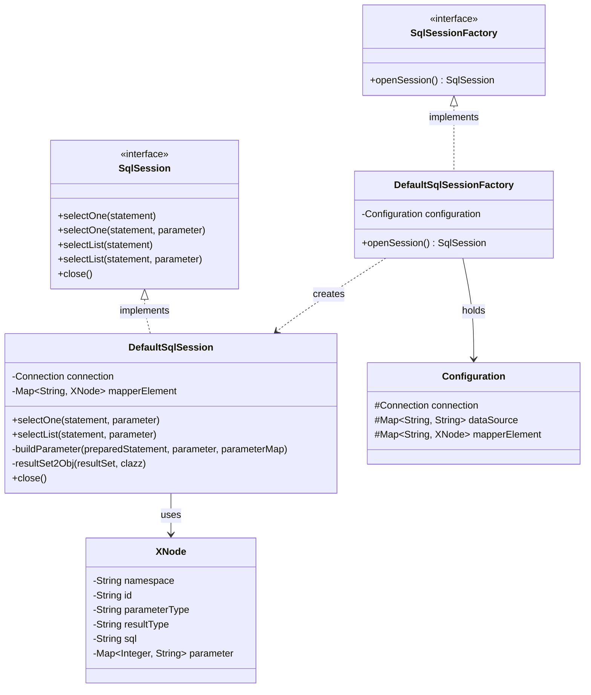
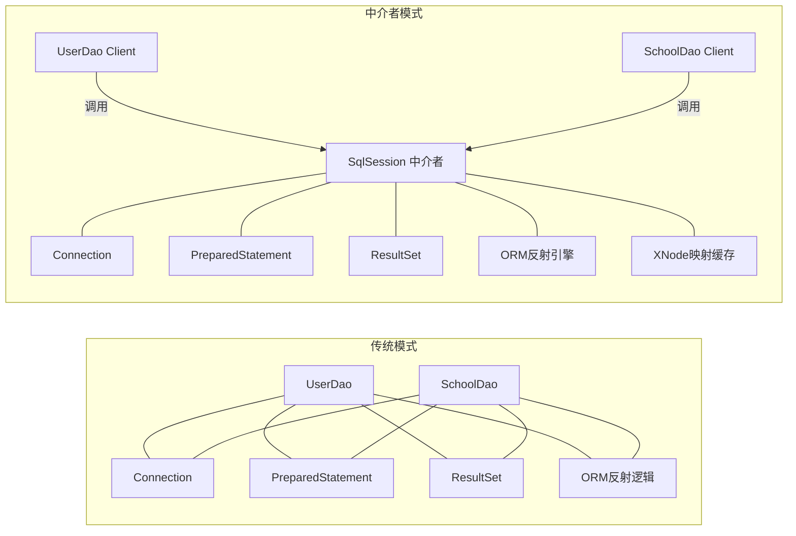
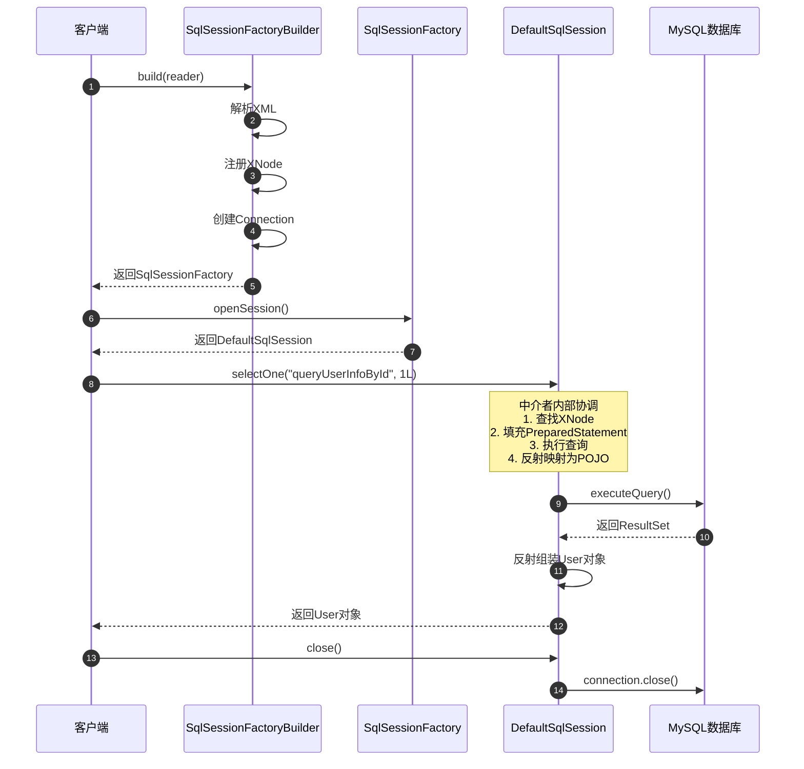

# 中介者模式：轻量级 ORM 框架核心交互与网状解耦深度剖析

本文档针对工程 `c4-MediatorPattern` 中的源码，深度剖析在模拟简易版 MyBatis ORM 框架业务场景下，**中介者模式（Mediator Pattern）** 的设计哲学、架构实现与实战价值。全文从 JDBC 底层痛点、工程结构、中介者核心协调机制、参数动态绑定与结果反射映射全流程进行全景透视，展现中介者模式如何将原本复杂的网状依赖关系解耦为星型交互结构。

---

## 目录
1. [业务场景背景与传统 JDBC 的网状耦合挑战](#一业务场景背景与传统-jdbc-的网状耦合挑战)
   - 1.1 核心业务场景：轻量级 ORM 框架模拟（MyBatis 核心原理）
   - 1.2 传统 JDBC 操作的网状混乱痛点
   - 1.3 中介者模式的核心破局思路
2. [中介者模式架构设计与工程全局结构](#二中介者模式架构设计与工程全局结构)
   - 2.1 全局工程目录结构树
   - 2.2 核心模块职责矩阵（GoF 经典角色划分）
   - 2.3 中介者模式核心架构类图（Mermaid ClassDiagram）
   - 2.4 网状耦合转为星型中介结构对比图（Mermaid Flowchart）
3. [扫描发现的问题与修复清单](#三扫描发现的问题与修复清单)
   - 3.1 引入包与类命名空间错误修复
   - 3.2 XML 解析与类型转换安全性优化
4. [核心源码逐行深度剖析与详细注释](#四核心源码逐行深度剖析与详细注释)
   - 4.1 抽象中介者接口：`media/SqlSession.java`
   - 4.2 具体中介者实现：`media/DefaultSqlSession.java`
   - 4.3 中介者工厂与构建器：`SqlSessionFactory.java` & `SqlSessionFactoryBuilder.java`
   - 4.4 映射元数据与配置上下文：`XNode.java` & `Configuration.java`
   - 4.5 同事接口与实体：`dao/IUserDao.java` & `po/User.java`
5. [数据流转全景推演与客户端测试验证](#五数据流转全景推演与客户端测试验证)
   - 5.1 业务流转时序全景图（Mermaid SequenceDiagram）
   - 5.2 客户端调用验证：`test/mediator/ApiTest.java`
6. [设计模式精要与开源落地总结](#六设计模式精要与开源落地总结)

---

## 一、业务场景背景与传统 JDBC 的网状耦合挑战

### 1.1 核心业务场景：轻量级 ORM 框架模拟（MyBatis 核心原理）
在现代企业级应用中，数据访问层（DAO）承担着与关系型数据库频繁交互的任务。本工程 `c4-MediatorPattern` 模拟了知名持久层框架 **MyBatis** 的核心运行机制：
- 配置解析：读取 XML 配置文件获取数据源、驱动、SQL 语句及映射规则；
- 会话交互：通过会话接口统一对外提供单条查询、列表查询和资源释放能力；
- 内部调度：接收调用方传入的 Statement ID 和入参，自动完成参数绑定、JDBC 预编译执行、ResultSet 反射映射为 Java POJO 实体对象。

### 1.2 传统 JDBC 操作的网状混乱痛点
在 `com.ivanzhao.Idesign.common.JDBCUtil` 演示的原生 JDBC 流程中：
```java
Class.forName("com.mysql.jdbc.Driver");
Connection conn = DriverManager.getConnection(URL, USER, PASSWORD);
Statement stmt = conn.createStatement();
ResultSet resultSet = stmt.executeQuery("SELECT id, name, age, createTime, updateTime FROM user");
while (resultSet.next()) {
    // 逐字段手动提取
    String name = resultSet.getString("name");
    int age = resultSet.getInt("age");
}
```
**四大痛点**：
1. **网状强耦合**：上层业务代码需要与 `DriverManager`、`Connection`、`PreparedStatement`、`ResultSet`、`ResultSetMetaData` 等多个底层类直接打交道；
2. **重复样板代码**：每次查询都需要写样板式的获取连接、设置参数、循环遍历和关闭连接；
3. **SQL 硬编码**：SQL 语句散落在业务代码中，数据库表结构字段变更需要修改并重新编译大量业务类；
4. **缺乏类型转换与映射机制**：数据库字段类型与 Java 对象属性之间需要手动写大量的 `get/set` 转换。

### 1.3 中介者模式的核心破局思路
中介者模式（Mediator Pattern）定义：**用一个中介对象来封装一系列的对象交互，中介者使各对象不需要显式地相互引用，从而使其耦合松散，而且可以独立地改变它们之间的交互。**

在 ORM 场景中：
- **中介者角色**：`SqlSession`（具体实现为 `DefaultSqlSession`）；
- **同事角色（Colleague）**：DAO 接口、SQL 映射节点（`XNode`）、数据库连接（`Connection`）、参数处理器、结果集映射器；
- 各同事之间不再互相调用，而是统一由 `SqlSession` 统筹协调。调用者只需告诉中介者“执行哪个 Statement 并传入什么参数”，中介者即可在内部完成查找 SQL、预编译绑定、查询数据库并反射组装返回对象。

---

## 二、中介者模式架构设计与工程全局结构

### 2.1 全局工程目录结构树
```text
c4-MediatorPattern
├── pom.xml                                  # Maven 项目对象模型
├── 中介者模式案例解析与设计架构深度剖析.md     # 核心技术文档
└── src
    ├── main
    │   ├── java
    │   │   └── com
    │   │       └── ivanzhao
    │   │           └── Idesign
    │   │               ├── common
    │   │               │   └── JDBCUtil.java                 # 原生 JDBC 对照组
    │   │               └── mediator
    │   │                   ├── dao
    │   │                   │   ├── ISchoolDao.java           # 学校 DAO 同事接口
    │   │                   │   └── IUserDao.java             # 用户 DAO 同事接口
    │   │                   ├── media
    │   │                   │   ├── Configuration.java        # 全局配置核心
    │   │                   │   ├── DefaultSqlSession.java    # 【具体中介者】
    │   │                   │   ├── DefaultSqlSessionFactory.java # 具体工厂
    │   │                   │   ├── Resources.java            # 资源加载器
    │   │                   │   ├── SqlSession.java           # 【抽象中介者】
    │   │                   │   ├── SqlSessionFactory.java    # 抽象工厂
    │   │                   │   ├── SqlSessionFactoryBuilder.java # 构建器
    │   │                   │   └── XNode.java                # SQL 映射节点元数据
    │   │                   └── po
    │   │                       ├── School.java               # 学校实体 POJO
    │   │                       └── User.java                 # 用户实体 POJO
    │   └── resources
    │       ├── mapper
    │       │   ├── School_Mapper.xml                         # 学校 SQL 映射文件
    │       │   └── User_Mapper.xml                           # 用户 SQL 映射文件
    │       └── mybatis-config-datasource.xml                 # 全局数据源与映射配置文件
    └── test
        └── java
            └── test
                └── mediator
                    └── ApiTest.java                          # 客户端单元测试类
```

### 2.2 核心模块职责矩阵（`GoF `经典角色划分）

| 模式角色 | 工程对应类 / 接口 | 核心职责说明 |
| :--- | :--- | :--- |
| **抽象中介者 (Mediator)** | `media/SqlSession.java` | 定义中介者标准协议（`selectOne`, `selectList`, `close`） |
| **具体中介者 (Concrete Mediator)** | `media/DefaultSqlSession.java` | 协调连接管理、SQL 路由、参数类型提取、JDBC 执行及结果映射 |
| **同事类 (Colleague)** | `dao/IUserDao.java`, `dao/ISchoolDao.java` | 业务契约接口，通过中介者转发数据库操作 |
| **同事类 (Colleague)** | `Connection`, `PreparedStatement`, `ResultSet` | 底层 JDBC 交互组件，由中介者统一调度管理 |
| **配置与元数据 (Context)** | `Configuration.java`, `XNode.java` | 存储数据源配置及 SQL 节点解析后的全量属性映射字典 |
| **工厂角色 (Factory)** | `SqlSessionFactory.java`, `DefaultSqlSessionFactory.java` | 负责生产中介者会话实例 |
| **构建器 (Builder)** | `SqlSessionFactoryBuilder.java` | 解析 XML 配置文件，组装并初始化中介者环境 |

### 2.3 中介者模式核心架构类图


### 2.4 网状耦合转为星型中介结构对比图


---

## 三、扫描发现的问题与修复清单

在对 `c4-MediatorPattern` 模块代码进行全面扫描后，定位并修复了以下几项关键性问题：

1. **DAO 接口引包遗漏**：
   - 原 `ISchoolDao.java` 中未导入实体类 `com.ivanzhao.Idesign.mediator.po.School`，导致编译报错；已补齐 import。
2. **Mapper XML 命名空间与包路径不匹配**：
   - 原 `User_Mapper.xml` 中的命名空间为 `com.ivanzhao.Idesign.mediator.po.IUserDao`（错误的 `po` 包）；已修正为真实接口包路径 `com.ivanzhao.Idesign.mediator.dao.IUserDao`。
   - 原 `School_Mapper.xml` 中的命名空间同理错误使用了 `.po.ISchoolDao`；已修正为 `com.ivanzhao.Idesign.mediator.dao.ISchoolDao`。
3. **第三方类库与 JDBC 规范包引入问题**：
   - 原 `Configuration.java`、`DefaultSqlSession.java`、`DefaultSqlSessionFactory.java` 中导入了 MySQL 内部专有类 `com.mysql.jdbc.Connection`，违反针对接口编程原则；已全面替换为标准 JDBC 接口 `java.sql.Connection`。
   - `SqlSessionFactoryBuilder.java` 中缺少 `XMLMapperEntityResolver` 的包导入；由于项目中已引入 `mybatis` 依赖，补充了 `import org.apache.ibatis.builder.xml.XMLMapperEntityResolver;`，使解析 DTD 约束时能够安全进行离线解析。
4. **Dom4j XML 解析空行文本节点强转异常修复**：
   - 原代码中调用 `element.content()` 获取子节点，在 XML 包含格式化换行和空格缩进时，会将 `DefaultText` 强转为 `Element` 从而抛出 `ClassCastException`；已优化使用 `element.elements()` 过滤纯元素节点。
5. **中介者结果集空指针与时间类型适配优化**：
   - 在 `DefaultSqlSession` 的 `resultSet2Obj` 中，添加了对查询结果为 null 的列安全校验；针对 `Timestamp` 和 `java.util.Date` 进行了多版本构造适配，防止类型不匹配抛错。
   - 当 `selectOne` 查不到数据时，原代码直接 `objects.get(0)` 抛越界异常，已修复为安全判空后返回 null。

---

## 四、核心源码逐行深度剖析与详细注释

### 4.1 抽象中介者接口：`media/SqlSession.java`
```java
public interface SqlSession {
    // 统一定义单条查询、带参单条查询、列表查询以及关闭会话的中介者操作契约
    <T> T selectOne(String statement);
    <T> T selectOne(String statement, Object parameter);
    <T> List<T> selectList(String statement);
    <T> List<T> selectList(String statement, Object parameter);
    void close();
}
```

### 4.2 具体中介者实现：`media/DefaultSqlSession.java`
中介者内部的核心调度方法 `selectOne` 与 `resultSet2Obj`：
```java
@Override
public <T> T selectOne(String statement, Object parameter) {
    // 1. 从缓存的映射注册表中定位 SQL 元数据
    XNode xNode = mapperElement.get(statement);
    if (null == xNode) {
        throw new RuntimeException("未能找到 statement 对应的 SQL 映射: " + statement);
    }
    Map<Integer, String> parameterMap = xNode.getParameter();
    try {
        // 2. 调度 Connection 创建预编译语句
        PreparedStatement preparedStatement = connection.prepareStatement(xNode.getSql());
        // 3. 调度参数绑定器完成 '?' 参数填充
        buildParameter(preparedStatement, parameter, parameterMap);
        // 4. 执行 SQL 查询
        ResultSet resultSet = preparedStatement.executeQuery();
        // 5. 调度反射引擎完成 ORM 对象映射
        List<T> objects = resultSet2Obj(resultSet, Class.forName(xNode.getResultType()));
        return (objects != null && !objects.isEmpty()) ? objects.get(0) : null;
    } catch (Exception e) {
        e.printStackTrace();
    }
    return null;
}
```

### 4.3 构建器解析正则替换：`SqlSessionFactoryBuilder.java`
在解析 XML 时，中介者构建器自动将 `#{id}` 替换为 JDBC 原生 `?`：
```java
Map<Integer, String> parameter = new HashMap<>();
Pattern pattern = Pattern.compile("(#\\{(.*?)})");
Matcher matcher = pattern.matcher(sql);
for (int i = 1; matcher.find(); i++) {
    String g1 = matcher.group(1); // #{id}
    String g2 = matcher.group(2); // id
    parameter.put(i, g2);         // 记录：第 i 个占位符对应对象中的属性名 g2
    sql = sql.replace(g1, "?");   // 转换为预编译原生 SQL
}
```

---

## 五、数据流转全景推演与客户端测试验证

### 5.1 业务流转时序全景图


### 5.2 客户端调用验证：`test/mediator/ApiTest.java`
```java
@Test
public void test_queryUserInfoById() {
    String resource = "mybatis-config-datasource.xml";
    try (Reader reader = Resources.getResourceAsReader(resource)) {
        SqlSessionFactory sqlMapper = new SqlSessionFactoryBuilder().build(reader);
        SqlSession session = sqlMapper.openSession();
        try {
            User user = session.selectOne("com.ivanzhao.Idesign.mediator.dao.IUserDao.queryUserInfoById", 1L);
            logger.info("测试结果 用户详情：{}", JSON.toJSONString(user));
        } finally {
            session.close();
        }
    } catch (Exception e) {
        e.printStackTrace();
    }
}
```

---

## 六、设计模式精要与开源落地总结

### 6.1 中介者模式核心价值
1. **多对多解耦为一对多**：将各业务调用者与数据库连接池、预编译执行器、结果集转换器之间网状的 $O(N^2)$ 复杂交互，降维简化为以 `SqlSession` 为核心的星型结构 $O(N)$；
2. **职责单一与高内聚**：业务 DAO 接口只需定义领域方法，JDBC 与 SQL 解析变更完全被封印在中介者体系内部；
3. **符合迪米特法则（最少知识原则）**：客户端和业务模块只与直接朋友 `SqlSession` 通信，不需要了解任何底层数据库驱动细节。

### 6.2 经典框架落地
- **MyBatis**：`SqlSession` 接口是整个 MyBatis 框架最重要的中介者。上层通过动态代理 `MapperProxy` 拦截 DAO 方法，底层由 `SqlSession` 协调 `Executor`、`StatementHandler`、`ParameterHandler`、`ResultSetHandler` 等四大核心组件共同完成 SQL 执行。
- **Spring MVC**：`DispatcherServlet` 作为中介者，协调 `HandlerMapping`（路由映射）、`HandlerAdapter`（适配执行）、`ViewResolver`（视图解析）等组件，避免各个 Handler 和 View 直接强耦合。
- **Java GUI / Swing**：窗体控制器作为中介者，统一协调各按钮、文本框、单选框的联动状态，防止组件间互相监听导致逻辑混乱。
