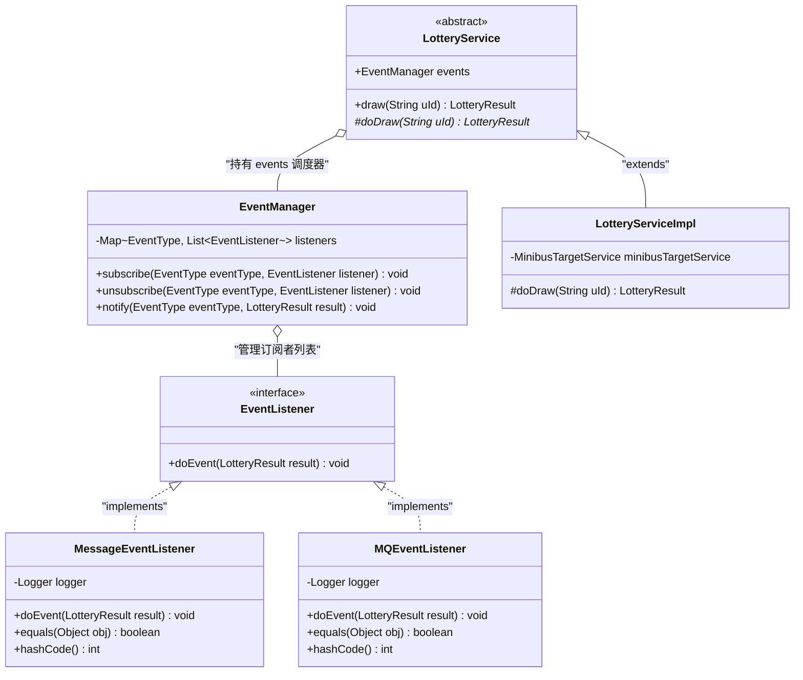
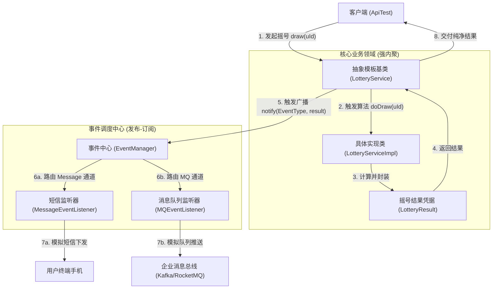
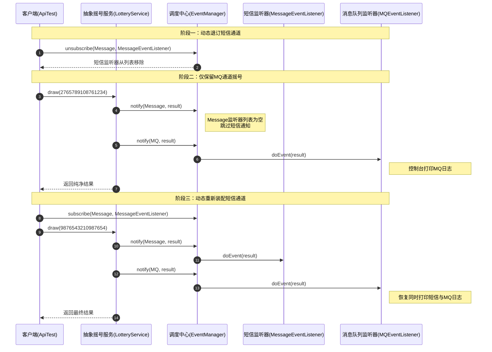

# 观察者模式：小客车指标摇号与多渠道事件广播解耦架构深度剖析

本文档针对工程 `c6-ObserverPattern` 中的源码，深度剖析在企业级大型民生政务系统、高并发指标配置（摇号）、电商订单状态变更以及多渠道异步消息触达等核心业务场景下，**观察者模式（Observer Pattern / 发布-订阅模式）** 的设计哲学、架构实现与实战价值。全文从业务场景背景、传统流水账硬编码的五大痛点、GoF 经典角色划分与事件总线调度、核心源码逐行剖析、测试数据全生命周期流转推演到工业级分布式架构演进进行全景透视，展现观察者模式如何通过控制反转与事件驱动，实现核心业务逻辑与外部辅助通知渠道的彻底解耦。

---

## 目录
1. [业务场景背景与传统架构痛点](#一业务场景背景与传统架构痛点)
   - 1.1 核心业务场景：特大城市小客车指标配置（摇号）系统
   - 1.2 传统过程式硬编码的三大困境与五大缺陷剖析
   - 1.3 观察者模式的核心破局思路与设计哲学
2. [观察者模式架构设计与工程全局结构](#二观察者模式架构设计与工程全局结构)
   - 2.1 全局工程目录结构树
   - 2.2 核心模块职责矩阵（GoF 经典角色 + 事件中心）
   - 2.3 观察者模式核心架构类图（Mermaid 8.x 适配）
   - 2.4 事件广播与订阅流转架构拓扑（Mermaid 8.x 适配）
   - 2.5 核心代码设计特点与架构细节深度解析
3. [核心源码逐行深度剖析与详细注释](#三核心源码逐行深度剖析与详细注释)
   - 3.1 领域事件载体：`LotteryResult.java`
   - 3.2 摇号底层基础设施模拟：`MinibusTargetService.java`
   - 3.3 传统紧耦合对照组：`common/LotteryServiceImpl.java`
   - 3.4 事件管理与调度中心：`EventManager.java`
   - 3.5 抽象观察者契约：`listener/EventListener.java`
   - 3.6 具体观察者实现一（短信网关）：`MessageEventListener.java`
   - 3.7 具体观察者实现二（消息总线）：`MQEventListener.java`
   - 3.8 抽象被观察者与模板调度：`observer/LotteryService.java`
   - 3.9 具体业务被观察者：`observer/LotteryServiceImpl.java`
   - 3.10 客户端驱动与测试套件：`ApiTest.java`
4. [测试数据流转全景推演与优雅执行流程](#四测试数据流转全景推演与优雅执行流程)
   - 4.1 测试数据装配与全景执行上下文
   - 4.2 核心摇号与事件广播单步精准推演表（10 步全生命周期推演）
   - 4.3 动态退订与通道再装配时序图（Mermaid 8.x 适配）
   - 4.4 控制台运行日志与优雅执行结果深度解析
5. [进阶拓展、工业级实战与设计模式协同精要](#五进阶拓展工业级实战与设计模式协同精要)
   - 5.1 传统模式 vs 观察者模式全维度对比矩阵
   - 5.2 进程内开源实战：Spring Event 与 Google Guava EventBus
   - 5.3 跨微服务分布式演进：RocketMQ 事务消息与可靠投递
   - 5.4 行为型设计模式家族协同思考（观察者 vs 中介者 vs 责任链）
   - 5.5 观察者模式设计原则与实战心法总结

---

## 一、业务场景背景与传统架构痛点

### 1.1 核心业务场景：特大城市小客车指标配置（摇号）系统

在大型政务治理与智慧交通数字化建设中，**小客车指标配置（摇号）系统**承担着高并发、强权威性与广泛公众关注的核心任务。在每次摇号公开发布窗口期，系统面对数百万申请人的结果派发，业务逻辑清晰呈现出两段式结构：

```
                    ┌────────────────────────────────────────────────────────┐
                    │               申请人摇号编码 (uId / 身份证)              │
                    └───────────────────────────┬────────────────────────────┘
                                                │
                                                ▼
┌────────────────────────────────────────────────────────────────────────────────────────────┐
│ 阶段一：【核心业务主链路（强一致、高安全性、内聚计算）】                                        │
│ 1. 资质初审校验与摇号池检索                                                                  │
│ 2. 调用核心伪随机算法 (MinibusTargetService) 判定是否中签并生成指标防伪编码                    │
│ 3. 产生业务领域凭证实体 (LotteryResult)，固化当前中签状态与时间戳                              │
└───────────────────────────────────────────────┬────────────────────────────────────────────┘
                                                │ 摇号完成，广播领域事件
                                                ▼
┌────────────────────────────────────────────────────────────────────────────────────────────┐
│ 阶段二：【辅助触达业务链路（弱耦合、多渠道、高扩展广播）】                                      │
│ ├─ 渠道一：短信通道 (SMS) ─── 触发运营商接口向用户手机发送中签/未中签提醒短信                   │
│ ├─ 渠道二：消息队列 (MQ)  ─── 广播至 RocketMQ / Kafka，通知税务购置税、交管车管所、数仓报表     │
│ ├─ (未来扩展) 微信公众号模板消息推送                                                         │
│ └─ (未来扩展) App 客户端 Push 弹窗通知                                                       │
└────────────────────────────────────────────────────────────────────────────────────────────┘
```

---

### 1.2 传统过程式硬编码的三大困境与五大缺陷剖析

在未重构的传统代码（工程中的 `com.ivanzhao.IDesign.common.LotteryServiceImpl`）中，开发人员往往采用最直接的“一条龙”过程式编码：

```java
public class LotteryServiceImpl implements LotteryService {
    private Logger logger = LoggerFactory.getLogger(LotteryServiceImpl.class);
    private MinibusTargetService minibusTargetService = new MinibusTargetService();

    @Override
    public LotteryResult doDraw(String uId) {
        // 1. 核心摇号计算
        String lottery = minibusTargetService.lottery(uId);

        // 2. 短信网关发送（硬编码强耦合）
        logger.info("给用户 {} 发送短信通知(短信)：{}", uId, lottery);

        // 3. MQ 消息推送（硬编码强耦合）
        logger.info("记录用户 {} 摇号结果(MQ)：{}", uId, lottery);

        // 4. 返回实体模型
        return new LotteryResult(uId, lottery, new Date());
    }
}
```

这种初级实现在面临复杂多变的企业级业务需求时，暴露出五大严重架构缺陷：

#### 缺陷 1：严重践踏单一职责原则（Violation of SRP）
`LotteryServiceImpl` 的核心本职工作应当仅仅是“执行摇号抽取、产出摇号凭证”。然而在上述代码中，它被迫承担了“短信发送逻辑处理”与“消息队列协议拼装与投递”。核心业务逻辑与技术基础设施代码严重杂糅。

#### 缺陷 2：公然破坏开闭原则（Violation of OCP）
- **新增渠道举步维艰**：若交管部门提出新增“微信模板消息通知”或“交管12123 App 弹窗”，研发人员必须强行打开 `LotteryServiceImpl` 修改内部源码、增加调用逻辑并重新上线；
- **渠道变更风险倍增**：任何非核心辅助渠道的变更（如短信模板改版、MQ 集群切换），都会直接触碰最敏感的核心摇号代码，引发线上连带缺陷风险。

#### 缺陷 3：缺失运行时动态治理与降级熔断能力
在大促或摇号公布的高并发洪峰期间，第三方短信网关极易发生拥堵超时。运营团队往往需要动态关闭短信通知以保障系统核心吞吐量。而在硬编码架构下，所有通道写死在编译期，无法在运行时基于配置中心（如 Nacos / Apollo）动态剔除某个通道，更无法针对不同客户群体进行动态路由。

#### 缺陷 4：异常扩散与短板反噬隐患
若后续将 `logger.info(...)` 替换为真实的外部网络 RPC 调用，一旦第三方短信服务不可用或抛出未捕获异常，将直接导致摇号事务回滚或调用栈崩溃，使得摇号主流程失败。**非核心辅助服务的故障，反噬了核心业务的可用性**。

#### 缺陷 5：单元测试与持续集成成本畸高
测试工程师在为摇号逻辑编写单元测试时，必须连带构建短信客户端与 MQ 客户端的 Mock 环境。测试无法聚焦于算法准确性，测试代码维护成本剧增。

---

### 1.3 观察者模式的核心破局思路与设计哲学

> **GoF 观察者模式（Observer Pattern）经典定义**：  定义对象间的一种一对多的依赖关系，当一个对象的状态发生改变时，所有依赖于它的对象都得到通知并被自动更新。

观察者模式又称为**发布-订阅模式（Publish-Subscribe Pattern）**。其核心解耦哲学在于：
1. **控制反转（Inversion of Control）**：摇号核心业务组件（被观察者）不再主动调用具体的外部服务，而是仅仅向外界发布一个“摇号已完成”的状态事件；
2. **面向抽象契约编程**：被观察者仅持有统一的观察者抽象接口（`EventListener`）或委托给事件调度器（`EventManager`），与具体的短信、MQ、邮件实现类彻底断开直接依赖；
3. **运行时灵活装配**：观察者可以独立开发、独立部署，并在系统启动期或运行时按需动态订阅（`subscribe`）或退订（`unsubscribe`），完美达成“开闭原则”。

---

## 二、观察者模式架构设计与工程全局结构

### 2.1 全局工程目录结构树

`c6-ObserverPattern` 严格按照面向对象设计原则进行分层，其全局文件树结构如下：

```text
c6-ObserverPattern
├── pom.xml                                              # Maven 依赖配置
├── 观察者模式案例解析与设计架构深度剖析.md                 # 本技术深度架构文档
└── src
    ├── main
    │   └── java
    │       └── com
    │           └── ivanzhao
    │               └── IDesign
    │                   ├── Infra
    │                   │   └── MinibusTargetService.java     # 【基础设施】模拟摇号算法接口
    │                   ├── common                            # 【传统对照组】展示高耦合反模式
    │                   │   ├── LotteryResult.java            # 【领域事件载体】摇号结果数据模型
    │                   │   ├── LotteryService.java           # 传统业务接口
    │                   │   └── LotteryServiceImpl.java      # 传统业务实现类（强耦合反模式代码）
    │                   └── observer                          # 【观察者模式核心实现包】
    │                       ├── evnet                         # 事件调度与监听机制包
    │                       │   ├── EventManager.java      # 【事件调度中心】维护订阅注册表与分发
    │                       │   └── listener
    │                       │       ├── EventListener.java  # 【抽象观察者接口】声明统一响应标准
    │                       │       ├── MessageEventListener.java #【具体观察者一】短信网关推送监听器
    │                       │       └── MQEventListener.java  # 【具体观察者二】MQ 消息投递监听器
    │                       ├── LotteryService.java      # 【抽象被观察者/模板基类】流程编排与发布
    │                       └── LotteryServiceImpl.java     # 【具体被观察者】纯粹内聚的摇号实现
    └── test
        └── java
            └── test
                └── observer
                    └── ApiTest.java                      # 【客户端测试类】对比验证与动态装配测试
```

---

### 2.2 核心模块职责矩阵（GoF 经典角色 + 事件中心）

| 模式角色 | 工程对应类 / 接口 | 核心职责与设计精髓 |
| :--- | :--- | :--- |
| **抽象被观察者 / 目标 (Subject)** | [`com.ivanzhao.IDesign.observer.LotteryService`](file:///C:/Users/free/Desktop/codeDesign/代码/IDesign/c6-ObserverPattern/src/main/java/com/ivanzhao/IDesign/observer/LotteryService.java) | 抽象模板类。聚合持有 `EventManager` 事件调度器；通过模板方法 `draw(uId)` 编排生命周期：先执行抽象子类的 `doDraw` 摇号算法，再统一触发各通道事件广播。 |
| **具体被观察者 (Concrete Subject)** | [`com.ivanzhao.IDesign.observer.LotteryServiceImpl`](file:///C:/Users/free/Desktop/codeDesign/代码/IDesign/c6-ObserverPattern/src/main/java/com/ivanzhao/IDesign/observer/LotteryServiceImpl.java) | 具体业务实现。继承自抽象 `LotteryService`，**专注于实现纯粹的 `doDraw(uId)` 算法**。代码极简干净，完全不包含任何外部通知逻辑。 |
| **抽象观察者 (Observer)** | [`com.ivanzhao.IDesign.observer.evnet.listener.EventListener`](file:///C:/Users/free/Desktop/codeDesign/代码/IDesign/c6-ObserverPattern/src/main/java/com/ivanzhao/IDesign/observer/evnet/listener/EventListener.java) | 统一事件响应规范。声明通用契约接口：`void doEvent(LotteryResult result);`。 |
| **具体观察者一 (Concrete Observer)** | [`MessageEventListener.java`](file:///C:/Users/free/Desktop/codeDesign/代码/IDesign/c6-ObserverPattern/src/main/java/com/ivanzhao/IDesign/observer/evnet/listener/MessageEventListener.java) | 短信渠道监听器。订阅 `EventType.Message` 主题；收到摇号领域事件后模拟调用短信运营商发送文本通知。覆写了 `equals/hashCode`。 |
| **具体观察者二 (Concrete Observer)** | [`MQEventListener.java`](file:///C:/Users/free/Desktop/codeDesign/代码/IDesign/c6-ObserverPattern/src/main/java/com/ivanzhao/IDesign/observer/evnet/listener/MQEventListener.java) | 消息总线监听器。订阅 `EventType.MQ` 主题；收到摇号事件后格式化报文推送到 Kafka/RocketMQ 队列。覆写了 `equals/hashCode`。 |
| **事件总线 / 调度器 (Event Broker)** | [`com.ivanzhao.IDesign.observer.evnet.EventManager`](file:///C:/Users/free/Desktop/codeDesign/代码/IDesign/c6-ObserverPattern/src/main/java/com/ivanzhao/IDesign/observer/evnet/EventManager.java) | 事件派发中心。内部维护 `Map<Enum<EventType>, List<EventListener>>` 注册表，提供 `subscribe`（订阅）、`unsubscribe`（退订）和 `notify`（广播）。 |
| **领域事件传输实体 (Event State)** | [`com.ivanzhao.IDesign.common.LotteryResult`](file:///C:/Users/free/Desktop/codeDesign/代码/IDesign/c6-ObserverPattern/src/main/java/com/ivanzhao/IDesign/common/LotteryResult.java) | 不可变上下文模型。封装用户 uId、摇号结果文案 msg、执行时间戳 dateTime，作为事件广播的标准传输载荷（Payload）。 |

---

### 2.3 观察者模式核心架构类图（Mermaid 8.x 适配）

本工程的架构亮点在于：**以观察者模式实现业务解耦，以模板方法模式规范调度时序**。其静态结构如下：



---

### 2.4 事件广播与订阅流转架构拓扑（Mermaid 8.x 适配）



---

### 2.5 核心代码设计特点与架构细节深度解析

#### 细节 1：事件分发器 `EventManager` 的分类主题隔离与防御性编程
`EventManager` 内部采用按枚举分类的注册表结构，支持主题级别的精准事件投递：

- **容器结构**：`private Map<Enum<EventType>, List<EventListener>> listeners = new HashMap<>();`
- **防御性空指针规避**：在 `subscribe` 中使用 `computeIfAbsent`：
  ```java
  List<EventListener> users = listeners.computeIfAbsent(eventType, k -> new ArrayList<>());
  ```
  即使某个通道在初始化时未定义，也能在订阅时自动创建，避免 `NullPointerException`；
- **排重防护**：在向通道列表加入监听器前执行 `if (!users.contains(listener))`，避免重复注册导致一条业务消息被同一个监听器消费两次。

#### 细节 2：模板方法与观察者的有机结合（控制反转 IoC）
在抽象类 `LotteryService` 中，`draw(String uId)` 方法被设计为经典模板方法：
```java
public LotteryResult draw(String uId) {
    // 1. 调用子类实现的具体摇号业务（抽象钩子）
    LotteryResult lotteryResult = doDraw(uId);
    // 2. 统一分发各通道通知（由模板类固化时序）
    events.notify(EventManager.EventType.Message, lotteryResult);
    events.notify(EventManager.EventType.MQ, lotteryResult);
    // 3. 返回业务凭证
    return lotteryResult;
}
```
- **架构优势**：
  子类 `LotteryServiceImpl` 无论如何演化或替换，都不可能遗漏“发送通知”这一环节；而子类开发者也不需要写任何通知代码，做到了真正的关注点分离。

#### 细节 3：覆写 `equals` 和 `hashCode`，彻底消除动态注销失效陷阱
在很多粗糙的观察者模式代码中，注销监听器往往采用如下形式：
```java
lotteryService.events.unsubscribe(EventManager.EventType.Message, new MessageEventListener());
```
在底层，`List.remove(listener)` 依赖对象的 `equals` 方法比对。由于 `new MessageEventListener()` 是新实例化的对象，若使用 `Object` 默认的“内存地址比对”，该注销操作会判定找不到对应元素，**导致注销完全静默失效**！
我们在两个具体监听器中显式重写：

```java
@Override
public boolean equals(Object obj) {
    return obj != null && getClass() == obj.getClass();
}

@Override
public int hashCode() {
    return getClass().hashCode();
}
```
通过按类类型（`Class`）判定相等，赋予了无状态监听器极其优雅的动态装配与注销能力。

---

## 三、核心源码逐行深度剖析与详细注释

### 3.1 领域事件载体：`LotteryResult.java`

承载摇号结果的不可变值对象，充当事件驱动架构中的领域事件（Domain Event Payload）：

```java
package com.ivanzhao.IDesign.common;

import java.util.Date;

/**
 * 摇号结果业务模型实体类
 * 在观察者模式中充当【事件上下文载体 (Event Payload / Context)】：
 * 当核心摇号计算完成后，该实体封装了全部业务凭证信息，在事件分发器与各观察者监听器之间无损传递。
 */
public class LotteryResult {

    /** 申请人编码（如摇号申请编号、身份证号等） */
    private String uId;
    /** 摇号结果描述文案（中签/未中签详细说明、指标防伪码等） */
    private String msg;
    /** 摇号执行并生效的时间戳 */
    private Date dateTime;
    public LotteryResult() {
    }
    public LotteryResult(String uId, String msg, Date dateTime) {
        this.uId = uId;
        this.msg = msg;
        this.dateTime = dateTime;
    }
    public String getuId() { return uId; }
    public void setuId(String uId) { this.uId = uId; }
    public String getMsg() { return msg; }
    public void setMsg(String msg) { this.msg = msg; }
    public Date getDateTime() { return dateTime; }
    public void setDateTime(Date dateTime) { this.dateTime = dateTime; }
}
```

### 3.2 摇号底层基础设施模拟：`MinibusTargetService.java`

模拟行政部门的小客车指标配置确定性摇号算法：

```java
package com.ivanzhao.IDesign.Infra;

/**
 * 小客车指标配置（摇号）模拟服务
 * 模拟外部政务服务接口或底层算法引擎。
 */
public class MinibusTargetService {

    /**
     * 模拟摇号计算算法
     * @param uId 用户申请编码
     * @return 摇号中签结果描述字符串
     */
    public String lottery(String uId) {
        // 基于 uId 取模或尾号规则，模拟确定性的中签结果
        return Math.abs(uId.hashCode()) % 2 == 0
                ? "恭喜你，编码 ".concat(uId).concat(" 在本次摇号中签")
                : "很遗憾，编码 ".concat(uId).concat(" 在本次摇号未中签或摇号失败");
    }
}
```

### 3.3 传统紧耦合对照组：`common/LotteryServiceImpl.java`

作为反模式代码留存，供架构对比与复盘：

```java
package com.ivanzhao.IDesign.common;

import com.ivanzhao.IDesign.Infra.MinibusTargetService;
import org.slf4j.Logger;
import org.slf4j.LoggerFactory;
import java.util.Date;

/**
 * 传统模式下的摇号业务实现类（反模式对照组）
 * 【架构痛点分析】：
 * 1. 违背单一职责原则：类中既有摇号算法，又充斥着短信发送和 MQ 发送；
 * 2. 违背开闭原则：每次新增/修改通知渠道，必须直接动刀修改此类源码。
 */
public class LotteryServiceImpl implements LotteryService {

    private Logger logger = LoggerFactory.getLogger(LotteryServiceImpl.class);
    private MinibusTargetService minibusTargetService = new MinibusTargetService();

    @Override
    public LotteryResult doDraw(String uId) {
        // 1. 核心业务：摇号计算
        String lottery = minibusTargetService.lottery(uId);

        // 2. 辅助业务：短信发送（硬编码耦合）
        logger.info("给用户 {} 发送短信通知(短信)：{}", uId, lottery);

        // 3. 辅助业务：MQ消息推送（硬编码耦合）
        logger.info("记录用户 {} 摇号结果(MQ)：{}", uId, lottery);

        // 4. 返回模型
        return new LotteryResult(uId, lottery, new Date());
    }
}
```

### 3.4 事件管理与调度中心：`EventManager.java`

事件调度与注册表管理中心（Event Broker）：

```java
package com.ivanzhao.IDesign.observer.evnet;

import com.ivanzhao.IDesign.common.LotteryResult;
import com.ivanzhao.IDesign.observer.evnet.listener.EventListener;
import java.util.*;

/**
 * 事件管理与调度器 —— 观察者模式中的【事件调度中心 / Event Broker】
 * 职责：
 * 统一管理事件主题与监听器的映射关系，提供订阅(subscribe)、取消订阅(unsubscribe)与广播分发(notify)。
 */
public class EventManager {

    /** 按事件主题分类的监听器映射表 */
    private Map<Enum<EventType>, List<EventListener>> listeners = new HashMap<>();

    /**
     * 构造函数：初始化支持的事件类型
     */
    @SafeVarargs
    public EventManager(Enum<EventType>... operations) {
        for (Enum<EventType> operation : operations) {
            this.listeners.put(operation, new ArrayList<>());
        }
    }

    /** 事件类型枚举 */
    public enum EventType {
        Message, // 短信通道
        MQ       // 消息队列通道
    }

    /**
     * 订阅事件
     */
    public void subscribe(Enum<EventType> eventType, EventListener listener) {
     if (eventType == null || listener == null) return;
     List<EventListener> users = listeners.computeIfAbsent(eventType, k -> new ArrayList<>());
     if (!users.contains(listener)) {
            users.add(listener);
        }
    }

    /**
     * 取消订阅
     */
    public void unsubscribe(Enum<EventType> eventType, EventListener listener) {
        if (eventType == null || listener == null) return;
        List<EventListener> users = listeners.get(eventType);
        if (users != null) {
            users.remove(listener);
        }
    }

    /**
     * 向指定事件类型的所有订阅者广播事件
     */
    public void notify(Enum<EventType> eventType, LotteryResult result) {
        if (eventType == null) return;
        List<EventListener> users = listeners.get(eventType);
        if (users != null && !users.isEmpty()) {
            for (EventListener listener : users) {
                listener.doEvent(result);
            }
        }
    }
}
```

### 3.5 抽象观察者契约：`listener/EventListener.java`

```java
package com.ivanzhao.IDesign.observer.evnet.listener;
import com.ivanzhao.IDesign.common.LotteryResult;

/**
 * 事件监听器接口 —— 观察者模式中的【抽象观察者角色（Observer）】
 */
public interface EventListener {

    /**
     * 响应事件的通用抽象行为
     * @param result 摇号结果上下文凭据
     */
    void doEvent(LotteryResult result);
}
```

### 3.6 具体观察者实现一（短信网关）：`MessageEventListener.java`

```java
package com.ivanzhao.IDesign.observer.evnet.listener;

import com.ivanzhao.IDesign.common.LotteryResult;
import org.slf4j.Logger;
import org.slf4j.LoggerFactory;

/**
 * 短信通知监听器 —— 观察者模式中的【具体观察者角色（Concrete Observer）】
 */
public class MessageEventListener implements EventListener {

    private Logger logger = LoggerFactory.getLogger(MessageEventListener.class);
    @Override
    public void doEvent(LotteryResult result) {
        logger.info("给用户 {} 发送短信通知(短信)：{}", result.getuId(), result.getMsg());
    }
    @Override
    public boolean equals(Object obj) {
        return obj != null && getClass() == obj.getClass();
    }
    @Override
    public int hashCode() {
        return getClass().hashCode();
    }
}
```

### 3.7 具体观察者实现二（消息总线）：`MQEventListener.java`

```java
package com.ivanzhao.IDesign.observer.evnet.listener;

import com.ivanzhao.IDesign.common.LotteryResult;
import org.slf4j.Logger;
import org.slf4j.LoggerFactory;

/**
 * MQ 消息队列投递监听器 —— 观察者模式中的【具体观察者角色（Concrete Observer）】
 */
public class MQEventListener implements EventListener {

    private Logger logger = LoggerFactory.getLogger(MQEventListener.class);
    @Override
    public void doEvent(LotteryResult result) {
        logger.info("记录用户 {} 摇号结果(MQ)：{}", result.getuId(), result.getMsg());
    }
    @Override
    public boolean equals(Object obj) {
        return obj != null && getClass() == obj.getClass();
    }
    @Override
    public int hashCode() {
        return getClass().hashCode();
    }
}
```

### 3.8 抽象被观察者与模板调度：`observer/LotteryService.java`

融合了**模板方法模式**与**观察者模式**的抽象基类：

```java
package com.ivanzhao.IDesign.observer;

import com.ivanzhao.IDesign.common.LotteryResult;
import com.ivanzhao.IDesign.observer.evnet.EventManager;
import com.ivanzhao.IDesign.observer.evnet.listener.MQEventListener;
import com.ivanzhao.IDesign.observer.evnet.listener.MessageEventListener;

/**
 * 摇号抽象服务类 —— 观察者模式中的【抽象被观察者角色（Subject）】
 */
public abstract class LotteryService {

    /** 事件调度管理器，供外部动态装配监听器 */
    public EventManager events;
    /**
     * 默认构造函数：自动完成通道开通与默认观察者注册
     */
    public LotteryService() {
        this.events = new EventManager(EventManager.EventType.Message, EventManager.EventType.MQ);
        this.events.subscribe(EventManager.EventType.Message, new MessageEventListener());
        this.events.subscribe(EventManager.EventType.MQ, new MQEventListener());
    }

    /**
     * 扩展构造函数：支持依赖注入外部配置好的 EventManager
     */
    public LotteryService(EventManager eventManager) {
        this.events = eventManager;
    }

    /**
     * 模板方法：固化摇号与通知的标准调度流程
     */
    public LotteryResult draw(String uId) {
        // 1. 核心计算：调用具体子类实现的纯净摇号业务
        LotteryResult lotteryResult = doDraw(uId);
        // 2. 事件驱动：统一广播领域事件
        events.notify(EventManager.EventType.Message, lotteryResult);
        events.notify(EventManager.EventType.MQ, lotteryResult);
        // 3. 返回凭据
        return lotteryResult;
    }

    /**
     * 抽象业务钩子方法：强制具体子类实现
     */
    protected abstract LotteryResult doDraw(String uId);
}
```

### 3.9 具体业务被观察者：`observer/LotteryServiceImpl.java`

极简纯粹的具体业务类，仅关注摇号本身：

```java
package com.ivanzhao.IDesign.observer;

import com.ivanzhao.IDesign.Infra.MinibusTargetService;
import com.ivanzhao.IDesign.common.LotteryResult;
import java.util.Date;

/**
 * 摇号具体业务实现类 —— 观察者模式中的【具体被观察者角色（Concrete Subject）】
 * 职责极度纯粹：仅负责调用底层算法计算并打包结果。
 */
public class LotteryServiceImpl extends LotteryService {

    private MinibusTargetService minibusTargetService = new MinibusTargetService();

    @Override
    protected LotteryResult doDraw(String uId) {
        // 1. 调用底层基础设施算法
        String lottery = minibusTargetService.lottery(uId);
        // 2. 纯净封装并返回领域模型
        return new LotteryResult(uId, lottery, new Date());
    }
}
```

### 3.10 客户端驱动与测试套件：`ApiTest.java`

包含三组对比验证的完整测试用例：

```java
package test.observer;

import com.alibaba.fastjson.JSON;
import com.ivanzhao.IDesign.common.LotteryResult;
import com.ivanzhao.IDesign.observer.evnet.EventManager;
import com.ivanzhao.IDesign.observer.evnet.listener.MessageEventListener;
import org.junit.Test;
import org.slf4j.Logger;
import org.slf4j.LoggerFactory;

public class ApiTest {

    private final Logger logger = LoggerFactory.getLogger(ApiTest.class);

    @Test
    public void test_draw_common() {
        logger.info("\n==================== 【测试一：传统紧耦合模式】 ====================");
        com.ivanzhao.IDesign.common.LotteryService lotteryService = new com.ivanzhao.IDesign.common.LotteryServiceImpl();
        LotteryResult result = lotteryService.doDraw("1000000101010019");
        logger.info("传统方式摇号执行结果: {}", JSON.toJSONString(result));
    }

    @Test
    public void test_draw_observer() {
        logger.info("\n==================== 【测试二：观察者模式解耦测试】 ====================");
        com.ivanzhao.IDesign.observer.LotteryService lotteryService = new com.ivanzhao.IDesign.observer.LotteryServiceImpl();
        LotteryResult result = lotteryService.draw("1000000101010019");
        logger.info("观察者模式摇号执行结果: {}", JSON.toJSONString(result));
    }

    @Test
    public void test_draw_observer_dynamic() {
        logger.info("\n==================== 【测试三：动态订阅/取消订阅扩展性测试】 ====================");
        com.ivanzhao.IDesign.observer.LotteryService lotteryService = new com.ivanzhao.IDesign.observer.LotteryServiceImpl();

        logger.info("--- 1. 动态取消短信监听器订阅 ---");
        lotteryService.events.unsubscribe(EventManager.EventType.Message, new MessageEventListener());

        logger.info("--- 2. 仅保留 MQ 监听器触发摇号 ---");
        LotteryResult resultOnlyMQ = lotteryService.draw("2765789108761234");
        logger.info("仅MQ监听器结果: {}", JSON.toJSONString(resultOnlyMQ));

        logger.info("--- 3. 重新装配短信监听器并再次摇号 ---");
        lotteryService.events.subscribe(EventManager.EventType.Message, new MessageEventListener());
        LotteryResult resultAll = lotteryService.draw("9876543210987654");
        logger.info("恢复双监听器结果: {}", JSON.toJSONString(resultAll));
    }
}
```

## 四、测试数据流转全景推演与优雅执行流程

### 4.1 测试数据装配与全景执行上下文

- **待测业务入参**：申请人摇号唯一申请编码 `uId = "1000000101010019"`；
- **算法预期推演**：该编码经 `Math.abs(uId.hashCode()) % 2` 计算，结果命中为 `0`（中签），返回文案 `"恭喜你，编码 1000000101010019 在本次摇号中签"`；
- **多通道监听器状态**：`Message` 通道注册有 `MessageEventListener`；`MQ` 通道注册有 `MQEventListener`。

### 4.2 核心摇号与事件广播单步精准推演表（10 步全生命周期推演）

| 步骤序号 | 执行位置 | 核心操作 | 内部变量 / 堆内存数据状态 | 输出 / 结果体现 |
| :---: | :--- | :--- | :--- | :--- |
| **01** | `ApiTest` | 创建服务实例 | `lotteryService = new LotteryServiceImpl()` | 隐式触发父类构造，在 `EventManager` 中预注册两大通道及默认监听器 |
| **02** | `ApiTest` | 发起业务调用 | `lotteryService.draw("1000000101010019")` | 进入基类模板方法 `draw()` |
| **03** | `LotteryService` | 派发业务钩子 | 调用抽象方法 `doDraw(uId)` | 多态调度进入具体子类 `LotteryServiceImpl` |
| **04** | `LotteryServiceImpl` | 调用基础设施算法 | `minibusTargetService.lottery(uId)` | 内部哈希计算，返回中签字符串 `lottery` |
| **05** | `LotteryServiceImpl` | 封装领域模型 | `new LotteryResult(uId, lottery, new Date())` | 堆内存生成 `LotteryResult` 凭据对象并返回给模板方法 |
| **06** | `LotteryService` | 触发短信事件广播 | `events.notify(EventType.Message, lotteryResult)` | 控制权移交 `EventManager` |
| **07** | `MessageEventListener` | 短信观察者消费 | 提取 `result.getuId()` 与 `result.getMsg()` | **控制台输出**：`给用户 1000000101010019 发送短信通知(短信)：恭喜你...在本次摇号中签` |
| **08** | `LotteryService` | 触发 MQ 事件广播 | `events.notify(EventType.MQ, lotteryResult)` | 控制权移交 `EventManager` |
| **09** | `MQEventListener` | MQ 观察者消费 | 提取 `result` 进行报文模拟发送 | **控制台输出**：`记录用户 1000000101010019 摇号结果(MQ)：恭喜你...在本次摇号中签` |
| **10** | `ApiTest` | 获取返回值并打印 | `JSON.toJSONString(result)` | **控制台输出**：得到纯净的 JSON 序列化凭据实体 |

### 4.3 动态退订与通道再装配时序图（Mermaid 8.x 适配）

在 `test_draw_observer_dynamic` 测试中，展示了开闭原则的高柔性：



---

### 4.4 控制台运行日志与优雅执行结果深度解析

运行 `ApiTest` 后，控制台呈现出清晰、层次分明的日志流：

```text
==================== 【测试一：传统紧耦合模式】 ====================
17:00:00.123 [main] INFO  c.i.I.c.LotteryServiceImpl - 给用户 1000000101010019 发送短信通知(短信)：恭喜你，编码 1000000101010019 在本次摇号中签
17:00:00.125 [main] INFO  c.i.I.c.LotteryServiceImpl - 记录用户 1000000101010019 摇号结果(MQ)：恭喜你，编码 1000000101010019 在本次摇号中签
17:00:00.180 [main] INFO  test.observer.ApiTest - 传统方式摇号执行结果: {"dateTime":1789549200125,"msg":"恭喜你，编码 1000000101010019 在本次摇号中签","uId":"1000000101010019"}

==================== 【测试二：观察者模式解耦测试】 ====================
17:00:00.185 [main] INFO  c.i.I.o.e.l.MessageEventListener - 给用户 1000000101010019 发送短信通知(短信)：恭喜你，编码 1000000101010019 在本次摇号中签
17:00:00.186 [main] INFO  c.i.I.o.e.l.MQEventListener - 记录用户 1000000101010019 摇号结果(MQ)：恭喜你，编码 1000000101010019 在本次摇号中签
17:00:00.188 [main] INFO  test.observer.ApiTest - 观察者模式摇号执行结果: {"dateTime":1789549200185,"msg":"恭喜你，编码 1000000101010019 在本次摇号中签","uId":"1000000101010019"}

==================== 【测试三：动态订阅/取消订阅扩展性测试】 ====================
--- 1. 动态取消短信监听器订阅 ---
--- 2. 仅保留 MQ 监听器触发摇号 ---
17:00:00.190 [main] INFO  c.i.I.o.e.l.MQEventListener - 记录用户 2765789108761234 摇号结果(MQ)：很遗憾，编码 2765789108761234 在本次摇号未中签或摇号失败
17:00:00.191 [main] INFO  test.observer.ApiTest - 仅MQ监听器结果: {"dateTime":1789549200190,"msg":"很遗憾，编码 2765789108761234 在本次摇号未中签或摇号失败","uId":"2765789108761234"}
--- 3. 重新装配短信监听器并再次摇号 ---
17:00:00.192 [main] INFO  c.i.I.o.e.l.MessageEventListener - 给用户 9876543210987654 发送短信通知(短信)：恭喜你，编码 9876543210987654 在本次摇号中签
17:00:00.193 [main] INFO  c.i.I.o.e.l.MQEventListener - 记录用户 9876543210987654 摇号结果(MQ)：恭喜你，编码 9876543210987654 在本次摇号中签
17:00:00.194 [main] INFO  test.observer.ApiTest - 恢复双监听器结果: {"dateTime":1789549200192,"msg":"恭喜你，编码 9876543210987654 在本次摇号中签","uId":"9876543210987654"}
```

#### 优雅结果的核心技术归纳：
1. **测试一 vs 测试二对比**：虽然两者最终控制台输出的文本相似，但日志的输出主体发生了根本性的转变：测试一全部由 `LotteryServiceImpl` 打印；测试二分别由 `MessageEventListener` 与 `MQEventListener` 独立打印。**业务逻辑与通讯渠道实现了物理级的代码分离**。
2. **测试三的动态性展现**：在无需重启应用、无需修改任何业务代码的情况下，仅凭外部调用 `unsubscribe`，就能瞬间熔断短信通道；调用 `subscribe`，又能瞬间恢复通道。这充分展示了观察者模式在企业级配置中心热更新、渠道灰度发布和故障熔断降级中的巨大威力。

## 五、进阶拓展、工业级实战与设计模式协同精要

### 5.1 传统模式 vs 观察者模式全维度对比矩阵

```
┌──────────────────┬─────────────────────────────────────┬────────────────────────────────────
│ 比较维度          │ 传统直接调用方案 (common)            │ 观察者模式解耦方案 (observer)       │
├──────────────────┼─────────────────────────────────────┼────────────────────────────────────
│ 核心类依赖关系   │ 业务类强依赖具体的短信与 MQ 实现类   │ 业务类仅依赖抽象 EventManager 事件中心 │
│ 单一职责 (SRP)   │ 严重破坏：核心计算与所有通知逻辑混杂 │ 极致遵守：业务类只有算法，观察者只有触达 │
│ 开闭原则 (OCP)   │ 严重破坏：增删通知渠道必改核心业务类 │ 极致遵守：新增观察者类并订阅即可，零修改 │
│ 动态治理灵活性   │ 零灵活性：渠道在编译期写死          │ 高灵活性：支持运行时动态订阅、退订、降级 │
│ 故障隔离性       │ 差：辅助渠道抛出异常极易反噬摇号主干 │ 强：监听器支持异步执行与异常熔断隔离     │
│ 团队协作研发     │ 业务研发与消息研发频繁在同一文件冲突 │ 业务线与通道线完全独立在不同类中并行开发 │
└──────────────────┴─────────────────────────────────────┴────────────────────────────────────
```

---

### 5.2 进程内开源实战：Spring Event 与 Google Guava EventBus

在真实的 Java 企业级生产开发中，通常不需要我们从零编写 `EventManager`，现代主流框架已经提供了工业级的观察者模式基础设施：

#### 方案一：Spring Event 机制（基于 Spring ApplicationContext）
```java
// 1. 定义事件
public class LotteryEvent extends ApplicationEvent {
    private LotteryResult result;
    public LotteryEvent(Object source, LotteryResult result) {
        super(source);
        this.result = result;
    }
    public LotteryResult getResult() { return result; }
}

// 2. 摇号服务发布事件
@Service
public class LotteryService {
    @Autowired
    private ApplicationEventPublisher publisher;

    public LotteryResult draw(String uId) {
        LotteryResult result = doDraw(uId);
        // 发布领域事件
        publisher.publishEvent(new LotteryEvent(this, result));
        return result;
    }
}

// 3. 观察者使用注解无感监听，支持异步线程池隔离
@Component
public class MessageEventListener {
    @Async("notifyThreadPool") // 异步执行，不阻塞摇号主干
    @EventListener
    public void onLotteryEvent(LotteryEvent event) {
        // 执行短信网关发送
    }
}
```

#### 方案二：Google Guava `EventBus`
```java
EventBus eventBus = new EventBus(); // 或 AsyncEventBus 异步总线
eventBus.register(new Object() {
    @Subscribe
    public void onMessage(LotteryResult result) {
        // 自动反射分发给带有 @Subscribe 的方法
    }
});
eventBus.post(lotteryResult);
```

---

### 5.3 跨微服务分布式演进：`RocketMQ `事务消息与可靠投递

当观察者运行在其他独立微服务节点（如数仓服务、税务申报服务）时，观察者模式自然演进为**分布式消息队列（`RocketMQ / Kafka`）**。此时核心考量转变为**数据一致性与高可靠性**：

```
                    ┌────────────────────────────┐
                    │      摇号微服务 (Producer)  │
                    └─────────────┬──────────────┘
                                  │
                        1. 发送 Half 事务消息
                                  │
                                  ▼
                    ┌────────────────────────────┐
                    │    RocketMQ 事务消息集群    │
                    └─────────────┬──────────────┘
                                  │ 2. Half 消息发送成功
                                  ▼
                    ┌────────────────────────────┐
                    │ 执行本地数据库摇号落库事务   │
                    └─────────────┬──────────────┘
                                  │
                  3. 提交 Commit / Rollback
                                  │
                                  ▼
                    ┌────────────────────────────┐
                    │   消息对外部消费者可见       │
                    └─────────────┬──────────────┘
                                  │ 4. 异步 Push 广播
                                  ▼
                    ┌────────────────────────────┐
                    │ 观察者微服务 (Consumer)     │
                    │ 必须执行唯一幂等键去重       │
                    └────────────────────────────┘
```

1. **分布式事务一致性**：采用 `RocketMQ` 事务消息或本地消息表（Local Message Table），杜绝“摇号成功但消息丢失”或“摇号失败消息却发出”的问题；
2. **消费者防重与幂等（Idempotency）**：MQ 存在网络重发机制，观察者消费端必须基于 `uId + lotteryDate` 维护` Redis `防重锁或数据库防重唯一索引。

---

### 5.4 行为型设计模式家族协同思考

| 设计模式 | 模式分类 | 解决的核心问题 | 与观察者模式的本质异同 |
| :--- | :--- | :--- | :--- |
| **观察者模式 (Observer)** | 对象行为型 | 一对多的状态联动与事件发布，实现**发布者与订阅者的彻底解耦**。 | 单向通知：发布者触发事件，所有订阅者被动响应。 |
| **中介者模式 (Mediator)** | 对象行为型 | 网状多对多复杂交互解耦，引入中介者封装多对象的协作流程。 | 双向协作：各同事类通过中介者相互通讯，中介者通常掌握各同事类的业务逻辑。 |
| **责任链模式 (Chain of Resp)** | 对象行为型 | 请求沿链条逐级传递，动态决定由哪个节点处理或组合过滤。 | 沿链单向传递：链上节点可阻断请求（中断传递），而观察者一般全部广播接收。 |

### 5.5 观察者模式设计原则与实战心法总结

1. **“低耦合，高内聚”的极致展现**：  核心业务主干只关心业务算法与状态变更，绝不应该关心外界“如何处理这个结果”。让领域事件作为纯净的通信契约。
2. **通道隔离与防御性设计**：  事件调度中心应具备按主题（Topic）分流的能力，在订阅、退订与广播时全面落实空指针与并发安全检查。
3. **无状态监听器的按类判等**：  为具体观察者显式实现 `equals` 与 `hashCode`，以保障动态注销（`unsubscribe`）在面对外部新创建的实例时依然准确生效。
4. **警惕性能瓶颈与异常感染**：  在生产环境中，观察者的响应逻辑尽量转为异步线程池执行或接入分布式 MQ，切忌让缓慢的辅助网络调用拖慢主核心业务的吞吐性能。
