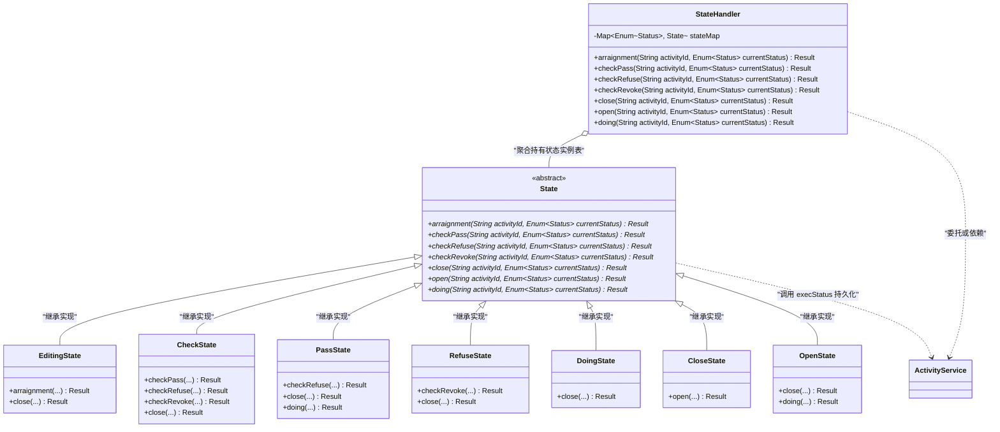
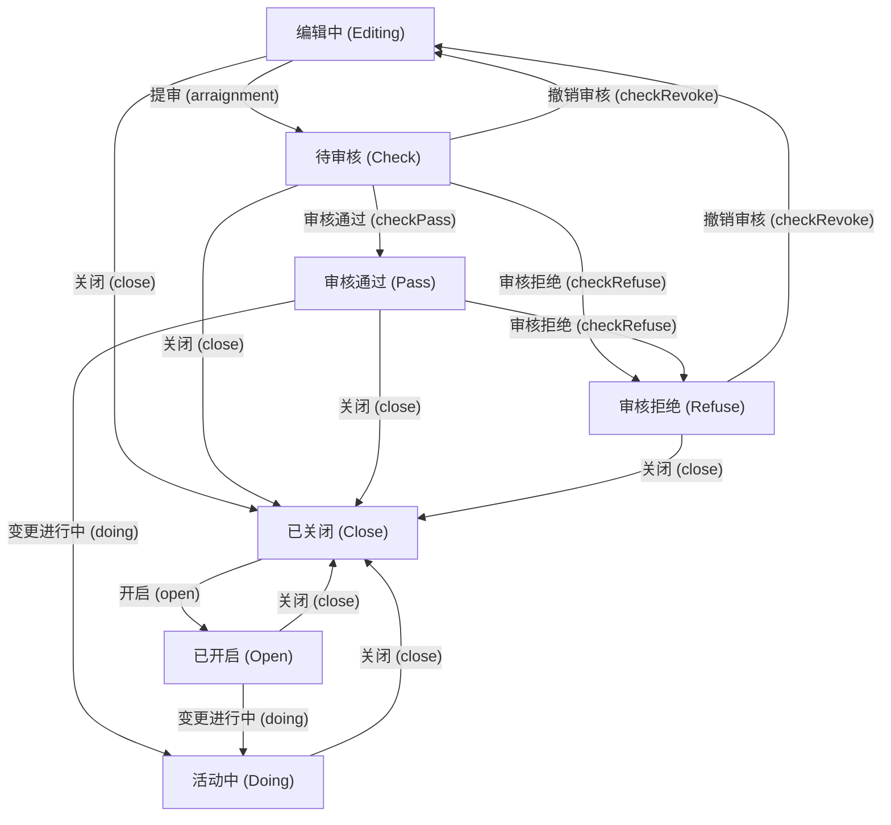
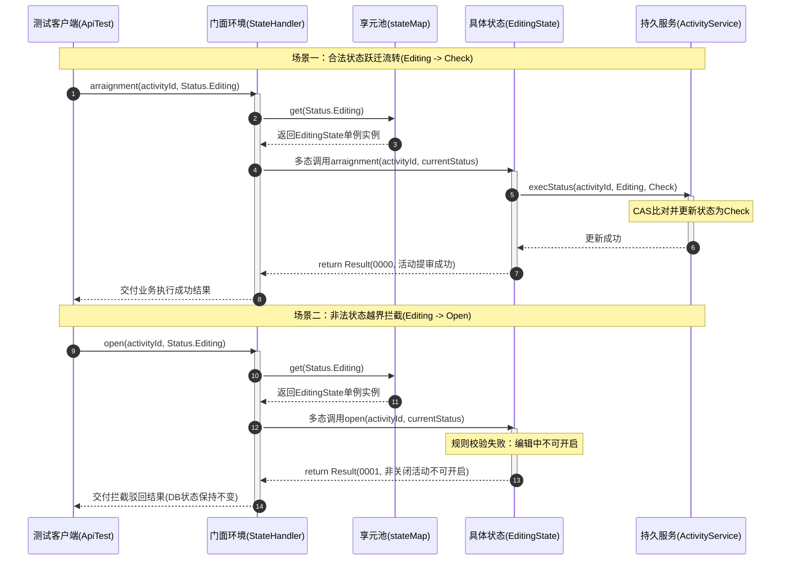

# 状态模式：营销活动生命周期有限状态机架构深度剖析

本文档针对工程 `c7-StatePattern` 中的源码，深度剖析在企业级电商促销、营销活动中台、工单工作流审批以及复杂订单生命周期管理等核心业务场景下，**状态模式（State Pattern / 有限状态机 FSM）** 的设计哲学、架构实现与实战价值。全文从业务场景背景、传统流水账嵌套 `if-else` 的五大痛点、GoF 经典角色划分与上下文环境设计、核心源码逐行剖析、测试数据全生命周期流转推演到工业级开源状态机架构演进进行全景透视，展现状态模式如何通过多态派发与关注点分离，实现复杂状态跃迁逻辑的优雅治理。

---

## 目录
1. [业务场景背景与状态管理的挑战](#一业务场景背景与状态管理的挑战)
   - 1.1 核心业务场景：互联网营销活动全生命周期管控
   - 1.2 活动状态跃迁规则与有限状态机（FSM）拓扑
   - 1.3 传统嵌套 `if-else` 分支的五大架构缺陷剖析
   - 1.4 状态模式的核心破局思路与设计哲学
2. [状态模式架构设计与工程全局结构](#二状态模式架构设计与工程全局结构)
   - 2.1 全局工程目录结构树
   - 2.2 核心模块职责矩阵（GoF 经典角色划分）
   - 2.3 状态模式核心架构类图（Mermaid 8.x 适配）
   - 2.4 营销活动状态迁移状态机图（Mermaid 8.x 适配）
   - 2.5 核心代码设计特点与架构细节深度解析
3. [核心源码逐行深度剖析与详细注释](#三核心源码逐行深度剖析与详细注释)
   - 3.1 状态枚举契约：`Status.java`
   - 3.2 领域实体对象：`ActivityInfo.java`
   - 3.3 数据存储与原子状态变更服务：`ActivityService.java`
   - 3.4 传统对照组实现：`ActivityExecStatusController.java`
   - 3.5 抽象状态基类：`State.java`
   - 3.6 环境上下文门面类：`StateHandler.java`
   - 3.7 七大具体状态实现类深度解析（`EditingState`、`CheckState` 等）
   - 3.8 客户端单元测试套件：`ApiTest.java`
4. [测试数据流转全景推演与优雅执行流程](#四测试数据流转全景推演与优雅执行流程)
   - 4.1 测试数据装配与执行上下文
   - 4.2 场景一：合法状态流转单步精准推演表（编辑中 -> 提审）
   - 4.3 场景二：非法状态流转拦截推演表（编辑中 -> 开启活动）
   - 4.4 场景三：全生命周期正向流转链路全景推演表
   - 4.5 运行时方法调用与多态派发时序图（Mermaid 8.x 适配）
   - 4.6 控制台运行日志与优雅执行结果深度解析
5. [进阶拓展、工业级实战与设计模式协同精要](#五进阶拓展工业级实战与设计模式协同精要)
   - 5.1 传统模式 vs 状态模式全维度对比矩阵
   - 5.2 生产级并发安全：数据库 CAS 乐观锁与状态机协同
   - 5.3 开源状态机选型与演进：Spring StateMachine vs Cola-StateMachine
   - 5.4 行为型设计模式家族协同思考（状态模式 vs 策略模式 vs 责任链模式）
   - 5.5 状态模式设计原则与实战心法总结

---

## 一、业务场景背景与状态管理的挑战

### 1.1 核心业务场景：互联网营销活动全生命周期管控

在电商平台、互联网运营中台等业务体系中，**营销活动（如“早起学习打卡领奖活动”、“大促秒杀抽奖”、“拼团立减”）** 是拉新、促活、留存的核心手段。一个大型营销活动的生命周期极其严密，涉及多角色协同：
- **运营人员**：创建活动基本信息、配置活动奖池与规则（此时处于草稿状态）；活动被驳回后重新编辑；或在活动结束时关闭活动；
- **风控与财务审核员**：审核活动预算、规则合规性，执行审核通过或审核拒绝；
- **定时调度任务 / 系统引擎**：对于审核通过且到达开始时间的活动，自动扫描并触发启动，置为进行中；
- **客服 / 运维管理员**：在发生恶意刷奖、库存超卖、不可抗力等突发状况时，具备紧急熔断和关闭活动的权限。

---

### 1.2 活动状态跃迁规则与有限状态机（FSM）拓扑

本工程定义了 7 种核心活动状态（`Status`）以及 7 种触发操作（动作行为）：

#### 7 大业务状态：
1. **`Editing`（编辑中）**：活动的初始创建状态；
2. **`Check`（待审核）**：运营人员配置完成，提交审核后的中间状态；
3. **`Pass`（审核通过）**：风控合规审核通过，等待时间到达或系统开启；
4. **`Refuse`（审核拒绝）**：风控审核不合规，驳回待处理；
5. **`Doing`（活动进行中）**：活动正式开始，C 端用户可参与打卡领奖；
6. **`Close`（活动已关闭）**：活动终止、下线或被管理员紧急关停；
7. **`Open`（活动已开启）**：已关闭的活动被管理员重新激活开启，待系统扫描切入进行中。

#### 7 大业务动作：
1. `arraignment`：活动提审
2. `checkPass`：审核通过
3. `checkRefuse`：审核拒绝
4. `checkRevoke`：撤销审核（撤审）
5. `close`：关闭活动
6. `open`：开启活动
7. `doing`：执行活动变更进行中

#### 状态合法跃迁矩阵（State Transition Matrix）：

```
┌──────────────┬────────────────────────────────────────────────────────────────────────┐
│ 当前状态     │ 允许执行的操作动作与跃迁后的目标状态                                    │
├──────────────┼────────────────────────────────────────────────────────────────────────┤
│ Editing 编辑 │ • 提审 (arraignment) ──> Check (待审核)                                │
│              │ • 关闭 (close)       ──> Close (已关闭)                                │
├──────────────┼────────────────────────────────────────────────────────────────────────┤
│ Check 待审核 │ • 审核通过 (checkPass)   ──> Pass (通过)                               │
│              │ • 审核拒绝 (checkRefuse) ──> Refuse (拒绝)                             │
│              │ • 撤销审核 (checkRevoke) ──> Editing (回退编辑)                        │
│              │ • 关闭 (close)           ──> Close (已关闭)                            │
├──────────────┼────────────────────────────────────────────────────────────────────────┤
│ Pass 审核通过│ • 审核拒绝 (checkRefuse) ──> Refuse (重审拒绝)                         │
│              │ • 变更进行中 (doing)     ──> Doing (活动中)                            │
│              │ • 关闭 (close)           ──> Close (已关闭)                            │
├──────────────┼────────────────────────────────────────────────────────────────────────┤
│ Refuse 拒绝  │ • 撤销审核 (checkRevoke) ──> Editing (退回重新编辑)                    │
│              │ • 关闭 (close)           ──> Close (已关闭)                            │
├──────────────┼────────────────────────────────────────────────────────────────────────┤
│ Doing 活动中 │ • 关闭 (close)           ──> Close (已关闭)                            │
├──────────────┼────────────────────────────────────────────────────────────────────────┤
│ Close 已关闭 │ • 开启 (open)            ──> Open (重新开启)                           │
├──────────────┼────────────────────────────────────────────────────────────────────────┤
│ Open 已开启  │ • 变更进行中 (doing)     ──> Doing (活动中)                            │
│              │ • 关闭 (close)           ──> Close (已关闭)                            │
└──────────────┴────────────────────────────────────────────────────────────────────────┘
注：任何未在上述列表中定义的“状态-动作”组合，均视为非法越界流转，状态机必须予以明确驳回！
```

---

### 1.3 传统嵌套 `if-else` 分支的五大架构缺陷剖析

在未重构的传统代码（工程中的 `com.ivanzhao.IDesign.common.ActivityExecStatusController`）中，开发人员将所有状态跃迁逻辑堆砌在一个巨大的方法内：

```java
public class ActivityExecStatusController {
    public Result execStatus(String activityId, Enum<Status> beforeStatus, Enum<Status> afterStatus) {
        // 1. 编辑中 -> 提审、关闭
        if (Status.Editing.equals(beforeStatus)) {
            if (Status.Check.equals(afterStatus) || Status.Close.equals(afterStatus)) {
                ActivityService.execStatus(activityId, beforeStatus, afterStatus);
                return new Result("0000", "变更状态成功");
            } else {
                return new Result("0001", "变更状态拒绝");
            }
        }
        // 2. 审核通过 -> 拒绝、关闭、活动中
        if (Status.Pass.equals(beforeStatus)) {
            if (Status.Refuse.equals(afterStatus) || Status.Doing.equals(afterStatus) || Status.Close.equals(afterStatus)) {
                ActivityService.execStatus(activityId, beforeStatus, afterStatus);
                return new Result("0000", "变更状态成功");
            } else {
                return new Result("0001", "变更状态拒绝");
            }
        }
        // ... 此处省略多层 if-else 嵌套 ...
        return new Result("0001", "非可处理的活动状态变更");
    }
}
```

#### 传统硬编码实现的五大架构痛点：
1. **圈复杂度（Cyclomatic Complexity）极高**：
   $7 \times 7 = 49$ 种可能的状态组合全部混杂在一个方法内，多层双重嵌套 `if-else`，代码可读性极差，容易让人眼花缭乱；
2. **严重践踏开闭原则（OCP）**：
   如果运营需要新增一个状态（如“预热中 `Preheating`”或“暂停中 `Paused`”），或者修改某个状态下允许的操作，必须在几十上百行的嵌套代码中间小心翼翼地切开修改，**极易引发蝴蝶效应，改动一点引发全盘回归缺陷**；
3. **严重破坏单一职责原则（SRP）**：
   `ActivityExecStatusController` 一个类承担了全部 7 种状态的所有行为判定。各个状态之间缺乏物理边界隔离；
4. **错误提示含糊不清**：
   在统一的 `else` 中只能返回笼统的“变更状态拒绝”或“非可处理的活动状态变更”，调用方无法得知究竟是因为“状态已过时”、“权限不匹配”还是“流程不可逆”，对前端排错极其不友好；
5. **难以承载切面逻辑与前置/后置钩子**：
   如果在某个具体状态跃迁（例如 `Pass -> Doing`）时需要发放奖品库存、发送广播通知或记录审批流水，在庞大的 `if-else` 中插入业务逻辑会导致代码迅速恶化为“上帝类（God Class）”。

---

### 1.4 状态模式的核心破局思路与设计哲学

> **GoF 状态模式（State Pattern）经典定义**：  
> 允许一个对象在其内部状态改变时改变它的行为。对象看起来似乎修改了它的类。

状态模式的核心设计哲学是：**“化整为零，以类代态，多态派发”**：
1. **将状态抽象为独立类**：不再将状态当成简单的数值或枚举，而是为每一种状态单独创建一个类（如 `EditingState`、`CheckState`）；
2. **将状态变迁内聚到具体状态类中**：每种状态类自己清楚在自己当前状态下，允许执行哪些动作、不允许执行哪些动作。允许的动作负责执行持久化流转并返回明确成功的提示；不允许的动作负责返回具体、精准的拒绝原因；
3. **引入上下文环境类（Context）屏蔽细节**：提供统一对外的操作门面（`StateHandler`），外部客户端只需要对上下文发出操作指令，内部通过多态分发到对应的具体状态类执行，实现调用方与状态变迁逻辑的全面解耦。

---

## 二、状态模式架构设计与工程全局结构

### 2.1 全局工程目录结构树

```text
c7-StatePattern
├── pom.xml                                              # Maven 项目工程依赖配置
├── 状态模式案例解析与设计架构深度剖析.md                 # 架构设计与技术深度文档
└── src
    ├── main
    │   └── java
    │       └── com
    │           └── ivanzhao
    │               └── IDesign
    │                   ├── common                            # 【传统反模式对比组】
    │                   │   ├── ActivityExecStatusController.java # 传统嵌套 if-else 控制器
    │                   │   └── Result.java                   # 通用业务执行响应模型
    │                   ├── infra                             # 【基础设施与领域实体】
    │                   │   ├── ActivityInfo.java             # 活动领域数据模型
    │                   │   ├── ActivityService.java          # 模拟数据库状态存储与查询服务
    │                   │   └── Status.java                   # 活动状态枚举定义
    │                   └── state                             # 【状态模式核心实现包】
    │                       ├── State.java                    # 【抽象状态基类】定义全部行为动作规范
    │                       ├── StateHandler.java             # 【环境上下文 Context】统一操作门面与享元管理
    │                       └── impl                          # 【具体状态子类实现包】
    │                           ├── EditingState.java         # 编辑中状态实现
    │                           ├── CheckState.java           # 待审核状态实现
    │                           ├── PassState.java            # 审核通过状态实现
    │                           ├── RefuseState.java          # 审核拒绝状态实现
    │                           ├── DoingState.java           # 活动进行中状态实现
    │                           ├── CloseState.java           # 活动关闭状态实现
    │                           └── OpenState.java            # 活动开启状态实现
    └── test
        └── java
            └── test
                └── state
                    └── ApiTest.java                          # 单元测试用例套件
```

---

### 2.2 核心模块职责矩阵（GoF 经典角色划分）

| 模式角色 | 工程对应类 / 接口 | 核心职责与架构特性 |
| :--- | :--- | :--- |
| **抽象状态角色 (State)** | [`com.ivanzhao.IDesign.state.State`](file:///C:/Users/free/Desktop/codeDesign/代码/IDesign/c7-StatePattern/src/main/java/com/ivanzhao/IDesign/state/State.java) | 抽象类。定义了有限状态机所能响应的所有动作契约：`arraignment`（提审）、`checkPass`（通过）、`checkRefuse`（拒绝）、`checkRevoke`（撤审）、`close`（关闭）、`open`（开启）、`doing`（执行活动）。 |
| **具体状态角色 (Concrete State)** | `EditingState`<br>`CheckState`<br>`PassState`<br>`RefuseState`<br>`DoingState`<br>`CloseState`<br>`OpenState` | 具体状态实现类。各自继承抽象 `State`，独立封装**在该特定状态下对全部 7 大动作的响应行为**。合法操作负责调用底层的 `ActivityService.execStatus` 进行原子流转，非法操作直接拦截并返回精细拒绝文案。 |
| **环境上下文角色 (Context)** | [`com.ivanzhao.IDesign.state.StateHandler`](file:///C:/Users/free/Desktop/codeDesign/代码/IDesign/c7-StatePattern/src/main/java/com/ivanzhao/IDesign/state/StateHandler.java) | 统一门面与环境管理器。内部维护 `Map<Enum<Status>, State>` 享元状态表；对外暴露与 `State` 一致的业务动作接口，根据传入的 `currentStatus` 自动派发至具体状态对象执行。 |
| **领域实体 (Domain Entity)** | [`ActivityInfo.java`](file:///C:/Users/free/Desktop/codeDesign/代码/IDesign/c7-StatePattern/src/main/java/com/ivanzhao/IDesign/infra/ActivityInfo.java) | 业务模型。封装活动 ID、活动名称、活动当前状态 `Status`、活动起止时间戳等信息。 |
| **基础设施存储 (Infra Service)** | [`ActivityService.java`](file:///C:/Users/free/Desktop/codeDesign/代码/IDesign/c7-StatePattern/src/main/java/com/ivanzhao/IDesign/infra/ActivityService.java) | 模拟持久层数据库。采用 `ConcurrentHashMap` 存储活动当前状态，并在 `execStatus` 中通过同步机制保障原子更新。 |
| **客户端 (Client)** | [`test.state.ApiTest`](file:///C:/Users/free/Desktop/codeDesign/代码/IDesign/c7-StatePattern/src/test/java/test/state/ApiTest.java) | 客户端测试入口。向 `StateHandler` 发送各种操作意图，驱动活动状态在状态机内流转。 |

---

### 2.3 状态模式核心架构类图



---

### 2.4 营销活动状态迁移状态机图

营销活动 7 大状态与合法转移流向全景图：



---

### 2.5 核心代码设计特点与架构细节深度解析

#### 特点 1：状态类的享元单例化（Flyweight + State 模式融合）
观察 `StateHandler` 的构造函数：
```java
public class StateHandler {
    private Map<Enum<Status>, State> stateMap = new ConcurrentHashMap<>();

    public StateHandler() {
        stateMap.put(Status.Check, new CheckState());     // 待审核
        stateMap.put(Status.Close, new CloseState());     // 已关闭
        stateMap.put(Status.Doing, new DoingState());     // 活动中
        stateMap.put(Status.Editing, new EditingState()); // 编辑中
        stateMap.put(Status.Open, new OpenState());       // 已开启
        stateMap.put(Status.Pass, new PassState());       // 审核通过
        stateMap.put(Status.Refuse, new RefuseState());   // 审核拒绝
    }
}
```
- **深度解析**：
  由于所有的 `State` 子类都是**无状态对象（Stateless）**——它们内部没有成员变量保存具体某个活动的数据，纯粹封装行为逻辑和跃迁规则，因此完全可以通过 `Map` 预先实例化一份单例对象供全局复用。
  这避免了每一次处理请求都 `new` 一个具体状态对象的性能开销和 GC 内存压力，实现了**状态模式与享元模式（Flyweight）的完美结合**。

#### 特点 2：多态派发消除了外部的 `if-else` 分支
在 `StateHandler` 的每个对外业务方法中，代码统一规范精炼：
```java
public Result arraignment(String activityId, Enum<Status> currentStatus) {
    return stateMap.get(currentStatus).arraignment(activityId, currentStatus);
}
```
- **深度解析**：
  没有哪怕一行的 `if (currentStatus == Status.Editing)`！通过哈希表精准定位到对应的具体状态类后，利用 Java 的**虚方法动态绑定（Dynamic Binding）机制**，直接进入对应状态类的具体方法中执行。分支判断被转换为基于多态的方法派发。

#### 特点 3：状态流转的原子 CAS 保护（防止并发脏写）
在 `ActivityService.execStatus` 中，为了防止多线程环境下由于网络并发重试导致的活动状态被错误覆盖，采用了类似 CAS（Compare-And-Swap）的比对机制：
```java
public static synchronized void execStatus(String activityId, Enum<Status> beforeStatus, Enum<Status> afterStatus) {
    if (!beforeStatus.equals(statusMap.get(activityId))) return;
    statusMap.put(activityId, afterStatus);
}
```
- **深度解析**：
  只有在当前数据库里的状态严格等于传入的 `beforeStatus` 时，才允许将其变更为 `afterStatus`。这与具体状态类传入当前状态的逻辑形成严密的防护网，确保状态变迁的幂等性与一致性。

#### 特点 4：精准的非法语义拦截提示
在具体状态类中，对于每一个非法动作，都有针对性的精准返回，例如在 `CheckState` 中：
```java
@Override
public Result arraignment(String activityId, Enum<Status> currentStatus) {
    return new Result("0001", "待审核状态不可重复提审");
}
```
在 `EditingState` 中：
```java
public Result open(String activityId, Enum<Status> currentStatus) {
    return new Result("0001", "非关闭活动不可开启");
}
```
- **深度解析**：
  与传统代码模糊的“变更状态拒绝”相比，状态模式下的提示精准告知了“**为什么不能这么做**”，大幅提升了系统排错体验与前端交互友好度。

---

## 三、核心源码逐行深度剖析与详细注释

### 3.1 状态枚举契约：`Status.java`

```java
package com.ivanzhao.IDesign.infra;

/**
 * 活动状态枚举
 * 涵盖营销活动全生命周期的七大核心状态：
 * 1. Editing: 创建编辑中
 * 2. Check: 待审核
 * 3. Pass: 审核通过
 * 4. Refuse: 审核拒绝
 * 5. Doing: 活动进行中
 * 6. Close: 活动关闭
 * 7. Open: 活动开启
 */
public enum Status {
    Editing, Check, Pass, Refuse, Doing, Close, Open
}
```

---

### 3.2 领域实体对象：`ActivityInfo.java`

```java
package com.ivanzhao.IDesign.infra;

import java.util.Date;

/**
 * 活动信息领域实体对象
 */
public class ActivityInfo {

    private String activityId;    // 活动唯一业务ID
    private String activityName;  // 活动名称（如：早起学习打卡领奖活动）
    private Enum<Status> status;  // 活动当前所处的生命周期状态
    private Date beginTime;       // 活动计划开始时间
    private Date endTime;         // 活动计划结束时间

    public String getActivityId() { return activityId; }
    public void setActivityId(String activityId) { this.activityId = activityId; }
    public String getActivityName() { return activityName; }
    public void setActivityName(String activityName) { this.activityName = activityName; }
    public Enum<Status> getStatus() { return status; }
    public void setStatus(Enum<Status> status) { this.status = status; }
    public Date getBeginTime() { return beginTime; }
    public void setBeginTime(Date beginTime) { this.beginTime = beginTime; }
    public Date getEndTime() { return endTime; }
    public void setEndTime(Date endTime) { this.endTime = endTime; }
}
```

---

### 3.3 数据存储与原子状态变更服务：`ActivityService.java`

```java
package com.ivanzhao.IDesign.infra;

import java.util.Date;
import java.util.Map;
import java.util.concurrent.ConcurrentHashMap;

/**
 * 活动基础设施持久化模拟服务
 * <p>
 * 模拟对数据库中活动数据的增删改查与 CAS 状态更新操作。
 */
public class ActivityService {

    /** 模拟数据库活动状态表：Key=活动ID, Value=当前状态 */
    private static Map<String, Enum<Status>> statusMap = new ConcurrentHashMap<>();

    /** 初始化活动状态数据 */
    public static void init(String activityId, Enum<Status> status) {
        statusMap.put(activityId, status);
    }

    /** 查询活动全量信息 */
    public static ActivityInfo queryActivityInfo(String activityId) {
        ActivityInfo activityInfo = new ActivityInfo();
        activityInfo.setActivityId(activityId);
        activityInfo.setActivityName("早起学习打卡领奖活动");
        activityInfo.setStatus(statusMap.get(activityId));
        activityInfo.setBeginTime(new Date());
        activityInfo.setEndTime(new Date());
        return activityInfo;
    }

    /** 查询活动当前状态 */
    public static Enum<Status> queryActivityStatus(String activityId) {
        return statusMap.get(activityId);
    }

    /**
     * 执行状态变更（带 CAS 防并发乐观锁控制）
     *
     * @param activityId   活动ID
     * @param beforeStatus 变更前期待状态
     * @param afterStatus  变更后目标状态
     */
    public static synchronized void execStatus(String activityId, Enum<Status> beforeStatus, Enum<Status> afterStatus) {
        // CAS 校验：若当前实际状态已被其他线程篡改，则放弃变更
        if (!beforeStatus.equals(statusMap.get(activityId))) return;
        statusMap.put(activityId, afterStatus);
    }
}
```

---

### 3.4 传统对照组实现：`ActivityExecStatusController.java`

```java
package com.ivanzhao.IDesign.common;

import com.ivanzhao.IDesign.infra.ActivityService;
import com.ivanzhao.IDesign.infra.Status;

/**
 * 传统模式下的活动状态变更控制器（反模式对照组）
 * <p>
 * 痛点：深层嵌套 if-else 分支，违反开闭原则和单一职责原则，难以维护。
 */
public class ActivityExecStatusController {

    public Result execStatus(String activityId, Enum<Status> beforeStatus, Enum<Status> afterStatus) {
        // 1. 编辑中 -> 提审、关闭
        if (Status.Editing.equals(beforeStatus)) {
            if (Status.Check.equals(afterStatus) || Status.Close.equals(afterStatus)) {
                ActivityService.execStatus(activityId, beforeStatus, afterStatus);
                return new Result("0000", "变更状态成功");
            } else {
                return new Result("0001", "变更状态拒绝");
            }
        }
        // 2. 审核通过 -> 拒绝、关闭、活动中
        if (Status.Pass.equals(beforeStatus)) {
            if (Status.Refuse.equals(afterStatus) || Status.Doing.equals(afterStatus) || Status.Close.equals(afterStatus)) {
                ActivityService.execStatus(activityId, beforeStatus, afterStatus);
                return new Result("0000", "变更状态成功");
            } else {
                return new Result("0001", "变更状态拒绝");
            }
        }
        // ... 此处省略多个 if-else ...
        return new Result("0001", "非可处理的活动状态变更");
    }
}
```

---

### 3.5 抽象状态基类：`State.java`

```java
package com.ivanzhao.IDesign.state;

import com.ivanzhao.IDesign.common.Result;
import com.ivanzhao.IDesign.infra.Status;

/**
 * 抽象状态类 —— 状态模式中的【抽象状态角色 (State)】
 * <p>
 * 声明了有限状态机中支持的所有标准操作行为。
 */
public abstract class State {

    /** 活动提审 */
    public abstract Result arraignment(String activityId, Enum<Status> currentStatus);

    /** 审核通过 */
    public abstract Result checkPass(String activityId, Enum<Status> currentStatus);

    /** 审核拒绝 */
    public abstract Result checkRefuse(String activityId, Enum<Status> currentStatus);

    /** 撤销审核 */
    public abstract Result checkRevoke(String activityId, Enum<Status> currentStatus);

    /** 活动关闭 */
    public abstract Result close(String activityId, Enum<Status> currentStatus);

    /** 活动开启 */
    public abstract Result open(String activityId, Enum<Status> currentStatus);

    /** 活动执行进行中变更 */
    public abstract Result doing(String activityId, Enum<Status> currentStatus);
}
```

---

### 3.6 环境上下文门面类：`StateHandler.java`

```java
package com.ivanzhao.IDesign.state;

import com.ivanzhao.IDesign.common.Result;
import com.ivanzhao.IDesign.infra.Status;
import com.ivanzhao.IDesign.state.impl.*;
import java.util.Map;
import java.util.concurrent.ConcurrentHashMap;

/**
 * 状态处理上下文环境类 —— 状态模式中的【环境上下文角色 (Context)】
 * <p>
 * 职责：
 * 1. 缓存与管理所有无状态的具体状态实现类（结合享元模式）；
 * 2. 作为对外的统一操作门面，接收调用方的请求并派发至当前状态的具体处理对象。
 */
public class StateHandler {

    /** 状态与具体处理类的映射池（享元单例集合） */
    private Map<Enum<Status>, State> stateMap = new ConcurrentHashMap<>();

    public StateHandler() {
        stateMap.put(Status.Check, new CheckState());     // 待审核状态
        stateMap.put(Status.Close, new CloseState());     // 已关闭状态
        stateMap.put(Status.Doing, new DoingState());     // 活动进行中状态
        stateMap.put(Status.Editing, new EditingState()); // 编辑中状态
        stateMap.put(Status.Open, new OpenState());       // 已开启状态
        stateMap.put(Status.Pass, new PassState());       // 审核通过状态
        stateMap.put(Status.Refuse, new RefuseState());   // 审核拒绝状态
    }

    public Result arraignment(String activityId, Enum<Status> currentStatus) {
        return stateMap.get(currentStatus).arraignment(activityId, currentStatus);
    }

    public Result checkPass(String activityId, Enum<Status> currentStatus) {
        return stateMap.get(currentStatus).checkPass(activityId, currentStatus);
    }

    public Result checkRefuse(String activityId, Enum<Status> currentStatus) {
        return stateMap.get(currentStatus).checkRefuse(activityId, currentStatus);
    }

    public Result checkRevoke(String activityId, Enum<Status> currentStatus) {
        return stateMap.get(currentStatus).checkRevoke(activityId, currentStatus);
    }

    public Result close(String activityId, Enum<Status> currentStatus) {
        return stateMap.get(currentStatus).close(activityId, currentStatus);
    }

    public Result open(String activityId, Enum<Status> currentStatus) {
        return stateMap.get(currentStatus).open(activityId, currentStatus);
    }

    public Result doing(String activityId, Enum<Status> currentStatus) {
        return stateMap.get(currentStatus).doing(activityId, currentStatus);
    }
}
```

---

### 3.7 七大具体状态实现类深度解析

#### 1. 编辑中状态：`EditingState.java`
- 允许动作：
  - `arraignment`（提审）: 执行 `ActivityService.execStatus(activityId, currentStatus, Status.Check)`，返回成功；
  - `close`（关闭）: 执行 `ActivityService.execStatus(activityId, currentStatus, Status.Close)`，返回成功；
- 其余动作全部返回不可执行原因（如“编辑中不可审核通过”、“编辑中不可撤销审核”）。

#### 2. 待审核状态：`CheckState.java`
- 允许动作：
  - `checkPass`（通过）: 变更为 `Status.Pass`；
  - `checkRefuse`（拒绝）: 变更为 `Status.Refuse`；
  - `checkRevoke`（撤审）: 变更为 `Status.Editing`（退回草稿重新编辑）；
  - `close`（关闭）: 变更为 `Status.Close`；
- 禁止动作：`arraignment`（不可重复提审）、`open`、`doing`。

#### 3. 审核通过状态：`PassState.java`
- 允许动作：
  - `doing`（执行活动）: 变更为 `Status.Doing`；
  - `checkRefuse`（二次拒绝/驳回）: 变更为 `Status.Refuse`；
  - `close`（关闭）: 变更为 `Status.Close`；
- 禁止动作：`checkRevoke`（必须先审核拒绝才能撤审回草稿）、`open`、`arraignment`。

#### 4. 审核拒绝状态：`RefuseState.java`
- 允许动作：
  - `checkRevoke`（撤销审核）: 变更为 `Status.Editing`；
  - `close`（关闭）: 变更为 `Status.Close`；
- 禁止动作：`checkPass`（拒绝状态不可直接通过）、`doing`、`open`。

#### 5. 活动进行中状态：`DoingState.java`
- 允许动作：
  - `close`（关闭）: 变更为 `Status.Close`；
- 禁止动作：`arraignment`、`checkPass`、`checkRefuse`、`checkRevoke`、`open`、`doing`（不可重复执行）。

#### 6. 活动已关闭状态：`CloseState.java`
- 允许动作：
  - `open`（重新开启）: 变更为 `Status.Open`；
- 禁止动作：不可重复关闭，不可执行其他一切未开启的操作。

#### 7. 活动已开启状态：`OpenState.java`
- 允许动作：
  - `doing`（变更活动中）: 变更为 `Status.Doing`；
  - `close`（关闭）: 变更为 `Status.Close`；
- 禁止动作：不可重复开启，不可直接提审。

---

## 四、测试数据流转全景推演与优雅执行流程

### 4.1 测试数据装配与执行上下文

在 `test.state.ApiTest` 中，为模拟测试提供了四个立体场景：
- 活动 ID：`100001`（单步正向与反向验证）、`100002`（全生命周期链条验证）、`200001/200002`（对照组验证）；
- 初始数据由 `ActivityService.init(activityId, Status.Editing)` 置入模拟数据库。

---

### 4.2 场景一：合法状态流转单步精准推演表（编辑中 -> 提审）

```
[客户端 ApiTest]
       │
       │ 1. stateHandler.arraignment("100001", Status.Editing)
       ▼
[环境上下文 StateHandler]
       │
       │ 2. stateMap.get(Status.Editing) ──> 检索得到 EditingState 单例
       ▼
[具体状态 EditingState]
       │
       │ 3. 校验该操作合法，调用持久化服务
       │    ActivityService.execStatus("100001", Status.Editing, Status.Check)
       ▼
[存储服务 ActivityService]
       │
       │ 4. CAS 校验成功，更新活动状态为 Status.Check
       ▼
[具体状态 EditingState]
       │
       │ 5. 返回 new Result("0000", "活动提审成功")
       ▼
[客户端 ApiTest]
       │ 6. 控制台打印变更结果，查询数据库验证新状态已变为 Check
```

| 步骤 | 执行类与方法 | 内部变量状态 | 执行操作与判定 | 结果输出 |
| :---: | :--- | :--- | :--- | :--- |
| **01** | `ApiTest.test_Editing2Arraignment` | `actId="100001"`<br>`status=Editing` | 调用 `stateHandler.arraignment(...)` | 转移至 Context 处理 |
| **02** | `StateHandler.arraignment` | `stateMap` 含有 7 个实例 | `stateMap.get(Status.Editing)` | 获取到 `EditingState` 引用 |
| **03** | `EditingState.arraignment` | 入参校验通过 | 调用 `ActivityService.execStatus(...)` | 触发底层状态更新 |
| **04** | `ActivityService.execStatus` | DB当前状态为 `Editing` | 比对一致，`put("100001", Status.Check)` | 状态安全落库 |
| **05** | `EditingState.arraignment` | 构造返回模型 | `new Result("0000", "活动提审成功")` | 成功实体返回调用方 |
| **06** | `ApiTest` | 获取到 `Result` | 序列化打印结果与查询新状态 | **控制台输出成功日志** |

---

### 4.3 场景二：非法状态流转拦截推演表（编辑中 -> 开启活动）

客户端在活动处于 `Status.Editing` 时，企图直接调用 `stateHandler.open("100001", Status.Editing)`：

| 步骤 | 执行类与方法 | 内部变量状态 | 执行操作与判定 | 结果输出 |
| :---: | :--- | :--- | :--- | :--- |
| **01** | `ApiTest.test_Editing2Open` | `actId="100001"`<br>`status=Editing` | 调用 `stateHandler.open(...)` | 企图非法跨越状态直接开启 |
| **02** | `StateHandler.open` | `currentStatus=Editing` | `stateMap.get(Status.Editing)` | 多态派发至 `EditingState` |
| **03** | `EditingState.open` | 内部业务规则判定 | 判定：编辑中不允许直接开启！**不调用底层存储** | 返回 `new Result("0001", "非关闭活动不可开启")` |
| **04** | `ApiTest` | 接收错误结果 | 校验 DB 发现状态依然是 `Status.Editing` | **控制台输出防御驳回日志，数据库状态未受破坏** |

---

### 4.4 场景三：全生命周期正向流转链路全景推演表

以测试用例 `test_FullLifecycle()` 为例，活动 ID `100002` 经历 6 阶段完整生命周期推演：

| 序号        | 业务操作动作    | 触发前状态  | 派发处理类     | 触发后状态  | 执行结果描述                   |
| ----------- | --------------- | ----------- | -------------- | ----------- | ------------------------------ |
| **1. 初始** | `Activity.init` | —           | —              | **Editing** | 活动创建草稿，处于编辑中       |
| **2. 提审** | `arraignment`   | **Editing** | `EditingState` | **Check**   | 活动提审成功，等待审核         |
| **3. 审核** | `checkPass`     | **Check**   | `CheckState`   | **Pass**    | 活动审核通过完成，等待启动     |
| **4. 执行** | `doing`         | **Pass**    | `PassState`    | **Doing**   | 活动变更为活动中，开始对外领奖 |
| **5. 关闭** | `close`         | **Doing**   | `DoingState`   | **Close**   | 活动关闭成功，下线活动         |
| **6. 重启** | `open`          | **Close**   | `CloseState`   | **Open**    | 活动开启完成，恢复激活状态     |

---

### 4.5 运行时方法调用与多态派发时序图



---

### 4.6 控制台运行日志与优雅执行结果深度解析

执行测试用例后，控制台清晰输出四组测试日志：

```text
==================== 【测试一：合法状态流转测试】 ====================
23:30:01.101 [main] INFO  test.state.ApiTest - 测试结果(编辑中To提审活动)：{"code":"0000","info":"活动提审成功"}
23:30:01.103 [main] INFO  test.state.ApiTest - 活动信息：{"activityId":"100001","activityName":"早起学习打卡领奖活动","status":"Check"} 状态："Check"

==================== 【测试二：非法状态拦截测试】 ====================
23:30:01.105 [main] INFO  test.state.ApiTest - 测试结果(编辑中To开启活动)：{"code":"0001","info":"非关闭活动不可开启"}
23:30:01.106 [main] INFO  test.state.ApiTest - 活动信息：{"activityId":"100001","activityName":"早起学习打卡领奖活动","status":"Editing"} 状态："Editing"

==================== 【测试三：活动完整生命周期全流程流转】 ====================
23:30:01.108 [main] INFO  test.state.ApiTest - 1. [初始状态] 当前状态: Editing
23:30:01.109 [main] INFO  test.state.ApiTest - 2. [提审操作] 结果: 活动提审成功 -> 新状态: Check
23:30:01.110 [main] INFO  test.state.ApiTest - 3. [审核通过] 结果: 活动审核通过完成 -> 新状态: Pass
23:30:01.111 [main] INFO  test.state.ApiTest - 4. [启动活动] 结果: 活动变更活动中完成 -> 新状态: Doing
23:30:01.112 [main] INFO  test.state.ApiTest - 5. [关闭活动] 结果: 活动关闭成功 -> 新状态: Close
23:30:01.113 [main] INFO  test.state.ApiTest - 6. [重新开启] 结果: 活动开启完成 -> 新状态: Open

==================== 【测试四：传统 if-else vs 状态模式对照】 ====================
23:30:01.115 [main] INFO  test.state.ApiTest - 传统 if-else 控制器执行结果: {"code":"0000","info":"变更状态成功"}
23:30:01.116 [main] INFO  test.state.ApiTest - 状态模式 StateHandler 执行结果: {"code":"0000","info":"活动提审成功"}
```

#### 优雅得到最终结果的架构内涵：
1. **多态消除分支**：客户端完全感受不到复杂的嵌套判断，每一次调用都是基于语义明确的方法调用（如 `stateHandler.arraignment()`）；
2. **状态自防护**：非法跃迁在进入持久化层之前就被内存中的状态对象干净利落地拦截，彻底消除了脏数据写入风险；
3. **错误反馈精确**：“非关闭活动不可开启”与“变更状态拒绝”相比，赋予了系统顶级的健壮性与可诊断性。

---

## 五、进阶拓展、工业级实战与设计模式协同精要

### 5.1 传统模式 vs 状态模式全维度对比矩阵

| 比较维度              | 传统硬编码 if-else（common）                                 | 状态模式解耦方案（state）                                    |
| --------------------- | ------------------------------------------------------------ | ------------------------------------------------------------ |
| **逻辑组织形式**      | 集中式流水账：一个大方法内嵌多层 `if-else`，所有状态逻辑集中在一起 | 分布式高内聚：每个状态对应独立 `State` 子类，各自负责当前状态下的行为 |
| **圈复杂度与可读性**  | 状态越多、操作越多，条件分支越复杂，方法容易变得臃肿         | 每个状态类只关注自身行为，单个类逻辑简单，整体可读性更好     |
| **扩展新状态（OCP）** | 通常需要修改原有 `if-else` / `switch`，容易影响已有逻辑      | 通常只需新增 `State` 子类，并完成状态注册/装配，符合开闭原则 |
| **扩展新动作（SRP）** | 需要在原有方法中为每个状态继续增加判断分支                   | 在 `State` 接口增加行为契约，再由各具体状态独立实现          |
| **非法操作处理**      | 不同状态的拒绝逻辑混杂在同一个方法中，容易出现提示笼统或逻辑遗漏 | 每个状态可以独立定义对应操作的合法性和拒绝原因，实现更精细   |
| **状态转换**          | 通常直接修改状态变量，状态判断与转换逻辑容易交织             | 状态对象可以根据业务规则触发 `Context` 状态切换，状态转换更加明确 |
| **内存与对象管理**    | 通常直接执行条件分支，不涉及状态对象复用                     | 可结合**享元模式**缓存状态对象，多个请求共享相同的状态实例，减少重复对象创建 |
| **并发控制**          | 状态判断、状态修改与业务操作容易全部耦合在业务方法中         | 状态行为与持久化更新可以分离，例如由 `ActivityService` 通过 CAS 保证状态更新的一致性 |
| **业务切面扩展**      | 所有状态逻辑集中在大方法中，增加审计、日志等横切逻辑容易进一步膨胀 | 状态行为被拆分为独立类，更容易针对具体状态行为进行日志、审计等横切增强 |
| **整体维护成本**      | 状态数量和业务操作增加后，复杂度容易呈乘法增长               | 将复杂度分散到各个状态对象中，降低单个类的维护压力           |

---

### 5.2 生产级并发安全：数据库 CAS 乐观锁与状态机协同

在真实的大规模高并发系统中，不能仅仅依赖 Java 内存的 `synchronized`，必须与数据库持久层的**乐观锁（Optimistic Locking）**紧密结合。

#### 生产级 SQL 落地范式：
```sql
-- 活动审核通过状态跃迁
UPDATE activity_info 
SET status = 'Pass', 
    update_time = NOW(), 
    version = version + 1
WHERE activity_id = '100001' 
  AND status = 'Check'; -- 关键：当前状态必须为 Check，防止 ABA 脏写
```
- **架构协同**：
  若更新返回影响行数 `rows == 0`，说明该活动已被并发的其他管理员操作或已发生状态迁移，状态机立即向外抛出 `ConcurrentStateModificationException` 或重试，保障数据强一致。

---

### 5.3 开源状态机选型与演进：Spring StateMachine vs Cola-StateMachine

在中大型复杂业务系统中，当状态机扩展到上百个状态、需要支持持久化快照与监听器时，业界通常引入开源框架：

#### 阿里 Cola-StateMachine 经典链式声明范式：
```java
StateMachineBuilder<Status, Event, Context> builder = StateMachineBuilderFactory.create();
builder.externalTransition()
       .from(Status.Editing)
       .to(Status.Check)
       .on(Event.Arraignment)
       .when(checkCondition())
       .perform(doAction());
```
本工程手写的状态模式正是 Cola-StateMachine 等工业框架的核心底层基石思想！

---

### 5.4 行为型设计模式家族协同思考

| 设计模式 | 核心设计意图 | 与状态模式的异同辨析 |
| :--- | :--- | :--- |
| **状态模式 (State)** | 对象内部状态变化引起其行为变化，**状态决定行为**。 | 状态经常在运行期根据规则主动或被动发生自我跃迁。 |
| **策略模式 (Strategy)** | 算法的独立封装与自由替换，**算法由外部选择**。 | 各策略之间通常是平级的、互斥的，策略自身不会自动演进或切换为另一个策略。 |
| **责任链模式 (Chain of Resp)** | 请求沿着链条逐级传递，**链条决定处理者**。 | 关注于谁来处理请求；而状态模式关注于当前状态下能做什么。 |

---

### 5.5 状态模式设计原则与实战心法总结

1. **“状态主导，行为内聚”**：  
   绝不将状态迁移逻辑分散在零散的业务代码中。每一个具体状态类是该状态唯一合法的守门人。
2. **结合享元，控制内存开销**：  
   状态类尽量设计为只读、无状态的单例对象，通过 Context 上下文传入活动 ID 或上下文实体，最大化发挥 JVM 性能。
3. **闭环状态迁移，严格防御非法越界**：  
   在抽象基类或具体子类中，必须将所有非法的“状态-动作”全面封死，并给出明确的人性化拒绝说明。
4. **与数据库 CAS 乐观锁融会贯通**：  
   在分布式环境下，状态模式的流转必须以持久层的版本号/状态原子更新为锚点，构筑坚不可摧的企业级状态机防护墙。
