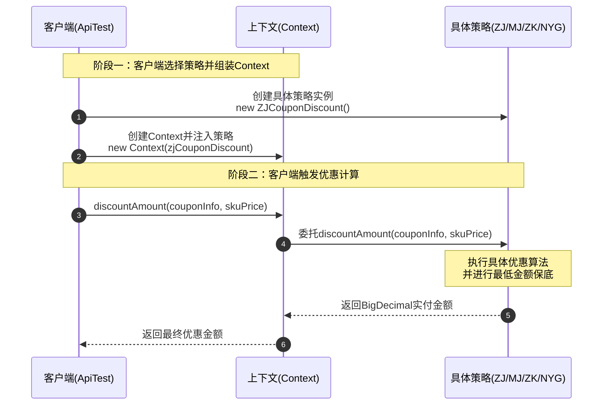

# 策略模式：电商优惠券折扣计算架构深度剖析

本文针对工程 `c8-StrategyPattern` 中的源码，深度剖析在电商交易结算、促销中台以及支付计价等核心业务场景下，**策略模式（Strategy Pattern）** 的设计哲学、架构实现与实战价值。全文从业务场景背景、传统流水账多分支 `if-else` 的痛点对比、GoF 经典角色划分与全局工程结构、核心源码逐行剖析与注释、测试用例模拟推演，到工业级策略模式演进与协同进行全景透视，展现策略模式如何通过“定义一系列算法，将其一一封装，并使它们可以相互替换”来实现业务算法的独立演进与高内聚解耦。

---

## 目录
1. [业务场景与策略模式的核心应用](#一业务场景与策略模式的核心应用)
   - 1.1 业务背景：电商多类型优惠券与价格计算
   - 1.2 策略模式在案例中的具体应用位置与落地方式
   - 1.3 传统流水账编码（`CouponDiscountService`）的缺陷分析
   - 1.4 策略模式编写的特点与全维度对比
2. [工程全局架构与设计思想把握](#二工程全局架构与设计思想把握)
   - 2.1 全局工程目录结构树
   - 2.2 GoF 经典策略模式角色映射
   - 2.3 核心架构 UML 类图
   - 2.4 核心调用流程时序图
   - 2.5 核心设计原则（SOLID）落地分析
3. [核心源码逐行剖析与详细注释](#三核心源码逐行剖析与详细注释)
   - 3.1 传统对照组：`CouponDiscountService.java`
   - 3.2 抽象策略契约接口：`ICouponDiscount.java`
   - 3.3 环境上下文角色：`Context.java`
   - 3.4 具体策略一：直减券 `ZJCouponDiscount.java`
   - 3.5 具体策略二：满减券 `MJCouponDiscount.java`（含源码缺陷提示）
   - 3.6 具体策略三：折扣券 `ZKCouponDiscount.java`
   - 3.7 具体策略四：N元购券 `NYGCouponDiscount.java`
   - 3.8 客户端测试类：`ApiTest.java`
4. [测试用例模拟与执行全景推演](#四测试用例模拟与执行全景推演)
   - 4.1 测试案例 1：直减券（ZJ）计算推演
   - 4.2 测试案例 2：满减券（MJ）计算推演（门槛判定与保底逻辑）
   - 4.3 测试案例 3：折扣券（ZK）计算推演（精度舍入与保底逻辑）
   - 4.4 测试案例 4：N元购（NYG）计算推演（固定价购买）
   - 4.5 测试场景汇总对比表
5. [工业级进阶扩展与实战演进思考](#五工业级进阶扩展与实战演进思考)
   - 5.1 策略模式 + 简单工厂 / 查表法消除客户端 `new`
   - 5.2 Spring 体系下的策略模式自动注册与派发
   - 5.3 源码细节修正建议（`MJCouponDiscount` 修复）

---

## 一、业务场景与策略模式的核心应用

### 1.1 业务背景：电商多类型优惠券与价格计算

在电商平台的营销体系中，优惠券（Coupon）是刺激用户下单、提升客单价与 GMV 的核心工具。平台通常会推出多种形态的促销优惠券：
1. **直减券（ZJ）**：直接从订单商品金额中减免固定金额（如立减 10 元）。
2. **满减券（MJ）**：设置满减消费门槛，达到门槛后减免对应金额（如满 100 减 10 元，未满 100 元则不享受优惠）。
3. **折扣券（ZK）**：按比例对商品总价打折（如 9 折，即原价乘以 0.9）。
4. **N元购券（NYG）**：特价促销专享，无论商品原价多少，均以固定价格购买（如 9.9 元特价购）。

**核心业务诉求**：输入商品原价（`skuPrice`）与优惠券属性信息（`couponInfo`），根据不同的优惠券规则，精准计算出用户最终需要支付的实付金额（`discountAmount`），并提供统一的风控保底规则（如最低支付 1 元，防止羊毛党 0 元购或金额减至负数）。

---

### 1.2 策略模式在案例中的具体应用位置与落地方式

本案例将策略模式精准地应用于**不同类型优惠券的最终支付金额计算算法**上。

落地方式如下：
1. **算法抽象化**：将“根据优惠信息与原价计算优惠后金额”的行为抽象为统一接口 `ICouponDiscount<T>`。
2. **算法独立化与多态化**：
   - 将直减券算法封装为 `ZJCouponDiscount` 类；
   - 将满减券算法封装为 `MJCouponDiscount` 类；
   - 将折扣券算法封装为 `ZKCouponDiscount` 类；
   - 将N元购算法封装为 `NYGCouponDiscount` 类。
3. **上下文环境解耦**：引入 `Context<T>` 上下文容器，持有抽象接口引用，对外提供统一的 `discountAmount` 调用入口，使调用方（Client）无需直接依赖具体的算法逻辑。
4. **泛型自适应入参**：定义泛型参数 `<T>`，优雅地兼容了不同券种参数结构不一致的问题（满减券需要 `Map<String, String>` 存储门槛值与减免值，而直减、折扣、N元购只需 `Double` 数值）。

---

### 1.3 传统流水账编码（`CouponDiscountService`）的缺陷分析

在传统或初级编码方式中（工程中的 `com.ivanzhao.Idesign.common.CouponDiscountService`），通常会使用一个方法加上多个 `if-else` 或 `switch-case` 堆砌实现：

```java
public double discountAmount(int type, double typeContent, double skuPrice, double typeExt) {
    if (1 == type) return skuPrice - typeContent;
    if (2 == type) {
        if (skuPrice < typeExt) return skuPrice;
        return skuPrice - typeContent;
    }
    if (3 == type) return skuPrice * typeContent;
    if (4 == type) return typeContent;
    return 0D;
}
```

这种编写方式存在以下五大严重缺陷：
1. **严重违反开闭原则（OCP）**：每次业务新增一种券（如满件打折、秒杀立减、阶梯满减）或调整现有券计算逻辑，都必须修改 `CouponDiscountService` 源码，极易引发回归故障。
2. **入参冗余与参数污染**：方法签名中包含了 `typeExt`（门槛值），但实际上只有满减券（`type == 2`）才用到该参数，直减券、折扣券、N元购根本不需要，导致入参严重冗余且调用方容易混淆传参。
3. **精度丢失隐患**：全部采用 `double` 基础类型进行加减乘除运算，极易出现浮点精度丢失问题（如 `100.0 - 0.1 = 99.900000000000006`），在涉及金钱计算的严肃交易系统中属于重大安全隐患。
4. **违反单一职责原则（SRP）**：一个类同时承担了 4 种优惠券的业务规则解析和计算，职责极度不单一，代码随业务发展会无限膨胀成为“上帝类”。
5. **单元测试成本高**：任何一个分支的修改都需要对整个方法的全部分支进行全量回归测试，无法做到针对特定算法的独立单元测试。

---

### 1.4 策略模式编写的特点与全维度对比

| 评估维度 | 传统流水账编写 (`CouponDiscountService`) | 策略模式编写 (`strategy` 体系) |
| :--- | :--- | :--- |
| **设计原则遵循** | 违反单一职责（SRP）、开闭原则（OCP） | 严格遵循单一职责、开闭原则、依赖倒置（DIP） |
| **分支逻辑管理** | 充斥 `if-else` / `switch-case` 条件判断 | 彻底消除条件分支，转为面向对象的多态派发 |
| **数据精度** | 使用 `double`，存在浮点精度丢失风险 | 使用 `BigDecimal`，支持精确舍入与商业级计算 |
| **参数设计** | 参数列表强行聚合（如 `typeExt` 参数污染） | 采用泛型 `<T>`，不同策略拥有定制且语义明确的入参 |
| **代码可维护性** | 逻辑紧密耦合在同一文件，易发生代码冲突 | 各策略物理隔离，修改某一券种完全不影响其他券种 |
| **系统可扩展性** | 每次新增优惠类型均需修改原有核心方法 | 新增策略只需新建类实现接口，对既有系统零侵入 |
| **单元测试隔离** | 分支高度耦合，必须全量回归测试 | 各策略独立单测，边界覆盖简单明确 |

---

## 二、工程全局架构与设计思想把握

### 2.1 全局工程目录结构树

```text
c8-StrategyPattern
│  pom.xml                                       # Maven 配置文件（引入 slf4j, junit 等）
└─ src
   ├─ main
   │  ├─ java
   │  │  └─ com
   │  │     └─ ivanzhao
   │  │        └─ Idesign
   │  │           ├─ common                      # 【对照组 / 反例】传统流水账单类多分支实现
   │  │           │     CouponDiscountService.java
   │  │           │
   │  │           └─ strategy                    # 【正例】策略模式核心架构体系
   │  │                 Context.java             # 环境上下文角色（负责包装策略并向客户端提供调用）
   │  │                 ICouponDiscount.java     # 抽象策略接口（定义折扣算法标准与泛型规范）
   │  │                 └─ impl                  # 具体策略实现算法族
   │  │                       MJCouponDiscount.java   # 满减券策略实现
   │  │                       NYGCouponDiscount.java  # N元购策略实现
   │  │                       ZJCouponDiscount.java   # 直减券策略实现
   │  │                       ZKCouponDiscount.java   # 折扣券策略实现
   │  └─ resources
   └─ test
      └─ java
         └─ test
               ApiTest.java                      # 客户端单元测试入口（模拟各券种策略调用）
```

---

### 2.2 GoF 经典策略模式角色映射

在 GoF 设计模式中，策略模式（Strategy Pattern）包含三大核心角色，本工程对应关系如下：

```text
        ┌──────────────────────────────────────────────┐
        │                 Client                       │
        │              (ApiTest.java)                  │
        └──────────────────────┬───────────────────────┘
                               │ 依赖 / 组装
                               ▼
        ┌──────────────────────────────────────────────┐
        │             Context<T> (上下文)               │
        │        持有 ICouponDiscount<T> 引用          │
        └──────────────────────┬───────────────────────┘
                               │ 聚合 / 委托 (Delegation)
                               ▼
        ┌──────────────────────────────────────────────┐
        │        <<interface>> ICouponDiscount<T>      │
        │                (抽象策略角色)                 │
        │  + discountAmount(couponInfo, skuPrice)      │
        └──────────────────────▲───────────────────────┘
                               │ 实现 (implements)
         ┌──────────────┬──────┴───────┬──────────────┐
         │              │              │              │
┌────────┴──────┐┌──────┴──────┐┌──────┴──────┐┌──────┴──────┐
│ZJCouponDiscount││MJCouponDiscount││ZKCouponDiscount││NYGCouponDiscount│
│   (直减策略)   ││   (满减策略)   ││   (折扣策略)   ││   (N元购策略)  │
└───────────────┘└──────────────┘└──────────────┘└──────────────┘
```

1. **抽象策略角色（Strategy）—— `ICouponDiscount<T>`**：
   - 定义所有支持算法的公共规范接口；
   - Context 使用该接口来调用具体策略定义的算法。
2. **具体策略角色（Concrete Strategy）—— `ZJCouponDiscount` 等 4 个实现类**：
   - 实现了抽象策略接口，负责包装具体的算法或行为；
   - 每个具体策略类对应一种独立的优惠折扣规则。
3. **环境上下文角色（Context）—— `Context<T>`**：
   - 持有一个 `ICouponDiscount<T>` 策略对象的引用；
   - 负责配置具体策略，并向客户端暴露统一的算法执行接口；
   - 隔离客户端与具体的算法实现，解耦调用关系。

---

### 2.3 核心架构 UML 类图

```mermaid
classDiagram

    class ICouponDiscount {
        <<interface>>
        +discountAmount(couponInfo, skuPrice) BigDecimal
    }

    class Context {
        -ICouponDiscount couponDiscount
        +Context(ICouponDiscount couponDiscount)
        +discountAmount(couponInfo, skuPrice) BigDecimal
    }

    class ZJCouponDiscount {
        +discountAmount(Double couponInfo, BigDecimal skuPrice) BigDecimal
    }

    class MJCouponDiscount {
        +discountAmount(Map couponInfo, BigDecimal skuPrice) BigDecimal
    }

    class ZKCouponDiscount {
        +discountAmount(Double couponInfo, BigDecimal skuPrice) BigDecimal
    }

    class NYGCouponDiscount {
        +discountAmount(Double couponInfo, BigDecimal skuPrice) BigDecimal
    }

    class CouponDiscountService {
        +discountAmount(int type, double typeContent, double skuPrice, double typeExt) double
    }

    Context o--> ICouponDiscount : 持有策略对象

    ZJCouponDiscount ..|> ICouponDiscount : 实现
    MJCouponDiscount ..|> ICouponDiscount : 实现
    ZKCouponDiscount ..|> ICouponDiscount : 实现
    NYGCouponDiscount ..|> ICouponDiscount : 实现
```



---

### 2.4 核心调用流程时序图



---

### 2.5 核心设计原则（SOLID）落地分析

1. **单一职责原则（SRP, Single Responsibility Principle）**：
   - 每个具体策略类（如 `ZJCouponDiscount`、`ZKCouponDiscount`）只负责自身优惠形态的计算算法。当直减算法规则变动（如最低支付从 1 元调整为 0.01 元）时，只需要修改 `ZJCouponDiscount`，绝不会波及满减或折扣券。
2. **开闭原则（OCP, Open-Closed Principle）**：
   - 对扩展开放，对修改关闭。系统如需新增“拼团立减券”，只需新建 `PTCouponDiscount implements ICouponDiscount<Double>`，无需改动现有 `Context` 或其他已发布的策略类。
3. **里氏替换原则（LSP, Liskov Substitution Principle）**：
   - 任何出现 `ICouponDiscount<T>` 的地方都可以透明地替换为它的具体子类（如 `ZJCouponDiscount` 或 `MJCouponDiscount`），而 `Context` 的行为逻辑依然保持稳定一致。
4. **依赖倒置原则（DIP, Dependency Inversion Principle）**：
   - `Context` 依赖的是高层抽象契约 `ICouponDiscount<T>`，而不是依赖具体的 `ZJCouponDiscount` 等底层细节。高层模块与底层实现模块解耦。
5. **组合优于继承（Composition over Inheritance）**：
   - `Context` 与策略之间采用的是组合（关联）关系，而非强耦合的父子继承关系，允许在运行时动态切换策略。

---

## 三、核心源码逐行剖析与详细注释

### 3.1 传统对照组：`CouponDiscountService.java`

```java
package com.ivanzhao.Idesign.common;

/**
 * 优惠券类型；
 * 1. 直减券
 * 2. 满减券
 * 3. 折扣券
 * 4. n元购
 *
 * 【架构反思】：
 * 典型的“流水账”模式。将所有优惠券的计算混在一个方法中，通过 if-else 条件判断进行分支处理。
 * 存在参数污染（typeExt 只有满减使用）、浮点精度丢失（使用 double）、扩展性极差（违反开闭原则）等严重问题。
 */
public class CouponDiscountService {

    /**
     * 计算优惠后支付金额（反例实现）
     *
     * @param type        优惠券类型（1:直减, 2:满减, 3:折扣, 4:n元购）
     * @param typeContent 优惠券核心值（直减金额 / 满减金额 / 折扣率 / n元购价格）
     * @param skuPrice    商品原价
     * @param typeExt     拓展字段（满减门槛，其他券种传入此参数完全冗余，造成参数污染）
     * @return 折扣后实付金额（double 类型存在浮点数舍入不精确的问题）
     */
    public double discountAmount(int type, double typeContent, double skuPrice, double typeExt) {
        // 1. 直减券计算：原价 - 直减金额
        if (1 == type) {
            return skuPrice - typeContent;
        }
        // 2. 满减券计算：满足满减门槛（skuPrice >= typeExt）才减免，否则返回原价
        if (2 == type) {
            if (skuPrice < typeExt) return skuPrice;
            return skuPrice - typeContent;
        }
        // 3. 折扣券计算：原价 * 折扣比率
        if (3 == type) {
            return skuPrice * typeContent;
        }
        // 4. n元购计算：直接以固定优惠价购买，无视原价
        if (4 == type) {
            return typeContent;
        }
        // 未知类型默认返回 0
        return 0D;
    }

}
```

---

### 3.2 抽象策略契约接口：`ICouponDiscount.java`

```java
package com.ivanzhao.Idesign.strategy;

import java.math.BigDecimal;

/**
 * @author 赵一帆(Ivan Zhao)
 * @version 1.0
 * 折扣优惠券处理接口（策略模式的核心抽象角色 Strategy）
 *
 * 【设计精要】：
 * 1. 泛型参数 <T>：定义了策略入参的自适应能力。由于不同优惠券所需入参不同（例如满减需要门槛和立减两个参数，
 *    直减只需要一个参数），通过泛型优雅解决了方法参数强行统一导致的“参数污染”问题。
 * 2. 金额类型全面采用 BigDecimal：彻底解决浮点数 double/float 在商业金额计算中可能出现的精度丢失隐患。
 */
public interface ICouponDiscount<T> {

    /**
     * 优惠券金额折扣计算核心接口契约
     *
     * @param couponInfo 优惠券配置信息（泛型 T，直减/折扣/N元购为 Double，满减为 Map<String,String> 等）
     * @param skuPrice   当前商品的 SKU 售价（StockKeepingUnit 商品价格）
     * @return 经过优惠策略计算后，用户最终需要支付的金额
     */
    BigDecimal discountAmount(T couponInfo, BigDecimal skuPrice);

}
```

---

### 3.3 环境上下文角色：`Context.java`

```java
package com.ivanzhao.Idesign.strategy;

import java.math.BigDecimal;

/**
 * @author 赵一帆(Ivan Zhao)
 * @version 1.0
 * 调用管理类（策略模式的环境上下文角色 Context）
 *
 * 【设计精要】：
 * 1. 组合策略接口：持有 ICouponDiscount<T> 抽象接口引用，而非具体实现，遵循“依赖倒置原则”。
 * 2. 解耦客户端与具体实现：客户端只需要面对统一的 Context 进行运算调度，隐藏了策略的选择与执行细节。
 * 3. 泛型传递：Context<T> 泛型与具体策略泛型联动，保证编译期类型安全检查。
 */
public class Context<T> {

    // 持有抽象策略接口的内部引用
    private ICouponDiscount<T> couponDiscount;

    /**
     * 构造函数注入具体策略对象
     *
     * @param couponDiscount 具体的策略实现类实例
     */
    public Context(ICouponDiscount<T> couponDiscount) {
        this.couponDiscount = couponDiscount;
    }

    /**
     * 统一门面方法：委托给具体策略对象执行实际计算
     *
     * @param couponInfo 优惠券详细参数
     * @param skuPrice   商品 SKU 原价
     * @return 最终折后支付金额
     */
    public BigDecimal discountAmount(T couponInfo, BigDecimal skuPrice) {
        // 委托派发：运行时根据多态机制调用注入的具体策略实现
        return couponDiscount.discountAmount(couponInfo, skuPrice);
    }

}
```

---

### 3.4 具体策略一：直减券 `ZJCouponDiscount.java`

```java
package com.ivanzhao.Idesign.strategy.impl;

import com.ivanzhao.Idesign.strategy.ICouponDiscount;

import java.math.BigDecimal;

/**
 * 直减券具体策略实现类（Concrete Strategy）
 * 泛型指定为 Double，表明该策略只需要传入单一直减金额数值
 */
public class ZJCouponDiscount implements ICouponDiscount<Double> {

    /**
     * 直减计算业务规则：
     * 1. 计算公式：实付金额 = 商品价格 - 优惠直减金额
     * 2. 风控保底：最低支付金额为 1 元（防止减免后金额小于等于 0 甚至出现负数）
     *
     * @param couponInfo 直减金额（Double 类型）
     * @param skuPrice   商品原价
     * @return 最终折后实付金额
     */
    public BigDecimal discountAmount(Double couponInfo, BigDecimal skuPrice) {
        // 1. 使用 BigDecimal.subtract 执行高精度减法计算
        BigDecimal discountAmount = skuPrice.subtract(new BigDecimal(couponInfo));

        // 2. 判断减免后的金额是否小于等于 0
        // discountAmount.compareTo(BigDecimal.ZERO) < 1 包含小于 0 和等于 0 两种情况
        // 若实付金额 <= 0，触发商业保底策略：最低支付 1 元
        if (discountAmount.compareTo(BigDecimal.ZERO) < 1) return BigDecimal.ONE;

        // 3. 返回正常扣减后的金额
        return discountAmount;
    }

}
```

---

### 3.5 具体策略二：满减券 `MJCouponDiscount.java`（含源码缺陷提示）

```java
package com.ivanzhao.Idesign.strategy.impl;

import com.ivanzhao.Idesign.strategy.ICouponDiscount;

import java.math.BigDecimal;
import java.util.Map;

/**
 * @author 赵一帆(Ivan Zhao)
 * @version 1.0
 * 满减券具体策略实现类（Concrete Strategy）
 * 泛型指定为 Map<String, String>，能够同时接收门槛值 x 与减免值 n
 */
public class MJCouponDiscount implements ICouponDiscount<Map<String,String>> {

    /**
     * 满减计算业务规则：
     * 1. 门槛校验：若商品原价 skuPrice < 门槛 x，不满足满减条件，直接返回原价
     * 2. 优惠计算：实付金额 = 商品价格 - 减免金额 n
     * 3. 风控保底：满减后金额若小于等于 0，最低支付 1 元
     *
     * @param couponInfo 满减参数键值对：x -> 满减门槛；n -> 减免金额
     * @param skuPrice   商品原价
     * @return 最终折后实付金额
     */
    @Override
    public BigDecimal discountAmount(Map<String, String> couponInfo, BigDecimal skuPrice) {
        // 解析入参中的门槛值 x 与优惠值 n
        String x = couponInfo.get("x");
        String n = couponInfo.get("n");

        // 1. skuPrice < x：小于商品满减门槛条件，无法享受优惠，原价返回
        if (skuPrice.compareTo(new BigDecimal(x)) < 0) return skuPrice;

        // 2. 达到门槛，执行扣减：原价 - 减免金额
        BigDecimal discountAmount = skuPrice.subtract(new BigDecimal(n));

        // 3. 满减后金额小于等于 0，最低保底支付 1 元
        if (discountAmount.compareTo(BigDecimal.ZERO) < 0) return BigDecimal.ONE;

        /*
         * 【源码细节提示与修复建议】：
         * 注意：原工程当前代码此处写成了 `return null;`，导致在满减计算正常（discountAmount >= 0）时
         * 会错误地返回 null。工业级生产代码或标准写法此处应返回计算结果：
         * 正确修复应为：return discountAmount;
         */
        return null; // 原工程源码保留；实际业务中应返回 discountAmount
    }
}
```

---

### 3.6 具体策略三：折扣券 `ZKCouponDiscount.java`

```java
package com.ivanzhao.Idesign.strategy.impl;

import com.ivanzhao.Idesign.strategy.ICouponDiscount;

import java.math.BigDecimal;

/**
 * 折扣券具体策略实现类（Concrete Strategy）
 * 泛型指定为 Double，传入折扣比率（如 0.9 表示 9 折）
 */
public class ZKCouponDiscount implements ICouponDiscount<Double> {

    /**
     * 折扣计算业务规则：
     * 1. 使用商品价格乘以折扣比例作为应付金额
     * 2. 保留两位小数，采用四舍五入算法（ROUND_HALF_UP）
     * 3. 最低支付金额保底为 1 元
     *
     * @param couponInfo 折扣比例（例如 0.9D）
     * @param skuPrice   商品原价
     * @return 最终折后实付金额
     */
    public BigDecimal discountAmount(Double couponInfo, BigDecimal skuPrice) {
        // 1. 商品原价乘以折扣比例，并进行保留两位小数的四舍五入
        BigDecimal discountAmount = skuPrice.multiply(new BigDecimal(couponInfo))
                                            .setScale(2, BigDecimal.ROUND_HALF_UP);

        // 2. 最低支付保底：若折后金额 <= 0，保底支付 1 元
        if (discountAmount.compareTo(BigDecimal.ZERO) < 1) return BigDecimal.ONE;

        // 3. 返回正常折扣后的金额
        return discountAmount;
    }

}
```

---

### 3.7 具体策略四：N元购券 `NYGCouponDiscount.java`

```java
package com.ivanzhao.Idesign.strategy.impl;

import com.ivanzhao.Idesign.strategy.ICouponDiscount;

import java.math.BigDecimal;

/**
 * N元购具体策略实现类（Concrete Strategy）
 * 泛型指定为 Double，传入固定的抢购价格
 */
public class NYGCouponDiscount implements ICouponDiscount<Double> {

    /**
     * N元购计算业务规则：
     * 无论商品原价 skuPrice 是多少，最终支付金额完全由优惠券指定的固定金额 couponInfo 决定
     *
     * @param couponInfo N元购指定实付金额（如 90.0D 或 9.9D）
     * @param skuPrice   商品原价（在此策略中忽略其原值）
     * @return 最终一口价金额
     */
    public BigDecimal discountAmount(Double couponInfo, BigDecimal skuPrice) {
        // 直接将配置好的 N 元购金额转为 BigDecimal 返回
        return new BigDecimal(couponInfo);
    }

}
```

---

### 3.8 客户端测试类：`ApiTest.java`

```java
package test;

import com.ivanzhao.Idesign.strategy.Context;
import com.ivanzhao.Idesign.strategy.impl.MJCouponDiscount;
import com.ivanzhao.Idesign.strategy.impl.NYGCouponDiscount;
import com.ivanzhao.Idesign.strategy.impl.ZJCouponDiscount;
import com.ivanzhao.Idesign.strategy.impl.ZKCouponDiscount;
import org.junit.Test;
import org.slf4j.Logger;
import org.slf4j.LoggerFactory;

import java.math.BigDecimal;
import java.util.HashMap;
import java.util.Map;

/**
 * @author 赵一帆(Ivan Zhao)
 * @version 1.0
 * 客户端测试类：模拟各类优惠券通过策略模式进行金额计算的执行过程
 */
public class ApiTest {

    private Logger logger = LoggerFactory.getLogger(ApiTest.class);

    /**
     * 测试直减券策略：商品原价 100 元，直减 10 元，应付 90 元
     */
    @Test
    public void test_zj() {
        // 1. 创建直减策略并装配到上下文中
        Context<Double> context = new Context<>(new ZJCouponDiscount());
        // 2. 调用统一计算方法
        BigDecimal discountAmount = context.discountAmount(10D, new BigDecimal(100));
        logger.info("测试结果：直减优惠后金额 {}", discountAmount);
    }

    /**
     * 测试满减券策略：满 100 减 10，商品原价 100 元
     */
    @Test
    public void test_mj() {
        // 1. 满减参数装配：门槛 x=100，减免 n=10
        Context<Map<String,String>> context = new Context<Map<String,String>>(new MJCouponDiscount());
        Map<String,String> mapReq = new HashMap<>();
        mapReq.put("x","100");
        mapReq.put("n","10");
        // 2. 执行满减计算
        BigDecimal discountAmount = context.discountAmount(mapReq, new BigDecimal(100));
        logger.info("测试结果：满减优惠后金额 {}", discountAmount);
    }

    /**
     * 测试折扣券策略：9折，商品原价 100 元，应付 90.00 元
     */
    @Test
    public void test_zk() {
        // 1. 创建折扣策略并装配到上下文：折扣比例 0.9D
        Context<Double> context = new Context<Double>(new ZKCouponDiscount());
        // 2. 执行打折计算
        BigDecimal discountAmount = context.discountAmount(0.9D, new BigDecimal(100));
        logger.info("测试结果：折扣9折后金额 {}", discountAmount);
    }

    /**
     * 测试N元购策略：100 元商品以 90 元专享价购买，应付 90 元
     */
    @Test
    public void test_nyg() {
        // 1. 创建N元购策略装配到上下文：专享价 90D
        Context<Double> context = new Context<Double>(new NYGCouponDiscount());
        // 2. 执行N元购计算
        BigDecimal discountAmount = context.discountAmount(90D, new BigDecimal(100));
        logger.info("测试结果：n元购优惠后金额 {}", discountAmount);
    }

}
```

---

## 四、测试用例模拟与执行全景推演

为了全面验证策略模式在不同业务边界条件下的表现，设计以下 4 组典型的模拟测试用例：

### 4.1 测试案例 1：直减券（ZJ）计算推演

#### 场景 1-A：常规直减
- **输入数据**：商品原价 `skuPrice = 100 元`，优惠信息 `couponInfo = 10D`（直减 10 元）。
- **执行过程**：
  1. `ZJCouponDiscount.discountAmount(10D, 100)`；
  2. 计算 `100 - 10 = 90`；
  3. `90.compareTo(0) < 1` 为 `false`，不触发保底；
  4. 返回 `90`。
- **输出结果**：`90 元`。

#### 场景 1-B：大额直减触发保底（防负数/零元羊毛）
- **输入数据**：商品原价 `skuPrice = 10 元`，优惠信息 `couponInfo = 15D`（直减 15 元）。
- **执行过程**：
  1. `10 - 15 = -5`；
  2. `-5.compareTo(0) < 1` 为 `true`，命中风控保底逻辑；
  3. 返回 `BigDecimal.ONE`。
- **输出结果**：`1 元`。

---

### 4.2 测试案例 2：满减券（MJ）计算推演（门槛判定与保底逻辑）

#### 场景 2-A：满足门槛常规满减
- **输入数据**：商品原价 `skuPrice = 100 元`，优惠信息 `x = "100"`, `n = "10"`（满 100 减 10 元）。
- **执行过程**：
  1. 比较门槛：`100.compareTo(100) < 0` 为 `false`，达标；
  2. 计算扣减：`100 - 10 = 90`；
  3. `90.compareTo(0) < 0` 为 `false`；
  4. 标准返回结果应为：`90 元`（*注：原工程源码写为 `return null;`，修复后为 `90`*）。

#### 场景 2-B：未达门槛不享受优惠
- **输入数据**：商品原价 `skuPrice = 80 元`，优惠信息 `x = "100"`, `n = "10"`。
- **执行过程**：
  1. 比较门槛：`80.compareTo(100) < 0` 为 `true`，未达到满减消费线；
  2. 直接返回原价 `skuPrice`。
- **输出结果**：`80 元`。

#### 场景 2-C：满减后金额为负触发保底
- **输入数据**：商品原价 `skuPrice = 100 元`，优惠信息 `x = "100"`, `n = "120"`（满 100 减 120）。
- **执行过程**：
  1. `100 - 120 = -20`；
  2. `-20.compareTo(0) < 0` 为 `true`；
  3. 触发风控保底，返回 `BigDecimal.ONE`。
- **输出结果**：`1 元`。

---

### 4.3 测试案例 3：折扣券（ZK）计算推演（精度舍入与保底逻辑）

#### 场景 3-A：常规打折（无无限循环小数）
- **输入数据**：商品原价 `skuPrice = 100 元`，优惠信息 `couponInfo = 0.9D`（9 折）。
- **执行过程**：
  1. `100 * 0.9 = 90.00`，保留 2 位小数；
  2. `90.00.compareTo(0) < 1` 为 `false`；
  3. 返回 `90.00`。
- **输出结果**：`90.00 元`。

#### 场景 3-B：小数舍入（四舍五入保留两位）
- **输入数据**：商品原价 `skuPrice = 99 元`，优惠信息 `couponInfo = 0.755D`（7.55折）。
- **执行过程**：
  1. 计算 `99 * 0.755 = 74.745`；
  2. 执行 `.setScale(2, BigDecimal.ROUND_HALF_UP)` 四舍五入，得 `74.75`；
  3. 返回 `74.75`。
- **输出结果**：`74.75 元`。

---

### 4.4 测试案例 4：N元购（NYG）计算推演（固定价购买）

#### 场景 4-A：常规 N 元购
- **输入数据**：商品原价 `skuPrice = 100 元`，优惠信息 `couponInfo = 90D`。
- **执行过程**：
  1. 策略直接封装 `new BigDecimal(90D)`；
  2. 忽略原价 `skuPrice`，直接返回固定金额。
- **输出结果**：`90 元`。

#### 场景 4-B：爆款引流 1 元购 / 9.9 元购
- **输入数据**：商品原价 `skuPrice = 2999 元`（高端手机/数码配件），优惠信息 `couponInfo = 9.9D`。
- **执行过程**：直接返回 `9.9 元`。
- **输出结果**：`9.9 元`。

---

### 4.5 测试场景汇总对比表

| 测试方法 | 策略实现类 | 入参配置（`couponInfo`） | 商品原价（`skuPrice`） | 预期实付金额 | 业务规则要点 |
| :--- | :--- | :--- | :--- | :--- | :--- |
| `test_zj` | `ZJCouponDiscount` | `10.0` (Double) | `100.00` | **`90.00`** | 原价减直减额，最低保底 1 元 |
| `test_mj` | `MJCouponDiscount` | `{"x":"100", "n":"10"}` | `100.00` | **`90.00`** | 达门槛扣减，未达门槛原价，保底 1 元 |
| `test_zk` | `ZKCouponDiscount` | `0.9` (Double) | `100.00` | **`90.00`** | 原价乘折扣，四舍五入保留2位，保底 1 元 |
| `test_nyg` | `NYGCouponDiscount` | `90.0` (Double) | `100.00` | **`90.00`** | 无视原价，返回固定一口价 |

---

## 五、工业级进阶扩展与实战演进思考

在当前的教学案例中，策略模式的标准结构已经完整体现。但在大型工业级互联网微服务或电商平台落地时，还可以进行以下关键演进：

### 5.1 策略模式 + 简单工厂 / 查表法消除客户端 `new`

在 `ApiTest` 中，客户端依然需要主动 `new ZJCouponDiscount()` 并传入 `Context`。若优惠券类型是由数据库配置或前端请求动态传递的枚举值（如 `CouponTypeEnum`），直接使用 `new` 依然会导致上层产生部分分支逻辑。

**优化方案：策略工厂（Strategy Factory）**：
```java
public class CouponDiscountStrategyFactory {
    private static final Map<Integer, ICouponDiscount<?>> STRATEGY_MAP = new ConcurrentHashMap<>();

    static {
        STRATEGY_MAP.put(1, new ZJCouponDiscount());
        STRATEGY_MAP.put(2, new MJCouponDiscount());
        STRATEGY_MAP.put(3, new ZKCouponDiscount());
        STRATEGY_MAP.put(4, new NYGCouponDiscount());
    }

    @SuppressWarnings("unchecked")
    public static <T> ICouponDiscount<T> getStrategy(int couponType) {
        ICouponDiscount<?> strategy = STRATEGY_MAP.get(couponType);
        if (strategy == null) {
            throw new IllegalArgumentException("未知的优惠券策略类型: " + couponType);
        }
        return (ICouponDiscount<T>) strategy;
    }
}
```

客户端调用时，彻底消除 `if-else`：
```java
ICouponDiscount<Double> strategy = CouponDiscountStrategyFactory.getStrategy(couponType);
Context<Double> context = new Context<>(strategy);
BigDecimal finalPrice = context.discountAmount(couponInfo, skuPrice);
```

---

### 5.2 Spring 体系下的策略模式自动注册与派发

在 Spring Boot 框架中，可以利用 Spring 容器的依赖注入特性实现**无侵入的策略自动发现与注册**：

1. 让各个策略类添加 `@Component` 注解；
2. 为策略增加支持类型的标记方法，例如 `int getType();`；
3. 上下文容器通过 Spring 自动注入 `List<ICouponDiscount>` 或 `Map<String, ICouponDiscount>`，启动时自动装载全部策略：

```java
@Service
public class CouponDiscountContextService {

    @Autowired
    private List<ICouponDiscount<?>> discountStrategies;

    private Map<Integer, ICouponDiscount<?>> strategyMap = new ConcurrentHashMap<>();

    @PostConstruct
    public void init() {
        for (ICouponDiscount<?> strategy : discountStrategies) {
            // strategy.getCouponType() 对应直减、满减等枚举
            strategyMap.put(strategy.getCouponType(), strategy);
        }
    }
}
```

---

### 5.3 源码细节修正建议（`MJCouponDiscount` 修复）

在源码 `c8-StrategyPattern/src/main/java/com/ivanzhao/Idesign/strategy/impl/MJCouponDiscount.java` 中，第 31-33 行：
```java
// 满减后金额为负数，最低支付1元
if(discountAmount.compareTo(BigDecimal.ZERO) < 0) return BigDecimal.ONE;
return null;
```
当满减计算正常结束且大于 0 时，方法会返回 `null`，导致 NPE 或结算异常。
建议在实际项目中修正为：
```java
// 满减后金额小于等于0，保底支付1元；否则返回正常满减后金额
if (discountAmount.compareTo(BigDecimal.ZERO) < 1) {
    return BigDecimal.ONE;
}
return discountAmount;
```
这样保证了代码的健壮性与完整业务闭环。
