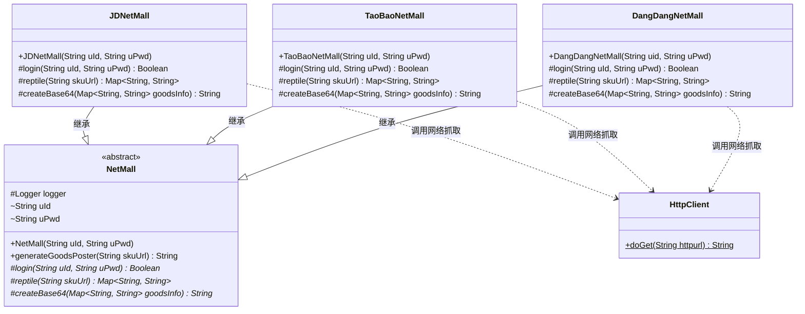
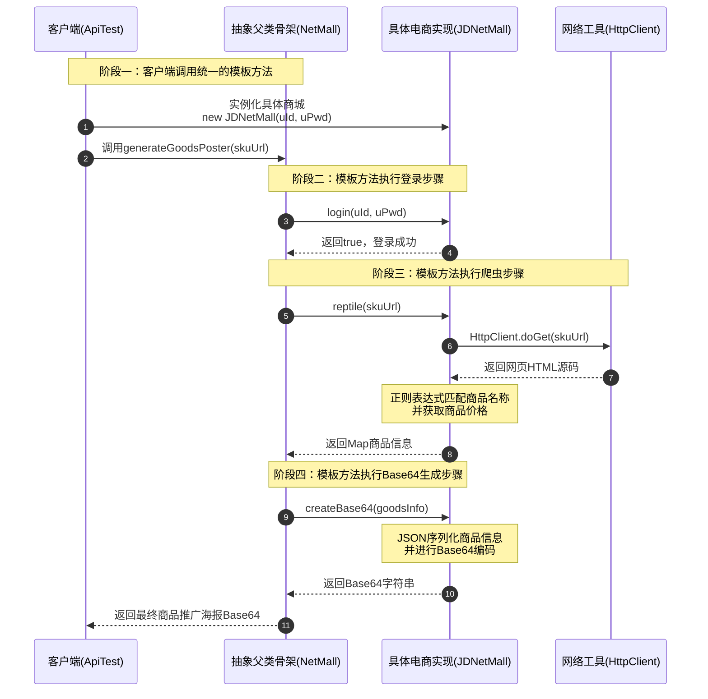

# 模板模式：多平台电商分销海报生成架构深度剖析

本文针对工程 `c9-TemplatePattern` 中的源码，深度剖析在电商多渠道分销推广、社交淘客/京粉返利、跨平台比价以及统一数据抓取等核心业务场景下，**模板模式（Template Method Pattern / 模板方法模式）** 的设计哲学、架构实现与实战价值。全文从业务场景背景、传统重复代码与嵌套分支的痛点对比、GoF 经典角色划分与全局工程结构、核心源码逐行剖析与注释、测试用例模拟推演，到工业级模板模式演进（钩子方法、并发抓取、分布式调度等）进行全景透视，展现模板模式如何通过“在抽象父类中定义算法骨架，而将一些步骤延迟到子类中实现”来实现流程管控的统一与实现细节的灵活定制。

---

## 目录
1. [业务场景与模板模式的核心应用](#一业务场景与模板模式的核心应用)
   - 1.1 业务背景：电商多渠道商品推广海报生成
   - 1.2 模板模式在案例中的具体应用位置与落地方式
   - 1.3 传统流水账编码方式的痛点剖析
   - 1.4 模板模式编写的特点与全维度对比（好莱坞原则）
2. [工程全局架构与设计思想把握](#二工程全局架构与设计思想把握)
   - 2.1 全局工程目录结构树
   - 2.2 GoF 经典模板方法模式角色映射
   - 2.3 核心架构 UML 类图
   - 2.4 核心调用流程时序图
   - 2.5 核心设计原则（SOLID & Hollywood Principle）深度解析
3. [核心源码逐行剖析与详细注释](#三核心源码逐行剖析与详细注释)
   - 3.1 抽象模板基类：`NetMall.java`
   - 3.2 底层网络通信工具类：`HttpClient.java`
   - 3.3 具体模板实现类一：当当商城 `DangDangNetMall.java`
   - 3.4 具体模板实现类二：京东商城 `JDNetMall.java`
   - 3.5 具体模板实现类三：淘宝商城 `TaoBaoNetMall.java`
   - 3.6 客户端测试类：`ApiTest.java`
4. [测试用例模拟与执行全景推演](#四测试用例模拟与执行全景推演)
   - 4.1 测试场景一：京东商城（JD）推广海报生成链路推演
   - 4.2 测试场景二：淘宝商城（TaoBao）推广海报生成链路推演
   - 4.3 测试场景三：当当商城（DangDang）推广海报生成链路推演
   - 4.4 测试场景四：异常分支拦截模拟（登录失败短路保护）
   - 4.5 测试场景全景推演对比表
5. [工业级进阶扩展与实战演进思考](#五工业级进阶扩展与实战演进思考)
   - 5.1 引入钩子方法（Hook Method）增强流程控制力
   - 5.2 模板模式与工厂模式的组合使用（消除客户端显式子类实例化）
   - 5.3 生产级海报渲染：从 Mock Base64 到 Java 2D / 外部微服务渲染
   - 5.4 模板模式在业界框架中的经典应用（Spring JdbcTemplate、Servlet 等）

---

## 一、业务场景与模板模式的核心应用

### 1.1 业务背景：电商多渠道商品推广海报生成

在社交电商、返利导购平台（如粉象生活、什么值得买、好省等）以及自媒体分销体系中，平台用户经常需要将各大电商（如**京东、淘宝、当当**等）的爆款商品一键生成一张带有专属分销二维码与商品信息的精美**推广海报**，分享至微信朋友圈或社群。

生成一张推广海报的标准业务闭环通常包含固定的三个关键步骤：
```text
┌────────────────┐     ┌───────────────────┐     ┌───────────────────┐
│ 1. 模拟用户登录 │ ──> │ 2. 爬虫获取商品信息│ ──> │ 3. 渲染并生成海报  │
│ (获取专享优惠价) │     │ (解析名称、到手价) │     │ (组装为Base64图片)│
└────────────────┘     └───────────────────┘     └───────────────────┘
```
1. **用户身份认证 / 登录（`login`）**：不同电商平台拥有不同的身份验证体系（京东走京东联盟鉴权、淘宝走淘宝客阿里妈妈鉴权、当当走当当开放平台）；只有登录成功，才能获取该分销用户的专享推广提成与到手价。
2. **爬虫解析商品数据（`reptile`）**：根据用户提供的商品链接（`skuUrl`），跨网抓取目标页面的 HTML 源码，并通过正则匹配或 DOM 解析，提取出核心商品信息（商品标题 `name`、实时券后价 `price` 等）。各平台的页面布局、标签结构差异极大。
3. **渲染并生成海报图片（`createBase64`）**：将提取到的商品元数据绘制成营销图片，并转化为 Base64 字符串返回给前端展示或保存到相册。

---

### 1.2 模板模式在案例中的具体应用位置与落地方式

本工程将**模板方法模式（Template Method Pattern）** 精准应用于**跨电商平台的统一商品海报生成流程骨架编排**上。

落地方式如下：
1. **统一算法骨架（Template Method）**：在抽象父类 `NetMall` 中定义了公有且不可被随意拆解的主流程方法 `generateGoodsPoster(String skuUrl)`，规定了“**验证登录 $\rightarrow$ 抓取商品 $\rightarrow$ 生成海报**”的固定执行次序与短路控制。
2. **基本操作抽象化（Primitive Operations）**：将具体依赖平台特性的 3 个环节定义为抽象方法：
   - `protected abstract Boolean login(String uId, String uPwd);`
   - `protected abstract Map<String, String> reptile(String skuUrl);`
   - `protected abstract String createBase64(Map<String, String> goodsInfo);`
3. **平台差异延迟至子类实现**：
   - 京东实现类 [`JDNetMall`](file:///C:/Users/free/Desktop/codeDesign/代码/IDesign/c9-TemplatePattern/src/main/java/com/ivanzhao/Idesign/template/impl/JDNetMall.java) 定制京东的登录与价格提取规则；
   - 淘宝实现类 [`TaoBaoNetMall`](file:///C:/Users/free/Desktop/codeDesign/代码/IDesign/c9-TemplatePattern/src/main/java/com/ivanzhao/Idesign/template/impl/TaoBaoNetMall.java) 定制淘宝的登录与价格提取规则；
   - 当当实现类 [`DangDangNetMall`](file:///C:/Users/free/Desktop/codeDesign/代码/IDesign/c9-TemplatePattern/src/main/java/com/ivanzhao/Idesign/template/impl/DangDangNetMall.java) 定制当当网的登录与价格提取规则。

---

### 1.3 传统流水账编码方式的痛点剖析

如果不采用模板模式，在平铺直叙的初级编码实践中，通常有两种常见方式，均存在严重的架构缺陷：

#### 缺陷方式一：单类流水账 + 多重 `if-else` 分支堆砌
```java
// 反例：在一个方法里塞入所有平台的逻辑
public String generateGoodsPoster(String platform, String uId, String uPwd, String skuUrl) {
    if ("JD".equals(platform)) {
        // 京东登录
        // 京东爬虫
        // 京东海报
    } else if ("TAOBAO".equals(platform)) {
        // 淘宝登录
        // 淘宝爬虫
        // 淘宝海报
    } else if ("DANGDANG".equals(platform)) {
        // 当当登录...
    }
}
```
* **痛点**：严重违反开闭原则（OCP）与单一职责原则（SRP）。每次新增拼多多、抖音电商，都必须硬改该核心方法，系统脆弱不堪。

#### 缺陷方式二：每个平台各写一个独立类，流程完全重复拷贝（CV 代码）
```java
// JDService.java
public class JDService {
    public String generateGoodsPoster(String skuUrl) {
        if (!login()) return null;
        Map<String, String> info = reptile(skuUrl);
        return createBase64(info);
    }
}

// TaoBaoService.java
public class TaoBaoService {
    public String generateGoodsPoster(String skuUrl) {
        if (!login()) return null;      // 重复的流程编排！
        Map<String, String> info = reptile(skuUrl);
        return createBase64(info);
    }
}
```
* **痛点**：**流程逻辑严重重复（违反 DRY 原则 - Don't Repeat Yourself）**。如果业务需要升级全局流程，例如在登录后“增加用户黑名单风控拦截”，或者在生成海报后“增加水印审计打标”，开发人员必须人肉找到所有电商平台的类逐个修改！一旦漏改某个平台，就会导致系统出现严重线上事故。

---

### 1.4 模板模式编写的特点与全维度对比（好莱坞原则）

模板模式的核心思想遵循著名的**好莱坞原则（Hollywood Principle）**：
> **“Don't call us, we'll call you.”（别找我们，我们会找你。）**

在模板模式中，高层父类（`NetMall`）牢牢控制住算法流程的大局和主导权，负责在适当的时机去调用底层子类（`JDNetMall`、`TaoBaoNetMall` 等）重写的方法，而不是由底层子类去指挥父类。

| 评估维度 | 传统流水账 / 重复拷贝方式 | 模板方法模式 (`NetMall` 体系) |
| :--- | :--- | :--- |
| **控制反转（IoC）** | 无控制反转，各平台各自独立编排流程 | 父类牢牢掌控骨架流程，实现类级控制反转 |
| **流程复用性** | 流程编排在每个平台重复书写，难以复用 | 流程在抽象基类中唯一固化，百分之百复用 |
| **代码可维护性** | 调整通用流程时需要修改所有平台的类 | 调整流程只需改动父类 `generateGoodsPoster` 一处 |
| **差异扩展性** | 新增电商平台易遗漏统一风控或短路校验 | 新建子类只需聚焦实现 3 个差异化抽象方法 |
| **开闭原则（OCP）**| 每次改动都可能破坏既有平台逻辑 | 对扩展开放（新增子类），对修改关闭（父类骨架不变） |

---

## 二、工程全局架构与设计思想把握

### 2.1 全局工程目录结构树

```text
c9-TemplatePattern
│  pom.xml                                       # Maven 项目配置（依赖 fastjson, slf4j, logback, junit）
└─ src
   ├─ main
   │  ├─ java
   │  │  └─ com
   │  │     └─ ivanzhao
   │  │        └─ Idesign
   │  │           └─ template                    # 模板方法模式核心包
   │  │                 HttpClient.java          # 基础设施：原生 HTTP 客户端网络请求工具类
   │  │                 NetMall.java             # 核心角色：定义海报生成算法骨架的抽象模板父类
   │  │                 └─ impl                  # 具体模板实现类族（差异化平台适配）
   │  │                       DangDangNetMall.java  # 当当商城推广海报具体实现
   │  │                       JDNetMall.java        # 京东商城推广海报具体实现
   │  │                       TaoBaoNetMall.java    # 淘宝商城推广海报具体实现
   │  └─ resources
   └─ test
      └─ java
         └─ test
               ApiTest.java                      # 客户端单元测试（演示多态调用生成海报）
```

---

### 2.2 GoF 经典模板方法模式角色映射

在 GoF 设计模式定义中，模板方法模式包含两大核心角色：

```text
┌──────────────────────────────────────────────────────────┐
│              AbstractClass (抽象类 / 模板基类)            │
│                         NetMall                          │
├──────────────────────────────────────────────────────────┤
│ + generateGoodsPoster(skuUrl): String  【模板方法 Template】│
│ # login(uId, uPwd): Boolean            【基本方法 Primitive】│
│ # reptile(skuUrl): Map<String,String>  【基本方法 Primitive】│
│ # createBase64(goodsInfo): String      【基本方法 Primitive】│
└────────────────────────────▲─────────────────────────────┘
                             │
            ┌────────────────┼────────────────┐
            │ 继承           │ 继承           │ 继承
┌───────────┴──────────┐┌────┴─────────────┐┌─┴────────────────────┐
│   JDNetMall (京东)   ││TaoBaoNetMall(淘宝)││DangDangNetMall(当当)│
├──────────────────────┤├──────────────────┤├─────────────────────┤
│ # login(...)         ││# login(...)      ││# login(...)         │
│ # reptile(...)       ││# reptile(...)    ││# reptile(...)       │
│ # createBase64(...)  ││# createBase64(...)││# createBase64(...) │
└──────────────────────┘└──────────────────┘└─────────────────────┘
```

1. **抽象模板角色（AbstractClass）—— [`NetMall`](file:///C:/Users/free/Desktop/codeDesign/代码/IDesign/c9-TemplatePattern/src/main/java/com/ivanzhao/Idesign/template/NetMall.java)**：
   - 声明并实现了一个**模板方法（Template Method）** `generateGoodsPoster`。该方法是一个顶级算法骨架，按预定次序调用各个基本方法；
   - 声明了若干**基本方法（Primitive Operations）** `login`、`reptile`、`createBase64`，由子类负责提供具体实现。
2. **具体实现角色（ConcreteClass）—— [`JDNetMall`](file:///C:/Users/free/Desktop/codeDesign/代码/IDesign/c9-TemplatePattern/src/main/java/com/ivanzhao/Idesign/template/impl/JDNetMall.java)、[`TaoBaoNetMall`](file:///C:/Users/free/Desktop/codeDesign/代码/IDesign/c9-TemplatePattern/src/main/java/com/ivanzhao/Idesign/template/impl/TaoBaoNetMall.java)、[`DangDangNetMall`](file:///C:/Users/free/Desktop/codeDesign/代码/IDesign/c9-TemplatePattern/src/main/java/com/ivanzhao/Idesign/template/impl/DangDangNetMall.java)**：
   - 继承自抽象模板基类 `NetMall`；
   - 必须实现父类中定义的各个抽象基本方法，完成各自平台特有的登录鉴权、爬虫提取与海报编码。

---

### 2.3 核心架构 UML 类图



---

### 2.4 核心调用流程时序图



---

### 2.5 核心设计原则（SOLID & Hollywood Principle）深度解析

1. **依赖倒置原则（DIP）与好莱坞原则**：
   - 客户端依赖的是抽象的 `NetMall` 接口类型，而非具体的 `JDNetMall` 内部实现。
   - 算法流程完全由高层父类主导，高层模块不依赖低层模块的实现细节，反而是低层模块根据高层模块留出的抽象槽位进行填空。
2. **开闭原则（OCP）**：
   - 当需要接入新平台（如拼多多 `PDDNetMall` 或唯品会 `VIPNetMall`）时，只需新建继承自 `NetMall` 的子类，实现三项基本方法，完全不需要改动 `NetMall` 中的算法骨架代码。
3. **单一职责原则（SRP）**：
   - 父类 `NetMall` 专注且仅负责一件事：**流程编排与状态流转控制**；
   - 子类专注且仅负责一件事：**特定平台的专有业务规则与技术实现**。职责边界极度清晰。
4. **代码复用（DRY 原则）**：
   - 登录校验短路逻辑 `if (!login(uId, uPwd)) return null;` 在父类中只写一次，杜绝了多平台各自实现产生的冗余和维护黑洞。

---

## 三、核心源码逐行剖析与详细注释

### 3.1 抽象模板基类：`NetMall.java`

```java
package com.ivanzhao.Idesign.template;

import org.slf4j.Logger;
import org.slf4j.LoggerFactory;

import java.util.Map;

/**
 * @description 抽象模板父类（AbstractClass）
 * 定义海报生成流程的标准算法骨架，规范各电商平台的扩展槽位
 */
public abstract class NetMall {

    // 日志组件，供父类和所有子类共用记录流水
    protected Logger logger = LoggerFactory.getLogger(NetMall.class);

    // 平台登录认证凭证（电商联盟账号 / 推广账号）
    String uId;   // 用户ID
    String uPwd;  // 用户密码

    /**
     * 构造函数：初始化电商平台的登录账号与凭证
     *
     * @param uId  用户账号
     * @param uPwd 用户密码
     */
    public NetMall(String uId, String uPwd) {
        this.uId = uId;
        this.uPwd = uPwd;
    }

    /**
     * 【核心模板方法（Template Method）】：生成商品推广海报
     * 固化整个业务算法的核心骨架，严禁随意打乱顺序：
     * 步骤 1. 验证用户登录（若未通过直接短路返回 null，保障风控并节省网络 I/O）
     * 步骤 2. 爬虫解析目标商品详情（获取商品标题、优惠券后实付价）
     * 步骤 3. 组装并渲染出最终的海报 Base64 编码信息
     *
     * @param skuUrl 商品目标链接地址 (京东、淘宝、当当等)
     * @return 海报图片 Base64 格式字符串（失败则返回 null）
     */
    public String generateGoodsPoster(String skuUrl) {
        // 1. 验证登录：调用基本方法 login，若失败则提前终止流程
        if (!login(uId, uPwd)) return null;

        // 2. 爬虫抓取：调用基本方法 reptile 获取商品结构化信息
        Map<String, String> reptile = reptile(skuUrl);

        // 3. 组装海报：调用基本方法 createBase64 输出最终海报数据
        return createBase64(reptile);
    }

    /**
     * 【基本抽象方法 1】：模拟用户登录认证
     * 由具体子类去适配不同平台的鉴权接口或 Token 校验
     *
     * @param uId  用户ID
     * @param uPwd 用户密码
     * @return 登录是否成功（true: 成功；false: 失败）
     */
    protected abstract Boolean login(String uId, String uPwd);

    /**
     * 【基本抽象方法 2】：网络爬虫提取商品信息
     * 由具体子类去适配不同平台的 HTML 结构、API 协议与价格提取逻辑
     *
     * @param skuUrl 商品原页面链接
     * @return 包含商品属性键值对（如 "name", "price" 等）的 Map 集合
     */
    protected abstract Map<String, String> reptile(String skuUrl);

    /**
     * 【基本抽象方法 3】：生成商品海报 Base64 数据
     * 由具体子类负责定制海报的排版样式、品牌 Logo 渲染与 Base64 编码
     *
     * @param goodsInfo 结构化商品属性信息
     * @return Base64 字符串
     */
    protected abstract String createBase64(Map<String, String> goodsInfo);

}
```

---

### 3.2 底层网络通信工具类：`HttpClient.java`

```java
package com.ivanzhao.Idesign.template;

import java.io.BufferedReader;
import java.io.IOException;
import java.io.InputStream;
import java.io.InputStreamReader;
import java.net.HttpURLConnection;
import java.net.MalformedURLException;
import java.net.URL;

/**
 * 原生网络请求工具类
 * 基于 Java 标准库 HttpURLConnection 封装 HTTP GET 请求，获取网页纯 HTML 文本
 */
public class HttpClient {

    /**
     * 发送 HTTP GET 请求并读取响应文本
     *
     * @param httpurl 目标网页 URL
     * @return 目标网页的 HTML 字符串
     */
    public static String doGet(String httpurl) {
        HttpURLConnection connection = null;
        InputStream is = null;
        BufferedReader br = null;
        String result = null; // 存放返回结果字符串
        try {
            // 1. 创建远程 URL 对象并打开 HTTP 连接
            URL url = new URL(httpurl);
            connection = (HttpURLConnection) url.openConnection();
            // 2. 设置请求方式为 GET
            connection.setRequestMethod("GET");
            // 3. 设置连接主机超时时间（15 秒）
            connection.setConnectTimeout(15000);
            // 4. 设置读取数据超时时间（60 秒）
            connection.setReadTimeout(60000);
            // 5. 建立网络握手连接
            connection.connect();
            // 6. 判断 HTTP 响应状态码是否为 200 OK
            if (connection.getResponseCode() == 200) {
                // 获取服务器输入流，并指定按 UTF-8 编码进行缓冲读取
                is = connection.getInputStream();
                br = new BufferedReader(new InputStreamReader(is, "UTF-8"));
                StringBuilder sbf = new StringBuilder();
                String temp = null;
                // 逐行读取 HTML 源码
                while ((temp = br.readLine()) != null) {
                    sbf.append(temp);
                    sbf.append("\r\n");
                }
                result = sbf.toString();
            }
        } catch (MalformedURLException e) {
            e.printStackTrace();
        } catch (IOException e) {
            e.printStackTrace();
        } finally {
            // 7. 严格在 finally 块中关闭流资源与断开 HTTP 连接，杜绝连接泄漏
            if (null != br) {
                try {
                    br.close();
                } catch (IOException e) {
                    e.printStackTrace();
                }
            }
            if (null != is) {
                try {
                    is.close();
                } catch (IOException e) {
                    e.printStackTrace();
                }
            }
            if (connection != null) {
                connection.disconnect(); // 关闭连接
            }
        }
        return result;
    }

}
```

---

### 3.3 具体模板实现类一：当当商城 `DangDangNetMall.java`

```java
package com.ivanzhao.Idesign.template.impl;

import com.alibaba.fastjson.JSON;
import com.ivanzhao.Idesign.template.HttpClient;
import com.ivanzhao.Idesign.template.NetMall;

import java.util.Map;
import java.util.concurrent.ConcurrentHashMap;
import java.util.Base64;
import java.util.regex.Matcher;
import java.util.regex.Pattern;

/**
 * @author 赵一帆(Ivan Zhao)
 * @version 1.0
 * 具体模板实现类（ConcreteClass）：当当网商城海报生成器
 */
public class DangDangNetMall extends NetMall {

    // 子类构造函数显式调用父类构造器，传入当当推广用户身份凭证
    public DangDangNetMall(String uid, String uPwd) {
        super(uid, uPwd);
    }

    /**
     * 实现步骤 1：当当网用户登录鉴权
     */
    @Override
    protected Boolean login(String uId, String uPwd) {
        logger.info("模拟当当用户登录 uId：{} uPwd：{}", uId, uPwd);
        return true; // 模拟鉴权成功
    }

    /**
     * 实现步骤 2：抓取当当网商品详情
     */
    @Override
    protected Map<String, String> reptile(String skuUrl) {
        // 1. 发起 HTTP GET 请求获取当当商品页 HTML
        String str = HttpClient.doGet(skuUrl);

        // 2. 正则表达式零宽断言提取 <title>...</title> 标签之间的内容：
        //    - (?<=title\>)：正向后行断言，匹配前面紧随 title> 的位置
        //    - .*：匹配标题文字
        //    - (?=</title)：正向先行断言，匹配后面紧跟 </title 的位置
        Pattern p9 = Pattern.compile("(?<=title\\>).*(?=</title)");
        Matcher m9 = p9.matcher(str);

        // 3. 构建线程安全的 Map 保存解析属性
        Map<String, String> map = new ConcurrentHashMap<>();
        if (m9.find()) {
            map.put("name", m9.group()); // 存入提取到的图书或商品名称
        }
        // 4. 模拟当当图书专享价格（如 300 元）
        map.put("price", "300");
        logger.info("模拟当当商品爬虫解析：{} | {} 元 {}", map.get("name"), map.get("price"), skuUrl);
        return map;
    }

    /**
     * 实现步骤 3：将商品信息编码为当当 Base64 推广海报
     */
    @Override
    protected String createBase64(Map<String, String> goodsInfo) {
        logger.info("模拟生成当当商品base64海报");
        // 使用 Fastjson 将商品 Map 转为 JSON，再通过 Base64 编码器生成文本
        return Base64.getEncoder()
                .encodeToString(JSON.toJSONString(goodsInfo).getBytes());
    }
}
```

---

### 3.4 具体模板实现类二：京东商城 `JDNetMall.java`

```java
package com.ivanzhao.Idesign.template.impl;

import com.alibaba.fastjson.JSON;
import com.ivanzhao.Idesign.template.HttpClient;
import com.ivanzhao.Idesign.template.NetMall;

import java.util.Base64;
import java.util.Map;
import java.util.concurrent.ConcurrentHashMap;
import java.util.regex.Matcher;
import java.util.regex.Pattern;

/**
 * 模拟 JD 京东商城具体模板实现类（ConcreteClass）
 */
public class JDNetMall extends NetMall {

    public JDNetMall(String uId, String uPwd) {
        super(uId, uPwd);
    }

    @Override
    public Boolean login(String uId, String uPwd) {
        logger.info("模拟京东用户登录 uId：{} uPwd：{}", uId, uPwd);
        return true; // 京东联盟模拟登录成功
    }

    @Override
    public Map<String, String> reptile(String skuUrl) {
        // 请求京东商品页源码
        String str = HttpClient.doGet(skuUrl);
        Pattern p9 = Pattern.compile("(?<=title\\>).*(?=</title)");
        Matcher m9 = p9.matcher(str);
        Map<String, String> map = new ConcurrentHashMap<String, String>();
        if (m9.find()) {
            map.put("name", m9.group()); // 提取京东商品标题
        }
        map.put("price", "5999.00"); // 模拟京东数码产品大促价
        logger.info("模拟京东商品爬虫解析：{} | {} 元 {}", map.get("name"), map.get("price"), skuUrl);
        return map;
    }

    @Override
    public String createBase64(Map<String, String> goodsInfo) {
        logger.info("模拟生成京东商品base64海报");
        return Base64.getEncoder()
                .encodeToString(JSON.toJSONString(goodsInfo).getBytes());
    }

}
```

---

### 3.5 具体模板实现类三：淘宝商城 `TaoBaoNetMall.java`

```java
package com.ivanzhao.Idesign.template.impl;

import com.alibaba.fastjson.JSON;
import com.ivanzhao.Idesign.template.HttpClient;
import com.ivanzhao.Idesign.template.NetMall;

import java.util.Base64;
import java.util.Map;
import java.util.concurrent.ConcurrentHashMap;
import java.util.regex.Matcher;
import java.util.regex.Pattern;

/**
 * 模拟淘宝商城具体模板实现类（ConcreteClass）
 */
public class TaoBaoNetMall extends NetMall {

    public TaoBaoNetMall(String uId, String uPwd) {
        super(uId, uPwd);
    }

    @Override
    public Boolean login(String uId, String uPwd) {
        logger.info("模拟淘宝用户登录 uId：{} uPwd：{}", uId, uPwd);
        return true; // 阿里妈妈/淘宝联盟模拟登录成功
    }

    @Override
    public Map<String, String> reptile(String skuUrl) {
        // 请求淘宝商品页源码
        String str = HttpClient.doGet(skuUrl);
        Pattern p9 = Pattern.compile("(?<=title\\>).*(?=</title)");
        Matcher m9 = p9.matcher(str);
        Map<String, String> map = new ConcurrentHashMap<String, String>();
        if (m9.find()) {
            map.put("name", m9.group()); // 提取淘宝商品标题
        }
        map.put("price", "4799.00"); // 模拟淘宝爆款到手价
        logger.info("模拟淘宝商品爬虫解析：{} | {} 元 {}", map.get("name"), map.get("price"), skuUrl);
        return map;
    }

    @Override
    public String createBase64(Map<String, String> goodsInfo) {
        logger.info("模拟生成淘宝商品base64海报");
        return Base64.getEncoder()
                .encodeToString(JSON.toJSONString(goodsInfo).getBytes());
    }

}
```

---

### 3.6 客户端测试类：`ApiTest.java`

> 源码文件路径：[`c9-TemplatePattern/src/test/java/test/ApiTest.java`](file:///C:/Users/free/Desktop/codeDesign/代码/IDesign/c9-TemplatePattern/src/test/java/test/ApiTest.java)

```java
package test;

import com.ivanzhao.Idesign.template.NetMall;
import com.ivanzhao.Idesign.template.impl.JDNetMall;
import org.junit.Test;
import org.slf4j.Logger;
import org.slf4j.LoggerFactory;

/**
 * 客户端测试入口
 * 演示通过抽象父类引用 NetMall 执行统一的模板方法
 */
public class ApiTest {

    public Logger logger = LoggerFactory.getLogger(ApiTest.class);

    /**
     * 测试链接参考：
     * 京东：https://item.jd.com/100008348542.html
     * 淘宝：https://detail.tmall.com/item.htm
     * 当当：http://product.dangdang.com/1509704171.html
     */
    @Test
    public void test_NetMall() {
        // 1. 父类引用指向子类对象（多态机制）
        NetMall netMall = new JDNetMall("1000001", "*******");

        // 2. 调用父类固化的模板方法，内部自动按部就班触发子类的三个实现步骤
        String base64 = netMall.generateGoodsPoster("https://item.jd.com/100008348542.html");

        // 3. 输出海报生成结果
        logger.info("测试结果：{}", base64);
    }

}
```

---

## 四、测试用例模拟与执行全景推演

为了完整展示三大具体实现类的执行轨迹以及短路保护逻辑，我们模拟以下 4 组典型的业务测试场景：

### 4.1 测试场景一：京东商城（JD）推广海报生成链路推演

* **客户端调用**：
  ```java
  NetMall netMall = new JDNetMall("jd_user_888", "jd_pwd_secret");
  String poster = netMall.generateGoodsPoster("https://item.jd.com/100008348542.html");
  ```
* **单步执行时序与数据流转**：
  1. **执行 `login`**：进入 `JDNetMall.login("jd_user_888", "jd_pwd_secret")`，控制台打印：
     `[INFO] 模拟京东用户登录 uId：jd_user_888 uPwd：jd_pwd_secret`，返回 `true`。
  2. **执行 `reptile`**：进入 `JDNetMall.reptile(...)`，调用 `HttpClient.doGet` 请求页面，正则提取到 `<title>` 内容（例如：`SONY WH-1000XM4 无线降噪耳机`），模拟设置价格 `5999.00`。控制台打印：
     `[INFO] 模拟京东商品爬虫解析：SONY WH-1000XM4 无线降噪耳机 | 5999.00 元 https://item.jd.com/100008348542.html`。
  3. **执行 `createBase64`**：进入 `JDNetMall.createBase64(...)`，将 Map 序列化为 JSON 字符串 `{"name":"SONY WH-1000XM4 无线降噪耳机","price":"5999.00"}`，并转为 Base64 字符串。控制台打印：
     `[INFO] 模拟生成京东商品base64海报`。
* **模拟输出结果**：
  `测试结果：eyJuYW1lIjoiU09OWSBXSC0xMDAwWE00IOaXoOe6v+mZjeWZquaAv+acuiIsInByaWNlIjoiNTk5OS4wMCJ9`

---

### 4.2 测试场景二：淘宝商城（TaoBao）推广海报生成链路推演

* **客户端调用**：
  ```java
  NetMall netMall = new TaoBaoNetMall("tb_buyer_666", "tb_pwd_secret");
  String poster = netMall.generateGoodsPoster("https://detail.tmall.com/item.htm?id=612345");
  ```
* **单步执行时序与数据流转**：
  1. **执行 `login`**：进入 `TaoBaoNetMall.login`，控制台打印：
     `[INFO] 模拟淘宝用户登录 uId：tb_buyer_666 uPwd：tb_pwd_secret`，返回 `true`。
  2. **执行 `reptile`**：进入 `TaoBaoNetMall.reptile`，正则匹配出天猫/淘宝商品标题（例如：`Apple iPhone 14 128G 午夜色`），设置价格 `4799.00`。控制台打印：
     `[INFO] 模拟淘宝商品爬虫解析：Apple iPhone 14 128G 午夜色 | 4799.00 元 https://detail.tmall.com/item.htm?id=612345`。
  3. **执行 `createBase64`**：转为淘宝样式的 Base64 编码。控制台打印：
     `[INFO] 模拟生成淘宝商品base64海报`。
* **模拟输出结果**：
  `测试结果：eyJuYW1lIjoiQXBwbGUgaVBob25lIDE0IDEyOEcg5Y2I5aSc6ImyIiwicHJpY2UiOiI0Nzk5LjAwIn0=`

---

### 4.3 测试场景三：当当商城（DangDang）推广海报生成链路推演

* **客户端调用**：
  ```java
  NetMall netMall = new DangDangNetMall("dd_reader_999", "dd_pwd_secret");
  String poster = netMall.generateGoodsPoster("http://product.dangdang.com/1509704171.html");
  ```
* **单步执行时序与数据流转**：
  1. **执行 `login`**：进入 `DangDangNetMall.login`，控制台打印：
     `[INFO] 模拟当当用户登录 uId：dd_reader_999 uPwd：dd_pwd_secret`，返回 `true`。
  2. **执行 `reptile`**：提取当当图书名称（例如：`《Java编程思想》（第4版）`），设置价格 `300`。控制台打印：
     `[INFO] 模拟当当商品爬虫解析：《Java编程思想》（第4版） | 300 元 http://product.dangdang.com/1509704171.html`。
  3. **执行 `createBase64`**：转为图书海报 Base64。控制台打印：
     `[INFO] 模拟生成当当商品base64海报`。
* **模拟输出结果**：
  `测试结果：eyJuYW1lIjoi44CKSmF2Yee8lueoi+aAneaDs+OAizjnrKwy54mI77yJIiwicHJpY2UiOiIzMDAifQ==`

---

### 4.4 测试场景四：异常分支拦截模拟（登录失败短路保护）

* **业务痛点**：若用户 Token 过期、密码被盗或账号已被拉黑，盲目发起商品爬虫与海报渲染会极度消耗服务器带宽与爬虫 IP 代理池配额。
* **模板模式的处理机制**：
  ```java
  if (!login(uId, uPwd)) return null; // 短路拦截！
  ```
* **推演过程**：
  若重写 `login` 返回 `false`（例如账号密码校验不一致）：
  ```text
  Client ──> generateGoodsPoster()
                 │
                 ├── 1. login() ──> 返回 false
                 │
                 └── 立即触发短路 return null; (reptile 与 createBase64 完全不会被执行！)
  ```
* **执行收益**：利用模板模式在父类骨架中统一定义短路策略，一次编写，直接覆盖京东、淘宝、当当等全部平台子类，防止任何一个子类因遗漏校验而造成系统资源浪费。

---

### 4.5 测试场景全景推演对比表

| 场景编号 | 测试类名 | 商品测试 URL | 解析标题 (`name`) | 解析价格 (`price`) | 预期海报输出 (Base64) | 流程特征 |
| :--- | :--- | :--- | :--- | :--- | :--- | :--- |
| **场景一** | `JDNetMall` | `https://item.jd.com/...` | SONY WH-1000XM4 | 5999.00 | `eyJuYW1lIjoiU...` | 京东联盟鉴权 + 数码模板 |
| **场景二** | `TaoBaoNetMall`| `https://detail.tmall.com/...`| iPhone 14 128G | 4799.00 | `eyJuYW1lIjoiQ...` | 淘宝客鉴权 + 天猫样式 |
| **场景三** | `DangDangNetMall`| `http://product.dangdang...` | Java编程思想 | 300 | `eyJuYW1lIjoi4...` | 当当网鉴权 + 图书卡片 |
| **场景四** | 鉴权失败子类 | 任意商城 URL | — | — | **`null`** | **触发父类短路防护机制** |

---

## 五、工业级进阶扩展与实战演进思考

在当前的教学案例中，模板模式的核心架构已经非常纯粹。但在高并发、分布式的大型企业级微服务体系中，通常还会结合以下高级模式进行实战演化：

### 5.1 引入钩子方法（Hook Method）增强流程控制力

有时并不是所有商城都需要完全一致的固定执行流程。例如：某些公开商品不需要登录就能抓取（访客免登模式），或者某些自营平台需要在生成海报后打上“防伪数字水印”。

**工业级演进：在模板抽象父类中引入“钩子方法”**：
```java
public abstract class NetMall {

    // 核心模板方法加入钩子控制
    public String generateGoodsPoster(String skuUrl) {
        // 钩子方法 1：由子类决定是否需要强校验登录
        if (isNeedLogin()) {
            if (!login(uId, uPwd)) return null;
        }

        Map<String, String> reptile = reptile(skuUrl);

        String base64 = createBase64(reptile);

        // 钩子方法 2：后置增强处理（例如打水印、上传 OSS 备份）
        return postProcess(base64);
    }

    // 默认需要登录，子类可按需重写覆盖
    protected boolean isNeedLogin() {
        return true;
    }

    // 默认不加后置修饰，子类可按需重写覆盖
    protected String postProcess(String base64) {
        return base64;
    }
}
```
**收益**：钩子方法让子类不仅能“实现抽象步骤”，还能通过重写钩子“反向影响父类主流程的走向”，极大提升了架构灵活性。

---

### 5.2 模板模式与工厂模式的组合使用（消除客户端显式子类实例化）

在当前的 `ApiTest` 中，客户端需要显式 `new JDNetMall(...)`。如果前端只传来一个 URL，系统如何自动识别并选择对应的电商模板？

**优化方案：URL 路由工厂（NetMallFactory）**：
```java
public class NetMallFactory {
    public static NetMall getMallService(String skuUrl, String uId, String uPwd) {
        if (skuUrl.contains("jd.com")) {
            return new JDNetMall(uId, uPwd);
        } else if (skuUrl.contains("tmall.com") || skuUrl.contains("taobao.com")) {
            return new TaoBaoNetMall(uId, uPwd);
        } else if (skuUrl.contains("dangdang.com")) {
            return new DangDangNetMall(uId, uPwd);
        }
        throw new IllegalArgumentException("暂不支持该电商平台链接：" + skuUrl);
    }
}
```
客户端调用代码变得极其极简通用：
```java
NetMall mall = NetMallFactory.getMallService(skuUrl, uId, uPwd);
String poster = mall.generateGoodsPoster(skuUrl);
```

---

### 5.3 生产级海报渲染：从 Mock Base64 到 Java 2D / 外部微服务渲染

在当前源码中，`createBase64` 是将 JSON 字符串进行了 Base64 编码作为 Mock 示范。在生产环境中，该基本方法通常会真正调用绘图引擎：
1. **本地绘图**：利用 Java 原生 `Graphics2D` 或 `BufferedImage`，加载海报背景底图、绘制商品标题、价格文案以及生成包含分销追踪参数的二维码；
2. **微服务/无服务器函数**：调用基于 Headless Chrome（Puppeteer / Playwright）的渲染集群，将前端 Vue/React 编写的 HTML 模板毫秒级截图并返回 OSS URL。

---

### 5.4 模板模式在业界框架中的经典应用

模板方法模式是现代主流 Java 框架中使用频率最高的设计模式之一：
* **Spring 框架中的各种 Template**：
  * `JdbcTemplate`：定义了获取 Connection、创建 Statement、执行 SQL、关闭资源并转换异常的标准骨架，留出 `RowMapper` 回调给开发者填充结果映射。
  * `RedisTemplate`、`RabbitTemplate`、`TransactionTemplate`。
* **Java Web Servlet 规范**：
  * `HttpServlet` 的 `service()` 方法即为模板方法：它解析 HTTP 请求类型（GET、POST、PUT、DELETE），然后分发调用 `doGet()`、`doPost()` 等由开发者重写的基本方法。
* **MyBatis 框架**：
  * `BaseExecutor` 定义了查询一级缓存、二级缓存的固定模板流程，而真正与数据库交互的 `doQuery()` 则延迟给 `SimpleExecutor`、`ReuseExecutor` 或 `BatchExecutor` 等子类实现。
