# 1.单一职责原则(Single Responsibility Principle)[SRP]

单⼀职责( ⼀个类和⽅法只做⼀件事 )


比如：


# 2.开闭原则(Open/Closed Principle)[OCP]

开闭原则( 抽象架构，扩展实现 )


# 3.里氏替换原则(Liskov Substitution Principle)[LSP]

⾥⽒替换( 多态，⼦类可扩展⽗类 )


> > **开闭原则和里氏替换原则有什么区别？**
>
> 你可以回答：
>
> > **开闭原则和里氏替换原则关注的侧重点不同。开闭原则强调软件应该对扩展开放、对修改关闭，主要解决系统如何应对需求变化的问题；里氏替换原则则强调子类必须能够替换父类，并且不能破坏父类原有的行为契约，主要解决继承体系的正确性问题。**
> >
> > **两者不是简单的包含或加强关系，但里氏替换原则可以作为实现开闭原则的重要基础。因为只有子类能够安全地替换父类，我们才能通过增加新的子类或实现类来扩展系统，同时不需要修改原有依赖抽象的代码。**
>
> 这个回答在 Java 面试里已经比较完整了。
>
> ### 最后给你压缩成两个关键词
>
> **OCP：**
>
> > **少改代码，靠扩展。**
>
> **LSP：**
>
> > **能替换，不破坏行为。**

案例理解：

> > **子类是否违反了父类/接口对这个方法所做出的行为契约。**
>
> ### 先看我们刚才这个例子
>
> ```
> interface Payment {
>     void pay();
> }
> ```
>
> 然后：
>
> ```
> class FakePayment implements Payment {
>     @Override
>     public void pay() {
>         throw new UnsupportedOperationException();
>     }
> }
> ```
>
> 假设业务代码是：
>
> ```
> public void process(Payment payment) {
>     payment.pay();
> }
> ```
>
> 那么：
>
> ```
> process(new FakePayment());
> ```
>
> 直接抛异常。
>
> **为什么说它可能违反 LSP？**
>
> 因为从 `Payment` 这个抽象的语义来看：
>
> ```
> Payment payment
> payment.pay();
> ```
>
> 调用者有理由认为：
>
> > “既然你给我的是一个 `Payment`，那么它应该能够执行支付这个行为。”
>
> 但 `FakePayment` 实际上告诉调用者：
>
> > “虽然我实现了 `Payment`，但你千万别调用 `pay()`。”
>
> 这就意味着：
>
> ```
> Payment
>   ↓
> 调用 pay() 应该是合法的
>   ↓
> FakePayment
>   ↓
> 调用 pay() 却不支持
> ```
>
> **子类/实现类没有满足抽象类型对调用者形成的行为约定。**
>
> 这才是 LSP 的问题。
>
> ------
>
> ## 但是，“抛异常”本身并不违反 LSP
>
> 这一点非常重要。
>
> 例如：
>
> ```
> interface Payment {
>     void pay();
> }
> ```
>
> 我们规定：
>
> > 如果余额不足，`pay()` 可以抛出 `InsufficientBalanceException`。
>
> 那么：
>
> ```
> class Alipay implements Payment {
>     @Override
>     public void pay() {
>         if (balance < price) {
>             throw new InsufficientBalanceException();
>         }
>     }
> }
> ```
>
> 这**完全可以符合 LSP**。
>
> 因为：
>
> ```
> Payment.pay()
>     ↓
> 允许支付失败并抛出特定异常
>     ↓
> Alipay.pay()
>     ↓
> 按照这个契约执行
> ```
>
> 调用者已经知道：
>
> ```
> try {
>     payment.pay();
> } catch (InsufficientBalanceException e) {
>     // 余额不足
> }
> ```
>
> 所以它没有破坏父类型的行为契约。
>
> ------
>
> # 一个更准确的判断方法
>
> 你以后判断 LSP，不要问：
>
> > “子类有没有抛异常？”
>
> 而应该问：
>
> > **“把子类对象替换成父类对象之后，原来针对父类编写的代码还能不能按照父类的契约正常工作？”**
>
> 比如：
>
> ```
> Payment payment = new Alipay();
> process(payment);
> ```
>
> 原来没问题。
>
> 现在换成：
>
> ```
> Payment payment = new FakePayment();
> process(payment);
> ```
>
> 如果 `process()` 本来合法地调用：
>
> ```
> payment.pay();
> ```
>
> 结果因为 `FakePayment` **根本不支持这个操作**而直接炸掉，那么就说明这个 `FakePayment` 不满足 `Payment` 的契约。
>
> ------
>
> ## 这也解释了“企鹅和鸟”的例子
>
> ```
> class Bird {
>     public void fly() {
>     }
> }
> ```
>
> 然后：
>
> ```
> class Penguin extends Bird {
>     @Override
>     public void fly() {
>         throw new UnsupportedOperationException();
>     }
> }
> ```
>
> 问题不是：
>
> > “企鹅飞不了，所以抛异常。”
>
> 而是：
>
> > **你把“会飞”定义成了 `Bird` 的行为契约，却又让一个不会飞的对象继承这个契约。**
>
> 于是：
>
> ```
> void makeBirdFly(Bird bird) {
>     bird.fly();
> }
> ```
>
> 这个方法针对 `Bird` 是合理的。
>
> 但是：
>
> ```
> makeBirdFly(new Penguin());
> ```
>
> 却失败。
>
> 所以真正的问题是**继承关系建模错误**。
>
> ------
>
> ## 更好的设计
>
> 不要：
>
> ```
> Bird
> ├── Sparrow
> └── Penguin
> ```
>
> 同时让 `Bird` 强制拥有：
>
> ```
> fly()
> ```
>
> 可以拆成：
>
> ```
> interface Bird {
> }
> 
> interface Flyable {
>     void fly();
> }
> ```
>
> 然后：
>
> ```
> class Sparrow implements Bird, Flyable {
>     public void fly() {
>     }
> }
> 
> class Penguin implements Bird {
> }
> ```
>
> 这样：
>
> ```
> void makeBirdFly(Flyable bird) {
>     bird.fly();
> }
> ```
>
> 调用者明确知道：
>
> > 传给我的必须是 `Flyable`。
>
> 于是企鹅根本无法传进去。
>
> ------
>
> ### 所以你现在可以把 LSP 理解得更准确一点：
>
> > **LSP 不是禁止子类抛异常，而是禁止子类在行为上“背叛”父类的契约。**
>
> 甚至可以记一个特别适合面试的判断：
>
> **如果一个父类引用能正常工作的代码，换成某个子类对象后，必须增加特殊判断、特殊处理，甚至直接无法工作，那么这个继承关系就很可能违反了里氏替换原则。**

# 4.迪米特原则(Law of Demeter)[LoD]

迪⽶特原则：一个对象不要知道太多其他对象的信息。

**迪米特原则（Law of Demeter，LoD）**，也叫**最少知识原则（Least Knowledge Principle）**

一个对象应该尽量少知道其他对象，尤其不要深入了解其他对象的内部结构和对象关系。

每个对象都有自己的边界，对象之间通过有限的、明确的接口进行协作，而不是互相钻进内部结构。


说明：

> > **什么是迪米特原则？**
>
> 你可以直接回答：
>
> > **迪米特原则，也叫最少知识原则，核心是一个对象应该尽可能少地了解其他对象，只与自己的直接朋友进行交互，避免通过一个对象层层访问其他对象，从而降低系统的耦合度，提高代码的可维护性。**
>
> 你可以把它和刚才的 **OCP、LSP** 这样记：
>
> > **OCP：少改代码。**
> >
> >  **LSP：子类别搞坏父类契约。**
> >
> >  **LoD：对象别知道太多。**

具体案例：

> ## 1. 先用一个非常直观的例子理解
>
> 假设你要让一个学生提交作业。
>
> ### 不好的写法
>
> ```
> student.getSchool()
>        .getDepartment()
>        .getTeacher()
>        .getPrinter()
>        .print(homework);
> ```
>
> 这里 `Student` 直接：
>
> - 找 School
> - 找 Department
> - 找 Teacher
> - 找 Printer
> - 最后调用 Printer
>
> 也就是说，`Student` **知道太多了**。
>
> 它必须知道：
>
> > 学校里面有学院，学院里面有老师，老师又有打印机。
>
> 如果以后结构变成：
>
> ```
> Student
>   ↓
> School
>   ↓
> Department
>   ↓
> Office
>   ↓
> Printer
> ```
>
> 那 `Student` 的代码就可能要跟着修改。
>
> ------
>
> ## 2. 迪米特原则希望你怎么做？
>
> 让 `Student` 只告诉自己的直接朋友：
>
> ```
> student.submitHomework(homework);
> ```
>
> 然后内部怎么处理，由 `Student` 或其他对象自己负责：
>
> ```
> class Student {
> 
>     private Teacher teacher;
> 
>     public void submitHomework(Homework homework) {
>         teacher.printHomework(homework);
>     }
> }
> ```
>
> Student 不需要知道：
>
> ```
> Teacher
>    ↓
> Office
>    ↓
> Printer
> ```
>
> 它只需要知道：
>
> > **“我要提交作业，Teacher 能帮我处理。”**
>
> 至于 Teacher 后面怎么实现，Student 不关心。
>
> ------
>
> # 3. 所谓“朋友”到底是什么？
>
> 这是迪米特原则比较容易被面试官追问的地方。
>
> 一个对象通常可以直接使用：
>
> ### ① 自己本身
>
> ```
> this.doSomething();
> ```
>
> ### ② 自己的成员对象
>
> ```
> class Student {
>     private Teacher teacher;
> 
>     public void submit() {
>         teacher.teach();
>     }
> }
> ```
>
> Teacher 是 Student 的直接成员，因此可以直接交互。
>
> ### ③ 方法参数
>
> ```
> public void submit(Teacher teacher) {
>     teacher.teach();
> }
> ```
>
> ### ④ 方法内部创建的对象
>
> ```
> public void test() {
>     Teacher teacher = new Teacher();
>     teacher.teach();
> }
> ```
>
> 这些一般都可以认为是“直接朋友”。
>
> ------
>
> # 4. 最典型的反例：链式调用
>
> 你以后写 Java 很容易遇到这种东西：
>
> ```
> user.getDepartment()
>     .getManager()
>     .getCompany()
>     .getAddress()
>     .getCity();
> ```
>
> 这就是迪米特原则经常用来批评的场景。
>
> 因为 `user` 实际上知道了：
>
> ```
> User
>  ↓
> Department
>  ↓
> Manager
>  ↓
> Company
>  ↓
> Address
>  ↓
> City
> ```
>
> 也就是：
>
> > **对象之间的耦合链太长。**
>
> 如果 `Manager` 内部结构改变：
>
> ```
> manager.getCompany()
> ```
>
> 变成：
>
> ```
> manager.getOrganization()
> ```
>
> 那么调用链上的代码都可能受到影响。
>
> ------
>
> # 5. 怎么改？
>
> 可以让对象自己提供需要的行为。
>
> 比如原来：
>
> ```
> user.getDepartment()
>     .getManager()
>     .getName();
> ```
>
> 可以改成：
>
> ```
> user.getManagerName();
> ```
>
> 内部：
>
> ```
> class User {
> 
>     private Department department;
> 
>     public String getManagerName() {
>         return department.getManagerName();
>     }
> }
> ```
>
> Department：
>
> ```
> class Department {
> 
>     private Manager manager;
> 
>     public String getManagerName() {
>         return manager.getName();
>     }
> }
> ```
>
> 这样调用者只知道：
>
> ```
> user.getManagerName();
> ```
>
> 而不知道内部到底：
>
> ```
> User
>  → Department
>  → Manager
>  → name
> ```
>
> ------
>
> # 6. 所以迪米特原则的核心其实是“降低耦合”
>
> 你可以把它和前面几个原则串起来理解：
>
> | 原则                 | 主要解决什么问题                 |
> | -------------------- | -------------------------------- |
> | **单一职责原则 SRP** | 一个类不要承担太多职责           |
> | **开闭原则 OCP**     | 修改需求时尽量不要修改已有代码   |
> | **里氏替换原则 LSP** | 子类必须能够正确替换父类         |
> | **迪米特原则 LoD**   | 对象之间不要知道太多，降低耦合   |
> | **依赖倒置原则 DIP** | 不要过度依赖具体实现，应依赖抽象 |
>
> 尤其是：
>
> > **迪米特原则关注的是“对象知道多少”。**
>
> 这是它最重要的关键词。
>
> ------
>
> ## 7. 和封装有什么区别？
>
> 你可能会觉得：
>
> > “这不就是封装吗？”
>
> 确实非常接近，但关注点不同。
>
> ### 封装
>
> 强调：
>
> > **不要直接暴露对象内部的数据和实现细节。**
>
> 比如：
>
> ```
> class User {
> 
>     private String password;
> 
>     public String getPassword() {
>         ...
>     }
> }
> ```
>
> ------
>
> ### 迪米特原则
>
> 进一步强调：
>
> > **即使这些对象提供了公开方法，我也不要让调用者一路深入对象内部结构。**
>
> 例如：
>
> ```
> user.getDepartment()
>     .getManager()
>     .getCompany()
>     .getAddress();
> ```
>
> 这些方法可能全部都是 `public`，从“封装”的角度没有问题。
>
> 但从**迪米特原则**来看：
>
> > `User` 对 `Department → Manager → Company → Address` 的内部关系知道得太多了。
>
> ------
>
> # 8. 一个特别好记的比喻
>
> 把对象想成公司员工。
>
> 你去找员工 A 办事情。
>
> 不应该是：
>
> > “A，你把你办公室的抽屉打开，把里面的文件拿出来，然后去找 B，B 再打开他的电脑，找到 C 的文件……”
>
> 而应该是：
>
> > **“A，帮我把这件事情处理一下。”**
>
> 你只需要知道 **A 能提供什么服务**，而不需要知道 A 背后的组织结构。
>
> 这就是：
>
> > **少知道一点，少耦合一点。**
>
> ------
>
> ## 9. 但是注意：迪米特原则 ≠ 禁止所有链式调用
>
> 这一点很重要。
>
> 比如：
>
> ```
> StringBuilder builder = new StringBuilder();
> 
> builder.append("Hello")
>        .append(" World")
>        .append("!");
> ```
>
> 这通常没什么问题。
>
> 因为：
>
> ```
> append()
> ```
>
> 一直是在操作**同一个 StringBuilder 对象**。
>
> 真正危险的是这种：
>
> ```
> a.getB().getC().getD().doSomething();
> ```
>
> 因为你是在**不断穿透对象边界**。
>
> 所以面试的时候不要简单说：
>
> > “迪米特原则就是禁止链式调用。”
>
> 这是不准确的。
>
> 更准确的是：
>
> > **迪米特原则要求一个对象尽量只与直接朋友通信，减少对其他对象内部结构和对象之间关系的了解，从而降低类之间的耦合。**
>
> ### 面试版一句话
>
> 如果面试官问：
>
> > **什么是迪米特原则？**
>
> 你可以直接回答：
>
> > **迪米特原则，也叫最少知识原则，核心是一个对象应该尽可能少地了解其他对象，只与自己的直接朋友进行交互，避免通过一个对象层层访问其他对象，从而降低系统的耦合度，提高代码的可维护性。**
>
> 你可以把它和刚才的 **OCP、LSP** 这样记：
>
> > **OCP：少改代码。**
> >
> >  **LSP：子类别搞坏父类契约。**
> >
> >  **LoD：对象别知道太多。**

# 5.接口隔离原则(Interface Segregation Principle)[ISP]

接⼝隔离( 建⽴单⼀接⼝ )


> 句话先记住：
>
> > **不要让一个类被迫依赖它用不到的接口方法。**
>
> 或者更通俗一点：
>
> > **接口不要设计得太“胖”，应该拆成多个职责单一、针对性更强的小接口。**
>
> > **什么是接口隔离原则？**
>
> 可以回答：
>
> > **接口隔离原则是指客户端不应该被迫依赖它不需要的接口方法。实际开发中应该将庞大、职责过多的接口拆分成多个粒度更小、职责更明确的接口，让不同的实现类只依赖和实现自己需要的功能，从而减少不必要的耦合。**

案例：

> ## 1. 先看一个典型反例
>
> 假设我们设计一个动物接口：
>
> ```
> interface Animal {
>     void eat();
>     void sleep();
>     void fly();
>     void swim();
> }
> ```
>
> 现在有：
>
> ```
> class Dog implements Animal {
> 
>     public void eat() {
>         System.out.println("狗吃饭");
>     }
> 
>     public void sleep() {
>         System.out.println("狗睡觉");
>     }
> 
>     public void fly() {
>         throw new UnsupportedOperationException();
>     }
> 
>     public void swim() {
>         throw new UnsupportedOperationException();
>     }
> }
> ```
>
> 问题来了：
>
> **Dog 根本不会飞。**
>
> 但是因为 `Animal` 接口规定：
>
> ```
> void fly();
> ```
>
> 所以 Dog **被迫实现**：
>
> ```
> public void fly() {
>     throw new UnsupportedOperationException();
> }
> ```
>
> 这就是接口设计出了问题。
>
> ------
>
> # 2. 怎么改？
>
> 把一个“大接口”拆成多个“小接口”。
>
> ```
> interface Animal {
>     void eat();
>     void sleep();
> }
> 
> interface Flyable {
>     void fly();
> }
> 
> interface Swimmable {
>     void swim();
> }
> ```
>
> 然后：
>
> ```
> class Dog implements Animal, Swimmable {
> 
>     public void eat() {}
> 
>     public void sleep() {}
> 
>     public void swim() {}
> }
> ```
>
> 鸟：
>
> ```
> class Bird implements Animal, Flyable {
> 
>     public void eat() {}
> 
>     public void sleep() {}
> 
>     public void fly() {}
> }
> ```
>
> 鱼：
>
> ```
> class Fish implements Animal, Swimmable {
> 
>     public void eat() {}
> 
>     public void sleep() {}
> 
>     public void swim() {}
> }
> ```
>
> 这样就合理了。
>
> ------
>
> # 3. 它到底在解决什么问题？
>
> 核心其实是：
>
> > **减少不必要的依赖。**
>
> 原来：
>
> ```
> Animal
> ├── eat()
> ├── sleep()
> ├── fly()
> └── swim()
> ```
>
> 导致：
>
> ```
> Dog
>  ↓
> Animal
>  ↓
> eat
> sleep
> fly ← Dog根本不需要
> swim ← Dog根本不需要
> ```
>
> Dog 对 Animal 的依赖太重。
>
> 拆开以后：
>
> ```
> Animal
> ├── eat()
> └── sleep()
> 
> Flyable
> └── fly()
> 
> Swimmable
> └── swim()
> ```
>
> Dog 只依赖：
>
> ```
> Dog
>  ↓
> Animal
>  ↓
> eat()
> sleep()
> ```
>
> 以及自己需要的：
>
> ```
> Dog
>  ↓
> Swimmable
>  ↓
> swim()
> ```
>
> **不需要的东西就不依赖。**
>
> 这就是接口隔离。
>
> ------
>
> # 4. 为什么叫“接口隔离”？
>
> 因为我们把一个庞大的接口：
>
> ```
> interface Animal {
>     void eat();
>     void sleep();
>     void fly();
>     void swim();
>     void run();
> }
> ```
>
> 隔离成多个更细粒度的接口：
>
> ```
> interface Eatable {
>     void eat();
> }
> 
> interface Sleepable {
>     void sleep();
> }
> 
> interface Flyable {
>     void fly();
> }
> 
> interface Swimmable {
>     void swim();
> }
> 
> interface Runnable {
>     void run();
> }
> ```
>
> 不同的类根据自己的能力选择实现哪些接口：
>
> ```
> class Dog implements Eatable, Sleepable, Swimmable, Runnable {
> }
> class Bird implements Eatable, Sleepable, Flyable, Runnable {
> }
> class Fish implements Eatable, Sleepable, Swimmable {
> }
> ```
>
> 这就是：
>
> > **把接口“隔离”成客户端真正需要的部分。**
>
> ------
>
> # 5. 和单一职责原则有什么区别？
>
> 这个非常容易混。
>
> ### 单一职责原则 SRP
>
> 关注：
>
> > **一个类应该承担多少职责？**
>
> 比如：
>
> ```
> class UserService {
>     // 注册
>     // 登录
>     // 发送邮件
>     // 生成报表
>     // 数据备份
> }
> ```
>
> 这个类职责太多。
>
> ------
>
> ### 接口隔离原则 ISP
>
> 关注：
>
> > **一个接口应该包含多少方法，以及实现类是否被迫依赖不需要的方法？**
>
> 比如：
>
> ```
> interface Worker {
>     void work();
>     void eat();
>     void sleep();
> }
> ```
>
> 如果：
>
> ```
> class Robot implements Worker
> ```
>
> 那么 Robot 就被迫实现：
>
> ```
> eat();
> sleep();
> ```
>
> 但机器人根本不需要这两个方法。
>
> 所以应该拆接口。
>
> ------
>
> ## 6. 和里氏替换原则也有一个很有意思的关系
>
> 你刚刚问过 LSP。
>
> 还记得这个例子吗？
>
> ```
> class Bird {
>     void fly() {}
> }
> 
> class Penguin extends Bird {
>     @Override
>     void fly() {
>         throw new UnsupportedOperationException();
>     }
> }
> ```
>
> 这里同时涉及 **LSP + ISP**。
>
> ### 从 LSP 看
>
> 企鹅不能正确履行：
>
> ```
> Bird.fly()
> ```
>
> 所以：
>
> > Penguin 不能很好地替换 Bird。
>
> ------
>
> ### 从 ISP 看
>
> 问题的根源之一是：
>
> > **Bird 这个抽象把 `fly()` 强行塞给了所有 Bird。**
>
> 更好的设计：
>
> ```
> interface Bird {
> }
> 
> interface Flyable {
>     void fly();
> }
> 
> class Sparrow implements Bird, Flyable {
>     public void fly() {}
> }
> 
> class Penguin implements Bird {
> }
> ```
>
> 于是：
>
> ```
> Bird
>    ↑
> Penguin
> 
> Bird + Flyable
>    ↑
> Sparrow
> ```
>
> 企鹅根本不需要依赖 `Flyable`。
>
> 所以你可以发现：
>
> > **ISP 可以帮助我们设计出更合理的抽象，从而避免很多 LSP 问题。**
>
> ------
>
> # 7. 一个更接近实际开发的例子
>
> 比如一个系统设计了：
>
> ```
> interface UserService {
> 
>     void register();
> 
>     void login();
> 
>     void logout();
> 
>     void changePassword();
> 
>     void sendEmail();
> 
>     void exportExcel();
> 
>     void deleteUser();
> 
> }
> ```
>
> 然后：
>
> ```
> class MobileUserService implements UserService {
>     // ...
> }
> ```
>
> 移动端实际上只需要：
>
> ```
> register
> login
> logout
> changePassword
> ```
>
> 却被迫依赖：
>
> ```
> sendEmail
> exportExcel
> deleteUser
> ```
>
> 这就是**胖接口（Fat Interface）**。
>
> 可以拆成：
>
> ```
> interface UserAuth {
>     void register();
>     void login();
>     void logout();
> }
> 
> interface PasswordService {
>     void changePassword();
> }
> 
> interface EmailService {
>     void sendEmail();
> }
> 
> interface ExportService {
>     void exportExcel();
> }
> 
> interface UserManagement {
>     void deleteUser();
> }
> ```
>
> 不同客户端依赖自己需要的接口。
>
> ------
>
> # 8. 你可以用一个判断标准快速判断 ISP
>
> 看到一个接口：
>
> ```
> interface XXX {
>     A();
>     B();
>     C();
>     D();
> }
> ```
>
> 然后看到：
>
> ```
> class YYY implements XXX
> ```
>
> 但：
>
> ```
> YYY
>   ↓
> 不需要 C()
> 不需要 D()
> ```
>
> 甚至出现：
>
> ```
> public void C() {
>     throw new UnsupportedOperationException();
> }
> ```
>
> 这时候就应该警惕：
>
> > **这个接口可能违反接口隔离原则。**
>
> 当然，**出现 `UnsupportedOperationException` 并不意味着必然违反 ISP**，还是要看接口设计是否迫使实现类依赖它不需要的能力。
>
> ------
>
> # 9. 把 SOLID 五个原则串起来
>
> 你现在已经问了其中几个，可以形成一个非常清晰的框架：
>
> | 原则           | 核心问题                       | 记忆关键词         |
> | -------------- | ------------------------------ | ------------------ |
> | **S 单一职责** | 一个类是不是干太多事情？       | **职责少**         |
> | **O 开闭原则** | 新需求是不是总要修改旧代码？   | **少修改，多扩展** |
> | **L 里氏替换** | 子类能不能真正替换父类？       | **行为一致**       |
> | **I 接口隔离** | 类是不是被迫依赖不需要的方法？ | **接口小而专**     |
> | **D 依赖倒置** | 是不是过度依赖具体实现？       | **依赖抽象**       |
>
> 其中 **ISP 和 DIP** 很容易一起出现：
>
> > **ISP：我不要一个什么都有的大接口。**
> >  **DIP：我应该依赖抽象接口，而不是具体实现。**
>
> ------
>
> ### 面试版回答
>
> 如果面试官问：
>
> > **什么是接口隔离原则？**
>
> 可以回答：
>
> > **接口隔离原则是指客户端不应该被迫依赖它不需要的接口方法。实际开发中应该将庞大、职责过多的接口拆分成多个粒度更小、职责更明确的接口，让不同的实现类只依赖和实现自己需要的功能，从而减少不必要的耦合。**

# 6.依赖倒置原则(Dependency Inversion Principle)[DIP]

依赖倒置( 细节依赖抽象，下层依赖上层 )


> **“什么是依赖倒置原则？”**

你可以回答：

> **依赖倒置原则是指高层模块不应该直接依赖低层模块，二者都应该依赖抽象；同时抽象不应该依赖具体实现，具体实现应该依赖抽象。在 Java 中通常通过接口和依赖注入实现，使业务代码与具体技术实现解耦，提高系统的可扩展性和可维护性。**

具体的详细案例：

> # 1. 先看最简单的例子
>
> 假设我们有一个订单服务：
>
> class OrderService {
>
> ​    private MySQLDatabase database = new MySQLDatabase();
>
> ​    public void createOrder() {
> ​        database.save();
> ​    }
> }
>
> 这里：
>
> ```
> OrderService
>      ↓
> MySQLDatabase
> ```
>
> `OrderService` **直接依赖了具体的 MySQLDatabase**。
>
> 问题是：
>
> > 如果以后数据库从 MySQL 换成 Redis、MongoDB，怎么办？
>
> 可能要修改：
>
> ```
> class OrderService
> ```
>
> 比如：
>
> ```
> private MongoDB database = new MongoDB();
> ```
>
> 这意味着：
>
> > **业务层被底层实现绑死了。**
>
> ------
>
> # 2. 依赖倒置怎么解决？
>
> 先定义一个抽象：
>
> ```
> interface Database {
>     void save();
> }
> ```
>
> 然后 MySQL 实现这个接口：
>
> ```
> class MySQLDatabase implements Database {
> 
>     @Override
>     public void save() {
>         System.out.println("保存到 MySQL");
>     }
> }
> ```
>
> OrderService 不再依赖 MySQL：
>
> ```
> class OrderService {
> 
>     private Database database;
> 
>     public OrderService(Database database) {
>         this.database = database;
>     }
> 
>     public void createOrder() {
>         database.save();
>     }
> }
> ```
>
> 现在关系变成：
>
> ```
>         Database
>         ↑      ↑
>         │      │
> MySQLDatabase  MongoDB
>         ↑
>         │
>  OrderService
> ```
>
> 更准确地说：
>
> ```
> OrderService ─────→ Database ←──── MySQLDatabase
>                               ←──── MongoDB
> ```
>
> **OrderService 只知道 Database 这个抽象，不知道具体是 MySQL 还是 MongoDB。**
>
> 这就是依赖倒置。
>
> ------
>
> # 3. 为什么叫“倒置”？
>
> 这个名字其实很有意思。
>
> 原来：
>
> ```
> 高层业务
>    ↓
> 低层实现
> ```
>
> 比如：
>
> ```
> OrderService
>      ↓
> MySQLDatabase
> ```
>
> 传统的依赖关系是：
>
> > **上层依赖下层。**
>
> ------
>
> DIP 之后：
>
> ```
> 高层业务       低层实现
>     ↓             ↓
>     └──→ 抽象 ←───┘
> ```
>
> 变成：
>
> ```
> OrderService
>      ↓
>   Database
>      ↑
> MySQLDatabase
> ```
>
> 注意：
>
> **MySQLDatabase 也开始依赖 Database 这个抽象。**
>
> 所以原来的：
>
> ```
> OrderService → MySQLDatabase
> ```
>
> 变成：
>
> ```
> OrderService → Database ← MySQLDatabase
> ```
>
> 依赖关系发生了“倒置”。
>
> 所以叫：
>
> > **依赖倒置原则。**
>
> ------
>
> # 4. 这里有一个非常重要的概念：高层模块和低层模块
>
> 这是面试可能会问的。
>
> ### 高层模块
>
> 负责：
>
> > **业务规则、业务逻辑。**
>
> 比如：
>
> ```
> OrderService
> PaymentService
> UserService
> ```
>
> ------
>
> ### 低层模块
>
> 负责：
>
> > **具体技术实现。**
>
> 比如：
>
> ```
> MySQLDatabase
> RedisDatabase
> AlipayPayment
> WechatPayment
> EmailSender
> ```
>
> DIP 希望：
>
> ```
> 高层业务
>     ↓
> 抽象接口
>     ↑
> 底层实现
> ```
>
> 而不是：
>
> ```
> 高层业务
>     ↓
> 具体技术
> ```
>
> ------
>
> # 5. 这其实就是你之前学的“面向接口编程”
>
> 例如：
>
> ```
> List<String> list = new ArrayList<>();
> ```
>
> 而不是：
>
> ```
> ArrayList<String> list = new ArrayList<>();
> ```
>
> 这里：
>
> ```
> List
>  ↑
> ArrayList
> ```
>
> `List` 是抽象，`ArrayList` 是具体实现。
>
> 业务代码尽量使用：
>
> ```
> List
> ```
>
> 而不是到处写死：
>
> ```
> ArrayList
> ```
>
> 这样以后可以很方便地换：
>
> ```
> List<String> list = new LinkedList<>();
> ```
>
> 调用方不需要大规模修改。
>
> ------
>
> # 6. Spring 为什么特别强调依赖注入？
>
> 这就和你之前学的 Spring 联系起来了。
>
> 比如：
>
> ```
> @Service
> public class OrderService {
> 
>     private final PaymentService paymentService;
> 
>     public OrderService(PaymentService paymentService) {
>         this.paymentService = paymentService;
>     }
> }
> ```
>
> 然后：
>
> ```
> public interface PaymentService {
>     void pay();
> }
> ```
>
> 具体实现：
>
> ```
> @Service
> public class AlipayService implements PaymentService {
> 
>     @Override
>     public void pay() {
>         System.out.println("支付宝支付");
>     }
> }
> ```
>
> OrderService：
>
> ```
> OrderService
>       ↓
> PaymentService
>       ↑
> AlipayService
> ```
>
> OrderService **不负责创建 AlipayService**。
>
> 而是由 Spring 把具体实现注入进来。
>
> 这就是：
>
> > **依赖抽象，而不是依赖具体实现。**
>
> 而 Spring 的**依赖注入（DI）**，正是实现 DIP 的一种非常典型的技术手段。
>
> ------
>
> # 7. DIP 和 ISP 的区别
>
> 你刚刚问了接口隔离原则，所以这两个放在一起非常容易混。
>
> ### ISP：接口不要太胖
>
> 解决的是：
>
> > **“我依赖的接口是不是塞了很多我根本不需要的方法？”**
>
> 比如：
>
> ```
> interface Worker {
>     void work();
>     void eat();
>     void sleep();
> }
> ```
>
> Robot 不需要 `eat()` 和 `sleep()`。
>
> 所以：
>
> > **拆接口。**
>
> ------
>
> ### DIP：不要依赖具体实现
>
> 解决的是：
>
> > **“我的业务代码是不是直接依赖了某个具体实现？”**
>
> 比如：
>
> ```
> class OrderService {
>     private MySQLDatabase database;
> }
> ```
>
> 应该：
>
> ```
> class OrderService {
>     private Database database;
> }
> ```
>
> 所以：
>
> > **依赖抽象。**
>
> ------
>
> # 8. DIP 和 OCP 也有很强的关系
>
> 你之前问过**开闭原则 OCP**。
>
> 比如：
>
> ```
> interface Payment {
>     void pay();
> }
> ```
>
> 然后：
>
> ```
> class Alipay implements Payment {}
> class WechatPay implements Payment {}
> class UnionPay implements Payment {}
> ```
>
> 业务代码：
>
> ```
> class OrderService {
> 
>     private Payment payment;
> 
>     public void pay() {
>         payment.pay();
>     }
> }
> ```
>
> 以后增加：
>
> ```
> class ApplePay implements Payment {}
> ```
>
> `OrderService` **不用修改**。
>
> 这同时体现了：
>
> ### DIP
>
> ```
> OrderService
>       ↓
>    Payment
> ```
>
> OrderService 依赖抽象。
>
> ### OCP
>
> 新增：
>
> ```
> ApplePay
> ```
>
> 只需要扩展：
>
> ```
> class ApplePay implements Payment
> ```
>
> 不需要修改 `OrderService`。
>
> 所以你可以把它们理解成：
>
> > **DIP 为 OCP 提供了一种非常重要的实现基础。**
>
> ------
>
> # 9. 但这里有一个容易误解的地方
>
> **依赖抽象 ≠ 所有东西都必须创建一个接口。**
>
> 比如：
>
> ```
> class User {
>     private String name;
> }
> ```
>
> 没必要为了 DIP 搞一个：
>
> ```
> interface StringProvider {}
> ```
>
> 这会导致过度设计。
>
> DIP 真正关注的是：
>
> > **存在变化可能、业务层与具体技术实现之间存在耦合时，让高层模块依赖稳定的抽象。**
>
> 所以实际项目中通常是：
>
> ```
> 业务层
>   ↓
> 接口/抽象
>   ↓
> 具体实现
> ```
>
> 特别适用于：
>
> - 数据库
> - 缓存
> - 消息队列
> - 第三方支付
> - 文件存储
> - 邮件服务
> - AI 模型/LLM Provider
> - 外部 API
>
> 这些东西都有可能发生替换。
>
> ------
>
> # 10. 最后把 SOLID 串起来
>
> 现在你已经连续问完 SOLID 五个原则，可以用下面这张“脑图”记：
>
> ```
>                     SOLID
>                       │
>        ┌──────────────┼──────────────┐
>        ↓              ↓              ↓
>       SRP            OCP            LSP
>    单一职责         开闭原则        里氏替换
>    职责不要多       少改旧代码      子类别破坏契约
>        │
>        ↓
>       ISP
>    接口隔离
>    接口不要胖
>        │
>        ↓
>       DIP
>    依赖倒置
>    依赖抽象
> ```
>
> 更简单地记：
>
> ### S：单一职责:**类不要管太多事情。**
>
> ```
> 一个类
>  ↓
> 一个核心职责(可以多个方法)
> ```
>
> ### O：开闭原则:**需求变化时，尽量通过扩展解决，而不是修改原代码。**
>
> ### L：里氏替换:**子类必须能够遵守父类的行为契约。**
>
> ### I：接口隔离:**类不要被迫依赖自己不需要的接口方法。**
>
> ### D：依赖倒置:**业务代码不要绑死具体实现，要依赖抽象。**
>
> 你甚至可以把 **S 和 I** 直接记成：
>
> > **S：类的职责要专一。**
> >
> >  **I：接口的功能要专一。**

# 7.总结和辨析

**（1）接口隔离和单一职责有什么区别？**

> **单一职责原则 SRP：一个类不要承担太多职责。**
>
>  **接口隔离原则 ISP：一个类不要被迫依赖它不需要的接口方法。**

案例理解：

> ## 1. 先看它们分别在管什么
>
> ### 单一职责原则：管“类”
>
> 问的是：
>
> > **这个类是不是承担了多个不同的职责？**
>
> 例如：
>
> ```
> class UserService {
> 
>     void register() {
>     }
> 
>     void login() {
>     }
> 
>     void sendEmail() {
>     }
> 
>     void generateReport() {
>     }
> }
> ```
>
> 这个类同时负责：
>
> ```
> UserService
> ├── 用户注册
> ├── 用户登录
> ├── 邮件发送
> └── 报表生成
> ```
>
> 职责明显比较杂。
>
> SRP 会建议拆成：
>
> ```
> class UserService {
>     void register() {}
>     void login() {}
> }
> 
> class EmailService {
>     void sendEmail() {}
> }
> 
> class ReportService {
>     void generateReport() {}
> }
> ```
>
> 所以：
>
> > **SRP 关注“一个类应该负责什么”。**
>
> ------
>
> # 2. 接口隔离原则：管“接口”
>
> 例如：
>
> ```
> interface Worker {
> 
>     void work();
> 
>     void eat();
> 
>     void sleep();
> }
> ```
>
> 然后：
>
> ```
> class Robot implements Worker {
> 
>     public void work() {
>     }
> 
>     public void eat() {
>         throw new UnsupportedOperationException();
>     }
> 
>     public void sleep() {
>         throw new UnsupportedOperationException();
>     }
> }
> ```
>
> Robot 只需要：
>
> ```
> work()
> ```
>
> 却被迫实现：
>
> ```
> eat()
> sleep()
> ```
>
> 所以 ISP 要求：
>
> ```
> interface Workable {
>     void work();
> }
> 
> interface Eatable {
>     void eat();
> }
> 
> interface Sleepable {
>     void sleep();
> }
> ```
>
> 然后：
>
> ```
> class Robot implements Workable {
>     public void work() {}
> }
> ```
>
> 因此：
>
> > **ISP 关注“一个类应该依赖接口中的哪些方法”。**
>
> ------
>
> # 3. 两者最大的区别
>
> 可以直接看这个表：
>
> |          | 单一职责原则 SRP         | 接口隔离原则 ISP               |
> | -------- | ------------------------ | ------------------------------ |
> | 主要对象 | **类**                   | **接口**                       |
> | 核心问题 | 类是不是承担了太多职责？ | 类是不是被迫依赖不需要的方法？ |
> | 拆什么   | **拆类/职责**            | **拆接口**                     |
> | 关键词   | **职责**                 | **依赖**                       |
> | 典型问题 | 一个类什么都干           | 一个接口什么都有               |
>
> 所以你可以形成一个非常简单的判断：
>
> ```
> “这个类干的事情太多”
>         ↓
>        SRP
> 
> “这个接口方法太多，某些实现类根本用不到”
>         ↓
>        ISP
> ```

# (1)工厂设计模式（创建者模式）

本质上就是：把“创建对象”这件事情单独拿出来，不让业务代码直接 `new` 具体对象。

工厂模式是一种创建型设计模式，它将对象的创建过程进行封装，由工厂负责根据条件创建具体对象，调用方只需要面向抽象获取和使用对象，而不需要直接依赖具体实现的创建过程，从而降低耦合，提高代码的可维护性和扩展性。

# (2)抽象工厂模式（创建者模式）

**普通工厂：负责创建“一类产品”的不同实现。**

 **抽象工厂：负责创建“一整套相关产品”。**

相关理解：

> ### 工厂方法
>
> 把创建具体产品的职责交给不同的**具体工厂子类**：
>
> ```
> PaymentFactory
>       ↑
>       |
> AlipayFactory → Alipay
> WechatFactory → WechatPay
> ```
>
> ------
>
> ### 抽象工厂
>
> 一个具体工厂可以创建**多个相关产品**：
>
> ```
> GUIFactory
>      ↑
>      ├── WindowsFactory
>      │      ├── WindowsButton
>      │      └── WindowsCheckbox
>      │
>      └── MacFactory
>             ├── MacButton
>             └── MacCheckbox
> ```
>
> ------
>
> ## 最后你就记这一张图
>
> ```
> 工厂模式
> │
> ├── 简单工厂
> │      一个工厂
> │      ↓
> │      创建不同产品
> │
> ├── 工厂方法
> │      一个具体工厂
> │      ↓
> │      创建一个具体产品
> │
> └── 抽象工厂
>        一个具体工厂
>        ↓
>        创建一整套相关产品
> ```

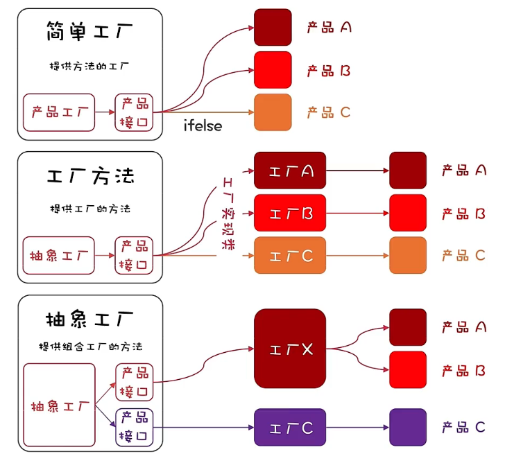

> ### 1. 先说普通工厂模式
>
> 普通工厂解决的是：
>
> > **“我要创建某一种产品，但我不想自己 `new`，把创建逻辑交给工厂。”**
>
> 比如你有不同类型的日志：
>
> ```
> interface Logger {
>     void write();
> }
> 
> class FileLogger implements Logger {
>     @Override
>     public void write() {
>         System.out.println("写入文件日志");
>     }
> }
> 
> class DatabaseLogger implements Logger {
>     @Override
>     public void write() {
>         System.out.println("写入数据库日志");
>     }
> }
> ```
>
> 工厂：
>
> ```
> class LoggerFactory {
> 
>     public static Logger createLogger(String type) {
>         if ("file".equals(type)) {
>             return new FileLogger();
>         }
> 
>         if ("database".equals(type)) {
>             return new DatabaseLogger();
>         }
> 
>         throw new IllegalArgumentException("未知类型");
>     }
> }
> ```
>
> 使用：
>
> ```
> Logger logger = LoggerFactory.createLogger("file");
> logger.write();
> ```
>
> 这里工厂主要解决：
>
> ```
> 客户端
>    ↓
> LoggerFactory
>    ↓
> FileLogger / DatabaseLogger
> ```
>
> 也就是：
>
> > **一个工厂，负责创建一类产品中的不同具体产品。**
>
> ------
>
> ### 2. 那什么是抽象工厂？
>
> 抽象工厂解决的问题更进一步：
>
> > **不是创建一个产品，而是创建“一整套相互配套的产品”。**
>
> 这是理解抽象工厂最关键的一句话。
>
> 举一个非常经典的例子：
>
> 假设你在做一个 UI 框架，需要支持：
>
> - Windows 风格
> - Mac 风格
>
> 每一种风格都有一套组件：
>
> ```
> Windows
> ├── WindowsButton
> └── WindowsCheckbox
> 
> Mac
> ├── MacButton
> └── MacCheckbox
> ```
>
> 这里就出现了**产品族**的概念。
>
> ------
>
> ### 3. 先定义产品接口
>
> 按钮：
>
> ```
> interface Button {
>     void paint();
> }
> ```
>
> 复选框：
>
> ```
> interface Checkbox {
>     void paint();
> }
> ```
>
> Windows 产品：
>
> ```
> class WindowsButton implements Button {
>     @Override
>     public void paint() {
>         System.out.println("Windows Button");
>     }
> }
> 
> class WindowsCheckbox implements Checkbox {
>     @Override
>     public void paint() {
>         System.out.println("Windows Checkbox");
>     }
> }
> ```
>
> Mac 产品：
>
> ```
> class MacButton implements Button {
>     @Override
>     public void paint() {
>         System.out.println("Mac Button");
>     }
> }
> 
> class MacCheckbox implements Checkbox {
>     @Override
>     public void paint() {
>         System.out.println("Mac Checkbox");
>     }
> }
> ```
>
> 到这里还只是普通的产品继承关系。
>
> ------
>
> ### 4. 抽象工厂出现了
>
> 定义一个**抽象工厂**：
>
> ```
> interface GUIFactory {
> 
>     Button createButton();
> 
>     Checkbox createCheckbox();
> }
> ```
>
> 注意这里非常关键。
>
> 它不是：
>
> ```
> createButton()
> ```
>
> 一个方法就完事了。
>
> 而是：
>
> ```
> createButton()
> createCheckbox()
> ```
>
> **一个工厂负责创建多个相关产品。**
>
> ------
>
> 然后创建 Windows 工厂：
>
> ```
> class WindowsFactory implements GUIFactory {
> 
>     @Override
>     public Button createButton() {
>         return new WindowsButton();
>     }
> 
>     @Override
>     public Checkbox createCheckbox() {
>         return new WindowsCheckbox();
>     }
> }
> ```
>
> Mac 工厂：
>
> ```
> class MacFactory implements GUIFactory {
> 
>     @Override
>     public Button createButton() {
>         return new MacButton();
>     }
> 
>     @Override
>     public Checkbox createCheckbox() {
>         return new MacCheckbox();
>     }
> }
> ```
>
> 客户端：
>
> ```
> GUIFactory factory = new WindowsFactory();
> 
> Button button = factory.createButton();
> Checkbox checkbox = factory.createCheckbox();
> 
> button.paint();
> checkbox.paint();
> ```
>
> 输出：
>
> ```
> Windows Button
> Windows Checkbox
> ```
>
> 如果：
>
> ```
> GUIFactory factory = new MacFactory();
> ```
>
> 那么得到：
>
> ```
> Mac Button
> Mac Checkbox
> ```
>
> ------
>
> ### 5. 普通工厂 vs 抽象工厂
>
> 你可以直接记这个区别：
>
> |          | 普通工厂                   | 抽象工厂                       |
> | -------- | -------------------------- | ------------------------------ |
> | 解决什么 | 创建某类产品               | 创建一整套相关产品             |
> | 产品数量 | 通常一个产品维度           | 多个产品维度                   |
> | 核心     | `createXXX()`              | 多个 `createXXX()`             |
> | 关注点   | 单个产品                   | 产品族                         |
> | 例子     | 创建 FileLogger / DBLogger | 创建 Windows Button + Checkbox |
>
> 最重要的区别就是：
>
> > **普通工厂：生产“一个东西”。**
> >
> > **抽象工厂：生产“一套东西”。**
>
> ------
>
> ### 6. 为什么要“一套”？
>
> 因为这些产品之间通常存在**兼容关系**。
>
> 比如 UI：
>
> ```
> WindowsFactory
>     ├── WindowsButton
>     └── WindowsCheckbox
> 
> MacFactory
>     ├── MacButton
>     └── MacCheckbox
> ```
>
> 你希望：
>
> ```
> Windows Button
> +
> Windows Checkbox
> ```
>
> 而不是：
>
> ```
> Windows Button
> +
> Mac Checkbox
> ```
>
> 抽象工厂把这种**产品族的一致性**集中起来。
>
> 所以：
>
> ```
> GUIFactory factory = new WindowsFactory();
> ```
>
> 之后：
>
> ```
> factory.createButton();
> factory.createCheckbox();
> ```
>
> 天然就是 Windows 产品族。
>
> ------
>
> ### 7. 用一个更直观的方式理解
>
> 假设你去家具店。
>
> ### 普通工厂
>
> 你说：
>
> > 我要一把椅子。
>
> 工厂：
>
> ```
> ChairFactory
>      ↓
>   Chair
> ```
>
> 它主要负责生产**一个产品维度**。
>
> ------
>
> ### 抽象工厂
>
> 你说：
>
> > 我要一整套北欧风家具。
>
> 工厂：
>
> ```
> NordicFurnitureFactory
>        ├── createChair()
>        ├── createTable()
>        └── createSofa()
> ```
>
> 得到：
>
> ```
> 北欧椅子
> 北欧桌子
> 北欧沙发
> ```
>
> 换一个工厂：
>
> ```
> ChineseFurnitureFactory
>        ├── createChair()
>        ├── createTable()
>        └── createSofa()
> ```
>
> 得到：
>
> ```
> 中式椅子
> 中式桌子
> 中式沙发
> ```
>
> 这就是抽象工厂。
>
> ------
>
> ### 8. 和你刚学的 Builder、Prototype 放一起
>
> 你现在复习设计模式，可以形成这个框架：
>
> ```
> Builder
>    ↓
> 怎么一步一步组装一个复杂对象？
> 
> Prototype
>    ↓
> 怎么复制一个已经存在的对象？
> 
> Factory
>    ↓
> 怎么创建某一种产品？
> 
> Abstract Factory
>    ↓
> 怎么创建一整套相关产品？
> ```
>
> 所以**抽象工厂并不是“比工厂高级一点的工厂”**，而是它解决的问题不同：
>
> > **工厂关注单一产品的创建；抽象工厂关注多个相关产品组成的产品族的创建。**
>
> ### 面试时可以这样回答
>
> > **抽象工厂模式提供一个创建一系列相关或相互依赖对象的接口，而不需要指定它们的具体类。它和普通工厂模式的主要区别是，普通工厂通常关注某一个产品的创建，而抽象工厂关注一个产品族，例如 Windows 工厂可以同时创建 Windows Button、Windows Checkbox 等一组相互配套的产品。**

# (3)建造者[生成器]模式（创建者模式）

建造者模式用于把一个复杂对象的“构建过程”和“最终对象本身”分离，使我们可以一步一步地构建对象。

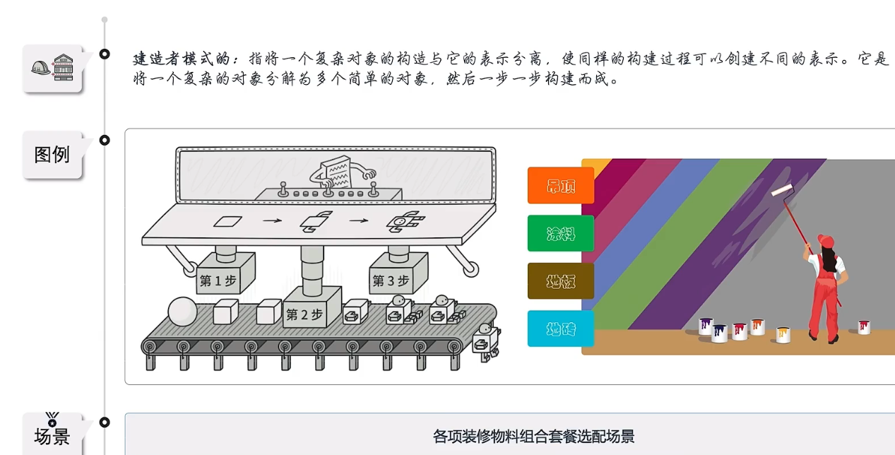

详细说明：

> ### 一、什么是建造者模式？
>
> 一句话：
>
> > **建造者模式用于把一个复杂对象的“构建过程”和“最终对象本身”分离，使我们可以一步一步地构建对象。**
>
> 关键词有两个：
>
> **复杂对象 + 分步骤构建**
>
> ------
>
> ### 二、先看没有建造者模式时的问题
>
> 假设我们有一个用户对象：
>
> ```
> public class User {
> 
>     private String name;
>     private int age;
>     private String phone;
>     private String email;
>     private String address;
>     private String avatar;
> }
> ```
>
> 如果构造方法写成：
>
> ```
> public User(
>         String name,
>         int age,
>         String phone,
>         String email,
>         String address,
>         String avatar
> ) {
>     ...
> }
> ```
>
> 那么创建对象：
>
> ```
> User user = new User(
>         "张三",
>         20,
>         "138xxxx",
>         "xxx@qq.com",
>         "重庆",
>         "avatar.jpg"
> );
> ```
>
> 问题马上就出现了：
>
> ```
> User(
>     String,
>     int,
>     String,
>     String,
>     String,
>     String
> )
> ```
>
> **这些参数到底分别是什么？**
>
> 如果以后增加：
>
> ```
> private String gender;
> private String birthday;
> private String description;
> ```
>
> 构造方法可能变成：
>
> ```
> User(
>     String name,
>     int age,
>     String phone,
>     String email,
>     String address,
>     String avatar,
>     String gender,
>     String birthday,
>     String description
> )
> ```
>
> 创建对象就会越来越难看。
>
> ------
>
> ### 三、那能不能拆成 Setter？
>
> 当然可以：
>
> ```
> User user = new User();
> 
> user.setName("张三");
> user.setAge(20);
> user.setPhone("138xxxx");
> user.setEmail("xxx@qq.com");
> user.setAddress("重庆");
> ```
>
> 这解决了构造方法参数过多的问题。
>
> 但又产生一个问题：
>
> **对象在构建过程中可能处于“不完整状态”。**
>
> 比如：
>
> ```
> User user = new User();
> 
> user.setName("张三");
> // 现在 User 已经存在了，但可能缺少很多必要属性
> 
> user.setAge(20);
> user.setPhone("138xxxx");
> ```
>
> 而且如果对象本身应该是不可变对象（大量字段 `final`），Setter 也不合适。
>
> ------
>
> ### 四、Builder 的思路
>
> Builder 不直接让你：
>
> ```
> new User(一大堆参数)
> ```
>
> 而是：
>
> ```
> User user = new User.Builder()
>         .name("张三")
>         .age(20)
>         .phone("138xxxx")
>         .email("xxx@qq.com")
>         .address("重庆")
>         .avatar("avatar.jpg")
>         .build();
> ```
>
> 你可以把这个过程理解成：
>
> ```
>                 Builder
>                    │
>         ┌──────────┼──────────┐
>         ↓          ↓          ↓
>       name        age       phone
>         │          │          │
>         └──────────┼──────────┘
>                    ↓
>                 build()
>                    ↓
>                  User
> ```
>
> Builder 负责：
>
> > **一步一步收集创建 User 所需要的信息。**
>
> 最后：
>
> ```
> build()
> ```
>
> 才真正：
>
> > **创建 User 对象。**
>
> 这就是建造者模式最核心的思想。
>
> ------
>
> ### 五、最经典的 Java 写法
>
> 例如：
>
> ```
> public class User {
> 
>     private final String name;
>     private final int age;
>     private final String phone;
>     private final String email;
> 
>     private User(Builder builder) {
>         this.name = builder.name;
>         this.age = builder.age;
>         this.phone = builder.phone;
>         this.email = builder.email;
>     }
> 
>     public static class Builder {
> 
>         private String name;
>         private int age;
>         private String phone;
>         private String email;
> 
>         public Builder name(String name) {
>             this.name = name;
>             return this;
>         }
> 
>         public Builder age(int age) {
>             this.age = age;
>             return this;
>         }
> 
>         public Builder phone(String phone) {
>             this.phone = phone;
>             return this;
>         }
> 
>         public Builder email(String email) {
>             this.email = email;
>             return this;
>         }
> 
>         public User build() {
>             return new User(this);
>         }
>     }
> }
> ```
>
> 使用：
>
> ```
> User user = new User.Builder()
>         .name("张三")
>         .age(20)
>         .phone("138xxxx")
>         .email("xxx@qq.com")
>         .build();
> ```
>
> 这里有几个非常重要的点。
>
> ------
>
> ### 六、为什么 `name()` 最后要 `return this`？
>
> 这是 Builder 最经典的地方。
>
> 例如：
>
> ```
> public Builder name(String name) {
>     this.name = name;
>     return this;
> }
> ```
>
> 第一次：
>
> ```
> new User.Builder()
> ```
>
> 得到：
>
> ```
> Builder对象
> ```
>
> 然后：
>
> ```
> .name("张三")
> ```
>
> 返回的还是：
>
> ```
> Builder对象
> ```
>
> 所以可以继续：
>
> ```
> .age(20)
> ```
>
> 返回的还是 Builder：
>
> ```
> .phone("138xxxx")
> ```
>
> 然后：
>
> ```
> .email("xxx@qq.com")
> ```
>
> 最后：
>
> ```
> .build()
> ```
>
> 于是形成：
>
> ```
> new Builder()
>       ↓
>  name()
>       ↓
>  Builder
>       ↓
>  age()
>       ↓
>  Builder
>       ↓
>  phone()
>       ↓
>  Builder
>       ↓
>  email()
>       ↓
>  Builder
>       ↓
>  build()
>       ↓
>  User
> ```
>
> 这实际上就是**链式调用**。
>
> ------
>
> ### 七、`build()` 才是真正创建对象的地方
>
> 这个地方尤其值得你理解。
>
> 前面的：
>
> ```
> .name("张三")
> .age(20)
> .phone("138xxxx")
> .email("xxx@qq.com")
> ```
>
> **都没有创建 User。**
>
> 它们只是在修改 Builder：
>
> ```
> builder.name = "张三";
> builder.age = 20;
> builder.phone = "138xxxx";
> builder.email = "xxx@qq.com";
> ```
>
> 真正创建 User：
>
> ```
> public User build() {
>     return new User(this);
> }
> ```
>
> 所以：
>
> ```
> Builder = 负责准备材料
> build() = 按照材料生产最终对象
> User = 最终产品
> ```
>
> ------
>
> ### 八、这和工厂模式有什么区别？
>
> 这个是面试中非常容易混淆的地方。
>
> 你前面刚学完工厂，所以一定要把这两个区分开。
>
> ### 工厂模式关注：
>
> > **“我要创建哪一种对象？”**
>
> 例如：
>
> ```
> CacheService cache = CacheFactory.create("redis");
> ```
>
> 工厂负责决定：
>
> ```
> redis → RedisCache
> mysql → MysqlCache
> memory → MemoryCache
> ```
>
> 即：
>
> ```
> 工厂
>  ↓
> 决定生产什么
>  ↓
> 具体对象
> ```
>
> ------
>
> ### 建造者模式关注：
>
> > **“这个复杂对象具体怎么一步一步组装？”**
>
> 例如：
>
> ```
> User user = new User.Builder()
>         .name("张三")
>         .age(20)
>         .phone("xxx")
>         .email("xxx")
>         .build();
> ```
>
> 它不是在决定：
>
> ```
> User / Dog / Cat
> ```
>
> 而是在决定：
>
> ```
> User
>  ├── name
>  ├── age
>  ├── phone
>  ├── email
>  └── ...
> ```
>
> 怎么组装。
>
> 所以可以记成：
>
> > **工厂解决“生产什么”，建造者解决“怎么组装”。**
>
> ------
>
> ### 九、为什么叫“建造者”？
>
> 因为它把：
>
> ```
> new User(...)
> ```
>
> 这种一次性构造过程，拆成了：
>
> ```
> 准备材料
>  ↓
> 设置属性
>  ↓
> 设置属性
>  ↓
> 设置属性
>  ↓
> 最终组装
>  ↓
> User
> ```
>
> 也就是：
>
> > **把一个复杂对象的构建过程拆开。**
>
> 所以它尤其适用于：
>
> - 构造参数很多
> - 参数有很多可选项
> - 参数之间存在一定构建顺序
> - 希望对象创建过程更加清晰
> - 希望最终对象不可变
>
> ------
>
> ### 十、你需要特别注意：Builder ≠ “有 Builder 类就是建造者模式”
>
> 这一点对你学习设计模式很重要。
>
> 例如你写：
>
> ```
> UserBuilder builder = new UserBuilder();
> 
> builder.setName("张三");
> builder.setAge(20);
> 
> User user = builder.build();
> ```
>
> 这只是**Builder 风格的代码**。
>
> 经典 GoF 建造者模式通常还会涉及：
>
> ```
> Director
>    ↓
> Builder
>    ↓
> Product
> ```
>
> 也就是：
>
> - **Product**：最终产品
> - **Builder**：定义构建步骤
> - **ConcreteBuilder**：具体怎么构建
> - **Director**：控制构建流程
>
> 不过在现代 Java 开发中，你经常看到的：
>
> ```
> new User.Builder()
>     .name(...)
>     .age(...)
>     .build();
> ```
>
> 实际上是**简化版 Builder**，通常没有单独的 Director。
>
> 这也是你后面学习设计模式时需要建立的一个意识：
>
> > **设计模式的经典结构 ≠ 实际项目中必须一模一样照搬。**
>
> ------
>
> ### 最后把它和你已经学过的模式放在一起
>
> 你现在可以这样建立设计模式地图：
>
> ```
> 工厂模式
>     ↓
> 解决“对象创建的选择问题”
>     ↓
> 到底创建哪个实现？
> 
> 建造者模式
>     ↓
> 解决“复杂对象的构建问题”
>     ↓
> 一个对象应该怎么一步一步组装？
> 
> 代理模式
>     ↓
> 解决“对象访问/增强问题”
>     ↓
> 调用这个对象之前/之后我要做什么？
> ```
>
> 所以三个模式实际上是在解决三个不同层面的问题：
>
> > **工厂：选谁。**
> >  **建造者：怎么造。**
> >  **代理：怎么调用。**

##### final关键字复习

> **`final` 的核心含义是：一旦完成规定的绑定，就不能再重新绑定/改变。**
>
> 它可以修饰：
>
> ```
> final
> ├── 变量
> ├── 方法
> └── 类
> ```
>
> 三种情况含义不一样。你现在正在学 Builder，这时候把 `final` 搞清楚非常重要，因为 Builder 最终生成的对象经常会使用 `final` 字段来保证不可变性。
>
> ------
>
> ### 一、final 修饰变量
>
> 先看最简单的：
>
> ```
> final int age = 20;
> ```
>
> 此时：
>
> ```
> age = 30;  // ❌ 编译错误
> ```
>
> 因为 `age` 已经被赋值为 `20`，不能再次赋值。
>
> 所以：
>
> > **final 变量只能被赋值一次。**
>
> 但是这里有一个非常容易踩坑的地方：
>
> ##### `final` 对基本类型
>
> ```
> final int age = 20;
> ```
>
> 意味着：
>
> ```
> age
>  ↓
> 20
> ```
>
> 不能改成：
>
> ```
> age
>  ↓
> 30
> ```
>
> 这个很好理解。
>
> ------
>
> ##### 二、final 对引用类型
>
> 这里才是重点。
>
> 例如：
>
> ```
> final Dog dog = new Dog();
> ```
>
> 你不能：
>
> ```
> dog = new Dog();  // ❌
> ```
>
> 因为 `dog` 这个引用不能重新指向另外一个对象。
>
> 但是：
>
> ```
> dog.setName("旺财");  // ✅
> ```
>
> 却完全可以。
>
> 为什么？
>
> 因为：
>
> ```
> dog
>  │
>  │ final：不能改变这个引用
>  ↓
> ┌──────────────┐
> │ Dog对象       │
> │ name = "旺财" │ ← 可以修改
> └──────────────┘
> ```
>
> `final` 修饰的是：
>
> > **变量 `dog` 保存的引用不能改变**
>
> 而不是：
>
> > **Dog 对象本身不能改变**
>
> 所以：
>
> ```
> final Dog dog = new Dog();
> 
> dog = new Dog();      // ❌ 改变引用
> dog.setName("旺财");  // ✅ 修改对象
> ```
>
> 这是面试非常经典的考点。
>
> ------
>
> ### 三、所以 `final` ≠ 不可变对象
>
> 这是一个非常重要的概念。
>
> ```
> final User user = new User();
> 
> user.setName("张三");
> user.setAge(20);
> ```
>
> 仍然可以修改 User。
>
> 所以：
>
> ```
> final引用
> ≠
> 对象不可变
> ```
>
> 真正的不可变对象通常还需要：
>
> - 字段 `private final`
> - 没有 Setter
> - 构造时完成初始化
> - 不暴露可修改的内部状态
> - 对可变对象进行必要的防御性拷贝
>
> 例如：
>
> ```
> public class User {
> 
>     private final String name;
>     private final int age;
> 
>     public User(String name, int age) {
>         this.name = name;
>         this.age = age;
>     }
> 
>     public String getName() {
>         return name;
>     }
> 
>     public int getAge() {
>         return age;
>     }
> }
> ```
>
> 创建之后：
>
> ```
> User user = new User("张三", 20);
> ```
>
> 没有 Setter：
>
> ```
> user.setName("李四"); // ❌
> ```
>
> 因此 User 的状态不能再通过公开 API 修改。
>
> 这就是为什么 Builder 经常和 `final` 一起出现。
>
> ------
>
> ### 四、成员变量使用 final
>
> 例如你刚才的动态代理：
>
> ```
> static class MyJDKInvocationHandler implements InvocationHandler {
> 
>     private final Target target;
> 
>     public MyJDKInvocationHandler(Target target) {
>         this.target = target;
>     }
> }
> ```
>
> 这里的：
>
> ```
> private final Target target;
> ```
>
> 是什么意思？
>
> 意味着：
>
> > Handler 创建以后，它所代理的目标对象不能再被替换。
>
> 例如：
>
> ```
> handler.target = new Cat();
> ```
>
> 会编译失败。
>
> 这样做的好处是 Handler 的状态更加稳定。
>
> 你可以理解为：
>
> ```
> MyJDKInvocationHandler
>         │
>         │ final
>         ↓
>       Dog
> ```
>
> Handler 一旦确定代理 Dog，就不能偷偷换成另外一个 Target。
>
> ------
>
> ### 五、final 成员变量什么时候初始化？
>
> 例如：
>
> ```
> class User {
>     private final String name;
> }
> ```
>
> 这样直接定义是可以的：
>
> ```
> private final String name;
> ```
>
> 但是你必须保证它最终被赋值。
>
> 通常有三种方式。
>
> ### 方式一：定义时
>
> ```
> private final String name = "张三";
> ```
>
> ### 方式二：构造方法
>
> ```
> private final String name;
> 
> public User(String name) {
>     this.name = name;
> }
> ```
>
> ### 方式三：初始化代码块
>
> ```
> private final String name;
> 
> {
>     name = "张三";
> }
> ```
>
> 最常见的是前两种。
>
> 尤其是：
>
> ```
> private final String name;
> 
> public User(String name) {
>     this.name = name;
> }
> ```
>
> 这也是 Builder 最终创建对象时经常采用的方式。
>
> ------
>
> ### 六、为什么 Builder 喜欢 final？
>
> 比如：
>
> ```
> public class User {
> 
>     private final String name;
>     private final int age;
>     private final String phone;
> 
>     private User(Builder builder) {
>         this.name = builder.name;
>         this.age = builder.age;
>         this.phone = builder.phone;
>     }
> }
> ```
>
> Builder 可以随便修改：
>
> ```
> builder.name("张三");
> builder.age(20);
> builder.phone("123");
> ```
>
> 但是：
>
> ```
> build()
> ```
>
> 的时候：
>
> ```
> return new User(this);
> ```
>
> 把 Builder 中的数据一次性传给 User。
>
> User 创建完成后：
>
> ```
> Builder
>   │
>   │ build()
>   ↓
> User
>  ├── final name
>  ├── final age
>  └── final phone
> ```
>
> User 自己的字段不能再重新赋值。
>
> 所以：
>
> > **Builder 负责“构建过程中修改”，最终 Product 使用 `final` 保证“构建完成后稳定”。**
>
> 这也是 Builder 非常常见的搭配。
>
> ------
>
> ### 七、final 修饰方法
>
> 例如：
>
> ```
> class Animal {
> 
>     public final void eat() {
>         System.out.println("吃东西");
>     }
> }
> ```
>
> 子类：
>
> ```
> class Dog extends Animal {
> 
>     @Override
>     public void eat() {   // ❌ 编译错误
>     }
> }
> ```
>
> 因为：
>
> > **final 方法不能被子类重写（override）。**
>
> 注意这里是：
>
> ```
> override
> ```
>
> 不是：
>
> ```
> overload
> ```
>
> 例如：
>
> ```
> class Dog extends Animal {
> 
>     public void eat(String food) {
>         // ✅ 可以，这是重载
>     }
> }
> ```
>
> 因为它没有重写父类的：
>
> ```
> eat()
> ```
>
> 而是增加了：
>
> ```
> eat(String)
> ```
>
> 所以：
>
> ```
> final 方法
>     ↓
> 禁止 override
>     ↓
> 允许 overload
> ```
>
> ------
>
> ### 八、为什么要把方法声明成 final？
>
> 通常是：
>
> > **父类希望保证某个核心行为不能被子类改变。**
>
> 例如：
>
> ```
> class Payment {
> 
>     public final void pay() {
> 
>         validate();
> 
>         doPay();
> 
>         record();
>     }
> 
>     protected void validate() {
>         // 校验
>     }
> 
>     protected void doPay() {
>         // 支付
>     }
> 
>     protected void record() {
>         // 记录
>     }
> }
> ```
>
> 子类可以修改：
>
> ```
> doPay()
> ```
>
> 但是不能修改整个：
>
> ```
> pay()
> ```
>
> 流程。
>
> 这其实和后面你可能学习的**模板方法模式（Template Method）**关系非常大。
>
> 典型结构就是：
>
> ```
> final 方法
>     ↓
> 固定整体流程
>     ↓
> 调用可扩展的普通方法
> ```
>
> ------
>
> ### 九、final 修饰类
>
> 例如：
>
> ```
> public final class User {
> }
> ```
>
> 那么：
>
> ```
> class Student extends User {
> }
> ```
>
> 会：
>
> ```
> ❌ 编译错误
> ```
>
> 因为：
>
> > **final 类不能被继承。**
>
> 经典例子：
>
> ```
> public final class String
> ```
>
> `String` 就不能：
>
> ```
> class MyString extends String {
> }
> ```
>
> ------
>
> ### 十、为什么要禁止继承？
>
> 核心原因是：
>
> > **设计者不希望别人通过继承改变这个类的行为。**
>
> 例如：
>
> ```
> final class SecurityConfig {
>     // 安全配置
> }
> ```
>
> 如果允许任意继承：
>
> ```
> class MySecurityConfig extends SecurityConfig {
>     // 可能改变父类行为
> }
> ```
>
> 可能破坏设计者希望保证的约束。
>
> 所以：
>
> ```
> final class
>       ↓
> 禁止继承
>       ↓
> 不能产生子类
>       ↓
> 类的行为更加可控
> ```
>
> ------
>
> ### 十一、三个 final 放在一起
>
> 这是你复习时最应该形成的结构：
>
> ```
> final
> │
> ├── 修饰变量
> │      ↓
> │   只能赋值一次
> │
> ├── 修饰方法
> │      ↓
> │   不能被子类重写
> │
> └── 修饰类
>        ↓
>     不能被继承
> ```
>
> 可以浓缩成：
>
> > **变量：不能重新赋值。**
> >
> >  **方法：不能被 Override。**
> >
> >  **类：不能被 Extend。**
>
> ------
>
> ### 十二、一个容易混淆的问题：final 引用能不能修改？
>
> 再强调一次，因为这个特别容易在面试中出错。
>
> ```
> final List<String> list = new ArrayList<>();
> ```
>
> 可以：
>
> ```
> list.add("A");       // ✅
> list.add("B");       // ✅
> list.remove("A");    // ✅
> ```
>
> 但是：
>
> ```
> list = new ArrayList<>(); // ❌
> ```
>
> 因为：
>
> ```
> final List变量
>        │
>        │ 不能重新指向
>        ↓
> ArrayList对象
>        │
>        ├── A
>        ├── B
>        └── C
> ```
>
> `final` 管的是**引用变量本身**，不是引用指向对象的内部状态。
>
> ------
>
> ### 十三、final 和 static 经常一起出现
>
> 你经常会看到：
>
> ```
> public static final int MAX_SIZE = 100;
> ```
>
> 这里实际上是三个概念：
>
> ```
> static
>  ↓
> 属于类，而不是某个对象
> 
> final
>  ↓
> 不能重新赋值
> 
> int
>  ↓
> 数据类型
> ```
>
> 所以：
>
> ```
> MAX_SIZE = 200;
> ```
>
> 不允许。
>
> 这种形式通常用于定义：
>
> **常量**
>
> 例如：
>
> ```
> public static final String DEFAULT_NAME = "admin";
> public static final int MAX_RETRY = 3;
> ```
>
> Java 的常量命名通常使用：
>
> ```
> 全大写 + 下划线
> ```
>
> ------
>
> ### 十四、一个更深的问题：final 和线程安全
>
> 你以后学 JUC/JVM 时会再次遇到 `final`。
>
> 例如：
>
> ```
> class User {
> 
>     private final int age;
> 
>     public User(int age) {
>         this.age = age;
>     }
> }
> ```
>
> `final` 字段在对象构造完成后具有比较特殊的 Java 内存模型语义：正确构造的对象通过正常方式发布后，其他线程读取 `final` 字段时能够获得更强的初始化可见性保证。
>
> 但注意：
>
> > **final ≠ 线程安全。**
>
> 例如：
>
> ```
> final List<String> list = new ArrayList<>();
> ```
>
> 虽然引用不能换：
>
> ```
> list = anotherList; // ❌
> ```
>
> 但多个线程同时：
>
> ```
> list.add(...)
> ```
>
> 依然可能产生线程安全问题。
>
> 所以不要把：
>
> ```
> final
> ```
>
> 理解成：
>
> ```
> 线程安全
> ```
>
> 它不是。
>
> ------
>
> ### 十五、回到你正在学的 Builder
>
> 现在你应该能理解为什么我前面给你的 Builder 是：
>
> ```
> public class User {
> 
>     private final String name;
>     private final int age;
>     private final String phone;
> 
>     private User(Builder builder) {
>         this.name = builder.name;
>         this.age = builder.age;
>         this.phone = builder.phone;
>     }
> 
>     public static class Builder {
> 
>         private String name;
>         private int age;
>         private String phone;
> 
>         public Builder name(String name) {
>             this.name = name;
>             return this;
>         }
> 
>         public Builder age(int age) {
>             this.age = age;
>             return this;
>         }
> 
>         public Builder phone(String phone) {
>             this.phone = phone;
>             return this;
>         }
> 
>         public User build() {
>             return new User(this);
>         }
>     }
> }
> ```
>
> 这里实际上形成了两个不同的阶段：
>
> ```
> Builder阶段
> ────────────────────────
> name 可以改
> age 可以改
> phone 可以改
>         ↓
>       build()
>         ↓
> User 创建完成
> ────────────────────────
> name final
> age final
> phone final
> ```
>
> 所以你可以把它理解成：
>
> > **Builder 是“可变的构建过程”，Product 是“构建完成后的稳定对象”。**
>
> 这也是为什么 Builder + `private final` 在 Java 项目中非常常见。
>
> ------
>
> ### 最后给你一个面试级总结
>
> 如果面试官问：
>
> **“Java 中 final 关键字有什么作用？”**
>
> 你可以回答：
>
> > `final` 可以修饰变量、方法和类。修饰变量时表示变量只能被赋值一次，对于引用类型来说是引用不能重新指向其他对象，但对象内部状态仍然可能改变；修饰方法表示方法不能被子类 Override；修饰类表示类不能被继承。另外，`final` 字段在 Java 内存模型中具有特殊的初始化可见性语义，但 `final` 本身不等于线程安全。

建造者模式：在目录a3-BuilderPattern下建造者模式的答题代码，题干在BaseInfra下，然后common是普通的代码实现，要求在builderpattern目录下实现建造者模式的的代码升级，我需要弄清楚题干和谱图代码实现的问题，捋顺整个题干和结构，现在帮我捋顺代码和题干与结构，将其输出到a3-BuilderPattern文件夹的.md文件中，方便我进行建造者模式的代码升级

# (4) 原型模式（创建者模式）

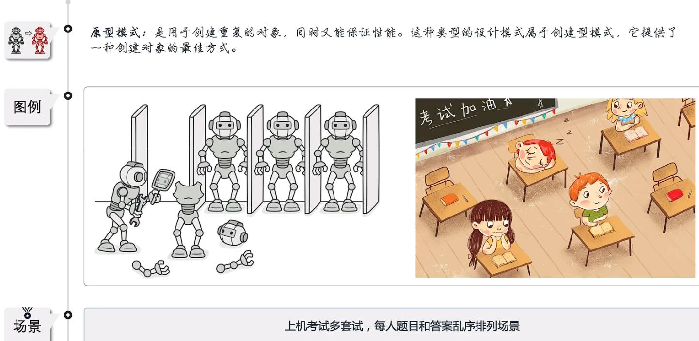

# (5)单例模式（创建者模式）

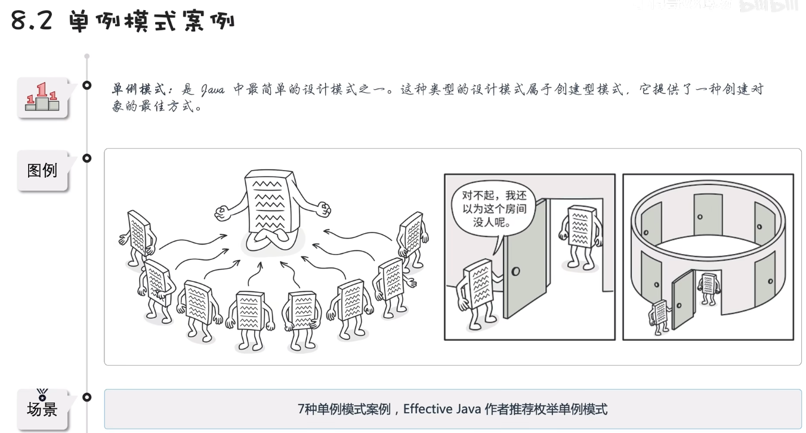

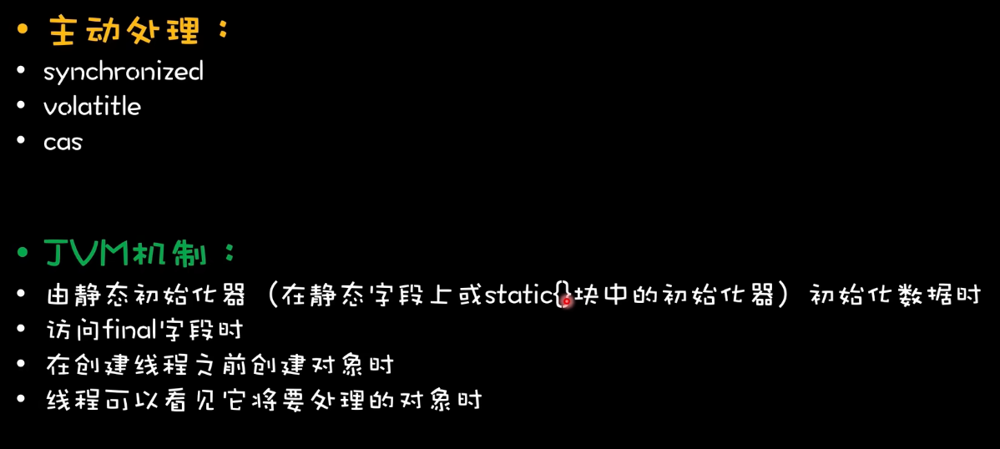

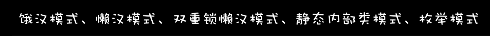

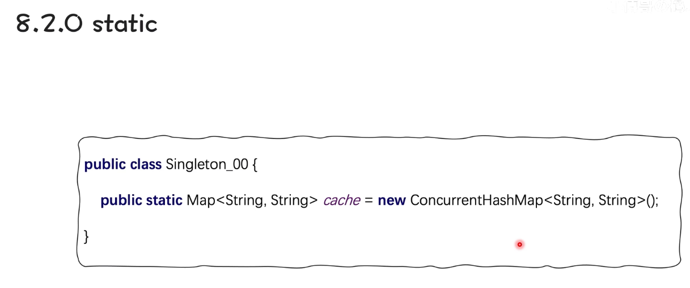

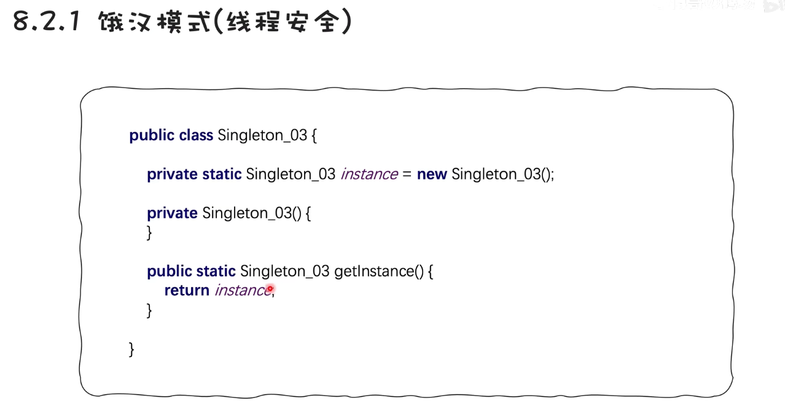

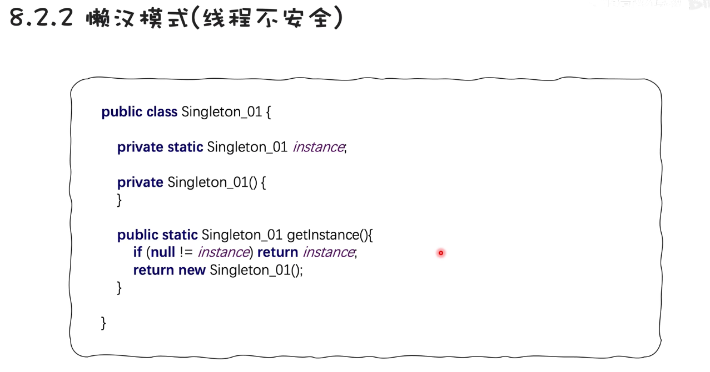

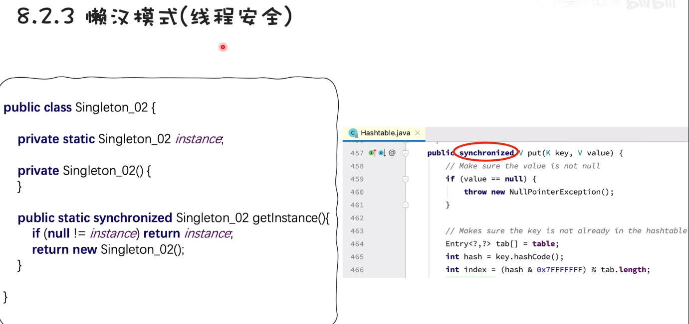

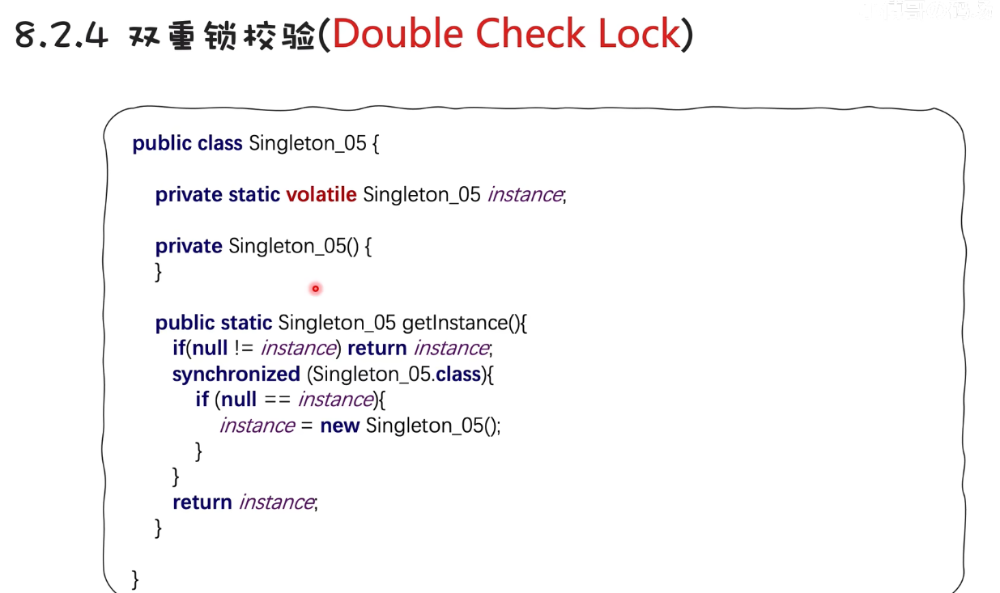

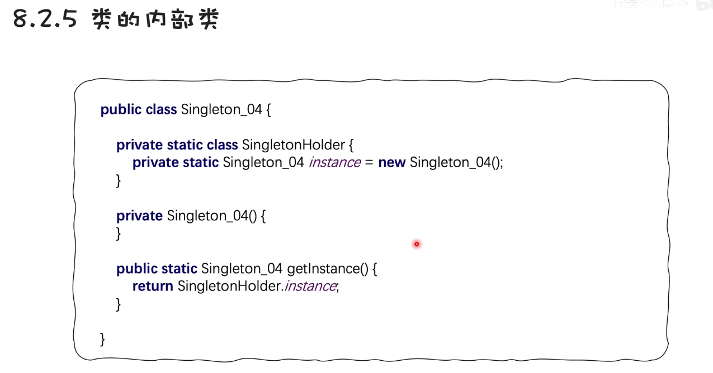

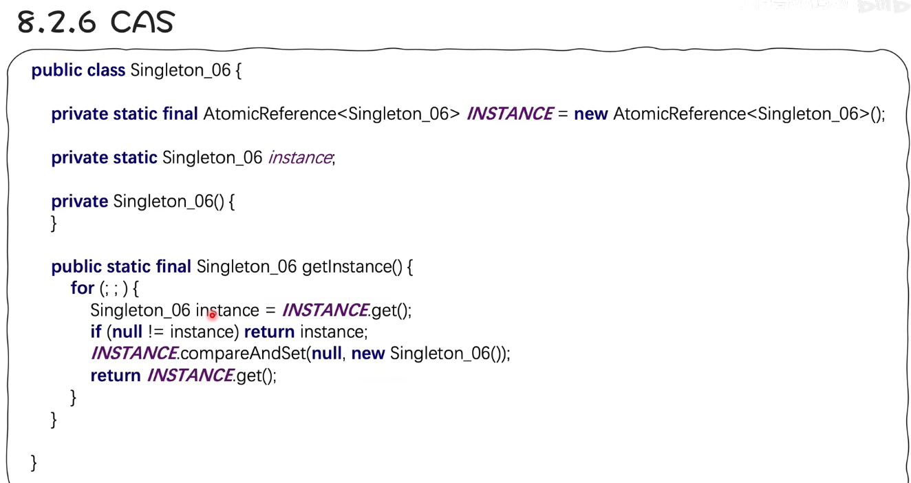

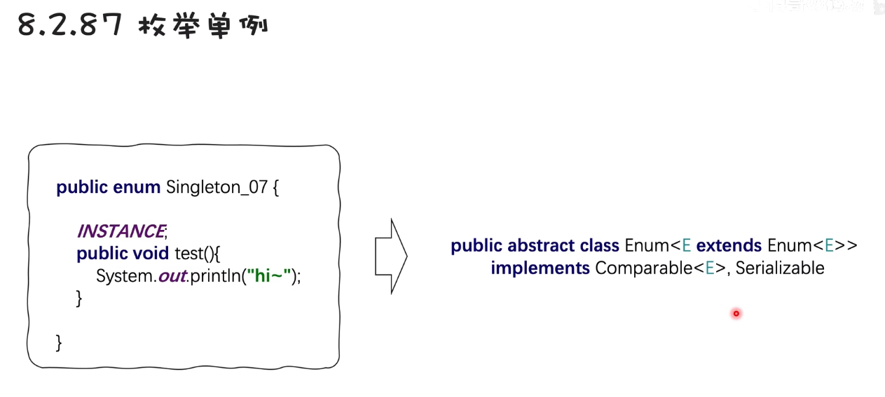

详细解析：

> ### 一、先给你一个总览
>
> 你这 8 个可以整理成：
>
> | 编号 | 你的实现                   | 本质                           | 懒加载         | 线程安全              | 核心知识               |
> | ---- | -------------------------- | ------------------------------ | -------------- | --------------------- | ---------------------- |
> | 00   | `static ConcurrentHashMap` | **全局静态资源，不是严格单例** | -              | Map线程安全           | `static`、并发容器     |
> | 01   | 简单懒汉                   | 懒加载单例                     | ✅              | ❌                     | `static`、`private`    |
> | 02   | `synchronized` 懒汉        | 同步懒汉                       | ✅              | ✅（但你代码写反了）   | `synchronized`         |
> | 03   | 饿汉式                     | 类加载时创建                   | ❌              | ✅                     | 类初始化机制           |
> | 04   | 静态内部类                 | Holder 单例                    | ✅              | ✅                     | 类初始化机制           |
> | 05   | DCL 双重检查               | `volatile + synchronized`      | ✅              | ❌（你代码有关键 bug） | `volatile`、锁、DCL    |
> | 06   | CAS 单例                   | 原子类实现                     | ✅              | ✅                     | `AtomicReference`、CAS |
> | 07   | 枚举单例                   | JVM/Java语言机制保证           | 按枚举类初始化 | ✅                     | `enum`、序列化         |
>
> 所以严格来说：
>
> > **真正值得你掌握的，是 01 → 02 → 03 → 04 → 05 → 06 → 07 这条演进路线。**
>
> 它实际上就是 Java 单例模式从简单到并发安全的演进过程。
>
> ------
>
> ### 二、先搞清楚：单例模式到底解决什么问题？
>
> 普通类：
>
> ```java
> Student s1 = new Student();
> Student s2 = new Student();
> 
> System.out.println(s1 == s2); // false
> ```
>
> 因为：
>
> ```
> new Student()
>     ↓
> 创建对象①
> 
> new Student()
>     ↓
> 创建对象②
> ```
>
> 单例要求：
>
> ```java
> Singleton s1 = Singleton.getInstance();
> Singleton s2 = Singleton.getInstance();
> 
> s1 == s2
> ```
>
> 必须：
>
> ```
>         Singleton
>             ↑
>        唯一对象
>         ↗     ↖
>       s1       s2
> ```
>
> 而不是：
>
> ```
>       Singleton
>        ↙     ↘
>      对象①   对象②
> ```
>
> 所以最基本的代码就是：
>
> ```java
> public class Singleton {
> 
>     private static Singleton instance;
> 
>     private Singleton() {
>     }
> 
>     public static Singleton getInstance() {
>         // 返回唯一对象
>     }
> }
> ```
>
> 这里三个东西非常关键。
>
> ### ① `private Singleton()`
>
> 防止：
>
> ```
> new Singleton();
> ```
>
> 也就是说：
>
> > **对象不能由外部直接创建。**
>
> ------
>
> ### ② `static Singleton instance`
>
> 为什么必须 `static`？
>
> 因为：
>
> ```
> Singleton s1 = Singleton.getInstance();
> ```
>
> 你调用 `getInstance()` 的时候，**还没有 Singleton 对象**。
>
> 所以 `getInstance()` 必须是：
>
> ```
> static
> ```
>
> 而保存对象的变量也必须有一个**不依赖某个 Singleton 实例的地方**。
>
> 所以：
>
> ```
> private static Singleton instance;
> ```
>
> ------
>
> ### ③ `getInstance()`
>
> 这是唯一入口：
>
> ```
> Singleton.getInstance();
> ```
>
> 外部只能通过它拿对象。
>
> 所以单例的核心结构可以记成：
>
> ```
> private 构造器
>       ↓
> 禁止外部 new
>       ↓
> static 唯一引用
>       ↓
> getInstance()
>       ↓
> 外部统一获取
> ```
>
> ------
>
> ### 三、Singleton_00：它其实不是传统意义上的单例
>
> 你的代码：
>
> ```
> public class Singleton_00 {
> 
>     public static Map<String,String> cache = new ConcurrentHashMap<>();
> 
> }
> ```
>
> 这个我建议你**不要把它记成“第1种单例模式”**。
>
> 它更准确地说是：
>
> > **利用 static 创建全局共享资源。**
>
> 这里甚至不存在：
>
> ```
> private Singleton_00()
> ```
>
> 也不存在：
>
> ```
> getInstance()
> ```
>
> 所以它没有真正限制：
>
> ```
> new Singleton_00();
> new Singleton_00();
> ```
>
> 完全可以：
>
> ```
> Singleton_00 a = new Singleton_00();
> Singleton_00 b = new Singleton_00();
> ```
>
> 依然可以创建两个对象。
>
> ------
>
> 那为什么它仍然能做到“一个 cache”？
>
> 因为：
>
> ```
> public static Map<String,String> cache
> ```
>
> `cache` 属于**类**，而不是某个对象。
>
> 所以：
>
> ```
> Singleton_00.cache
> ```
>
> 无论你创建多少个 `Singleton_00`：
>
> ```
> Singleton_00
>     │
>     └── static cache
>             ↓
>        ConcurrentHashMap
> ```
>
> 都是同一个 `cache`。
>
> ------
>
> ## `ConcurrentHashMap` 又是什么？
>
> 它是：
>
> ```
> java.util.concurrent.ConcurrentHashMap
> ```
>
> 是 Java 提供的**并发安全 Map**。
>
> 例如多个线程：
>
> ```
> 线程A ──┐
> 线程B ──┼──> ConcurrentHashMap
> 线程C ──┘
> ```
>
> 可以安全地进行并发读写。
>
> 所以这里实际上复习了两个知识：
>
> `static`表示：成员属于类，而不是某个实例。
>
> `ConcurrentHashMap`表示：一个适合并发场景使用的线程安全 Map。
>
> ------
>
> ### 四、Singleton_01：最简单的懒汉式
>
> 你的代码：
>
> ```java
> public class Singleton_01 {
> 
>     private static Singleton_01 instance;
> 
>     private Singleton_01() {}
> 
>     public static Singleton_01 getInstance() {
> 
>         if (instance != null) return instance;
> 
>         instance = new Singleton_01();
> 
>         return instance;
>     }
> }
> ```
>
> 它的核心思想非常简单：**第一次需要的时候才创建。**
>
> 所以叫：**懒汉式**
>
> 第一次：
>
> ```
> Singleton.getInstance();
> ```
>
> 执行：
>
> ```
> instance == null
> ```
>
> 于是：
>
> ```
> instance = new Singleton_01();
> ```
>
> 第二次：
>
> ```
> Singleton.getInstance();
> ```
>
> 发现：
>
> ```
> instance != null
> ```
>
> 直接：
>
> ```
> return instance;
> ```
>
> ------
>
> #### 为什么叫“懒”？
>
> 因为：
>
> ```
> private static Singleton_01 instance;
> ```
>
> 这里只是声明引用：
>
> ```
> instance
>    ↓
> null
> ```
>
> 并没有创建对象。
>
> 真正执行：
>
> ```
> new Singleton_01()
> ```
>
> 是在第一次调用 `getInstance()` 时。
>
> 所以：
>
> ```
> 程序启动
>    ↓
> 没有 Singleton 对象
> 
> 第一次 getInstance()
>    ↓
> new Singleton
> 
> 第二次 getInstance()
>    ↓
> 直接返回原对象
> ```
>
> ------
>
> #### 最大问题：线程不安全
>
> 假设两个线程同时执行：
>
> ```
> if (instance == null) {
>     instance = new Singleton_01();
> }
> ```
>
> 可能发生：
>
> ```
> 线程A                         线程B
> 
> instance == null              instance == null
>       ↓                             ↓
>     new对象①                    new对象②
>       ↓                             ↓
> instance = 对象①              instance = 对象②
> ```
>
> 最终：
>
> ```
> 对象①
> 对象②
> ```
>
> 已经创建了两个对象。
>
> 所以：
>
> > **Singleton_01 是懒加载，但是线程不安全。**
>
> ------
>
> ### 五、Singleton_02：synchronized 懒汉式
>
> 你写的是：
>
> ```java
> public class Singleton_02 {
> 
>     private static Singleton_02 instance;
> 
>     private Singleton_02() {
>     }
> 
>     public static synchronized Singleton_02 getInstance(){
>         if (null != instance) return instance;
>         return new Singleton_02();
>     }
> 
> }
> ```
>
> 这里有一个**明显的逻辑错误**。
>
> 你写成了：
>
> ```
> if (instance == null) return instance;
> ```
>
> 这意味着：
>
> ```
> 第一次调用
> instance == null
>        ↓
> return null
> ```
>
> 根本不会创建对象。
>
> 正确应该是：
>
> ```
> public static synchronized Singleton_02 getInstance() {
> 
>     if (instance == null) {
>         instance = new Singleton_02();
>     }
> 
>     return instance;
> }
> ```
>
> ------
>
> ### 六、`synchronized` 到底解决了什么？
>
> 关键就是：
>
> ```
> public static synchronized Singleton_02 getInstance()
> ```
>
> 它意味着：
>
> > **同一时刻只能有一个线程进入这个方法。**
>
> 例如：
>
> ```
> 线程A ──→ getInstance()
>               🔒
> 线程B ──→ getInstance()
>               ↓
>             等待
> ```
>
> 线程 A 执行：
>
> ```
> if (instance == null) {
>     instance = new Singleton_02();
> }
> ```
>
> 创建完成：
>
> ```
> instance → 对象①
> ```
>
> 然后线程 B 才能进入：
>
> ```
> if (instance == null)
> ```
>
> 此时：
>
> ```
> instance != null
> ```
>
> 所以直接返回：
>
> ```
> 对象①
> ```
>
> 因此：
>
> > **synchronized 通过互斥访问，避免多个线程同时创建对象。**
>
> ------
>
> ### 七、为什么 `static synchronized` 和普通 `synchronized` 不一样？
>
> 这里是非常值得你复习的知识点。
>
> 如果：
>
> ```
> public synchronized void test()
> ```
>
> 锁的是：
>
> ```
> this
> ```
>
> 也就是**当前对象**。
>
> 但单例的 `getInstance()` 是静态方法：
>
> ```
> public static synchronized Singleton getInstance()
> ```
>
> 它没有 `this`。
>
> 因此锁的是：
>
> ```
> Singleton_02.class
> ```
>
> 也就是：
>
> > **这个类对应的 Class 对象。**
>
> 所以：
>
> ```
> public static synchronized Singleton getInstance()
> ```
>
> 本质上可以理解为：
>
> ```
> public static Singleton getInstance() {
> 
>     synchronized (Singleton_02.class) {
> 
>         ...
>     }
> }
> ```
>
> 这个知识你面试非常容易被问。
>
> ------
>
> ### 八、Singleton_03：饿汉式
>
> 你的代码：
>
> ```
> public class Singleton_03 {
> 
>     private static Singleton_03 instance =
>             new Singleton_03();
> 
>     private Singleton_03() {}
> 
>     public static Singleton_03 getInstance() {
>         return instance;
>     }
> }
> ```
>
> 这个是：
>
> > **饿汉式单例。**
>
> 它和 Singleton_01 最大的区别：
>
> ### 懒汉
>
> ```
> private static Singleton instance;
> ```
>
> 第一次使用：
>
> ```
> getInstance()
> ```
>
> 才：
>
> ```
> new Singleton()
> ```
>
> ### 饿汉
>
> ```
> private static Singleton instance =
>         new Singleton();
> ```
>
> 类初始化的时候就：
>
> ```
> new Singleton()
> ```
>
> ------
>
> ### 九、饿汉式为什么线程安全？
>
> 因为 Java 的**类初始化机制**保证：
>
> > 一个类在初始化阶段，同一个类只会被一个线程初始化，并且初始化过程具有线程安全的可见性保证。
>
> 所以：
>
> ```
> private static Singleton_03 instance =
>         new Singleton_03();
> ```
>
> 不会因为多个线程同时初始化而创建多个实例。
>
> 因此：
>
> ```
> Singleton_03 类初始化
>         ↓
> new Singleton_03()
>         ↓
> 对象①
>         ↓
> static instance
> ```
>
> 之后所有线程：
>
> ```
> getInstance()
>        ↓
> return instance
>        ↓
> 对象①
> ```
>
> ------
>
> ## 饿汉式优点
>
> 非常简单：
>
> ```
> private static final Singleton INSTANCE =
>         new Singleton();
> ```
>
> 甚至可以加：
>
> ```
> final
> ```
>
> 优点：
>
> - 简单
> - 线程安全
> - 不需要锁
> - 不需要 `volatile`
> - 不需要 CAS
>
> 缺点：
>
> > **即使你整个程序都没调用 `getInstance()`，对象也可能已经创建了。**
>
> 所以它不是懒加载。
>
> 如果对象：
>
> - 创建成本很低
> - 一定会使用
> - 占用资源不大
>
> 那么饿汉式完全可以。
>
> ------
>
> ### 十、Singleton_04：静态内部类
>
> 这是 Java 中非常经典的一种：
>
> ```
> public class Singleton_04 {
> 
>     private static class SingletonHolder {
> 
>         private static final Singleton_04 instance =
>                 new Singleton_04();
>     }
> 
>     private Singleton_04() {}
> 
>     public static Singleton_04 getInstance() {
>         return SingletonHolder.instance;
>     }
> }
> ```
>
> 它解决了一个非常漂亮的问题：
>
> > **既想懒加载，又想线程安全，还不想自己写 synchronized。**
>
> ------
>
> ### 十一、静态内部类为什么能做到懒加载？
>
> 重点：
>
> ```
> private static class SingletonHolder
> ```
>
> 虽然写在 `Singleton_04` 里面，但是：
>
> > `SingletonHolder` 是一个独立的类。
>
> 只有当：
>
> ```
> getInstance()
> ```
>
> 执行：
>
> ```
> SingletonHolder.instance
> ```
>
> 的时候，JVM 才需要初始化 `SingletonHolder`。
>
> 于是：
>
> ```
> 程序启动
>    ↓
> Singleton_04 被加载
>    ↓
> SingletonHolder 不一定初始化
>    ↓
> 没有创建 Singleton_04
> ```
>
> 第一次：
>
> ```
> getInstance()
> ```
>
> ↓
>
> ```
> SingletonHolder.instance
> ```
>
> ↓
>
> 初始化 `SingletonHolder`
>
> ↓
>
> ```
> new Singleton_04()
> ```
>
> ------
>
> ### 十二、为什么静态内部类线程安全？
>
> 还是依靠：
>
> > **Java 类初始化机制。**
>
> JVM 保证：
>
> ```
> SingletonHolder 初始化
>         ↓
> 只会安全地进行一次
>         ↓
> new Singleton_04()
>         ↓
> instance
> ```
>
> 所以：
>
> ```
> private static final Singleton_04 instance =
>         new Singleton_04();
> ```
>
> 不会被多个线程创建多份。
>
> 因此它同时满足：
>
> | 要求         | 静态内部类 |
> | ------------ | ---------- |
> | 懒加载       | ✅          |
> | 线程安全     | ✅          |
> | synchronized | ❌          |
> | volatile     | ❌          |
> | CAS          | ❌          |
> | 代码复杂度   | 低         |
>
> 这就是为什么它是**非常值得你记住的一种实现**。
>
> ------
>
> ### 十三、Singleton_05：你这是想写 DCL，但代码写错了
>
> 你现在：
>
> ```
> public class Singleton_05 {
> 
>     private static Singleton_05 instance;
> 
>     private Singleton_05() {}
> 
>     public static Singleton_05 getInstance() {
> 
>         if (instance == null)
>             return new Singleton_05();
> 
>         synchronized (Singleton_05.class) {
> 
>             if (instance == null)
>                 instance = new Singleton_05();
>         }
> 
>         return instance;
>     }
> }
> ```
>
> 这里存在两个问题。
>
> ------
>
> ## 第一个问题
>
> ```
> if (instance == null)
>     return new Singleton_05();
> ```
>
> 你创建对象以后：
>
> > **没有赋值给 `instance`。**
>
> 相当于：
>
> ```
> new Singleton_05();
> ```
>
> 创建了对象，但直接丢掉。
>
> 下一次：
>
> ```
> instance == null
> ```
>
> 仍然是：
>
> ```
> true
> ```
>
> 于是：
>
> ```
> return new Singleton_05();
> ```
>
> 又创建一个。
>
> 所以这个代码：
>
> > **根本不是单例。**
>
> ------
>
> ### 十四、正确的 DCL 是这样
>
> ```
> public class Singleton_05 {
> 
>     private static volatile Singleton_05 instance;
> 
>     private Singleton_05() {}
> 
>     public static Singleton_05 getInstance() {
> 
>         if (instance == null) {
> 
>             synchronized (Singleton_05.class) {
> 
>                 if (instance == null) {
>                     instance = new Singleton_05();
>                 }
>             }
>         }
> 
>         return instance;
>     }
> }
> ```
>
> 这才是：
>
> > **Double-Checked Locking，双重检查锁。**
>
> ------
>
> ### 十五、为什么叫“双重检查”？
>
> 因为：
>
> ```
> if (instance == null) {        // 第一次检查
> 
>     synchronized (Singleton_05.class) {
> 
>         if (instance == null) { // 第二次检查
>             instance = new Singleton_05();
>         }
>     }
> }
> ```
>
> 有两个：
>
> ```
> instance == null
> ```
>
> ------
>
> ## 第一次检查解决什么？
>
> 假设单例已经创建：
>
> ```
> instance → 对象①
> ```
>
> 此时：
>
> ```
> if (instance == null)
> ```
>
> 直接：
>
> ```
> false
> ```
>
> 于是：
>
> ```
> return instance;
> ```
>
> **根本不需要进入 synchronized。**
>
> 所以：
>
> > 第一次检查是为了减少加锁次数。
>
> ------
>
> ## 第二次检查解决什么？
>
> 假设：
>
> ```
> 线程A
> 线程B
> ```
>
> 同时进来。
>
> 开始：
>
> ```
> instance == null
> ```
>
> 两个人都判断：
>
> ```
> true
> ```
>
> 然后：
>
> ```
> 线程A → 抢到锁
> 线程B → 等待
> ```
>
> 线程 A：
>
> ```
> if (instance == null) {
>     instance = new Singleton_05();
> }
> ```
>
> 创建：
>
> ```
> instance → 对象①
> ```
>
> 线程 A 出锁。
>
> 线程 B 获得锁。
>
> 如果没有第二次检查：
>
> ```
> instance = new Singleton_05();
> ```
>
> 线程 B 也会创建对象②。
>
> 所以第二次检查非常重要：
>
> ```
> if (instance == null)
> ```
>
> 此时已经：
>
> ```
> instance != null
> ```
>
> 所以线程 B 不再创建。
>
> ------
>
> ### 十六、为什么 DCL 必须有 `volatile`？
>
> 这是 Singleton 里面最值得你认真理解的知识之一。
>
> ```
> private static volatile Singleton_05 instance;
> ```
>
> `volatile` 在这里主要解决：
>
> > **对象发布过程中的可见性和指令重排序问题。**
>
> 你可以先把：
>
> ```
> new Singleton_05();
> ```
>
> 粗略理解成：
>
> ```
> ① 分配对象内存
> ② 执行构造方法，初始化对象
> ③ instance 指向这个对象
> ```
>
> 理想情况：
>
> ```
> ① → ② → ③
> ```
>
> 但是 JVM 在满足语义的前提下可能进行指令重排序，导致另一个线程看到：
>
> ```
> ① → ③ → ②
> ```
>
> 于是可能出现：
>
> ```
> instance != null
> ```
>
> 但是对象内部还没有完全初始化。
>
> `volatile` 就是 DCL 中用来阻止这种危险发布的关键机制之一。
>
> 所以面试可以记：
>
> > **DCL 需要 `volatile`，因为 `instance = new Singleton()` 不是一个不可分割的操作，volatile 可以保证可见性，并禁止相关的指令重排序，从而避免其他线程拿到一个尚未完成初始化的对象。**
>
> ------
>
> ### 十七、Singleton_06：AtomicReference + CAS
>
> 这个是你这 8 个里面并发知识最强的一种。
>
> ```
> private static final AtomicReference<Singleton_06> INSTANCE =
>         new AtomicReference<>();
> ```
>
> 这里首先要理解：
>
> ## `AtomicReference<T>` 是什么？
>
> 它就是：
>
> > **一个可以原子地操作对象引用的类。**
>
> 例如：
>
> ```
> AtomicReference<Singleton_06> INSTANCE
> ```
>
> 可以理解成：
>
> ```
> INSTANCE
>     ↓
> null
> ```
>
> 但是它提供了线程安全的：
>
> ```
> get()
> set()
> compareAndSet()
> ```
>
> ------
>
> ### 十八、什么是 CAS？
>
> CAS：
>
> > **Compare And Set / Compare And Swap**
>
> 你的代码：
>
> ```
> INSTANCE.compareAndSet(null, instance = new Singleton_06());
> ```
>
> 可以理解成：
>
> > **如果 INSTANCE 现在还是 null，就把它设置成这个新对象；如果已经不是 null，就什么都不做。**
>
> 例如：
>
> ```
> 初始：
> 
> INSTANCE → null
> ```
>
> 线程 A：
>
> ```
> compareAndSet(null, 对象A)
> ```
>
> 发现：
>
> ```
> 当前值 == null
> ```
>
> 于是：
>
> ```
> INSTANCE → 对象A
> ```
>
> 成功。
>
> ------
>
> 同时线程 B：
>
> ```
> compareAndSet(null, 对象B)
> ```
>
> 发现：
>
> ```
> 当前值已经是对象A
> ```
>
> 因此：
>
> ```
> CAS失败
> ```
>
> 不会把：
>
> ```
> 对象A
> ```
>
> 替换成：
>
> ```
> 对象B
> ```
>
> 最终：
>
> ```
> INSTANCE
>    ↓
> 对象A
> ```
>
> 只有一个对象被发布为单例。
>
> ------
>
> ### 十九、CAS 和 synchronized 最大区别
>
> 这个非常值得面试记。
>
> ### `synchronized`
>
> 属于：
>
> > **锁机制**
>
> 例如：
>
> ```
> synchronized (Singleton.class) {
>     ...
> }
> ```
>
> 线程竞争：
>
> ```
> 线程A → 获取锁 → 执行
> 线程B → 等待
> 线程C → 等待
> ```
>
> ------
>
> ### CAS
>
> 属于：
>
> > **无锁并发思想**
>
> 例如：
>
> ```
> INSTANCE.compareAndSet(null, new Singleton());
> ```
>
> 不是：
>
> ```
> 获取锁
>  ↓
> 执行
>  ↓
> 释放锁
> ```
>
> 而是：
>
> ```
> 比较当前值
>       ↓
> 符合预期？
>  ↙          ↘
> 是            否
> ↓             ↓
> 更新          不更新
> ```
>
> CAS 的典型优点：
>
> > **避免传统互斥锁的阻塞/挂起机制，适合一些简单的共享状态更新。**
>
> 当然，CAS 也不是“无敌的”，它可能存在：
>
> - 自旋
> - 高竞争下性能下降
> - ABA 问题（具体场景下）
> - 代码可读性相对更差
>
> 所以不能简单理解成：
>
> > CAS 一定比 synchronized 快。
>
> ------
>
> ### 二十、你的 AtomicReference 代码其实还能简化
>
> 你现在：
>
> ```
> for (;;) {
> 
>     Singleton_06 instance = INSTANCE.get();
> 
>     if (instance != null)
>         return instance;
> 
>     INSTANCE.compareAndSet(
>         null,
>         instance = new Singleton_06()
>     );
> 
>     return INSTANCE.get();
> }
> ```
>
> 实际上这里的：
>
> ```
> for (;;)
> ```
>
> 没有必要。
>
> 因为无论 CAS 成功还是失败，你后面都：
>
> ```
> return INSTANCE.get();
> ```
>
> 所以可以写成：
>
> ```
> public static Singleton_06 getInstance() {
> 
>     Singleton_06 instance = INSTANCE.get();
> 
>     if (instance != null) {
>         return instance;
>     }
> 
>     Singleton_06 newInstance = new Singleton_06();
> 
>     INSTANCE.compareAndSet(null, newInstance);
> 
>     return INSTANCE.get();
> }
> ```
>
> ------
>
> ## 但是这里有一个非常重要的细节
>
> 假设：
>
> ```
> 线程A → new 对象A
> 线程B → new 对象B
> ```
>
> 两个线程都执行：
>
> ```
> new Singleton_06();
> ```
>
> 可能确实会创建：
>
> ```
> 对象A
> 对象B
> ```
>
> 然后：
>
> ```
> 线程A CAS(null, A) → 成功
> 线程B CAS(null, B) → 失败
> ```
>
> 最终：
>
> ```
> INSTANCE → A
> ```
>
> 所以：
>
> > **CAS 版本可能创建多个候选对象，但最终只有一个对象能够成为 INSTANCE。**
>
> 这点非常重要。
>
> 也就是说：
>
> ```
> “只存在一个对象”
> ```
>
> 和：
>
> ```
> “只创建过一个对象”
> ```
>
> 严格来说不是完全相同的概念。
>
> 你的 AtomicReference 实现保证的是：
>
> > **最终对外发布的单例引用只有一个。**
>
> 而不是绝对保证：
>
> > 整个过程中 JVM 只执行过一次 `new Singleton_06()`。
>
> ------
>
> ### 二十一、Singleton_07：枚举单例
>
> 最后这个是：
>
> ```
> public enum Singleton_07 {
> 
>     INSTANCE;
> 
>     public void test() {
>         System.out.println("hi~");
>     }
> }
> ```
>
> 这个非常特殊。
>
> `INSTANCE` 不是：
>
> ```
> String INSTANCE;
> ```
>
> 也不是：
>
> ```
> Singleton_07 INSTANCE = ...
> ```
>
> 而是：
>
> > **枚举常量。**
>
> 例如：
>
> ```
> enum Season {
>     SPRING,
>     SUMMER,
>     AUTUMN,
>     WINTER
> }
> ```
>
> 这里：
>
> ```
> SPRING
> SUMMER
> AUTUMN
> WINTER
> ```
>
> 都是枚举常量。
>
> 所以：
>
> ```
> enum Singleton {
>     INSTANCE
> }
> ```
>
> 就是：
>
> ```
> Singleton
>     ↓
> 唯一枚举常量
>     ↓
> INSTANCE
> ```
>
> 而这个：
>
> ```
> INSTANCE
> ```
>
> 本身就是：
>
> ```
> Singleton
> ```
>
> 类型的一个实例。
>
> 所以：
>
> ```
> Singleton_07.INSTANCE
> ```
>
> 就是直接获取这个唯一实例。
>
> ------
>
> ### 二十二、为什么枚举天然适合单例？
>
> 因为 Java 对 enum 有语言层面的特殊机制。
>
> 你不需要：
>
> ```
> private static Singleton instance;
> ```
>
> 也不需要：
>
> ```
> private Singleton() {}
> ```
>
> 也不需要：
>
> ```
> getInstance()
> ```
>
> 直接：
>
> ```
> public enum Singleton {
> 
>     INSTANCE;
> 
> }
> ```
>
> 就已经有一个唯一的：
>
> ```
> Singleton.INSTANCE
> ```
>
> ------
>
> ### 二十三、枚举单例最牛的地方：序列化
>
> 这是面试非常喜欢问的。
>
> 普通单例即使：
>
> ```
> private Singleton() {}
> ```
>
> 也需要考虑：
>
> > **反序列化可能破坏单例语义。**
>
> 而 enum 在 Java 的序列化机制中有特殊处理。
>
> 因此枚举单例具有非常强的：
>
> - 线程安全性
> - 序列化安全性
> - 反射防护能力
>
> 所以很多 Java 专家会认为：
>
> > **如果没有特殊限制，枚举是实现单例非常可靠的一种方式。**
>
> ------
>
> ### 二十四、现在把 8 个串起来，你就真正理解了
>
> 这 8 个不是 8 个完全毫无关系的东西。
>
> 而是一条演进路线。
>
> ------
>
> ### 第一阶段：我只想共享一个东西
>
> ### Singleton_00
>
> ```
> static Map
> ```
>
> 核心：
>
> > **类级别共享资源**
>
> 但严格说：
>
> > ❌ 不是完整的单例模式。
>
> ------
>
> ### 第二阶段：我想让对象只创建一次
>
> ### Singleton_01
>
> ```
> private Singleton()
> ```
>
> - 
>
> ```
> static instance
> ```
>
> - 
>
> ```
> getInstance()
> ```
>
> 解决：
>
> > **单线程下单例。**
>
> 但是：
>
> > ❌ 多线程不安全。
>
> ------
>
> ### 第三阶段：我要解决并发
>
> ### Singleton_02
>
> ```
> public static synchronized Singleton getInstance()
> ```
>
> 解决：
>
> > **多线程同时创建的问题。**
>
> 代价：
>
> > 每次调用都需要进入同步方法。
>
> ------
>
> ### 第四阶段：我根本不想懒加载
>
> ### Singleton_03
>
> ```
> private static final Singleton instance =
>         new Singleton();
> ```
>
> 直接：
>
> > **类初始化时创建。**
>
> 优点：
>
> > 简单、线程安全。
>
> 代价：
>
> > 不支持懒加载。
>
> ------
>
> ### 第五阶段：我既要懒加载，又不要锁
>
> ### Singleton_04
>
> ```
> private static class SingletonHolder {
>     private static final Singleton instance =
>             new Singleton();
> }
> ```
>
> 利用：
>
> > **类初始化机制**
>
> 实现：
>
> > 懒加载 + 线程安全。
>
> 这是非常经典的 Java 单例。
>
> ------
>
> ### 第六阶段：我想精细控制锁
>
> ### Singleton_05
>
> DCL：
>
> ```
> if (instance == null) {
> 
>     synchronized (Singleton.class) {
> 
>         if (instance == null) {
>             instance = new Singleton();
>         }
>     }
> }
> ```
>
> 再加：
>
> ```
> volatile
> ```
>
> 实现：
>
> > **懒加载 + 线程安全 + 尽可能减少锁竞争。**
>
> 代价：
>
> > 复杂。
>
> ------
>
> ### 第七阶段：我不用锁，我用 CAS
>
> ### Singleton_06
>
> ```
> AtomicReference
> ```
>
> - 
>
> ```
> compareAndSet()
> ```
>
> 核心思想：
>
> > **利用 CAS 原子地竞争“谁来成为唯一实例”。**
>
> 属于：
>
> > Java 并发编程中的无锁/非阻塞思想。
>
> ------
>
> ### 第八阶段：我直接让 Java 语言帮我保证
>
> ### Singleton_07
>
> ```
> enum Singleton {
>     INSTANCE;
> }
> ```
>
> 利用：
>
> > **Java enum 机制**
>
> 直接获得：
>
> > 线程安全 + 单例语义 + 序列化安全。
>
> ------
>
> ### 二十五、最终对比表——建议你真正记这个
>
> | 实现                 | 创建时机     | 线程安全 | 懒加载     | 核心技术                    | 复杂度 |
> | -------------------- | ------------ | -------- | ---------- | --------------------------- | ------ |
> | `00 static Map`      | 类初始化     | Map安全  | ❌          | `static`、ConcurrentHashMap | ★      |
> | `01 简单懒汉`        | 第一次调用   | ❌        | ✅          | `static`                    | ★      |
> | `02 synchronized`    | 第一次调用   | ✅        | ✅          | `synchronized`              | ★★     |
> | `03 饿汉`            | 类初始化     | ✅        | ❌          | 类初始化                    | ★      |
> | `04 静态内部类`      | Holder初始化 | ✅        | ✅          | 类初始化                    | ★★     |
> | `05 DCL`             | 第一次调用   | ✅        | ✅          | `volatile` + `synchronized` | ★★★    |
> | `06 AtomicReference` | 第一次调用   | ✅        | ✅          | CAS                         | ★★★    |
> | `07 enum`            | 枚举类初始化 | ✅        | 按需初始化 | enum机制                    | ★      |
>
> ------
>
> ### 二十六、你现在最应该复习的几个知识点
>
> 这 8 个模式表面是在学“单例”，实际上顺带把 Java 基础里面几个非常重要的东西串起来了。
>
> #### ① `static`
>
> 你需要理解：
>
> ```
> static
> ```
>
> 意味着：
>
> > **属于类，而不是属于某个对象。**
>
> 单例为什么需要它？
>
> 因为：
>
> ```
> Singleton.getInstance();
> ```
>
> 调用时本身还没有 Singleton 对象。
>
> ------
>
> #### ② `private`
>
> ```
> private Singleton() {}
> ```
>
> 作用：
>
> > **禁止外部直接 `new`。**
>
> 这是单例能够控制对象创建的前提。
>
> ------
>
> #### ③ `synchronized`
>
> 你需要理解三个层次：
>
> ```
> synchronized
> ```
>
> 解决：
>
> > **互斥**
>
> 也就是：
>
> ```
> 同一时刻
> 一个线程进入临界区
> 其他线程等待
> ```
>
> 静态同步方法：
>
> ```
> public static synchronized void test()
> ```
>
> 锁的是：
>
> ```
> Singleton.class
> ```
>
> 普通同步实例方法：
>
> ```
> public synchronized void test()
> ```
>
> 锁的是：
>
> ```
> this
> ```
>
> ------
>
> #### ④ `volatile`
>
> 你现在不要把它简单记成：
>
> > “保证线程安全”。
>
> 这个说法太粗。
>
> 更准确：
>
> > `volatile` 主要提供**可见性**以及针对 volatile 变量访问的**有序性约束**；在 DCL 中，它用于保证单例引用的正确发布，避免重排序导致其他线程观察到未完成初始化的对象。
>
> ------
>
> #### ⑤ `AtomicReference`
>
> 核心：
>
> ```
> AtomicReference<T>
> ```
>
> 就是：
>
> > **对对象引用进行原子操作。**
>
> 例如：
>
> ```
> AtomicReference<Singleton> ref
> ```
>
> 可以：
>
> ```
> ref.get();
> ref.set(...);
> ref.compareAndSet(...);
> ```
>
> ------
>
> #### ⑥ CAS
>
> 核心形式：
>
> ```
> compareAndSet(expected, newValue)
> ```
>
> 意思：
>
> > **如果当前值等于 expected，就原子地修改成 newValue；否则修改失败。**
>
> 例如：
>
> ```
> ref.compareAndSet(null, new Singleton());
> ```
>
> 就是：
>
> > “如果还没人抢到单例，那我来抢。”
>
> ------
>
> #### ⑦ 类初始化机制
>
> 这是 Singleton_03 和 Singleton_04 的核心。
>
> 你应该形成一个非常重要的认识：
>
> > **Java 类初始化本身就是线程安全的。**
>
> 因此很多时候我们不需要自己：
>
> ```
> synchronized
> ```
>
> JVM 已经帮我们保证了：
>
> ```
> 类初始化
>     ↓
> 只安全执行一次
> ```
>
> 静态内部类正是利用了这一点。
>
> ------
>
> ### 二十七、如果面试官问：“你实际推荐哪一种？”
>
> 不要回答：
>
> > “枚举一定最好。”
>
> 更专业的回答是：
>
> > **如果是普通业务开发，我会优先考虑静态内部类或者直接交给 Spring 容器管理；如果确实需要语言层面的单例，并且没有继承等特殊要求，枚举单例是非常可靠的实现。DCL 可以实现懒加载并减少锁竞争，但代码复杂度更高；AtomicReference/CAS 方案可以作为并发编程学习案例，但在单例这个场景下通常没有必要为了避免锁而增加复杂度。**
>
> 尤其你现在学的是 Java 后端，这个认知很重要。
>
> 在 Spring 项目里：
>
> ```
> @Service
> public class UserService {
> }
> ```
>
> 通常根本不会让你自己写：
>
> ```
> private static UserService instance;
> ```
>
> 而是：
>
> > **交给 Spring IoC 容器管理 Singleton Scope。**
>
> 所以你现在学习这些单例实现的真正价值，不是以后每天手写单例，而是借这个例子把：
>
> ```
> static
> private
> 类初始化
> synchronized
> 锁
> volatile
> 指令重排序
> 可见性
> AtomicReference
> CAS
> enum
> 序列化
> ```
>
> 这一整套 Java 基础知识串起来。
>
> ------
>
> ### 最后给你一条“背诵主线”
>
> 你可以把这 8 个压缩成这一句话：
>
> > **01 是最简单的懒汉，但线程不安全；02 用 `synchronized` 保证互斥；03 直接利用类初始化实现饿汉式；04 利用静态内部类的初始化机制同时实现懒加载和线程安全；05 用 DCL 配合 `volatile` 减少锁竞争并保证正确发布；06 用 `AtomicReference + CAS` 通过原子竞争实现单例；07 则直接利用 Java 枚举机制保证实例唯一和序列化安全；00 则更准确地说是利用 `static` 保存全局共享资源，而不是严格意义上的单例。**

#[1]适配器模式（结构型模式）

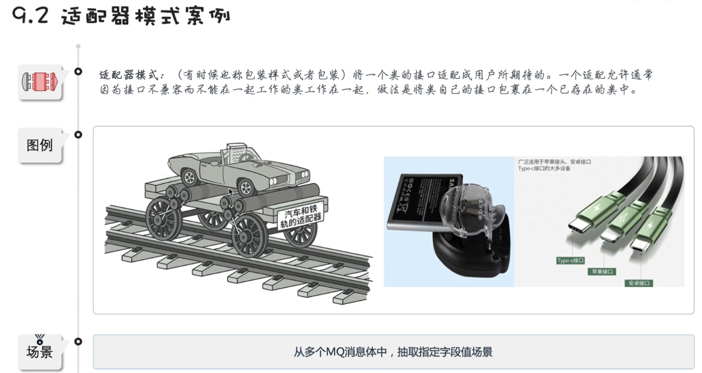

释义：

> ### 一、什么是适配器模式？
>
> 先给你一句最核心的定义：
>
> > **适配器模式（Adapter Pattern）将一个原本接口不兼容的对象，通过一个适配器转换成客户端所需要的接口，使原本无法一起工作的两个类能够协同工作。**
>
> 关键词只有三个：
>
> > **接口不兼容 → 增加适配器 → 兼容使用**
>
> 它解决的不是“怎么创建对象”，而是：
>
> > **“两个已经存在的东西接口对不上，怎么办？”**
>
> ------
>
> ### 二、先用一个最简单的例子理解
>
> 假设我们的系统现在规定：
>
> ```
> public interface PayService {
> 
>     void pay();
> }
> ```
>
> 客户端只认识：
>
> ```
> PayService
> ```
>
> 比如支付宝：
>
> ```
> public class AlipayService implements PayService {
> 
>     @Override
>     public void pay() {
>         System.out.println("支付宝支付");
>     }
> }
> ```
>
> 微信：
>
> ```
> public class WechatPayService implements PayService {
> 
>     @Override
>     public void pay() {
>         System.out.println("微信支付");
>     }
> }
> ```
>
> 客户端：
>
> ```
> public class OrderService {
> 
>     public void checkout(PayService payService) {
>         payService.pay();
>     }
> }
> ```
>
> 调用：
>
> ```
> OrderService orderService = new OrderService();
> 
> orderService.checkout(new AlipayService());
> orderService.checkout(new WechatPayService());
> ```
>
> 没问题。
>
> 因为：
>
> ```
> OrderService
>      ↓
> PayService
>      ↓
> AlipayService
> WechatPayService
> ```
>
> 大家遵循同一个接口。
>
> ------
>
> ### 三、突然来了一个第三方支付
>
> 假设公司接入了一个国外支付 SDK：
>
> ```
> public class StripeSDK {
> 
>     public void executePayment() {
>         System.out.println("Stripe支付");
>     }
> }
> ```
>
> 注意：
>
> 我们的系统要求：
>
> ```
> PayService
>     ↓
> void pay()
> ```
>
> 但是第三方 SDK 是：
>
> ```
> StripeSDK
>     ↓
> void executePayment()
> ```
>
> 这两个接口不一样。
>
> 客户端：
>
> ```
> orderService.checkout(new StripeSDK());
> ```
>
> 直接编译：
>
> ```
> ❌ 编译错误
> ```
>
> 因为：
>
> ```
> StripeSDK
> ```
>
> 不是：
>
> ```
> PayService
> ```
>
> ------
>
> ### 四、怎么办？
>
> 你可能最直接想到：
>
> > “那我修改 StripeSDK，让它 implements PayService 不就行了？”
>
> 现实项目里通常做不到。
>
> 因为：
>
> - `StripeSDK` 是第三方库
> - 你没有源码
> - 即使有源码，也不应该为了适应自己的系统而修改第三方代码
> - 第三方 API 可能被很多地方使用
>
> 这时候就可以增加一个：
>
> ### **Adapter（适配器）**
>
> ```
> public class StripeAdapter implements PayService {
> 
>     private final StripeSDK stripeSDK;
> 
>     public StripeAdapter(StripeSDK stripeSDK) {
>         this.stripeSDK = stripeSDK;
>     }
> 
>     @Override
>     public void pay() {
>         stripeSDK.executePayment();
>     }
> }
> ```
>
> 现在：
>
> ```
> OrderService orderService = new OrderService();
> 
> StripeSDK stripeSDK = new StripeSDK();
> 
> PayService payService =
>         new StripeAdapter(stripeSDK);
> 
> orderService.checkout(payService);
> ```
>
> 运行：
>
> ```
> Stripe支付
> ```
>
> ------
>
> ### 五、这里到底发生了什么？
>
> 这是适配器模式最重要的地方。
>
> 原来：
>
> ```
> 客户端
>   │
>   │ 需要 PayService
>   ↓
> PayService
>   │
>   ├── AlipayService
>   └── WechatPayService
> ```
>
> 突然来了一个：
>
> ```
> StripeSDK
>     │
>     └── executePayment()
> ```
>
> 它不符合：
>
> ```
> PayService.pay()
> ```
>
> 于是：
>
> ```
>                      ┌──────────────────┐
>                      │   StripeSDK      │
>                      │ executePayment()  │
>                      └────────┬─────────┘
>                               ↑
>                               │ 调用
>                               │
>                      ┌────────┴─────────┐
>                      │ StripeAdapter    │
>                      │                  │
> 客户端 ──PayService──→│ pay()            │
>                      │    ↓             │
>                      │ executePayment() │
>                      └──────────────────┘
> ```
>
> 适配器做的事情其实非常简单：
>
> > **把客户端需要的接口，转换成被适配对象实际提供的接口。**
>
> ------
>
> ### 六、所以 Adapter 到底是谁？
>
> 在这个例子中：
>
> | 角色                | 对应代码        |
> | ------------------- | --------------- |
> | Target（目标接口）  | `PayService`    |
> | Adapter（适配器）   | `StripeAdapter` |
> | Adaptee（被适配者） | `StripeSDK`     |
> | Client（客户端）    | `OrderService`  |
>
> 这是适配器模式的标准四角色。
>
> ### 1. Target
>
> 客户端希望使用的接口：
>
> ```
> public interface PayService {
>     void pay();
> }
> ```
>
> ### 2. Adaptee
>
> 已经存在，但接口不兼容的类：
>
> ```
> public class StripeSDK {
> 
>     public void executePayment() {
>         System.out.println("Stripe支付");
>     }
> }
> ```
>
> ### 3. Adapter
>
> 负责转换：
>
> ```
> public class StripeAdapter implements PayService {
> 
>     private final StripeSDK stripeSDK;
> 
>     public StripeAdapter(StripeSDK stripeSDK) {
>         this.stripeSDK = stripeSDK;
>     }
> 
>     @Override
>     public void pay() {
>         stripeSDK.executePayment();
>     }
> }
> ```
>
> ### 4. Client
>
> 只依赖目标接口：
>
> ```
> public class OrderService {
> 
>     public void checkout(PayService payService) {
>         payService.pay();
>     }
> }
> ```
>
> ------
>
> ### 七、你一定要理解：适配器不是“重新实现一个功能”
>
> 例如：
>
> ```
> @Override
> public void pay() {
>     stripeSDK.executePayment();
> }
> ```
>
> 这里的：
>
> ```
> stripeSDK.executePayment();
> ```
>
> 才是真正干活的。
>
> 适配器本身主要负责：
>
> > **接口转换。**
>
> 所以可以把它理解成：
>
> ```
> 客户端说：
> “我只会说 pay()。”
> 
> 第三方说：
> “我只会说 executePayment()。”
> 
> 适配器：
> “没关系，你跟我说 pay()，
> 我帮你翻译成 executePayment()。”
> ```
>
> 这就是 Adapter。
>
> ------
>
> ### 八、为什么不直接在 OrderService 里面判断？
>
> 比如有人可能写：
>
> ```
> public void checkout(Object payment) {
> 
>     if (payment instanceof AlipayService) {
>         ((AlipayService) payment).pay();
> 
>     } else if (payment instanceof WechatPayService) {
>         ((WechatPayService) payment).pay();
> 
>     } else if (payment instanceof StripeSDK) {
>         ((StripeSDK) payment).executePayment();
>     }
> }
> ```
>
> 这就比较糟糕。
>
> 因为客户端开始知道各种第三方实现：
>
> ```
> OrderService
>    ├── Alipay
>    ├── Wechat
>    ├── Stripe
>    ├── PayPal
>    ├── ...
> ```
>
> 以后再接入：
>
> ```
> PayPal
> ```
>
> 你又得修改 `OrderService`。
>
> 而使用适配器：
>
> ```
> OrderService
>       ↓
> PayService
>       ↓
>       ├── AlipayService
>       ├── WechatPayService
>       └── StripeAdapter
>                     ↓
>                 StripeSDK
> ```
>
> `OrderService` 根本不需要知道 Stripe 的存在。
>
> 这就体现了：
>
> > **适配器把“接口兼容的复杂性”隔离在适配器内部。**
>
> ------
>
> ### 九、适配器最常见的真实使用场景
>
> 这个模式在实际 Java 开发里非常常见。
>
> #### 场景一：接入第三方 SDK
>
> 比如：
>
> ```
> 你的系统
>    ↓
> 统一短信接口 SmsService
>    ↓
> SmsAdapter
>    ↓
> 阿里云短信 SDK
> ```
>
> 换成腾讯云：
>
> ```
> 你的系统
>    ↓
> 统一 SmsService
>    ↓
> TencentSmsAdapter
>    ↓
> 腾讯云 SDK
> ```
>
> 业务代码完全不需要改变。
>
> ------
>
> ### 场景二：老系统改造
>
> 比如你的新系统要求：
>
> ```
> interface UserRepository {
> 
>     User findById(Long id);
> }
> ```
>
> 但是老系统：
>
> ```
> class LegacyUserDao {
> 
>     public LegacyUser queryUser(Long id) {
>         ...
>     }
> }
> ```
>
> 你不想修改几十年前的 `LegacyUserDao`。
>
> 那么：
>
> ```
> class LegacyUserDaoAdapter implements UserRepository {
> 
>     private final LegacyUserDao legacyUserDao;
> 
>     @Override
>     public User findById(Long id) {
>         LegacyUser legacyUser =
>                 legacyUserDao.queryUser(id);
> 
>         return convert(legacyUser);
>     }
> }
> ```
>
> 这就是非常典型的适配器。
>
> ------
>
> ### 十、适配器还有一种实现方式：继承
>
> 刚才我们使用的是：
>
> > **对象适配器（Object Adapter）**
>
> 核心是：
>
> ```
> private final StripeSDK stripeSDK;
> ```
>
> 也就是：
>
> ```
> Adapter
>    │
>    └── 持有 Adaptee
> ```
>
> 另外一种是：
>
> > **类适配器（Class Adapter）**
>
> 通过继承：
>
> ```
> public class StripeAdapter
>         extends StripeSDK
>         implements PayService {
> 
>     @Override
>     public void pay() {
>         executePayment();
>     }
> }
> ```
>
> 结构：
>
> ```
> StripeAdapter
>    ├── extends StripeSDK
>    └── implements PayService
> ```
>
> 这样 Adapter 既是：
>
> ```
> StripeSDK
> ```
>
> 的子类，又实现：
>
> ```
> PayService
> ```
>
> ------
>
> ### 十一、对象适配器 vs 类适配器
>
> |          | 对象适配器        | 类适配器           |
> | -------- | ----------------- | ------------------ |
> | 实现方式 | 组合              | 继承               |
> | 核心     | 持有 Adaptee 对象 | extends Adaptee    |
> | Java实现 | 更常见            | 受 Java 单继承限制 |
> | 灵活性   | 较高              | 较低               |
> | 推荐程度 | ⭐⭐⭐⭐⭐             | ⭐⭐⭐                |
>
> Java 中通常更推荐：
>
> ```
> private final StripeSDK stripeSDK;
> ```
>
> 而不是：
>
> ```
> extends StripeSDK
> ```
>
> 因为 Java：
>
> > **一个类只能继承一个父类。**
>
> 如果你的 Adapter 已经需要继承其他类，就无法再继承 `StripeSDK`。
>
> 而组合没有这个问题。
>
> ------
>
> ### 十二、适配器模式和你前面学的设计模式有什么区别？
>
> 这个对你建立整个设计模式体系非常重要。
>
> ### Builder
>
> 解决：
>
> > **复杂对象怎么一步一步构建？**
>
> ```
> Builder
>    ↓
> Product
> ```
>
> ------
>
> ### Prototype
>
> 解决：
>
> > **如何从已有对象复制一个新对象？**
>
> ```
> Prototype
>     ↓ clone
> New Object
> ```
>
> ------
>
> ### Factory
>
> 解决：
>
> > **对象怎么创建？**
>
> ```
> Factory
>    ↓
> Product
> ```
>
> ------
>
> ### Singleton
>
> 解决：
>
> > **如何保证某个类只有一个实例？**
>
> ```
> Singleton
>     ↓
> 唯一对象
> ```
>
> ------
>
> ### Adapter
>
> 解决：
>
> > **两个已经存在的接口不兼容怎么办？**
>
> ```
> Client
>    ↓
> Target
>    ↑
> Adapter
>    ↓
> Adaptee
> ```
>
> 所以你可以形成一个非常清晰的认知：
>
> > **前面几个主要在解决“对象怎么创建”，Adapter 开始解决“对象之间怎么兼容”。**
>
> ------
>
> ### 十三、适配器和“代理模式”特别容易混
>
> 你后面学代理模式时一定会遇到这个问题。
>
> 例如：
>
> ```
> class Adapter implements Target {
> 
>     private final Adaptee adaptee;
> 
>     @Override
>     public void request() {
>         adaptee.specificRequest();
>     }
> }
> ```
>
> 看起来和代理很像：
>
> ```
> class Proxy implements Subject {
> 
>     private final RealSubject subject;
> 
>     @Override
>     public void request() {
>         subject.request();
>     }
> }
> ```
>
> 确实很像。
>
> 但目的不同：
>
> ### Adapter
>
> > **接口不兼容 → 转换接口**
>
> ```
> Target.request()
>        ↓
> Adapter
>        ↓
> Adaptee.specificRequest()
> ```
>
> ### Proxy
>
> > **接口本来就兼容 → 在调用前后增加功能**
>
> 例如：
>
> ```
> Proxy
>  ↓
> 权限检查
>  ↓
> 日志
>  ↓
> 缓存
>  ↓
> RealSubject
> ```
>
> 所以一个非常好记的区分：
>
> > **适配器是“翻译接口”，代理是“增强访问”。**
>
> ------
>
> ### 十四、面试怎么回答？
>
> 如果面试官问：
>
> > **什么是适配器模式？**
>
> 你可以直接这样回答：
>
> > **适配器模式是一种结构型设计模式，用于解决两个接口不兼容的问题。它通过增加一个适配器，将已有类的接口转换成客户端所需要的目标接口，从而使原本不能协同工作的类能够一起工作。常见场景包括接入第三方 SDK、兼容旧系统接口以及统一不同厂商的实现。**
>
> 如果继续问：
>
> > **适配器有哪些实现方式？**
>
> 答：
>
> > **主要有类适配器和对象适配器。类适配器通过继承被适配类并实现目标接口完成适配；对象适配器通过组合持有被适配对象，再实现目标接口完成适配。Java 由于单继承限制，实际开发中通常更常见的是对象适配器。**
>
> ------
>
> ### 十五、最后把这个模式压缩成一张图
>
> 你现在可以把适配器牢牢记成：
>
> ```
>                  Client
>                     │
>                     │ 只认识
>                     ▼
>               ┌────────────┐
>               │   Target   │
>               │  pay()     │
>               └─────▲──────┘
>                     │
>                     │ implements
>               ┌─────┴──────┐
>               │  Adapter   │
>               │            │
>               │ pay()      │
>               │    ↓       │
>               │ execute()  │
>               └─────┬──────┘
>                     │
>                     │ 持有
>                     ▼
>               ┌────────────┐
>               │  Adaptee   │
>               │ execute()  │
>               └────────────┘
> ```
>
> **一句话记忆：**
>
> > **Adapter = 不改原来的代码，在中间加一层，把“不兼容的接口”翻译成“客户端需要的接口”。**

#[2]桥接模式（结构型模式）

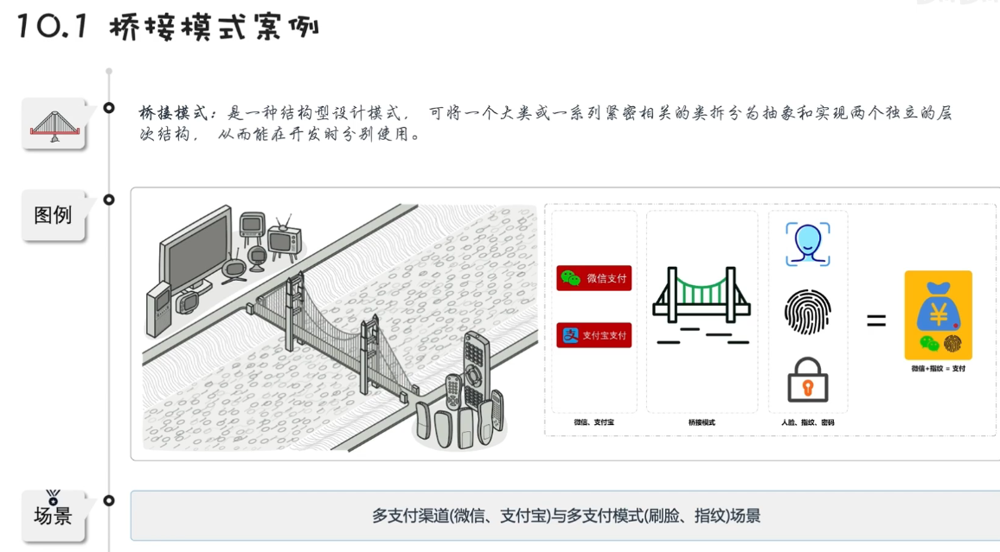

详解：

> ### 一、先给你一句话定义
>
> > **桥接模式：将抽象部分与实现部分分离，使它们可以独立变化。**
>
> 关键词就两个：
>
> **分离 + 独立变化**
>
> 它属于 **结构型设计模式**。
>
> ------
>
> ### 二、桥接模式到底解决什么问题？
>
> 先看一个非常典型的场景。
>
> 假设我们有一个“消息发送系统”。
>
> 消息有两种类型：
>
> ```
> 普通消息
> 紧急消息
> ```
>
> 发送方式又有三种：
>
> ```
> Email
> SMS
> 微信
> ```
>
> 如果你直接用继承来设计：
>
> ```
> 普通Email
> 普通SMS
> 普通微信
> 
> 紧急Email
> 紧急SMS
> 紧急微信
> ```
>
> 代码就可能变成：
>
> ```
> NormalEmailMessage
> NormalSmsMessage
> NormalWechatMessage
> 
> UrgentEmailMessage
> UrgentSmsMessage
> UrgentWechatMessage
> ```
>
> 现在只有：
>
> ```
> 2种消息类型 × 3种发送方式 = 6个类
> ```
>
> 如果以后增加：
>
> ```
> 营销消息
> ```
>
> 就变成：
>
> ```
> 3 × 3 = 9
> ```
>
> 再增加：
>
> ```
> 钉钉
> ```
>
> 变成：
>
> ```
> 3 × 4 = 12
> ```
>
> 这就是桥接模式重点解决的：
>
> > **两个维度独立变化，却因为继承关系被绑死在一起。**
>
> ------
>
> ### 三、为什么会出现“类爆炸”？
>
> 因为你把两个变化维度塞进了一棵继承树。
>
> 比如：
>
> ```
>               Message
>              /       \
>        Normal        Urgent
>        /   \          /   \
>     Email  SMS     Email  SMS
> ```
>
> 这里实际上有两个完全不同的维度：
>
> ### 维度一：消息类型
>
> ```
> Normal
> Urgent
> Marketing
> ...
> ```
>
> ### 维度二：发送方式
>
> ```
> Email
> SMS
> WeChat
> DingTalk
> ...
> ```
>
> 这两个维度本来应该**独立变化**。
>
> 但继承把它们绑定起来了。
>
> ------
>
> ### 四、桥接模式的核心思想
>
> 桥接模式会把这两个维度拆开。
>
> 原来：
>
> ```
> 消息类型
>     ↓
> 发送方式
> ```
>
> 变成：
>
> ```
>         Message
>         抽象层
>            |
>            | 持有
>            ↓
>       MessageSender
>        实现层
> ```
>
> 也就是：
>
> ```
> 消息类型                 发送方式
> 
> NormalMessage  ───────→ EmailSender
> UrgentMessage  ───────→ SmsSender
> MarketingMessage ─────→ WechatSender
> ```
>
> 这里最重要的是：
>
> > **不是通过继承组合，而是通过组合把两个变化维度连接起来。**
>
> 这就是“桥”。
>
> ------
>
> ### 五、用 Java 写一个完整例子
>
> ##### ① 实现部分：发送方式
>
> 先定义一个发送接口：
>
> ```
> public interface MessageSender {
> 
>     void send(String message);
> }
> ```
>
> 然后有不同实现：
>
> ```
> public class EmailSender implements MessageSender {
> 
>     @Override
>     public void send(String message) {
>         System.out.println("通过 Email 发送：" + message);
>     }
> }
> public class SmsSender implements MessageSender {
> 
>     @Override
>     public void send(String message) {
>         System.out.println("通过 SMS 发送：" + message);
>     }
> }
> public class WechatSender implements MessageSender {
> 
>     @Override
>     public void send(String message) {
>         System.out.println("通过微信发送：" + message);
>     }
> }
> ```
>
> 到这里，我们解决的是：
>
> > **“怎么发送？”**
>
> ------
>
> ### 六、抽象部分：消息类型
>
> 再定义一个抽象消息：
>
> ```
> public abstract class Message {
> 
>     protected MessageSender messageSender;
> 
>     public Message(MessageSender messageSender) {
>         this.messageSender = messageSender;
>     }
> 
>     public abstract void send(String message);
> }
> ```
>
> 注意这里非常重要：
>
> ```
> protected MessageSender messageSender;
> ```
>
> `Message` **没有继承 EmailSender，也没有继承 SmsSender。**
>
> 而是：
>
> > **持有一个 MessageSender。**
>
> 这就是桥接的核心。
>
> ------
>
> ## ⑦ 普通消息
>
> ```
> public class NormalMessage extends Message {
> 
>     public NormalMessage(MessageSender messageSender) {
>         super(messageSender);
>     }
> 
>     @Override
>     public void send(String message) {
>         messageSender.send("普通消息：" + message);
>     }
> }
> ```
>
> ------
>
> ## ⑧ 紧急消息
>
> ```
> public class UrgentMessage extends Message {
> 
>     public UrgentMessage(MessageSender messageSender) {
>         super(messageSender);
>     }
> 
>     @Override
>     public void send(String message) {
>         messageSender.send("【紧急】" + message);
>     }
> }
> ```
>
> ------
>
> ### 七、怎么使用？
>
> 现在：
>
> ```
> public class Test {
> 
>     public static void main(String[] args) {
> 
>         MessageSender emailSender = new EmailSender();
>         MessageSender smsSender = new SmsSender();
> 
>         Message normalEmail = new NormalMessage(emailSender);
>         Message urgentSms = new UrgentMessage(smsSender);
> 
>         normalEmail.send("订单创建成功");
>         urgentSms.send("服务器发生故障");
>     }
> }
> ```
>
> 输出：
>
> ```
> 通过 Email 发送：普通消息：订单创建成功
> 
> 通过 SMS 发送：【紧急】服务器发生故障
> ```
>
> ------
>
> ### 八、这里到底“桥”在哪里？
>
> 这是你学习桥接模式时**最重要的问题之一**。
>
> 看这个：
>
> ```
> public abstract class Message {
> 
>     protected MessageSender messageSender;
> 
>     public Message(MessageSender messageSender) {
>         this.messageSender = messageSender;
>     }
> }
> ```
>
> 实际上：
>
> ```
> Message
>    │
>    │ 持有
>    ↓
> MessageSender
> ```
>
> 这条关系就是“桥”。
>
> 所以：
>
> ```
> new NormalMessage(new EmailSender());
> ```
>
> 实际上是在说：
>
> > **普通消息 + Email发送方式**
>
> 而：
>
> ```
> new NormalMessage(new SmsSender());
> ```
>
> 就是：
>
> > **普通消息 + SMS发送方式**
>
> 你根本不需要创建：
>
> ```
> NormalEmailMessage
> NormalSmsMessage
> UrgentEmailMessage
> UrgentSmsMessage
> ```
>
> ------
>
> ### 九、你可以看到桥接模式非常漂亮的一点
>
> 假设现在有：
>
> ```
> 消息类型：
> Normal
> Urgent
> Marketing
> ```
>
> 发送方式：
>
> ```
> Email
> SMS
> Wechat
> DingTalk
> ```
>
> 使用桥接：
>
> ```
>                  Message
>                     │
>        ┌────────────┼────────────┐
>        ↓            ↓            ↓
>     Normal        Urgent      Marketing
>        │            │            │
>        └────────────┼────────────┘
>                     ↓
>              MessageSender
>           ┌─────┬─────┬──────┐
>           ↓     ↓     ↓      ↓
>         Email  SMS  Wechat  DingTalk
> ```
>
> 理论上：
>
> ```
> 3个抽象类 + 4个实现类
> ```
>
> 而不是：
>
> ```
> 3 × 4 = 12个组合类
> ```
>
> 这就是桥接模式最大的价值。
>
> ------
>
> ### 十、桥接模式的结构
>
> 你可以记住经典的四个角色。
>
> ### 1. Abstraction 抽象类
>
> 例如：
>
> ```
> Message
> ```
>
> 它定义高层业务。
>
> ------
>
> ### 2. RefinedAbstraction 扩展抽象类
>
> 例如：
>
> ```
> NormalMessage
> UrgentMessage
> ```
>
> 它们继承 `Message`。
>
> ------
>
> ### 3. Implementor 实现接口
>
> 例如：
>
> ```
> MessageSender
> ```
>
> 定义底层实现能力。
>
> ------
>
> ### 4. ConcreteImplementor 具体实现
>
> 例如：
>
> ```
> EmailSender
> SmsSender
> WechatSender
> ```
>
> ------
>
> 结构：
>
> ```
>         Abstraction
>              │
>              │
>              ↓
>     RefinedAbstraction
> 
> 
>         Implementor
>              ↑
>              │
>              │
>  ConcreteImplementor
> ```
>
> 真正关键的关系是：
>
> ```
> Abstraction
>      │
>      │ 持有
>      ↓
> Implementor
> ```
>
> ------
>
> ### 十一、桥接模式最难的地方是什么？
>
> 我认为你学习时有 **4个重难点**。
>
> ### 难点一：为什么不用继承？
>
> 这是第一关。
>
> 很多初学者会想：
>
> > “NormalMessage 和 EmailSender 不都是类吗？直接继承不就行了？”
>
> 问题是：
>
> **继承表达的是“is-a”关系。**
>
> 例如：
>
> ```
> class Dog extends Animal
> ```
>
> 表示：
>
> > Dog 是一种 Animal。
>
> 但是：
>
> ```
> NormalMessage
> EmailSender
> ```
>
> 明显不是：
>
> > NormalMessage 是一种 EmailSender。
>
> 它们实际上是：
>
> > NormalMessage **使用** EmailSender。
>
> 所以应该是：
>
> ```
> private MessageSender messageSender;
> ```
>
> 而不是：
>
> ```
> extends EmailSender
> ```
>
> ------
>
> ### 十二、难点二：为什么叫“两个维度独立变化”？
>
> 这个非常重要。
>
> 比如：
>
> ### 消息维度变化
>
> 以后增加：
>
> ```
> MarketingMessage
> ```
>
> 我只需要：
>
> ```
> public class MarketingMessage extends Message {
>     ...
> }
> ```
>
> **不用修改 EmailSender、SmsSender。**
>
> ------
>
> ### 发送方式变化
>
> 以后增加：
>
> ```
> DingTalkSender
> ```
>
> 只需要：
>
> ```
> public class DingTalkSender implements MessageSender {
>     ...
> }
> ```
>
> **不用修改 NormalMessage、UrgentMessage。**
>
> 这就是：
>
> > **两个维度可以独立扩展。**
>
> ------
>
> ### 十三、难点三：桥接模式和策略模式很像
>
> 这个你以后非常容易混。
>
> 两者都经常使用：
>
> ```
> 接口 + 组合
> ```
>
> 但关注点不同。
>
> ### 策略模式
>
> 重点是：
>
> > **同一个问题，有多种算法/策略可以替换。**
>
> 例如：
>
> ```
> 支付
>  ├── 微信支付
>  ├── 支付宝
>  └── 银行卡
> ```
>
> 重点是：
>
> > **选择一种策略。**
>
> ------
>
> ### 桥接模式
>
> 重点是：
>
> > **把两个独立变化的维度拆开。**
>
> 例如：
>
> ```
> 消息类型
>     ×
> 发送方式
> ```
>
> 重点是：
>
> > **解决两个维度组合导致的类爆炸。**
>
> 所以你看到：
>
> ```
> private XXX xxx;
> ```
>
> **不能马上说这是桥接模式。**
>
> 要看它是不是在解决：
>
> > **两个独立变化维度之间的组合问题。**
>
> ------
>
> ### 十四、桥接模式和适配器模式也很容易混
>
> 你刚刚才学完适配器，所以这里特别值得对比。
>
> ### 适配器
>
> 核心问题：
>
> > **接口不兼容。**
>
> 例如：
>
> ```
> 我的系统需要：
> PayService.pay()
> 
> 第三方只有：
> StripeSDK.executePayment()
> ```
>
> 于是：
>
> ```
> PayService
>     ↓
> StripeAdapter
>     ↓
> StripeSDK
> ```
>
> 目标是：
>
> > **让原本不能合作的两个接口合作。**
>
> ------
>
> ### 桥接
>
> 核心问题：
>
> > **两个维度独立变化。**
>
> 例如：
>
> ```
> 消息类型
>     ×
> 发送方式
> ```
>
> 目标是：
>
> > **让两个变化维度解耦。**
>
> ------
>
> ### 十五、桥接模式和你刚学的工厂也不一样
>
> 工厂解决：
>
> > **对象怎么创建 / 到底创建哪个实现。**
>
> 例如：
>
> ```
> OrderAdapterFactory.getAdapter("POP");
> ```
>
> 得到：
>
> ```
> POPOrderAdapterServiceImpl
> ```
>
> 而桥接解决：
>
> > **对象之间怎么组织，让两个维度独立变化。**
>
> 所以：
>
> ```
> 工厂：解决“创建谁”
> 桥接：解决“怎么拆分两个变化维度”
> 适配器：解决“接口不兼容”
> ```
>
> 这三个一定要分清。
>
> ------
>
> ### 十六、一个更贴近互联网开发的例子
>
> 其实支付系统特别适合理解桥接。
>
> 假设有两个维度：
>
> ### 支付渠道
>
> ```
> 支付宝
> 微信
> Stripe
> PayPal
> ```
>
> ### 支付场景
>
> ```
> PC
> APP
> 小程序
> H5
> ```
>
> 如果硬写继承：
>
> ```
> AlipayPC
> AlipayAPP
> AlipayMiniProgram
> AlipayH5
> 
> WechatPC
> WechatAPP
> WechatMiniProgram
> WechatH5
> 
> StripePC
> StripeAPP
> ...
> ```
>
> 非常容易爆炸。
>
> 桥接：
>
> ```
> public interface PayChannel {
>     void pay(double amount);
> }
> ```
>
> 实现：
>
> ```
> class AlipayChannel implements PayChannel { }
> class WechatChannel implements PayChannel { }
> class StripeChannel implements PayChannel { }
> ```
>
> 然后：
>
> ```
> public abstract class Pay {
> 
>     protected PayChannel payChannel;
> 
>     public Pay(PayChannel payChannel) {
>         this.payChannel = payChannel;
>     }
> 
>     public abstract void pay(double amount);
> }
> ```
>
> 场景：
>
> ```
> class AppPay extends Pay {
> 
>     public AppPay(PayChannel payChannel) {
>         super(payChannel);
>     }
> 
>     @Override
>     public void pay(double amount) {
>         System.out.println("APP支付");
>         payChannel.pay(amount);
>     }
> }
> ```
>
> 于是：
>
> ```
> Pay pay = new AppPay(new AlipayChannel());
> ```
>
> 表示：
>
> ```
> APP
>  +
> 支付宝
> ```
>
> 而：
>
> ```
> Pay pay = new AppPay(new WechatChannel());
> ```
>
> 表示：
>
> ```
> APP
>  +
> 微信
> ```
>
> 不需要创建：
>
> ```
> AppAlipayPay
> AppWechatPay
> PcAlipayPay
> PcWechatPay
> ...
> ```
>
> ------
>
> ### 十七、你学习桥接模式时最应该抓住的核心
>
> 不要死记：
>
> > “桥接模式就是 Abstraction、Implementor、RefinedAbstraction……”
>
> 这容易变成背书。
>
> 你真正应该形成这个判断：
>
> ```
> 发现两个独立变化的维度
>           ↓
> 如果用继承组合
>           ↓
> A × B 个类
>           ↓
> 类数量可能爆炸
>           ↓
> 把两个维度拆开
>           ↓
> 一个维度通过组合持有另一个维度
>           ↓
> 两个维度可以独立扩展
> ```
>
> **这才是桥接模式。**
>
> ------
>
> ## 最后给你一个面试级定义
>
> 如果面试官问：
>
> > **什么是桥接模式？**
>
> 你可以回答：
>
> > 桥接模式是一种结构型设计模式，它通过组合的方式将抽象部分和实现部分分离，使两个部分能够独立变化。它主要用于处理存在两个或多个独立变化维度的场景，避免通过继承将多个维度进行组合，从而导致类数量爆炸，提高系统的可扩展性和灵活性。
>
> 然后如果面试官继续问：
>
> > **桥接模式的核心是什么？**
>
> 一句话：
>
> > **两个变化维度解耦，通过组合建立桥接关系，而不是通过继承进行组合。**

##### 桥接一定使用抽象类吗？protected的范围？super()使用的原因？

> # 一、代码 1：为什么一定要用抽象类 `Message`？
>
> 先看：
>
> ```
> public abstract class Message {
> 
>     protected MessageSender messageSender;
> 
>     public Message(MessageSender messageSender) {
>         this.messageSender = messageSender;
>     }
> 
>     public abstract void send(String message);
> }
> ```
>
> 这里其实做了 **两件事**：
>
> ```
> ① 保存一个 MessageSender
> ② 要求所有具体 Message 都必须有 send()
> ```
>
> ------
>
> ## 1. 为什么 `Message` 要设计成抽象类？
>
> 先假设不用 `abstract`：
>
> ```
> public class Message {
> 
>     protected MessageSender messageSender;
> 
>     public Message(MessageSender messageSender) {
>         this.messageSender = messageSender;
>     }
> 
>     public void send(String message) {
>         // ...
>     }
> }
> ```
>
> 那么你就可以：
>
> ```
> Message message = new Message(new EmailSender());
> ```
>
> 问题来了：
>
> > **“Message”本身到底是什么消息？**
>
> 它只是一个概念：
>
> ```
> Message
>  ├── NormalMessage
>  ├── UrgentMessage
>  └── MarketingMessage
> ```
>
> 我们真正需要创建的是：
>
> ```
> new NormalMessage(...)
> new UrgentMessage(...)
> ```
>
> 而不是：
>
> ```
> new Message(...)
> ```
>
> 所以把它声明为：
>
> ```
> public abstract class Message
> ```
>
> 意思就是：
>
> > `Message` 是一个抽象概念，不能直接 `new`，只能让具体消息类型继承它。
>
> ------
>
> ### 二、为什么还要写 `abstract void send()`？
>
> 这个更关键。
>
> ```
> public abstract void send(String message);
> ```
>
> 它没有方法体：
>
> ```
> {
> }
> ```
>
> 意思是：
>
> > **我不规定具体怎么发送，但所有 Message 子类必须提供自己的 send() 实现。**
>
> 比如：
>
> ```
> public class NormalMessage extends Message {
> 
>     @Override
>     public void send(String message) {
>         messageSender.send("普通消息：" + message);
>     }
> }
> ```
>
> 而：
>
> ```
> public class UrgentMessage extends Message {
> 
>     @Override
>     public void send(String message) {
>         messageSender.send("【紧急】" + message);
>     }
> }
> ```
>
> 它们的 `send()` 行为就可以不同。
>
> 所以：
>
> ```
> Message
>   ↓
> 规定：所有消息必须有 send()
> 
> NormalMessage
>   ↓
> 具体实现普通消息怎么处理
> 
> UrgentMessage
>   ↓
> 具体实现紧急消息怎么处理
> ```
>
> ------
>
> ### 三、但是这里为什么是“抽象类”，而不是“接口”？
>
> 这个问题非常好。
>
> 其实这里**完全可以设计成接口 + 组合**，但这个例子使用抽象类，是因为 `Message` 本身不仅需要规定行为，还需要**保存桥接对象 `MessageSender`**。
>
> 比如：
>
> ```
> protected MessageSender messageSender;
> ```
>
> 这个字段属于 `Message`。
>
> 然后：
>
> ```
> public Message(MessageSender messageSender) {
>     this.messageSender = messageSender;
> }
> ```
>
> 这个构造器也属于 `Message`。
>
> 所以抽象类很自然：
>
> ```
> Message
> ├── 公共成员变量 messageSender
> ├── 公共构造器
> └── 抽象方法 send()
> ```
>
> 如果使用接口，也可以实现类似结构，但就需要通过其他方式保存 `MessageSender`，代码反而不如这个例子直观。
>
> 所以你现在记：
>
> > **抽象类不是因为“桥接模式规定必须用抽象类”，而是因为这里的抽象部分需要保存一些公共状态和构造逻辑。**
>
> 这是很重要的区别。
>
> ------
>
> ### 四、现在说你最困惑的 `protected`
>
> 代码：
>
> ```
> protected MessageSender messageSender;
> ```
>
> `protected` 是 Java 的**访问修饰符**。
>
> 你可以先简单理解成：
>
> > **允许当前类，以及子类访问。**
>
> 我们的结构是：
>
> ```
> Message
>   ↑
>   │ extends
>   │
> NormalMessage
> ```
>
> `messageSender` 定义在父类：
>
> ```
> public abstract class Message {
> 
>     protected MessageSender messageSender;
> }
> ```
>
> 子类：
>
> ```
> public class NormalMessage extends Message {
> 
>     @Override
>     public void send(String message) {
>         messageSender.send(...);
>     }
> }
> ```
>
> 为什么 `NormalMessage` 可以直接写：
>
> ```
> messageSender.send(...)
> ```
>
> 因为：
>
> ```
> messageSender
> ```
>
> 是父类 `Message` 中的 `protected` 成员，而 `NormalMessage` 是它的子类。
>
> ------
>
> ### 五、如果写成 `private` 呢？
>
> 例如：
>
> ```
> public abstract class Message {
> 
>     private MessageSender messageSender;
> }
> ```
>
> 那么子类：
>
> ```
> public class NormalMessage extends Message {
> 
>     public void send(String message) {
>         messageSender.send(...); // ❌
>     }
> }
> ```
>
> 就不能直接访问。
>
> 因为 `private` 表示：
>
> > **只有定义这个字段的类自己可以直接访问。**
>
> ------
>
> ### 六、那为什么不直接写 `public`？
>
> 当然也可以：
>
> ```
> public MessageSender messageSender;
> ```
>
> 但是不推荐。
>
> 因为 `public` 表示外部任何代码都可以直接操作：
>
> ```
> Message message = ...;
> 
> message.messageSender = null;
> ```
>
> 这会破坏封装。
>
> 所以这个例子选择：
>
> ```
> protected MessageSender messageSender;
> ```
>
> 意思就是：
>
> > `Message` 自己可以使用，子类也可以使用，但普通外部代码不能直接访问。
>
> 不过从现代 Java 的封装习惯来看，**更严格的写法其实可以用 `private` + `protected` 方法，或者 `private final` 字段**。教学例子用 `protected` 是为了让桥接关系非常直观。
>
> ------
>
> ### 七、现在来看代码 2：`super(messageSender)` 到底是什么？
>
> 你理解得没错：
>
> > **`super(...)` 可以调用父类的构造方法。**
>
> 这里：
>
> ```
> public class NormalMessage extends Message {
> 
>     public NormalMessage(MessageSender messageSender) {
>         super(messageSender);
>     }
> }
> ```
>
> 执行：
>
> ```
> new NormalMessage(emailSender);
> ```
>
> 我们一步一步来看。
>
> ------
>
> ### 八、第一步：调用 NormalMessage 构造器
>
> 假设：
>
> ```
> MessageSender emailSender = new EmailSender();
> ```
>
> 然后：
>
> ```
> Message message = new NormalMessage(emailSender);
> ```
>
> 进入：
>
> ```
> public NormalMessage(MessageSender messageSender) {
>     super(messageSender);
> }
> ```
>
> 这里的：
>
> ```
> messageSender
> ```
>
> 就是传进来的：
>
> ```
> emailSender
> ```
>
> ------
>
> ### 九、第二步：`super(messageSender)` 调用父类构造器
>
> 父类：
>
> ```
> public abstract class Message {
> 
>     protected MessageSender messageSender;
> 
>     public Message(MessageSender messageSender) {
>         this.messageSender = messageSender;
>     }
> }
> ```
>
> 所以：
>
> ```
> super(messageSender);
> ```
>
> 实际上就是：
>
> > **调用 `Message` 父类的这个构造方法。**
>
> 相当于：
>
> ```
> Message(messageSender)
> ```
>
> 然后执行：
>
> ```
> this.messageSender = messageSender;
> ```
>
> 于是 `NormalMessage` 对象内部就拥有了：
>
> ```
> messageSender → EmailSender对象
> ```
>
> ------
>
> ### 十、整个过程画出来
>
> 执行：
>
> ```
> MessageSender emailSender = new EmailSender();
> 
> Message message = new NormalMessage(emailSender);
> ```
>
> 可以理解成：
>
> ### ① 创建 `NormalMessage`
>
> ```
> new NormalMessage(emailSender)
> ```
>
> ↓
>
> ### ② 进入子类构造器
>
> ```
> public NormalMessage(MessageSender messageSender) {
> ```
>
> 此时：
>
> ```
> messageSender
>      ↓
> EmailSender对象
> ```
>
> ↓
>
> ### ③ 执行
>
> ```
> super(messageSender);
> ```
>
> ↓
>
> ### ④ 调用父类构造器
>
> ```
> public Message(MessageSender messageSender) {
>     this.messageSender = messageSender;
> }
> ```
>
> ↓
>
> ### ⑤ 父类把 `EmailSender` 保存起来
>
> ```
> NormalMessage对象
> ┌─────────────────────────┐
> │ messageSender           │
> │       │                 │
> │       ↓                 │
> │   EmailSender对象       │
> └─────────────────────────┘
> ```
>
> ------
>
> ### 十一、然后为什么 `NormalMessage.send()` 能使用它？
>
> 因为父类已经有：
>
> ```
> protected MessageSender messageSender;
> ```
>
> 而子类继承了这个成员。
>
> 所以：
>
> ```
> @Override
> public void send(String message) {
>     messageSender.send("普通消息：" + message);
> }
> ```
>
> 这里的：
>
> ```
> messageSender
> ```
>
> 就是刚才 `super(messageSender)` 保存进去的那个 `EmailSender`。
>
> 因此：
>
> ```
> MessageSender emailSender = new EmailSender();
> 
> Message message = new NormalMessage(emailSender);
> 
> message.send("订单创建成功");
> ```
>
> 最终调用链是：
>
> ```
> message.send()
>       ↓
> NormalMessage.send()
>       ↓
> messageSender.send()
>       ↓
> EmailSender.send()
> ```
>
> 最终：
>
> ```
> 通过 Email 发送：普通消息：订单创建成功
> ```
>
> ------
>
> ### 十二、你现在应该特别注意 `super` 和 `this`
>
> 你之前学习 Java 时应该会碰到很多。
>
> 这里：
>
> ```
> super(messageSender);
> ```
>
> 意思是：
>
> > **调用父类构造器**
>
> 而：
>
> ```
> this.messageSender = messageSender;
> ```
>
> 意思是：
>
> > **把当前对象的字段 `messageSender`，赋值为传进来的参数 `messageSender`。**
>
> 可以这样区分：
>
> ```
> super → 父类
> this  → 当前对象
> ```
>
> 例如：
>
> ```
> super(messageSender);
> ```
>
> ↓
>
> ```
> 调用父类 Message 的构造器
> ```
>
> 而父类里面：
>
> ```
> this.messageSender = messageSender;
> ```
>
> ↓
>
> ```
> 当前正在创建的 NormalMessage 对象
>         ↓
> 保存传进来的 EmailSender
> ```
>
> ------
>
> ### 十三、还有一个 Java 规则你要记住
>
> 如果子类构造器没有显式写：
>
> ```
> super(...);
> ```
>
> Java 会默认帮你加：
>
> ```
> super();
> ```
>
> 例如：
>
> ```
> public class NormalMessage extends Message {
> 
>     public NormalMessage() {
>         // Java 默认尝试插入 super();
>     }
> }
> ```
>
> 但是我们的父类只有：
>
> ```
> public Message(MessageSender messageSender)
> ```
>
> 没有：
>
> ```
> public Message()
> ```
>
> 所以这样就会编译报错。
>
> 因此必须：
>
> ```
> public NormalMessage(MessageSender messageSender) {
>     super(messageSender);
> }
> ```
>
> 把 `MessageSender` 传给父类。
>
> ------
>
> ### 十四、最后，把整个桥接模式重新串起来
>
> 现在你应该能看懂最核心的一句话了：
>
> ```
> public abstract class Message {
> 
>     protected MessageSender messageSender;
> 
>     public Message(MessageSender messageSender) {
>         this.messageSender = messageSender;
>     }
> }
> ```
>
> 这里实际上就是：
>
> > **Message 不自己决定“怎么发送”，而是持有一个 MessageSender，让发送方式可以从外部传进来。**
>
> 所以：
>
> ```
> new NormalMessage(new EmailSender());
> ```
>
> 就是：
>
> ```
> NormalMessage
>       │
>       │ 持有
>       ↓
>  EmailSender
> ```
>
> 而：
>
> ```
> new NormalMessage(new SmsSender());
> ```
>
> 就是：
>
> ```
> NormalMessage
>       │
>       │ 持有
>       ↓
>  SmsSender
> ```
>
> **NormalMessage 本身没有改变，只是换了它依赖的实现。**
>
> 这就是桥接模式最核心的地方。
>
> 你现在先不要急着记四个角色。你只需要真正吃透这三个东西：
>
> ```
> ① 为什么 Message 是抽象类
>    → 它代表“消息”这个抽象概念，并提供公共状态/构造逻辑
> 
> ② 为什么 messageSender 放在 Message 里
>    → 把“消息类型”和“发送方式”拆成两个独立变化的维度
> 
> ③ super(messageSender) 是什么
>    → 子类创建对象时，把 MessageSender 继续交给父类构造器，
>      由父类保存到 messageSender 字段中
> ```

迭代器模式：c3-IteratorPattern是迭代器模式的代码案例：1.说明整个业务场景，还要再这种业务场景下的普通代码编写的弊端。2.详细说明使用命令模式写的升级代码，整体的工程结构，责任链代码设计特点和细节3.模拟一下测试的数据的流转流程，最终怎么优雅的得到最终结果，将以上分析输入到c2-CommandPattern的文件夹下

观察者模式：c6-ObserverPattern是观察者模式的代码案例：1.说明整个业务场景2.详细说明使用观察者模式代码，整体的工程结构，观察者模式代码设计特点和细节3.模拟一下测试的数据的流转流程，最终怎么优雅的得到最终结果，将以上分析输入到c6-ObserverPattern的文件夹下，注意mermaid代码要适配8.x.x版本的

#**[3]组合模式（结构型模式）**

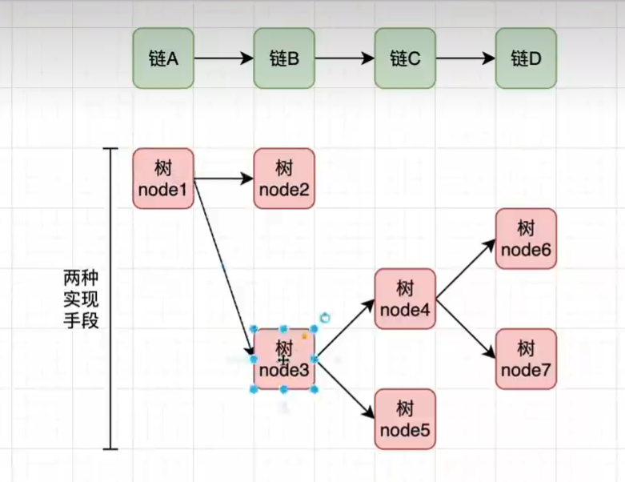

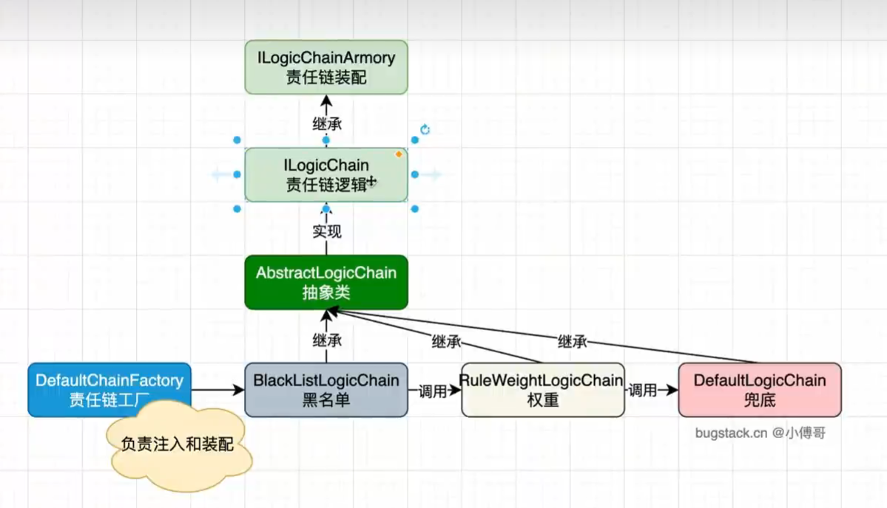

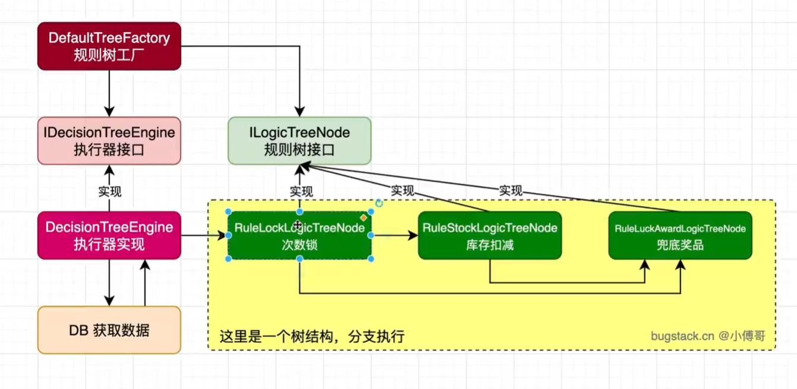

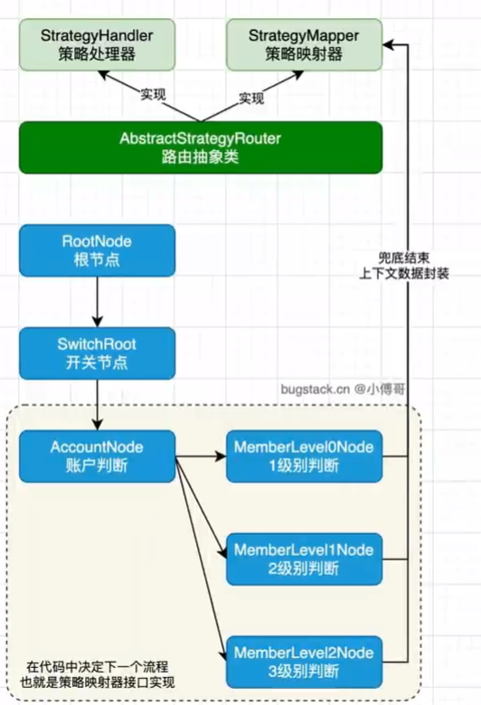

> ### 一、什么是组合模式？
>
> 经典定义：
>
> > **将对象组合成树形结构以表示“部分-整体”的层次结构，使客户端可以统一处理单个对象和组合对象。**
>
> 这句话比较抽象，我们拆成两个关键词：
>
> ### 1. 树形结构
>
> 例如文件系统：
>
> ```
> 项目
> ├── src
> │   ├── main
> │   │   ├── Main.java
> │   │   └── User.java
> │   └── test
> │       └── UserTest.java
> ├── pom.xml
> └── README.md
> ```
>
> 这里有两种东西：
>
> ```
> 文件夹
> 文件
> ```
>
> 文件夹里面可以放：
>
> ```
> 文件
> 文件夹
> ```
>
> 于是形成：
>
> ```
> 文件夹
>   ├── 文件
>   ├── 文件夹
>   │     ├── 文件
>   │     └── 文件
>   └── 文件
> ```
>
> 这就是典型的**树形结构**。
>
> ------
>
> ### 二、组合模式最核心的问题是什么？
>
> 假设现在有：
>
> ```
> File
> Folder
> ```
>
> 如果你不用组合模式，那么客户端可能需要区分：
>
> ```
> if (是文件) {
>     打印文件信息();
> } else if (是文件夹) {
>     遍历文件夹();
> }
> ```
>
> 而组合模式希望做到：
>
> > **不管你拿到的是一个文件，还是一个文件夹，我都可以调用同样的方法。**
>
> 比如统一：
>
> ```
> node.print();
> ```
>
> 如果 `node` 是文件：
>
> ```
> 打印文件
> ```
>
> 如果 `node` 是文件夹：
>
> ```
> 打印文件夹
>     ↓
> 继续打印里面的文件
>     ↓
> 继续打印里面的文件夹
>     ↓
> 递归
> ```
>
> 这就是组合模式最核心的思想：
>
> > **让“叶子对象”和“组合对象”拥有一致的对外操作方式。**
>
> ------
>
> ### 三、一个非常经典的例子：文件系统
>
> 这是我最推荐你用来理解组合模式的案例。
>
> 我们定义一个统一接口：
>
> ```
> public interface FileSystemNode {
> 
>     void print();
> }
> ```
>
> 然后有一个文件：
>
> ```
> public class File implements FileSystemNode {
> 
>     private String name;
> 
>     public File(String name) {
>         this.name = name;
>     }
> 
>     @Override
>     public void print() {
>         System.out.println("文件：" + name);
>     }
> }
> ```
>
> 还有一个文件夹：
>
> ```
> public class Folder implements FileSystemNode {
> 
>     private String name;
> 
>     private List<FileSystemNode> children = new ArrayList<>();
> 
>     public Folder(String name) {
>         this.name = name;
>     }
> 
>     public void add(FileSystemNode node) {
>         children.add(node);
>     }
> 
>     @Override
>     public void print() {
> 
>         System.out.println("文件夹：" + name);
> 
>         for (FileSystemNode child : children) {
>             child.print();
>         }
>     }
> }
> ```
>
> 注意这里是组合模式最关键的地方：
>
> ```
> private List<FileSystemNode> children;
> ```
>
> 文件夹里面存的不是：
>
> ```
> List<File>
> ```
>
> 而是：
>
> ```
> List<FileSystemNode>
> ```
>
> 所以它既可以装：
>
> ```
> File
> ```
>
> 也可以装：
>
> ```
> Folder
> ```
>
> ------
>
> ### 四、然后就可以这样组合
>
> ```
> File file1 = new File("User.java");
> File file2 = new File("Main.java");
> 
> Folder src = new Folder("src");
> 
> src.add(file1);
> src.add(file2);
> ```
>
> 现在：
>
> ```
> src
> ├── User.java
> └── Main.java
> ```
>
> 继续：
>
> ```
> Folder test = new Folder("test");
> 
> test.add(new File("UserTest.java"));
> 
> src.add(test);
> ```
>
> 变成：
>
> ```
> src
> ├── User.java
> ├── Main.java
> └── test
>     └── UserTest.java
> ```
>
> 然后你只需要：
>
> ```
> src.print();
> ```
>
> 输出：
>
> ```
> 文件夹：src
> 文件：User.java
> 文件：Main.java
> 文件夹：test
> 文件：UserTest.java
> ```
>
> 你没有写：
>
> ```
> if (child instanceof File)
> ```
>
> 也没有：
>
> ```
> if (child instanceof Folder)
> ```
>
> 这就是组合模式的价值。
>
> ------
>
> ### 五、为什么 `Folder` 和 `File` 都实现同一个接口？
>
> 这是组合模式最值得理解的地方。
>
> 看：
>
> ```
>               FileSystemNode
>                /          \
>               /            \
>             File          Folder
>           （叶子）        （组合）
> ```
>
> 两者都可以：
>
> ```
> node.print();
> ```
>
> 但是内部行为不一样。
>
> ### File
>
> ```
> @Override
> public void print() {
>     System.out.println("文件：" + name);
> }
> ```
>
> 它没有孩子，所以直接执行自己的操作。
>
> ### Folder
>
> ```
> @Override
> public void print() {
> 
>     System.out.println("文件夹：" + name);
> 
>     for (FileSystemNode child : children) {
>         child.print();
>     }
> }
> ```
>
> 它有孩子，所以：
>
> > 先执行自己的操作，再让所有孩子执行 `print()`。
>
> 而孩子如果又是 Folder：
>
> ```
> Folder
>  ↓
> Folder
>  ↓
> Folder
>  ↓
> File
> ```
>
> 就会自然形成**递归遍历**。
>
> ------
>
> ### 六、你应该特别注意这里的递归
>
> 比如：
>
> ```
> Folder root = new Folder("项目");
> 
> Folder src = new Folder("src");
> Folder test = new Folder("test");
> 
> src.add(new File("Main.java"));
> src.add(new File("User.java"));
> 
> test.add(new File("UserTest.java"));
> 
> root.add(src);
> root.add(test);
> ```
>
> 结构：
>
> ```
> 项目
> ├── src
> │   ├── Main.java
> │   └── User.java
> └── test
>     └── UserTest.java
> ```
>
> 执行：
>
> ```
> root.print();
> ```
>
> 实际上发生：
>
> ```
> root.print()
> │
> ├── src.print()
> │   │
> │   ├── Main.java.print()
> │   └── User.java.print()
> │
> └── test.print()
>     │
>     └── UserTest.java.print()
> ```
>
> 所以组合模式通常和：
>
> > **递归 + 树**
>
> 联系非常紧密。
>
> ------
>
> ### 七、还有一个特别经典的案例：组织架构
>
> 例如公司：
>
> ```
> 公司
> ├── 技术部
> │   ├── Java组
> │   │   ├── 张三
> │   │   └── 李四
> │   └── 前端组
> │       └── 王五
> └── 产品部
>     ├── 产品经理A
>     └── 产品经理B
> ```
>
> 这里：
>
> ```
> 员工
> 部门
> ```
>
> 也形成了树。
>
> 可以统一：
>
> ```
> organization.display();
> ```
>
> 员工：
>
> ```
> public class Employee implements OrganizationComponent {
> 
>     @Override
>     public void display() {
>         System.out.println("员工：" + name);
>     }
> }
> ```
>
> 部门：
>
> ```
> public class Department implements OrganizationComponent {
> 
>     private List<OrganizationComponent> children;
> 
>     @Override
>     public void display() {
> 
>         System.out.println("部门：" + name);
> 
>         for (OrganizationComponent child : children) {
>             child.display();
>         }
>     }
> }
> ```
>
> 和文件系统完全是同一种结构。
>
> ------
>
> ### 八、再举一个你以后做 Java 项目可能遇到的案例：菜单权限
>
> 例如后台管理系统：
>
> ```
> 系统管理
> ├── 用户管理
> │   ├── 用户查询
> │   ├── 用户新增
> │   └── 用户删除
> ├── 角色管理
> │   ├── 角色查询
> │   └── 角色新增
> └── 权限管理
>     ├── 权限查询
>     └── 权限修改
> ```
>
> 这里：
>
> ```
> 目录
> 菜单
> 按钮权限
> ```
>
> 也可以形成树。
>
> 例如统一定义：
>
> ```
> public interface MenuComponent {
> 
>     void show();
> 
> }
> ```
>
> 菜单：
>
> ```
> public class Menu implements MenuComponent {
> 
>     private List<MenuComponent> children;
> 
>     @Override
>     public void show() {
>         System.out.println("菜单：" + name);
> 
>         for (MenuComponent child : children) {
>             child.show();
>         }
>     }
> }
> ```
>
> 按钮：
>
> ```
> public class Button implements MenuComponent {
> 
>     @Override
>     public void show() {
>         System.out.println("按钮：" + name);
>     }
> }
> ```
>
> 于是客户端根本不用关心：
>
> ```
> 这是菜单？
> 还是按钮？
> ```
>
> 直接：
>
> ```
> component.show();
> ```
>
> 即可。
>
> ------
>
> ### 九、组合模式最重要的结构
>
> 你可以记住这三个角色：
>
> ```
>                  Component
>                 /         \
>                /           \
>           Leaf             Composite
>          叶子对象          组合对象
> ```
>
> 对应文件系统：
>
> ```
>              FileSystemNode
>               /          \
>              /            \
>           File           Folder
>          叶子             容器
> ```
>
> ### Component
>
> 统一接口：
>
> ```
> public interface FileSystemNode {
>     void print();
> }
> ```
>
> ### Leaf
>
> 不能再包含其他节点：
>
> ```
> File
> ```
>
> ### Composite
>
> 可以包含其他 Component：
>
> ```
> Folder
> ```
>
> ------
>
> ### 十、组合模式最容易搞混的地方
>
> ### 难点一：为什么 `Folder` 里面是 `List<Component>`？
>
> 这是**最核心的地方之一**。
>
> 不是：
>
> ```
> List<File>
> ```
>
> 而是：
>
> ```
> List<FileSystemNode>
> ```
>
> 因为：
>
> ```
> FileSystemNode
>     ├── File
>     └── Folder
> ```
>
> 所以：
>
> ```
> Folder
> ```
>
> 里面可以放：
>
> ```
> File
> Folder
> File
> Folder
> ```
>
> 这才形成树。
>
> 也就是说：
>
> > **组合对象里面存的是“统一抽象类型”，而不是某一种具体类型。**
>
> ------
>
> ### 十一、难点二：组合模式为什么天然容易出现递归？
>
> 因为：
>
> ```
> Composite
>     ↓
> Component
>     ↓
> Composite
>     ↓
> Component
>     ↓
> ...
> ```
>
> 例如：
>
> ```
> for (FileSystemNode child : children) {
>     child.print();
> }
> ```
>
> 如果 `child` 是 `File`：
>
> ```
> File.print()
> ```
>
> 结束。
>
> 如果 `child` 是 `Folder`：
>
> ```
> Folder.print()
>     ↓
> 继续遍历 children
> ```
>
> 所以自然形成：
>
> ```
> 树的递归遍历
> ```
>
> 这也是为什么组合模式经常和：
>
> - DFS
> - 递归
> - 树
> - 文件系统
> - 菜单树
> - 组织架构
>
> 一起出现。
>
> ------
>
> ### 十二、难点三：为什么客户端能够统一操作？
>
> 这才是组合模式名字背后的真正含义。
>
> 例如：
>
> ```
> File file = new File("a.txt");
> Folder folder = new Folder("src");
> ```
>
> 如果没有统一抽象，你可能需要：
>
> ```
> file.print();
> folder.print();
> ```
>
> 甚至客户端需要判断类型。
>
> 而组合模式：
>
> ```
> FileSystemNode node;
> ```
>
> 既可以：
>
> ```
> node = new File("a.txt");
> ```
>
> 也可以：
>
> ```
> node = new Folder("src");
> ```
>
> 客户端统一：
>
> ```
> node.print();
> ```
>
> 这就是：
>
> > **统一对待叶子对象和组合对象。**
>
> ------
>
> ### 十三、它和你刚学的桥接模式有什么区别？
>
> 这个很重要。
>
> ### 桥接模式
>
> 你刚学的：
>
> ```
> Pay
>  │
>  └──── IPayMode
> ```
>
> 核心是：
>
> > **两个独立变化的维度解耦。**
>
> 例如：
>
> ```
> 支付渠道 × 支付方式
> ```
>
> ------
>
> ### 组合模式
>
> 核心是：
>
> > **把对象组织成树形的部分-整体结构，并统一处理叶子和容器。**
>
> 例如：
>
> ```
> 文件夹
>  ├── 文件
>  ├── 文件夹
>  │    ├── 文件
>  │    └── 文件
>  └── 文件
> ```
>
> ------
>
> ### 十四、你可以用一句话区分
>
> 以后面试遇到这两个模式：
>
> > **桥接：有没有两个独立变化的维度？**
>
> 比如：
>
> ```
> 支付渠道 × 支付方式
> ```
>
> 有 → 考虑桥接。
>
> 而：
>
> > **组合：有没有“一个东西里面还有同类型的东西”，并且形成树？**
>
> 比如：
>
> ```
> 文件夹 → 文件夹 → 文件
> 菜单 → 子菜单 → 菜单项
> 部门 → 子部门 → 员工
> ```
>
> 有 → 考虑组合。
>
> ------
>
> ### 十五、组合模式真正的重难点，我建议你按这个顺序学
>
> 你现在不用急着背 UML。
>
> 重点按照：
>
> ```
> ① 为什么需要组合模式
>         ↓
> ② 什么叫“部分-整体”
>         ↓
> ③ 什么叫树形结构
>         ↓
> ④ Component / Leaf / Composite
>         ↓
> ⑤ 为什么 Composite 里面存 Component
>         ↓
> ⑥ 为什么天然使用递归
>         ↓
> ⑦ 如何统一操作 Leaf 和 Composite
>         ↓
> ⑧ 组合模式和普通的 List + 递归有什么区别
> ```
>
> 其中**⑤、⑥、⑦是最值得你真正搞懂的**。
>
> 尤其是这一行：
>
> ```
> private List<FileSystemNode> children;
> ```
>
> 以及：
>
> ```
> for (FileSystemNode child : children) {
>     child.print();
> }
> ```
>
> 你如果把这两行彻底理解了，组合模式基本就入门了。
>
> ------
>
> #### 最后给你一个非常适合记忆的模型
>
> ```
>                     Component
>                   /           \
>                  ↓             ↓
>               Leaf          Composite
>                文件            文件夹
>                               │
>                               │ List<Component>
>                               ↓
>                     ┌─────────┴─────────┐
>                     ↓                   ↓
>                   Leaf              Composite
>                    文件                 文件夹
> ```
>
> 所以组合模式的核心不是：
>
> > “我要使用一个接口。”
>
> 也不是：
>
> > “我要使用递归。”
>
> 而是：
>
> > **我有一个树形的部分-整体结构，叶子和容器需要被客户端以统一方式处理，因此让它们实现同一个抽象。**

# [4]装饰器模式（结构型模式）

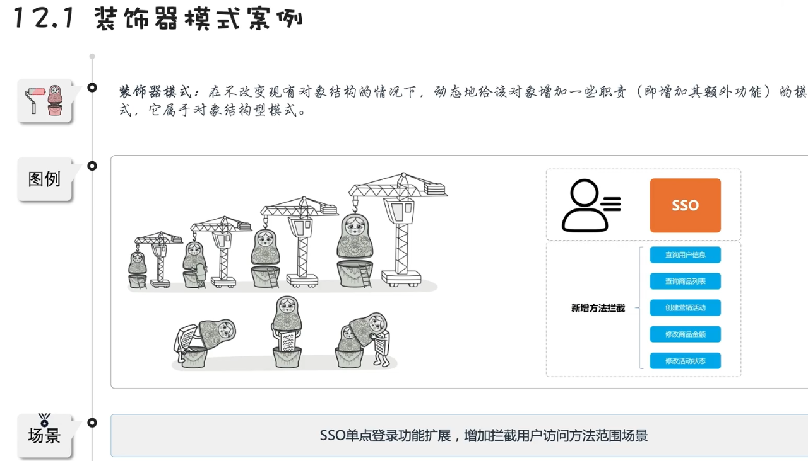

在不改变现有对象结构的情况下，动态地给该对象增加一些职责（即增加其额外功能）的模式，它属于对象结构型模式。

释义：

> ### 一、什么是装饰器模式？
>
> 先给你一个最核心、面试也能说的定义：
>
> > **装饰器模式：在不修改原有对象的情况下，通过包装（组合）一个对象，动态地给它增加额外职责。**
>
> 拆成三个关键词：
>
> ```
> 不修改原对象
>       ↓
> 包装原对象
>       ↓
> 增加额外功能
> ```
>
> 例如你有一个：
>
> ```
> Coffee coffee = new Coffee();
> ```
>
> 它只能：
>
> ```
> 喝咖啡
> ```
>
> 现在你想动态增加：
>
> ```
> + 牛奶
> + 糖
> + 奶油
> ```
>
> 你当然可以直接修改 `Coffee`：
>
> ```
> class Coffee {
>     void drink() {
>         // 咖啡
>         // 加牛奶
>         // 加糖
>         // 加奶油
>     }
> }
> ```
>
> 但这样问题很大：
>
> ```
> Coffee
> ├── 原始咖啡
> ├── 牛奶咖啡
> ├── 糖咖啡
> ├── 奶油咖啡
> ├── 牛奶+糖咖啡
> ├── 牛奶+奶油咖啡
> ├── 糖+奶油咖啡
> └── 牛奶+糖+奶油咖啡
> ```
>
> 组合一多，子类爆炸。
>
> 装饰器的思路是：
>
> ```
> Coffee
>   ↓
> MilkDecorator
>   ↓
> SugarDecorator
>   ↓
> CreamDecorator
> ```
>
> 每一层都是**包装上一层对象，然后增加自己的功能**。
>
> ------
>
> ### 二、先看一个最简单的 Java 例子
>
> 我们设计一个“消息发送”。
>
> 原始功能：
>
> ```
> public interface Message {
> 
>     void send(String message);
> 
> }
> ```
>
> 最基础实现：
>
> ```
> public class SimpleMessage implements Message {
> 
>     @Override
>     public void send(String message) {
>         System.out.println("发送消息：" + message);
>     }
> 
> }
> ```
>
> 现在我们希望增加两个功能：
>
> ```
> 发送前：记录日志
> 发送后：统计发送次数
> ```
>
> 我们不修改 `SimpleMessage`。
>
> 先写一个装饰器：
>
> ```
> public abstract class MessageDecorator implements Message {
> 
>     protected Message message;
> 
>     public MessageDecorator(Message message) {
>         this.message = message;
>     }
> 
> }
> ```
>
> 注意这里非常关键：
>
> ```
> protected Message message;
> ```
>
> 它保存的就是：
>
> > **被装饰的那个对象。**
>
> 然后：
>
> ```
> public class LogMessageDecorator extends MessageDecorator {
> 
>     public LogMessageDecorator(Message message) {
>         super(message);
>     }
> 
>     @Override
>     public void send(String message) {
>         System.out.println("记录日志");
>         this.message.send(message);
>     }
> }
> ```
>
> 再来一个：
>
> ```
> public class CountMessageDecorator extends MessageDecorator {
> 
>     public CountMessageDecorator(Message message) {
>         super(message);
>     }
> 
>     @Override
>     public void send(String message) {
>         System.out.println("统计发送次数");
>         this.message.send(message);
>     }
> 
> }
> ```
>
> 使用的时候：
>
> ```
> Message message = new SimpleMessage();
> message = new LogMessageDecorator(message);
> message = new CountMessageDecorator(message);
> message.send("订单创建成功");
> ```
>
> 这三行实际上形成了：
>
> ```
> CountMessageDecorator
>         ↓
> LogMessageDecorator
>         ↓
> SimpleMessage
> ```
>
> 调用：
>
> ```
> message.send("订单创建成功");
> ```
>
> 执行过程：
>
> ```
> CountMessageDecorator.send()
>         ↓
> 打印：统计发送次数
>         ↓
> LogMessageDecorator.send()
>         ↓
> 打印：记录日志
>         ↓
> SimpleMessage.send()
>         ↓
> 打印：发送消息
> ```
>
> 最终：
>
> ```
> 统计发送次数
> 记录日志
> 发送消息：订单创建成功
> ```
>
> ------
>
> ### 三、装饰器最核心的结构
>
> 你可以把它记成：
>
> ```
>                 Message
>                    ↑
>           ┌────────┴────────┐
>           │                 │
>    SimpleMessage      MessageDecorator
>                               ↑
>                        ┌──────┴──────┐
>                        │             │
>                  LogDecorator   CountDecorator
> ```
>
> 这里最关键的一点是：
>
> **装饰器和被装饰对象实现的是同一个接口。**
>
> 也就是：
>
> ```
> SimpleMessage implements Message
> ```
>
> 同时：
>
> ```
> MessageDecorator implements Message
> ```
>
> 因此：
>
> ```
> Message
> ```
>
> 这个类型可以同时指向：
>
> ```
> SimpleMessage
> LogMessageDecorator
> CountMessageDecorator
> ```
>
> 于是才能不断套娃：
>
> ```
> Message message =
>     new CountMessageDecorator(
>         new LogMessageDecorator(
>             new SimpleMessage()
>         )
>     );
> ```
>
> 这就是装饰器模式最经典的结构。
>
> ------
>
> ### 四、为什么一定要“同一个接口”？
>
> 这是装饰器和普通“对象组合”最重要的区别之一。
>
> 假如：
>
> ```
> class A {
>     void execute() {}
> }
> ```
>
> 然后：
>
> ```
> class B {
>     private A a;
> }
> ```
>
> 这只是：
>
> > B 组合了 A。
>
> **不一定是装饰器。**
>
> 装饰器要求：
>
> ```
> B 和 A 对外表现为同一种类型
> ```
>
> 例如：
>
> ```
> interface Component {
>     void execute();
> }
> ```
>
> 然后：
>
> ```
> class ConcreteComponent implements Component
> ```
>
> 和：
>
> ```
> class Decorator implements Component
> ```
>
> 这样客户端根本不需要知道里面到底套了多少层：
>
> ```
> Component component =
>     new Decorator(
>         new ConcreteComponent()
>     );
> ```
>
> 客户端只认识：
>
> ```
> Component
> ```
>
> 这就是装饰器非常重要的：
>
> > **透明性 / 统一接口**
>
> ------
>
> ### 五、为什么不用继承？
>
> 这其实是装饰器模式产生的重要原因。
>
> 假设你使用继承：
>
> ```
> Message
> ├── SimpleMessage
> ├── LogMessage
> ├── CountMessage
> ├── LogCountMessage
> ├── LogCountEncryptMessage
> ├── LogCountEncryptCompressMessage
> └── ...
> ```
>
> 如果功能不断增加：
>
> ```
> 日志
> 统计
> 加密
> 压缩
> 缓存
> 重试
> 监控
> 权限
> ```
>
> 那么组合数量会越来越夸张。
>
> 装饰器则是：
>
> ```
> SimpleMessage
>     ↓
> LogDecorator
>     ↓
> CountDecorator
>     ↓
> EncryptDecorator
>     ↓
> RetryDecorator
> ```
>
> 功能可以**动态组合**。
>
> 例如今天：
>
> ```
> new LogDecorator(
>     new SimpleMessage()
> );
> ```
>
> 明天：
>
> ```
> new CountDecorator(
>     new LogDecorator(
>         new SimpleMessage()
>     )
> );
> ```
>
> 后天：
>
> ```
> new EncryptDecorator(
>     new CountDecorator(
>         new LogDecorator(
>             new SimpleMessage()
>         )
>     )
> );
> ```
>
> 不需要不停增加：
>
> ```
> LogCountMessage
> LogCountEncryptMessage
> ...
> ```
>
> ------
>
> ### 六、Java 中一个非常经典的装饰器：IO 流
>
> 这个你以后一定会遇到。
>
> 例如：
>
> ```
> InputStream inputStream =
>     new FileInputStream("test.txt");
> ```
>
> 这是最基础的文件输入流。
>
> 然后：
>
> ```
> InputStream inputStream =
>     new BufferedInputStream(
>         new FileInputStream("test.txt")
>     );
> ```
>
> 你实际上是在做：
>
> ```
> BufferedInputStream
>         ↓
> FileInputStream
> ```
>
> 再比如：
>
> ```
> InputStream inputStream =
>     new DataInputStream(
>         new BufferedInputStream(
>             new FileInputStream("test.txt")
>         )
>     );
> ```
>
> 结构：
>
> ```
> DataInputStream
>         ↓
> BufferedInputStream
>         ↓
> FileInputStream
> ```
>
> 这就是非常经典的装饰器思想。
>
> 每一层增加不同能力：
>
> ```
> FileInputStream
>     ↓
> 提供文件读取
> 
> BufferedInputStream
>     ↓
> 增加缓冲能力
> 
> DataInputStream
>     ↓
> 增加读取基本数据类型的能力
> ```
>
> 而它们都围绕 `InputStream` 这个抽象进行组合。
>
> 所以你以后看到：
>
> ```
> new XXX(
>     new XXX(
>         new XXX(...)
>     )
> )
> ```
>
> 尤其这些类实现同一个接口/继承同一个抽象类时，就应该警觉：
>
> > **这里可能存在装饰器模式。**
>
> ------
>
> ### 七、装饰器和你刚学的桥接模式有什么区别？
>
> 这个非常重要。
>
> 你刚刚学过 Bridge：
>
> ```
>         Message
>            │
>     ┌──────┴──────┐
>  NormalMessage  UrgentMessage
>        │              │
>        └──────┬───────┘
>               ↓
>         MessageSender
>         /      |      \
>       Email   SMS    WeChat
> ```
>
> Bridge 的核心是：
>
> > **两个独立变化的维度进行解耦。**
>
> 例如：
>
> ```
> 消息类型 × 发送方式
> ```
>
> 而 Decorator：
>
> ```
> 原对象
>   ↓
> 装饰器1
>   ↓
> 装饰器2
>   ↓
> 装饰器3
> ```
>
> 核心是：
>
> > **动态地给一个对象叠加职责。**
>
> 所以你可以这样区分：
>
> | 模式      | 核心问题                      |
> | --------- | ----------------------------- |
> | Adapter   | 两个不兼容的东西怎么合作？    |
> | Factory   | 到底创建/选择哪个对象？       |
> | Bridge    | 两个独立变化的维度怎么解耦？  |
> | Composite | 如何表示树形的整体-部分结构？ |
> | Decorator | 如何动态给对象增加功能？      |
>
> ------
>
> ### 八、装饰器模式的开发重难点
>
> 这部分对你学习最重要。
>
> ### 难点 1：理解“包装”
>
> 装饰器最核心的代码往往就这一句：
>
> ```
> protected Message message;
> ```
>
> 以及：
>
> ```
> this.message.send(message);
> ```
>
> 你一定要理解：
>
> ```
> 装饰器里面保存了原对象
>           ↓
> 装饰器先执行自己的逻辑
>           ↓
> 再调用被装饰对象
> ```
>
> 也就是：
>
> ```
> Decorator
>    │
>    ├── 自己增加功能
>    │
>    └── 调用被包装对象
>              ↓
>          原始对象
> ```
>
> ------
>
> ### 难点 2：为什么可以一层套一层？
>
> 因为：
>
> ```
> MessageDecorator implements Message
> ```
>
> 所以：
>
> ```
> MessageDecorator
> ```
>
> 本身也是：
>
> ```
> Message
> ```
>
> 于是：
>
> ```
> new LogMessageDecorator(
>     new SimpleMessage()
> )
> ```
>
> 返回的仍然可以赋值给：
>
> ```
> Message
> ```
>
> 所以又可以：
>
> ```
> new CountMessageDecorator(
>     new LogMessageDecorator(
>         new SimpleMessage()
>     )
> )
> ```
>
> 这就是装饰器能够无限嵌套的基础。
>
> ------
>
> ### 九、难点 3：执行顺序
>
> 这个特别容易懵。
>
> 例如：
>
> ```
> Message message =
>     new CountMessageDecorator(
>         new LogMessageDecorator(
>             new SimpleMessage()
>         )
>     );
> ```
>
> 执行：
>
> ```
> message.send("Hello");
> ```
>
> 不是直接进入 `SimpleMessage`。
>
> 而是：
>
> ```
> ① CountMessageDecorator.send()
>         ↓
> ② CountMessageDecorator自己的逻辑
>         ↓
> ③ message.send()
>         ↓
> ④ LogMessageDecorator.send()
>         ↓
> ⑤ LogMessageDecorator自己的逻辑
>         ↓
> ⑥ message.send()
>         ↓
> ⑦ SimpleMessage.send()
> ```
>
> 所以装饰器实际上形成了一个**调用链**。
>
> ```
> 外层
>  ↓
>  ↓
>  ↓
> 内层
>  ↓
> 原始对象
> ```
>
> 这也是为什么装饰器经常和责任链、AOP、中间件等概念让人产生联系——它们都有“层层包裹/链式调用”的味道，但设计目的不同。
>
> ------
>
> ### 十、难点 4：装饰器增加的是“职责”，而不是简单修改数据
>
> 比如：
>
> ```
> LogDecorator
> ```
>
> 增加：
>
> ```
> 日志记录职责
> CacheDecorator
> ```
>
> 增加：
>
> ```
> 缓存职责
> RetryDecorator
> ```
>
> 增加：
>
> ```
> 重试职责
> PermissionDecorator
> ```
>
> 增加：
>
> ```
> 权限检查职责
> ```
>
> 所以定义里的：
>
> > **动态增加额外职责**
>
> 这个“职责”是关键词。
>
> ------
>
> ### 十一、你学习装饰器时最容易犯的错误
>
> 不要把：
>
> ```
> class A {
>     private B b;
> }
> ```
>
> 直接理解成装饰器。
>
> **组合 ≠ 装饰器。**
>
> 判断装饰器，我建议你问三个问题：
>
> ### ① 有没有一个原始对象？
>
> ```
> ConcreteComponent
> ```
>
> ### ② 有没有一个包装它的对象？
>
> ```
> Decorator
>     ↓
> ConcreteComponent
> ```
>
> ### ③ 包装对象和原对象是不是对外提供相同的抽象接口？
>
> ```
> Component
>  ↑       ↑
> 原对象   装饰器
> ```
>
> 如果三个条件都满足，而且装饰器是在**转发原有行为的基础上增加职责**，那基本就是 Decorator。
>
> ------
>
> ### 十二、你可以先记住这一张图
>
> ```
>              Component
>              /       \
>             /         \
>            ↓           ↓
>   ConcreteComponent   Decorator
>                          │
>                          │ 持有
>                          ↓
>                   Component component
>                          │
>                          ↓
>                   ConcreteComponent
> ```
>
> 实际运行：
>
> ```
> client
>   │
>   ↓
> Decorator
>   │
>   ├── 新增功能
>   │
>   ↓
> Decorator
>   │
>   ├── 新增功能
>   │
>   ↓
> ConcreteComponent
>   │
>   └── 原始功能
> ```
>
> **一句话记忆：**
>
> > **装饰器 = 同接口 + 包装原对象 + 在调用原对象前后增加功能 + 可以多层嵌套。**

# [5]外观模式（结构型模式）

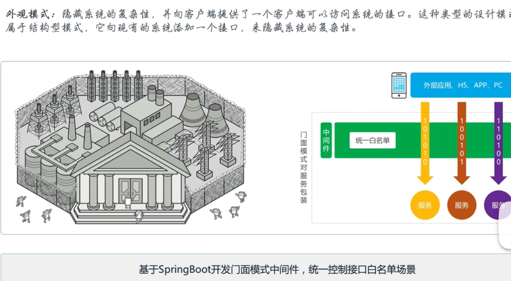

> ### 一、先理解：为什么需要外观模式？
>
> 假设你要开发一个“下单”功能。
>
> 一个订单真正创建成功，可能需要经过：
>
> ```
> 用户下单
>   ↓
> ① 校验库存
>   ↓
> ② 创建订单
>   ↓
> ③ 扣减库存
>   ↓
> ④ 支付
>   ↓
> ⑤ 发送通知
> ```
>
> 如果没有外观模式，客户端可能需要自己调用：
>
> ```
> inventoryService.checkStock();
> 
> orderService.createOrder();
> 
> inventoryService.reduceStock();
> 
> paymentService.pay();
> 
> messageService.sendMessage();
> ```
>
> 那么问题来了：
>
> **客户端为什么要知道这么多东西？**
>
> 它必须知道：
>
> - 有库存系统
> - 有订单系统
> - 有支付系统
> - 有消息系统
> - 调用顺序是什么
> - 哪一步失败了怎么办
>
> 于是客户端和这一堆子系统产生了大量耦合。
>
> ------
>
> ### 二、外观模式是怎么解决的？
>
> 我们增加一个统一入口：
>
> ```
> public class OrderFacade {
> 
>     private InventoryService inventoryService;
>     private OrderService orderService;
>     private PaymentService paymentService;
>     private MessageService messageService;
> 
>     public void placeOrder() {
> 
>         inventoryService.checkStock();
> 
>         orderService.createOrder();
> 
>         inventoryService.reduceStock();
> 
>         paymentService.pay();
> 
>         messageService.sendMessage();
>     }
> }
> ```
>
> 客户端就简单了：
>
> ```
> OrderFacade facade = new OrderFacade();
> 
> facade.placeOrder();
> ```
>
> 客户端根本不需要知道里面发生了什么。
>
> 变成：
>
> ```
>                     ┌────────────────────┐
>                     │      Client        │
>                     └─────────┬──────────┘
>                               │
>                               ▼
>                     ┌────────────────────┐
>                     │    OrderFacade     │
>                     │    统一入口         │
>                     └─────────┬──────────┘
>                               │
>               ┌───────────────┼───────────────┐
>               ▼               ▼               ▼
>         InventoryService  OrderService  PaymentService
>                                               │
>                                               ▼
>                                       MessageService
> ```
>
> 所以：
>
> > **Facade 就像“总管”或者“前台”，客户端只找它，不需要直接面对后面的复杂子系统。**
>
> ------
>
> ### 三、一个更生活化的例子
>
> 比如你去酒店入住。
>
> 实际上酒店内部可能有：
>
> ```
> 前台系统
> 身份证验证系统
> 房间管理系统
> 支付系统
> 门锁系统
> 会员系统
> ```
>
> 但是你不会：
>
> ```
> 自己调用身份证系统
> ↓
> 自己查房间
> ↓
> 自己支付
> ↓
> 自己让门锁系统开门
> ```
>
> 你只需要：
>
> ```
> 入住()
> ```
>
> 酒店前台就是一个**Facade**。
>
> ```
> 你
>  ↓
> 酒店前台（Facade）
>  ↓
> 身份证验证
>  ↓
> 房间分配
>  ↓
> 支付
>  ↓
> 门锁授权
>  ↓
> 会员积分
> ```
>
> ------
>
> ### 四、外观模式的核心结构
>
> 典型结构非常简单：
>
> ```
>                  Client
>                    │
>                    ▼
>               ┌─────────┐
>               │ Facade  │
>               └────┬────┘
>                    │
>           ┌────────┼────────┐
>           ▼        ▼        ▼
>        SubSystem SubSystem SubSystem
>           A        B        C
> ```
>
> 对应到 Java：
>
> ```
> class Facade {
> 
>     private SubSystemA a;
>     private SubSystemB b;
>     private SubSystemC c;
> 
>     public void operation() {
>         a.operationA();
>         b.operationB();
>         c.operationC();
>     }
> }
> ```
>
> 这里有几个关键角色：
>
> | 角色      | 含义             |
> | --------- | ---------------- |
> | Client    | 客户端           |
> | Facade    | 外观类，统一入口 |
> | SubSystem | 后面的复杂子系统 |
>
> ------
>
> ### 五、注意：Facade 不是“把代码塞进一个类”
>
> 这是学习外观模式最容易产生的误区。
>
> 比如：
>
> ```
> public class OrderFacade {
> 
>     public void placeOrder() {
>         // 1000 行代码
>     }
> }
> ```
>
> 这不叫外观模式。
>
> 真正的外观模式应该是：
>
> ```
> Facade
>  │
>  ├── 调用库存系统
>  ├── 调用订单系统
>  ├── 调用支付系统
>  └── 调用消息系统
> ```
>
> 也就是说：
>
> > **Facade 本身并不负责完成所有业务，它主要负责组织和协调已有的子系统。**
>
> 这是非常重要的一点。
>
> ------
>
> ### 六、和你刚学的装饰器模式对比
>
> 你刚刚学完 Decorator，这两个特别容易混。
>
> ### 装饰器
>
> 核心问题：
>
> > **我已经有一个对象了，现在想在不修改它的情况下增加一些职责。**
>
> 例如：
>
> ```
> SsoInterceptor
>        ↓
> LoginSsoDecorator
>        ↓
> 权限校验
> ```
>
> 它强调：
>
> ```
> 包装
> ↓
> 原功能
> +
> 新功能
> ```
>
> ------
>
> ### 外观
>
> 核心问题：
>
> > **我的系统内部有很多复杂模块，我不想让客户端直接和它们打交道。**
>
> 例如：
>
> ```
>                 Client
>                    ↓
>               OrderFacade
>              ↙    ↓    ↘
>         库存     订单     支付
>                        ↓
>                       消息
> ```
>
> 它强调：
>
> ```
> 多个复杂子系统
>        ↓
>    Facade统一封装
>        ↓
>    简单接口给Client
> ```
>
> 所以可以这样记：
>
> | 模式       | 解决什么问题                     |
> | ---------- | -------------------------------- |
> | Adapter    | 接口不兼容                       |
> | Bridge     | 两个变化维度相互独立             |
> | Composite  | 树形整体-部分结构                |
> | Decorator  | 动态增加对象职责                 |
> | **Facade** | **隐藏复杂子系统，提供统一入口** |
>
> ------
>
> ### 七、外观模式和 Adapter 也很容易混
>
> 这个你尤其需要区分。
>
> ### Adapter
>
> 原来：
>
> ```
> Client
>   ↓
> 旧接口
>   ↓
> 不兼容
> ```
>
> Adapter 做的是：
>
> ```
> Client
>   ↓
> Adapter
>   ↓
> 原本不兼容的对象
> ```
>
> 核心是：
>
> > **让两个原本不兼容的接口能够合作。**
>
> ------
>
> ### Facade
>
> 接口本身没有不兼容。
>
> 而是：
>
> ```
> Client
>   ↓
> Facade
>   ↓
> A
> B
> C
> D
> ```
>
> 核心是：
>
> > **原本可以调用，但是太复杂了，所以提供一个简单入口。**
>
> 因此：
>
> > **Adapter 是“翻译接口”，Facade 是“简化入口”。**
>
> ------
>
> ### 八、开发中的难点
>
> 这个模式本身其实不难，真正容易搞混的是它的**边界**。
>
> ### 难点 1：什么时候应该使用 Facade？
>
> 问自己：
>
> > **客户端是不是需要同时知道并调用很多底层模块？**
>
> 例如：
>
> ```
> a.xxx();
> b.xxx();
> c.xxx();
> d.xxx();
> ```
>
> 而且这些调用还有固定顺序。
>
> 这时候就很适合：
>
> ```
> facade.doSomething();
> ```
>
> ------
>
> ### 难点 2：Facade 不是禁止客户端访问子系统
>
> 这是一个非常重要的理解。
>
> Facade 的作用是：
>
> > **提供一个更方便的入口。**
>
> 而不是：
>
> > “客户端绝对不能访问子系统。”
>
> 例如：
>
> ```
> OrderFacade facade = new OrderFacade();
> facade.placeOrder();
> ```
>
> 这是推荐路径。
>
> 但如果某些高级场景确实需要：
>
> ```
> paymentService.refund();
> ```
>
> 也不代表设计就违反 Facade 模式。
>
> Facade 是**降低复杂度和耦合**，不是强制封锁。
>
> ------
>
> ### 九、难点 3：Facade 里面应该放什么？
>
> 通常放的是：
>
> ```
> 流程编排
> +
> 子系统协调
> +
> 统一入口
> ```
>
> 例如：
>
> ```
> public void registerUser(User user) {
> 
>     userService.create(user);
> 
>     accountService.createAccount(user);
> 
>     messageService.sendWelcomeMessage(user);
> 
>     pointsService.initPoints(user);
> }
> ```
>
> 而不是把：
>
> ```
> userService.create()
> ```
>
> 的所有底层实现复制进 Facade。
>
> 所以：
>
> > **Facade 负责“调用谁、按什么顺序调用”，子系统负责“具体怎么做”。**
>
> ------
>
> ### 十、一个非常典型的 Java 示例
>
> 例如做一个视频播放系统。
>
> 内部有：
>
> ```
> class VideoFile {
>     public void load() {}
> }
> 
> class Codec {
>     public void decode() {}
> }
> 
> class AudioSystem {
>     public void start() {}
> }
> 
> class Screen {
>     public void show() {}
> }
> ```
>
> 如果客户端自己调用：
>
> ```
> videoFile.load();
> codec.decode();
> audioSystem.start();
> screen.show();
> ```
>
> 太麻烦。
>
> 于是：
>
> ```
> public class VideoFacade {
> 
>     private VideoFile videoFile;
>     private Codec codec;
>     private AudioSystem audioSystem;
>     private Screen screen;
> 
>     public void play() {
> 
>         videoFile.load();
> 
>         codec.decode();
> 
>         audioSystem.start();
> 
>         screen.show();
>     }
> }
> ```
>
> 客户端：
>
> ```
> VideoFacade videoFacade = new VideoFacade();
> 
> videoFacade.play();
> ```
>
> 这就是非常典型的 Facade。
>
> ------
>
> ### 十一、你现在学习时最应该抓住的一个核心
>
> 不要把外观模式理解成：
>
> > “写一个 Facade 类。”
>
> 这个理解太表面。
>
> 真正应该理解的是：
>
> ```
> 原来：
> 
> Client
>   │
>   ├── A
>   ├── B
>   ├── C
>   └── D
> 
> 
> 改造后：
> 
> Client
>   │
>   ▼
> Facade
>   │
>   ├── A
>   ├── B
>   ├── C
>   └── D
> ```
>
> 变化的是**依赖关系**：
>
> ```
> 原来 Client 直接依赖 A/B/C/D
> 
> ↓
> 
> 现在 Client 主要依赖 Facade
> Facade 再依赖 A/B/C/D
> ```
>
> 所以它本质上也是一种**解耦手段**。
>
> ------
>
> ### 十二、你可以用这句话判断是不是 Facade
>
> 以后看到一个代码结构，问：
>
> > **“是不是存在一堆复杂的子系统，而我希望给客户端提供一个简单、统一的高层入口？”**
>
> 如果答案是：
>
> **是。**
>
> 那么就很可能是 Facade。

# [6]享元模式（结构型模式）

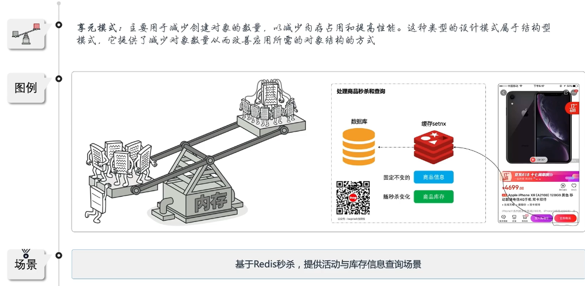

> ### 一、先说“享元”到底是什么意思
>
> 英文是：
>
> > **Flyweight Pattern**
>
> 这里的 `Flyweight` 原本是一个**轻量级、重量很小的东西**。
>
> 中文翻译成“享元”，其实是把两个意思揉在了一起：
>
> - **享**：共享
> - **元**：对象的基本实例/单位
>
> 所以“享元”可以粗暴理解成：
>
> > **大家共享同一个对象，避免每个人都重复创建一份。**
>
> 它真正应该让你脑子里出现的不是“享元”两个字，而是：
>
> > **共享对象，减少重复对象。**
>
> ------
>
> ### 二、为什么需要享元模式？
>
> 先看一个非常直观的场景。
>
> 假设你开发一个**在线文档编辑器**。
>
> 用户可以输入：
>
> ```
> Hello World!
> 这是一个 Java 程序。
> 欢迎学习设计模式。
> ```
>
> 里面可能出现大量字符：
>
> ```
> H e l l o
> W o r l d
> J a v a
> ...
> ```
>
> 假设一篇文档有：
>
> > 100 万个字符
>
> 你如果傻乎乎地：
>
> ```
> new Character('a');
> new Character('b');
> new Character('c');
> ...
> ```
>
> 每出现一次 `a` 就创建一个对象。
>
> 那么：
>
> ```
> a → Object A
> a → Object B
> a → Object C
> a → Object D
> ...
> ```
>
> 实际上：
>
> > **这些 `a` 的很多信息是完全一样的。**
>
> 比如字体是：
>
> ```
> 宋体
> ```
>
> 字号：
>
> ```
> 14
> ```
>
> 颜色：
>
> ```
> 黑色
> ```
>
> 那么大量 `a` 可能共享：
>
> ```
> 字符内容：a
> 字体：宋体
> 字号：14
> 颜色：黑色
> ```
>
> 为什么每次都重新创建？
>
> 完全没必要。
>
> 所以可以变成：
>
> ```
>              ┌──────────────┐
> a →─────────→│              │
> a →─────────→│  Character A │
> a →─────────→│              │
> a →─────────→│              │
>              └──────────────┘
> ```
>
> 大家**共享同一个对象**。
>
> 这就是享元最核心的思想。
>
> ------
>
> ### 三、享元模式真正解决的问题
>
> 可以直接记这一句话：
>
> > **当系统中存在大量细粒度、重复的对象时，把可以共享的对象提取出来，让多个使用者共享同一个对象，从而减少对象数量和内存开销。**
>
> 关键词只有三个：
>
> > **大量 + 重复 + 共享**
>
> 如果没有这三个特征，享元通常没必要。
>
> ------
>
> ### 四、一个特别经典的例子：游戏里的子弹
>
> 假设你做一个射击游戏。
>
> 屏幕上同时存在：
>
> ```
> 10000 发子弹
> ```
>
> 每颗子弹都有一些信息。
>
> 例如：
>
> ```
> public class Bullet {
>     private String texture;
>     private int damage;
>     private int speed;
> 
>     // 每颗子弹自己的位置
>     private int x;
>     private int y;
> }
> ```
>
> 如果所有普通子弹都是：
>
> ```
> 纹理：bullet.png
> 伤害：10
> 速度：100
> ```
>
> 那么：
>
> ```
> 子弹1
> texture = bullet.png
> damage = 10
> speed = 100
> x = 100
> y = 200
> 
> 子弹2
> texture = bullet.png
> damage = 10
> speed = 100
> x = 300
> y = 500
> 
> 子弹3
> texture = bullet.png
> damage = 10
> speed = 100
> x = 700
> y = 100
> ```
>
> 你会发现：
>
> ```
> texture
> damage
> speed
> ```
>
> 这些东西完全一样。
>
> 真正不同的是：
>
> ```
> x
> y
> ```
>
> 那么就可以把：
>
> ### 可以共享的部分
>
> 叫做：
>
> > **内部状态（Intrinsic State）**
>
> 例如：
>
> ```
> texture
> damage
> speed
> ```
>
> ### 不能共享的部分
>
> 叫做：
>
> > **外部状态（Extrinsic State）**
>
> 例如：
>
> ```
> x
> y
> ```
>
> 这就是学习享元模式时**最重要、最容易考、也最容易混淆的概念之一**。
>
> ------
>
> ### 五、享元模式的核心：把对象拆成两部分
>
> 例如：
>
> ```
> Bullet
> │
> ├── 内部状态
> │     ├── texture
> │     ├── damage
> │     └── speed
> │
> └── 外部状态
>       ├── x
>       └── y
> ```
>
> 内部状态：
>
> > 对于大量对象来说都是相同的，可以共享。
>
> 外部状态：
>
> > 每个对象/每次使用时不同，不能放进共享对象里。
>
> 所以最后设计成：
>
> ```
> public class BulletFlyweight {
> 
>     private String texture;
>     private int damage;
>     private int speed;
> 
>     public BulletFlyweight(String texture, int damage, int speed) {
>         this.texture = texture;
>         this.damage = damage;
>         this.speed = speed;
>     }
> 
>     public void draw(int x, int y) {
>         System.out.println(
>             "绘制子弹：" + texture
>             + "，伤害：" + damage
>             + "，速度：" + speed
>             + "，位置：" + x + "," + y
>         );
>     }
> }
> ```
>
> 注意这里一个非常关键的地方：
>
> ```
> draw(int x, int y)
> ```
>
> `x`、`y` **没有存进对象里面**。
>
> 而是使用的时候传进去。
>
> 因为：
>
> ```
> BulletFlyweight
>         │
>         │ 共享
>         ↓
> 所有子弹共用
> texture
> damage
> speed
> 
> 使用时传入
> x
> y
> ```
>
> ------
>
> ### 六、那“共享”到底是怎么实现的？
>
> 这就进入享元模式真正的代码结构了。
>
> 我们需要一个：
>
> > **享元工厂（Flyweight Factory）**
>
> 它专门负责：
>
> > **有就拿旧的，没有才创建新的。**
>
> 例如：
>
> ```
> public class BulletFactory {
> 
>     private static final Map<String, BulletFlyweight> pool = new HashMap<>();
> 
>     public static BulletFlyweight getBullet(
>             String texture,
>             int damage,
>             int speed) {
> 
>         String key = texture + "_" + damage + "_" + speed;
> 
>         BulletFlyweight bullet = pool.get(key);
> 
>         if (bullet == null) {
>             bullet = new BulletFlyweight(texture, damage, speed);
>             pool.put(key, bullet);
>         }
> 
>         return bullet;
>     }
> }
> ```
>
> 于是：
>
> ```
> BulletFlyweight b1 =
>         BulletFactory.getBullet("bullet.png", 10, 100);
> 
> BulletFlyweight b2 =
>         BulletFactory.getBullet("bullet.png", 10, 100);
> ```
>
> 这里：
>
> ```
> b1 == b2
> ```
>
> 是：
>
> ```
> true
> ```
>
> 因为第二次根本没有创建新对象。
>
> ------
>
> ### 七、你可以把它想成“对象池”，但不要完全等同
>
> 这里很容易混淆。
>
> 享元：
>
> ```
> 我要的是：
> “相同对象共享”
> ```
>
> 对象池：
>
> ```
> 我要的是：
> “对象用完以后回收，再借给别人”
> ```
>
> 例如数据库连接池：
>
> ```
> Connection 1
> Connection 2
> Connection 3
> ```
>
> 这些连接不是因为“内容完全相同”才共享，而是因为：
>
> > 创建成本高，所以重复利用。
>
> 而享元关注：
>
> > **对象的内部状态相同，所以没必要创建多个。**
>
> ------
>
> ### 八、开发中一个更典型的例子：数据库查询结果缓存？
>
> 这个方向要谨慎。
>
> 很多缓存场景**看起来像享元，但不一定是经典享元**。
>
> 真正比较典型的：
>
> ### Java 字符串常量池
>
> 例如：
>
> ```
> String a = "hello";
> String b = "hello";
> ```
>
> 可能共享同一个字符串对象：
>
> ```
> a ─────┐
>        ↓
>     "hello"
>        ↑
>        │
> b ─────┘
> ```
>
> 而：
>
> ```
> String a = new String("hello");
> String b = new String("hello");
> ```
>
> 又会创建不同对象。
>
> 所以：
>
> > **字符串常量池可以帮助理解享元思想。**
>
> 但面试时不要直接说：
>
> > “String 就是享元模式。”
>
> 更准确：
>
> > **字符串常量池体现了对象共享的思想，与享元模式的核心思想相似；但 Java String 的实现机制不能简单等同于 GoF 享元模式。**
>
> ------
>
> ### 九、享元模式的标准结构
>
> 你以后看到代码，可以直接找这几个角色：
>
> ```
>                 ┌─────────────────┐
>                 │ Flyweight       │
>                 │ 享元接口        │
>                 └────────┬────────┘
>                          │
>                  ┌───────┴────────┐
>                  ↓                ↓
>         ConcreteFlyweight    UnsharedFlyweight
>         具体享元              非共享享元
>                  ↑
>                  │
>                  │ 被缓存
>                  │
>         ┌────────┴────────┐
>         │ FlyweightFactory│
>         │ 享元工厂        │
>         └─────────────────┘
> ```
>
> 其中最重要的是：
>
> ```
> Factory
>    │
>    ↓
> 缓存/池
>    │
>    ├── key1 → Flyweight对象
>    ├── key2 → Flyweight对象
>    └── key3 → Flyweight对象
> ```
>
> 工厂负责：
>
> ```
> get()
>  ↓
> 查缓存
>  ↓
> 有 → 返回旧对象
>  ↓
> 没有
>  ↓
> new
>  ↓
> 放入缓存
>  ↓
> 返回
> ```
>
> ------
>
> ### 十、真正的难点在哪里？
>
> 这个模式表面上代码甚至不复杂，但**理解难度其实比代码难度高**。
>
> ### 难点 1：到底什么东西能共享？
>
> 这是第一难点。
>
> 不是：
>
> > “我觉得这个对象可以共享。”
>
> 而是要分析对象状态：
>
> ```
> 哪些状态对于多个对象来说始终相同？
> ```
>
> 这些：
>
> > 内部状态 → 共享
>
> 哪些状态：
>
> ```
> 每次使用都不同？
> ```
>
> 这些：
>
> > 外部状态 → 从外部传入
>
> ------
>
> ### 难点 2：外部状态为什么不能存在共享对象里？
>
> 例如：
>
> ```
> public class Bullet {
> 
>     private int x;
>     private int y;
> }
> ```
>
> 如果 `Bullet` 被 10000 个实体共享：
>
> ```
> Bullet
>   ↑
>   ├── 子弹1
>   ├── 子弹2
>   ├── 子弹3
>   └── ...
> ```
>
> 那：
>
> ```
> bullet.x = 100;
> ```
>
> 到底是谁的 `x`？
>
> 是所有子弹的？
>
> 显然不行。
>
> 所以外部状态必须：
>
> ```
> bullet.draw(x, y);
> ```
>
> 而不是：
>
> ```
> bullet.setX(x);
> bullet.setY(y);
> ```
>
> 这也是享元设计中非常核心的一步：
>
> > **让共享对象尽可能保持无个体差异的状态。**
>
> ------
>
> ### 难点 3：如何确定两个对象“相同”？
>
> 这就涉及：
>
> ```
> Map<Key, Flyweight>
> ```
>
> 中的 `Key`。
>
> 比如：
>
> ```
> texture + damage + speed
> ```
>
> 相同：
>
> ```
> → 可以共享
> ```
>
> 不同：
>
> ```
> → 必须创建不同享元
> ```
>
> 所以享元模式实际上非常依赖：
>
> > **对象身份/状态的划分和缓存键设计。**
>
> ------
>
> ### 难点 4：共享对象的生命周期
>
> 因为：
>
> ```
> 10000 个使用者
>         ↓
> 同一个对象
> ```
>
> 那么这个对象什么时候销毁？
>
> 如果缓存：
>
> ```
> private static final Map<String, BulletFlyweight> pool
> ```
>
> 一直增长：
>
> ```
> key1
> key2
> key3
> ...
> key1000000
> ```
>
> 那你为了节省对象，反而可能造成：
>
> > **缓存无限增长 / 内存泄漏。**
>
> 所以真实工程中可能还涉及：
>
> - 缓存淘汰
> - 生命周期
> - 弱引用
> - 并发安全
> - 内存占用
> - 缓存键设计
>
> 这才是享元模式进入工程实践以后真正麻烦的地方。
>
> ------
>
> ### 十一、和你刚刚学的几个模式放在一起
>
> 这个时候你已经学了不少结构型模式，可以开始建立一个“模式地图”：
>
> | 模式               | 核心问题                             |
> | ------------------ | ------------------------------------ |
> | Adapter 适配器     | **接口不兼容怎么办？**               |
> | Bridge 桥接        | **两个变化维度怎么独立变化？**       |
> | Composite 组合     | **树形结构如何统一处理？**           |
> | Decorator 装饰器   | **不改原对象，怎么动态增加职责？**   |
> | Facade 外观        | **复杂子系统怎么提供简单入口？**     |
> | **Flyweight 享元** | **大量重复对象怎么共享，减少内存？** |
>
> 所以你不要记：
>
> > “享元模式 = Flyweight。”
>
> 而应该形成这个条件反射：
>
> ```
> 系统里有大量小对象
>         ↓
> 很多对象的状态高度重复
>         ↓
> 为什么每个都 new？
>         ↓
> 把相同部分抽出来
>         ↓
> 集中缓存
>         ↓
> 多个对象共享
>         ↓
> 享元模式
> ```
>
> ------
>
> ### 十二、最后给你一个最重要的判断口诀
>
> 以后看到一个项目：
>
> > **“这里是不是有成千上万个对象？”**
>
> 然后继续问：
>
> > **“这些对象是不是大量重复？”**
>
> 再问：
>
> > **“能不能把相同的部分抽出来共享？”**
>
> 如果三个答案都是 **是**：
>
> **享元模式就值得考虑。**
>
> 而它和你刚学的**装饰器**有一个很有意思的区别：
>
> > 装饰器解决的是**“一个对象功能太少，给它动态加东西”**；
> >  享元解决的是**“对象太多，而且很多对象其实没必要重复创建”**。
>
> 一个是在**增加职责**，一个是在**减少对象实例数量**。

# [7]代理模式（结构型模式）

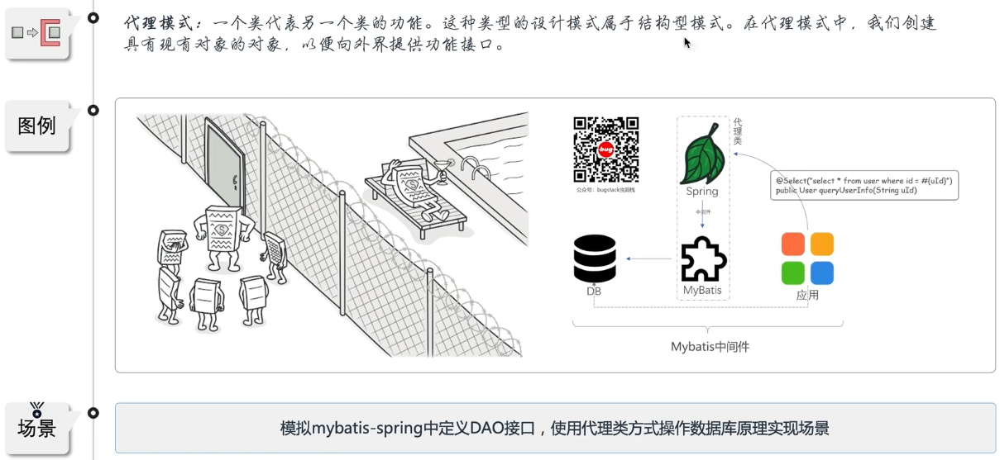

# **（1）责任链模式（行为模式）**

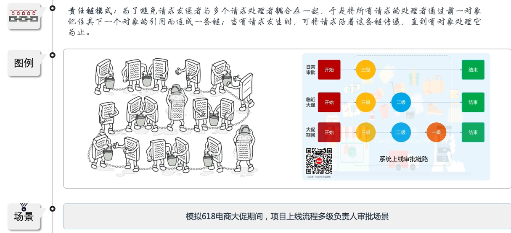

#（2）命令模式（行为模式）

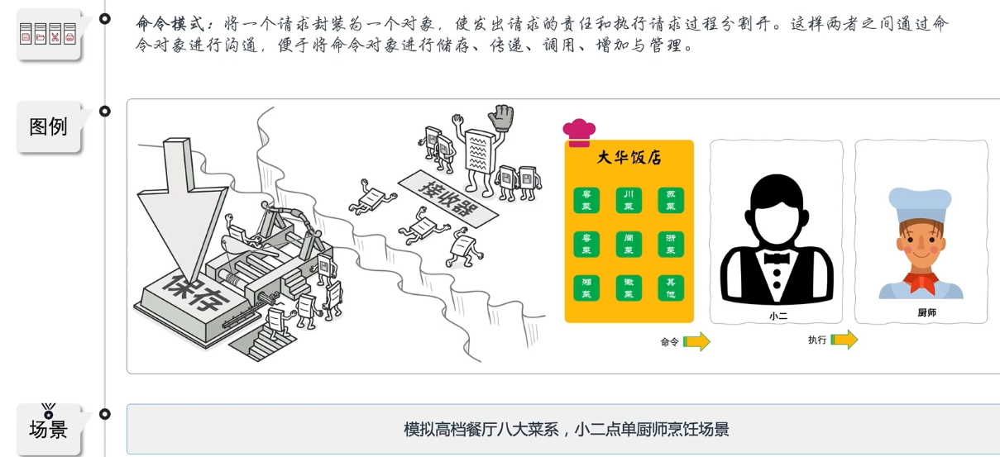

# （3）迭代器模式（行为模式）

c6-ObserverPattern为观察者模式的代码案例，扫描代码，检查是否正确，并将代码进行注释，注意仅仅扫描c6-ObserverPattern，完成后等待我下一步指令

我觉得你生成的观察者模式案例解析与设计架构深度剖析.md写到的比较简陋，不够详细请重新优化修改：观察者模式：c7-StatePattern是状态模式的代码案例：1.说明整个业务场景2.详细说明使用状态模式代码，整体的工程结构，状态模式代码设计特点和细节3.模拟一下测试的数据的流转流程，最终怎么优雅的得到最终结果，将以上分析输入到c7-StatePattern的文件夹下，注意mermaid代码要适配8.x.x版本的


访问者模式：c10-VisitorPattern是访问者模式的案例，现在仅仅扫描c10-VisitorPattern下的代码，然后在c10-VisitorPattern文件下生成一个.md文件，说明：1.案例的访问者模式应用到了哪里？怎么应用到这个业务场景的，相比于普通的代码编写，这种模式的编写特点和内容是有啥区别。2.整理整个代码的框架和结构从全局把握整个工程代码结构和设计思想3.引用的代码注意要注释4.模拟一下测试的案例

# （4）中介者模式（行为模式）

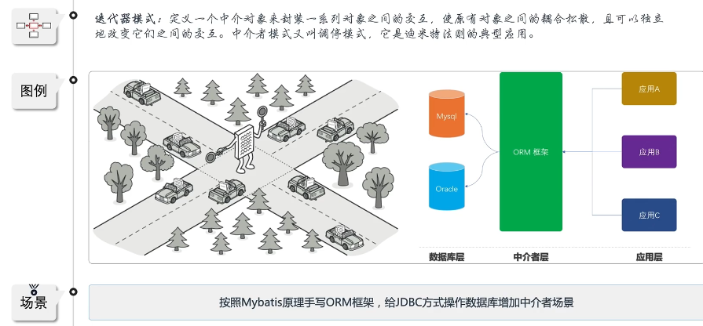

# （5）备忘录模式（行为模式）

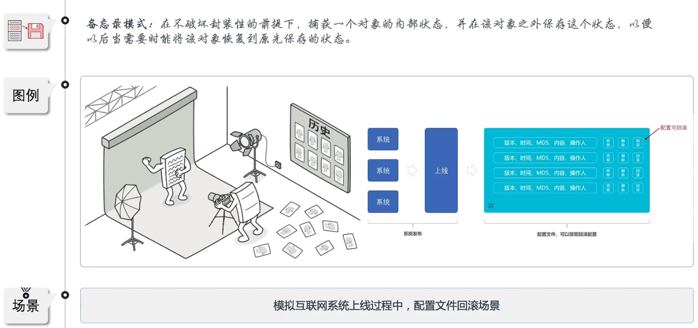

# （6）观察者/发布订阅模式（行为模式）

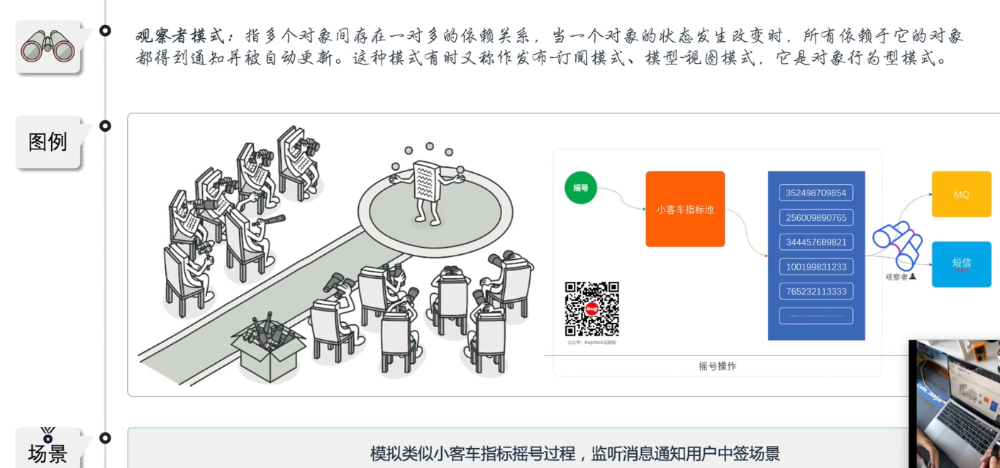

# （7）状态模式（行为模式）

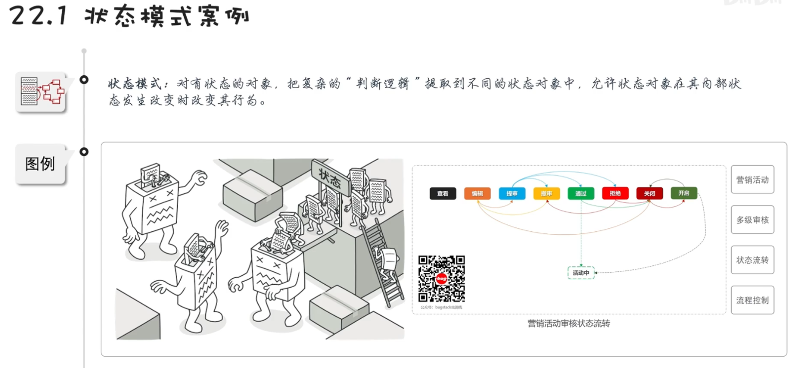

> ### 一、什么是状态模式？
>
> 一句话先记住：
>
> > **状态模式：允许一个对象在内部状态发生变化时，改变它的行为，使这个对象看起来像是换了一个类。**
>
> 最核心的不是“保存一个状态变量”，而是：
>
> > **不同状态下，同一个操作表现出不同的行为。**
>
> 例如一个订单：
>
> ```
> 订单
>  │
>  ├── 待支付
>  │      ├── pay()      → 支付成功
>  │      └── cancel()   → 可以取消
>  │
>  ├── 已支付
>  │      ├── pay()      → 不允许重复支付
>  │      └── cancel()   → 申请退款
>  │
>  └── 已完成
>         ├── pay()      → 不允许支付
>         └── cancel()   → 不允许取消
> ```
>
> 注意这里的关键：
>
> **调用的还是同一个 `pay()`，但是订单处于不同状态时，`pay()` 的行为不同。**
>
> ------
>
> ### 二、不用状态模式会怎么样？
>
> 最直接的写法就是：
>
> ```
> public class Order {
> 
>     private String state;
> 
>     public void pay() {
> 
>         if ("UNPAID".equals(state)) {
>             System.out.println("执行支付");
>         } else if ("PAID".equals(state)) {
>             System.out.println("订单已经支付");
>         } else if ("COMPLETED".equals(state)) {
>             System.out.println("订单已经完成，不能支付");
>         }
>     }
> 
>     public void cancel() {
> 
>         if ("UNPAID".equals(state)) {
>             System.out.println("取消订单");
>         } else if ("PAID".equals(state)) {
>             System.out.println("申请退款");
>         } else if ("COMPLETED".equals(state)) {
>             System.out.println("已完成订单不能取消");
>         }
>     }
> }
> ```
>
> 一开始看起来没什么问题。
>
> 但是随着状态增加：
>
> ```
> 待支付
> 已支付
> 已发货
> 已收货
> 已完成
> 已取消
> 退款中
> 已退款
> ...
> ```
>
> 然后操作又越来越多：
>
> ```
> pay()
> cancel()
> ship()
> receive()
> refund()
> confirm()
> ...
> ```
>
> 最后就会变成：
>
> ```
> if (state == A) {
>     ...
> } else if (state == B) {
>     ...
> } else if (state == C) {
>     ...
> }
> ```
>
> 到处都是状态判断。
>
> 这就是状态模式主要要解决的问题：
>
> > **把“不同状态下的行为”从一个巨大的 `if-else/switch` 中拆出来。**
>
> ------
>
> ### 三、状态模式怎么拆？
>
> 状态模式一般有四个核心角色：
>
> | 角色          | 含义                           |
> | ------------- | ------------------------------ |
> | Context       | 上下文，真正被客户端操作的对象 |
> | State         | 状态接口                       |
> | ConcreteState | 具体状态                       |
> | Client        | 客户端                         |
>
> 结构：
>
> ```
>                  ┌──────────────┐
>                  │    Client    │
>                  └──────┬───────┘
>                         │
>                         ▼
>                  ┌──────────────┐
>                  │   Context    │
>                  │   Order      │
>                  └──────┬───────┘
>                         │ currentState
>                         ▼
>                  ┌──────────────┐
>                  │    State     │
>                  └──────┬───────┘
>                         │
>              ┌──────────┼──────────┐
>              ▼          ▼          ▼
>         UnpaidState  PaidState  CompletedState
> ```
>
> 这里最重要的是：
>
> **Context 持有 State。**
>
> 例如：
>
> ```
> private OrderState state;
> ```
>
> ------
>
> ### 四、先写一个最简单的案例
>
> 我们不要一上来搞 Spring、数据库、状态机框架。
>
> 先自己实现一个**订单状态模式**。
>
> ### 1. State
>
> ```
> public interface OrderState {
> 
>     void pay(Order order);
> 
>     void cancel(Order order);
> }
> ```
>
> 这个接口表示：
>
> > “无论订单现在处于什么状态，都需要知道 `pay()` 和 `cancel()` 在当前状态下应该怎么处理。”
>
> ------
>
> ### 2. Context
>
> ```
> public class Order {
> 
>     private OrderState state;
> 
>     public Order(OrderState state) {
>         this.state = state;
>     }
> 
>     public void setState(OrderState state) {
>         this.state = state;
>     }
> 
>     public void pay() {
>         state.pay(this);//this == Order
>     }
> 
>     public void cancel() {
>         state.cancel(this);
>     }
> }
> ```
>
> 这里就是整个状态模式最关键的一段：
>
> ```
> public void pay() {
>     state.pay(this);
> }
> ```
>
> 客户端调用：
>
> ```
> order.pay();
> ```
>
> 实际上执行的是：
>
> ```
> Order.pay()
>     ↓
> state.pay(this)
>     ↓
> 当前具体状态的 pay()
> ```
>
> 所以：
>
> ```
> order.setState(new UnpaidState());
> order.pay();
> ```
>
> 和：
>
> ```
> order.setState(new PaidState());
> order.pay();
> ```
>
> 调用的都是：
>
> ```
> order.pay();
> ```
>
> 但是最终行为不同。
>
> **这就是状态模式。**
>
> ------
>
> ### 五、具体状态
>
> ### 待支付
>
> ```
> public class UnpaidState implements OrderState {
> 
>     @Override
>     public void pay(Order order) {
>         System.out.println("执行支付");
>         order.setState(new PaidState());
>     }
> 
>     @Override
>     public void cancel(Order order) {
>         System.out.println("取消订单");
>     }
> }
> ```
>
> 注意这里非常关键：
>
> ```
> order.setState(new PaidState());
> ```
>
> **状态对象自己可以触发状态转换。**
>
> 也就是说：
>
> ```
> UnpaidState
>      │
>      │ pay()
>      ▼
> PaidState
> ```
>
> ------
>
> ### 已支付
>
> ```
> public class PaidState implements OrderState {
> 
>     @Override
>     public void pay(Order order) {
>         System.out.println("订单已经支付，不能重复支付");
>     }
> 
>     @Override
>     public void cancel(Order order) {
>         System.out.println("申请退款");
>     }
> }
> ```
>
> ------
>
> ### 已完成
>
> ```
> public class CompletedState implements OrderState {
> 
>     @Override
>     public void pay(Order order) {
>         System.out.println("订单已经完成，不能支付");
>     }
> 
>     @Override
>     public void cancel(Order order) {
>         System.out.println("订单已经完成，不能取消");
>     }
> }
> ```
>
> ------
>
> ### 六、客户端怎么使用？
>
> ```
> public class ApiTest {
> 
>     public static void main(String[] args) {
> 
>         Order order = new Order(new UnpaidState());
> 
>         order.pay();
> 
>         order.pay();
> 
>         order.cancel();
>     }
> }
> ```
>
> 第一次：
>
> ```
> order.pay()
>     ↓
> UnpaidState.pay()
>     ↓
> 执行支付
>     ↓
> Order.state = PaidState
> ```
>
> 所以第二次：
>
> ```
> order.pay()
>     ↓
> PaidState.pay()
>     ↓
> 订单已经支付，不能重复支付
> ```
>
> 这时候你应该真正理解一个非常重要的关系：
>
> ```
>                 Order
>                   │
>                   │ state
>                   ▼
>             UnpaidState
>                   │
>               pay()
>                   │
>                   ▼
>               PaidState
>                   │
>               cancel()
>                   │
>                   ▼
>               退款逻辑
> ```
>
> **状态模式的核心其实就是“状态对象 + 状态切换 + 状态决定行为”。**
>
> ------
>
> ### 七、为什么这比 `if-else` 好？
>
> 原来的代码：
>
> ```
> public void pay() {
> 
>     if ("UNPAID".equals(state)) {
>         ...
>     } else if ("PAID".equals(state)) {
>         ...
>     } else if ("COMPLETED".equals(state)) {
>         ...
>     }
> }
> ```
>
> 所有状态都挤在 `Order` 里面。
>
> 状态模式变成：
>
> ```
> Order
>  │
>  └── State
>       │
>       ├── UnpaidState
>       ├── PaidState
>       └── CompletedState
> ```
>
> 每个状态只负责：
>
> > **“如果现在是我这个状态，那么各种操作应该怎么办？”**
>
> 所以：
>
> ```
> UnpaidState
>     ↓
> 负责待支付状态下的行为
> 
> PaidState
>     ↓
> 负责已支付状态下的行为
> 
> CompletedState
>     ↓
> 负责已完成状态下的行为
> ```
>
> 这样状态增加的时候，不需要不断修改一个巨大的 `Order`。
>
> ------
>
> ### 八、状态模式最容易和策略模式混淆
>
> 这个你一定要区分。
>
> ### 策略模式
>
> 策略关注：
>
> > **“我有多种算法/方案，现在选择哪一种？”**
>
> 例如：
>
> ```
> PaymentService
>       │
>       ├── AliPayStrategy
>       ├── WeChatPayStrategy
>       └── UnionPayStrategy
> ```
>
> 你主动选择：
>
> ```
> paymentService.setStrategy(new AliPayStrategy());
> ```
>
> 然后使用支付宝支付。
>
> ------
>
> ### 状态模式
>
> 状态关注：
>
> > **“对象现在处于什么状态，所以它现在应该表现出什么行为？”**
>
> 例如：
>
> ```
> Order
>   │
>   ├── UnpaidState
>   ├── PaidState
>   └── CompletedState
> ```
>
> 而且状态通常会随着业务过程**自动发生变化**：
>
> ```
> Unpaid
>    │ pay()
>    ▼
> Paid
>    │ complete()
>    ▼
> Completed
> ```
>
> 所以一个非常好用的区分：
>
> > **策略：我选择一种行为。**
> >
> > **状态：我的状态决定我的行为。**
>
> ------
>
> ### 九、状态模式和责任链也不一样
>
> 你刚刚学过责任链，这两个也容易混。
>
> ### 责任链
>
> 一个请求：
>
> ```
> Request
>    ↓
> Handler A
>    ↓
> Handler B
>    ↓
> Handler C
> ```
>
> 核心问题：
>
> > **这个请求应该由谁处理？**
>
> ------
>
> ### 状态模式
>
> 一个对象：
>
> ```
> Context
>    ↓
> Current State
>    ↓
> 决定当前行为
> ```
>
> 核心问题：
>
> > **这个对象现在是什么状态，因此应该怎么处理操作？**
>
> 所以：
>
> | 模式   | 核心问题                 |
> | ------ | ------------------------ |
> | 责任链 | 谁来处理这个请求？       |
> | 策略   | 选择哪种算法/方案？      |
> | 状态   | 当前状态下应该怎么行为？ |
> | 命令   | 把一次操作封装成对象     |
> | 观察者 | 状态/事件发生后通知谁？  |
>
> ------
>
> ### 十、状态模式真正的开发难点
>
> 这个模式表面上代码并不难，真正难的是**状态建模**。
>
> ### 难点 1：什么东西才算“状态”？
>
> 这是最重要的。
>
> 比如：
>
> ```
> 订单
> ```
>
> 它有：
>
> ```
> 待支付
> 已支付
> 已发货
> 已完成
> 已取消
> ```
>
> 这些是状态。
>
> 但：
>
> ```
> 订单金额 100 元
> 用户名 张三
> 商品数量 3
> ```
>
> 这些是属性，不是状态。
>
> 判断标准：
>
> > **这个值发生变化后，是否会导致同一个操作表现出不同的行为？**
>
> 例如：
>
> ```
> 订单状态 = 待支付
> pay() → 执行支付
> 
> 订单状态 = 已支付
> pay() → 拒绝重复支付
> ```
>
> 那么 `订单状态` 就是典型状态。
>
> ------
>
> ### 十一、难点 2：状态转换由谁负责？
>
> 这是实际开发里非常重要的问题。
>
> 例如：
>
> ```
> 待支付 → 已支付
> ```
>
> 可以让 `UnpaidState` 自己负责：
>
> ```
> order.setState(new PaidState());
> ```
>
> 也可以让 `Order` / 状态机统一负责：
>
> ```
> order.changeState(PAID);
> ```
>
> 甚至可以交给专门的：
>
> ```
> StateMachine
> ```
>
> 负责。
>
> 所以状态模式实际开发中经常进一步演化成：
>
> ```
> State
>    ↓
> State Transition
>    ↓
> State Machine
> ```
>
> 当状态越来越多以后，**状态转换关系本身**可能比状态行为还复杂。
>
> ------
>
> ### 十二、难点 3：状态爆炸
>
> 这是状态模式最大的工程风险之一。
>
> 例如一个订单有：
>
> ```
> 待支付
> 已支付
> 已发货
> 运输中
> 已签收
> 已完成
> 取消中
> 已取消
> 退款中
> 已退款
> ...
> ```
>
> 如果再加入：
>
> ```
> 普通订单
> 会员订单
> 国际订单
> 预售订单
> ```
>
> 再加入：
>
> ```
> 库存不足
> 支付失败
> 物流异常
> ```
>
> 很容易出现：
>
> ```
> 20 个状态
> ×
> 10 个操作
> ```
>
> 大量状态组合。
>
> 这时候不能机械地说：
>
> > “有很多状态，所以全部建成 State 类。”
>
> 你需要重新进行领域建模。
>
> ------
>
> ### 十三、难点 4：状态之间的转换是否合法？
>
> 例如：
>
> ```
> 待支付 → 已完成
> ```
>
> 显然不合理。
>
> 正常可能是：
>
> ```
> 待支付
>    ↓ 支付
> 已支付
>    ↓ 发货
> 已发货
>    ↓ 签收
> 已完成
> ```
>
> 所以实际系统中通常存在一个**状态转换图**：
>
> ```
>              pay
>               ↓
>           ┌────────┐
>           │ 待支付 │
>           └───┬────┘
>               │
>               ▼
>           ┌────────┐
>           │ 已支付 │
>           └───┬────┘
>               │ ship
>               ▼
>           ┌────────┐
>           │ 已发货 │
>           └───┬────┘
>               │ receive
>               ▼
>           ┌────────┐
>           │ 已完成 │
>           └────────┘
> ```
>
> 所以你以后真正做业务的时候，经常需要先画：
>
> > **状态 + 事件 + 状态转换**
>
> 然后再决定是否需要状态模式。
>
> ------
>
> ### 十四、状态模式什么时候特别适合？
>
> 看到下面这种代码，你就应该警觉：
>
> ```
> if (state == A) {
>     ...
> } else if (state == B) {
>     ...
> } else if (state == C) {
>     ...
> }
> ```
>
> 而且这种判断：
>
> ```
> pay()
> cancel()
> ship()
> refund()
> confirm()
> ...
> ```
>
> **到处重复出现。**
>
> 那么很可能适合状态模式。
>
> 典型场景：
>
> - 订单状态
> - 工作流
> - 审批状态
> - 工单状态
> - 支付状态
> - 设备运行状态
> - TCP 连接状态
> - 游戏角色状态
> - 音视频播放器状态
> - 任务执行状态
>
> ------
>
> ### 十五、状态模式最核心的判断口诀
>
> 你可以把它压缩成一句：
>
> > **一个对象有多个稳定状态，不同状态下同一个操作行为不同，而且状态会发生转换 → 考虑状态模式。**
>
> 重点是三个东西：
>
> ```
> 状态
>  ↓
> 行为变化
>  ↓
> 状态转换
> ```
>
> 而不是简单的：
>
> > “我的类里面有一个 `state` 字段，所以我用了状态模式。”
>
> ------
>
> ## 最后把它和你已经学过的模式串起来
>
> 你现在已经学了很多行为型模式，可以形成这张“辨别地图”：
>
> ```
> 行为型模式
> │
> ├── Chain of Responsibility
> │      └── 请求经过多个处理者
> │
> ├── Command
> │      └── 把一次操作封装成对象
> │
> ├── Iterator
> │      └── 封装遍历过程
> │
> ├── Mediator
> │      └── 多个对象通过中介者协作
> │
> ├── Observer
> │      └── 一个对象变化，通知多个对象
> │
> ├── State
> │      └── 状态变化导致行为变化
> │
> └── Strategy
>        └── 多种算法/方案可以互换# （8）
> ```

# （8）策略模式（行为模式）

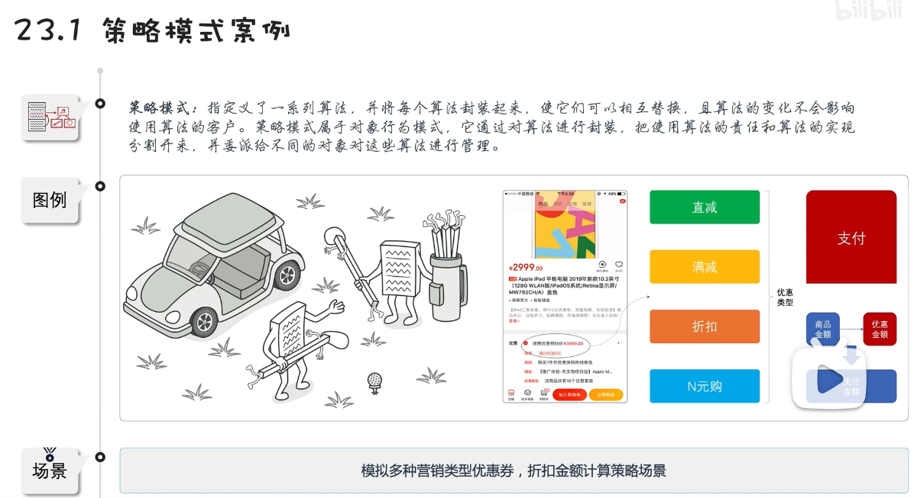

# （9）模板模式（行为模式）

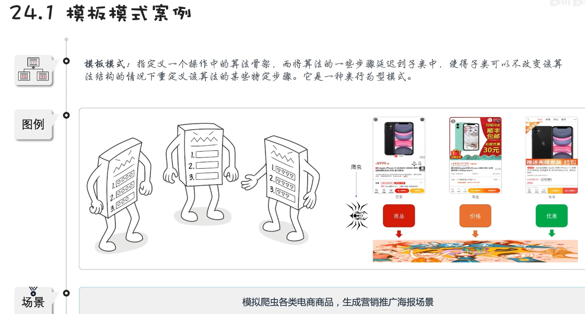

# （10）访问者模式（行为模式）

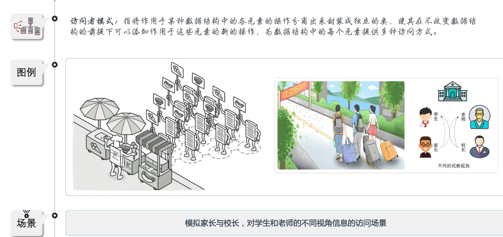
