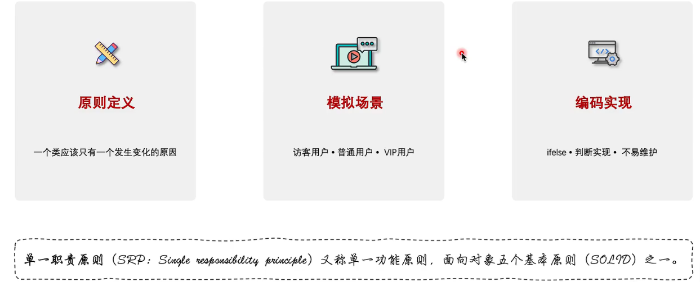
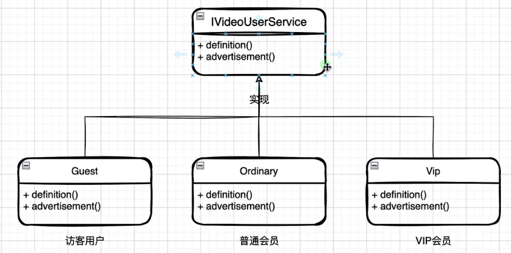
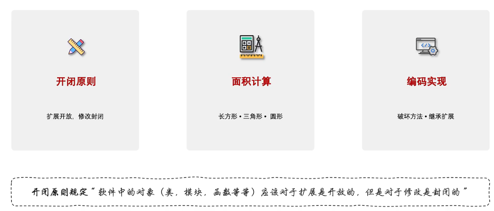
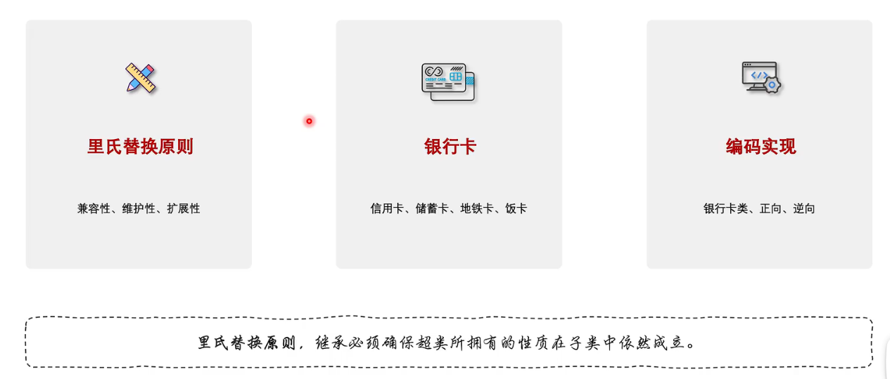
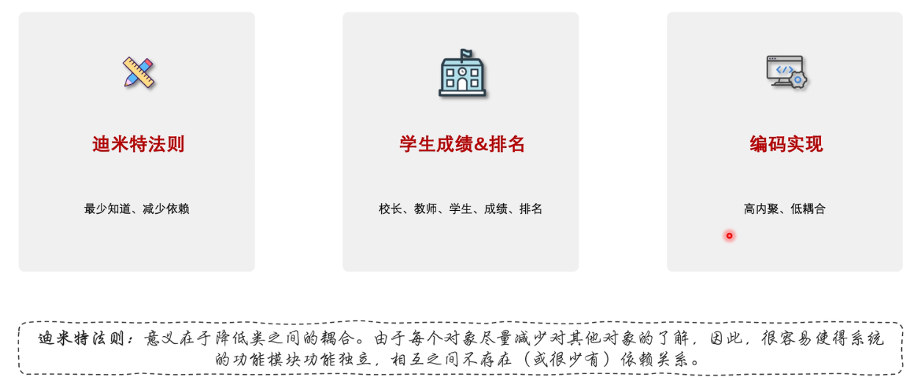

# 1.单一职责原则

单⼀职责( ⼀个类和⽅法只做⼀件事 )



比如：



# 2.开闭原则

开闭原则( 抽象架构，扩展实现 )



# 3.里氏替换原则

⾥⽒替换( 多态，⼦类可扩展⽗类 )



> > **开闭原则和里氏替换原则有什么区别？**
>
> 你可以回答：
>
> > **开闭原则和里氏替换原则关注的侧重点不同。开闭原则强调软件应该对扩展开放、对修改关闭，主要解决系统如何应对需求变化的问题；里氏替换原则则强调子类必须能够替换父类，并且不能破坏父类原有的行为契约，主要解决继承体系的正确性问题。**
> >
> > **两者不是简单的包含或加强关系，但里氏替换原则可以作为实现开闭原则的重要基础。因为只有子类能够安全地替换父类，我们才能通过增加新的子类或实现类来扩展系统，同时不需要修改原有依赖抽象的代码。**
>
> 这个回答在 Java 面试里已经比较完整了。
>
> ### 最后给你压缩成两个关键词
>
> **OCP：**
>
> > **少改代码，靠扩展。**
>
> **LSP：**
>
> > **能替换，不破坏行为。**

案例理解：

> > **子类是否违反了父类/接口对这个方法所做出的行为契约。**
>
> ### 先看我们刚才这个例子
>
> ```
> interface Payment {
>     void pay();
> }
> ```
>
> 然后：
>
> ```
> class FakePayment implements Payment {
>     @Override
>     public void pay() {
>         throw new UnsupportedOperationException();
>     }
> }
> ```
>
> 假设业务代码是：
>
> ```
> public void process(Payment payment) {
>     payment.pay();
> }
> ```
>
> 那么：
>
> ```
> process(new FakePayment());
> ```
>
> 直接抛异常。
>
> **为什么说它可能违反 LSP？**
>
> 因为从 `Payment` 这个抽象的语义来看：
>
> ```
> Payment payment
> payment.pay();
> ```
>
> 调用者有理由认为：
>
> > “既然你给我的是一个 `Payment`，那么它应该能够执行支付这个行为。”
>
> 但 `FakePayment` 实际上告诉调用者：
>
> > “虽然我实现了 `Payment`，但你千万别调用 `pay()`。”
>
> 这就意味着：
>
> ```
> Payment
>   ↓
> 调用 pay() 应该是合法的
>   ↓
> FakePayment
>   ↓
> 调用 pay() 却不支持
> ```
>
> **子类/实现类没有满足抽象类型对调用者形成的行为约定。**
>
> 这才是 LSP 的问题。
>
> ------
>
> ## 但是，“抛异常”本身并不违反 LSP
>
> 这一点非常重要。
>
> 例如：
>
> ```
> interface Payment {
>     void pay();
> }
> ```
>
> 我们规定：
>
> > 如果余额不足，`pay()` 可以抛出 `InsufficientBalanceException`。
>
> 那么：
>
> ```
> class Alipay implements Payment {
>     @Override
>     public void pay() {
>         if (balance < price) {
>             throw new InsufficientBalanceException();
>         }
>     }
> }
> ```
>
> 这**完全可以符合 LSP**。
>
> 因为：
>
> ```
> Payment.pay()
>     ↓
> 允许支付失败并抛出特定异常
>     ↓
> Alipay.pay()
>     ↓
> 按照这个契约执行
> ```
>
> 调用者已经知道：
>
> ```
> try {
>     payment.pay();
> } catch (InsufficientBalanceException e) {
>     // 余额不足
> }
> ```
>
> 所以它没有破坏父类型的行为契约。
>
> ------
>
> # 一个更准确的判断方法
>
> 你以后判断 LSP，不要问：
>
> > “子类有没有抛异常？”
>
> 而应该问：
>
> > **“把子类对象替换成父类对象之后，原来针对父类编写的代码还能不能按照父类的契约正常工作？”**
>
> 比如：
>
> ```
> Payment payment = new Alipay();
> process(payment);
> ```
>
> 原来没问题。
>
> 现在换成：
>
> ```
> Payment payment = new FakePayment();
> process(payment);
> ```
>
> 如果 `process()` 本来合法地调用：
>
> ```
> payment.pay();
> ```
>
> 结果因为 `FakePayment` **根本不支持这个操作**而直接炸掉，那么就说明这个 `FakePayment` 不满足 `Payment` 的契约。
>
> ------
>
> ## 这也解释了“企鹅和鸟”的例子
>
> ```
> class Bird {
>     public void fly() {
>     }
> }
> ```
>
> 然后：
>
> ```
> class Penguin extends Bird {
>     @Override
>     public void fly() {
>         throw new UnsupportedOperationException();
>     }
> }
> ```
>
> 问题不是：
>
> > “企鹅飞不了，所以抛异常。”
>
> 而是：
>
> > **你把“会飞”定义成了 `Bird` 的行为契约，却又让一个不会飞的对象继承这个契约。**
>
> 于是：
>
> ```
> void makeBirdFly(Bird bird) {
>     bird.fly();
> }
> ```
>
> 这个方法针对 `Bird` 是合理的。
>
> 但是：
>
> ```
> makeBirdFly(new Penguin());
> ```
>
> 却失败。
>
> 所以真正的问题是**继承关系建模错误**。
>
> ------
>
> ## 更好的设计
>
> 不要：
>
> ```
> Bird
> ├── Sparrow
> └── Penguin
> ```
>
> 同时让 `Bird` 强制拥有：
>
> ```
> fly()
> ```
>
> 可以拆成：
>
> ```
> interface Bird {
> }
> 
> interface Flyable {
>     void fly();
> }
> ```
>
> 然后：
>
> ```
> class Sparrow implements Bird, Flyable {
>     public void fly() {
>     }
> }
> 
> class Penguin implements Bird {
> }
> ```
>
> 这样：
>
> ```
> void makeBirdFly(Flyable bird) {
>     bird.fly();
> }
> ```
>
> 调用者明确知道：
>
> > 传给我的必须是 `Flyable`。
>
> 于是企鹅根本无法传进去。
>
> ------
>
> ### 所以你现在可以把 LSP 理解得更准确一点：
>
> > **LSP 不是禁止子类抛异常，而是禁止子类在行为上“背叛”父类的契约。**
>
> 甚至可以记一个特别适合面试的判断：
>
> **如果一个父类引用能正常工作的代码，换成某个子类对象后，必须增加特殊判断、特殊处理，甚至直接无法工作，那么这个继承关系就很可能违反了里氏替换原则。**

# 4.迪米特原则

迪⽶特原则( 最少的人知道，降低耦合 )，尽量独立，不要有太多耦合

**迪米特原则（Law of Demeter，LoD）**，也叫**最少知识原则（Least Knowledge Principle）**



说明：

> > **什么是迪米特原则？**
>
> 你可以直接回答：
>
> > **迪米特原则，也叫最少知识原则，核心是一个对象应该尽可能少地了解其他对象，只与自己的直接朋友进行交互，避免通过一个对象层层访问其他对象，从而降低系统的耦合度，提高代码的可维护性。**
>
> 你可以把它和刚才的 **OCP、LSP** 这样记：
>
> > **OCP：少改代码。**
> >
> >  **LSP：子类别搞坏父类契约。**
> >
> >  **LoD：对象别知道太多。**

> ## 注意：迪米特原则 ≠ 禁止所有链式调用
>
> 这一点很重要。
>
> 比如：
>
> ```
> StringBuilder builder = new StringBuilder();
> 
> builder.append("Hello")
>        .append(" World")
>        .append("!");
> ```
>
> 这通常没什么问题。
>
> 因为：
>
> ```
> append()
> ```
>
> 一直是在操作**同一个 StringBuilder 对象**。
>
> 真正危险的是这种：
>
> ```
> a.getB().getC().getD().doSomething();
> ```
>
> 因为你是在**不断穿透对象边界**。
>
> 所以面试的时候不要简单说：
>
> > “迪米特原则就是禁止链式调用。”
>
> 这是不准确的。
>
> 更准确的是：
>
> > **迪米特原则要求一个对象尽量只与直接朋友通信，减少对其他对象内部结构和对象之间关系的了解，从而降低类之间的耦合。**