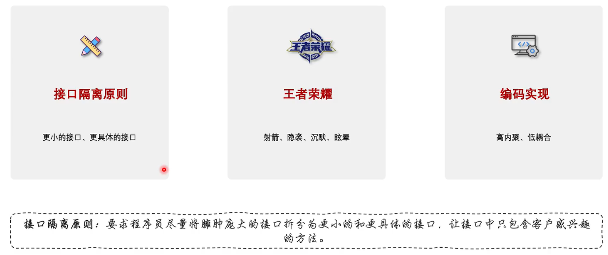
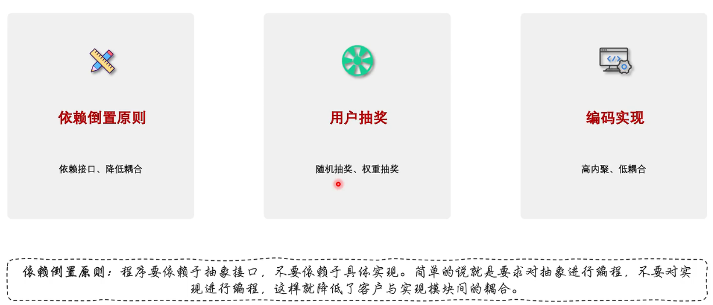

# 1.单一职责原则

单⼀职责( ⼀个类和⽅法只做⼀件事 )


比如：


# 2.开闭原则

开闭原则( 抽象架构，扩展实现 )


# 3.里氏替换原则

⾥⽒替换( 多态，⼦类可扩展⽗类 )


> > **开闭原则和里氏替换原则有什么区别？**
>
> 你可以回答：
>
> > **开闭原则和里氏替换原则关注的侧重点不同。开闭原则强调软件应该对扩展开放、对修改关闭，主要解决系统如何应对需求变化的问题；里氏替换原则则强调子类必须能够替换父类，并且不能破坏父类原有的行为契约，主要解决继承体系的正确性问题。**
> >
> > **两者不是简单的包含或加强关系，但里氏替换原则可以作为实现开闭原则的重要基础。因为只有子类能够安全地替换父类，我们才能通过增加新的子类或实现类来扩展系统，同时不需要修改原有依赖抽象的代码。**
>
> 这个回答在 Java 面试里已经比较完整了。
>
> ### 最后给你压缩成两个关键词
>
> **OCP：**
>
> > **少改代码，靠扩展。**
>
> **LSP：**
>
> > **能替换，不破坏行为。**

案例理解：

> > **子类是否违反了父类/接口对这个方法所做出的行为契约。**
>
> ### 先看我们刚才这个例子
>
> ```
> interface Payment {
>     void pay();
> }
> ```
>
> 然后：
>
> ```
> class FakePayment implements Payment {
>     @Override
>     public void pay() {
>         throw new UnsupportedOperationException();
>     }
> }
> ```
>
> 假设业务代码是：
>
> ```
> public void process(Payment payment) {
>     payment.pay();
> }
> ```
>
> 那么：
>
> ```
> process(new FakePayment());
> ```
>
> 直接抛异常。
>
> **为什么说它可能违反 LSP？**
>
> 因为从 `Payment` 这个抽象的语义来看：
>
> ```
> Payment payment
> payment.pay();
> ```
>
> 调用者有理由认为：
>
> > “既然你给我的是一个 `Payment`，那么它应该能够执行支付这个行为。”
>
> 但 `FakePayment` 实际上告诉调用者：
>
> > “虽然我实现了 `Payment`，但你千万别调用 `pay()`。”
>
> 这就意味着：
>
> ```
> Payment
>   ↓
> 调用 pay() 应该是合法的
>   ↓
> FakePayment
>   ↓
> 调用 pay() 却不支持
> ```
>
> **子类/实现类没有满足抽象类型对调用者形成的行为约定。**
>
> 这才是 LSP 的问题。
>
> ------
>
> ## 但是，“抛异常”本身并不违反 LSP
>
> 这一点非常重要。
>
> 例如：
>
> ```
> interface Payment {
>     void pay();
> }
> ```
>
> 我们规定：
>
> > 如果余额不足，`pay()` 可以抛出 `InsufficientBalanceException`。
>
> 那么：
>
> ```
> class Alipay implements Payment {
>     @Override
>     public void pay() {
>         if (balance < price) {
>             throw new InsufficientBalanceException();
>         }
>     }
> }
> ```
>
> 这**完全可以符合 LSP**。
>
> 因为：
>
> ```
> Payment.pay()
>     ↓
> 允许支付失败并抛出特定异常
>     ↓
> Alipay.pay()
>     ↓
> 按照这个契约执行
> ```
>
> 调用者已经知道：
>
> ```
> try {
>     payment.pay();
> } catch (InsufficientBalanceException e) {
>     // 余额不足
> }
> ```
>
> 所以它没有破坏父类型的行为契约。
>
> ------
>
> # 一个更准确的判断方法
>
> 你以后判断 LSP，不要问：
>
> > “子类有没有抛异常？”
>
> 而应该问：
>
> > **“把子类对象替换成父类对象之后，原来针对父类编写的代码还能不能按照父类的契约正常工作？”**
>
> 比如：
>
> ```
> Payment payment = new Alipay();
> process(payment);
> ```
>
> 原来没问题。
>
> 现在换成：
>
> ```
> Payment payment = new FakePayment();
> process(payment);
> ```
>
> 如果 `process()` 本来合法地调用：
>
> ```
> payment.pay();
> ```
>
> 结果因为 `FakePayment` **根本不支持这个操作**而直接炸掉，那么就说明这个 `FakePayment` 不满足 `Payment` 的契约。
>
> ------
>
> ## 这也解释了“企鹅和鸟”的例子
>
> ```
> class Bird {
>     public void fly() {
>     }
> }
> ```
>
> 然后：
>
> ```
> class Penguin extends Bird {
>     @Override
>     public void fly() {
>         throw new UnsupportedOperationException();
>     }
> }
> ```
>
> 问题不是：
>
> > “企鹅飞不了，所以抛异常。”
>
> 而是：
>
> > **你把“会飞”定义成了 `Bird` 的行为契约，却又让一个不会飞的对象继承这个契约。**
>
> 于是：
>
> ```
> void makeBirdFly(Bird bird) {
>     bird.fly();
> }
> ```
>
> 这个方法针对 `Bird` 是合理的。
>
> 但是：
>
> ```
> makeBirdFly(new Penguin());
> ```
>
> 却失败。
>
> 所以真正的问题是**继承关系建模错误**。
>
> ------
>
> ## 更好的设计
>
> 不要：
>
> ```
> Bird
> ├── Sparrow
> └── Penguin
> ```
>
> 同时让 `Bird` 强制拥有：
>
> ```
> fly()
> ```
>
> 可以拆成：
>
> ```
> interface Bird {
> }
> 
> interface Flyable {
>     void fly();
> }
> ```
>
> 然后：
>
> ```
> class Sparrow implements Bird, Flyable {
>     public void fly() {
>     }
> }
> 
> class Penguin implements Bird {
> }
> ```
>
> 这样：
>
> ```
> void makeBirdFly(Flyable bird) {
>     bird.fly();
> }
> ```
>
> 调用者明确知道：
>
> > 传给我的必须是 `Flyable`。
>
> 于是企鹅根本无法传进去。
>
> ------
>
> ### 所以你现在可以把 LSP 理解得更准确一点：
>
> > **LSP 不是禁止子类抛异常，而是禁止子类在行为上“背叛”父类的契约。**
>
> 甚至可以记一个特别适合面试的判断：
>
> **如果一个父类引用能正常工作的代码，换成某个子类对象后，必须增加特殊判断、特殊处理，甚至直接无法工作，那么这个继承关系就很可能违反了里氏替换原则。**

# 4.迪米特原则

迪⽶特原则( 最少的人知道，降低耦合 )，尽量独立，不要有太多耦合

**迪米特原则（Law of Demeter，LoD）**，也叫**最少知识原则（Least Knowledge Principle）**

一个对象应该尽量少知道其他对象，尤其不要深入了解其他对象的内部结构和对象关系。

每个对象都有自己的边界，对象之间通过有限的、明确的接口进行协作，而不是互相钻进内部结构。


说明：

> > **什么是迪米特原则？**
>
> 你可以直接回答：
>
> > **迪米特原则，也叫最少知识原则，核心是一个对象应该尽可能少地了解其他对象，只与自己的直接朋友进行交互，避免通过一个对象层层访问其他对象，从而降低系统的耦合度，提高代码的可维护性。**
>
> 你可以把它和刚才的 **OCP、LSP** 这样记：
>
> > **OCP：少改代码。**
> >
> >  **LSP：子类别搞坏父类契约。**
> >
> >  **LoD：对象别知道太多。**

具体案例：

> ## 1. 先用一个非常直观的例子理解
>
> 假设你要让一个学生提交作业。
>
> ### 不好的写法
>
> ```
> student.getSchool()
>        .getDepartment()
>        .getTeacher()
>        .getPrinter()
>        .print(homework);
> ```
>
> 这里 `Student` 直接：
>
> - 找 School
> - 找 Department
> - 找 Teacher
> - 找 Printer
> - 最后调用 Printer
>
> 也就是说，`Student` **知道太多了**。
>
> 它必须知道：
>
> > 学校里面有学院，学院里面有老师，老师又有打印机。
>
> 如果以后结构变成：
>
> ```
> Student
>   ↓
> School
>   ↓
> Department
>   ↓
> Office
>   ↓
> Printer
> ```
>
> 那 `Student` 的代码就可能要跟着修改。
>
> ------
>
> ## 2. 迪米特原则希望你怎么做？
>
> 让 `Student` 只告诉自己的直接朋友：
>
> ```
> student.submitHomework(homework);
> ```
>
> 然后内部怎么处理，由 `Student` 或其他对象自己负责：
>
> ```
> class Student {
> 
>     private Teacher teacher;
> 
>     public void submitHomework(Homework homework) {
>         teacher.printHomework(homework);
>     }
> }
> ```
>
> Student 不需要知道：
>
> ```
> Teacher
>    ↓
> Office
>    ↓
> Printer
> ```
>
> 它只需要知道：
>
> > **“我要提交作业，Teacher 能帮我处理。”**
>
> 至于 Teacher 后面怎么实现，Student 不关心。
>
> ------
>
> # 3. 所谓“朋友”到底是什么？
>
> 这是迪米特原则比较容易被面试官追问的地方。
>
> 一个对象通常可以直接使用：
>
> ### ① 自己本身
>
> ```
> this.doSomething();
> ```
>
> ### ② 自己的成员对象
>
> ```
> class Student {
>     private Teacher teacher;
> 
>     public void submit() {
>         teacher.teach();
>     }
> }
> ```
>
> Teacher 是 Student 的直接成员，因此可以直接交互。
>
> ### ③ 方法参数
>
> ```
> public void submit(Teacher teacher) {
>     teacher.teach();
> }
> ```
>
> ### ④ 方法内部创建的对象
>
> ```
> public void test() {
>     Teacher teacher = new Teacher();
>     teacher.teach();
> }
> ```
>
> 这些一般都可以认为是“直接朋友”。
>
> ------
>
> # 4. 最典型的反例：链式调用
>
> 你以后写 Java 很容易遇到这种东西：
>
> ```
> user.getDepartment()
>     .getManager()
>     .getCompany()
>     .getAddress()
>     .getCity();
> ```
>
> 这就是迪米特原则经常用来批评的场景。
>
> 因为 `user` 实际上知道了：
>
> ```
> User
>  ↓
> Department
>  ↓
> Manager
>  ↓
> Company
>  ↓
> Address
>  ↓
> City
> ```
>
> 也就是：
>
> > **对象之间的耦合链太长。**
>
> 如果 `Manager` 内部结构改变：
>
> ```
> manager.getCompany()
> ```
>
> 变成：
>
> ```
> manager.getOrganization()
> ```
>
> 那么调用链上的代码都可能受到影响。
>
> ------
>
> # 5. 怎么改？
>
> 可以让对象自己提供需要的行为。
>
> 比如原来：
>
> ```
> user.getDepartment()
>     .getManager()
>     .getName();
> ```
>
> 可以改成：
>
> ```
> user.getManagerName();
> ```
>
> 内部：
>
> ```
> class User {
> 
>     private Department department;
> 
>     public String getManagerName() {
>         return department.getManagerName();
>     }
> }
> ```
>
> Department：
>
> ```
> class Department {
> 
>     private Manager manager;
> 
>     public String getManagerName() {
>         return manager.getName();
>     }
> }
> ```
>
> 这样调用者只知道：
>
> ```
> user.getManagerName();
> ```
>
> 而不知道内部到底：
>
> ```
> User
>  → Department
>  → Manager
>  → name
> ```
>
> ------
>
> # 6. 所以迪米特原则的核心其实是“降低耦合”
>
> 你可以把它和前面几个原则串起来理解：
>
> | 原则                 | 主要解决什么问题                 |
> | -------------------- | -------------------------------- |
> | **单一职责原则 SRP** | 一个类不要承担太多职责           |
> | **开闭原则 OCP**     | 修改需求时尽量不要修改已有代码   |
> | **里氏替换原则 LSP** | 子类必须能够正确替换父类         |
> | **迪米特原则 LoD**   | 对象之间不要知道太多，降低耦合   |
> | **依赖倒置原则 DIP** | 不要过度依赖具体实现，应依赖抽象 |
>
> 尤其是：
>
> > **迪米特原则关注的是“对象知道多少”。**
>
> 这是它最重要的关键词。
>
> ------
>
> ## 7. 和封装有什么区别？
>
> 你可能会觉得：
>
> > “这不就是封装吗？”
>
> 确实非常接近，但关注点不同。
>
> ### 封装
>
> 强调：
>
> > **不要直接暴露对象内部的数据和实现细节。**
>
> 比如：
>
> ```
> class User {
> 
>     private String password;
> 
>     public String getPassword() {
>         ...
>     }
> }
> ```
>
> ------
>
> ### 迪米特原则
>
> 进一步强调：
>
> > **即使这些对象提供了公开方法，我也不要让调用者一路深入对象内部结构。**
>
> 例如：
>
> ```
> user.getDepartment()
>     .getManager()
>     .getCompany()
>     .getAddress();
> ```
>
> 这些方法可能全部都是 `public`，从“封装”的角度没有问题。
>
> 但从**迪米特原则**来看：
>
> > `User` 对 `Department → Manager → Company → Address` 的内部关系知道得太多了。
>
> ------
>
> # 8. 一个特别好记的比喻
>
> 把对象想成公司员工。
>
> 你去找员工 A 办事情。
>
> 不应该是：
>
> > “A，你把你办公室的抽屉打开，把里面的文件拿出来，然后去找 B，B 再打开他的电脑，找到 C 的文件……”
>
> 而应该是：
>
> > **“A，帮我把这件事情处理一下。”**
>
> 你只需要知道 **A 能提供什么服务**，而不需要知道 A 背后的组织结构。
>
> 这就是：
>
> > **少知道一点，少耦合一点。**
>
> ------
>
> ## 9. 但是注意：迪米特原则 ≠ 禁止所有链式调用
>
> 这一点很重要。
>
> 比如：
>
> ```
> StringBuilder builder = new StringBuilder();
> 
> builder.append("Hello")
>        .append(" World")
>        .append("!");
> ```
>
> 这通常没什么问题。
>
> 因为：
>
> ```
> append()
> ```
>
> 一直是在操作**同一个 StringBuilder 对象**。
>
> 真正危险的是这种：
>
> ```
> a.getB().getC().getD().doSomething();
> ```
>
> 因为你是在**不断穿透对象边界**。
>
> 所以面试的时候不要简单说：
>
> > “迪米特原则就是禁止链式调用。”
>
> 这是不准确的。
>
> 更准确的是：
>
> > **迪米特原则要求一个对象尽量只与直接朋友通信，减少对其他对象内部结构和对象之间关系的了解，从而降低类之间的耦合。**
>
> ### 面试版一句话
>
> 如果面试官问：
>
> > **什么是迪米特原则？**
>
> 你可以直接回答：
>
> > **迪米特原则，也叫最少知识原则，核心是一个对象应该尽可能少地了解其他对象，只与自己的直接朋友进行交互，避免通过一个对象层层访问其他对象，从而降低系统的耦合度，提高代码的可维护性。**
>
> 你可以把它和刚才的 **OCP、LSP** 这样记：
>
> > **OCP：少改代码。**
> >
> >  **LSP：子类别搞坏父类契约。**
> >
> >  **LoD：对象别知道太多。**

# 5.接口隔离原则

接⼝隔离( 建⽴单⼀接⼝ )



> 句话先记住：
>
> > **不要让一个类被迫依赖它用不到的接口方法。**
>
> 或者更通俗一点：
>
> > **接口不要设计得太“胖”，应该拆成多个职责单一、针对性更强的小接口。**
>
> > **什么是接口隔离原则？**
>
> 可以回答：
>
> > **接口隔离原则是指客户端不应该被迫依赖它不需要的接口方法。实际开发中应该将庞大、职责过多的接口拆分成多个粒度更小、职责更明确的接口，让不同的实现类只依赖和实现自己需要的功能，从而减少不必要的耦合。**

案例：

> ## 1. 先看一个典型反例
>
> 假设我们设计一个动物接口：
>
> ```
> interface Animal {
>     void eat();
>     void sleep();
>     void fly();
>     void swim();
> }
> ```
>
> 现在有：
>
> ```
> class Dog implements Animal {
> 
>     public void eat() {
>         System.out.println("狗吃饭");
>     }
> 
>     public void sleep() {
>         System.out.println("狗睡觉");
>     }
> 
>     public void fly() {
>         throw new UnsupportedOperationException();
>     }
> 
>     public void swim() {
>         throw new UnsupportedOperationException();
>     }
> }
> ```
>
> 问题来了：
>
> **Dog 根本不会飞。**
>
> 但是因为 `Animal` 接口规定：
>
> ```
> void fly();
> ```
>
> 所以 Dog **被迫实现**：
>
> ```
> public void fly() {
>     throw new UnsupportedOperationException();
> }
> ```
>
> 这就是接口设计出了问题。
>
> ------
>
> # 2. 怎么改？
>
> 把一个“大接口”拆成多个“小接口”。
>
> ```
> interface Animal {
>     void eat();
>     void sleep();
> }
> 
> interface Flyable {
>     void fly();
> }
> 
> interface Swimmable {
>     void swim();
> }
> ```
>
> 然后：
>
> ```
> class Dog implements Animal, Swimmable {
> 
>     public void eat() {}
> 
>     public void sleep() {}
> 
>     public void swim() {}
> }
> ```
>
> 鸟：
>
> ```
> class Bird implements Animal, Flyable {
> 
>     public void eat() {}
> 
>     public void sleep() {}
> 
>     public void fly() {}
> }
> ```
>
> 鱼：
>
> ```
> class Fish implements Animal, Swimmable {
> 
>     public void eat() {}
> 
>     public void sleep() {}
> 
>     public void swim() {}
> }
> ```
>
> 这样就合理了。
>
> ------
>
> # 3. 它到底在解决什么问题？
>
> 核心其实是：
>
> > **减少不必要的依赖。**
>
> 原来：
>
> ```
> Animal
> ├── eat()
> ├── sleep()
> ├── fly()
> └── swim()
> ```
>
> 导致：
>
> ```
> Dog
>  ↓
> Animal
>  ↓
> eat
> sleep
> fly ← Dog根本不需要
> swim ← Dog根本不需要
> ```
>
> Dog 对 Animal 的依赖太重。
>
> 拆开以后：
>
> ```
> Animal
> ├── eat()
> └── sleep()
> 
> Flyable
> └── fly()
> 
> Swimmable
> └── swim()
> ```
>
> Dog 只依赖：
>
> ```
> Dog
>  ↓
> Animal
>  ↓
> eat()
> sleep()
> ```
>
> 以及自己需要的：
>
> ```
> Dog
>  ↓
> Swimmable
>  ↓
> swim()
> ```
>
> **不需要的东西就不依赖。**
>
> 这就是接口隔离。
>
> ------
>
> # 4. 为什么叫“接口隔离”？
>
> 因为我们把一个庞大的接口：
>
> ```
> interface Animal {
>     void eat();
>     void sleep();
>     void fly();
>     void swim();
>     void run();
> }
> ```
>
> 隔离成多个更细粒度的接口：
>
> ```
> interface Eatable {
>     void eat();
> }
> 
> interface Sleepable {
>     void sleep();
> }
> 
> interface Flyable {
>     void fly();
> }
> 
> interface Swimmable {
>     void swim();
> }
> 
> interface Runnable {
>     void run();
> }
> ```
>
> 不同的类根据自己的能力选择实现哪些接口：
>
> ```
> class Dog implements Eatable, Sleepable, Swimmable, Runnable {
> }
> class Bird implements Eatable, Sleepable, Flyable, Runnable {
> }
> class Fish implements Eatable, Sleepable, Swimmable {
> }
> ```
>
> 这就是：
>
> > **把接口“隔离”成客户端真正需要的部分。**
>
> ------
>
> # 5. 和单一职责原则有什么区别？
>
> 这个非常容易混。
>
> ### 单一职责原则 SRP
>
> 关注：
>
> > **一个类应该承担多少职责？**
>
> 比如：
>
> ```
> class UserService {
>     // 注册
>     // 登录
>     // 发送邮件
>     // 生成报表
>     // 数据备份
> }
> ```
>
> 这个类职责太多。
>
> ------
>
> ### 接口隔离原则 ISP
>
> 关注：
>
> > **一个接口应该包含多少方法，以及实现类是否被迫依赖不需要的方法？**
>
> 比如：
>
> ```
> interface Worker {
>     void work();
>     void eat();
>     void sleep();
> }
> ```
>
> 如果：
>
> ```
> class Robot implements Worker
> ```
>
> 那么 Robot 就被迫实现：
>
> ```
> eat();
> sleep();
> ```
>
> 但机器人根本不需要这两个方法。
>
> 所以应该拆接口。
>
> ------
>
> ## 6. 和里氏替换原则也有一个很有意思的关系
>
> 你刚刚问过 LSP。
>
> 还记得这个例子吗？
>
> ```
> class Bird {
>     void fly() {}
> }
> 
> class Penguin extends Bird {
>     @Override
>     void fly() {
>         throw new UnsupportedOperationException();
>     }
> }
> ```
>
> 这里同时涉及 **LSP + ISP**。
>
> ### 从 LSP 看
>
> 企鹅不能正确履行：
>
> ```
> Bird.fly()
> ```
>
> 所以：
>
> > Penguin 不能很好地替换 Bird。
>
> ------
>
> ### 从 ISP 看
>
> 问题的根源之一是：
>
> > **Bird 这个抽象把 `fly()` 强行塞给了所有 Bird。**
>
> 更好的设计：
>
> ```
> interface Bird {
> }
> 
> interface Flyable {
>     void fly();
> }
> 
> class Sparrow implements Bird, Flyable {
>     public void fly() {}
> }
> 
> class Penguin implements Bird {
> }
> ```
>
> 于是：
>
> ```
> Bird
>    ↑
> Penguin
> 
> Bird + Flyable
>    ↑
> Sparrow
> ```
>
> 企鹅根本不需要依赖 `Flyable`。
>
> 所以你可以发现：
>
> > **ISP 可以帮助我们设计出更合理的抽象，从而避免很多 LSP 问题。**
>
> ------
>
> # 7. 一个更接近实际开发的例子
>
> 比如一个系统设计了：
>
> ```
> interface UserService {
> 
>     void register();
> 
>     void login();
> 
>     void logout();
> 
>     void changePassword();
> 
>     void sendEmail();
> 
>     void exportExcel();
> 
>     void deleteUser();
> 
> }
> ```
>
> 然后：
>
> ```
> class MobileUserService implements UserService {
>     // ...
> }
> ```
>
> 移动端实际上只需要：
>
> ```
> register
> login
> logout
> changePassword
> ```
>
> 却被迫依赖：
>
> ```
> sendEmail
> exportExcel
> deleteUser
> ```
>
> 这就是**胖接口（Fat Interface）**。
>
> 可以拆成：
>
> ```
> interface UserAuth {
>     void register();
>     void login();
>     void logout();
> }
> 
> interface PasswordService {
>     void changePassword();
> }
> 
> interface EmailService {
>     void sendEmail();
> }
> 
> interface ExportService {
>     void exportExcel();
> }
> 
> interface UserManagement {
>     void deleteUser();
> }
> ```
>
> 不同客户端依赖自己需要的接口。
>
> ------
>
> # 8. 你可以用一个判断标准快速判断 ISP
>
> 看到一个接口：
>
> ```
> interface XXX {
>     A();
>     B();
>     C();
>     D();
> }
> ```
>
> 然后看到：
>
> ```
> class YYY implements XXX
> ```
>
> 但：
>
> ```
> YYY
>   ↓
> 不需要 C()
> 不需要 D()
> ```
>
> 甚至出现：
>
> ```
> public void C() {
>     throw new UnsupportedOperationException();
> }
> ```
>
> 这时候就应该警惕：
>
> > **这个接口可能违反接口隔离原则。**
>
> 当然，**出现 `UnsupportedOperationException` 并不意味着必然违反 ISP**，还是要看接口设计是否迫使实现类依赖它不需要的能力。
>
> ------
>
> # 9. 把 SOLID 五个原则串起来
>
> 你现在已经问了其中几个，可以形成一个非常清晰的框架：
>
> | 原则           | 核心问题                       | 记忆关键词         |
> | -------------- | ------------------------------ | ------------------ |
> | **S 单一职责** | 一个类是不是干太多事情？       | **职责少**         |
> | **O 开闭原则** | 新需求是不是总要修改旧代码？   | **少修改，多扩展** |
> | **L 里氏替换** | 子类能不能真正替换父类？       | **行为一致**       |
> | **I 接口隔离** | 类是不是被迫依赖不需要的方法？ | **接口小而专**     |
> | **D 依赖倒置** | 是不是过度依赖具体实现？       | **依赖抽象**       |
>
> 其中 **ISP 和 DIP** 很容易一起出现：
>
> > **ISP：我不要一个什么都有的大接口。**
> >  **DIP：我应该依赖抽象接口，而不是具体实现。**
>
> ------
>
> ### 面试版回答
>
> 如果面试官问：
>
> > **什么是接口隔离原则？**
>
> 可以回答：
>
> > **接口隔离原则是指客户端不应该被迫依赖它不需要的接口方法。实际开发中应该将庞大、职责过多的接口拆分成多个粒度更小、职责更明确的接口，让不同的实现类只依赖和实现自己需要的功能，从而减少不必要的耦合。**

# 6.依赖倒置原则

依赖倒置( 细节依赖抽象，下层依赖上层 )



> **“什么是依赖倒置原则？”**

你可以回答：

> **依赖倒置原则是指高层模块不应该直接依赖低层模块，二者都应该依赖抽象；同时抽象不应该依赖具体实现，具体实现应该依赖抽象。在 Java 中通常通过接口和依赖注入实现，使业务代码与具体技术实现解耦，提高系统的可扩展性和可维护性。**

具体的详细案例：

> # 1. 先看最简单的例子
>
> 假设我们有一个订单服务：
>
> class OrderService {
>
> ​    private MySQLDatabase database = new MySQLDatabase();
>
> ​    public void createOrder() {
> ​        database.save();
> ​    }
> }
>
> 这里：
>
> ```
> OrderService
>      ↓
> MySQLDatabase
> ```
>
> `OrderService` **直接依赖了具体的 MySQLDatabase**。
>
> 问题是：
>
> > 如果以后数据库从 MySQL 换成 Redis、MongoDB，怎么办？
>
> 可能要修改：
>
> ```
> class OrderService
> ```
>
> 比如：
>
> ```
> private MongoDB database = new MongoDB();
> ```
>
> 这意味着：
>
> > **业务层被底层实现绑死了。**
>
> ------
>
> # 2. 依赖倒置怎么解决？
>
> 先定义一个抽象：
>
> ```
> interface Database {
>     void save();
> }
> ```
>
> 然后 MySQL 实现这个接口：
>
> ```
> class MySQLDatabase implements Database {
> 
>     @Override
>     public void save() {
>         System.out.println("保存到 MySQL");
>     }
> }
> ```
>
> OrderService 不再依赖 MySQL：
>
> ```
> class OrderService {
> 
>     private Database database;
> 
>     public OrderService(Database database) {
>         this.database = database;
>     }
> 
>     public void createOrder() {
>         database.save();
>     }
> }
> ```
>
> 现在关系变成：
>
> ```
>         Database
>         ↑      ↑
>         │      │
> MySQLDatabase  MongoDB
>         ↑
>         │
>  OrderService
> ```
>
> 更准确地说：
>
> ```
> OrderService ─────→ Database ←──── MySQLDatabase
>                               ←──── MongoDB
> ```
>
> **OrderService 只知道 Database 这个抽象，不知道具体是 MySQL 还是 MongoDB。**
>
> 这就是依赖倒置。
>
> ------
>
> # 3. 为什么叫“倒置”？
>
> 这个名字其实很有意思。
>
> 原来：
>
> ```
> 高层业务
>    ↓
> 低层实现
> ```
>
> 比如：
>
> ```
> OrderService
>      ↓
> MySQLDatabase
> ```
>
> 传统的依赖关系是：
>
> > **上层依赖下层。**
>
> ------
>
> DIP 之后：
>
> ```
> 高层业务       低层实现
>     ↓             ↓
>     └──→ 抽象 ←───┘
> ```
>
> 变成：
>
> ```
> OrderService
>      ↓
>   Database
>      ↑
> MySQLDatabase
> ```
>
> 注意：
>
> **MySQLDatabase 也开始依赖 Database 这个抽象。**
>
> 所以原来的：
>
> ```
> OrderService → MySQLDatabase
> ```
>
> 变成：
>
> ```
> OrderService → Database ← MySQLDatabase
> ```
>
> 依赖关系发生了“倒置”。
>
> 所以叫：
>
> > **依赖倒置原则。**
>
> ------
>
> # 4. 这里有一个非常重要的概念：高层模块和低层模块
>
> 这是面试可能会问的。
>
> ### 高层模块
>
> 负责：
>
> > **业务规则、业务逻辑。**
>
> 比如：
>
> ```
> OrderService
> PaymentService
> UserService
> ```
>
> ------
>
> ### 低层模块
>
> 负责：
>
> > **具体技术实现。**
>
> 比如：
>
> ```
> MySQLDatabase
> RedisDatabase
> AlipayPayment
> WechatPayment
> EmailSender
> ```
>
> DIP 希望：
>
> ```
> 高层业务
>     ↓
> 抽象接口
>     ↑
> 底层实现
> ```
>
> 而不是：
>
> ```
> 高层业务
>     ↓
> 具体技术
> ```
>
> ------
>
> # 5. 这其实就是你之前学的“面向接口编程”
>
> 例如：
>
> ```
> List<String> list = new ArrayList<>();
> ```
>
> 而不是：
>
> ```
> ArrayList<String> list = new ArrayList<>();
> ```
>
> 这里：
>
> ```
> List
>  ↑
> ArrayList
> ```
>
> `List` 是抽象，`ArrayList` 是具体实现。
>
> 业务代码尽量使用：
>
> ```
> List
> ```
>
> 而不是到处写死：
>
> ```
> ArrayList
> ```
>
> 这样以后可以很方便地换：
>
> ```
> List<String> list = new LinkedList<>();
> ```
>
> 调用方不需要大规模修改。
>
> ------
>
> # 6. Spring 为什么特别强调依赖注入？
>
> 这就和你之前学的 Spring 联系起来了。
>
> 比如：
>
> ```
> @Service
> public class OrderService {
> 
>     private final PaymentService paymentService;
> 
>     public OrderService(PaymentService paymentService) {
>         this.paymentService = paymentService;
>     }
> }
> ```
>
> 然后：
>
> ```
> public interface PaymentService {
>     void pay();
> }
> ```
>
> 具体实现：
>
> ```
> @Service
> public class AlipayService implements PaymentService {
> 
>     @Override
>     public void pay() {
>         System.out.println("支付宝支付");
>     }
> }
> ```
>
> OrderService：
>
> ```
> OrderService
>       ↓
> PaymentService
>       ↑
> AlipayService
> ```
>
> OrderService **不负责创建 AlipayService**。
>
> 而是由 Spring 把具体实现注入进来。
>
> 这就是：
>
> > **依赖抽象，而不是依赖具体实现。**
>
> 而 Spring 的**依赖注入（DI）**，正是实现 DIP 的一种非常典型的技术手段。
>
> ------
>
> # 7. DIP 和 ISP 的区别
>
> 你刚刚问了接口隔离原则，所以这两个放在一起非常容易混。
>
> ### ISP：接口不要太胖
>
> 解决的是：
>
> > **“我依赖的接口是不是塞了很多我根本不需要的方法？”**
>
> 比如：
>
> ```
> interface Worker {
>     void work();
>     void eat();
>     void sleep();
> }
> ```
>
> Robot 不需要 `eat()` 和 `sleep()`。
>
> 所以：
>
> > **拆接口。**
>
> ------
>
> ### DIP：不要依赖具体实现
>
> 解决的是：
>
> > **“我的业务代码是不是直接依赖了某个具体实现？”**
>
> 比如：
>
> ```
> class OrderService {
>     private MySQLDatabase database;
> }
> ```
>
> 应该：
>
> ```
> class OrderService {
>     private Database database;
> }
> ```
>
> 所以：
>
> > **依赖抽象。**
>
> ------
>
> # 8. DIP 和 OCP 也有很强的关系
>
> 你之前问过**开闭原则 OCP**。
>
> 比如：
>
> ```
> interface Payment {
>     void pay();
> }
> ```
>
> 然后：
>
> ```
> class Alipay implements Payment {}
> class WechatPay implements Payment {}
> class UnionPay implements Payment {}
> ```
>
> 业务代码：
>
> ```
> class OrderService {
> 
>     private Payment payment;
> 
>     public void pay() {
>         payment.pay();
>     }
> }
> ```
>
> 以后增加：
>
> ```
> class ApplePay implements Payment {}
> ```
>
> `OrderService` **不用修改**。
>
> 这同时体现了：
>
> ### DIP
>
> ```
> OrderService
>       ↓
>    Payment
> ```
>
> OrderService 依赖抽象。
>
> ### OCP
>
> 新增：
>
> ```
> ApplePay
> ```
>
> 只需要扩展：
>
> ```
> class ApplePay implements Payment
> ```
>
> 不需要修改 `OrderService`。
>
> 所以你可以把它们理解成：
>
> > **DIP 为 OCP 提供了一种非常重要的实现基础。**
>
> ------
>
> # 9. 但这里有一个容易误解的地方
>
> **依赖抽象 ≠ 所有东西都必须创建一个接口。**
>
> 比如：
>
> ```
> class User {
>     private String name;
> }
> ```
>
> 没必要为了 DIP 搞一个：
>
> ```
> interface StringProvider {}
> ```
>
> 这会导致过度设计。
>
> DIP 真正关注的是：
>
> > **存在变化可能、业务层与具体技术实现之间存在耦合时，让高层模块依赖稳定的抽象。**
>
> 所以实际项目中通常是：
>
> ```
> 业务层
>   ↓
> 接口/抽象
>   ↓
> 具体实现
> ```
>
> 特别适用于：
>
> - 数据库
> - 缓存
> - 消息队列
> - 第三方支付
> - 文件存储
> - 邮件服务
> - AI 模型/LLM Provider
> - 外部 API
>
> 这些东西都有可能发生替换。
>
> ------
>
> # 10. 最后把 SOLID 串起来
>
> 现在你已经连续问完 SOLID 五个原则，可以用下面这张“脑图”记：
>
> ```
>                     SOLID
>                       │
>        ┌──────────────┼──────────────┐
>        ↓              ↓              ↓
>       SRP            OCP            LSP
>    单一职责         开闭原则        里氏替换
>    职责不要多       少改旧代码      子类别破坏契约
>        │
>        ↓
>       ISP
>    接口隔离
>    接口不要胖
>        │
>        ↓
>       DIP
>    依赖倒置
>    依赖抽象
> ```
>
> 更简单地记：
>
> ### S：单一职责:**类不要管太多事情。**
>
> ```
> 一个类
>  ↓
> 一个核心职责(可以多个方法)
> ```
>
> ### O：开闭原则:**需求变化时，尽量通过扩展解决，而不是修改原代码。**
>
> ### L：里氏替换:**子类必须能够遵守父类的行为契约。**
>
> ### I：接口隔离:**类不要被迫依赖自己不需要的接口方法。**
>
> ### D：依赖倒置:**业务代码不要绑死具体实现，要依赖抽象。**
>
> 你甚至可以把 **S 和 I** 直接记成：
>
> > **S：类的职责要专一。**
> >
> >  **I：接口的功能要专一。**

# 7.总结和辨析

**（1）接口隔离和单一职责有什么区别？**

> **单一职责原则 SRP：一个类不要承担太多职责。**
>
>  **接口隔离原则 ISP：一个类不要被迫依赖它不需要的接口方法。**

案例理解：

> ## 1. 先看它们分别在管什么
>
> ### 单一职责原则：管“类”
>
> 问的是：
>
> > **这个类是不是承担了多个不同的职责？**
>
> 例如：
>
> ```
> class UserService {
> 
>     void register() {
>     }
> 
>     void login() {
>     }
> 
>     void sendEmail() {
>     }
> 
>     void generateReport() {
>     }
> }
> ```
>
> 这个类同时负责：
>
> ```
> UserService
> ├── 用户注册
> ├── 用户登录
> ├── 邮件发送
> └── 报表生成
> ```
>
> 职责明显比较杂。
>
> SRP 会建议拆成：
>
> ```
> class UserService {
>     void register() {}
>     void login() {}
> }
> 
> class EmailService {
>     void sendEmail() {}
> }
> 
> class ReportService {
>     void generateReport() {}
> }
> ```
>
> 所以：
>
> > **SRP 关注“一个类应该负责什么”。**
>
> ------
>
> # 2. 接口隔离原则：管“接口”
>
> 例如：
>
> ```
> interface Worker {
> 
>     void work();
> 
>     void eat();
> 
>     void sleep();
> }
> ```
>
> 然后：
>
> ```
> class Robot implements Worker {
> 
>     public void work() {
>     }
> 
>     public void eat() {
>         throw new UnsupportedOperationException();
>     }
> 
>     public void sleep() {
>         throw new UnsupportedOperationException();
>     }
> }
> ```
>
> Robot 只需要：
>
> ```
> work()
> ```
>
> 却被迫实现：
>
> ```
> eat()
> sleep()
> ```
>
> 所以 ISP 要求：
>
> ```
> interface Workable {
>     void work();
> }
> 
> interface Eatable {
>     void eat();
> }
> 
> interface Sleepable {
>     void sleep();
> }
> ```
>
> 然后：
>
> ```
> class Robot implements Workable {
>     public void work() {}
> }
> ```
>
> 因此：
>
> > **ISP 关注“一个类应该依赖接口中的哪些方法”。**
>
> ------
>
> # 3. 两者最大的区别
>
> 可以直接看这个表：
>
> |          | 单一职责原则 SRP         | 接口隔离原则 ISP               |
> | -------- | ------------------------ | ------------------------------ |
> | 主要对象 | **类**                   | **接口**                       |
> | 核心问题 | 类是不是承担了太多职责？ | 类是不是被迫依赖不需要的方法？ |
> | 拆什么   | **拆类/职责**            | **拆接口**                     |
> | 关键词   | **职责**                 | **依赖**                       |
> | 典型问题 | 一个类什么都干           | 一个接口什么都有               |
>
> 所以你可以形成一个非常简单的判断：
>
> ```
> “这个类干的事情太多”
>         ↓
>        SRP
> 
> “这个接口方法太多，某些实现类根本用不到”
>         ↓
>        ISP
> ```